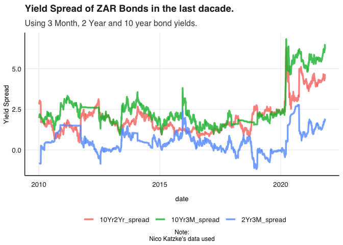

Financial Econometrics Practical

# Outline

This Readme will outline all the following questions by means of
explaining, interpreting and reasoning through all the necessary code
and functions, whereafter a simplified output will be reproduced within
each respective question folders.

First, I sanitize my working environment and source all the necessary
functions that will be incorporated into our analyses.

Now I procceed with the respective questions.

# Question 1: Yield Spread.

Since the beginning of 2020 the current Yield spreads in local mid to
longer dated bond yields have been the highest in decades. This is
conventionally expressed as the difference in these yields of these
instruments in percentage points or basis points.

    ## Loading required package: xts

    ## Loading required package: zoo

    ## 
    ## Attaching package: 'zoo'

    ## The following objects are masked from 'package:base':
    ## 
    ##     as.Date, as.Date.numeric

    ## 
    ## Attaching package: 'xts'

    ## The following objects are masked from 'package:dplyr':
    ## 
    ##     first, last

    ## 
    ## Attaching package: 'PerformanceAnalytics'

    ## The following object is masked from 'package:graphics':
    ## 
    ##     legend

 we notice
several places where rates stagnate and thus check for missing values in
the data.

it appears that all the data is present.

Now at first glance an immediate divergence can be observed between the
three bond yields, specifically with the three-month and two-year yields
diverging from the longer 10 year bond yield. Before investigating this
from an economic and quantitative perspective it is worth investigating
it more formally.

``` r
bond_Adj_yield <- SA_bonds %>%
    arrange(date) %>% 
mutate("10Yr2Yr_spread" = ZA_10Yr - ZA_2Yr,"10Yr3M_spread" = ZA_10Yr - SA_3M,"2Yr3M_spread" = ZA_2Yr - SA_3M ) %>% select(date, "10Yr3M_spread","10Yr2Yr_spread","2Yr3M_spread" )

bond_Adj_yield_tdy <- bond_Adj_yield %>% gather(bondpair, Spread , -date) %>% arrange(date) 

bondplot2 <- bond_Adj_yield_tdy %>% ggplot() + geom_line(aes(x = date, y = Spread, color = bondpair), alpha = 0.8, size = 1.2) 

bondplot2 <- bondplot2 + fmxdat::theme_fmx() + theme(legend.position = "bottom") + labs(x = "date", 
    y = "Yield Spread", title = "Yield Spread of ZAR Bonds.", subtitle = "Using 3 Month, 2 Year and 10 year bond yields.", caption = "Note:\nNico Katzke's data used")

print(bondplot2)
```


``` r
bond_Adj_yield_tdy2010 <- bond_Adj_yield %>% gather(bondpair, Spread , -date) %>% arrange(date) %>% 
    filter(date > "2010-01-01")

bondplot3 <- bond_Adj_yield_tdy2010 %>% ggplot() + geom_line(aes(x = date, y = Spread, color = bondpair), alpha = 0.8, size = 1.2) 

bondplot3 <- bondplot3 + fmxdat::theme_fmx() + theme(legend.position = "bottom") + labs(x = "date", 
    y = "Yield Spread", title = "Yield Spread of ZAR Bonds.", subtitle = "Using 3 Month, 2 Year and 10 year bond yields.", caption = "Note:\nNico Katzke's data used")

print(bondplot3)
```



# Question 2: Portfolio Construction
