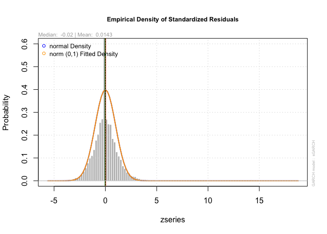

Financial Econometrics Practical

# Outline

This Readme will outline all the following questions by means of
explaining, interpreting and reasoning through all the necessary code
and functions, whereafter a simplified output will be reproduced within
each respective question folders.

First, I sanitize my working environment and source all the necessary
functions that will be incorporated into our analyses.

Now I procceed with the respective questions.

# Question 1: Yield Spread.

Since the beginning of 2020 the current Yield spreads in local
mid-to-longer dated bond yields have been the highest in decades. This
is conventionally expressed as the difference in these yields of these
instruments in percentage points or basis points.

To investigate this I will conduct a brief analysis on what is the
driving is healed spreads. I begin by initialising my data:

Here I gather the data and plot the three South African bond yields.
Here are the yields are plotted against time And it is clear that other
than a few notable periods such as crashes of 2001 to 2003, And the
financial crisis, There is a consistent pattern where the longer term
bonds yields slightly higher but all three follow similar trajectories.
What is becoming noticeable now in most return series is in a similar
manner to the financial crisis various patterns are observed from the
beginning of the Covid pandemic.

    ## Loading required package: xts

    ## Loading required package: zoo

    ## 
    ## Attaching package: 'zoo'

    ## The following objects are masked from 'package:base':
    ## 
    ##     as.Date, as.Date.numeric

    ## 
    ## Attaching package: 'xts'

    ## The following objects are masked from 'package:dplyr':
    ## 
    ##     first, last

    ## 
    ## Attaching package: 'PerformanceAnalytics'

    ## The following object is masked from 'package:graphics':
    ## 
    ##     legend

 I notice
several places where rates stagnate and thus check for missing values in
the data.

It appears that all the data is present, with this I conduct further
analysis of the actual spreads between the various bonds.

At first glance an immediate divergence can be observed between the
three bond yields, specifically with the three-month and two-year yields
diverging from the longer 10 year bond yield. Before investigating this
from an economic and qualitative perspective further, it is worth
investigating it more formally.

``` r
bond_Adj_yield <- SA_bonds %>%
    arrange(date) %>% 
mutate("10Yr2Yr_spread" = ZA_10Yr - ZA_2Yr,"10Yr3M_spread" = ZA_10Yr - SA_3M,"2Yr3M_spread" = ZA_2Yr - SA_3M ) %>% select(date, "10Yr3M_spread","10Yr2Yr_spread","2Yr3M_spread" )

bond_Adj_yield_tdy <- bond_Adj_yield %>% gather(bondpair, Spread , -date) %>% arrange(date) 

bondplot2 <- bond_Adj_yield_tdy %>% ggplot() + geom_line(aes(x = date, y = Spread, color = bondpair), alpha = 0.8, size = 1.2) 

bondplot2 <- bondplot2 + fmxdat::theme_fmx() + theme(legend.position = "bottom") + labs(x = "date", 
    y = "Yield Spread", title = "Yield Spread of ZAR Bonds.", subtitle = "Using 3 Month, 2 Year and 10 year bond yields.", caption = "Note:\nNico Katzke's data used")

print(bondplot2)
```

 Here the
data has been groups in three prepares where the difference is taken
between the longer maturity bond from within the pair. As mentioned
earlier there are various periods where the yields exhibit Volatile
behaviour. Consistent with the two periods mentioned earlier, negative
or inverted yields are observed from 2001 to 2004 and again from 2006 to
2009. This will be addressed again later but is worth noting in terms of
the behaviour of participants in the market. To get a better
understanding of addressing the question at hand I subsets the data to
address only the previous decade.

``` r
bond_Adj_yield_tdy2010 <- bond_Adj_yield %>% gather(bondpair, Spread , -date) %>% arrange(date) %>% 
    filter(date > "2010-01-01")

bondplot3 <- bond_Adj_yield_tdy2010 %>% ggplot() + geom_line(aes(x = date, y = Spread, color = bondpair), alpha = 0.8, size = 1.2) 

bondplot3 <- bondplot3 + fmxdat::theme_fmx() + theme(legend.position = "bottom") + labs(x = "date", 
    y = "Yield Spread", title = "Yield Spread of ZAR Bonds in the last dacade.", subtitle = "Using 3 Month, 2 Year and 10 year bond yields.", caption = "Note:\nNico Katzke's data used")

print(bondplot3)
```

 It is
clear from the above Graaf that’s-year-old spreads were quite stable up
and till the beginning of the pandemic and a significant level increase
is observed for all three assets.

# Question 2: Portfolio Construction

# Question 3: Volatility Comparison

Index investing is often seen as a safe a benchmark to sector specific
portfolios in conventional financial theory, For this slightly outdated
reason as well as the key drivers of indices giving important
information about the vulnerability to systemic risk, Understanding the
concentration and commonality of returns within an index Provides key
insights. Often times indices are used as a low beta benchmarks or are
used as controls in econometric regressions. Here I unpack the returns
from the J200 return series specifically as follows

get return series for just j200

``` r
#pacman::p_load("tidyverse", "devtools", "FactoMineR", "factoextra", 
   # "broom", "rmsfuns")
#T40 <- read_rds("data/T40.rds")
#Q2ALSIRTN <- T40  %>% arrange(date) %>% select(date, Tickers, Return, J200) %>% drop_na()
#colSums(is.na(Q3ALSIRTN))
#WghtALSIRTN <- Q3ALSIRTN %>% mutate(effectivereturn = Return*J200) %>% 
 #   group_by(date) %>% summarise(portfolio_return = sum(effectivereturn)) %>% ungroup()
 # this is for Q2 
```

    ##    date Tickers  Return 
    ##       0       0       0

In this analysis specifically it is the over-arching relations between
constituents, and of movements of the all the in general, that are
desirable. For this reason it is acceptable to winsorise the data as
observed above to obtain cleaner estimates.

As a sanity check I also take note that no columns are left out.My
process of thinking here was to arrange the data in terms of the J200
series with non-weighted J 400 constituents, whereafter the J400 SWIX
constituents were removed.

``` r
Q3plot1 <- Q3ALSIRTN %>% ggplot() + geom_line(aes(date, Return, color=Tickers, alpha =0.9)) +
                                                   labs(x = "date", y = "Returns", title = "top40 ALSI Returns", subtitle = "", caption = "Note:\nNico Katzke's data used") + theme(legend.position = "none")
Q3plot1
```

 Before a
principal component analysis is conducted it is worthwhile ensuring that
the series has been standardised around zero, As was insured above.
Whilst the values were not in the N.a format that can be observed in the
graph above that some values were not desirable, For a successful
correlation matrix to be run and R I need to fill any values that might
cause problems,

The above code is a direct way in which I imputed the returns of
individual stocks taken from the distribution of all of the constituents
of the return series. As this is a PCA directed approach it made sense
to use a collective distribution so that the overall influence of
orthogonal shocks could still be accurately analised. Below I convert
this newlyformed matrix type data frame into a covariance matrix after
the date is removed.

``` r
print(prop)
```

Here the proportions of the effects of the principal components are
briefly reviewed although I will present them more conveniently below.

``` r
prop <- tibble(Loadings = prop) %>% mutate(PC = paste0("PC_", 
    row_number()))

prop[, "PC"][[1]] <- factor(prop[, "PC"][[1]], levels = prop$PC)
Prop2 <- prop %>% slice_head(n=10)
g <- Prop2 %>% 
ggplot() + geom_bar(aes(PC, Loadings), stat = "identity", fill = "steelblue") + 
    
fmxdat::theme_fmx(axis.size.title = fmxdat::ggpts(38), axis.size = fmxdat::ggpts(35), 
    title.size = fmxdat::ggpts(42), CustomCaption = T) + 
scale_y_continuous(breaks = scales::pretty_breaks(10), labels = scales::percent_format(accuracy = 1)) + 
labs(x = "Principal Components", y = "Loadings", title = "Eigenvalue proportions", 
    caption = "Source: Fmxdat Package")
g
```

 Before
interpreting these values I make mention of the fact that I subsets the
principal component to only show the first 10 in the graph. As is
typical of the nature of these eigenvalue proportions in this PCA
framework, After the fourth principal component, each additional
component only explains between 1.5% to 2% of the variation within the
top40. In re-visiting the first principal component I note that 12% of
the variation within the top 40 is explained by a single component and
although we might not know with certainty what this factor is, it has
been calculated linearly as observed. Normally in an analysis of the
style the next step would be to represent the eigenvector proportions or
loading victors graphically, In this case the size of the components
makes this a numeric exercise is a poster visual one. For the sake of
completeness It is worth mentioning that in this Eigenvector analysis
the distribution of the effects of the Different principal components
can be observed for the manner in which they load into different
variables.

The direction I take from here is that as instead of loading
supplementary variables onto the PCA analysis, I instead investigate
correlations From a CAPM portfolio-theory perspective. For a slightly
different perspective on the concentration of this index. Here the SA 3
Month bond is used as a proxy for the risk free rate. Below I convert it
to a timeseries table and apply a CAPM, Three month rolling correlation.

``` r
library(PerformanceAnalytics)
library(tbl2xts)
rf <-read_rds("data/SA_Bonds.rds") %>% 
    select(date, SA_3M) %>%  gather(Bond, Yield, -date) %>%
    arrange(date)
rfxts <- tbl_xts(rf)

xtsQ3ALSIRTN <- tbl_xts(Q3ALSIRTN)
chart.RollingCorrelation(Ra = xtsQ3ALSIRTN , Rb=rfxts, width = 62, xaxis = TRUE,
  legend.loc = NULL, colorset = (1:12), fill = NA)  
```

 This
rolling correlation is promising from a diversification perspective as
it is clearly observable that it revolves around a zero mean
consistently meaning that periods of high positive and high negative
correlation persistence is unlikely. Taking into account that the
highest factor influencing the first principal component was only 12%
and drop down to below 5% for the second principal component it is
substantiated that there are low levels of commonality of returns within
the top 40 index. Before moving on to the following questions it is
worth noting that having a portion of a portfolio in bonds during the
pandemic would have provided good diversification against that of
emerging markets and specifically South African equity as can be
observed above.This does of course need to be analysed with in an
optimisation routine of course.

# Question 4: Volatility and GARCH estimates

In this question I conduct a simple univariate-GARCH estimation
procedure To identify a pure form of volatility of the rand where after
I comment on its relation to other currencies.

    ## Rows: 1792 Columns: 8

    ## ── Column specification ────────────────────────────────────────────────────────
    ## Delimiter: ","
    ## chr (5): LOCATION, INDICATOR, SUBJECT, MEASURE, FREQUENCY
    ## dbl (2): TIME, Value
    ## lgl (1): Flag Codes

    ## 
    ## ℹ Use `spec()` to retrieve the full column specification for this data.
    ## ℹ Specify the column types or set `show_col_types = FALSE` to quiet this message.

With the data loaded it is important that before a comparison is made a
true volatility for the rand itself needs to be identified in order for
us to understand how volatile currency is completed self.I note here
that an external package is loaded which is labelled PPP and is the real
purchasing power parity of the rand compare to the dollar.

``` r
Q4cncieszar <- cncy %>% spread(Name, Price) %>% select(date, SouthAfrica_Cncy) %>% gather(Spot, Price, -date) %>% mutate(Spot = gsub("_Cncy", "", Spot)) %>%
    mutate(Spot = gsub("SouthAfrica", "USD/ZAR", Spot))

Q4cnciesplot <- Q4cncieszar %>% ggplot() +  geom_line(aes(date, Price, color = Spot)) + fmxdat::theme_fmx() + labs(x = "date", 
    y = "Spot Price", title = "USDZAR Spot Rate.", subtitle = "Changes in the strength of the ZAR overtime.", caption = "Note:\nNico Katzke's data used")
Q4cnciesplot
```

 With
this iPod is the movement of the USDZAR Currency pair across time.

``` r
library(lubridate)
```

    ## 
    ## Attaching package: 'lubridate'

    ## The following objects are masked from 'package:base':
    ## 
    ##     date, intersect, setdiff, union

``` r
Q4PPP <- PPP %>% select(TIME, LOCATION, Value) %>% spread(LOCATION, Value) %>% 
    select(TIME, ZAF, USA) %>% gather(Spot, Price, -TIME) 

Q4cnciesplot2 <- Q4PPP %>% ggplot() +  geom_line(aes(TIME, Price, color = Spot)) + fmxdat::theme_fmx() + labs(x = "date", 
    y = "Spot Price", title = "USDZAR Spot Rate.", subtitle = "Changes in the strength of the ZAR overtime.", caption = "Note:\nNico Katzke's data used")
Q4cnciesplot2
```


Immediately here after I present the increase in purchasing power parity
in relation to the increasing value of the UUSDZAR spot, Although this
is simple often times the initial projection biases further analysis in
the direction of a “weakening” rand. I then put the distribution of the
rand and show that it is definitely not normally distributed with a
large positive skew.

``` r
library(tbl2xts)

Q4dlogzar <- Q4cncieszar %>% mutate(Price = na.locf(Price)) %>% arrange(date)  %>% mutate(dlogret = log(Price) - log(lag(Price))) %>% mutate(scaledret = (dlogret -  mean(dlogret,na.rm =T))) %>% filter(date > dplyr::first(date))
    
Q4plot3 <- Q4dlogzar %>% ggplot() + geom_line(aes(x = date, y = scaledret, colour = Spot, 
    alpha = 0.5)) + 
ggtitle("Log-Scaled USD/ZAR Returns") + 
guides(alpha = "none") + 
fmxdat::theme_fmx()

ggplot(Q4dlogzar) + 
geom_histogram(aes(x = scaledret, fill = Spot, alpha = 0.5))
```

    ## `stat_bin()` using `bins = 30`. Pick better value with `binwidth`.

 This
presents a high potential for bias due to clumping which in turn means
that there is also persistence in returns. For this reason I clean the
data further as follows:

``` r
Rtn <-  Q4dlogzar %>% # Easier to work with ymd here 
   tbl_xts(., cols_to_xts = dlogret, spread_by = Spot)
```

    ## The spread_by column only has one category. 
    ## Hence only the column name was changed...

``` r
Rtn[is.na(Rtn)] <- 0

Plotdata = cbind(Rtn, Rtn^2, abs(Rtn))

colnames(Plotdata) = c("Returns", "Returns_Sqd", "Returns_Abs")

Plotdata <- 
Plotdata %>% xts_tbl() %>% 
gather(ReturnType, Returns, -date)

ggplot(Plotdata) + 
geom_line(aes(x = date, y = Returns, colour = ReturnType, alpha = 0.5)) + 
    
ggtitle("Return Type Persistence: USD/ZAR") + 
facet_wrap(~ReturnType, nrow = 3, ncol = 1, scales = "free") + 
    
guides(alpha = "none", colour = "none") + 
fmxdat::theme_fmx()
```

 From the
above figure it is clear that there is persistance in certain periods of
USDZAR returns. The three main takeaway’s here are of first order and
second order persistance as well as clear evidence of long-term memory
in the second order process. I now graph this below:

``` r
forecast::Acf(Rtn, main = "ACF: Equally Weighted Return")
```

    ## Registered S3 method overwritten by 'quantmod':
    ##   method            from
    ##   as.zoo.data.frame zoo

 The
above proves what I expected - There is clear evidence of strong
conditional heteroscedasticity and long memory can also be observed.
Therefore I run a formal test for the effects as follows:

``` r
Box.test(coredata(Rtn^2), type = "Ljung-Box", lag = 12)
```

    ## 
    ##  Box-Ljung test
    ## 
    ## data:  coredata(Rtn^2)
    ## X-squared = 1757.2, df = 12, p-value < 2.2e-16

As this test reject the null hypothesis that there are no ARCH effects,
I control is therefore needed for a walk your return series.

``` r
library(rugarch)
```

    ## Loading required package: parallel

    ## 
    ## Attaching package: 'rugarch'

    ## The following object is masked from 'package:purrr':
    ## 
    ##     reduce

    ## The following object is masked from 'package:stats':
    ## 
    ##     sigma

``` r
garch11 <- 
  
  ugarchspec(
    
    variance.model = list(model = c("sGARCH","gjrGARCH","eGARCH","fGARCH","apARCH")[1], 
                          
    garchOrder = c(1, 1)), 
    
    mean.model = list(armaOrder = c(1, 0), include.mean = TRUE), 
    
    distribution.model = c("norm", "snorm", "std", "sstd", "ged", "sged", "nig", "ghyp", "jsu")[1])

# Now to fit, I use as.matrix and the data - this way the plot functions we will use later will work.

garchfit1 = ugarchfit(spec = garch11,data = Rtn) 

# Note it saved a S4 class object - having its own plots and functionalities:
class(garchfit1)
```

    ## [1] "uGARCHfit"
    ## attr(,"package")
    ## [1] "rugarch"

I then use the above function to estimate the most optimal specification
for a univariate GARCH process and display the results below.

    ## [1] "fit"   "model"

    ##  [1] "hessian"         "cvar"            "var"             "sigma"          
    ##  [5] "condH"           "z"               "LLH"             "log.likelihoods"
    ##  [9] "residuals"       "coef"            "robust.cvar"     "A"              
    ## [13] "B"               "scores"          "se.coef"         "tval"           
    ## [17] "matcoef"         "robust.se.coef"  "robust.tval"     "robust.matcoef" 
    ## [21] "fitted.values"   "convergence"     "kappa"           "persistence"    
    ## [25] "timer"           "ipars"           "solver"

    ##  [1] "modelinc"   "modeldesc"  "modeldata"  "pars"       "start.pars"
    ##  [6] "fixed.pars" "maxOrder"   "pos.matrix" "fmodel"     "pidx"      
    ## [11] "n.start"

``` r
garchfit1@fit$matcoef 
```

           Estimate   Std. Error     t value   Pr(>|t|)

mu 1.091702e-04 4.360069e-05 2.5038644 0.01228451 ar1 1.834999e-03
1.004088e-02 0.1827529 0.85499189 omega 1.766632e-07 2.550788e-07
0.6925829 0.48857134 alpha1 6.373138e-02 5.751895e-03 11.0800655
0.00000000 beta1 9.352686e-01 5.500684e-03 170.0276956 0.00000000

``` r
pacman::p_load(xtable)
Table <- xtable(garchfit1@fit$matcoef)
print(Table, type = "latex", comment = FALSE)
```

``` r
persistence(garchfit1)
```

    ## [1] 0.999

The cleaner estimates are then fitted to be original time series and it
is clear that a more pure process is observed.

``` r
sigma <- sigma(garchfit1) %>% xts_tbl() 
colnames(sigma) <- c("date", "sigma") 
sigma <- sigma %>% mutate(date = as.Date(date))

gg <- 
  
ggplot() + 
  geom_line(data = Plotdata %>% filter(ReturnType == "Returns_Sqd") %>% select(date, Returns) %>% 
              
              unique %>% mutate(Returns = sqrt(Returns)), aes(x = date, y = Returns)) + 
  
  geom_line(data = sigma, aes(x = date, y = sigma), color = "red", size = 2, alpha = 0.8) + 
  
  # scale_y_continuous(limits = c(0, 0.35)) + 
  labs(title = "Comparison: Returns Sigma vs Sigma from uGarch", 
       
       subtitle = "A clear difference is noticable between earlier estimates and the cleaner uGARCH estimates.",
       
       caption = "Note:\nNico Katzke's data used") + 
  
    fmxdat::theme_fmx(CustomCaption = TRUE)


fmxdat::finplot(gg, y.pct = T, y.pct_acc = 1)
```

 A news
impact curve is also fitted as follows.

``` r
ni <- newsimpact(z = NULL, garchfit1)

plot(ni$zx, ni$zy, ylab = ni$yexpr, xlab = ni$xexpr, type = "l", 
    main = "News Impact Curve")
```


    ## [1] TRUE

    ##                       
    ## Akaike       -7.245377
    ## Bayes        -7.242212
    ## Shibata      -7.245378
    ## Hannan-Quinn -7.244314

``` r
plot(garchfit1, which = 1)
```


``` r
plot(garchfit1, which = 9)
```


``` r
plot(garchfit1, which = 8)
```



``` r
plot(garchfit1, which = 3)
```

 From
above a variety of graphs are also plotted, the most notable conclusions
of which, are that a high degree of non-normality persists in the data
which might bias the results but the estimates are clearly much cleaner
than the original estimates.

``` r
gjrgarch11 = ugarchspec(variance.model = list(model = c("sGARCH","gjrGARCH","eGARCH","fGARCH","apARCH")[2], 
                                              
                                              garchOrder = c(1, 1)), 
                        
                        mean.model = list(armaOrder = c(1, 0), include.mean = TRUE), 
                        
                        distribution.model = c("norm", "snorm", "std", "sstd", "ged", "sged", "nig", "ghyp", "jsu")[3])
# Now to fit, I use as.matrix and the data - this way the plot functions we will use later will work.
garchfit2 = ugarchfit(spec = gjrgarch11, data = as.matrix(Rtn)) 

garchfit2@fit$matcoef %>% xtable()
```

    ## % latex table generated in R 4.0.4 by xtable 1.8-4 package
    ## % Sun Dec  5 09:10:10 2021
    ## \begin{table}[ht]
    ## \centering
    ## \begin{tabular}{rrrrr}
    ##   \hline
    ##  &  Estimate &  Std. Error &  t value & Pr($>$$|$t$|$) \\ 
    ##   \hline
    ## mu & 0.00 & 0.00 & 1.02 & 0.31 \\ 
    ##   ar1 & -0.02 & 0.01 & -2.37 & 0.02 \\ 
    ##   omega & 0.00 & 0.00 & 0.07 & 0.95 \\ 
    ##   alpha1 & 0.05 & 0.00 & 15.92 & 0.00 \\ 
    ##   beta1 & 0.96 & 0.00 & 2032.78 & 0.00 \\ 
    ##   gamma1 & -0.02 & 0.00 & -5.14 & 0.00 \\ 
    ##   shape & 3.01 & 0.10 & 29.31 & 0.00 \\ 
    ##    \hline
    ## \end{tabular}
    ## \end{table}

# Question 5: MSCI Funds

Diversification across different asset classes is An important tool in
constructing portfolios do you to its ability to mitigate risk. These
Asset classes are distributed along a plane most well described by
growth and inflation And each class Performs in a particular manner
given the stage of market/bussiness cycle. Equities are on the opposite
side of the growth spectrum to Long-term Treasuries for example. The
statement that the return profile across acid classes have converged in
the past decade is cause for concern as it minimises the ability for
diversification to be in effective tool in managing risk.

Firstly the data is assessed:

with this in mind we evaluate the MSCI returns and how we can
investigate whether true returns are converging( are correlations
between assets classes increasing) or are other systemic factors
conflating the true signal of volatility in typical market analysis.
Consistent with the following question, a good proxy needs to be
established for each type of asset: MSCI_RE is used for property,
MSCI_ACWI to track global equity, the US ten year treasury is used as a
bond proxy and the Bloomberg commodity index is used to represent
commodities. Consistant with standardising returns we ensure TRI series
are considered.

``` r
library(lubridate) 

Q5MSCI <-msci %>% spread(Name, Price) %>% select(date, MSCI_ACWI, MSCI_RE)

Q5bond <- bonds %>% spread(Name, Bond_10Yr) %>% select(date, US_10Yr)

Q5Com <- comms %>%  spread(Name, Price) %>% select(date, Bcom_Index)

Q5Diverspotential <- Q5MSCI %>% left_join( Q5bond, by = c("date")) %>% 
    left_join( Q5Com, by = c("date")) %>% gather(Tickers, Price, -date) %>%
    group_by(Tickers) %>%
    filter(date > as.Date("2000-01-01")) %>% arrange(date) %>%  
    group_by(Tickers) %>%  mutate(dlogret = log(Price) - log(lag(Price))) %>% mutate(scaledret = (dlogret -  mean(dlogret, na.rm = T))) %>% filter(date > dplyr::first(date)) %>%  ungroup()
```

Above I compiled a joint Index in wide format in order to accommodate
the series and then mutate using the statistical measures for returns so
that I can easily apply PCA procedures.

``` r
pacman::p_load("MTS", "robustbase")
pacman::p_load("tidyverse", "devtools", "rugarch", "rmgarch", 
    "forecast", "tbl2xts", "lubridate", "PerformanceAnalytics", 
    "ggthemes")
Q5xts_rtn <- Q5Diverspotential %>% tbl_xts(., cols_to_xts = "dlogret", spread_by = "Tickers")
MarchTest(Q5xts_rtn)
```

    ## Q(m) of squared series(LM test):  
    ## Test statistic:  10164.13  p-value:  0 
    ## Rank-based Test:  
    ## Test statistic:  3155.677  p-value:  0 
    ## Q_k(m) of squared series:  
    ## Test statistic:  15395.03  p-value:  0 
    ## Robust Test(5%) :  4092.611  p-value:  0

``` r
DCCPre <- dccPre(Q5xts_rtn, include.mean = T, p = 0)
```

    ## Sample mean of the returns:  0.000208785 0.0001418141 -0.0002536672 2.035793e-05 
    ## Component:  1 
    ## Estimates:  1e-06 0.113459 0.875184 
    ## se.coef  :  0 0.009054 0.009283 
    ## t-value  :  6.241081 12.53092 94.27625 
    ## Component:  2 
    ## Estimates:  1e-06 0.104172 0.882701 
    ## se.coef  :  0 0.009086 0.009786 
    ## t-value  :  5.841421 11.46542 90.1977 
    ## Component:  3 
    ## Estimates:  1e-06 0.067626 0.932375 
    ## se.coef  :  0 0.005651 0.00529 
    ## t-value  :  3.767026 11.96606 176.2464 
    ## Component:  4 
    ## Estimates:  1e-06 0.042187 0.951532 
    ## se.coef  :  0 0.00422 0.004845 
    ## t-value  :  4.224749 9.997587 196.413

A quick glance of the following table shows that a clear violation of is
present.

``` r
Vol <- DCCPre$marVol
colnames(Vol) <- colnames(Q5xts_rtn)
Vol <- 
  data.frame( cbind( date = index(Q5xts_rtn), Vol)) %>% # Add date column which dropped away...
  mutate(date = as.Date(date)) %>%  tbl_df()  # make date column a date column...
```

    ## Warning: `tbl_df()` was deprecated in dplyr 1.0.0.
    ## Please use `tibble::as_tibble()` instead.
    ## This warning is displayed once every 8 hours.
    ## Call `lifecycle::last_lifecycle_warnings()` to see where this warning was generated.

``` r
TidyVol <- Vol %>% gather(Stocks, Sigma, -date)
ggplot(TidyVol) + geom_line(aes(x = date, y = Sigma, colour = Stocks))
```

 I also
briefly Graph the initial volatility showing a high degree of
variability which I will clean for a purer signal.

``` r
StdRes <- DCCPre$sresi

cl = makePSOCKcluster(10)
pacman::p_load("tidyverse", "tbl2xts", "broom")

uspec <- ugarchspec(
    variance.model = list(model = "gjrGARCH", 
    garchOrder = c(1, 1)), 
    mean.model = list(armaOrder = c(1, 
    0), include.mean = TRUE), 
    distribution.model = "sstd")

multi_univ_garch_spec <- multispec(replicate(ncol(Q5xts_rtn), uspec))

spec.go <- gogarchspec(multi_univ_garch_spec, 
                       distribution.model = 'mvnorm', # or manig.
                       ica = 'fastica') # Note: we use the fastICA
cl <- makePSOCKcluster(10)

multf <- multifit(multi_univ_garch_spec, Q5xts_rtn, cluster = cl)

fit.gogarch <- gogarchfit(spec.go, 
                      data = Q5xts_rtn, 
                      solver = 'hybrid', 
                      cluster = cl, 
                      gfun = 'tanh', 
                      maxiter1 = 40000, 
                      epsilon = 1e-08, 
                      rseed = 100)

print(fit.gogarch)
```

    ## 
    ## *------------------------------*
    ## *        GO-GARCH Fit          *
    ## *------------------------------*
    ## 
    ## Mean Model       : CONSTANT
    ## GARCH Model      : sGARCH
    ## Distribution : mvnorm
    ## ICA Method       : fastica
    ## No. Factors      : 4
    ## No. Periods      : 5694
    ## Log-Likelihood   : 74784.65
    ## ------------------------------------
    ## 
    ## U (rotation matrix) : 
    ## 
    ##         [,1]    [,2]    [,3]   [,4]
    ## [1,] -0.9147 -0.0633  0.1693  0.361
    ## [2,] -0.3874  0.2252 -0.1166 -0.886
    ## [3,]  0.0271  0.9719  0.0109  0.234
    ## [4,] -0.1117 -0.0269 -0.9786  0.171
    ## 
    ## A (mixing matrix) : 
    ## 
    ##          [,1]      [,2]      [,3]     [,4]
    ## [1,] 0.001093  0.000467 -0.005396 -0.00838
    ## [2,] 0.000278 -0.000890  0.001151 -0.01071
    ## [3,] 0.023901  0.000784 -0.003527 -0.00580
    ## [4,] 0.000542  0.009137 -0.000441 -0.00381

Above I plots a go-GARCH fit with the optimal specificationS.

``` r
gog.time.var.cor <- rcor(fit.gogarch)
gog.time.var.cor <- aperm(gog.time.var.cor,c(3,2,1))
dim(gog.time.var.cor) <- c(nrow(gog.time.var.cor), ncol(gog.time.var.cor)^2)
```

``` r
renamingdcc <- function(ReturnSeries, DCC.TV.Cor) {
  
ncolrtn <- ncol(ReturnSeries)
namesrtn <- colnames(ReturnSeries)
paste(namesrtn, collapse = "_")

nam <- c()
xx <- mapply(rep, times = ncolrtn:1, x = namesrtn)


nam <- c()
for (j in 1:(ncolrtn)) {
for (i in 1:(ncolrtn)) {
  nam[(i + (j-1)*(ncolrtn))] <- paste(xx[[j]][1], xx[[i]][1], sep="_")
}
}

colnames(DCC.TV.Cor) <- nam


DCC.TV.Cor <- 
    data.frame( cbind( date = index(ReturnSeries), DCC.TV.Cor)) %>% 
    mutate(date = as.Date(date)) %>%  tbl_df() 

DCC.TV.Cor <- DCC.TV.Cor %>% gather(Pairs, Rho, -date)

DCC.TV.Cor

}
gog.time.var.cor <- renamingdcc(ReturnSeries = Q5xts_rtn, DCC.TV.Cor = gog.time.var.cor)
```

Here I am carrying out various procedures in order to convert the return
series into the correct matrix notation so that the correlation matrix
can be dealt with correctly.

``` r
Q5compplot <- ggplot(gog.time.var.cor %>% filter(grepl("Bcom_", Pairs), 
    !grepl("_Bcom", Pairs))) + geom_line(aes(x = date, y = Rho, 
    colour = Pairs)) + theme_hc() + ggtitle("Go-GARCH: Bcom")

print(Q5compplot)
```

 What
follows here is for pairwise MV_GARCH Regressions for a cleaner analysis
of the correlation of funds within the MSCI Indices. Other than the
start of the pandemic which is a clear systemic shock the commodity
index correlation with other funds has remained consistent.

``` r
Q5bondplot <- ggplot(gog.time.var.cor %>% filter(grepl("US_10Yr", Pairs), 
    !grepl("_US", Pairs))) + geom_line(aes(x = date, y = Rho, 
    colour = Pairs)) + theme_hc() + ggtitle("Go-GARCH: US_10Yr")

print(Q5bondplot)
```

 Again it
is not surprising that during the debt crisis the correlation of US
bonds rose with other assets in terms of correlation.

``` r
Q5ACWIplot <- ggplot(gog.time.var.cor %>% filter(grepl("MSCI_ACWI", Pairs), 
    !grepl("_MSCI_ACWI", Pairs))) + geom_line(aes(x = date, y = Rho, 
    colour = Pairs)) + theme_hc() + ggtitle("Go-GARCH: ACWI")

print(Q5ACWIplot)
```

 This
graph was quite surprising and shows that over time the room for
diversification between global equity and real estate has shrunk
significantly with coronation becoming significantly higher over time.

``` r
Q5REplot <- ggplot(gog.time.var.cor %>% filter(grepl("MSCI_RE", Pairs), 
    !grepl("_MSCI_RE", Pairs))) + geom_line(aes(x = date, y = Rho, 
    colour = Pairs)) + theme_hc() + ggtitle("Go-GARCH: RE")

print(Q5ACWIplot)
```


``` r
library(cowplot)
```

    ## 
    ## Attaching package: 'cowplot'

    ## The following object is masked from 'package:ggthemes':
    ## 
    ##     theme_map

    ## The following object is masked from 'package:lubridate':
    ## 
    ##     stamp

``` r
plot_grid(Q5bondplot, Q5ACWIplot, Q5REplot , Q5compplot, labels = c('', '', '',''))
```

 Above I
simplify the above correlation estimates in terms of visual analysis by
compiling an into a single plot . I then conduct a brief principal
component analysis of the now clean Sigma estimates and produce a
pairwise panel of the data showing correlations and distributions.

``` r
library(factoextra)
library(FactoMineR)
Q5PCAdata <- Q5Diverspotential %>%  select(date, Tickers, dlogret)%>% spread(Tickers, 
    dlogret) %>% select(-date)

Q5PCA <- prcomp(Q5PCAdata, center = TRUE, scale. = TRUE)
Q5PCA$rotation
```

    ##                  PC1         PC2        PC3         PC4
    ## Bcom_Index 0.4011844 -0.42224868  0.8076376 -0.09207931
    ## MSCI_ACWI  0.6152749 -0.06339778 -0.2540008  0.74357321
    ## MSCI_RE    0.5704492 -0.20246396 -0.4630326 -0.64745409
    ## US_10Yr    0.3675263  0.88130308  0.2623086 -0.13936816

``` r
plot(Q5PCA, type = "l")
```


``` r
summary(Q5PCA)
```

    ## Importance of components:
    ##                           PC1    PC2    PC3     PC4
    ## Standard deviation     1.4814 0.9128 0.8724 0.45949
    ## Proportion of Variance 0.5487 0.2083 0.1903 0.05278
    ## Cumulative Proportion  0.5487 0.7570 0.9472 1.00000

``` r
pacman::p_load("psych")
pairs.panels(Q5PCAdata)
```


``` r
gviolion <- Q5PCAdata %>% gather(Type, val) %>% ggplot() + geom_violin(aes(Type, 
    val, fill = Type), alpha = 0.7) + fmxdat::theme_fmx() + fmxdat::fmx_fills()

fmxdat::finplot(gviolion, y.pct = T, y.pct_acc = 1, x.vert = T)
```

 This is
extremely useful as it reports on the behaviour of these returns and
shows how the density of distribution changes with the change in pairs.
Most notably the US 10 year year shows significantly higher degrees of
dispersion and clearly follows a different distribution process to the
other three indices.

# Question 6: Portfolio Construction

In this question we construct a global balanced index fund portfolio
using a mix of traded global indices that we load below. From the
question I can already gain a clear understanding of the type of
optimiser that will be preferred from a subjective perspective. What I
mean by this is that The constraints are structured in a way that
suggest a more moderate wealth preserving type portfolio need be
constructed.As I’ve spent some time trying to build optimisers by hand
in preparation for this question I’ve come across a helpful package but
I feel does the best job of allowing for very flexible constraints.For
this reason I load the data in and open the portfolio analytics package.
Before integrating it straight in I clean the data as normal.

``` r
Q6MAA <- read_rds("data/MAA.rds")
Q6msci <- read_rds("data/msci.rds") %>%
  filter(Name %in% c("MSCI_ACWI", "MSCI_USA", "MSCI_RE", "MSCI_Jap"))
```

For easeability in the constraints section of the optimisation procedure
I’ve proceeded to rename the indices so that the object orientated
group-by constraints are easily carried out.

``` r
Q6MAAwide <- Q6MAA %>% select(date, Ticker, Price) %>% spread(Ticker, Price)
Q6msciwide <- Q6msci %>% spread(Name, Price) 

Q6totalrtn <- Q6MAAwide %>% left_join(Q6msciwide, by = c("date")) %>% rename(
     "Asian_Currency" = `ADXY Index` ,
    "US_Currency" = `DXY Index` ,
    "Global_Bond1" = `LGAGTRUH Index`,
     "US_Bond1" = `LUAGTRUU Index`,
    "Euro_Bond1" = `LEATTREU Index`,
    "Global_Bond2" = `LGCPTRUH Index`,
    "US_Bond2" = `LUACTRUU Index`,
    "Euro_Bond2" = `LP05TREH Index`,
    "Commodity" = `BCOMTR Index`,
    "Japan_Equity" = `MSCI_Jap`,
    "US_Property" = `MSCI_RE`,
    "US_Equity" = `MSCI_USA`,
    "Global Equity" = `MSCI_ACWI`
)
 
Q6totalrtn2  <- Q6totalrtn %>%  gather(Tickers, Price, -date) %>%
    group_by(Tickers) %>%  filter(date > as.Date("2000-01-01")) %>% arrange(date) %>%  
    group_by(Tickers) %>%  mutate(dlogret = log(Price) - log(lag(Price))) %>% mutate(scaledret = (dlogret -  mean(dlogret, na.rm = T))) %>% filter(date > dplyr::first(date)) %>% 
    ungroup() 

Q6totalrtn3 <- Q6totalrtn2 %>% select(date, Tickers, dlogret) %>% 
    spread(Tickers, dlogret)
```

I will once more emphasise that the mean variance optimiser as well as
other packages such as CVXR are quite tricky in terms of flexible
constraints. Whilst I will give this optimisation procedure various
objectives the main objective will be a wolf preserving risk adjusted
return objective.

I then convert the data into a timeseries and load in the packages and
plugins.

``` r
Q6rtn <- Q6totalrtn3 %>% tbl_xts()

library(ROI)
```

    ## ROI: R Optimization Infrastructure

    ## Registered solver plugins: nlminb, glpk, quadprog.

    ## Default solver: auto.

``` r
library(ROI.plugin.quadprog)
library(ROI.plugin.glpk)
library(PerformanceAnalytics)
library(PortfolioAnalytics)
```

    ## Loading required package: foreach

    ## 
    ## Attaching package: 'foreach'

    ## The following objects are masked from 'package:purrr':
    ## 
    ##     accumulate, when

    ## Registered S3 method overwritten by 'PortfolioAnalytics':
    ##   method           from
    ##   print.constraint ROI

    ## 
    ## Attaching package: 'PortfolioAnalytics'

    ## The following objects are masked from 'package:ROI':
    ## 
    ##     is.constraint, objective

Below I specify the portfolio that will take on the constraint arguments
there after the specific constraints that I specify are as follows: Full
investment must take place and long only positions are added. And
objective is then added to minimise portfolio standard deviation as an
initial starting point in this optimiser but will be changed later
on.The optimisation procedure is then initiated and the return on
investment method is specified.

``` r
port_spec <- portfolio.spec(colnames(Q6rtn))
port_spec <- add.constraint(portfolio =port_spec, type = "full_investment")
port_spec <- add.constraint(portfolio = port_spec, type = "long_only")
port_spec <- add.objective(portfolio = port_spec, type = "risk", name = "StdDev")
opt <- optimize.portfolio(Q6rtn, portfolio = port_spec, optimize_method = "ROI")
print(opt)
```

    ## ***********************************
    ## PortfolioAnalytics Optimization
    ## ***********************************
    ## 
    ## Call:
    ## optimize.portfolio(R = Q6rtn, portfolio = port_spec, optimize_method = "ROI")
    ## 
    ## Optimal Weights:
    ## Asian_Currency      Commodity     Euro_Bond1     Euro_Bond2  Global Equity 
    ##         0.3192         0.0146         0.0000         0.0000         0.0064 
    ##   Global_Bond1   Global_Bond2   Japan_Equity       US_Bond1       US_Bond2 
    ##         0.5067         0.0000         0.0055         0.0000         0.0000 
    ##    US_Currency      US_Equity    US_Property 
    ##         0.1476         0.0000         0.0000 
    ## 
    ## Objective Measure:
    ##    StdDev 
    ## 0.0009714

``` r
extractWeights(opt)
```

    ## Asian_Currency      Commodity     Euro_Bond1     Euro_Bond2  Global Equity 
    ##   3.191607e-01   1.460856e-02   1.075704e-17   3.207724e-18   6.407276e-03 
    ##   Global_Bond1   Global_Bond2   Japan_Equity       US_Bond1       US_Bond2 
    ##   5.067218e-01   2.167819e-17   5.501330e-03   1.091242e-18   8.035830e-18 
    ##    US_Currency      US_Equity    US_Property 
    ##   1.476003e-01   0.000000e+00  -8.041650e-19

``` r
chart.Weights(opt)
```

 As
mentioned we explore the most simple case above and we print out the
results in terms of weights it now becomes clear why the names were
changed.

``` r
print(port_spec)
```

    ## **************************************************
    ## PortfolioAnalytics Portfolio Specification 
    ## **************************************************
    ## 
    ## Call:
    ## portfolio.spec(assets = colnames(Q6rtn))
    ## 
    ## Number of assets: 13 
    ## Asset Names
    ##  [1] "Asian_Currency" "Commodity"      "Euro_Bond1"     "Euro_Bond2"    
    ##  [5] "Global Equity"  "Global_Bond1"   "Global_Bond2"   "Japan_Equity"  
    ##  [9] "US_Bond1"       "US_Bond2"      
    ## More than 10 assets, only printing the first 10
    ## 
    ## Constraints
    ## Enabled constraint types
    ##      - full_investment 
    ##      - long_only 
    ## 
    ## Objectives:
    ## Enabled objective names
    ##      - StdDev

V last three constraints are then implemented below into a more complex
optimiser as follows: A box constraint is implemented when no single
asset may constitute more than 40% of the portfolio, And following this
to group constraints are initialised for equity and bond instruments
where equity cannot collectively constitute more than 60% and bonds
can’t constitute more than 25%.

``` r
port_spec <- add.constraint(portfolio = port_spec, type = "weight_sum", min_sum = 1, max_sum = 1)

port_spec <- add.constraint(portfolio = port_spec, type = "box", min = 0, max = 0.4)

port_spec <- add.constraint(portfolio = port_spec, type = "group", groups = list(c(3, 4, 6, 7, 9, 10)), group_min = 0, group_max = 0.25)

port_spec <- add.constraint(portfolio = port_spec, type = "group", groups = list(c(5, 8, 12)), group_min = 0, group_max = 0.6)

print(port_spec)
```

    ## **************************************************
    ## PortfolioAnalytics Portfolio Specification 
    ## **************************************************
    ## 
    ## Call:
    ## portfolio.spec(assets = colnames(Q6rtn))
    ## 
    ## Number of assets: 13 
    ## Asset Names
    ##  [1] "Asian_Currency" "Commodity"      "Euro_Bond1"     "Euro_Bond2"    
    ##  [5] "Global Equity"  "Global_Bond1"   "Global_Bond2"   "Japan_Equity"  
    ##  [9] "US_Bond1"       "US_Bond2"      
    ## More than 10 assets, only printing the first 10
    ## 
    ## Constraints
    ## Enabled constraint types
    ##      - full_investment 
    ##      - long_only 
    ##      - weight_sum 
    ##      - box 
    ##      - group 
    ##      - group 
    ## 
    ## Objectives:
    ## Enabled objective names
    ##      - StdDev

Following this the objectives and constraints are once again specified.

``` r
port_spec <- add.objective(portfolio = port_spec, type = "return", name = "mean")

# Added a risk objective to minimize portfolio standard deviation
port_spec <- add.objective(portfolio = port_spec, type = "risk", name = "StdDev")

# Add a risk budget objective
port_spec <- add.objective(portfolio = port_spec, type = "risk_budget", name = "StdDev", min_prisk = 0.05, max_prisk = 0.1)

print(port_spec)
```

    ## **************************************************
    ## PortfolioAnalytics Portfolio Specification 
    ## **************************************************
    ## 
    ## Call:
    ## portfolio.spec(assets = colnames(Q6rtn))
    ## 
    ## Number of assets: 13 
    ## Asset Names
    ##  [1] "Asian_Currency" "Commodity"      "Euro_Bond1"     "Euro_Bond2"    
    ##  [5] "Global Equity"  "Global_Bond1"   "Global_Bond2"   "Japan_Equity"  
    ##  [9] "US_Bond1"       "US_Bond2"      
    ## More than 10 assets, only printing the first 10
    ## 
    ## Constraints
    ## Enabled constraint types
    ##      - full_investment 
    ##      - long_only 
    ##      - weight_sum 
    ##      - box 
    ##      - group 
    ##      - group 
    ## 
    ## Objectives:
    ## Enabled objective names
    ##      - StdDev 
    ##      - mean 
    ##      - StdDev 
    ##      - StdDev

With the risk budget and the minimised portfolio standard deviation
objective added we now run a single parent optimisation first.

``` r
rp <- random_portfolios(portfolio=port_spec, permutations = 50, rp_method ='simplex')
```

    ## Warning: executing %dopar% sequentially: no parallel backend registered

``` r
opt <- optimize.portfolio(R = Q6rtn, portfolio = port_spec, optimize_method = "random", rp = rp, trace = TRUE)
```

    ## Leverage constraint min_sum and max_sum are restrictive, 
    ##               consider relaxing. e.g. 'full_investment' constraint should be min_sum=0.99 and max_sum=1.01

``` r
print(opt)
```

    ## ***********************************
    ## PortfolioAnalytics Optimization
    ## ***********************************
    ## 
    ## Call:
    ## optimize.portfolio(R = Q6rtn, portfolio = port_spec, optimize_method = "random", 
    ##     trace = TRUE, rp = rp)
    ## 
    ## Optimal Weights:
    ## Asian_Currency      Commodity     Euro_Bond1     Euro_Bond2  Global Equity 
    ##         0.0513         0.0275         0.1521         0.0896         0.0037 
    ##   Global_Bond1   Global_Bond2   Japan_Equity       US_Bond1       US_Bond2 
    ##         0.0093         0.1730         0.1237         0.0692         0.1778 
    ##    US_Currency      US_Equity    US_Property 
    ##         0.0048         0.0831         0.0350 
    ## 
    ## Objective Measures:
    ##   StdDev 
    ## 0.002787 
    ## 
    ## contribution :
    ## Asian_Currency      Commodity     Euro_Bond1     Euro_Bond2  Global Equity 
    ##      4.321e-05      8.348e-05      1.244e-04      7.462e-05      2.217e-05 
    ##   Global_Bond1   Global_Bond2   Japan_Equity       US_Bond1       US_Bond2 
    ##      4.284e-06      2.035e-04      1.213e-03      5.150e-05      2.904e-04 
    ##    US_Currency      US_Equity    US_Property 
    ##     -7.099e-06      4.288e-04      2.547e-04 
    ## 
    ## pct_contrib_StdDev :
    ## Asian_Currency      Commodity     Euro_Bond1     Euro_Bond2  Global Equity 
    ##       0.015506       0.029956       0.044654       0.026778       0.007954 
    ##   Global_Bond1   Global_Bond2   Japan_Equity       US_Bond1       US_Bond2 
    ##       0.001537       0.073018       0.435188       0.018479       0.104202 
    ##    US_Currency      US_Equity    US_Property 
    ##      -0.002547       0.153887       0.091389 
    ## 
    ## 
    ##      mean 
    ## 4.321e-05

``` r
chart.Weights(opt)
```

 With
this initial waiting procedure estimated we now run a periodic
rebalancing optimisation using the 60 day rolling window and quarterly
re-balancing.

``` r
opt_rebal <- optimize.portfolio.rebalancing(R = Q6rtn, portfolio = port_spec, optimize_method = "random", rp = rp, trace = TRUE, search_size = 1000, rebalance_on = "quarters", training_period = 60, rolling_window = 60)
```

    ## Leverage constraint min_sum and max_sum are restrictive, 
    ##               consider relaxing. e.g. 'full_investment' constraint should be min_sum=0.99 and max_sum=1.01
    ## Leverage constraint min_sum and max_sum are restrictive, 
    ##               consider relaxing. e.g. 'full_investment' constraint should be min_sum=0.99 and max_sum=1.01
    ## Leverage constraint min_sum and max_sum are restrictive, 
    ##               consider relaxing. e.g. 'full_investment' constraint should be min_sum=0.99 and max_sum=1.01
    ## Leverage constraint min_sum and max_sum are restrictive, 
    ##               consider relaxing. e.g. 'full_investment' constraint should be min_sum=0.99 and max_sum=1.01
    ## Leverage constraint min_sum and max_sum are restrictive, 
    ##               consider relaxing. e.g. 'full_investment' constraint should be min_sum=0.99 and max_sum=1.01
    ## Leverage constraint min_sum and max_sum are restrictive, 
    ##               consider relaxing. e.g. 'full_investment' constraint should be min_sum=0.99 and max_sum=1.01
    ## Leverage constraint min_sum and max_sum are restrictive, 
    ##               consider relaxing. e.g. 'full_investment' constraint should be min_sum=0.99 and max_sum=1.01
    ## Leverage constraint min_sum and max_sum are restrictive, 
    ##               consider relaxing. e.g. 'full_investment' constraint should be min_sum=0.99 and max_sum=1.01
    ## Leverage constraint min_sum and max_sum are restrictive, 
    ##               consider relaxing. e.g. 'full_investment' constraint should be min_sum=0.99 and max_sum=1.01
    ## Leverage constraint min_sum and max_sum are restrictive, 
    ##               consider relaxing. e.g. 'full_investment' constraint should be min_sum=0.99 and max_sum=1.01
    ## Leverage constraint min_sum and max_sum are restrictive, 
    ##               consider relaxing. e.g. 'full_investment' constraint should be min_sum=0.99 and max_sum=1.01
    ## Leverage constraint min_sum and max_sum are restrictive, 
    ##               consider relaxing. e.g. 'full_investment' constraint should be min_sum=0.99 and max_sum=1.01
    ## Leverage constraint min_sum and max_sum are restrictive, 
    ##               consider relaxing. e.g. 'full_investment' constraint should be min_sum=0.99 and max_sum=1.01
    ## Leverage constraint min_sum and max_sum are restrictive, 
    ##               consider relaxing. e.g. 'full_investment' constraint should be min_sum=0.99 and max_sum=1.01
    ## Leverage constraint min_sum and max_sum are restrictive, 
    ##               consider relaxing. e.g. 'full_investment' constraint should be min_sum=0.99 and max_sum=1.01
    ## Leverage constraint min_sum and max_sum are restrictive, 
    ##               consider relaxing. e.g. 'full_investment' constraint should be min_sum=0.99 and max_sum=1.01
    ## Leverage constraint min_sum and max_sum are restrictive, 
    ##               consider relaxing. e.g. 'full_investment' constraint should be min_sum=0.99 and max_sum=1.01
    ## Leverage constraint min_sum and max_sum are restrictive, 
    ##               consider relaxing. e.g. 'full_investment' constraint should be min_sum=0.99 and max_sum=1.01
    ## Leverage constraint min_sum and max_sum are restrictive, 
    ##               consider relaxing. e.g. 'full_investment' constraint should be min_sum=0.99 and max_sum=1.01
    ## Leverage constraint min_sum and max_sum are restrictive, 
    ##               consider relaxing. e.g. 'full_investment' constraint should be min_sum=0.99 and max_sum=1.01
    ## Leverage constraint min_sum and max_sum are restrictive, 
    ##               consider relaxing. e.g. 'full_investment' constraint should be min_sum=0.99 and max_sum=1.01
    ## Leverage constraint min_sum and max_sum are restrictive, 
    ##               consider relaxing. e.g. 'full_investment' constraint should be min_sum=0.99 and max_sum=1.01
    ## Leverage constraint min_sum and max_sum are restrictive, 
    ##               consider relaxing. e.g. 'full_investment' constraint should be min_sum=0.99 and max_sum=1.01
    ## Leverage constraint min_sum and max_sum are restrictive, 
    ##               consider relaxing. e.g. 'full_investment' constraint should be min_sum=0.99 and max_sum=1.01
    ## Leverage constraint min_sum and max_sum are restrictive, 
    ##               consider relaxing. e.g. 'full_investment' constraint should be min_sum=0.99 and max_sum=1.01
    ## Leverage constraint min_sum and max_sum are restrictive, 
    ##               consider relaxing. e.g. 'full_investment' constraint should be min_sum=0.99 and max_sum=1.01
    ## Leverage constraint min_sum and max_sum are restrictive, 
    ##               consider relaxing. e.g. 'full_investment' constraint should be min_sum=0.99 and max_sum=1.01
    ## Leverage constraint min_sum and max_sum are restrictive, 
    ##               consider relaxing. e.g. 'full_investment' constraint should be min_sum=0.99 and max_sum=1.01
    ## Leverage constraint min_sum and max_sum are restrictive, 
    ##               consider relaxing. e.g. 'full_investment' constraint should be min_sum=0.99 and max_sum=1.01
    ## Leverage constraint min_sum and max_sum are restrictive, 
    ##               consider relaxing. e.g. 'full_investment' constraint should be min_sum=0.99 and max_sum=1.01
    ## Leverage constraint min_sum and max_sum are restrictive, 
    ##               consider relaxing. e.g. 'full_investment' constraint should be min_sum=0.99 and max_sum=1.01
    ## Leverage constraint min_sum and max_sum are restrictive, 
    ##               consider relaxing. e.g. 'full_investment' constraint should be min_sum=0.99 and max_sum=1.01
    ## Leverage constraint min_sum and max_sum are restrictive, 
    ##               consider relaxing. e.g. 'full_investment' constraint should be min_sum=0.99 and max_sum=1.01
    ## Leverage constraint min_sum and max_sum are restrictive, 
    ##               consider relaxing. e.g. 'full_investment' constraint should be min_sum=0.99 and max_sum=1.01
    ## Leverage constraint min_sum and max_sum are restrictive, 
    ##               consider relaxing. e.g. 'full_investment' constraint should be min_sum=0.99 and max_sum=1.01
    ## Leverage constraint min_sum and max_sum are restrictive, 
    ##               consider relaxing. e.g. 'full_investment' constraint should be min_sum=0.99 and max_sum=1.01
    ## Leverage constraint min_sum and max_sum are restrictive, 
    ##               consider relaxing. e.g. 'full_investment' constraint should be min_sum=0.99 and max_sum=1.01
    ## Leverage constraint min_sum and max_sum are restrictive, 
    ##               consider relaxing. e.g. 'full_investment' constraint should be min_sum=0.99 and max_sum=1.01
    ## Leverage constraint min_sum and max_sum are restrictive, 
    ##               consider relaxing. e.g. 'full_investment' constraint should be min_sum=0.99 and max_sum=1.01
    ## Leverage constraint min_sum and max_sum are restrictive, 
    ##               consider relaxing. e.g. 'full_investment' constraint should be min_sum=0.99 and max_sum=1.01
    ## Leverage constraint min_sum and max_sum are restrictive, 
    ##               consider relaxing. e.g. 'full_investment' constraint should be min_sum=0.99 and max_sum=1.01
    ## Leverage constraint min_sum and max_sum are restrictive, 
    ##               consider relaxing. e.g. 'full_investment' constraint should be min_sum=0.99 and max_sum=1.01
    ## Leverage constraint min_sum and max_sum are restrictive, 
    ##               consider relaxing. e.g. 'full_investment' constraint should be min_sum=0.99 and max_sum=1.01
    ## Leverage constraint min_sum and max_sum are restrictive, 
    ##               consider relaxing. e.g. 'full_investment' constraint should be min_sum=0.99 and max_sum=1.01
    ## Leverage constraint min_sum and max_sum are restrictive, 
    ##               consider relaxing. e.g. 'full_investment' constraint should be min_sum=0.99 and max_sum=1.01
    ## Leverage constraint min_sum and max_sum are restrictive, 
    ##               consider relaxing. e.g. 'full_investment' constraint should be min_sum=0.99 and max_sum=1.01
    ## Leverage constraint min_sum and max_sum are restrictive, 
    ##               consider relaxing. e.g. 'full_investment' constraint should be min_sum=0.99 and max_sum=1.01
    ## Leverage constraint min_sum and max_sum are restrictive, 
    ##               consider relaxing. e.g. 'full_investment' constraint should be min_sum=0.99 and max_sum=1.01
    ## Leverage constraint min_sum and max_sum are restrictive, 
    ##               consider relaxing. e.g. 'full_investment' constraint should be min_sum=0.99 and max_sum=1.01
    ## Leverage constraint min_sum and max_sum are restrictive, 
    ##               consider relaxing. e.g. 'full_investment' constraint should be min_sum=0.99 and max_sum=1.01
    ## Leverage constraint min_sum and max_sum are restrictive, 
    ##               consider relaxing. e.g. 'full_investment' constraint should be min_sum=0.99 and max_sum=1.01
    ## Leverage constraint min_sum and max_sum are restrictive, 
    ##               consider relaxing. e.g. 'full_investment' constraint should be min_sum=0.99 and max_sum=1.01
    ## Leverage constraint min_sum and max_sum are restrictive, 
    ##               consider relaxing. e.g. 'full_investment' constraint should be min_sum=0.99 and max_sum=1.01
    ## Leverage constraint min_sum and max_sum are restrictive, 
    ##               consider relaxing. e.g. 'full_investment' constraint should be min_sum=0.99 and max_sum=1.01
    ## Leverage constraint min_sum and max_sum are restrictive, 
    ##               consider relaxing. e.g. 'full_investment' constraint should be min_sum=0.99 and max_sum=1.01
    ## Leverage constraint min_sum and max_sum are restrictive, 
    ##               consider relaxing. e.g. 'full_investment' constraint should be min_sum=0.99 and max_sum=1.01
    ## Leverage constraint min_sum and max_sum are restrictive, 
    ##               consider relaxing. e.g. 'full_investment' constraint should be min_sum=0.99 and max_sum=1.01
    ## Leverage constraint min_sum and max_sum are restrictive, 
    ##               consider relaxing. e.g. 'full_investment' constraint should be min_sum=0.99 and max_sum=1.01
    ## Leverage constraint min_sum and max_sum are restrictive, 
    ##               consider relaxing. e.g. 'full_investment' constraint should be min_sum=0.99 and max_sum=1.01
    ## Leverage constraint min_sum and max_sum are restrictive, 
    ##               consider relaxing. e.g. 'full_investment' constraint should be min_sum=0.99 and max_sum=1.01
    ## Leverage constraint min_sum and max_sum are restrictive, 
    ##               consider relaxing. e.g. 'full_investment' constraint should be min_sum=0.99 and max_sum=1.01
    ## Leverage constraint min_sum and max_sum are restrictive, 
    ##               consider relaxing. e.g. 'full_investment' constraint should be min_sum=0.99 and max_sum=1.01
    ## Leverage constraint min_sum and max_sum are restrictive, 
    ##               consider relaxing. e.g. 'full_investment' constraint should be min_sum=0.99 and max_sum=1.01
    ## Leverage constraint min_sum and max_sum are restrictive, 
    ##               consider relaxing. e.g. 'full_investment' constraint should be min_sum=0.99 and max_sum=1.01
    ## Leverage constraint min_sum and max_sum are restrictive, 
    ##               consider relaxing. e.g. 'full_investment' constraint should be min_sum=0.99 and max_sum=1.01
    ## Leverage constraint min_sum and max_sum are restrictive, 
    ##               consider relaxing. e.g. 'full_investment' constraint should be min_sum=0.99 and max_sum=1.01
    ## Leverage constraint min_sum and max_sum are restrictive, 
    ##               consider relaxing. e.g. 'full_investment' constraint should be min_sum=0.99 and max_sum=1.01
    ## Leverage constraint min_sum and max_sum are restrictive, 
    ##               consider relaxing. e.g. 'full_investment' constraint should be min_sum=0.99 and max_sum=1.01
    ## Leverage constraint min_sum and max_sum are restrictive, 
    ##               consider relaxing. e.g. 'full_investment' constraint should be min_sum=0.99 and max_sum=1.01
    ## Leverage constraint min_sum and max_sum are restrictive, 
    ##               consider relaxing. e.g. 'full_investment' constraint should be min_sum=0.99 and max_sum=1.01
    ## Leverage constraint min_sum and max_sum are restrictive, 
    ##               consider relaxing. e.g. 'full_investment' constraint should be min_sum=0.99 and max_sum=1.01
    ## Leverage constraint min_sum and max_sum are restrictive, 
    ##               consider relaxing. e.g. 'full_investment' constraint should be min_sum=0.99 and max_sum=1.01
    ## Leverage constraint min_sum and max_sum are restrictive, 
    ##               consider relaxing. e.g. 'full_investment' constraint should be min_sum=0.99 and max_sum=1.01
    ## Leverage constraint min_sum and max_sum are restrictive, 
    ##               consider relaxing. e.g. 'full_investment' constraint should be min_sum=0.99 and max_sum=1.01
    ## Leverage constraint min_sum and max_sum are restrictive, 
    ##               consider relaxing. e.g. 'full_investment' constraint should be min_sum=0.99 and max_sum=1.01
    ## Leverage constraint min_sum and max_sum are restrictive, 
    ##               consider relaxing. e.g. 'full_investment' constraint should be min_sum=0.99 and max_sum=1.01
    ## Leverage constraint min_sum and max_sum are restrictive, 
    ##               consider relaxing. e.g. 'full_investment' constraint should be min_sum=0.99 and max_sum=1.01
    ## Leverage constraint min_sum and max_sum are restrictive, 
    ##               consider relaxing. e.g. 'full_investment' constraint should be min_sum=0.99 and max_sum=1.01
    ## Leverage constraint min_sum and max_sum are restrictive, 
    ##               consider relaxing. e.g. 'full_investment' constraint should be min_sum=0.99 and max_sum=1.01
    ## Leverage constraint min_sum and max_sum are restrictive, 
    ##               consider relaxing. e.g. 'full_investment' constraint should be min_sum=0.99 and max_sum=1.01

``` r
print(opt_rebal)
extractObjectiveMeasures(opt)
```

Above we observe that rebalance states are also given within the
portfolio.

``` r
head(extractObjectiveMeasures(opt_rebal))
```

``` r
extractWeights(opt)
```

    ## Asian_Currency      Commodity     Euro_Bond1     Euro_Bond2  Global Equity 
    ##    0.051281439    0.027468279    0.152051626    0.089642112    0.003716800 
    ##   Global_Bond1   Global_Bond2   Japan_Equity       US_Bond1       US_Bond2 
    ##    0.009268695    0.172951483    0.123664660    0.069167981    0.177829690 
    ##    US_Currency      US_Equity    US_Property 
    ##    0.004803425    0.083124285    0.035029525

``` r
chart.Weights(opt)
```

 With the
optimal rebalance procedure undertaken the weights are then given where
after they are charted as seen above. This is then compared to the
optimal chart wait to observe the difference between the in and out of
sample fit.

``` r
chart.Weights(opt_rebal)
```

 Lastly
from our econometric background it is clear that not all assets display
the same amount of contribution towards risk for this reason we plug the
risk contribution and observe that global equity US bonds and US
property display the highest Degrees of risks.

``` r
chart.RiskBudget(opt_rebal, match.col = "StdDev", risk.type = "percentage")
```

 We
conclude with a mention of the initial objective which was a wealthy
preserving optimiser given the type of constraints for this reason we
see a very modest return but very well risk adjusted.
