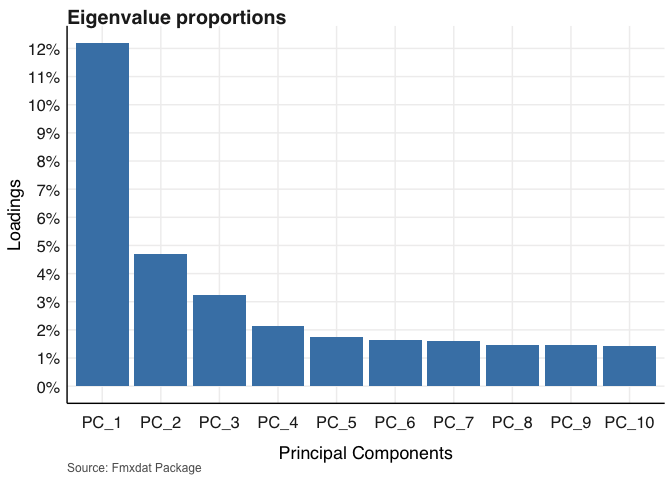
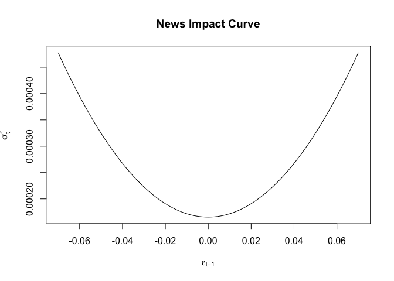

Financial Econometrics Practical

# Outline

This Readme will outline all the following questions by means of
explaining, interpreting and reasoning through all the necessary code
and functions, whereafter a simplified output will be reproduced within
each respective question folders.

First, I sanitize my working environment and source all the necessary
functions that will be incorporated into our analyses.

Now I procceed with the respective questions.

# Question 1: Yield Spread.

Since the beginning of 2020 the current Yield spreads in local
mid-to-longer dated bond yields have been the highest in decades. This
is conventionally expressed as the difference in these yields of these
instruments in percentage points or basis points.

To investigate this I will conduct a brief analysis on what is the
driving is healed spreads. I begin by initialising my data:

Here I gather the data and plot the three South African bond yields.
Here are the yields are plotted against time And it is clear that other
than a few notable periods such as crashes of 2001 to 2003, And the
financial crisis, There is a consistent pattern where the longer term
bonds yields slightly higher but all three follow similar trajectories.
What is becoming noticeable now in most return series is in a similar
manner to the financial crisis various patterns are observed from the
beginning of the Covid pandemic.

    ## Loading required package: xts

    ## Loading required package: zoo

    ## 
    ## Attaching package: 'zoo'

    ## The following objects are masked from 'package:base':
    ## 
    ##     as.Date, as.Date.numeric

    ## 
    ## Attaching package: 'xts'

    ## The following objects are masked from 'package:dplyr':
    ## 
    ##     first, last

    ## 
    ## Attaching package: 'PerformanceAnalytics'

    ## The following object is masked from 'package:graphics':
    ## 
    ##     legend

 I notice
several places where rates stagnate and thus check for missing values in
the data.

    ##           date  Bond Yield
    ##     [1,] FALSE FALSE FALSE
    ##     [2,] FALSE FALSE FALSE
    ##     [3,] FALSE FALSE FALSE
    ##     [4,] FALSE FALSE FALSE
    ##     [5,] FALSE FALSE FALSE
    ##     [6,] FALSE FALSE FALSE
    ##     [7,] FALSE FALSE FALSE
    ##     [8,] FALSE FALSE FALSE
    ##     [9,] FALSE FALSE FALSE
    ##    [10,] FALSE FALSE FALSE
    ##    [11,] FALSE FALSE FALSE
    ##    [12,] FALSE FALSE FALSE
    ##    [13,] FALSE FALSE FALSE
    ##    [14,] FALSE FALSE FALSE
    ##    [15,] FALSE FALSE FALSE
    ##    [16,] FALSE FALSE FALSE
    ##    [17,] FALSE FALSE FALSE
    ##    [18,] FALSE FALSE FALSE
    ##    [19,] FALSE FALSE FALSE
    ##    [20,] FALSE FALSE FALSE
    ##    [21,] FALSE FALSE FALSE
    ##    [22,] FALSE FALSE FALSE
    ##    [23,] FALSE FALSE FALSE
    ##    [24,] FALSE FALSE FALSE
    ##    [25,] FALSE FALSE FALSE
    ##    [26,] FALSE FALSE FALSE
    ##    [27,] FALSE FALSE FALSE
    ##    [28,] FALSE FALSE FALSE
    ##    [29,] FALSE FALSE FALSE
    ##    [30,] FALSE FALSE FALSE
    ##    [31,] FALSE FALSE FALSE
    ##    [32,] FALSE FALSE FALSE
    ##    [33,] FALSE FALSE FALSE
    ##    [34,] FALSE FALSE FALSE
    ##    [35,] FALSE FALSE FALSE
    ##    [36,] FALSE FALSE FALSE
    ##    [37,] FALSE FALSE FALSE
    ##    [38,] FALSE FALSE FALSE
    ##    [39,] FALSE FALSE FALSE
    ##    [40,] FALSE FALSE FALSE
    ##    [41,] FALSE FALSE FALSE
    ##    [42,] FALSE FALSE FALSE
    ##    [43,] FALSE FALSE FALSE
    ##    [44,] FALSE FALSE FALSE
    ##    [45,] FALSE FALSE FALSE
    ##    [46,] FALSE FALSE FALSE
    ##    [47,] FALSE FALSE FALSE
    ##    [48,] FALSE FALSE FALSE
    ##    [49,] FALSE FALSE FALSE
    ##    [50,] FALSE FALSE FALSE
    ##    [51,] FALSE FALSE FALSE
    ##    [52,] FALSE FALSE FALSE
    ##    [53,] FALSE FALSE FALSE
    ##    [54,] FALSE FALSE FALSE
    ##    [55,] FALSE FALSE FALSE
    ##    [56,] FALSE FALSE FALSE
    ##    [57,] FALSE FALSE FALSE
    ##    [58,] FALSE FALSE FALSE
    ##    [59,] FALSE FALSE FALSE
    ##    [60,] FALSE FALSE FALSE
    ##    [61,] FALSE FALSE FALSE
    ##    [62,] FALSE FALSE FALSE
    ##    [63,] FALSE FALSE FALSE
    ##    [64,] FALSE FALSE FALSE
    ##    [65,] FALSE FALSE FALSE
    ##    [66,] FALSE FALSE FALSE
    ##    [67,] FALSE FALSE FALSE
    ##    [68,] FALSE FALSE FALSE
    ##    [69,] FALSE FALSE FALSE
    ##    [70,] FALSE FALSE FALSE
    ##    [71,] FALSE FALSE FALSE
    ##    [72,] FALSE FALSE FALSE
    ##    [73,] FALSE FALSE FALSE
    ##    [74,] FALSE FALSE FALSE
    ##    [75,] FALSE FALSE FALSE
    ##    [76,] FALSE FALSE FALSE
    ##    [77,] FALSE FALSE FALSE
    ##    [78,] FALSE FALSE FALSE
    ##    [79,] FALSE FALSE FALSE
    ##    [80,] FALSE FALSE FALSE
    ##    [81,] FALSE FALSE FALSE
    ##    [82,] FALSE FALSE FALSE
    ##    [83,] FALSE FALSE FALSE
    ##    [84,] FALSE FALSE FALSE
    ##    [85,] FALSE FALSE FALSE
    ##    [86,] FALSE FALSE FALSE
    ##    [87,] FALSE FALSE FALSE
    ##    [88,] FALSE FALSE FALSE
    ##    [89,] FALSE FALSE FALSE
    ##    [90,] FALSE FALSE FALSE
    ##    [91,] FALSE FALSE FALSE
    ##    [92,] FALSE FALSE FALSE
    ##    [93,] FALSE FALSE FALSE
    ##    [94,] FALSE FALSE FALSE
    ##    [95,] FALSE FALSE FALSE
    ##    [96,] FALSE FALSE FALSE
    ##    [97,] FALSE FALSE FALSE
    ##    [98,] FALSE FALSE FALSE
    ##    [99,] FALSE FALSE FALSE
    ##   [100,] FALSE FALSE FALSE
    ##   [101,] FALSE FALSE FALSE
    ##   [102,] FALSE FALSE FALSE
    ##   [103,] FALSE FALSE FALSE
    ##   [104,] FALSE FALSE FALSE
    ##   [105,] FALSE FALSE FALSE
    ##   [106,] FALSE FALSE FALSE
    ##   [107,] FALSE FALSE FALSE
    ##   [108,] FALSE FALSE FALSE
    ##   [109,] FALSE FALSE FALSE
    ##   [110,] FALSE FALSE FALSE
    ##   [111,] FALSE FALSE FALSE
    ##   [112,] FALSE FALSE FALSE
    ##   [113,] FALSE FALSE FALSE
    ##   [114,] FALSE FALSE FALSE
    ##   [115,] FALSE FALSE FALSE
    ##   [116,] FALSE FALSE FALSE
    ##   [117,] FALSE FALSE FALSE
    ##   [118,] FALSE FALSE FALSE
    ##   [119,] FALSE FALSE FALSE
    ##   [120,] FALSE FALSE FALSE
    ##   [121,] FALSE FALSE FALSE
    ##   [122,] FALSE FALSE FALSE
    ##   [123,] FALSE FALSE FALSE
    ##   [124,] FALSE FALSE FALSE
    ##   [125,] FALSE FALSE FALSE
    ##   [126,] FALSE FALSE FALSE
    ##   [127,] FALSE FALSE FALSE
    ##   [128,] FALSE FALSE FALSE
    ##   [129,] FALSE FALSE FALSE
    ##   [130,] FALSE FALSE FALSE
    ##   [131,] FALSE FALSE FALSE
    ##   [132,] FALSE FALSE FALSE
    ##   [133,] FALSE FALSE FALSE
    ##   [134,] FALSE FALSE FALSE
    ##   [135,] FALSE FALSE FALSE
    ##   [136,] FALSE FALSE FALSE
    ##   [137,] FALSE FALSE FALSE
    ##   [138,] FALSE FALSE FALSE
    ##   [139,] FALSE FALSE FALSE
    ##   [140,] FALSE FALSE FALSE
    ##   [141,] FALSE FALSE FALSE
    ##   [142,] FALSE FALSE FALSE
    ##   [143,] FALSE FALSE FALSE
    ##   [144,] FALSE FALSE FALSE
    ##   [145,] FALSE FALSE FALSE
    ##   [146,] FALSE FALSE FALSE
    ##   [147,] FALSE FALSE FALSE
    ##   [148,] FALSE FALSE FALSE
    ##   [149,] FALSE FALSE FALSE
    ##   [150,] FALSE FALSE FALSE
    ##   [151,] FALSE FALSE FALSE
    ##   [152,] FALSE FALSE FALSE
    ##   [153,] FALSE FALSE FALSE
    ##   [154,] FALSE FALSE FALSE
    ##   [155,] FALSE FALSE FALSE
    ##   [156,] FALSE FALSE FALSE
    ##   [157,] FALSE FALSE FALSE
    ##   [158,] FALSE FALSE FALSE
    ##   [159,] FALSE FALSE FALSE
    ##   [160,] FALSE FALSE FALSE
    ##   [161,] FALSE FALSE FALSE
    ##   [162,] FALSE FALSE FALSE
    ##   [163,] FALSE FALSE FALSE
    ##   [164,] FALSE FALSE FALSE
    ##   [165,] FALSE FALSE FALSE
    ##   [166,] FALSE FALSE FALSE
    ##   [167,] FALSE FALSE FALSE
    ##   [168,] FALSE FALSE FALSE
    ##   [169,] FALSE FALSE FALSE
    ##   [170,] FALSE FALSE FALSE
    ##   [171,] FALSE FALSE FALSE
    ##   [172,] FALSE FALSE FALSE
    ##   [173,] FALSE FALSE FALSE
    ##   [174,] FALSE FALSE FALSE
    ##   [175,] FALSE FALSE FALSE
    ##   [176,] FALSE FALSE FALSE
    ##   [177,] FALSE FALSE FALSE
    ##   [178,] FALSE FALSE FALSE
    ##   [179,] FALSE FALSE FALSE
    ##   [180,] FALSE FALSE FALSE
    ##   [181,] FALSE FALSE FALSE
    ##   [182,] FALSE FALSE FALSE
    ##   [183,] FALSE FALSE FALSE
    ##   [184,] FALSE FALSE FALSE
    ##   [185,] FALSE FALSE FALSE
    ##   [186,] FALSE FALSE FALSE
    ##   [187,] FALSE FALSE FALSE
    ##   [188,] FALSE FALSE FALSE
    ##   [189,] FALSE FALSE FALSE
    ##   [190,] FALSE FALSE FALSE
    ##   [191,] FALSE FALSE FALSE
    ##   [192,] FALSE FALSE FALSE
    ##   [193,] FALSE FALSE FALSE
    ##   [194,] FALSE FALSE FALSE
    ##   [195,] FALSE FALSE FALSE
    ##   [196,] FALSE FALSE FALSE
    ##   [197,] FALSE FALSE FALSE
    ##   [198,] FALSE FALSE FALSE
    ##   [199,] FALSE FALSE FALSE
    ##   [200,] FALSE FALSE FALSE
    ##   [201,] FALSE FALSE FALSE
    ##   [202,] FALSE FALSE FALSE
    ##   [203,] FALSE FALSE FALSE
    ##   [204,] FALSE FALSE FALSE
    ##   [205,] FALSE FALSE FALSE
    ##   [206,] FALSE FALSE FALSE
    ##   [207,] FALSE FALSE FALSE
    ##   [208,] FALSE FALSE FALSE
    ##   [209,] FALSE FALSE FALSE
    ##   [210,] FALSE FALSE FALSE
    ##   [211,] FALSE FALSE FALSE
    ##   [212,] FALSE FALSE FALSE
    ##   [213,] FALSE FALSE FALSE
    ##   [214,] FALSE FALSE FALSE
    ##   [215,] FALSE FALSE FALSE
    ##   [216,] FALSE FALSE FALSE
    ##   [217,] FALSE FALSE FALSE
    ##   [218,] FALSE FALSE FALSE
    ##   [219,] FALSE FALSE FALSE
    ##   [220,] FALSE FALSE FALSE
    ##   [221,] FALSE FALSE FALSE
    ##   [222,] FALSE FALSE FALSE
    ##   [223,] FALSE FALSE FALSE
    ##   [224,] FALSE FALSE FALSE
    ##   [225,] FALSE FALSE FALSE
    ##   [226,] FALSE FALSE FALSE
    ##   [227,] FALSE FALSE FALSE
    ##   [228,] FALSE FALSE FALSE
    ##   [229,] FALSE FALSE FALSE
    ##   [230,] FALSE FALSE FALSE
    ##   [231,] FALSE FALSE FALSE
    ##   [232,] FALSE FALSE FALSE
    ##   [233,] FALSE FALSE FALSE
    ##   [234,] FALSE FALSE FALSE
    ##   [235,] FALSE FALSE FALSE
    ##   [236,] FALSE FALSE FALSE
    ##   [237,] FALSE FALSE FALSE
    ##   [238,] FALSE FALSE FALSE
    ##   [239,] FALSE FALSE FALSE
    ##   [240,] FALSE FALSE FALSE
    ##   [241,] FALSE FALSE FALSE
    ##   [242,] FALSE FALSE FALSE
    ##   [243,] FALSE FALSE FALSE
    ##   [244,] FALSE FALSE FALSE
    ##   [245,] FALSE FALSE FALSE
    ##   [246,] FALSE FALSE FALSE
    ##   [247,] FALSE FALSE FALSE
    ##   [248,] FALSE FALSE FALSE
    ##   [249,] FALSE FALSE FALSE
    ##   [250,] FALSE FALSE FALSE
    ##   [251,] FALSE FALSE FALSE
    ##   [252,] FALSE FALSE FALSE
    ##   [253,] FALSE FALSE FALSE
    ##   [254,] FALSE FALSE FALSE
    ##   [255,] FALSE FALSE FALSE
    ##   [256,] FALSE FALSE FALSE
    ##   [257,] FALSE FALSE FALSE
    ##   [258,] FALSE FALSE FALSE
    ##   [259,] FALSE FALSE FALSE
    ##   [260,] FALSE FALSE FALSE
    ##   [261,] FALSE FALSE FALSE
    ##   [262,] FALSE FALSE FALSE
    ##   [263,] FALSE FALSE FALSE
    ##   [264,] FALSE FALSE FALSE
    ##   [265,] FALSE FALSE FALSE
    ##   [266,] FALSE FALSE FALSE
    ##   [267,] FALSE FALSE FALSE
    ##   [268,] FALSE FALSE FALSE
    ##   [269,] FALSE FALSE FALSE
    ##   [270,] FALSE FALSE FALSE
    ##   [271,] FALSE FALSE FALSE
    ##   [272,] FALSE FALSE FALSE
    ##   [273,] FALSE FALSE FALSE
    ##   [274,] FALSE FALSE FALSE
    ##   [275,] FALSE FALSE FALSE
    ##   [276,] FALSE FALSE FALSE
    ##   [277,] FALSE FALSE FALSE
    ##   [278,] FALSE FALSE FALSE
    ##   [279,] FALSE FALSE FALSE
    ##   [280,] FALSE FALSE FALSE
    ##   [281,] FALSE FALSE FALSE
    ##   [282,] FALSE FALSE FALSE
    ##   [283,] FALSE FALSE FALSE
    ##   [284,] FALSE FALSE FALSE
    ##   [285,] FALSE FALSE FALSE
    ##   [286,] FALSE FALSE FALSE
    ##   [287,] FALSE FALSE FALSE
    ##   [288,] FALSE FALSE FALSE
    ##   [289,] FALSE FALSE FALSE
    ##   [290,] FALSE FALSE FALSE
    ##   [291,] FALSE FALSE FALSE
    ##   [292,] FALSE FALSE FALSE
    ##   [293,] FALSE FALSE FALSE
    ##   [294,] FALSE FALSE FALSE
    ##   [295,] FALSE FALSE FALSE
    ##   [296,] FALSE FALSE FALSE
    ##   [297,] FALSE FALSE FALSE
    ##   [298,] FALSE FALSE FALSE
    ##   [299,] FALSE FALSE FALSE
    ##   [300,] FALSE FALSE FALSE
    ##   [301,] FALSE FALSE FALSE
    ##   [302,] FALSE FALSE FALSE
    ##   [303,] FALSE FALSE FALSE
    ##   [304,] FALSE FALSE FALSE
    ##   [305,] FALSE FALSE FALSE
    ##   [306,] FALSE FALSE FALSE
    ##   [307,] FALSE FALSE FALSE
    ##   [308,] FALSE FALSE FALSE
    ##   [309,] FALSE FALSE FALSE
    ##   [310,] FALSE FALSE FALSE
    ##   [311,] FALSE FALSE FALSE
    ##   [312,] FALSE FALSE FALSE
    ##   [313,] FALSE FALSE FALSE
    ##   [314,] FALSE FALSE FALSE
    ##   [315,] FALSE FALSE FALSE
    ##   [316,] FALSE FALSE FALSE
    ##   [317,] FALSE FALSE FALSE
    ##   [318,] FALSE FALSE FALSE
    ##   [319,] FALSE FALSE FALSE
    ##   [320,] FALSE FALSE FALSE
    ##   [321,] FALSE FALSE FALSE
    ##   [322,] FALSE FALSE FALSE
    ##   [323,] FALSE FALSE FALSE
    ##   [324,] FALSE FALSE FALSE
    ##   [325,] FALSE FALSE FALSE
    ##   [326,] FALSE FALSE FALSE
    ##   [327,] FALSE FALSE FALSE
    ##   [328,] FALSE FALSE FALSE
    ##   [329,] FALSE FALSE FALSE
    ##   [330,] FALSE FALSE FALSE
    ##   [331,] FALSE FALSE FALSE
    ##   [332,] FALSE FALSE FALSE
    ##   [333,] FALSE FALSE FALSE
    ##   [334,] FALSE FALSE FALSE
    ##   [335,] FALSE FALSE FALSE
    ##   [336,] FALSE FALSE FALSE
    ##   [337,] FALSE FALSE FALSE
    ##   [338,] FALSE FALSE FALSE
    ##   [339,] FALSE FALSE FALSE
    ##   [340,] FALSE FALSE FALSE
    ##   [341,] FALSE FALSE FALSE
    ##   [342,] FALSE FALSE FALSE
    ##   [343,] FALSE FALSE FALSE
    ##   [344,] FALSE FALSE FALSE
    ##   [345,] FALSE FALSE FALSE
    ##   [346,] FALSE FALSE FALSE
    ##   [347,] FALSE FALSE FALSE
    ##   [348,] FALSE FALSE FALSE
    ##   [349,] FALSE FALSE FALSE
    ##   [350,] FALSE FALSE FALSE
    ##   [351,] FALSE FALSE FALSE
    ##   [352,] FALSE FALSE FALSE
    ##   [353,] FALSE FALSE FALSE
    ##   [354,] FALSE FALSE FALSE
    ##   [355,] FALSE FALSE FALSE
    ##   [356,] FALSE FALSE FALSE
    ##   [357,] FALSE FALSE FALSE
    ##   [358,] FALSE FALSE FALSE
    ##   [359,] FALSE FALSE FALSE
    ##   [360,] FALSE FALSE FALSE
    ##   [361,] FALSE FALSE FALSE
    ##   [362,] FALSE FALSE FALSE
    ##   [363,] FALSE FALSE FALSE
    ##   [364,] FALSE FALSE FALSE
    ##   [365,] FALSE FALSE FALSE
    ##   [366,] FALSE FALSE FALSE
    ##   [367,] FALSE FALSE FALSE
    ##   [368,] FALSE FALSE FALSE
    ##   [369,] FALSE FALSE FALSE
    ##   [370,] FALSE FALSE FALSE
    ##   [371,] FALSE FALSE FALSE
    ##   [372,] FALSE FALSE FALSE
    ##   [373,] FALSE FALSE FALSE
    ##   [374,] FALSE FALSE FALSE
    ##   [375,] FALSE FALSE FALSE
    ##   [376,] FALSE FALSE FALSE
    ##   [377,] FALSE FALSE FALSE
    ##   [378,] FALSE FALSE FALSE
    ##   [379,] FALSE FALSE FALSE
    ##   [380,] FALSE FALSE FALSE
    ##   [381,] FALSE FALSE FALSE
    ##   [382,] FALSE FALSE FALSE
    ##   [383,] FALSE FALSE FALSE
    ##   [384,] FALSE FALSE FALSE
    ##   [385,] FALSE FALSE FALSE
    ##   [386,] FALSE FALSE FALSE
    ##   [387,] FALSE FALSE FALSE
    ##   [388,] FALSE FALSE FALSE
    ##   [389,] FALSE FALSE FALSE
    ##   [390,] FALSE FALSE FALSE
    ##   [391,] FALSE FALSE FALSE
    ##   [392,] FALSE FALSE FALSE
    ##   [393,] FALSE FALSE FALSE
    ##   [394,] FALSE FALSE FALSE
    ##   [395,] FALSE FALSE FALSE
    ##   [396,] FALSE FALSE FALSE
    ##   [397,] FALSE FALSE FALSE
    ##   [398,] FALSE FALSE FALSE
    ##   [399,] FALSE FALSE FALSE
    ##   [400,] FALSE FALSE FALSE
    ##   [401,] FALSE FALSE FALSE
    ##   [402,] FALSE FALSE FALSE
    ##   [403,] FALSE FALSE FALSE
    ##   [404,] FALSE FALSE FALSE
    ##   [405,] FALSE FALSE FALSE
    ##   [406,] FALSE FALSE FALSE
    ##   [407,] FALSE FALSE FALSE
    ##   [408,] FALSE FALSE FALSE
    ##   [409,] FALSE FALSE FALSE
    ##   [410,] FALSE FALSE FALSE
    ##   [411,] FALSE FALSE FALSE
    ##   [412,] FALSE FALSE FALSE
    ##   [413,] FALSE FALSE FALSE
    ##   [414,] FALSE FALSE FALSE
    ##   [415,] FALSE FALSE FALSE
    ##   [416,] FALSE FALSE FALSE
    ##   [417,] FALSE FALSE FALSE
    ##   [418,] FALSE FALSE FALSE
    ##   [419,] FALSE FALSE FALSE
    ##   [420,] FALSE FALSE FALSE
    ##   [421,] FALSE FALSE FALSE
    ##   [422,] FALSE FALSE FALSE
    ##   [423,] FALSE FALSE FALSE
    ##   [424,] FALSE FALSE FALSE
    ##   [425,] FALSE FALSE FALSE
    ##   [426,] FALSE FALSE FALSE
    ##   [427,] FALSE FALSE FALSE
    ##   [428,] FALSE FALSE FALSE
    ##   [429,] FALSE FALSE FALSE
    ##   [430,] FALSE FALSE FALSE
    ##   [431,] FALSE FALSE FALSE
    ##   [432,] FALSE FALSE FALSE
    ##   [433,] FALSE FALSE FALSE
    ##   [434,] FALSE FALSE FALSE
    ##   [435,] FALSE FALSE FALSE
    ##   [436,] FALSE FALSE FALSE
    ##   [437,] FALSE FALSE FALSE
    ##   [438,] FALSE FALSE FALSE
    ##   [439,] FALSE FALSE FALSE
    ##   [440,] FALSE FALSE FALSE
    ##   [441,] FALSE FALSE FALSE
    ##   [442,] FALSE FALSE FALSE
    ##   [443,] FALSE FALSE FALSE
    ##   [444,] FALSE FALSE FALSE
    ##   [445,] FALSE FALSE FALSE
    ##   [446,] FALSE FALSE FALSE
    ##   [447,] FALSE FALSE FALSE
    ##   [448,] FALSE FALSE FALSE
    ##   [449,] FALSE FALSE FALSE
    ##   [450,] FALSE FALSE FALSE
    ##   [451,] FALSE FALSE FALSE
    ##   [452,] FALSE FALSE FALSE
    ##   [453,] FALSE FALSE FALSE
    ##   [454,] FALSE FALSE FALSE
    ##   [455,] FALSE FALSE FALSE
    ##   [456,] FALSE FALSE FALSE
    ##   [457,] FALSE FALSE FALSE
    ##   [458,] FALSE FALSE FALSE
    ##   [459,] FALSE FALSE FALSE
    ##   [460,] FALSE FALSE FALSE
    ##   [461,] FALSE FALSE FALSE
    ##   [462,] FALSE FALSE FALSE
    ##   [463,] FALSE FALSE FALSE
    ##   [464,] FALSE FALSE FALSE
    ##   [465,] FALSE FALSE FALSE
    ##   [466,] FALSE FALSE FALSE
    ##   [467,] FALSE FALSE FALSE
    ##   [468,] FALSE FALSE FALSE
    ##   [469,] FALSE FALSE FALSE
    ##   [470,] FALSE FALSE FALSE
    ##   [471,] FALSE FALSE FALSE
    ##   [472,] FALSE FALSE FALSE
    ##   [473,] FALSE FALSE FALSE
    ##   [474,] FALSE FALSE FALSE
    ##   [475,] FALSE FALSE FALSE
    ##   [476,] FALSE FALSE FALSE
    ##   [477,] FALSE FALSE FALSE
    ##   [478,] FALSE FALSE FALSE
    ##   [479,] FALSE FALSE FALSE
    ##   [480,] FALSE FALSE FALSE
    ##   [481,] FALSE FALSE FALSE
    ##   [482,] FALSE FALSE FALSE
    ##   [483,] FALSE FALSE FALSE
    ##   [484,] FALSE FALSE FALSE
    ##   [485,] FALSE FALSE FALSE
    ##   [486,] FALSE FALSE FALSE
    ##   [487,] FALSE FALSE FALSE
    ##   [488,] FALSE FALSE FALSE
    ##   [489,] FALSE FALSE FALSE
    ##   [490,] FALSE FALSE FALSE
    ##   [491,] FALSE FALSE FALSE
    ##   [492,] FALSE FALSE FALSE
    ##   [493,] FALSE FALSE FALSE
    ##   [494,] FALSE FALSE FALSE
    ##   [495,] FALSE FALSE FALSE
    ##   [496,] FALSE FALSE FALSE
    ##   [497,] FALSE FALSE FALSE
    ##   [498,] FALSE FALSE FALSE
    ##   [499,] FALSE FALSE FALSE
    ##   [500,] FALSE FALSE FALSE
    ##   [501,] FALSE FALSE FALSE
    ##   [502,] FALSE FALSE FALSE
    ##   [503,] FALSE FALSE FALSE
    ##   [504,] FALSE FALSE FALSE
    ##   [505,] FALSE FALSE FALSE
    ##   [506,] FALSE FALSE FALSE
    ##   [507,] FALSE FALSE FALSE
    ##   [508,] FALSE FALSE FALSE
    ##   [509,] FALSE FALSE FALSE
    ##   [510,] FALSE FALSE FALSE
    ##   [511,] FALSE FALSE FALSE
    ##   [512,] FALSE FALSE FALSE
    ##   [513,] FALSE FALSE FALSE
    ##   [514,] FALSE FALSE FALSE
    ##   [515,] FALSE FALSE FALSE
    ##   [516,] FALSE FALSE FALSE
    ##   [517,] FALSE FALSE FALSE
    ##   [518,] FALSE FALSE FALSE
    ##   [519,] FALSE FALSE FALSE
    ##   [520,] FALSE FALSE FALSE
    ##   [521,] FALSE FALSE FALSE
    ##   [522,] FALSE FALSE FALSE
    ##   [523,] FALSE FALSE FALSE
    ##   [524,] FALSE FALSE FALSE
    ##   [525,] FALSE FALSE FALSE
    ##   [526,] FALSE FALSE FALSE
    ##   [527,] FALSE FALSE FALSE
    ##   [528,] FALSE FALSE FALSE
    ##   [529,] FALSE FALSE FALSE
    ##   [530,] FALSE FALSE FALSE
    ##   [531,] FALSE FALSE FALSE
    ##   [532,] FALSE FALSE FALSE
    ##   [533,] FALSE FALSE FALSE
    ##   [534,] FALSE FALSE FALSE
    ##   [535,] FALSE FALSE FALSE
    ##   [536,] FALSE FALSE FALSE
    ##   [537,] FALSE FALSE FALSE
    ##   [538,] FALSE FALSE FALSE
    ##   [539,] FALSE FALSE FALSE
    ##   [540,] FALSE FALSE FALSE
    ##   [541,] FALSE FALSE FALSE
    ##   [542,] FALSE FALSE FALSE
    ##   [543,] FALSE FALSE FALSE
    ##   [544,] FALSE FALSE FALSE
    ##   [545,] FALSE FALSE FALSE
    ##   [546,] FALSE FALSE FALSE
    ##   [547,] FALSE FALSE FALSE
    ##   [548,] FALSE FALSE FALSE
    ##   [549,] FALSE FALSE FALSE
    ##   [550,] FALSE FALSE FALSE
    ##   [551,] FALSE FALSE FALSE
    ##   [552,] FALSE FALSE FALSE
    ##   [553,] FALSE FALSE FALSE
    ##   [554,] FALSE FALSE FALSE
    ##   [555,] FALSE FALSE FALSE
    ##   [556,] FALSE FALSE FALSE
    ##   [557,] FALSE FALSE FALSE
    ##   [558,] FALSE FALSE FALSE
    ##   [559,] FALSE FALSE FALSE
    ##   [560,] FALSE FALSE FALSE
    ##   [561,] FALSE FALSE FALSE
    ##   [562,] FALSE FALSE FALSE
    ##   [563,] FALSE FALSE FALSE
    ##   [564,] FALSE FALSE FALSE
    ##   [565,] FALSE FALSE FALSE
    ##   [566,] FALSE FALSE FALSE
    ##   [567,] FALSE FALSE FALSE
    ##   [568,] FALSE FALSE FALSE
    ##   [569,] FALSE FALSE FALSE
    ##   [570,] FALSE FALSE FALSE
    ##   [571,] FALSE FALSE FALSE
    ##   [572,] FALSE FALSE FALSE
    ##   [573,] FALSE FALSE FALSE
    ##   [574,] FALSE FALSE FALSE
    ##   [575,] FALSE FALSE FALSE
    ##   [576,] FALSE FALSE FALSE
    ##   [577,] FALSE FALSE FALSE
    ##   [578,] FALSE FALSE FALSE
    ##   [579,] FALSE FALSE FALSE
    ##   [580,] FALSE FALSE FALSE
    ##   [581,] FALSE FALSE FALSE
    ##   [582,] FALSE FALSE FALSE
    ##   [583,] FALSE FALSE FALSE
    ##   [584,] FALSE FALSE FALSE
    ##   [585,] FALSE FALSE FALSE
    ##   [586,] FALSE FALSE FALSE
    ##   [587,] FALSE FALSE FALSE
    ##   [588,] FALSE FALSE FALSE
    ##   [589,] FALSE FALSE FALSE
    ##   [590,] FALSE FALSE FALSE
    ##   [591,] FALSE FALSE FALSE
    ##   [592,] FALSE FALSE FALSE
    ##   [593,] FALSE FALSE FALSE
    ##   [594,] FALSE FALSE FALSE
    ##   [595,] FALSE FALSE FALSE
    ##   [596,] FALSE FALSE FALSE
    ##   [597,] FALSE FALSE FALSE
    ##   [598,] FALSE FALSE FALSE
    ##   [599,] FALSE FALSE FALSE
    ##   [600,] FALSE FALSE FALSE
    ##   [601,] FALSE FALSE FALSE
    ##   [602,] FALSE FALSE FALSE
    ##   [603,] FALSE FALSE FALSE
    ##   [604,] FALSE FALSE FALSE
    ##   [605,] FALSE FALSE FALSE
    ##   [606,] FALSE FALSE FALSE
    ##   [607,] FALSE FALSE FALSE
    ##   [608,] FALSE FALSE FALSE
    ##   [609,] FALSE FALSE FALSE
    ##   [610,] FALSE FALSE FALSE
    ##   [611,] FALSE FALSE FALSE
    ##   [612,] FALSE FALSE FALSE
    ##   [613,] FALSE FALSE FALSE
    ##   [614,] FALSE FALSE FALSE
    ##   [615,] FALSE FALSE FALSE
    ##   [616,] FALSE FALSE FALSE
    ##   [617,] FALSE FALSE FALSE
    ##   [618,] FALSE FALSE FALSE
    ##   [619,] FALSE FALSE FALSE
    ##   [620,] FALSE FALSE FALSE
    ##   [621,] FALSE FALSE FALSE
    ##   [622,] FALSE FALSE FALSE
    ##   [623,] FALSE FALSE FALSE
    ##   [624,] FALSE FALSE FALSE
    ##   [625,] FALSE FALSE FALSE
    ##   [626,] FALSE FALSE FALSE
    ##   [627,] FALSE FALSE FALSE
    ##   [628,] FALSE FALSE FALSE
    ##   [629,] FALSE FALSE FALSE
    ##   [630,] FALSE FALSE FALSE
    ##   [631,] FALSE FALSE FALSE
    ##   [632,] FALSE FALSE FALSE
    ##   [633,] FALSE FALSE FALSE
    ##   [634,] FALSE FALSE FALSE
    ##   [635,] FALSE FALSE FALSE
    ##   [636,] FALSE FALSE FALSE
    ##   [637,] FALSE FALSE FALSE
    ##   [638,] FALSE FALSE FALSE
    ##   [639,] FALSE FALSE FALSE
    ##   [640,] FALSE FALSE FALSE
    ##   [641,] FALSE FALSE FALSE
    ##   [642,] FALSE FALSE FALSE
    ##   [643,] FALSE FALSE FALSE
    ##   [644,] FALSE FALSE FALSE
    ##   [645,] FALSE FALSE FALSE
    ##   [646,] FALSE FALSE FALSE
    ##   [647,] FALSE FALSE FALSE
    ##   [648,] FALSE FALSE FALSE
    ##   [649,] FALSE FALSE FALSE
    ##   [650,] FALSE FALSE FALSE
    ##   [651,] FALSE FALSE FALSE
    ##   [652,] FALSE FALSE FALSE
    ##   [653,] FALSE FALSE FALSE
    ##   [654,] FALSE FALSE FALSE
    ##   [655,] FALSE FALSE FALSE
    ##   [656,] FALSE FALSE FALSE
    ##   [657,] FALSE FALSE FALSE
    ##   [658,] FALSE FALSE FALSE
    ##   [659,] FALSE FALSE FALSE
    ##   [660,] FALSE FALSE FALSE
    ##   [661,] FALSE FALSE FALSE
    ##   [662,] FALSE FALSE FALSE
    ##   [663,] FALSE FALSE FALSE
    ##   [664,] FALSE FALSE FALSE
    ##   [665,] FALSE FALSE FALSE
    ##   [666,] FALSE FALSE FALSE
    ##   [667,] FALSE FALSE FALSE
    ##   [668,] FALSE FALSE FALSE
    ##   [669,] FALSE FALSE FALSE
    ##   [670,] FALSE FALSE FALSE
    ##   [671,] FALSE FALSE FALSE
    ##   [672,] FALSE FALSE FALSE
    ##   [673,] FALSE FALSE FALSE
    ##   [674,] FALSE FALSE FALSE
    ##   [675,] FALSE FALSE FALSE
    ##   [676,] FALSE FALSE FALSE
    ##   [677,] FALSE FALSE FALSE
    ##   [678,] FALSE FALSE FALSE
    ##   [679,] FALSE FALSE FALSE
    ##   [680,] FALSE FALSE FALSE
    ##   [681,] FALSE FALSE FALSE
    ##   [682,] FALSE FALSE FALSE
    ##   [683,] FALSE FALSE FALSE
    ##   [684,] FALSE FALSE FALSE
    ##   [685,] FALSE FALSE FALSE
    ##   [686,] FALSE FALSE FALSE
    ##   [687,] FALSE FALSE FALSE
    ##   [688,] FALSE FALSE FALSE
    ##   [689,] FALSE FALSE FALSE
    ##   [690,] FALSE FALSE FALSE
    ##   [691,] FALSE FALSE FALSE
    ##   [692,] FALSE FALSE FALSE
    ##   [693,] FALSE FALSE FALSE
    ##   [694,] FALSE FALSE FALSE
    ##   [695,] FALSE FALSE FALSE
    ##   [696,] FALSE FALSE FALSE
    ##   [697,] FALSE FALSE FALSE
    ##   [698,] FALSE FALSE FALSE
    ##   [699,] FALSE FALSE FALSE
    ##   [700,] FALSE FALSE FALSE
    ##   [701,] FALSE FALSE FALSE
    ##   [702,] FALSE FALSE FALSE
    ##   [703,] FALSE FALSE FALSE
    ##   [704,] FALSE FALSE FALSE
    ##   [705,] FALSE FALSE FALSE
    ##   [706,] FALSE FALSE FALSE
    ##   [707,] FALSE FALSE FALSE
    ##   [708,] FALSE FALSE FALSE
    ##   [709,] FALSE FALSE FALSE
    ##   [710,] FALSE FALSE FALSE
    ##   [711,] FALSE FALSE FALSE
    ##   [712,] FALSE FALSE FALSE
    ##   [713,] FALSE FALSE FALSE
    ##   [714,] FALSE FALSE FALSE
    ##   [715,] FALSE FALSE FALSE
    ##   [716,] FALSE FALSE FALSE
    ##   [717,] FALSE FALSE FALSE
    ##   [718,] FALSE FALSE FALSE
    ##   [719,] FALSE FALSE FALSE
    ##   [720,] FALSE FALSE FALSE
    ##   [721,] FALSE FALSE FALSE
    ##   [722,] FALSE FALSE FALSE
    ##   [723,] FALSE FALSE FALSE
    ##   [724,] FALSE FALSE FALSE
    ##   [725,] FALSE FALSE FALSE
    ##   [726,] FALSE FALSE FALSE
    ##   [727,] FALSE FALSE FALSE
    ##   [728,] FALSE FALSE FALSE
    ##   [729,] FALSE FALSE FALSE
    ##   [730,] FALSE FALSE FALSE
    ##   [731,] FALSE FALSE FALSE
    ##   [732,] FALSE FALSE FALSE
    ##   [733,] FALSE FALSE FALSE
    ##   [734,] FALSE FALSE FALSE
    ##   [735,] FALSE FALSE FALSE
    ##   [736,] FALSE FALSE FALSE
    ##   [737,] FALSE FALSE FALSE
    ##   [738,] FALSE FALSE FALSE
    ##   [739,] FALSE FALSE FALSE
    ##   [740,] FALSE FALSE FALSE
    ##   [741,] FALSE FALSE FALSE
    ##   [742,] FALSE FALSE FALSE
    ##   [743,] FALSE FALSE FALSE
    ##   [744,] FALSE FALSE FALSE
    ##   [745,] FALSE FALSE FALSE
    ##   [746,] FALSE FALSE FALSE
    ##   [747,] FALSE FALSE FALSE
    ##   [748,] FALSE FALSE FALSE
    ##   [749,] FALSE FALSE FALSE
    ##   [750,] FALSE FALSE FALSE
    ##   [751,] FALSE FALSE FALSE
    ##   [752,] FALSE FALSE FALSE
    ##   [753,] FALSE FALSE FALSE
    ##   [754,] FALSE FALSE FALSE
    ##   [755,] FALSE FALSE FALSE
    ##   [756,] FALSE FALSE FALSE
    ##   [757,] FALSE FALSE FALSE
    ##   [758,] FALSE FALSE FALSE
    ##   [759,] FALSE FALSE FALSE
    ##   [760,] FALSE FALSE FALSE
    ##   [761,] FALSE FALSE FALSE
    ##   [762,] FALSE FALSE FALSE
    ##   [763,] FALSE FALSE FALSE
    ##   [764,] FALSE FALSE FALSE
    ##   [765,] FALSE FALSE FALSE
    ##   [766,] FALSE FALSE FALSE
    ##   [767,] FALSE FALSE FALSE
    ##   [768,] FALSE FALSE FALSE
    ##   [769,] FALSE FALSE FALSE
    ##   [770,] FALSE FALSE FALSE
    ##   [771,] FALSE FALSE FALSE
    ##   [772,] FALSE FALSE FALSE
    ##   [773,] FALSE FALSE FALSE
    ##   [774,] FALSE FALSE FALSE
    ##   [775,] FALSE FALSE FALSE
    ##   [776,] FALSE FALSE FALSE
    ##   [777,] FALSE FALSE FALSE
    ##   [778,] FALSE FALSE FALSE
    ##   [779,] FALSE FALSE FALSE
    ##   [780,] FALSE FALSE FALSE
    ##   [781,] FALSE FALSE FALSE
    ##   [782,] FALSE FALSE FALSE
    ##   [783,] FALSE FALSE FALSE
    ##   [784,] FALSE FALSE FALSE
    ##   [785,] FALSE FALSE FALSE
    ##   [786,] FALSE FALSE FALSE
    ##   [787,] FALSE FALSE FALSE
    ##   [788,] FALSE FALSE FALSE
    ##   [789,] FALSE FALSE FALSE
    ##   [790,] FALSE FALSE FALSE
    ##   [791,] FALSE FALSE FALSE
    ##   [792,] FALSE FALSE FALSE
    ##   [793,] FALSE FALSE FALSE
    ##   [794,] FALSE FALSE FALSE
    ##   [795,] FALSE FALSE FALSE
    ##   [796,] FALSE FALSE FALSE
    ##   [797,] FALSE FALSE FALSE
    ##   [798,] FALSE FALSE FALSE
    ##   [799,] FALSE FALSE FALSE
    ##   [800,] FALSE FALSE FALSE
    ##   [801,] FALSE FALSE FALSE
    ##   [802,] FALSE FALSE FALSE
    ##   [803,] FALSE FALSE FALSE
    ##   [804,] FALSE FALSE FALSE
    ##   [805,] FALSE FALSE FALSE
    ##   [806,] FALSE FALSE FALSE
    ##   [807,] FALSE FALSE FALSE
    ##   [808,] FALSE FALSE FALSE
    ##   [809,] FALSE FALSE FALSE
    ##   [810,] FALSE FALSE FALSE
    ##   [811,] FALSE FALSE FALSE
    ##   [812,] FALSE FALSE FALSE
    ##   [813,] FALSE FALSE FALSE
    ##   [814,] FALSE FALSE FALSE
    ##   [815,] FALSE FALSE FALSE
    ##   [816,] FALSE FALSE FALSE
    ##   [817,] FALSE FALSE FALSE
    ##   [818,] FALSE FALSE FALSE
    ##   [819,] FALSE FALSE FALSE
    ##   [820,] FALSE FALSE FALSE
    ##   [821,] FALSE FALSE FALSE
    ##   [822,] FALSE FALSE FALSE
    ##   [823,] FALSE FALSE FALSE
    ##   [824,] FALSE FALSE FALSE
    ##   [825,] FALSE FALSE FALSE
    ##   [826,] FALSE FALSE FALSE
    ##   [827,] FALSE FALSE FALSE
    ##   [828,] FALSE FALSE FALSE
    ##   [829,] FALSE FALSE FALSE
    ##   [830,] FALSE FALSE FALSE
    ##   [831,] FALSE FALSE FALSE
    ##   [832,] FALSE FALSE FALSE
    ##   [833,] FALSE FALSE FALSE
    ##   [834,] FALSE FALSE FALSE
    ##   [835,] FALSE FALSE FALSE
    ##   [836,] FALSE FALSE FALSE
    ##   [837,] FALSE FALSE FALSE
    ##   [838,] FALSE FALSE FALSE
    ##   [839,] FALSE FALSE FALSE
    ##   [840,] FALSE FALSE FALSE
    ##   [841,] FALSE FALSE FALSE
    ##   [842,] FALSE FALSE FALSE
    ##   [843,] FALSE FALSE FALSE
    ##   [844,] FALSE FALSE FALSE
    ##   [845,] FALSE FALSE FALSE
    ##   [846,] FALSE FALSE FALSE
    ##   [847,] FALSE FALSE FALSE
    ##   [848,] FALSE FALSE FALSE
    ##   [849,] FALSE FALSE FALSE
    ##   [850,] FALSE FALSE FALSE
    ##   [851,] FALSE FALSE FALSE
    ##   [852,] FALSE FALSE FALSE
    ##   [853,] FALSE FALSE FALSE
    ##   [854,] FALSE FALSE FALSE
    ##   [855,] FALSE FALSE FALSE
    ##   [856,] FALSE FALSE FALSE
    ##   [857,] FALSE FALSE FALSE
    ##   [858,] FALSE FALSE FALSE
    ##   [859,] FALSE FALSE FALSE
    ##   [860,] FALSE FALSE FALSE
    ##   [861,] FALSE FALSE FALSE
    ##   [862,] FALSE FALSE FALSE
    ##   [863,] FALSE FALSE FALSE
    ##   [864,] FALSE FALSE FALSE
    ##   [865,] FALSE FALSE FALSE
    ##   [866,] FALSE FALSE FALSE
    ##   [867,] FALSE FALSE FALSE
    ##   [868,] FALSE FALSE FALSE
    ##   [869,] FALSE FALSE FALSE
    ##   [870,] FALSE FALSE FALSE
    ##   [871,] FALSE FALSE FALSE
    ##   [872,] FALSE FALSE FALSE
    ##   [873,] FALSE FALSE FALSE
    ##   [874,] FALSE FALSE FALSE
    ##   [875,] FALSE FALSE FALSE
    ##   [876,] FALSE FALSE FALSE
    ##   [877,] FALSE FALSE FALSE
    ##   [878,] FALSE FALSE FALSE
    ##   [879,] FALSE FALSE FALSE
    ##   [880,] FALSE FALSE FALSE
    ##   [881,] FALSE FALSE FALSE
    ##   [882,] FALSE FALSE FALSE
    ##   [883,] FALSE FALSE FALSE
    ##   [884,] FALSE FALSE FALSE
    ##   [885,] FALSE FALSE FALSE
    ##   [886,] FALSE FALSE FALSE
    ##   [887,] FALSE FALSE FALSE
    ##   [888,] FALSE FALSE FALSE
    ##   [889,] FALSE FALSE FALSE
    ##   [890,] FALSE FALSE FALSE
    ##   [891,] FALSE FALSE FALSE
    ##   [892,] FALSE FALSE FALSE
    ##   [893,] FALSE FALSE FALSE
    ##   [894,] FALSE FALSE FALSE
    ##   [895,] FALSE FALSE FALSE
    ##   [896,] FALSE FALSE FALSE
    ##   [897,] FALSE FALSE FALSE
    ##   [898,] FALSE FALSE FALSE
    ##   [899,] FALSE FALSE FALSE
    ##   [900,] FALSE FALSE FALSE
    ##   [901,] FALSE FALSE FALSE
    ##   [902,] FALSE FALSE FALSE
    ##   [903,] FALSE FALSE FALSE
    ##   [904,] FALSE FALSE FALSE
    ##   [905,] FALSE FALSE FALSE
    ##   [906,] FALSE FALSE FALSE
    ##   [907,] FALSE FALSE FALSE
    ##   [908,] FALSE FALSE FALSE
    ##   [909,] FALSE FALSE FALSE
    ##   [910,] FALSE FALSE FALSE
    ##   [911,] FALSE FALSE FALSE
    ##   [912,] FALSE FALSE FALSE
    ##   [913,] FALSE FALSE FALSE
    ##   [914,] FALSE FALSE FALSE
    ##   [915,] FALSE FALSE FALSE
    ##   [916,] FALSE FALSE FALSE
    ##   [917,] FALSE FALSE FALSE
    ##   [918,] FALSE FALSE FALSE
    ##   [919,] FALSE FALSE FALSE
    ##   [920,] FALSE FALSE FALSE
    ##   [921,] FALSE FALSE FALSE
    ##   [922,] FALSE FALSE FALSE
    ##   [923,] FALSE FALSE FALSE
    ##   [924,] FALSE FALSE FALSE
    ##   [925,] FALSE FALSE FALSE
    ##   [926,] FALSE FALSE FALSE
    ##   [927,] FALSE FALSE FALSE
    ##   [928,] FALSE FALSE FALSE
    ##   [929,] FALSE FALSE FALSE
    ##   [930,] FALSE FALSE FALSE
    ##   [931,] FALSE FALSE FALSE
    ##   [932,] FALSE FALSE FALSE
    ##   [933,] FALSE FALSE FALSE
    ##   [934,] FALSE FALSE FALSE
    ##   [935,] FALSE FALSE FALSE
    ##   [936,] FALSE FALSE FALSE
    ##   [937,] FALSE FALSE FALSE
    ##   [938,] FALSE FALSE FALSE
    ##   [939,] FALSE FALSE FALSE
    ##   [940,] FALSE FALSE FALSE
    ##   [941,] FALSE FALSE FALSE
    ##   [942,] FALSE FALSE FALSE
    ##   [943,] FALSE FALSE FALSE
    ##   [944,] FALSE FALSE FALSE
    ##   [945,] FALSE FALSE FALSE
    ##   [946,] FALSE FALSE FALSE
    ##   [947,] FALSE FALSE FALSE
    ##   [948,] FALSE FALSE FALSE
    ##   [949,] FALSE FALSE FALSE
    ##   [950,] FALSE FALSE FALSE
    ##   [951,] FALSE FALSE FALSE
    ##   [952,] FALSE FALSE FALSE
    ##   [953,] FALSE FALSE FALSE
    ##   [954,] FALSE FALSE FALSE
    ##   [955,] FALSE FALSE FALSE
    ##   [956,] FALSE FALSE FALSE
    ##   [957,] FALSE FALSE FALSE
    ##   [958,] FALSE FALSE FALSE
    ##   [959,] FALSE FALSE FALSE
    ##   [960,] FALSE FALSE FALSE
    ##   [961,] FALSE FALSE FALSE
    ##   [962,] FALSE FALSE FALSE
    ##   [963,] FALSE FALSE FALSE
    ##   [964,] FALSE FALSE FALSE
    ##   [965,] FALSE FALSE FALSE
    ##   [966,] FALSE FALSE FALSE
    ##   [967,] FALSE FALSE FALSE
    ##   [968,] FALSE FALSE FALSE
    ##   [969,] FALSE FALSE FALSE
    ##   [970,] FALSE FALSE FALSE
    ##   [971,] FALSE FALSE FALSE
    ##   [972,] FALSE FALSE FALSE
    ##   [973,] FALSE FALSE FALSE
    ##   [974,] FALSE FALSE FALSE
    ##   [975,] FALSE FALSE FALSE
    ##   [976,] FALSE FALSE FALSE
    ##   [977,] FALSE FALSE FALSE
    ##   [978,] FALSE FALSE FALSE
    ##   [979,] FALSE FALSE FALSE
    ##   [980,] FALSE FALSE FALSE
    ##   [981,] FALSE FALSE FALSE
    ##   [982,] FALSE FALSE FALSE
    ##   [983,] FALSE FALSE FALSE
    ##   [984,] FALSE FALSE FALSE
    ##   [985,] FALSE FALSE FALSE
    ##   [986,] FALSE FALSE FALSE
    ##   [987,] FALSE FALSE FALSE
    ##   [988,] FALSE FALSE FALSE
    ##   [989,] FALSE FALSE FALSE
    ##   [990,] FALSE FALSE FALSE
    ##   [991,] FALSE FALSE FALSE
    ##   [992,] FALSE FALSE FALSE
    ##   [993,] FALSE FALSE FALSE
    ##   [994,] FALSE FALSE FALSE
    ##   [995,] FALSE FALSE FALSE
    ##   [996,] FALSE FALSE FALSE
    ##   [997,] FALSE FALSE FALSE
    ##   [998,] FALSE FALSE FALSE
    ##   [999,] FALSE FALSE FALSE
    ##  [1000,] FALSE FALSE FALSE
    ##  [1001,] FALSE FALSE FALSE
    ##  [1002,] FALSE FALSE FALSE
    ##  [1003,] FALSE FALSE FALSE
    ##  [1004,] FALSE FALSE FALSE
    ##  [1005,] FALSE FALSE FALSE
    ##  [1006,] FALSE FALSE FALSE
    ##  [1007,] FALSE FALSE FALSE
    ##  [1008,] FALSE FALSE FALSE
    ##  [1009,] FALSE FALSE FALSE
    ##  [1010,] FALSE FALSE FALSE
    ##  [1011,] FALSE FALSE FALSE
    ##  [1012,] FALSE FALSE FALSE
    ##  [1013,] FALSE FALSE FALSE
    ##  [1014,] FALSE FALSE FALSE
    ##  [1015,] FALSE FALSE FALSE
    ##  [1016,] FALSE FALSE FALSE
    ##  [1017,] FALSE FALSE FALSE
    ##  [1018,] FALSE FALSE FALSE
    ##  [1019,] FALSE FALSE FALSE
    ##  [1020,] FALSE FALSE FALSE
    ##  [1021,] FALSE FALSE FALSE
    ##  [1022,] FALSE FALSE FALSE
    ##  [1023,] FALSE FALSE FALSE
    ##  [1024,] FALSE FALSE FALSE
    ##  [1025,] FALSE FALSE FALSE
    ##  [1026,] FALSE FALSE FALSE
    ##  [1027,] FALSE FALSE FALSE
    ##  [1028,] FALSE FALSE FALSE
    ##  [1029,] FALSE FALSE FALSE
    ##  [1030,] FALSE FALSE FALSE
    ##  [1031,] FALSE FALSE FALSE
    ##  [1032,] FALSE FALSE FALSE
    ##  [1033,] FALSE FALSE FALSE
    ##  [1034,] FALSE FALSE FALSE
    ##  [1035,] FALSE FALSE FALSE
    ##  [1036,] FALSE FALSE FALSE
    ##  [1037,] FALSE FALSE FALSE
    ##  [1038,] FALSE FALSE FALSE
    ##  [1039,] FALSE FALSE FALSE
    ##  [1040,] FALSE FALSE FALSE
    ##  [1041,] FALSE FALSE FALSE
    ##  [1042,] FALSE FALSE FALSE
    ##  [1043,] FALSE FALSE FALSE
    ##  [1044,] FALSE FALSE FALSE
    ##  [1045,] FALSE FALSE FALSE
    ##  [1046,] FALSE FALSE FALSE
    ##  [1047,] FALSE FALSE FALSE
    ##  [1048,] FALSE FALSE FALSE
    ##  [1049,] FALSE FALSE FALSE
    ##  [1050,] FALSE FALSE FALSE
    ##  [1051,] FALSE FALSE FALSE
    ##  [1052,] FALSE FALSE FALSE
    ##  [1053,] FALSE FALSE FALSE
    ##  [1054,] FALSE FALSE FALSE
    ##  [1055,] FALSE FALSE FALSE
    ##  [1056,] FALSE FALSE FALSE
    ##  [1057,] FALSE FALSE FALSE
    ##  [1058,] FALSE FALSE FALSE
    ##  [1059,] FALSE FALSE FALSE
    ##  [1060,] FALSE FALSE FALSE
    ##  [1061,] FALSE FALSE FALSE
    ##  [1062,] FALSE FALSE FALSE
    ##  [1063,] FALSE FALSE FALSE
    ##  [1064,] FALSE FALSE FALSE
    ##  [1065,] FALSE FALSE FALSE
    ##  [1066,] FALSE FALSE FALSE
    ##  [1067,] FALSE FALSE FALSE
    ##  [1068,] FALSE FALSE FALSE
    ##  [1069,] FALSE FALSE FALSE
    ##  [1070,] FALSE FALSE FALSE
    ##  [1071,] FALSE FALSE FALSE
    ##  [1072,] FALSE FALSE FALSE
    ##  [1073,] FALSE FALSE FALSE
    ##  [1074,] FALSE FALSE FALSE
    ##  [1075,] FALSE FALSE FALSE
    ##  [1076,] FALSE FALSE FALSE
    ##  [1077,] FALSE FALSE FALSE
    ##  [1078,] FALSE FALSE FALSE
    ##  [1079,] FALSE FALSE FALSE
    ##  [1080,] FALSE FALSE FALSE
    ##  [1081,] FALSE FALSE FALSE
    ##  [1082,] FALSE FALSE FALSE
    ##  [1083,] FALSE FALSE FALSE
    ##  [1084,] FALSE FALSE FALSE
    ##  [1085,] FALSE FALSE FALSE
    ##  [1086,] FALSE FALSE FALSE
    ##  [1087,] FALSE FALSE FALSE
    ##  [1088,] FALSE FALSE FALSE
    ##  [1089,] FALSE FALSE FALSE
    ##  [1090,] FALSE FALSE FALSE
    ##  [1091,] FALSE FALSE FALSE
    ##  [1092,] FALSE FALSE FALSE
    ##  [1093,] FALSE FALSE FALSE
    ##  [1094,] FALSE FALSE FALSE
    ##  [1095,] FALSE FALSE FALSE
    ##  [1096,] FALSE FALSE FALSE
    ##  [1097,] FALSE FALSE FALSE
    ##  [1098,] FALSE FALSE FALSE
    ##  [1099,] FALSE FALSE FALSE
    ##  [1100,] FALSE FALSE FALSE
    ##  [1101,] FALSE FALSE FALSE
    ##  [1102,] FALSE FALSE FALSE
    ##  [1103,] FALSE FALSE FALSE
    ##  [1104,] FALSE FALSE FALSE
    ##  [1105,] FALSE FALSE FALSE
    ##  [1106,] FALSE FALSE FALSE
    ##  [1107,] FALSE FALSE FALSE
    ##  [1108,] FALSE FALSE FALSE
    ##  [1109,] FALSE FALSE FALSE
    ##  [1110,] FALSE FALSE FALSE
    ##  [1111,] FALSE FALSE FALSE
    ##  [1112,] FALSE FALSE FALSE
    ##  [1113,] FALSE FALSE FALSE
    ##  [1114,] FALSE FALSE FALSE
    ##  [1115,] FALSE FALSE FALSE
    ##  [1116,] FALSE FALSE FALSE
    ##  [1117,] FALSE FALSE FALSE
    ##  [1118,] FALSE FALSE FALSE
    ##  [1119,] FALSE FALSE FALSE
    ##  [1120,] FALSE FALSE FALSE
    ##  [1121,] FALSE FALSE FALSE
    ##  [1122,] FALSE FALSE FALSE
    ##  [1123,] FALSE FALSE FALSE
    ##  [1124,] FALSE FALSE FALSE
    ##  [1125,] FALSE FALSE FALSE
    ##  [1126,] FALSE FALSE FALSE
    ##  [1127,] FALSE FALSE FALSE
    ##  [1128,] FALSE FALSE FALSE
    ##  [1129,] FALSE FALSE FALSE
    ##  [1130,] FALSE FALSE FALSE
    ##  [1131,] FALSE FALSE FALSE
    ##  [1132,] FALSE FALSE FALSE
    ##  [1133,] FALSE FALSE FALSE
    ##  [1134,] FALSE FALSE FALSE
    ##  [1135,] FALSE FALSE FALSE
    ##  [1136,] FALSE FALSE FALSE
    ##  [1137,] FALSE FALSE FALSE
    ##  [1138,] FALSE FALSE FALSE
    ##  [1139,] FALSE FALSE FALSE
    ##  [1140,] FALSE FALSE FALSE
    ##  [1141,] FALSE FALSE FALSE
    ##  [1142,] FALSE FALSE FALSE
    ##  [1143,] FALSE FALSE FALSE
    ##  [1144,] FALSE FALSE FALSE
    ##  [1145,] FALSE FALSE FALSE
    ##  [1146,] FALSE FALSE FALSE
    ##  [1147,] FALSE FALSE FALSE
    ##  [1148,] FALSE FALSE FALSE
    ##  [1149,] FALSE FALSE FALSE
    ##  [1150,] FALSE FALSE FALSE
    ##  [1151,] FALSE FALSE FALSE
    ##  [1152,] FALSE FALSE FALSE
    ##  [1153,] FALSE FALSE FALSE
    ##  [1154,] FALSE FALSE FALSE
    ##  [1155,] FALSE FALSE FALSE
    ##  [1156,] FALSE FALSE FALSE
    ##  [1157,] FALSE FALSE FALSE
    ##  [1158,] FALSE FALSE FALSE
    ##  [1159,] FALSE FALSE FALSE
    ##  [1160,] FALSE FALSE FALSE
    ##  [1161,] FALSE FALSE FALSE
    ##  [1162,] FALSE FALSE FALSE
    ##  [1163,] FALSE FALSE FALSE
    ##  [1164,] FALSE FALSE FALSE
    ##  [1165,] FALSE FALSE FALSE
    ##  [1166,] FALSE FALSE FALSE
    ##  [1167,] FALSE FALSE FALSE
    ##  [1168,] FALSE FALSE FALSE
    ##  [1169,] FALSE FALSE FALSE
    ##  [1170,] FALSE FALSE FALSE
    ##  [1171,] FALSE FALSE FALSE
    ##  [1172,] FALSE FALSE FALSE
    ##  [1173,] FALSE FALSE FALSE
    ##  [1174,] FALSE FALSE FALSE
    ##  [1175,] FALSE FALSE FALSE
    ##  [1176,] FALSE FALSE FALSE
    ##  [1177,] FALSE FALSE FALSE
    ##  [1178,] FALSE FALSE FALSE
    ##  [1179,] FALSE FALSE FALSE
    ##  [1180,] FALSE FALSE FALSE
    ##  [1181,] FALSE FALSE FALSE
    ##  [1182,] FALSE FALSE FALSE
    ##  [1183,] FALSE FALSE FALSE
    ##  [1184,] FALSE FALSE FALSE
    ##  [1185,] FALSE FALSE FALSE
    ##  [1186,] FALSE FALSE FALSE
    ##  [1187,] FALSE FALSE FALSE
    ##  [1188,] FALSE FALSE FALSE
    ##  [1189,] FALSE FALSE FALSE
    ##  [1190,] FALSE FALSE FALSE
    ##  [1191,] FALSE FALSE FALSE
    ##  [1192,] FALSE FALSE FALSE
    ##  [1193,] FALSE FALSE FALSE
    ##  [1194,] FALSE FALSE FALSE
    ##  [1195,] FALSE FALSE FALSE
    ##  [1196,] FALSE FALSE FALSE
    ##  [1197,] FALSE FALSE FALSE
    ##  [1198,] FALSE FALSE FALSE
    ##  [1199,] FALSE FALSE FALSE
    ##  [1200,] FALSE FALSE FALSE
    ##  [1201,] FALSE FALSE FALSE
    ##  [1202,] FALSE FALSE FALSE
    ##  [1203,] FALSE FALSE FALSE
    ##  [1204,] FALSE FALSE FALSE
    ##  [1205,] FALSE FALSE FALSE
    ##  [1206,] FALSE FALSE FALSE
    ##  [1207,] FALSE FALSE FALSE
    ##  [1208,] FALSE FALSE FALSE
    ##  [1209,] FALSE FALSE FALSE
    ##  [1210,] FALSE FALSE FALSE
    ##  [1211,] FALSE FALSE FALSE
    ##  [1212,] FALSE FALSE FALSE
    ##  [1213,] FALSE FALSE FALSE
    ##  [1214,] FALSE FALSE FALSE
    ##  [1215,] FALSE FALSE FALSE
    ##  [1216,] FALSE FALSE FALSE
    ##  [1217,] FALSE FALSE FALSE
    ##  [1218,] FALSE FALSE FALSE
    ##  [1219,] FALSE FALSE FALSE
    ##  [1220,] FALSE FALSE FALSE
    ##  [1221,] FALSE FALSE FALSE
    ##  [1222,] FALSE FALSE FALSE
    ##  [1223,] FALSE FALSE FALSE
    ##  [1224,] FALSE FALSE FALSE
    ##  [1225,] FALSE FALSE FALSE
    ##  [1226,] FALSE FALSE FALSE
    ##  [1227,] FALSE FALSE FALSE
    ##  [1228,] FALSE FALSE FALSE
    ##  [1229,] FALSE FALSE FALSE
    ##  [1230,] FALSE FALSE FALSE
    ##  [1231,] FALSE FALSE FALSE
    ##  [1232,] FALSE FALSE FALSE
    ##  [1233,] FALSE FALSE FALSE
    ##  [1234,] FALSE FALSE FALSE
    ##  [1235,] FALSE FALSE FALSE
    ##  [1236,] FALSE FALSE FALSE
    ##  [1237,] FALSE FALSE FALSE
    ##  [1238,] FALSE FALSE FALSE
    ##  [1239,] FALSE FALSE FALSE
    ##  [1240,] FALSE FALSE FALSE
    ##  [1241,] FALSE FALSE FALSE
    ##  [1242,] FALSE FALSE FALSE
    ##  [1243,] FALSE FALSE FALSE
    ##  [1244,] FALSE FALSE FALSE
    ##  [1245,] FALSE FALSE FALSE
    ##  [1246,] FALSE FALSE FALSE
    ##  [1247,] FALSE FALSE FALSE
    ##  [1248,] FALSE FALSE FALSE
    ##  [1249,] FALSE FALSE FALSE
    ##  [1250,] FALSE FALSE FALSE
    ##  [1251,] FALSE FALSE FALSE
    ##  [1252,] FALSE FALSE FALSE
    ##  [1253,] FALSE FALSE FALSE
    ##  [1254,] FALSE FALSE FALSE
    ##  [1255,] FALSE FALSE FALSE
    ##  [1256,] FALSE FALSE FALSE
    ##  [1257,] FALSE FALSE FALSE
    ##  [1258,] FALSE FALSE FALSE
    ##  [1259,] FALSE FALSE FALSE
    ##  [1260,] FALSE FALSE FALSE
    ##  [1261,] FALSE FALSE FALSE
    ##  [1262,] FALSE FALSE FALSE
    ##  [1263,] FALSE FALSE FALSE
    ##  [1264,] FALSE FALSE FALSE
    ##  [1265,] FALSE FALSE FALSE
    ##  [1266,] FALSE FALSE FALSE
    ##  [1267,] FALSE FALSE FALSE
    ##  [1268,] FALSE FALSE FALSE
    ##  [1269,] FALSE FALSE FALSE
    ##  [1270,] FALSE FALSE FALSE
    ##  [1271,] FALSE FALSE FALSE
    ##  [1272,] FALSE FALSE FALSE
    ##  [1273,] FALSE FALSE FALSE
    ##  [1274,] FALSE FALSE FALSE
    ##  [1275,] FALSE FALSE FALSE
    ##  [1276,] FALSE FALSE FALSE
    ##  [1277,] FALSE FALSE FALSE
    ##  [1278,] FALSE FALSE FALSE
    ##  [1279,] FALSE FALSE FALSE
    ##  [1280,] FALSE FALSE FALSE
    ##  [1281,] FALSE FALSE FALSE
    ##  [1282,] FALSE FALSE FALSE
    ##  [1283,] FALSE FALSE FALSE
    ##  [1284,] FALSE FALSE FALSE
    ##  [1285,] FALSE FALSE FALSE
    ##  [1286,] FALSE FALSE FALSE
    ##  [1287,] FALSE FALSE FALSE
    ##  [1288,] FALSE FALSE FALSE
    ##  [1289,] FALSE FALSE FALSE
    ##  [1290,] FALSE FALSE FALSE
    ##  [1291,] FALSE FALSE FALSE
    ##  [1292,] FALSE FALSE FALSE
    ##  [1293,] FALSE FALSE FALSE
    ##  [1294,] FALSE FALSE FALSE
    ##  [1295,] FALSE FALSE FALSE
    ##  [1296,] FALSE FALSE FALSE
    ##  [1297,] FALSE FALSE FALSE
    ##  [1298,] FALSE FALSE FALSE
    ##  [1299,] FALSE FALSE FALSE
    ##  [1300,] FALSE FALSE FALSE
    ##  [1301,] FALSE FALSE FALSE
    ##  [1302,] FALSE FALSE FALSE
    ##  [1303,] FALSE FALSE FALSE
    ##  [1304,] FALSE FALSE FALSE
    ##  [1305,] FALSE FALSE FALSE
    ##  [1306,] FALSE FALSE FALSE
    ##  [1307,] FALSE FALSE FALSE
    ##  [1308,] FALSE FALSE FALSE
    ##  [1309,] FALSE FALSE FALSE
    ##  [1310,] FALSE FALSE FALSE
    ##  [1311,] FALSE FALSE FALSE
    ##  [1312,] FALSE FALSE FALSE
    ##  [1313,] FALSE FALSE FALSE
    ##  [1314,] FALSE FALSE FALSE
    ##  [1315,] FALSE FALSE FALSE
    ##  [1316,] FALSE FALSE FALSE
    ##  [1317,] FALSE FALSE FALSE
    ##  [1318,] FALSE FALSE FALSE
    ##  [1319,] FALSE FALSE FALSE
    ##  [1320,] FALSE FALSE FALSE
    ##  [1321,] FALSE FALSE FALSE
    ##  [1322,] FALSE FALSE FALSE
    ##  [1323,] FALSE FALSE FALSE
    ##  [1324,] FALSE FALSE FALSE
    ##  [1325,] FALSE FALSE FALSE
    ##  [1326,] FALSE FALSE FALSE
    ##  [1327,] FALSE FALSE FALSE
    ##  [1328,] FALSE FALSE FALSE
    ##  [1329,] FALSE FALSE FALSE
    ##  [1330,] FALSE FALSE FALSE
    ##  [1331,] FALSE FALSE FALSE
    ##  [1332,] FALSE FALSE FALSE
    ##  [1333,] FALSE FALSE FALSE
    ##  [1334,] FALSE FALSE FALSE
    ##  [1335,] FALSE FALSE FALSE
    ##  [1336,] FALSE FALSE FALSE
    ##  [1337,] FALSE FALSE FALSE
    ##  [1338,] FALSE FALSE FALSE
    ##  [1339,] FALSE FALSE FALSE
    ##  [1340,] FALSE FALSE FALSE
    ##  [1341,] FALSE FALSE FALSE
    ##  [1342,] FALSE FALSE FALSE
    ##  [1343,] FALSE FALSE FALSE
    ##  [1344,] FALSE FALSE FALSE
    ##  [1345,] FALSE FALSE FALSE
    ##  [1346,] FALSE FALSE FALSE
    ##  [1347,] FALSE FALSE FALSE
    ##  [1348,] FALSE FALSE FALSE
    ##  [1349,] FALSE FALSE FALSE
    ##  [1350,] FALSE FALSE FALSE
    ##  [1351,] FALSE FALSE FALSE
    ##  [1352,] FALSE FALSE FALSE
    ##  [1353,] FALSE FALSE FALSE
    ##  [1354,] FALSE FALSE FALSE
    ##  [1355,] FALSE FALSE FALSE
    ##  [1356,] FALSE FALSE FALSE
    ##  [1357,] FALSE FALSE FALSE
    ##  [1358,] FALSE FALSE FALSE
    ##  [1359,] FALSE FALSE FALSE
    ##  [1360,] FALSE FALSE FALSE
    ##  [1361,] FALSE FALSE FALSE
    ##  [1362,] FALSE FALSE FALSE
    ##  [1363,] FALSE FALSE FALSE
    ##  [1364,] FALSE FALSE FALSE
    ##  [1365,] FALSE FALSE FALSE
    ##  [1366,] FALSE FALSE FALSE
    ##  [1367,] FALSE FALSE FALSE
    ##  [1368,] FALSE FALSE FALSE
    ##  [1369,] FALSE FALSE FALSE
    ##  [1370,] FALSE FALSE FALSE
    ##  [1371,] FALSE FALSE FALSE
    ##  [1372,] FALSE FALSE FALSE
    ##  [1373,] FALSE FALSE FALSE
    ##  [1374,] FALSE FALSE FALSE
    ##  [1375,] FALSE FALSE FALSE
    ##  [1376,] FALSE FALSE FALSE
    ##  [1377,] FALSE FALSE FALSE
    ##  [1378,] FALSE FALSE FALSE
    ##  [1379,] FALSE FALSE FALSE
    ##  [1380,] FALSE FALSE FALSE
    ##  [1381,] FALSE FALSE FALSE
    ##  [1382,] FALSE FALSE FALSE
    ##  [1383,] FALSE FALSE FALSE
    ##  [1384,] FALSE FALSE FALSE
    ##  [1385,] FALSE FALSE FALSE
    ##  [1386,] FALSE FALSE FALSE
    ##  [1387,] FALSE FALSE FALSE
    ##  [1388,] FALSE FALSE FALSE
    ##  [1389,] FALSE FALSE FALSE
    ##  [1390,] FALSE FALSE FALSE
    ##  [1391,] FALSE FALSE FALSE
    ##  [1392,] FALSE FALSE FALSE
    ##  [1393,] FALSE FALSE FALSE
    ##  [1394,] FALSE FALSE FALSE
    ##  [1395,] FALSE FALSE FALSE
    ##  [1396,] FALSE FALSE FALSE
    ##  [1397,] FALSE FALSE FALSE
    ##  [1398,] FALSE FALSE FALSE
    ##  [1399,] FALSE FALSE FALSE
    ##  [1400,] FALSE FALSE FALSE
    ##  [1401,] FALSE FALSE FALSE
    ##  [1402,] FALSE FALSE FALSE
    ##  [1403,] FALSE FALSE FALSE
    ##  [1404,] FALSE FALSE FALSE
    ##  [1405,] FALSE FALSE FALSE
    ##  [1406,] FALSE FALSE FALSE
    ##  [1407,] FALSE FALSE FALSE
    ##  [1408,] FALSE FALSE FALSE
    ##  [1409,] FALSE FALSE FALSE
    ##  [1410,] FALSE FALSE FALSE
    ##  [1411,] FALSE FALSE FALSE
    ##  [1412,] FALSE FALSE FALSE
    ##  [1413,] FALSE FALSE FALSE
    ##  [1414,] FALSE FALSE FALSE
    ##  [1415,] FALSE FALSE FALSE
    ##  [1416,] FALSE FALSE FALSE
    ##  [1417,] FALSE FALSE FALSE
    ##  [1418,] FALSE FALSE FALSE
    ##  [1419,] FALSE FALSE FALSE
    ##  [1420,] FALSE FALSE FALSE
    ##  [1421,] FALSE FALSE FALSE
    ##  [1422,] FALSE FALSE FALSE
    ##  [1423,] FALSE FALSE FALSE
    ##  [1424,] FALSE FALSE FALSE
    ##  [1425,] FALSE FALSE FALSE
    ##  [1426,] FALSE FALSE FALSE
    ##  [1427,] FALSE FALSE FALSE
    ##  [1428,] FALSE FALSE FALSE
    ##  [1429,] FALSE FALSE FALSE
    ##  [1430,] FALSE FALSE FALSE
    ##  [1431,] FALSE FALSE FALSE
    ##  [1432,] FALSE FALSE FALSE
    ##  [1433,] FALSE FALSE FALSE
    ##  [1434,] FALSE FALSE FALSE
    ##  [1435,] FALSE FALSE FALSE
    ##  [1436,] FALSE FALSE FALSE
    ##  [1437,] FALSE FALSE FALSE
    ##  [1438,] FALSE FALSE FALSE
    ##  [1439,] FALSE FALSE FALSE
    ##  [1440,] FALSE FALSE FALSE
    ##  [1441,] FALSE FALSE FALSE
    ##  [1442,] FALSE FALSE FALSE
    ##  [1443,] FALSE FALSE FALSE
    ##  [1444,] FALSE FALSE FALSE
    ##  [1445,] FALSE FALSE FALSE
    ##  [1446,] FALSE FALSE FALSE
    ##  [1447,] FALSE FALSE FALSE
    ##  [1448,] FALSE FALSE FALSE
    ##  [1449,] FALSE FALSE FALSE
    ##  [1450,] FALSE FALSE FALSE
    ##  [1451,] FALSE FALSE FALSE
    ##  [1452,] FALSE FALSE FALSE
    ##  [1453,] FALSE FALSE FALSE
    ##  [1454,] FALSE FALSE FALSE
    ##  [1455,] FALSE FALSE FALSE
    ##  [1456,] FALSE FALSE FALSE
    ##  [1457,] FALSE FALSE FALSE
    ##  [1458,] FALSE FALSE FALSE
    ##  [1459,] FALSE FALSE FALSE
    ##  [1460,] FALSE FALSE FALSE
    ##  [1461,] FALSE FALSE FALSE
    ##  [1462,] FALSE FALSE FALSE
    ##  [1463,] FALSE FALSE FALSE
    ##  [1464,] FALSE FALSE FALSE
    ##  [1465,] FALSE FALSE FALSE
    ##  [1466,] FALSE FALSE FALSE
    ##  [1467,] FALSE FALSE FALSE
    ##  [1468,] FALSE FALSE FALSE
    ##  [1469,] FALSE FALSE FALSE
    ##  [1470,] FALSE FALSE FALSE
    ##  [1471,] FALSE FALSE FALSE
    ##  [1472,] FALSE FALSE FALSE
    ##  [1473,] FALSE FALSE FALSE
    ##  [1474,] FALSE FALSE FALSE
    ##  [1475,] FALSE FALSE FALSE
    ##  [1476,] FALSE FALSE FALSE
    ##  [1477,] FALSE FALSE FALSE
    ##  [1478,] FALSE FALSE FALSE
    ##  [1479,] FALSE FALSE FALSE
    ##  [1480,] FALSE FALSE FALSE
    ##  [1481,] FALSE FALSE FALSE
    ##  [1482,] FALSE FALSE FALSE
    ##  [1483,] FALSE FALSE FALSE
    ##  [1484,] FALSE FALSE FALSE
    ##  [1485,] FALSE FALSE FALSE
    ##  [1486,] FALSE FALSE FALSE
    ##  [1487,] FALSE FALSE FALSE
    ##  [1488,] FALSE FALSE FALSE
    ##  [1489,] FALSE FALSE FALSE
    ##  [1490,] FALSE FALSE FALSE
    ##  [1491,] FALSE FALSE FALSE
    ##  [1492,] FALSE FALSE FALSE
    ##  [1493,] FALSE FALSE FALSE
    ##  [1494,] FALSE FALSE FALSE
    ##  [1495,] FALSE FALSE FALSE
    ##  [1496,] FALSE FALSE FALSE
    ##  [1497,] FALSE FALSE FALSE
    ##  [1498,] FALSE FALSE FALSE
    ##  [1499,] FALSE FALSE FALSE
    ##  [1500,] FALSE FALSE FALSE
    ##  [1501,] FALSE FALSE FALSE
    ##  [1502,] FALSE FALSE FALSE
    ##  [1503,] FALSE FALSE FALSE
    ##  [1504,] FALSE FALSE FALSE
    ##  [1505,] FALSE FALSE FALSE
    ##  [1506,] FALSE FALSE FALSE
    ##  [1507,] FALSE FALSE FALSE
    ##  [1508,] FALSE FALSE FALSE
    ##  [1509,] FALSE FALSE FALSE
    ##  [1510,] FALSE FALSE FALSE
    ##  [1511,] FALSE FALSE FALSE
    ##  [1512,] FALSE FALSE FALSE
    ##  [1513,] FALSE FALSE FALSE
    ##  [1514,] FALSE FALSE FALSE
    ##  [1515,] FALSE FALSE FALSE
    ##  [1516,] FALSE FALSE FALSE
    ##  [1517,] FALSE FALSE FALSE
    ##  [1518,] FALSE FALSE FALSE
    ##  [1519,] FALSE FALSE FALSE
    ##  [1520,] FALSE FALSE FALSE
    ##  [1521,] FALSE FALSE FALSE
    ##  [1522,] FALSE FALSE FALSE
    ##  [1523,] FALSE FALSE FALSE
    ##  [1524,] FALSE FALSE FALSE
    ##  [1525,] FALSE FALSE FALSE
    ##  [1526,] FALSE FALSE FALSE
    ##  [1527,] FALSE FALSE FALSE
    ##  [1528,] FALSE FALSE FALSE
    ##  [1529,] FALSE FALSE FALSE
    ##  [1530,] FALSE FALSE FALSE
    ##  [1531,] FALSE FALSE FALSE
    ##  [1532,] FALSE FALSE FALSE
    ##  [1533,] FALSE FALSE FALSE
    ##  [1534,] FALSE FALSE FALSE
    ##  [1535,] FALSE FALSE FALSE
    ##  [1536,] FALSE FALSE FALSE
    ##  [1537,] FALSE FALSE FALSE
    ##  [1538,] FALSE FALSE FALSE
    ##  [1539,] FALSE FALSE FALSE
    ##  [1540,] FALSE FALSE FALSE
    ##  [1541,] FALSE FALSE FALSE
    ##  [1542,] FALSE FALSE FALSE
    ##  [1543,] FALSE FALSE FALSE
    ##  [1544,] FALSE FALSE FALSE
    ##  [1545,] FALSE FALSE FALSE
    ##  [1546,] FALSE FALSE FALSE
    ##  [1547,] FALSE FALSE FALSE
    ##  [1548,] FALSE FALSE FALSE
    ##  [1549,] FALSE FALSE FALSE
    ##  [1550,] FALSE FALSE FALSE
    ##  [1551,] FALSE FALSE FALSE
    ##  [1552,] FALSE FALSE FALSE
    ##  [1553,] FALSE FALSE FALSE
    ##  [1554,] FALSE FALSE FALSE
    ##  [1555,] FALSE FALSE FALSE
    ##  [1556,] FALSE FALSE FALSE
    ##  [1557,] FALSE FALSE FALSE
    ##  [1558,] FALSE FALSE FALSE
    ##  [1559,] FALSE FALSE FALSE
    ##  [1560,] FALSE FALSE FALSE
    ##  [1561,] FALSE FALSE FALSE
    ##  [1562,] FALSE FALSE FALSE
    ##  [1563,] FALSE FALSE FALSE
    ##  [1564,] FALSE FALSE FALSE
    ##  [1565,] FALSE FALSE FALSE
    ##  [1566,] FALSE FALSE FALSE
    ##  [1567,] FALSE FALSE FALSE
    ##  [1568,] FALSE FALSE FALSE
    ##  [1569,] FALSE FALSE FALSE
    ##  [1570,] FALSE FALSE FALSE
    ##  [1571,] FALSE FALSE FALSE
    ##  [1572,] FALSE FALSE FALSE
    ##  [1573,] FALSE FALSE FALSE
    ##  [1574,] FALSE FALSE FALSE
    ##  [1575,] FALSE FALSE FALSE
    ##  [1576,] FALSE FALSE FALSE
    ##  [1577,] FALSE FALSE FALSE
    ##  [1578,] FALSE FALSE FALSE
    ##  [1579,] FALSE FALSE FALSE
    ##  [1580,] FALSE FALSE FALSE
    ##  [1581,] FALSE FALSE FALSE
    ##  [1582,] FALSE FALSE FALSE
    ##  [1583,] FALSE FALSE FALSE
    ##  [1584,] FALSE FALSE FALSE
    ##  [1585,] FALSE FALSE FALSE
    ##  [1586,] FALSE FALSE FALSE
    ##  [1587,] FALSE FALSE FALSE
    ##  [1588,] FALSE FALSE FALSE
    ##  [1589,] FALSE FALSE FALSE
    ##  [1590,] FALSE FALSE FALSE
    ##  [1591,] FALSE FALSE FALSE
    ##  [1592,] FALSE FALSE FALSE
    ##  [1593,] FALSE FALSE FALSE
    ##  [1594,] FALSE FALSE FALSE
    ##  [1595,] FALSE FALSE FALSE
    ##  [1596,] FALSE FALSE FALSE
    ##  [1597,] FALSE FALSE FALSE
    ##  [1598,] FALSE FALSE FALSE
    ##  [1599,] FALSE FALSE FALSE
    ##  [1600,] FALSE FALSE FALSE
    ##  [1601,] FALSE FALSE FALSE
    ##  [1602,] FALSE FALSE FALSE
    ##  [1603,] FALSE FALSE FALSE
    ##  [1604,] FALSE FALSE FALSE
    ##  [1605,] FALSE FALSE FALSE
    ##  [1606,] FALSE FALSE FALSE
    ##  [1607,] FALSE FALSE FALSE
    ##  [1608,] FALSE FALSE FALSE
    ##  [1609,] FALSE FALSE FALSE
    ##  [1610,] FALSE FALSE FALSE
    ##  [1611,] FALSE FALSE FALSE
    ##  [1612,] FALSE FALSE FALSE
    ##  [1613,] FALSE FALSE FALSE
    ##  [1614,] FALSE FALSE FALSE
    ##  [1615,] FALSE FALSE FALSE
    ##  [1616,] FALSE FALSE FALSE
    ##  [1617,] FALSE FALSE FALSE
    ##  [1618,] FALSE FALSE FALSE
    ##  [1619,] FALSE FALSE FALSE
    ##  [1620,] FALSE FALSE FALSE
    ##  [1621,] FALSE FALSE FALSE
    ##  [1622,] FALSE FALSE FALSE
    ##  [1623,] FALSE FALSE FALSE
    ##  [1624,] FALSE FALSE FALSE
    ##  [1625,] FALSE FALSE FALSE
    ##  [1626,] FALSE FALSE FALSE
    ##  [1627,] FALSE FALSE FALSE
    ##  [1628,] FALSE FALSE FALSE
    ##  [1629,] FALSE FALSE FALSE
    ##  [1630,] FALSE FALSE FALSE
    ##  [1631,] FALSE FALSE FALSE
    ##  [1632,] FALSE FALSE FALSE
    ##  [1633,] FALSE FALSE FALSE
    ##  [1634,] FALSE FALSE FALSE
    ##  [1635,] FALSE FALSE FALSE
    ##  [1636,] FALSE FALSE FALSE
    ##  [1637,] FALSE FALSE FALSE
    ##  [1638,] FALSE FALSE FALSE
    ##  [1639,] FALSE FALSE FALSE
    ##  [1640,] FALSE FALSE FALSE
    ##  [1641,] FALSE FALSE FALSE
    ##  [1642,] FALSE FALSE FALSE
    ##  [1643,] FALSE FALSE FALSE
    ##  [1644,] FALSE FALSE FALSE
    ##  [1645,] FALSE FALSE FALSE
    ##  [1646,] FALSE FALSE FALSE
    ##  [1647,] FALSE FALSE FALSE
    ##  [1648,] FALSE FALSE FALSE
    ##  [1649,] FALSE FALSE FALSE
    ##  [1650,] FALSE FALSE FALSE
    ##  [1651,] FALSE FALSE FALSE
    ##  [1652,] FALSE FALSE FALSE
    ##  [1653,] FALSE FALSE FALSE
    ##  [1654,] FALSE FALSE FALSE
    ##  [1655,] FALSE FALSE FALSE
    ##  [1656,] FALSE FALSE FALSE
    ##  [1657,] FALSE FALSE FALSE
    ##  [1658,] FALSE FALSE FALSE
    ##  [1659,] FALSE FALSE FALSE
    ##  [1660,] FALSE FALSE FALSE
    ##  [1661,] FALSE FALSE FALSE
    ##  [1662,] FALSE FALSE FALSE
    ##  [1663,] FALSE FALSE FALSE
    ##  [1664,] FALSE FALSE FALSE
    ##  [1665,] FALSE FALSE FALSE
    ##  [1666,] FALSE FALSE FALSE
    ##  [1667,] FALSE FALSE FALSE
    ##  [1668,] FALSE FALSE FALSE
    ##  [1669,] FALSE FALSE FALSE
    ##  [1670,] FALSE FALSE FALSE
    ##  [1671,] FALSE FALSE FALSE
    ##  [1672,] FALSE FALSE FALSE
    ##  [1673,] FALSE FALSE FALSE
    ##  [1674,] FALSE FALSE FALSE
    ##  [1675,] FALSE FALSE FALSE
    ##  [1676,] FALSE FALSE FALSE
    ##  [1677,] FALSE FALSE FALSE
    ##  [1678,] FALSE FALSE FALSE
    ##  [1679,] FALSE FALSE FALSE
    ##  [1680,] FALSE FALSE FALSE
    ##  [1681,] FALSE FALSE FALSE
    ##  [1682,] FALSE FALSE FALSE
    ##  [1683,] FALSE FALSE FALSE
    ##  [1684,] FALSE FALSE FALSE
    ##  [1685,] FALSE FALSE FALSE
    ##  [1686,] FALSE FALSE FALSE
    ##  [1687,] FALSE FALSE FALSE
    ##  [1688,] FALSE FALSE FALSE
    ##  [1689,] FALSE FALSE FALSE
    ##  [1690,] FALSE FALSE FALSE
    ##  [1691,] FALSE FALSE FALSE
    ##  [1692,] FALSE FALSE FALSE
    ##  [1693,] FALSE FALSE FALSE
    ##  [1694,] FALSE FALSE FALSE
    ##  [1695,] FALSE FALSE FALSE
    ##  [1696,] FALSE FALSE FALSE
    ##  [1697,] FALSE FALSE FALSE
    ##  [1698,] FALSE FALSE FALSE
    ##  [1699,] FALSE FALSE FALSE
    ##  [1700,] FALSE FALSE FALSE
    ##  [1701,] FALSE FALSE FALSE
    ##  [1702,] FALSE FALSE FALSE
    ##  [1703,] FALSE FALSE FALSE
    ##  [1704,] FALSE FALSE FALSE
    ##  [1705,] FALSE FALSE FALSE
    ##  [1706,] FALSE FALSE FALSE
    ##  [1707,] FALSE FALSE FALSE
    ##  [1708,] FALSE FALSE FALSE
    ##  [1709,] FALSE FALSE FALSE
    ##  [1710,] FALSE FALSE FALSE
    ##  [1711,] FALSE FALSE FALSE
    ##  [1712,] FALSE FALSE FALSE
    ##  [1713,] FALSE FALSE FALSE
    ##  [1714,] FALSE FALSE FALSE
    ##  [1715,] FALSE FALSE FALSE
    ##  [1716,] FALSE FALSE FALSE
    ##  [1717,] FALSE FALSE FALSE
    ##  [1718,] FALSE FALSE FALSE
    ##  [1719,] FALSE FALSE FALSE
    ##  [1720,] FALSE FALSE FALSE
    ##  [1721,] FALSE FALSE FALSE
    ##  [1722,] FALSE FALSE FALSE
    ##  [1723,] FALSE FALSE FALSE
    ##  [1724,] FALSE FALSE FALSE
    ##  [1725,] FALSE FALSE FALSE
    ##  [1726,] FALSE FALSE FALSE
    ##  [1727,] FALSE FALSE FALSE
    ##  [1728,] FALSE FALSE FALSE
    ##  [1729,] FALSE FALSE FALSE
    ##  [1730,] FALSE FALSE FALSE
    ##  [1731,] FALSE FALSE FALSE
    ##  [1732,] FALSE FALSE FALSE
    ##  [1733,] FALSE FALSE FALSE
    ##  [1734,] FALSE FALSE FALSE
    ##  [1735,] FALSE FALSE FALSE
    ##  [1736,] FALSE FALSE FALSE
    ##  [1737,] FALSE FALSE FALSE
    ##  [1738,] FALSE FALSE FALSE
    ##  [1739,] FALSE FALSE FALSE
    ##  [1740,] FALSE FALSE FALSE
    ##  [1741,] FALSE FALSE FALSE
    ##  [1742,] FALSE FALSE FALSE
    ##  [1743,] FALSE FALSE FALSE
    ##  [1744,] FALSE FALSE FALSE
    ##  [1745,] FALSE FALSE FALSE
    ##  [1746,] FALSE FALSE FALSE
    ##  [1747,] FALSE FALSE FALSE
    ##  [1748,] FALSE FALSE FALSE
    ##  [1749,] FALSE FALSE FALSE
    ##  [1750,] FALSE FALSE FALSE
    ##  [1751,] FALSE FALSE FALSE
    ##  [1752,] FALSE FALSE FALSE
    ##  [1753,] FALSE FALSE FALSE
    ##  [1754,] FALSE FALSE FALSE
    ##  [1755,] FALSE FALSE FALSE
    ##  [1756,] FALSE FALSE FALSE
    ##  [1757,] FALSE FALSE FALSE
    ##  [1758,] FALSE FALSE FALSE
    ##  [1759,] FALSE FALSE FALSE
    ##  [1760,] FALSE FALSE FALSE
    ##  [1761,] FALSE FALSE FALSE
    ##  [1762,] FALSE FALSE FALSE
    ##  [1763,] FALSE FALSE FALSE
    ##  [1764,] FALSE FALSE FALSE
    ##  [1765,] FALSE FALSE FALSE
    ##  [1766,] FALSE FALSE FALSE
    ##  [1767,] FALSE FALSE FALSE
    ##  [1768,] FALSE FALSE FALSE
    ##  [1769,] FALSE FALSE FALSE
    ##  [1770,] FALSE FALSE FALSE
    ##  [1771,] FALSE FALSE FALSE
    ##  [1772,] FALSE FALSE FALSE
    ##  [1773,] FALSE FALSE FALSE
    ##  [1774,] FALSE FALSE FALSE
    ##  [1775,] FALSE FALSE FALSE
    ##  [1776,] FALSE FALSE FALSE
    ##  [1777,] FALSE FALSE FALSE
    ##  [1778,] FALSE FALSE FALSE
    ##  [1779,] FALSE FALSE FALSE
    ##  [1780,] FALSE FALSE FALSE
    ##  [1781,] FALSE FALSE FALSE
    ##  [1782,] FALSE FALSE FALSE
    ##  [1783,] FALSE FALSE FALSE
    ##  [1784,] FALSE FALSE FALSE
    ##  [1785,] FALSE FALSE FALSE
    ##  [1786,] FALSE FALSE FALSE
    ##  [1787,] FALSE FALSE FALSE
    ##  [1788,] FALSE FALSE FALSE
    ##  [1789,] FALSE FALSE FALSE
    ##  [1790,] FALSE FALSE FALSE
    ##  [1791,] FALSE FALSE FALSE
    ##  [1792,] FALSE FALSE FALSE
    ##  [1793,] FALSE FALSE FALSE
    ##  [1794,] FALSE FALSE FALSE
    ##  [1795,] FALSE FALSE FALSE
    ##  [1796,] FALSE FALSE FALSE
    ##  [1797,] FALSE FALSE FALSE
    ##  [1798,] FALSE FALSE FALSE
    ##  [1799,] FALSE FALSE FALSE
    ##  [1800,] FALSE FALSE FALSE
    ##  [1801,] FALSE FALSE FALSE
    ##  [1802,] FALSE FALSE FALSE
    ##  [1803,] FALSE FALSE FALSE
    ##  [1804,] FALSE FALSE FALSE
    ##  [1805,] FALSE FALSE FALSE
    ##  [1806,] FALSE FALSE FALSE
    ##  [1807,] FALSE FALSE FALSE
    ##  [1808,] FALSE FALSE FALSE
    ##  [1809,] FALSE FALSE FALSE
    ##  [1810,] FALSE FALSE FALSE
    ##  [1811,] FALSE FALSE FALSE
    ##  [1812,] FALSE FALSE FALSE
    ##  [1813,] FALSE FALSE FALSE
    ##  [1814,] FALSE FALSE FALSE
    ##  [1815,] FALSE FALSE FALSE
    ##  [1816,] FALSE FALSE FALSE
    ##  [1817,] FALSE FALSE FALSE
    ##  [1818,] FALSE FALSE FALSE
    ##  [1819,] FALSE FALSE FALSE
    ##  [1820,] FALSE FALSE FALSE
    ##  [1821,] FALSE FALSE FALSE
    ##  [1822,] FALSE FALSE FALSE
    ##  [1823,] FALSE FALSE FALSE
    ##  [1824,] FALSE FALSE FALSE
    ##  [1825,] FALSE FALSE FALSE
    ##  [1826,] FALSE FALSE FALSE
    ##  [1827,] FALSE FALSE FALSE
    ##  [1828,] FALSE FALSE FALSE
    ##  [1829,] FALSE FALSE FALSE
    ##  [1830,] FALSE FALSE FALSE
    ##  [1831,] FALSE FALSE FALSE
    ##  [1832,] FALSE FALSE FALSE
    ##  [1833,] FALSE FALSE FALSE
    ##  [1834,] FALSE FALSE FALSE
    ##  [1835,] FALSE FALSE FALSE
    ##  [1836,] FALSE FALSE FALSE
    ##  [1837,] FALSE FALSE FALSE
    ##  [1838,] FALSE FALSE FALSE
    ##  [1839,] FALSE FALSE FALSE
    ##  [1840,] FALSE FALSE FALSE
    ##  [1841,] FALSE FALSE FALSE
    ##  [1842,] FALSE FALSE FALSE
    ##  [1843,] FALSE FALSE FALSE
    ##  [1844,] FALSE FALSE FALSE
    ##  [1845,] FALSE FALSE FALSE
    ##  [1846,] FALSE FALSE FALSE
    ##  [1847,] FALSE FALSE FALSE
    ##  [1848,] FALSE FALSE FALSE
    ##  [1849,] FALSE FALSE FALSE
    ##  [1850,] FALSE FALSE FALSE
    ##  [1851,] FALSE FALSE FALSE
    ##  [1852,] FALSE FALSE FALSE
    ##  [1853,] FALSE FALSE FALSE
    ##  [1854,] FALSE FALSE FALSE
    ##  [1855,] FALSE FALSE FALSE
    ##  [1856,] FALSE FALSE FALSE
    ##  [1857,] FALSE FALSE FALSE
    ##  [1858,] FALSE FALSE FALSE
    ##  [1859,] FALSE FALSE FALSE
    ##  [1860,] FALSE FALSE FALSE
    ##  [1861,] FALSE FALSE FALSE
    ##  [1862,] FALSE FALSE FALSE
    ##  [1863,] FALSE FALSE FALSE
    ##  [1864,] FALSE FALSE FALSE
    ##  [1865,] FALSE FALSE FALSE
    ##  [1866,] FALSE FALSE FALSE
    ##  [1867,] FALSE FALSE FALSE
    ##  [1868,] FALSE FALSE FALSE
    ##  [1869,] FALSE FALSE FALSE
    ##  [1870,] FALSE FALSE FALSE
    ##  [1871,] FALSE FALSE FALSE
    ##  [1872,] FALSE FALSE FALSE
    ##  [1873,] FALSE FALSE FALSE
    ##  [1874,] FALSE FALSE FALSE
    ##  [1875,] FALSE FALSE FALSE
    ##  [1876,] FALSE FALSE FALSE
    ##  [1877,] FALSE FALSE FALSE
    ##  [1878,] FALSE FALSE FALSE
    ##  [1879,] FALSE FALSE FALSE
    ##  [1880,] FALSE FALSE FALSE
    ##  [1881,] FALSE FALSE FALSE
    ##  [1882,] FALSE FALSE FALSE
    ##  [1883,] FALSE FALSE FALSE
    ##  [1884,] FALSE FALSE FALSE
    ##  [1885,] FALSE FALSE FALSE
    ##  [1886,] FALSE FALSE FALSE
    ##  [1887,] FALSE FALSE FALSE
    ##  [1888,] FALSE FALSE FALSE
    ##  [1889,] FALSE FALSE FALSE
    ##  [1890,] FALSE FALSE FALSE
    ##  [1891,] FALSE FALSE FALSE
    ##  [1892,] FALSE FALSE FALSE
    ##  [1893,] FALSE FALSE FALSE
    ##  [1894,] FALSE FALSE FALSE
    ##  [1895,] FALSE FALSE FALSE
    ##  [1896,] FALSE FALSE FALSE
    ##  [1897,] FALSE FALSE FALSE
    ##  [1898,] FALSE FALSE FALSE
    ##  [1899,] FALSE FALSE FALSE
    ##  [1900,] FALSE FALSE FALSE
    ##  [1901,] FALSE FALSE FALSE
    ##  [1902,] FALSE FALSE FALSE
    ##  [1903,] FALSE FALSE FALSE
    ##  [1904,] FALSE FALSE FALSE
    ##  [1905,] FALSE FALSE FALSE
    ##  [1906,] FALSE FALSE FALSE
    ##  [1907,] FALSE FALSE FALSE
    ##  [1908,] FALSE FALSE FALSE
    ##  [1909,] FALSE FALSE FALSE
    ##  [1910,] FALSE FALSE FALSE
    ##  [1911,] FALSE FALSE FALSE
    ##  [1912,] FALSE FALSE FALSE
    ##  [1913,] FALSE FALSE FALSE
    ##  [1914,] FALSE FALSE FALSE
    ##  [1915,] FALSE FALSE FALSE
    ##  [1916,] FALSE FALSE FALSE
    ##  [1917,] FALSE FALSE FALSE
    ##  [1918,] FALSE FALSE FALSE
    ##  [1919,] FALSE FALSE FALSE
    ##  [1920,] FALSE FALSE FALSE
    ##  [1921,] FALSE FALSE FALSE
    ##  [1922,] FALSE FALSE FALSE
    ##  [1923,] FALSE FALSE FALSE
    ##  [1924,] FALSE FALSE FALSE
    ##  [1925,] FALSE FALSE FALSE
    ##  [1926,] FALSE FALSE FALSE
    ##  [1927,] FALSE FALSE FALSE
    ##  [1928,] FALSE FALSE FALSE
    ##  [1929,] FALSE FALSE FALSE
    ##  [1930,] FALSE FALSE FALSE
    ##  [1931,] FALSE FALSE FALSE
    ##  [1932,] FALSE FALSE FALSE
    ##  [1933,] FALSE FALSE FALSE
    ##  [1934,] FALSE FALSE FALSE
    ##  [1935,] FALSE FALSE FALSE
    ##  [1936,] FALSE FALSE FALSE
    ##  [1937,] FALSE FALSE FALSE
    ##  [1938,] FALSE FALSE FALSE
    ##  [1939,] FALSE FALSE FALSE
    ##  [1940,] FALSE FALSE FALSE
    ##  [1941,] FALSE FALSE FALSE
    ##  [1942,] FALSE FALSE FALSE
    ##  [1943,] FALSE FALSE FALSE
    ##  [1944,] FALSE FALSE FALSE
    ##  [1945,] FALSE FALSE FALSE
    ##  [1946,] FALSE FALSE FALSE
    ##  [1947,] FALSE FALSE FALSE
    ##  [1948,] FALSE FALSE FALSE
    ##  [1949,] FALSE FALSE FALSE
    ##  [1950,] FALSE FALSE FALSE
    ##  [1951,] FALSE FALSE FALSE
    ##  [1952,] FALSE FALSE FALSE
    ##  [1953,] FALSE FALSE FALSE
    ##  [1954,] FALSE FALSE FALSE
    ##  [1955,] FALSE FALSE FALSE
    ##  [1956,] FALSE FALSE FALSE
    ##  [1957,] FALSE FALSE FALSE
    ##  [1958,] FALSE FALSE FALSE
    ##  [1959,] FALSE FALSE FALSE
    ##  [1960,] FALSE FALSE FALSE
    ##  [1961,] FALSE FALSE FALSE
    ##  [1962,] FALSE FALSE FALSE
    ##  [1963,] FALSE FALSE FALSE
    ##  [1964,] FALSE FALSE FALSE
    ##  [1965,] FALSE FALSE FALSE
    ##  [1966,] FALSE FALSE FALSE
    ##  [1967,] FALSE FALSE FALSE
    ##  [1968,] FALSE FALSE FALSE
    ##  [1969,] FALSE FALSE FALSE
    ##  [1970,] FALSE FALSE FALSE
    ##  [1971,] FALSE FALSE FALSE
    ##  [1972,] FALSE FALSE FALSE
    ##  [1973,] FALSE FALSE FALSE
    ##  [1974,] FALSE FALSE FALSE
    ##  [1975,] FALSE FALSE FALSE
    ##  [1976,] FALSE FALSE FALSE
    ##  [1977,] FALSE FALSE FALSE
    ##  [1978,] FALSE FALSE FALSE
    ##  [1979,] FALSE FALSE FALSE
    ##  [1980,] FALSE FALSE FALSE
    ##  [1981,] FALSE FALSE FALSE
    ##  [1982,] FALSE FALSE FALSE
    ##  [1983,] FALSE FALSE FALSE
    ##  [1984,] FALSE FALSE FALSE
    ##  [1985,] FALSE FALSE FALSE
    ##  [1986,] FALSE FALSE FALSE
    ##  [1987,] FALSE FALSE FALSE
    ##  [1988,] FALSE FALSE FALSE
    ##  [1989,] FALSE FALSE FALSE
    ##  [1990,] FALSE FALSE FALSE
    ##  [1991,] FALSE FALSE FALSE
    ##  [1992,] FALSE FALSE FALSE
    ##  [1993,] FALSE FALSE FALSE
    ##  [1994,] FALSE FALSE FALSE
    ##  [1995,] FALSE FALSE FALSE
    ##  [1996,] FALSE FALSE FALSE
    ##  [1997,] FALSE FALSE FALSE
    ##  [1998,] FALSE FALSE FALSE
    ##  [1999,] FALSE FALSE FALSE
    ##  [2000,] FALSE FALSE FALSE
    ##  [2001,] FALSE FALSE FALSE
    ##  [2002,] FALSE FALSE FALSE
    ##  [2003,] FALSE FALSE FALSE
    ##  [2004,] FALSE FALSE FALSE
    ##  [2005,] FALSE FALSE FALSE
    ##  [2006,] FALSE FALSE FALSE
    ##  [2007,] FALSE FALSE FALSE
    ##  [2008,] FALSE FALSE FALSE
    ##  [2009,] FALSE FALSE FALSE
    ##  [2010,] FALSE FALSE FALSE
    ##  [2011,] FALSE FALSE FALSE
    ##  [2012,] FALSE FALSE FALSE
    ##  [2013,] FALSE FALSE FALSE
    ##  [2014,] FALSE FALSE FALSE
    ##  [2015,] FALSE FALSE FALSE
    ##  [2016,] FALSE FALSE FALSE
    ##  [2017,] FALSE FALSE FALSE
    ##  [2018,] FALSE FALSE FALSE
    ##  [2019,] FALSE FALSE FALSE
    ##  [2020,] FALSE FALSE FALSE
    ##  [2021,] FALSE FALSE FALSE
    ##  [2022,] FALSE FALSE FALSE
    ##  [2023,] FALSE FALSE FALSE
    ##  [2024,] FALSE FALSE FALSE
    ##  [2025,] FALSE FALSE FALSE
    ##  [2026,] FALSE FALSE FALSE
    ##  [2027,] FALSE FALSE FALSE
    ##  [2028,] FALSE FALSE FALSE
    ##  [2029,] FALSE FALSE FALSE
    ##  [2030,] FALSE FALSE FALSE
    ##  [2031,] FALSE FALSE FALSE
    ##  [2032,] FALSE FALSE FALSE
    ##  [2033,] FALSE FALSE FALSE
    ##  [2034,] FALSE FALSE FALSE
    ##  [2035,] FALSE FALSE FALSE
    ##  [2036,] FALSE FALSE FALSE
    ##  [2037,] FALSE FALSE FALSE
    ##  [2038,] FALSE FALSE FALSE
    ##  [2039,] FALSE FALSE FALSE
    ##  [2040,] FALSE FALSE FALSE
    ##  [2041,] FALSE FALSE FALSE
    ##  [2042,] FALSE FALSE FALSE
    ##  [2043,] FALSE FALSE FALSE
    ##  [2044,] FALSE FALSE FALSE
    ##  [2045,] FALSE FALSE FALSE
    ##  [2046,] FALSE FALSE FALSE
    ##  [2047,] FALSE FALSE FALSE
    ##  [2048,] FALSE FALSE FALSE
    ##  [2049,] FALSE FALSE FALSE
    ##  [2050,] FALSE FALSE FALSE
    ##  [2051,] FALSE FALSE FALSE
    ##  [2052,] FALSE FALSE FALSE
    ##  [2053,] FALSE FALSE FALSE
    ##  [2054,] FALSE FALSE FALSE
    ##  [2055,] FALSE FALSE FALSE
    ##  [2056,] FALSE FALSE FALSE
    ##  [2057,] FALSE FALSE FALSE
    ##  [2058,] FALSE FALSE FALSE
    ##  [2059,] FALSE FALSE FALSE
    ##  [2060,] FALSE FALSE FALSE
    ##  [2061,] FALSE FALSE FALSE
    ##  [2062,] FALSE FALSE FALSE
    ##  [2063,] FALSE FALSE FALSE
    ##  [2064,] FALSE FALSE FALSE
    ##  [2065,] FALSE FALSE FALSE
    ##  [2066,] FALSE FALSE FALSE
    ##  [2067,] FALSE FALSE FALSE
    ##  [2068,] FALSE FALSE FALSE
    ##  [2069,] FALSE FALSE FALSE
    ##  [2070,] FALSE FALSE FALSE
    ##  [2071,] FALSE FALSE FALSE
    ##  [2072,] FALSE FALSE FALSE
    ##  [2073,] FALSE FALSE FALSE
    ##  [2074,] FALSE FALSE FALSE
    ##  [2075,] FALSE FALSE FALSE
    ##  [2076,] FALSE FALSE FALSE
    ##  [2077,] FALSE FALSE FALSE
    ##  [2078,] FALSE FALSE FALSE
    ##  [2079,] FALSE FALSE FALSE
    ##  [2080,] FALSE FALSE FALSE
    ##  [2081,] FALSE FALSE FALSE
    ##  [2082,] FALSE FALSE FALSE
    ##  [2083,] FALSE FALSE FALSE
    ##  [2084,] FALSE FALSE FALSE
    ##  [2085,] FALSE FALSE FALSE
    ##  [2086,] FALSE FALSE FALSE
    ##  [2087,] FALSE FALSE FALSE
    ##  [2088,] FALSE FALSE FALSE
    ##  [2089,] FALSE FALSE FALSE
    ##  [2090,] FALSE FALSE FALSE
    ##  [2091,] FALSE FALSE FALSE
    ##  [2092,] FALSE FALSE FALSE
    ##  [2093,] FALSE FALSE FALSE
    ##  [2094,] FALSE FALSE FALSE
    ##  [2095,] FALSE FALSE FALSE
    ##  [2096,] FALSE FALSE FALSE
    ##  [2097,] FALSE FALSE FALSE
    ##  [2098,] FALSE FALSE FALSE
    ##  [2099,] FALSE FALSE FALSE
    ##  [2100,] FALSE FALSE FALSE
    ##  [2101,] FALSE FALSE FALSE
    ##  [2102,] FALSE FALSE FALSE
    ##  [2103,] FALSE FALSE FALSE
    ##  [2104,] FALSE FALSE FALSE
    ##  [2105,] FALSE FALSE FALSE
    ##  [2106,] FALSE FALSE FALSE
    ##  [2107,] FALSE FALSE FALSE
    ##  [2108,] FALSE FALSE FALSE
    ##  [2109,] FALSE FALSE FALSE
    ##  [2110,] FALSE FALSE FALSE
    ##  [2111,] FALSE FALSE FALSE
    ##  [2112,] FALSE FALSE FALSE
    ##  [2113,] FALSE FALSE FALSE
    ##  [2114,] FALSE FALSE FALSE
    ##  [2115,] FALSE FALSE FALSE
    ##  [2116,] FALSE FALSE FALSE
    ##  [2117,] FALSE FALSE FALSE
    ##  [2118,] FALSE FALSE FALSE
    ##  [2119,] FALSE FALSE FALSE
    ##  [2120,] FALSE FALSE FALSE
    ##  [2121,] FALSE FALSE FALSE
    ##  [2122,] FALSE FALSE FALSE
    ##  [2123,] FALSE FALSE FALSE
    ##  [2124,] FALSE FALSE FALSE
    ##  [2125,] FALSE FALSE FALSE
    ##  [2126,] FALSE FALSE FALSE
    ##  [2127,] FALSE FALSE FALSE
    ##  [2128,] FALSE FALSE FALSE
    ##  [2129,] FALSE FALSE FALSE
    ##  [2130,] FALSE FALSE FALSE
    ##  [2131,] FALSE FALSE FALSE
    ##  [2132,] FALSE FALSE FALSE
    ##  [2133,] FALSE FALSE FALSE
    ##  [2134,] FALSE FALSE FALSE
    ##  [2135,] FALSE FALSE FALSE
    ##  [2136,] FALSE FALSE FALSE
    ##  [2137,] FALSE FALSE FALSE
    ##  [2138,] FALSE FALSE FALSE
    ##  [2139,] FALSE FALSE FALSE
    ##  [2140,] FALSE FALSE FALSE
    ##  [2141,] FALSE FALSE FALSE
    ##  [2142,] FALSE FALSE FALSE
    ##  [2143,] FALSE FALSE FALSE
    ##  [2144,] FALSE FALSE FALSE
    ##  [2145,] FALSE FALSE FALSE
    ##  [2146,] FALSE FALSE FALSE
    ##  [2147,] FALSE FALSE FALSE
    ##  [2148,] FALSE FALSE FALSE
    ##  [2149,] FALSE FALSE FALSE
    ##  [2150,] FALSE FALSE FALSE
    ##  [2151,] FALSE FALSE FALSE
    ##  [2152,] FALSE FALSE FALSE
    ##  [2153,] FALSE FALSE FALSE
    ##  [2154,] FALSE FALSE FALSE
    ##  [2155,] FALSE FALSE FALSE
    ##  [2156,] FALSE FALSE FALSE
    ##  [2157,] FALSE FALSE FALSE
    ##  [2158,] FALSE FALSE FALSE
    ##  [2159,] FALSE FALSE FALSE
    ##  [2160,] FALSE FALSE FALSE
    ##  [2161,] FALSE FALSE FALSE
    ##  [2162,] FALSE FALSE FALSE
    ##  [2163,] FALSE FALSE FALSE
    ##  [2164,] FALSE FALSE FALSE
    ##  [2165,] FALSE FALSE FALSE
    ##  [2166,] FALSE FALSE FALSE
    ##  [2167,] FALSE FALSE FALSE
    ##  [2168,] FALSE FALSE FALSE
    ##  [2169,] FALSE FALSE FALSE
    ##  [2170,] FALSE FALSE FALSE
    ##  [2171,] FALSE FALSE FALSE
    ##  [2172,] FALSE FALSE FALSE
    ##  [2173,] FALSE FALSE FALSE
    ##  [2174,] FALSE FALSE FALSE
    ##  [2175,] FALSE FALSE FALSE
    ##  [2176,] FALSE FALSE FALSE
    ##  [2177,] FALSE FALSE FALSE
    ##  [2178,] FALSE FALSE FALSE
    ##  [2179,] FALSE FALSE FALSE
    ##  [2180,] FALSE FALSE FALSE
    ##  [2181,] FALSE FALSE FALSE
    ##  [2182,] FALSE FALSE FALSE
    ##  [2183,] FALSE FALSE FALSE
    ##  [2184,] FALSE FALSE FALSE
    ##  [2185,] FALSE FALSE FALSE
    ##  [2186,] FALSE FALSE FALSE
    ##  [2187,] FALSE FALSE FALSE
    ##  [2188,] FALSE FALSE FALSE
    ##  [2189,] FALSE FALSE FALSE
    ##  [2190,] FALSE FALSE FALSE
    ##  [2191,] FALSE FALSE FALSE
    ##  [2192,] FALSE FALSE FALSE
    ##  [2193,] FALSE FALSE FALSE
    ##  [2194,] FALSE FALSE FALSE
    ##  [2195,] FALSE FALSE FALSE
    ##  [2196,] FALSE FALSE FALSE
    ##  [2197,] FALSE FALSE FALSE
    ##  [2198,] FALSE FALSE FALSE
    ##  [2199,] FALSE FALSE FALSE
    ##  [2200,] FALSE FALSE FALSE
    ##  [2201,] FALSE FALSE FALSE
    ##  [2202,] FALSE FALSE FALSE
    ##  [2203,] FALSE FALSE FALSE
    ##  [2204,] FALSE FALSE FALSE
    ##  [2205,] FALSE FALSE FALSE
    ##  [2206,] FALSE FALSE FALSE
    ##  [2207,] FALSE FALSE FALSE
    ##  [2208,] FALSE FALSE FALSE
    ##  [2209,] FALSE FALSE FALSE
    ##  [2210,] FALSE FALSE FALSE
    ##  [2211,] FALSE FALSE FALSE
    ##  [2212,] FALSE FALSE FALSE
    ##  [2213,] FALSE FALSE FALSE
    ##  [2214,] FALSE FALSE FALSE
    ##  [2215,] FALSE FALSE FALSE
    ##  [2216,] FALSE FALSE FALSE
    ##  [2217,] FALSE FALSE FALSE
    ##  [2218,] FALSE FALSE FALSE
    ##  [2219,] FALSE FALSE FALSE
    ##  [2220,] FALSE FALSE FALSE
    ##  [2221,] FALSE FALSE FALSE
    ##  [2222,] FALSE FALSE FALSE
    ##  [2223,] FALSE FALSE FALSE
    ##  [2224,] FALSE FALSE FALSE
    ##  [2225,] FALSE FALSE FALSE
    ##  [2226,] FALSE FALSE FALSE
    ##  [2227,] FALSE FALSE FALSE
    ##  [2228,] FALSE FALSE FALSE
    ##  [2229,] FALSE FALSE FALSE
    ##  [2230,] FALSE FALSE FALSE
    ##  [2231,] FALSE FALSE FALSE
    ##  [2232,] FALSE FALSE FALSE
    ##  [2233,] FALSE FALSE FALSE
    ##  [2234,] FALSE FALSE FALSE
    ##  [2235,] FALSE FALSE FALSE
    ##  [2236,] FALSE FALSE FALSE
    ##  [2237,] FALSE FALSE FALSE
    ##  [2238,] FALSE FALSE FALSE
    ##  [2239,] FALSE FALSE FALSE
    ##  [2240,] FALSE FALSE FALSE
    ##  [2241,] FALSE FALSE FALSE
    ##  [2242,] FALSE FALSE FALSE
    ##  [2243,] FALSE FALSE FALSE
    ##  [2244,] FALSE FALSE FALSE
    ##  [2245,] FALSE FALSE FALSE
    ##  [2246,] FALSE FALSE FALSE
    ##  [2247,] FALSE FALSE FALSE
    ##  [2248,] FALSE FALSE FALSE
    ##  [2249,] FALSE FALSE FALSE
    ##  [2250,] FALSE FALSE FALSE
    ##  [2251,] FALSE FALSE FALSE
    ##  [2252,] FALSE FALSE FALSE
    ##  [2253,] FALSE FALSE FALSE
    ##  [2254,] FALSE FALSE FALSE
    ##  [2255,] FALSE FALSE FALSE
    ##  [2256,] FALSE FALSE FALSE
    ##  [2257,] FALSE FALSE FALSE
    ##  [2258,] FALSE FALSE FALSE
    ##  [2259,] FALSE FALSE FALSE
    ##  [2260,] FALSE FALSE FALSE
    ##  [2261,] FALSE FALSE FALSE
    ##  [2262,] FALSE FALSE FALSE
    ##  [2263,] FALSE FALSE FALSE
    ##  [2264,] FALSE FALSE FALSE
    ##  [2265,] FALSE FALSE FALSE
    ##  [2266,] FALSE FALSE FALSE
    ##  [2267,] FALSE FALSE FALSE
    ##  [2268,] FALSE FALSE FALSE
    ##  [2269,] FALSE FALSE FALSE
    ##  [2270,] FALSE FALSE FALSE
    ##  [2271,] FALSE FALSE FALSE
    ##  [2272,] FALSE FALSE FALSE
    ##  [2273,] FALSE FALSE FALSE
    ##  [2274,] FALSE FALSE FALSE
    ##  [2275,] FALSE FALSE FALSE
    ##  [2276,] FALSE FALSE FALSE
    ##  [2277,] FALSE FALSE FALSE
    ##  [2278,] FALSE FALSE FALSE
    ##  [2279,] FALSE FALSE FALSE
    ##  [2280,] FALSE FALSE FALSE
    ##  [2281,] FALSE FALSE FALSE
    ##  [2282,] FALSE FALSE FALSE
    ##  [2283,] FALSE FALSE FALSE
    ##  [2284,] FALSE FALSE FALSE
    ##  [2285,] FALSE FALSE FALSE
    ##  [2286,] FALSE FALSE FALSE
    ##  [2287,] FALSE FALSE FALSE
    ##  [2288,] FALSE FALSE FALSE
    ##  [2289,] FALSE FALSE FALSE
    ##  [2290,] FALSE FALSE FALSE
    ##  [2291,] FALSE FALSE FALSE
    ##  [2292,] FALSE FALSE FALSE
    ##  [2293,] FALSE FALSE FALSE
    ##  [2294,] FALSE FALSE FALSE
    ##  [2295,] FALSE FALSE FALSE
    ##  [2296,] FALSE FALSE FALSE
    ##  [2297,] FALSE FALSE FALSE
    ##  [2298,] FALSE FALSE FALSE
    ##  [2299,] FALSE FALSE FALSE
    ##  [2300,] FALSE FALSE FALSE
    ##  [2301,] FALSE FALSE FALSE
    ##  [2302,] FALSE FALSE FALSE
    ##  [2303,] FALSE FALSE FALSE
    ##  [2304,] FALSE FALSE FALSE
    ##  [2305,] FALSE FALSE FALSE
    ##  [2306,] FALSE FALSE FALSE
    ##  [2307,] FALSE FALSE FALSE
    ##  [2308,] FALSE FALSE FALSE
    ##  [2309,] FALSE FALSE FALSE
    ##  [2310,] FALSE FALSE FALSE
    ##  [2311,] FALSE FALSE FALSE
    ##  [2312,] FALSE FALSE FALSE
    ##  [2313,] FALSE FALSE FALSE
    ##  [2314,] FALSE FALSE FALSE
    ##  [2315,] FALSE FALSE FALSE
    ##  [2316,] FALSE FALSE FALSE
    ##  [2317,] FALSE FALSE FALSE
    ##  [2318,] FALSE FALSE FALSE
    ##  [2319,] FALSE FALSE FALSE
    ##  [2320,] FALSE FALSE FALSE
    ##  [2321,] FALSE FALSE FALSE
    ##  [2322,] FALSE FALSE FALSE
    ##  [2323,] FALSE FALSE FALSE
    ##  [2324,] FALSE FALSE FALSE
    ##  [2325,] FALSE FALSE FALSE
    ##  [2326,] FALSE FALSE FALSE
    ##  [2327,] FALSE FALSE FALSE
    ##  [2328,] FALSE FALSE FALSE
    ##  [2329,] FALSE FALSE FALSE
    ##  [2330,] FALSE FALSE FALSE
    ##  [2331,] FALSE FALSE FALSE
    ##  [2332,] FALSE FALSE FALSE
    ##  [2333,] FALSE FALSE FALSE
    ##  [2334,] FALSE FALSE FALSE
    ##  [2335,] FALSE FALSE FALSE
    ##  [2336,] FALSE FALSE FALSE
    ##  [2337,] FALSE FALSE FALSE
    ##  [2338,] FALSE FALSE FALSE
    ##  [2339,] FALSE FALSE FALSE
    ##  [2340,] FALSE FALSE FALSE
    ##  [2341,] FALSE FALSE FALSE
    ##  [2342,] FALSE FALSE FALSE
    ##  [2343,] FALSE FALSE FALSE
    ##  [2344,] FALSE FALSE FALSE
    ##  [2345,] FALSE FALSE FALSE
    ##  [2346,] FALSE FALSE FALSE
    ##  [2347,] FALSE FALSE FALSE
    ##  [2348,] FALSE FALSE FALSE
    ##  [2349,] FALSE FALSE FALSE
    ##  [2350,] FALSE FALSE FALSE
    ##  [2351,] FALSE FALSE FALSE
    ##  [2352,] FALSE FALSE FALSE
    ##  [2353,] FALSE FALSE FALSE
    ##  [2354,] FALSE FALSE FALSE
    ##  [2355,] FALSE FALSE FALSE
    ##  [2356,] FALSE FALSE FALSE
    ##  [2357,] FALSE FALSE FALSE
    ##  [2358,] FALSE FALSE FALSE
    ##  [2359,] FALSE FALSE FALSE
    ##  [2360,] FALSE FALSE FALSE
    ##  [2361,] FALSE FALSE FALSE
    ##  [2362,] FALSE FALSE FALSE
    ##  [2363,] FALSE FALSE FALSE
    ##  [2364,] FALSE FALSE FALSE
    ##  [2365,] FALSE FALSE FALSE
    ##  [2366,] FALSE FALSE FALSE
    ##  [2367,] FALSE FALSE FALSE
    ##  [2368,] FALSE FALSE FALSE
    ##  [2369,] FALSE FALSE FALSE
    ##  [2370,] FALSE FALSE FALSE
    ##  [2371,] FALSE FALSE FALSE
    ##  [2372,] FALSE FALSE FALSE
    ##  [2373,] FALSE FALSE FALSE
    ##  [2374,] FALSE FALSE FALSE
    ##  [2375,] FALSE FALSE FALSE
    ##  [2376,] FALSE FALSE FALSE
    ##  [2377,] FALSE FALSE FALSE
    ##  [2378,] FALSE FALSE FALSE
    ##  [2379,] FALSE FALSE FALSE
    ##  [2380,] FALSE FALSE FALSE
    ##  [2381,] FALSE FALSE FALSE
    ##  [2382,] FALSE FALSE FALSE
    ##  [2383,] FALSE FALSE FALSE
    ##  [2384,] FALSE FALSE FALSE
    ##  [2385,] FALSE FALSE FALSE
    ##  [2386,] FALSE FALSE FALSE
    ##  [2387,] FALSE FALSE FALSE
    ##  [2388,] FALSE FALSE FALSE
    ##  [2389,] FALSE FALSE FALSE
    ##  [2390,] FALSE FALSE FALSE
    ##  [2391,] FALSE FALSE FALSE
    ##  [2392,] FALSE FALSE FALSE
    ##  [2393,] FALSE FALSE FALSE
    ##  [2394,] FALSE FALSE FALSE
    ##  [2395,] FALSE FALSE FALSE
    ##  [2396,] FALSE FALSE FALSE
    ##  [2397,] FALSE FALSE FALSE
    ##  [2398,] FALSE FALSE FALSE
    ##  [2399,] FALSE FALSE FALSE
    ##  [2400,] FALSE FALSE FALSE
    ##  [2401,] FALSE FALSE FALSE
    ##  [2402,] FALSE FALSE FALSE
    ##  [2403,] FALSE FALSE FALSE
    ##  [2404,] FALSE FALSE FALSE
    ##  [2405,] FALSE FALSE FALSE
    ##  [2406,] FALSE FALSE FALSE
    ##  [2407,] FALSE FALSE FALSE
    ##  [2408,] FALSE FALSE FALSE
    ##  [2409,] FALSE FALSE FALSE
    ##  [2410,] FALSE FALSE FALSE
    ##  [2411,] FALSE FALSE FALSE
    ##  [2412,] FALSE FALSE FALSE
    ##  [2413,] FALSE FALSE FALSE
    ##  [2414,] FALSE FALSE FALSE
    ##  [2415,] FALSE FALSE FALSE
    ##  [2416,] FALSE FALSE FALSE
    ##  [2417,] FALSE FALSE FALSE
    ##  [2418,] FALSE FALSE FALSE
    ##  [2419,] FALSE FALSE FALSE
    ##  [2420,] FALSE FALSE FALSE
    ##  [2421,] FALSE FALSE FALSE
    ##  [2422,] FALSE FALSE FALSE
    ##  [2423,] FALSE FALSE FALSE
    ##  [2424,] FALSE FALSE FALSE
    ##  [2425,] FALSE FALSE FALSE
    ##  [2426,] FALSE FALSE FALSE
    ##  [2427,] FALSE FALSE FALSE
    ##  [2428,] FALSE FALSE FALSE
    ##  [2429,] FALSE FALSE FALSE
    ##  [2430,] FALSE FALSE FALSE
    ##  [2431,] FALSE FALSE FALSE
    ##  [2432,] FALSE FALSE FALSE
    ##  [2433,] FALSE FALSE FALSE
    ##  [2434,] FALSE FALSE FALSE
    ##  [2435,] FALSE FALSE FALSE
    ##  [2436,] FALSE FALSE FALSE
    ##  [2437,] FALSE FALSE FALSE
    ##  [2438,] FALSE FALSE FALSE
    ##  [2439,] FALSE FALSE FALSE
    ##  [2440,] FALSE FALSE FALSE
    ##  [2441,] FALSE FALSE FALSE
    ##  [2442,] FALSE FALSE FALSE
    ##  [2443,] FALSE FALSE FALSE
    ##  [2444,] FALSE FALSE FALSE
    ##  [2445,] FALSE FALSE FALSE
    ##  [2446,] FALSE FALSE FALSE
    ##  [2447,] FALSE FALSE FALSE
    ##  [2448,] FALSE FALSE FALSE
    ##  [2449,] FALSE FALSE FALSE
    ##  [2450,] FALSE FALSE FALSE
    ##  [2451,] FALSE FALSE FALSE
    ##  [2452,] FALSE FALSE FALSE
    ##  [2453,] FALSE FALSE FALSE
    ##  [2454,] FALSE FALSE FALSE
    ##  [2455,] FALSE FALSE FALSE
    ##  [2456,] FALSE FALSE FALSE
    ##  [2457,] FALSE FALSE FALSE
    ##  [2458,] FALSE FALSE FALSE
    ##  [2459,] FALSE FALSE FALSE
    ##  [2460,] FALSE FALSE FALSE
    ##  [2461,] FALSE FALSE FALSE
    ##  [2462,] FALSE FALSE FALSE
    ##  [2463,] FALSE FALSE FALSE
    ##  [2464,] FALSE FALSE FALSE
    ##  [2465,] FALSE FALSE FALSE
    ##  [2466,] FALSE FALSE FALSE
    ##  [2467,] FALSE FALSE FALSE
    ##  [2468,] FALSE FALSE FALSE
    ##  [2469,] FALSE FALSE FALSE
    ##  [2470,] FALSE FALSE FALSE
    ##  [2471,] FALSE FALSE FALSE
    ##  [2472,] FALSE FALSE FALSE
    ##  [2473,] FALSE FALSE FALSE
    ##  [2474,] FALSE FALSE FALSE
    ##  [2475,] FALSE FALSE FALSE
    ##  [2476,] FALSE FALSE FALSE
    ##  [2477,] FALSE FALSE FALSE
    ##  [2478,] FALSE FALSE FALSE
    ##  [2479,] FALSE FALSE FALSE
    ##  [2480,] FALSE FALSE FALSE
    ##  [2481,] FALSE FALSE FALSE
    ##  [2482,] FALSE FALSE FALSE
    ##  [2483,] FALSE FALSE FALSE
    ##  [2484,] FALSE FALSE FALSE
    ##  [2485,] FALSE FALSE FALSE
    ##  [2486,] FALSE FALSE FALSE
    ##  [2487,] FALSE FALSE FALSE
    ##  [2488,] FALSE FALSE FALSE
    ##  [2489,] FALSE FALSE FALSE
    ##  [2490,] FALSE FALSE FALSE
    ##  [2491,] FALSE FALSE FALSE
    ##  [2492,] FALSE FALSE FALSE
    ##  [2493,] FALSE FALSE FALSE
    ##  [2494,] FALSE FALSE FALSE
    ##  [2495,] FALSE FALSE FALSE
    ##  [2496,] FALSE FALSE FALSE
    ##  [2497,] FALSE FALSE FALSE
    ##  [2498,] FALSE FALSE FALSE
    ##  [2499,] FALSE FALSE FALSE
    ##  [2500,] FALSE FALSE FALSE
    ##  [2501,] FALSE FALSE FALSE
    ##  [2502,] FALSE FALSE FALSE
    ##  [2503,] FALSE FALSE FALSE
    ##  [2504,] FALSE FALSE FALSE
    ##  [2505,] FALSE FALSE FALSE
    ##  [2506,] FALSE FALSE FALSE
    ##  [2507,] FALSE FALSE FALSE
    ##  [2508,] FALSE FALSE FALSE
    ##  [2509,] FALSE FALSE FALSE
    ##  [2510,] FALSE FALSE FALSE
    ##  [2511,] FALSE FALSE FALSE
    ##  [2512,] FALSE FALSE FALSE
    ##  [2513,] FALSE FALSE FALSE
    ##  [2514,] FALSE FALSE FALSE
    ##  [2515,] FALSE FALSE FALSE
    ##  [2516,] FALSE FALSE FALSE
    ##  [2517,] FALSE FALSE FALSE
    ##  [2518,] FALSE FALSE FALSE
    ##  [2519,] FALSE FALSE FALSE
    ##  [2520,] FALSE FALSE FALSE
    ##  [2521,] FALSE FALSE FALSE
    ##  [2522,] FALSE FALSE FALSE
    ##  [2523,] FALSE FALSE FALSE
    ##  [2524,] FALSE FALSE FALSE
    ##  [2525,] FALSE FALSE FALSE
    ##  [2526,] FALSE FALSE FALSE
    ##  [2527,] FALSE FALSE FALSE
    ##  [2528,] FALSE FALSE FALSE
    ##  [2529,] FALSE FALSE FALSE
    ##  [2530,] FALSE FALSE FALSE
    ##  [2531,] FALSE FALSE FALSE
    ##  [2532,] FALSE FALSE FALSE
    ##  [2533,] FALSE FALSE FALSE
    ##  [2534,] FALSE FALSE FALSE
    ##  [2535,] FALSE FALSE FALSE
    ##  [2536,] FALSE FALSE FALSE
    ##  [2537,] FALSE FALSE FALSE
    ##  [2538,] FALSE FALSE FALSE
    ##  [2539,] FALSE FALSE FALSE
    ##  [2540,] FALSE FALSE FALSE
    ##  [2541,] FALSE FALSE FALSE
    ##  [2542,] FALSE FALSE FALSE
    ##  [2543,] FALSE FALSE FALSE
    ##  [2544,] FALSE FALSE FALSE
    ##  [2545,] FALSE FALSE FALSE
    ##  [2546,] FALSE FALSE FALSE
    ##  [2547,] FALSE FALSE FALSE
    ##  [2548,] FALSE FALSE FALSE
    ##  [2549,] FALSE FALSE FALSE
    ##  [2550,] FALSE FALSE FALSE
    ##  [2551,] FALSE FALSE FALSE
    ##  [2552,] FALSE FALSE FALSE
    ##  [2553,] FALSE FALSE FALSE
    ##  [2554,] FALSE FALSE FALSE
    ##  [2555,] FALSE FALSE FALSE
    ##  [2556,] FALSE FALSE FALSE
    ##  [2557,] FALSE FALSE FALSE
    ##  [2558,] FALSE FALSE FALSE
    ##  [2559,] FALSE FALSE FALSE
    ##  [2560,] FALSE FALSE FALSE
    ##  [2561,] FALSE FALSE FALSE
    ##  [2562,] FALSE FALSE FALSE
    ##  [2563,] FALSE FALSE FALSE
    ##  [2564,] FALSE FALSE FALSE
    ##  [2565,] FALSE FALSE FALSE
    ##  [2566,] FALSE FALSE FALSE
    ##  [2567,] FALSE FALSE FALSE
    ##  [2568,] FALSE FALSE FALSE
    ##  [2569,] FALSE FALSE FALSE
    ##  [2570,] FALSE FALSE FALSE
    ##  [2571,] FALSE FALSE FALSE
    ##  [2572,] FALSE FALSE FALSE
    ##  [2573,] FALSE FALSE FALSE
    ##  [2574,] FALSE FALSE FALSE
    ##  [2575,] FALSE FALSE FALSE
    ##  [2576,] FALSE FALSE FALSE
    ##  [2577,] FALSE FALSE FALSE
    ##  [2578,] FALSE FALSE FALSE
    ##  [2579,] FALSE FALSE FALSE
    ##  [2580,] FALSE FALSE FALSE
    ##  [2581,] FALSE FALSE FALSE
    ##  [2582,] FALSE FALSE FALSE
    ##  [2583,] FALSE FALSE FALSE
    ##  [2584,] FALSE FALSE FALSE
    ##  [2585,] FALSE FALSE FALSE
    ##  [2586,] FALSE FALSE FALSE
    ##  [2587,] FALSE FALSE FALSE
    ##  [2588,] FALSE FALSE FALSE
    ##  [2589,] FALSE FALSE FALSE
    ##  [2590,] FALSE FALSE FALSE
    ##  [2591,] FALSE FALSE FALSE
    ##  [2592,] FALSE FALSE FALSE
    ##  [2593,] FALSE FALSE FALSE
    ##  [2594,] FALSE FALSE FALSE
    ##  [2595,] FALSE FALSE FALSE
    ##  [2596,] FALSE FALSE FALSE
    ##  [2597,] FALSE FALSE FALSE
    ##  [2598,] FALSE FALSE FALSE
    ##  [2599,] FALSE FALSE FALSE
    ##  [2600,] FALSE FALSE FALSE
    ##  [2601,] FALSE FALSE FALSE
    ##  [2602,] FALSE FALSE FALSE
    ##  [2603,] FALSE FALSE FALSE
    ##  [2604,] FALSE FALSE FALSE
    ##  [2605,] FALSE FALSE FALSE
    ##  [2606,] FALSE FALSE FALSE
    ##  [2607,] FALSE FALSE FALSE
    ##  [2608,] FALSE FALSE FALSE
    ##  [2609,] FALSE FALSE FALSE
    ##  [2610,] FALSE FALSE FALSE
    ##  [2611,] FALSE FALSE FALSE
    ##  [2612,] FALSE FALSE FALSE
    ##  [2613,] FALSE FALSE FALSE
    ##  [2614,] FALSE FALSE FALSE
    ##  [2615,] FALSE FALSE FALSE
    ##  [2616,] FALSE FALSE FALSE
    ##  [2617,] FALSE FALSE FALSE
    ##  [2618,] FALSE FALSE FALSE
    ##  [2619,] FALSE FALSE FALSE
    ##  [2620,] FALSE FALSE FALSE
    ##  [2621,] FALSE FALSE FALSE
    ##  [2622,] FALSE FALSE FALSE
    ##  [2623,] FALSE FALSE FALSE
    ##  [2624,] FALSE FALSE FALSE
    ##  [2625,] FALSE FALSE FALSE
    ##  [2626,] FALSE FALSE FALSE
    ##  [2627,] FALSE FALSE FALSE
    ##  [2628,] FALSE FALSE FALSE
    ##  [2629,] FALSE FALSE FALSE
    ##  [2630,] FALSE FALSE FALSE
    ##  [2631,] FALSE FALSE FALSE
    ##  [2632,] FALSE FALSE FALSE
    ##  [2633,] FALSE FALSE FALSE
    ##  [2634,] FALSE FALSE FALSE
    ##  [2635,] FALSE FALSE FALSE
    ##  [2636,] FALSE FALSE FALSE
    ##  [2637,] FALSE FALSE FALSE
    ##  [2638,] FALSE FALSE FALSE
    ##  [2639,] FALSE FALSE FALSE
    ##  [2640,] FALSE FALSE FALSE
    ##  [2641,] FALSE FALSE FALSE
    ##  [2642,] FALSE FALSE FALSE
    ##  [2643,] FALSE FALSE FALSE
    ##  [2644,] FALSE FALSE FALSE
    ##  [2645,] FALSE FALSE FALSE
    ##  [2646,] FALSE FALSE FALSE
    ##  [2647,] FALSE FALSE FALSE
    ##  [2648,] FALSE FALSE FALSE
    ##  [2649,] FALSE FALSE FALSE
    ##  [2650,] FALSE FALSE FALSE
    ##  [2651,] FALSE FALSE FALSE
    ##  [2652,] FALSE FALSE FALSE
    ##  [2653,] FALSE FALSE FALSE
    ##  [2654,] FALSE FALSE FALSE
    ##  [2655,] FALSE FALSE FALSE
    ##  [2656,] FALSE FALSE FALSE
    ##  [2657,] FALSE FALSE FALSE
    ##  [2658,] FALSE FALSE FALSE
    ##  [2659,] FALSE FALSE FALSE
    ##  [2660,] FALSE FALSE FALSE
    ##  [2661,] FALSE FALSE FALSE
    ##  [2662,] FALSE FALSE FALSE
    ##  [2663,] FALSE FALSE FALSE
    ##  [2664,] FALSE FALSE FALSE
    ##  [2665,] FALSE FALSE FALSE
    ##  [2666,] FALSE FALSE FALSE
    ##  [2667,] FALSE FALSE FALSE
    ##  [2668,] FALSE FALSE FALSE
    ##  [2669,] FALSE FALSE FALSE
    ##  [2670,] FALSE FALSE FALSE
    ##  [2671,] FALSE FALSE FALSE
    ##  [2672,] FALSE FALSE FALSE
    ##  [2673,] FALSE FALSE FALSE
    ##  [2674,] FALSE FALSE FALSE
    ##  [2675,] FALSE FALSE FALSE
    ##  [2676,] FALSE FALSE FALSE
    ##  [2677,] FALSE FALSE FALSE
    ##  [2678,] FALSE FALSE FALSE
    ##  [2679,] FALSE FALSE FALSE
    ##  [2680,] FALSE FALSE FALSE
    ##  [2681,] FALSE FALSE FALSE
    ##  [2682,] FALSE FALSE FALSE
    ##  [2683,] FALSE FALSE FALSE
    ##  [2684,] FALSE FALSE FALSE
    ##  [2685,] FALSE FALSE FALSE
    ##  [2686,] FALSE FALSE FALSE
    ##  [2687,] FALSE FALSE FALSE
    ##  [2688,] FALSE FALSE FALSE
    ##  [2689,] FALSE FALSE FALSE
    ##  [2690,] FALSE FALSE FALSE
    ##  [2691,] FALSE FALSE FALSE
    ##  [2692,] FALSE FALSE FALSE
    ##  [2693,] FALSE FALSE FALSE
    ##  [2694,] FALSE FALSE FALSE
    ##  [2695,] FALSE FALSE FALSE
    ##  [2696,] FALSE FALSE FALSE
    ##  [2697,] FALSE FALSE FALSE
    ##  [2698,] FALSE FALSE FALSE
    ##  [2699,] FALSE FALSE FALSE
    ##  [2700,] FALSE FALSE FALSE
    ##  [2701,] FALSE FALSE FALSE
    ##  [2702,] FALSE FALSE FALSE
    ##  [2703,] FALSE FALSE FALSE
    ##  [2704,] FALSE FALSE FALSE
    ##  [2705,] FALSE FALSE FALSE
    ##  [2706,] FALSE FALSE FALSE
    ##  [2707,] FALSE FALSE FALSE
    ##  [2708,] FALSE FALSE FALSE
    ##  [2709,] FALSE FALSE FALSE
    ##  [2710,] FALSE FALSE FALSE
    ##  [2711,] FALSE FALSE FALSE
    ##  [2712,] FALSE FALSE FALSE
    ##  [2713,] FALSE FALSE FALSE
    ##  [2714,] FALSE FALSE FALSE
    ##  [2715,] FALSE FALSE FALSE
    ##  [2716,] FALSE FALSE FALSE
    ##  [2717,] FALSE FALSE FALSE
    ##  [2718,] FALSE FALSE FALSE
    ##  [2719,] FALSE FALSE FALSE
    ##  [2720,] FALSE FALSE FALSE
    ##  [2721,] FALSE FALSE FALSE
    ##  [2722,] FALSE FALSE FALSE
    ##  [2723,] FALSE FALSE FALSE
    ##  [2724,] FALSE FALSE FALSE
    ##  [2725,] FALSE FALSE FALSE
    ##  [2726,] FALSE FALSE FALSE
    ##  [2727,] FALSE FALSE FALSE
    ##  [2728,] FALSE FALSE FALSE
    ##  [2729,] FALSE FALSE FALSE
    ##  [2730,] FALSE FALSE FALSE
    ##  [2731,] FALSE FALSE FALSE
    ##  [2732,] FALSE FALSE FALSE
    ##  [2733,] FALSE FALSE FALSE
    ##  [2734,] FALSE FALSE FALSE
    ##  [2735,] FALSE FALSE FALSE
    ##  [2736,] FALSE FALSE FALSE
    ##  [2737,] FALSE FALSE FALSE
    ##  [2738,] FALSE FALSE FALSE
    ##  [2739,] FALSE FALSE FALSE
    ##  [2740,] FALSE FALSE FALSE
    ##  [2741,] FALSE FALSE FALSE
    ##  [2742,] FALSE FALSE FALSE
    ##  [2743,] FALSE FALSE FALSE
    ##  [2744,] FALSE FALSE FALSE
    ##  [2745,] FALSE FALSE FALSE
    ##  [2746,] FALSE FALSE FALSE
    ##  [2747,] FALSE FALSE FALSE
    ##  [2748,] FALSE FALSE FALSE
    ##  [2749,] FALSE FALSE FALSE
    ##  [2750,] FALSE FALSE FALSE
    ##  [2751,] FALSE FALSE FALSE
    ##  [2752,] FALSE FALSE FALSE
    ##  [2753,] FALSE FALSE FALSE
    ##  [2754,] FALSE FALSE FALSE
    ##  [2755,] FALSE FALSE FALSE
    ##  [2756,] FALSE FALSE FALSE
    ##  [2757,] FALSE FALSE FALSE
    ##  [2758,] FALSE FALSE FALSE
    ##  [2759,] FALSE FALSE FALSE
    ##  [2760,] FALSE FALSE FALSE
    ##  [2761,] FALSE FALSE FALSE
    ##  [2762,] FALSE FALSE FALSE
    ##  [2763,] FALSE FALSE FALSE
    ##  [2764,] FALSE FALSE FALSE
    ##  [2765,] FALSE FALSE FALSE
    ##  [2766,] FALSE FALSE FALSE
    ##  [2767,] FALSE FALSE FALSE
    ##  [2768,] FALSE FALSE FALSE
    ##  [2769,] FALSE FALSE FALSE
    ##  [2770,] FALSE FALSE FALSE
    ##  [2771,] FALSE FALSE FALSE
    ##  [2772,] FALSE FALSE FALSE
    ##  [2773,] FALSE FALSE FALSE
    ##  [2774,] FALSE FALSE FALSE
    ##  [2775,] FALSE FALSE FALSE
    ##  [2776,] FALSE FALSE FALSE
    ##  [2777,] FALSE FALSE FALSE
    ##  [2778,] FALSE FALSE FALSE
    ##  [2779,] FALSE FALSE FALSE
    ##  [2780,] FALSE FALSE FALSE
    ##  [2781,] FALSE FALSE FALSE
    ##  [2782,] FALSE FALSE FALSE
    ##  [2783,] FALSE FALSE FALSE
    ##  [2784,] FALSE FALSE FALSE
    ##  [2785,] FALSE FALSE FALSE
    ##  [2786,] FALSE FALSE FALSE
    ##  [2787,] FALSE FALSE FALSE
    ##  [2788,] FALSE FALSE FALSE
    ##  [2789,] FALSE FALSE FALSE
    ##  [2790,] FALSE FALSE FALSE
    ##  [2791,] FALSE FALSE FALSE
    ##  [2792,] FALSE FALSE FALSE
    ##  [2793,] FALSE FALSE FALSE
    ##  [2794,] FALSE FALSE FALSE
    ##  [2795,] FALSE FALSE FALSE
    ##  [2796,] FALSE FALSE FALSE
    ##  [2797,] FALSE FALSE FALSE
    ##  [2798,] FALSE FALSE FALSE
    ##  [2799,] FALSE FALSE FALSE
    ##  [2800,] FALSE FALSE FALSE
    ##  [2801,] FALSE FALSE FALSE
    ##  [2802,] FALSE FALSE FALSE
    ##  [2803,] FALSE FALSE FALSE
    ##  [2804,] FALSE FALSE FALSE
    ##  [2805,] FALSE FALSE FALSE
    ##  [2806,] FALSE FALSE FALSE
    ##  [2807,] FALSE FALSE FALSE
    ##  [2808,] FALSE FALSE FALSE
    ##  [2809,] FALSE FALSE FALSE
    ##  [2810,] FALSE FALSE FALSE
    ##  [2811,] FALSE FALSE FALSE
    ##  [2812,] FALSE FALSE FALSE
    ##  [2813,] FALSE FALSE FALSE
    ##  [2814,] FALSE FALSE FALSE
    ##  [2815,] FALSE FALSE FALSE
    ##  [2816,] FALSE FALSE FALSE
    ##  [2817,] FALSE FALSE FALSE
    ##  [2818,] FALSE FALSE FALSE
    ##  [2819,] FALSE FALSE FALSE
    ##  [2820,] FALSE FALSE FALSE
    ##  [2821,] FALSE FALSE FALSE
    ##  [2822,] FALSE FALSE FALSE
    ##  [2823,] FALSE FALSE FALSE
    ##  [2824,] FALSE FALSE FALSE
    ##  [2825,] FALSE FALSE FALSE
    ##  [2826,] FALSE FALSE FALSE
    ##  [2827,] FALSE FALSE FALSE
    ##  [2828,] FALSE FALSE FALSE
    ##  [2829,] FALSE FALSE FALSE
    ##  [2830,] FALSE FALSE FALSE
    ##  [2831,] FALSE FALSE FALSE
    ##  [2832,] FALSE FALSE FALSE
    ##  [2833,] FALSE FALSE FALSE
    ##  [2834,] FALSE FALSE FALSE
    ##  [2835,] FALSE FALSE FALSE
    ##  [2836,] FALSE FALSE FALSE
    ##  [2837,] FALSE FALSE FALSE
    ##  [2838,] FALSE FALSE FALSE
    ##  [2839,] FALSE FALSE FALSE
    ##  [2840,] FALSE FALSE FALSE
    ##  [2841,] FALSE FALSE FALSE
    ##  [2842,] FALSE FALSE FALSE
    ##  [2843,] FALSE FALSE FALSE
    ##  [2844,] FALSE FALSE FALSE
    ##  [2845,] FALSE FALSE FALSE
    ##  [2846,] FALSE FALSE FALSE
    ##  [2847,] FALSE FALSE FALSE
    ##  [2848,] FALSE FALSE FALSE
    ##  [2849,] FALSE FALSE FALSE
    ##  [2850,] FALSE FALSE FALSE
    ##  [2851,] FALSE FALSE FALSE
    ##  [2852,] FALSE FALSE FALSE
    ##  [2853,] FALSE FALSE FALSE
    ##  [2854,] FALSE FALSE FALSE
    ##  [2855,] FALSE FALSE FALSE
    ##  [2856,] FALSE FALSE FALSE
    ##  [2857,] FALSE FALSE FALSE
    ##  [2858,] FALSE FALSE FALSE
    ##  [2859,] FALSE FALSE FALSE
    ##  [2860,] FALSE FALSE FALSE
    ##  [2861,] FALSE FALSE FALSE
    ##  [2862,] FALSE FALSE FALSE
    ##  [2863,] FALSE FALSE FALSE
    ##  [2864,] FALSE FALSE FALSE
    ##  [2865,] FALSE FALSE FALSE
    ##  [2866,] FALSE FALSE FALSE
    ##  [2867,] FALSE FALSE FALSE
    ##  [2868,] FALSE FALSE FALSE
    ##  [2869,] FALSE FALSE FALSE
    ##  [2870,] FALSE FALSE FALSE
    ##  [2871,] FALSE FALSE FALSE
    ##  [2872,] FALSE FALSE FALSE
    ##  [2873,] FALSE FALSE FALSE
    ##  [2874,] FALSE FALSE FALSE
    ##  [2875,] FALSE FALSE FALSE
    ##  [2876,] FALSE FALSE FALSE
    ##  [2877,] FALSE FALSE FALSE
    ##  [2878,] FALSE FALSE FALSE
    ##  [2879,] FALSE FALSE FALSE
    ##  [2880,] FALSE FALSE FALSE
    ##  [2881,] FALSE FALSE FALSE
    ##  [2882,] FALSE FALSE FALSE
    ##  [2883,] FALSE FALSE FALSE
    ##  [2884,] FALSE FALSE FALSE
    ##  [2885,] FALSE FALSE FALSE
    ##  [2886,] FALSE FALSE FALSE
    ##  [2887,] FALSE FALSE FALSE
    ##  [2888,] FALSE FALSE FALSE
    ##  [2889,] FALSE FALSE FALSE
    ##  [2890,] FALSE FALSE FALSE
    ##  [2891,] FALSE FALSE FALSE
    ##  [2892,] FALSE FALSE FALSE
    ##  [2893,] FALSE FALSE FALSE
    ##  [2894,] FALSE FALSE FALSE
    ##  [2895,] FALSE FALSE FALSE
    ##  [2896,] FALSE FALSE FALSE
    ##  [2897,] FALSE FALSE FALSE
    ##  [2898,] FALSE FALSE FALSE
    ##  [2899,] FALSE FALSE FALSE
    ##  [2900,] FALSE FALSE FALSE
    ##  [2901,] FALSE FALSE FALSE
    ##  [2902,] FALSE FALSE FALSE
    ##  [2903,] FALSE FALSE FALSE
    ##  [2904,] FALSE FALSE FALSE
    ##  [2905,] FALSE FALSE FALSE
    ##  [2906,] FALSE FALSE FALSE
    ##  [2907,] FALSE FALSE FALSE
    ##  [2908,] FALSE FALSE FALSE
    ##  [2909,] FALSE FALSE FALSE
    ##  [2910,] FALSE FALSE FALSE
    ##  [2911,] FALSE FALSE FALSE
    ##  [2912,] FALSE FALSE FALSE
    ##  [2913,] FALSE FALSE FALSE
    ##  [2914,] FALSE FALSE FALSE
    ##  [2915,] FALSE FALSE FALSE
    ##  [2916,] FALSE FALSE FALSE
    ##  [2917,] FALSE FALSE FALSE
    ##  [2918,] FALSE FALSE FALSE
    ##  [2919,] FALSE FALSE FALSE
    ##  [2920,] FALSE FALSE FALSE
    ##  [2921,] FALSE FALSE FALSE
    ##  [2922,] FALSE FALSE FALSE
    ##  [2923,] FALSE FALSE FALSE
    ##  [2924,] FALSE FALSE FALSE
    ##  [2925,] FALSE FALSE FALSE
    ##  [2926,] FALSE FALSE FALSE
    ##  [2927,] FALSE FALSE FALSE
    ##  [2928,] FALSE FALSE FALSE
    ##  [2929,] FALSE FALSE FALSE
    ##  [2930,] FALSE FALSE FALSE
    ##  [2931,] FALSE FALSE FALSE
    ##  [2932,] FALSE FALSE FALSE
    ##  [2933,] FALSE FALSE FALSE
    ##  [2934,] FALSE FALSE FALSE
    ##  [2935,] FALSE FALSE FALSE
    ##  [2936,] FALSE FALSE FALSE
    ##  [2937,] FALSE FALSE FALSE
    ##  [2938,] FALSE FALSE FALSE
    ##  [2939,] FALSE FALSE FALSE
    ##  [2940,] FALSE FALSE FALSE
    ##  [2941,] FALSE FALSE FALSE
    ##  [2942,] FALSE FALSE FALSE
    ##  [2943,] FALSE FALSE FALSE
    ##  [2944,] FALSE FALSE FALSE
    ##  [2945,] FALSE FALSE FALSE
    ##  [2946,] FALSE FALSE FALSE
    ##  [2947,] FALSE FALSE FALSE
    ##  [2948,] FALSE FALSE FALSE
    ##  [2949,] FALSE FALSE FALSE
    ##  [2950,] FALSE FALSE FALSE
    ##  [2951,] FALSE FALSE FALSE
    ##  [2952,] FALSE FALSE FALSE
    ##  [2953,] FALSE FALSE FALSE
    ##  [2954,] FALSE FALSE FALSE
    ##  [2955,] FALSE FALSE FALSE
    ##  [2956,] FALSE FALSE FALSE
    ##  [2957,] FALSE FALSE FALSE
    ##  [2958,] FALSE FALSE FALSE
    ##  [2959,] FALSE FALSE FALSE
    ##  [2960,] FALSE FALSE FALSE
    ##  [2961,] FALSE FALSE FALSE
    ##  [2962,] FALSE FALSE FALSE
    ##  [2963,] FALSE FALSE FALSE
    ##  [2964,] FALSE FALSE FALSE
    ##  [2965,] FALSE FALSE FALSE
    ##  [2966,] FALSE FALSE FALSE
    ##  [2967,] FALSE FALSE FALSE
    ##  [2968,] FALSE FALSE FALSE
    ##  [2969,] FALSE FALSE FALSE
    ##  [2970,] FALSE FALSE FALSE
    ##  [2971,] FALSE FALSE FALSE
    ##  [2972,] FALSE FALSE FALSE
    ##  [2973,] FALSE FALSE FALSE
    ##  [2974,] FALSE FALSE FALSE
    ##  [2975,] FALSE FALSE FALSE
    ##  [2976,] FALSE FALSE FALSE
    ##  [2977,] FALSE FALSE FALSE
    ##  [2978,] FALSE FALSE FALSE
    ##  [2979,] FALSE FALSE FALSE
    ##  [2980,] FALSE FALSE FALSE
    ##  [2981,] FALSE FALSE FALSE
    ##  [2982,] FALSE FALSE FALSE
    ##  [2983,] FALSE FALSE FALSE
    ##  [2984,] FALSE FALSE FALSE
    ##  [2985,] FALSE FALSE FALSE
    ##  [2986,] FALSE FALSE FALSE
    ##  [2987,] FALSE FALSE FALSE
    ##  [2988,] FALSE FALSE FALSE
    ##  [2989,] FALSE FALSE FALSE
    ##  [2990,] FALSE FALSE FALSE
    ##  [2991,] FALSE FALSE FALSE
    ##  [2992,] FALSE FALSE FALSE
    ##  [2993,] FALSE FALSE FALSE
    ##  [2994,] FALSE FALSE FALSE
    ##  [2995,] FALSE FALSE FALSE
    ##  [2996,] FALSE FALSE FALSE
    ##  [2997,] FALSE FALSE FALSE
    ##  [2998,] FALSE FALSE FALSE
    ##  [2999,] FALSE FALSE FALSE
    ##  [3000,] FALSE FALSE FALSE
    ##  [3001,] FALSE FALSE FALSE
    ##  [3002,] FALSE FALSE FALSE
    ##  [3003,] FALSE FALSE FALSE
    ##  [3004,] FALSE FALSE FALSE
    ##  [3005,] FALSE FALSE FALSE
    ##  [3006,] FALSE FALSE FALSE
    ##  [3007,] FALSE FALSE FALSE
    ##  [3008,] FALSE FALSE FALSE
    ##  [3009,] FALSE FALSE FALSE
    ##  [3010,] FALSE FALSE FALSE
    ##  [3011,] FALSE FALSE FALSE
    ##  [3012,] FALSE FALSE FALSE
    ##  [3013,] FALSE FALSE FALSE
    ##  [3014,] FALSE FALSE FALSE
    ##  [3015,] FALSE FALSE FALSE
    ##  [3016,] FALSE FALSE FALSE
    ##  [3017,] FALSE FALSE FALSE
    ##  [3018,] FALSE FALSE FALSE
    ##  [3019,] FALSE FALSE FALSE
    ##  [3020,] FALSE FALSE FALSE
    ##  [3021,] FALSE FALSE FALSE
    ##  [3022,] FALSE FALSE FALSE
    ##  [3023,] FALSE FALSE FALSE
    ##  [3024,] FALSE FALSE FALSE
    ##  [3025,] FALSE FALSE FALSE
    ##  [3026,] FALSE FALSE FALSE
    ##  [3027,] FALSE FALSE FALSE
    ##  [3028,] FALSE FALSE FALSE
    ##  [3029,] FALSE FALSE FALSE
    ##  [3030,] FALSE FALSE FALSE
    ##  [3031,] FALSE FALSE FALSE
    ##  [3032,] FALSE FALSE FALSE
    ##  [3033,] FALSE FALSE FALSE
    ##  [3034,] FALSE FALSE FALSE
    ##  [3035,] FALSE FALSE FALSE
    ##  [3036,] FALSE FALSE FALSE
    ##  [3037,] FALSE FALSE FALSE
    ##  [3038,] FALSE FALSE FALSE
    ##  [3039,] FALSE FALSE FALSE
    ##  [3040,] FALSE FALSE FALSE
    ##  [3041,] FALSE FALSE FALSE
    ##  [3042,] FALSE FALSE FALSE
    ##  [3043,] FALSE FALSE FALSE
    ##  [3044,] FALSE FALSE FALSE
    ##  [3045,] FALSE FALSE FALSE
    ##  [3046,] FALSE FALSE FALSE
    ##  [3047,] FALSE FALSE FALSE
    ##  [3048,] FALSE FALSE FALSE
    ##  [3049,] FALSE FALSE FALSE
    ##  [3050,] FALSE FALSE FALSE
    ##  [3051,] FALSE FALSE FALSE
    ##  [3052,] FALSE FALSE FALSE
    ##  [3053,] FALSE FALSE FALSE
    ##  [3054,] FALSE FALSE FALSE
    ##  [3055,] FALSE FALSE FALSE
    ##  [3056,] FALSE FALSE FALSE
    ##  [3057,] FALSE FALSE FALSE
    ##  [3058,] FALSE FALSE FALSE
    ##  [3059,] FALSE FALSE FALSE
    ##  [3060,] FALSE FALSE FALSE
    ##  [3061,] FALSE FALSE FALSE
    ##  [3062,] FALSE FALSE FALSE
    ##  [3063,] FALSE FALSE FALSE
    ##  [3064,] FALSE FALSE FALSE
    ##  [3065,] FALSE FALSE FALSE
    ##  [3066,] FALSE FALSE FALSE
    ##  [3067,] FALSE FALSE FALSE
    ##  [3068,] FALSE FALSE FALSE
    ##  [3069,] FALSE FALSE FALSE
    ##  [3070,] FALSE FALSE FALSE
    ##  [3071,] FALSE FALSE FALSE
    ##  [3072,] FALSE FALSE FALSE
    ##  [3073,] FALSE FALSE FALSE
    ##  [3074,] FALSE FALSE FALSE
    ##  [3075,] FALSE FALSE FALSE
    ##  [3076,] FALSE FALSE FALSE
    ##  [3077,] FALSE FALSE FALSE
    ##  [3078,] FALSE FALSE FALSE
    ##  [3079,] FALSE FALSE FALSE
    ##  [3080,] FALSE FALSE FALSE
    ##  [3081,] FALSE FALSE FALSE
    ##  [3082,] FALSE FALSE FALSE
    ##  [3083,] FALSE FALSE FALSE
    ##  [3084,] FALSE FALSE FALSE
    ##  [3085,] FALSE FALSE FALSE
    ##  [3086,] FALSE FALSE FALSE
    ##  [3087,] FALSE FALSE FALSE
    ##  [3088,] FALSE FALSE FALSE
    ##  [3089,] FALSE FALSE FALSE
    ##  [3090,] FALSE FALSE FALSE
    ##  [3091,] FALSE FALSE FALSE
    ##  [3092,] FALSE FALSE FALSE
    ##  [3093,] FALSE FALSE FALSE
    ##  [3094,] FALSE FALSE FALSE
    ##  [3095,] FALSE FALSE FALSE
    ##  [3096,] FALSE FALSE FALSE
    ##  [3097,] FALSE FALSE FALSE
    ##  [3098,] FALSE FALSE FALSE
    ##  [3099,] FALSE FALSE FALSE
    ##  [3100,] FALSE FALSE FALSE
    ##  [3101,] FALSE FALSE FALSE
    ##  [3102,] FALSE FALSE FALSE
    ##  [3103,] FALSE FALSE FALSE
    ##  [3104,] FALSE FALSE FALSE
    ##  [3105,] FALSE FALSE FALSE
    ##  [3106,] FALSE FALSE FALSE
    ##  [3107,] FALSE FALSE FALSE
    ##  [3108,] FALSE FALSE FALSE
    ##  [3109,] FALSE FALSE FALSE
    ##  [3110,] FALSE FALSE FALSE
    ##  [3111,] FALSE FALSE FALSE
    ##  [3112,] FALSE FALSE FALSE
    ##  [3113,] FALSE FALSE FALSE
    ##  [3114,] FALSE FALSE FALSE
    ##  [3115,] FALSE FALSE FALSE
    ##  [3116,] FALSE FALSE FALSE
    ##  [3117,] FALSE FALSE FALSE
    ##  [3118,] FALSE FALSE FALSE
    ##  [3119,] FALSE FALSE FALSE
    ##  [3120,] FALSE FALSE FALSE
    ##  [3121,] FALSE FALSE FALSE
    ##  [3122,] FALSE FALSE FALSE
    ##  [3123,] FALSE FALSE FALSE
    ##  [3124,] FALSE FALSE FALSE
    ##  [3125,] FALSE FALSE FALSE
    ##  [3126,] FALSE FALSE FALSE
    ##  [3127,] FALSE FALSE FALSE
    ##  [3128,] FALSE FALSE FALSE
    ##  [3129,] FALSE FALSE FALSE
    ##  [3130,] FALSE FALSE FALSE
    ##  [3131,] FALSE FALSE FALSE
    ##  [3132,] FALSE FALSE FALSE
    ##  [3133,] FALSE FALSE FALSE
    ##  [3134,] FALSE FALSE FALSE
    ##  [3135,] FALSE FALSE FALSE
    ##  [3136,] FALSE FALSE FALSE
    ##  [3137,] FALSE FALSE FALSE
    ##  [3138,] FALSE FALSE FALSE
    ##  [3139,] FALSE FALSE FALSE
    ##  [3140,] FALSE FALSE FALSE
    ##  [3141,] FALSE FALSE FALSE
    ##  [3142,] FALSE FALSE FALSE
    ##  [3143,] FALSE FALSE FALSE
    ##  [3144,] FALSE FALSE FALSE
    ##  [3145,] FALSE FALSE FALSE
    ##  [3146,] FALSE FALSE FALSE
    ##  [3147,] FALSE FALSE FALSE
    ##  [3148,] FALSE FALSE FALSE
    ##  [3149,] FALSE FALSE FALSE
    ##  [3150,] FALSE FALSE FALSE
    ##  [3151,] FALSE FALSE FALSE
    ##  [3152,] FALSE FALSE FALSE
    ##  [3153,] FALSE FALSE FALSE
    ##  [3154,] FALSE FALSE FALSE
    ##  [3155,] FALSE FALSE FALSE
    ##  [3156,] FALSE FALSE FALSE
    ##  [3157,] FALSE FALSE FALSE
    ##  [3158,] FALSE FALSE FALSE
    ##  [3159,] FALSE FALSE FALSE
    ##  [3160,] FALSE FALSE FALSE
    ##  [3161,] FALSE FALSE FALSE
    ##  [3162,] FALSE FALSE FALSE
    ##  [3163,] FALSE FALSE FALSE
    ##  [3164,] FALSE FALSE FALSE
    ##  [3165,] FALSE FALSE FALSE
    ##  [3166,] FALSE FALSE FALSE
    ##  [3167,] FALSE FALSE FALSE
    ##  [3168,] FALSE FALSE FALSE
    ##  [3169,] FALSE FALSE FALSE
    ##  [3170,] FALSE FALSE FALSE
    ##  [3171,] FALSE FALSE FALSE
    ##  [3172,] FALSE FALSE FALSE
    ##  [3173,] FALSE FALSE FALSE
    ##  [3174,] FALSE FALSE FALSE
    ##  [3175,] FALSE FALSE FALSE
    ##  [3176,] FALSE FALSE FALSE
    ##  [3177,] FALSE FALSE FALSE
    ##  [3178,] FALSE FALSE FALSE
    ##  [3179,] FALSE FALSE FALSE
    ##  [3180,] FALSE FALSE FALSE
    ##  [3181,] FALSE FALSE FALSE
    ##  [3182,] FALSE FALSE FALSE
    ##  [3183,] FALSE FALSE FALSE
    ##  [3184,] FALSE FALSE FALSE
    ##  [3185,] FALSE FALSE FALSE
    ##  [3186,] FALSE FALSE FALSE
    ##  [3187,] FALSE FALSE FALSE
    ##  [3188,] FALSE FALSE FALSE
    ##  [3189,] FALSE FALSE FALSE
    ##  [3190,] FALSE FALSE FALSE
    ##  [3191,] FALSE FALSE FALSE
    ##  [3192,] FALSE FALSE FALSE
    ##  [3193,] FALSE FALSE FALSE
    ##  [3194,] FALSE FALSE FALSE
    ##  [3195,] FALSE FALSE FALSE
    ##  [3196,] FALSE FALSE FALSE
    ##  [3197,] FALSE FALSE FALSE
    ##  [3198,] FALSE FALSE FALSE
    ##  [3199,] FALSE FALSE FALSE
    ##  [3200,] FALSE FALSE FALSE
    ##  [3201,] FALSE FALSE FALSE
    ##  [3202,] FALSE FALSE FALSE
    ##  [3203,] FALSE FALSE FALSE
    ##  [3204,] FALSE FALSE FALSE
    ##  [3205,] FALSE FALSE FALSE
    ##  [3206,] FALSE FALSE FALSE
    ##  [3207,] FALSE FALSE FALSE
    ##  [3208,] FALSE FALSE FALSE
    ##  [3209,] FALSE FALSE FALSE
    ##  [3210,] FALSE FALSE FALSE
    ##  [3211,] FALSE FALSE FALSE
    ##  [3212,] FALSE FALSE FALSE
    ##  [3213,] FALSE FALSE FALSE
    ##  [3214,] FALSE FALSE FALSE
    ##  [3215,] FALSE FALSE FALSE
    ##  [3216,] FALSE FALSE FALSE
    ##  [3217,] FALSE FALSE FALSE
    ##  [3218,] FALSE FALSE FALSE
    ##  [3219,] FALSE FALSE FALSE
    ##  [3220,] FALSE FALSE FALSE
    ##  [3221,] FALSE FALSE FALSE
    ##  [3222,] FALSE FALSE FALSE
    ##  [3223,] FALSE FALSE FALSE
    ##  [3224,] FALSE FALSE FALSE
    ##  [3225,] FALSE FALSE FALSE
    ##  [3226,] FALSE FALSE FALSE
    ##  [3227,] FALSE FALSE FALSE
    ##  [3228,] FALSE FALSE FALSE
    ##  [3229,] FALSE FALSE FALSE
    ##  [3230,] FALSE FALSE FALSE
    ##  [3231,] FALSE FALSE FALSE
    ##  [3232,] FALSE FALSE FALSE
    ##  [3233,] FALSE FALSE FALSE
    ##  [3234,] FALSE FALSE FALSE
    ##  [3235,] FALSE FALSE FALSE
    ##  [3236,] FALSE FALSE FALSE
    ##  [3237,] FALSE FALSE FALSE
    ##  [3238,] FALSE FALSE FALSE
    ##  [3239,] FALSE FALSE FALSE
    ##  [3240,] FALSE FALSE FALSE
    ##  [3241,] FALSE FALSE FALSE
    ##  [3242,] FALSE FALSE FALSE
    ##  [3243,] FALSE FALSE FALSE
    ##  [3244,] FALSE FALSE FALSE
    ##  [3245,] FALSE FALSE FALSE
    ##  [3246,] FALSE FALSE FALSE
    ##  [3247,] FALSE FALSE FALSE
    ##  [3248,] FALSE FALSE FALSE
    ##  [3249,] FALSE FALSE FALSE
    ##  [3250,] FALSE FALSE FALSE
    ##  [3251,] FALSE FALSE FALSE
    ##  [3252,] FALSE FALSE FALSE
    ##  [3253,] FALSE FALSE FALSE
    ##  [3254,] FALSE FALSE FALSE
    ##  [3255,] FALSE FALSE FALSE
    ##  [3256,] FALSE FALSE FALSE
    ##  [3257,] FALSE FALSE FALSE
    ##  [3258,] FALSE FALSE FALSE
    ##  [3259,] FALSE FALSE FALSE
    ##  [3260,] FALSE FALSE FALSE
    ##  [3261,] FALSE FALSE FALSE
    ##  [3262,] FALSE FALSE FALSE
    ##  [3263,] FALSE FALSE FALSE
    ##  [3264,] FALSE FALSE FALSE
    ##  [3265,] FALSE FALSE FALSE
    ##  [3266,] FALSE FALSE FALSE
    ##  [3267,] FALSE FALSE FALSE
    ##  [3268,] FALSE FALSE FALSE
    ##  [3269,] FALSE FALSE FALSE
    ##  [3270,] FALSE FALSE FALSE
    ##  [3271,] FALSE FALSE FALSE
    ##  [3272,] FALSE FALSE FALSE
    ##  [3273,] FALSE FALSE FALSE
    ##  [3274,] FALSE FALSE FALSE
    ##  [3275,] FALSE FALSE FALSE
    ##  [3276,] FALSE FALSE FALSE
    ##  [3277,] FALSE FALSE FALSE
    ##  [3278,] FALSE FALSE FALSE
    ##  [3279,] FALSE FALSE FALSE
    ##  [3280,] FALSE FALSE FALSE
    ##  [3281,] FALSE FALSE FALSE
    ##  [3282,] FALSE FALSE FALSE
    ##  [3283,] FALSE FALSE FALSE
    ##  [3284,] FALSE FALSE FALSE
    ##  [3285,] FALSE FALSE FALSE
    ##  [3286,] FALSE FALSE FALSE
    ##  [3287,] FALSE FALSE FALSE
    ##  [3288,] FALSE FALSE FALSE
    ##  [3289,] FALSE FALSE FALSE
    ##  [3290,] FALSE FALSE FALSE
    ##  [3291,] FALSE FALSE FALSE
    ##  [3292,] FALSE FALSE FALSE
    ##  [3293,] FALSE FALSE FALSE
    ##  [3294,] FALSE FALSE FALSE
    ##  [3295,] FALSE FALSE FALSE
    ##  [3296,] FALSE FALSE FALSE
    ##  [3297,] FALSE FALSE FALSE
    ##  [3298,] FALSE FALSE FALSE
    ##  [3299,] FALSE FALSE FALSE
    ##  [3300,] FALSE FALSE FALSE
    ##  [3301,] FALSE FALSE FALSE
    ##  [3302,] FALSE FALSE FALSE
    ##  [3303,] FALSE FALSE FALSE
    ##  [3304,] FALSE FALSE FALSE
    ##  [3305,] FALSE FALSE FALSE
    ##  [3306,] FALSE FALSE FALSE
    ##  [3307,] FALSE FALSE FALSE
    ##  [3308,] FALSE FALSE FALSE
    ##  [3309,] FALSE FALSE FALSE
    ##  [3310,] FALSE FALSE FALSE
    ##  [3311,] FALSE FALSE FALSE
    ##  [3312,] FALSE FALSE FALSE
    ##  [3313,] FALSE FALSE FALSE
    ##  [3314,] FALSE FALSE FALSE
    ##  [3315,] FALSE FALSE FALSE
    ##  [3316,] FALSE FALSE FALSE
    ##  [3317,] FALSE FALSE FALSE
    ##  [3318,] FALSE FALSE FALSE
    ##  [3319,] FALSE FALSE FALSE
    ##  [3320,] FALSE FALSE FALSE
    ##  [3321,] FALSE FALSE FALSE
    ##  [3322,] FALSE FALSE FALSE
    ##  [3323,] FALSE FALSE FALSE
    ##  [3324,] FALSE FALSE FALSE
    ##  [3325,] FALSE FALSE FALSE
    ##  [3326,] FALSE FALSE FALSE
    ##  [3327,] FALSE FALSE FALSE
    ##  [3328,] FALSE FALSE FALSE
    ##  [3329,] FALSE FALSE FALSE
    ##  [3330,] FALSE FALSE FALSE
    ##  [3331,] FALSE FALSE FALSE
    ##  [3332,] FALSE FALSE FALSE
    ##  [3333,] FALSE FALSE FALSE
    ##  [3334,] FALSE FALSE FALSE
    ##  [3335,] FALSE FALSE FALSE
    ##  [3336,] FALSE FALSE FALSE
    ##  [3337,] FALSE FALSE FALSE
    ##  [3338,] FALSE FALSE FALSE
    ##  [3339,] FALSE FALSE FALSE
    ##  [3340,] FALSE FALSE FALSE
    ##  [3341,] FALSE FALSE FALSE
    ##  [3342,] FALSE FALSE FALSE
    ##  [3343,] FALSE FALSE FALSE
    ##  [3344,] FALSE FALSE FALSE
    ##  [3345,] FALSE FALSE FALSE
    ##  [3346,] FALSE FALSE FALSE
    ##  [3347,] FALSE FALSE FALSE
    ##  [3348,] FALSE FALSE FALSE
    ##  [3349,] FALSE FALSE FALSE
    ##  [3350,] FALSE FALSE FALSE
    ##  [3351,] FALSE FALSE FALSE
    ##  [3352,] FALSE FALSE FALSE
    ##  [3353,] FALSE FALSE FALSE
    ##  [3354,] FALSE FALSE FALSE
    ##  [3355,] FALSE FALSE FALSE
    ##  [3356,] FALSE FALSE FALSE
    ##  [3357,] FALSE FALSE FALSE
    ##  [3358,] FALSE FALSE FALSE
    ##  [3359,] FALSE FALSE FALSE
    ##  [3360,] FALSE FALSE FALSE
    ##  [3361,] FALSE FALSE FALSE
    ##  [3362,] FALSE FALSE FALSE
    ##  [3363,] FALSE FALSE FALSE
    ##  [3364,] FALSE FALSE FALSE
    ##  [3365,] FALSE FALSE FALSE
    ##  [3366,] FALSE FALSE FALSE
    ##  [3367,] FALSE FALSE FALSE
    ##  [3368,] FALSE FALSE FALSE
    ##  [3369,] FALSE FALSE FALSE
    ##  [3370,] FALSE FALSE FALSE
    ##  [3371,] FALSE FALSE FALSE
    ##  [3372,] FALSE FALSE FALSE
    ##  [3373,] FALSE FALSE FALSE
    ##  [3374,] FALSE FALSE FALSE
    ##  [3375,] FALSE FALSE FALSE
    ##  [3376,] FALSE FALSE FALSE
    ##  [3377,] FALSE FALSE FALSE
    ##  [3378,] FALSE FALSE FALSE
    ##  [3379,] FALSE FALSE FALSE
    ##  [3380,] FALSE FALSE FALSE
    ##  [3381,] FALSE FALSE FALSE
    ##  [3382,] FALSE FALSE FALSE
    ##  [3383,] FALSE FALSE FALSE
    ##  [3384,] FALSE FALSE FALSE
    ##  [3385,] FALSE FALSE FALSE
    ##  [3386,] FALSE FALSE FALSE
    ##  [3387,] FALSE FALSE FALSE
    ##  [3388,] FALSE FALSE FALSE
    ##  [3389,] FALSE FALSE FALSE
    ##  [3390,] FALSE FALSE FALSE
    ##  [3391,] FALSE FALSE FALSE
    ##  [3392,] FALSE FALSE FALSE
    ##  [3393,] FALSE FALSE FALSE
    ##  [3394,] FALSE FALSE FALSE
    ##  [3395,] FALSE FALSE FALSE
    ##  [3396,] FALSE FALSE FALSE
    ##  [3397,] FALSE FALSE FALSE
    ##  [3398,] FALSE FALSE FALSE
    ##  [3399,] FALSE FALSE FALSE
    ##  [3400,] FALSE FALSE FALSE
    ##  [3401,] FALSE FALSE FALSE
    ##  [3402,] FALSE FALSE FALSE
    ##  [3403,] FALSE FALSE FALSE
    ##  [3404,] FALSE FALSE FALSE
    ##  [3405,] FALSE FALSE FALSE
    ##  [3406,] FALSE FALSE FALSE
    ##  [3407,] FALSE FALSE FALSE
    ##  [3408,] FALSE FALSE FALSE
    ##  [3409,] FALSE FALSE FALSE
    ##  [3410,] FALSE FALSE FALSE
    ##  [3411,] FALSE FALSE FALSE
    ##  [3412,] FALSE FALSE FALSE
    ##  [3413,] FALSE FALSE FALSE
    ##  [3414,] FALSE FALSE FALSE
    ##  [3415,] FALSE FALSE FALSE
    ##  [3416,] FALSE FALSE FALSE
    ##  [3417,] FALSE FALSE FALSE
    ##  [3418,] FALSE FALSE FALSE
    ##  [3419,] FALSE FALSE FALSE
    ##  [3420,] FALSE FALSE FALSE
    ##  [3421,] FALSE FALSE FALSE
    ##  [3422,] FALSE FALSE FALSE
    ##  [3423,] FALSE FALSE FALSE
    ##  [3424,] FALSE FALSE FALSE
    ##  [3425,] FALSE FALSE FALSE
    ##  [3426,] FALSE FALSE FALSE
    ##  [3427,] FALSE FALSE FALSE
    ##  [3428,] FALSE FALSE FALSE
    ##  [3429,] FALSE FALSE FALSE
    ##  [3430,] FALSE FALSE FALSE
    ##  [3431,] FALSE FALSE FALSE
    ##  [3432,] FALSE FALSE FALSE
    ##  [3433,] FALSE FALSE FALSE
    ##  [3434,] FALSE FALSE FALSE
    ##  [3435,] FALSE FALSE FALSE
    ##  [3436,] FALSE FALSE FALSE
    ##  [3437,] FALSE FALSE FALSE
    ##  [3438,] FALSE FALSE FALSE
    ##  [3439,] FALSE FALSE FALSE
    ##  [3440,] FALSE FALSE FALSE
    ##  [3441,] FALSE FALSE FALSE
    ##  [3442,] FALSE FALSE FALSE
    ##  [3443,] FALSE FALSE FALSE
    ##  [3444,] FALSE FALSE FALSE
    ##  [3445,] FALSE FALSE FALSE
    ##  [3446,] FALSE FALSE FALSE
    ##  [3447,] FALSE FALSE FALSE
    ##  [3448,] FALSE FALSE FALSE
    ##  [3449,] FALSE FALSE FALSE
    ##  [3450,] FALSE FALSE FALSE
    ##  [3451,] FALSE FALSE FALSE
    ##  [3452,] FALSE FALSE FALSE
    ##  [3453,] FALSE FALSE FALSE
    ##  [3454,] FALSE FALSE FALSE
    ##  [3455,] FALSE FALSE FALSE
    ##  [3456,] FALSE FALSE FALSE
    ##  [3457,] FALSE FALSE FALSE
    ##  [3458,] FALSE FALSE FALSE
    ##  [3459,] FALSE FALSE FALSE
    ##  [3460,] FALSE FALSE FALSE
    ##  [3461,] FALSE FALSE FALSE
    ##  [3462,] FALSE FALSE FALSE
    ##  [3463,] FALSE FALSE FALSE
    ##  [3464,] FALSE FALSE FALSE
    ##  [3465,] FALSE FALSE FALSE
    ##  [3466,] FALSE FALSE FALSE
    ##  [3467,] FALSE FALSE FALSE
    ##  [3468,] FALSE FALSE FALSE
    ##  [3469,] FALSE FALSE FALSE
    ##  [3470,] FALSE FALSE FALSE
    ##  [3471,] FALSE FALSE FALSE
    ##  [3472,] FALSE FALSE FALSE
    ##  [3473,] FALSE FALSE FALSE
    ##  [3474,] FALSE FALSE FALSE
    ##  [3475,] FALSE FALSE FALSE
    ##  [3476,] FALSE FALSE FALSE
    ##  [3477,] FALSE FALSE FALSE
    ##  [3478,] FALSE FALSE FALSE
    ##  [3479,] FALSE FALSE FALSE
    ##  [3480,] FALSE FALSE FALSE
    ##  [3481,] FALSE FALSE FALSE
    ##  [3482,] FALSE FALSE FALSE
    ##  [3483,] FALSE FALSE FALSE
    ##  [3484,] FALSE FALSE FALSE
    ##  [3485,] FALSE FALSE FALSE
    ##  [3486,] FALSE FALSE FALSE
    ##  [3487,] FALSE FALSE FALSE
    ##  [3488,] FALSE FALSE FALSE
    ##  [3489,] FALSE FALSE FALSE
    ##  [3490,] FALSE FALSE FALSE
    ##  [3491,] FALSE FALSE FALSE
    ##  [3492,] FALSE FALSE FALSE
    ##  [3493,] FALSE FALSE FALSE
    ##  [3494,] FALSE FALSE FALSE
    ##  [3495,] FALSE FALSE FALSE
    ##  [3496,] FALSE FALSE FALSE
    ##  [3497,] FALSE FALSE FALSE
    ##  [3498,] FALSE FALSE FALSE
    ##  [3499,] FALSE FALSE FALSE
    ##  [3500,] FALSE FALSE FALSE
    ##  [3501,] FALSE FALSE FALSE
    ##  [3502,] FALSE FALSE FALSE
    ##  [3503,] FALSE FALSE FALSE
    ##  [3504,] FALSE FALSE FALSE
    ##  [3505,] FALSE FALSE FALSE
    ##  [3506,] FALSE FALSE FALSE
    ##  [3507,] FALSE FALSE FALSE
    ##  [3508,] FALSE FALSE FALSE
    ##  [3509,] FALSE FALSE FALSE
    ##  [3510,] FALSE FALSE FALSE
    ##  [3511,] FALSE FALSE FALSE
    ##  [3512,] FALSE FALSE FALSE
    ##  [3513,] FALSE FALSE FALSE
    ##  [3514,] FALSE FALSE FALSE
    ##  [3515,] FALSE FALSE FALSE
    ##  [3516,] FALSE FALSE FALSE
    ##  [3517,] FALSE FALSE FALSE
    ##  [3518,] FALSE FALSE FALSE
    ##  [3519,] FALSE FALSE FALSE
    ##  [3520,] FALSE FALSE FALSE
    ##  [3521,] FALSE FALSE FALSE
    ##  [3522,] FALSE FALSE FALSE
    ##  [3523,] FALSE FALSE FALSE
    ##  [3524,] FALSE FALSE FALSE
    ##  [3525,] FALSE FALSE FALSE
    ##  [3526,] FALSE FALSE FALSE
    ##  [3527,] FALSE FALSE FALSE
    ##  [3528,] FALSE FALSE FALSE
    ##  [3529,] FALSE FALSE FALSE
    ##  [3530,] FALSE FALSE FALSE
    ##  [3531,] FALSE FALSE FALSE
    ##  [3532,] FALSE FALSE FALSE
    ##  [3533,] FALSE FALSE FALSE
    ##  [3534,] FALSE FALSE FALSE
    ##  [3535,] FALSE FALSE FALSE
    ##  [3536,] FALSE FALSE FALSE
    ##  [3537,] FALSE FALSE FALSE
    ##  [3538,] FALSE FALSE FALSE
    ##  [3539,] FALSE FALSE FALSE
    ##  [3540,] FALSE FALSE FALSE
    ##  [3541,] FALSE FALSE FALSE
    ##  [3542,] FALSE FALSE FALSE
    ##  [3543,] FALSE FALSE FALSE
    ##  [3544,] FALSE FALSE FALSE
    ##  [3545,] FALSE FALSE FALSE
    ##  [3546,] FALSE FALSE FALSE
    ##  [3547,] FALSE FALSE FALSE
    ##  [3548,] FALSE FALSE FALSE
    ##  [3549,] FALSE FALSE FALSE
    ##  [3550,] FALSE FALSE FALSE
    ##  [3551,] FALSE FALSE FALSE
    ##  [3552,] FALSE FALSE FALSE
    ##  [3553,] FALSE FALSE FALSE
    ##  [3554,] FALSE FALSE FALSE
    ##  [3555,] FALSE FALSE FALSE
    ##  [3556,] FALSE FALSE FALSE
    ##  [3557,] FALSE FALSE FALSE
    ##  [3558,] FALSE FALSE FALSE
    ##  [3559,] FALSE FALSE FALSE
    ##  [3560,] FALSE FALSE FALSE
    ##  [3561,] FALSE FALSE FALSE
    ##  [3562,] FALSE FALSE FALSE
    ##  [3563,] FALSE FALSE FALSE
    ##  [3564,] FALSE FALSE FALSE
    ##  [3565,] FALSE FALSE FALSE
    ##  [3566,] FALSE FALSE FALSE
    ##  [3567,] FALSE FALSE FALSE
    ##  [3568,] FALSE FALSE FALSE
    ##  [3569,] FALSE FALSE FALSE
    ##  [3570,] FALSE FALSE FALSE
    ##  [3571,] FALSE FALSE FALSE
    ##  [3572,] FALSE FALSE FALSE
    ##  [3573,] FALSE FALSE FALSE
    ##  [3574,] FALSE FALSE FALSE
    ##  [3575,] FALSE FALSE FALSE
    ##  [3576,] FALSE FALSE FALSE
    ##  [3577,] FALSE FALSE FALSE
    ##  [3578,] FALSE FALSE FALSE
    ##  [3579,] FALSE FALSE FALSE
    ##  [3580,] FALSE FALSE FALSE
    ##  [3581,] FALSE FALSE FALSE
    ##  [3582,] FALSE FALSE FALSE
    ##  [3583,] FALSE FALSE FALSE
    ##  [3584,] FALSE FALSE FALSE
    ##  [3585,] FALSE FALSE FALSE
    ##  [3586,] FALSE FALSE FALSE
    ##  [3587,] FALSE FALSE FALSE
    ##  [3588,] FALSE FALSE FALSE
    ##  [3589,] FALSE FALSE FALSE
    ##  [3590,] FALSE FALSE FALSE
    ##  [3591,] FALSE FALSE FALSE
    ##  [3592,] FALSE FALSE FALSE
    ##  [3593,] FALSE FALSE FALSE
    ##  [3594,] FALSE FALSE FALSE
    ##  [3595,] FALSE FALSE FALSE
    ##  [3596,] FALSE FALSE FALSE
    ##  [3597,] FALSE FALSE FALSE
    ##  [3598,] FALSE FALSE FALSE
    ##  [3599,] FALSE FALSE FALSE
    ##  [3600,] FALSE FALSE FALSE
    ##  [3601,] FALSE FALSE FALSE
    ##  [3602,] FALSE FALSE FALSE
    ##  [3603,] FALSE FALSE FALSE
    ##  [3604,] FALSE FALSE FALSE
    ##  [3605,] FALSE FALSE FALSE
    ##  [3606,] FALSE FALSE FALSE
    ##  [3607,] FALSE FALSE FALSE
    ##  [3608,] FALSE FALSE FALSE
    ##  [3609,] FALSE FALSE FALSE
    ##  [3610,] FALSE FALSE FALSE
    ##  [3611,] FALSE FALSE FALSE
    ##  [3612,] FALSE FALSE FALSE
    ##  [3613,] FALSE FALSE FALSE
    ##  [3614,] FALSE FALSE FALSE
    ##  [3615,] FALSE FALSE FALSE
    ##  [3616,] FALSE FALSE FALSE
    ##  [3617,] FALSE FALSE FALSE
    ##  [3618,] FALSE FALSE FALSE
    ##  [3619,] FALSE FALSE FALSE
    ##  [3620,] FALSE FALSE FALSE
    ##  [3621,] FALSE FALSE FALSE
    ##  [3622,] FALSE FALSE FALSE
    ##  [3623,] FALSE FALSE FALSE
    ##  [3624,] FALSE FALSE FALSE
    ##  [3625,] FALSE FALSE FALSE
    ##  [3626,] FALSE FALSE FALSE
    ##  [3627,] FALSE FALSE FALSE
    ##  [3628,] FALSE FALSE FALSE
    ##  [3629,] FALSE FALSE FALSE
    ##  [3630,] FALSE FALSE FALSE
    ##  [3631,] FALSE FALSE FALSE
    ##  [3632,] FALSE FALSE FALSE
    ##  [3633,] FALSE FALSE FALSE
    ##  [3634,] FALSE FALSE FALSE
    ##  [3635,] FALSE FALSE FALSE
    ##  [3636,] FALSE FALSE FALSE
    ##  [3637,] FALSE FALSE FALSE
    ##  [3638,] FALSE FALSE FALSE
    ##  [3639,] FALSE FALSE FALSE
    ##  [3640,] FALSE FALSE FALSE
    ##  [3641,] FALSE FALSE FALSE
    ##  [3642,] FALSE FALSE FALSE
    ##  [3643,] FALSE FALSE FALSE
    ##  [3644,] FALSE FALSE FALSE
    ##  [3645,] FALSE FALSE FALSE
    ##  [3646,] FALSE FALSE FALSE
    ##  [3647,] FALSE FALSE FALSE
    ##  [3648,] FALSE FALSE FALSE
    ##  [3649,] FALSE FALSE FALSE
    ##  [3650,] FALSE FALSE FALSE
    ##  [3651,] FALSE FALSE FALSE
    ##  [3652,] FALSE FALSE FALSE
    ##  [3653,] FALSE FALSE FALSE
    ##  [3654,] FALSE FALSE FALSE
    ##  [3655,] FALSE FALSE FALSE
    ##  [3656,] FALSE FALSE FALSE
    ##  [3657,] FALSE FALSE FALSE
    ##  [3658,] FALSE FALSE FALSE
    ##  [3659,] FALSE FALSE FALSE
    ##  [3660,] FALSE FALSE FALSE
    ##  [3661,] FALSE FALSE FALSE
    ##  [3662,] FALSE FALSE FALSE
    ##  [3663,] FALSE FALSE FALSE
    ##  [3664,] FALSE FALSE FALSE
    ##  [3665,] FALSE FALSE FALSE
    ##  [3666,] FALSE FALSE FALSE
    ##  [3667,] FALSE FALSE FALSE
    ##  [3668,] FALSE FALSE FALSE
    ##  [3669,] FALSE FALSE FALSE
    ##  [3670,] FALSE FALSE FALSE
    ##  [3671,] FALSE FALSE FALSE
    ##  [3672,] FALSE FALSE FALSE
    ##  [3673,] FALSE FALSE FALSE
    ##  [3674,] FALSE FALSE FALSE
    ##  [3675,] FALSE FALSE FALSE
    ##  [3676,] FALSE FALSE FALSE
    ##  [3677,] FALSE FALSE FALSE
    ##  [3678,] FALSE FALSE FALSE
    ##  [3679,] FALSE FALSE FALSE
    ##  [3680,] FALSE FALSE FALSE
    ##  [3681,] FALSE FALSE FALSE
    ##  [3682,] FALSE FALSE FALSE
    ##  [3683,] FALSE FALSE FALSE
    ##  [3684,] FALSE FALSE FALSE
    ##  [3685,] FALSE FALSE FALSE
    ##  [3686,] FALSE FALSE FALSE
    ##  [3687,] FALSE FALSE FALSE
    ##  [3688,] FALSE FALSE FALSE
    ##  [3689,] FALSE FALSE FALSE
    ##  [3690,] FALSE FALSE FALSE
    ##  [3691,] FALSE FALSE FALSE
    ##  [3692,] FALSE FALSE FALSE
    ##  [3693,] FALSE FALSE FALSE
    ##  [3694,] FALSE FALSE FALSE
    ##  [3695,] FALSE FALSE FALSE
    ##  [3696,] FALSE FALSE FALSE
    ##  [3697,] FALSE FALSE FALSE
    ##  [3698,] FALSE FALSE FALSE
    ##  [3699,] FALSE FALSE FALSE
    ##  [3700,] FALSE FALSE FALSE
    ##  [3701,] FALSE FALSE FALSE
    ##  [3702,] FALSE FALSE FALSE
    ##  [3703,] FALSE FALSE FALSE
    ##  [3704,] FALSE FALSE FALSE
    ##  [3705,] FALSE FALSE FALSE
    ##  [3706,] FALSE FALSE FALSE
    ##  [3707,] FALSE FALSE FALSE
    ##  [3708,] FALSE FALSE FALSE
    ##  [3709,] FALSE FALSE FALSE
    ##  [3710,] FALSE FALSE FALSE
    ##  [3711,] FALSE FALSE FALSE
    ##  [3712,] FALSE FALSE FALSE
    ##  [3713,] FALSE FALSE FALSE
    ##  [3714,] FALSE FALSE FALSE
    ##  [3715,] FALSE FALSE FALSE
    ##  [3716,] FALSE FALSE FALSE
    ##  [3717,] FALSE FALSE FALSE
    ##  [3718,] FALSE FALSE FALSE
    ##  [3719,] FALSE FALSE FALSE
    ##  [3720,] FALSE FALSE FALSE
    ##  [3721,] FALSE FALSE FALSE
    ##  [3722,] FALSE FALSE FALSE
    ##  [3723,] FALSE FALSE FALSE
    ##  [3724,] FALSE FALSE FALSE
    ##  [3725,] FALSE FALSE FALSE
    ##  [3726,] FALSE FALSE FALSE
    ##  [3727,] FALSE FALSE FALSE
    ##  [3728,] FALSE FALSE FALSE
    ##  [3729,] FALSE FALSE FALSE
    ##  [3730,] FALSE FALSE FALSE
    ##  [3731,] FALSE FALSE FALSE
    ##  [3732,] FALSE FALSE FALSE
    ##  [3733,] FALSE FALSE FALSE
    ##  [3734,] FALSE FALSE FALSE
    ##  [3735,] FALSE FALSE FALSE
    ##  [3736,] FALSE FALSE FALSE
    ##  [3737,] FALSE FALSE FALSE
    ##  [3738,] FALSE FALSE FALSE
    ##  [3739,] FALSE FALSE FALSE
    ##  [3740,] FALSE FALSE FALSE
    ##  [3741,] FALSE FALSE FALSE
    ##  [3742,] FALSE FALSE FALSE
    ##  [3743,] FALSE FALSE FALSE
    ##  [3744,] FALSE FALSE FALSE
    ##  [3745,] FALSE FALSE FALSE
    ##  [3746,] FALSE FALSE FALSE
    ##  [3747,] FALSE FALSE FALSE
    ##  [3748,] FALSE FALSE FALSE
    ##  [3749,] FALSE FALSE FALSE
    ##  [3750,] FALSE FALSE FALSE
    ##  [3751,] FALSE FALSE FALSE
    ##  [3752,] FALSE FALSE FALSE
    ##  [3753,] FALSE FALSE FALSE
    ##  [3754,] FALSE FALSE FALSE
    ##  [3755,] FALSE FALSE FALSE
    ##  [3756,] FALSE FALSE FALSE
    ##  [3757,] FALSE FALSE FALSE
    ##  [3758,] FALSE FALSE FALSE
    ##  [3759,] FALSE FALSE FALSE
    ##  [3760,] FALSE FALSE FALSE
    ##  [3761,] FALSE FALSE FALSE
    ##  [3762,] FALSE FALSE FALSE
    ##  [3763,] FALSE FALSE FALSE
    ##  [3764,] FALSE FALSE FALSE
    ##  [3765,] FALSE FALSE FALSE
    ##  [3766,] FALSE FALSE FALSE
    ##  [3767,] FALSE FALSE FALSE
    ##  [3768,] FALSE FALSE FALSE
    ##  [3769,] FALSE FALSE FALSE
    ##  [3770,] FALSE FALSE FALSE
    ##  [3771,] FALSE FALSE FALSE
    ##  [3772,] FALSE FALSE FALSE
    ##  [3773,] FALSE FALSE FALSE
    ##  [3774,] FALSE FALSE FALSE
    ##  [3775,] FALSE FALSE FALSE
    ##  [3776,] FALSE FALSE FALSE
    ##  [3777,] FALSE FALSE FALSE
    ##  [3778,] FALSE FALSE FALSE
    ##  [3779,] FALSE FALSE FALSE
    ##  [3780,] FALSE FALSE FALSE
    ##  [3781,] FALSE FALSE FALSE
    ##  [3782,] FALSE FALSE FALSE
    ##  [3783,] FALSE FALSE FALSE
    ##  [3784,] FALSE FALSE FALSE
    ##  [3785,] FALSE FALSE FALSE
    ##  [3786,] FALSE FALSE FALSE
    ##  [3787,] FALSE FALSE FALSE
    ##  [3788,] FALSE FALSE FALSE
    ##  [3789,] FALSE FALSE FALSE
    ##  [3790,] FALSE FALSE FALSE
    ##  [3791,] FALSE FALSE FALSE
    ##  [3792,] FALSE FALSE FALSE
    ##  [3793,] FALSE FALSE FALSE
    ##  [3794,] FALSE FALSE FALSE
    ##  [3795,] FALSE FALSE FALSE
    ##  [3796,] FALSE FALSE FALSE
    ##  [3797,] FALSE FALSE FALSE
    ##  [3798,] FALSE FALSE FALSE
    ##  [3799,] FALSE FALSE FALSE
    ##  [3800,] FALSE FALSE FALSE
    ##  [3801,] FALSE FALSE FALSE
    ##  [3802,] FALSE FALSE FALSE
    ##  [3803,] FALSE FALSE FALSE
    ##  [3804,] FALSE FALSE FALSE
    ##  [3805,] FALSE FALSE FALSE
    ##  [3806,] FALSE FALSE FALSE
    ##  [3807,] FALSE FALSE FALSE
    ##  [3808,] FALSE FALSE FALSE
    ##  [3809,] FALSE FALSE FALSE
    ##  [3810,] FALSE FALSE FALSE
    ##  [3811,] FALSE FALSE FALSE
    ##  [3812,] FALSE FALSE FALSE
    ##  [3813,] FALSE FALSE FALSE
    ##  [3814,] FALSE FALSE FALSE
    ##  [3815,] FALSE FALSE FALSE
    ##  [3816,] FALSE FALSE FALSE
    ##  [3817,] FALSE FALSE FALSE
    ##  [3818,] FALSE FALSE FALSE
    ##  [3819,] FALSE FALSE FALSE
    ##  [3820,] FALSE FALSE FALSE
    ##  [3821,] FALSE FALSE FALSE
    ##  [3822,] FALSE FALSE FALSE
    ##  [3823,] FALSE FALSE FALSE
    ##  [3824,] FALSE FALSE FALSE
    ##  [3825,] FALSE FALSE FALSE
    ##  [3826,] FALSE FALSE FALSE
    ##  [3827,] FALSE FALSE FALSE
    ##  [3828,] FALSE FALSE FALSE
    ##  [3829,] FALSE FALSE FALSE
    ##  [3830,] FALSE FALSE FALSE
    ##  [3831,] FALSE FALSE FALSE
    ##  [3832,] FALSE FALSE FALSE
    ##  [3833,] FALSE FALSE FALSE
    ##  [3834,] FALSE FALSE FALSE
    ##  [3835,] FALSE FALSE FALSE
    ##  [3836,] FALSE FALSE FALSE
    ##  [3837,] FALSE FALSE FALSE
    ##  [3838,] FALSE FALSE FALSE
    ##  [3839,] FALSE FALSE FALSE
    ##  [3840,] FALSE FALSE FALSE
    ##  [3841,] FALSE FALSE FALSE
    ##  [3842,] FALSE FALSE FALSE
    ##  [3843,] FALSE FALSE FALSE
    ##  [3844,] FALSE FALSE FALSE
    ##  [3845,] FALSE FALSE FALSE
    ##  [3846,] FALSE FALSE FALSE
    ##  [3847,] FALSE FALSE FALSE
    ##  [3848,] FALSE FALSE FALSE
    ##  [3849,] FALSE FALSE FALSE
    ##  [3850,] FALSE FALSE FALSE
    ##  [3851,] FALSE FALSE FALSE
    ##  [3852,] FALSE FALSE FALSE
    ##  [3853,] FALSE FALSE FALSE
    ##  [3854,] FALSE FALSE FALSE
    ##  [3855,] FALSE FALSE FALSE
    ##  [3856,] FALSE FALSE FALSE
    ##  [3857,] FALSE FALSE FALSE
    ##  [3858,] FALSE FALSE FALSE
    ##  [3859,] FALSE FALSE FALSE
    ##  [3860,] FALSE FALSE FALSE
    ##  [3861,] FALSE FALSE FALSE
    ##  [3862,] FALSE FALSE FALSE
    ##  [3863,] FALSE FALSE FALSE
    ##  [3864,] FALSE FALSE FALSE
    ##  [3865,] FALSE FALSE FALSE
    ##  [3866,] FALSE FALSE FALSE
    ##  [3867,] FALSE FALSE FALSE
    ##  [3868,] FALSE FALSE FALSE
    ##  [3869,] FALSE FALSE FALSE
    ##  [3870,] FALSE FALSE FALSE
    ##  [3871,] FALSE FALSE FALSE
    ##  [3872,] FALSE FALSE FALSE
    ##  [3873,] FALSE FALSE FALSE
    ##  [3874,] FALSE FALSE FALSE
    ##  [3875,] FALSE FALSE FALSE
    ##  [3876,] FALSE FALSE FALSE
    ##  [3877,] FALSE FALSE FALSE
    ##  [3878,] FALSE FALSE FALSE
    ##  [3879,] FALSE FALSE FALSE
    ##  [3880,] FALSE FALSE FALSE
    ##  [3881,] FALSE FALSE FALSE
    ##  [3882,] FALSE FALSE FALSE
    ##  [3883,] FALSE FALSE FALSE
    ##  [3884,] FALSE FALSE FALSE
    ##  [3885,] FALSE FALSE FALSE
    ##  [3886,] FALSE FALSE FALSE
    ##  [3887,] FALSE FALSE FALSE
    ##  [3888,] FALSE FALSE FALSE
    ##  [3889,] FALSE FALSE FALSE
    ##  [3890,] FALSE FALSE FALSE
    ##  [3891,] FALSE FALSE FALSE
    ##  [3892,] FALSE FALSE FALSE
    ##  [3893,] FALSE FALSE FALSE
    ##  [3894,] FALSE FALSE FALSE
    ##  [3895,] FALSE FALSE FALSE
    ##  [3896,] FALSE FALSE FALSE
    ##  [3897,] FALSE FALSE FALSE
    ##  [3898,] FALSE FALSE FALSE
    ##  [3899,] FALSE FALSE FALSE
    ##  [3900,] FALSE FALSE FALSE
    ##  [3901,] FALSE FALSE FALSE
    ##  [3902,] FALSE FALSE FALSE
    ##  [3903,] FALSE FALSE FALSE
    ##  [3904,] FALSE FALSE FALSE
    ##  [3905,] FALSE FALSE FALSE
    ##  [3906,] FALSE FALSE FALSE
    ##  [3907,] FALSE FALSE FALSE
    ##  [3908,] FALSE FALSE FALSE
    ##  [3909,] FALSE FALSE FALSE
    ##  [3910,] FALSE FALSE FALSE
    ##  [3911,] FALSE FALSE FALSE
    ##  [3912,] FALSE FALSE FALSE
    ##  [3913,] FALSE FALSE FALSE
    ##  [3914,] FALSE FALSE FALSE
    ##  [3915,] FALSE FALSE FALSE
    ##  [3916,] FALSE FALSE FALSE
    ##  [3917,] FALSE FALSE FALSE
    ##  [3918,] FALSE FALSE FALSE
    ##  [3919,] FALSE FALSE FALSE
    ##  [3920,] FALSE FALSE FALSE
    ##  [3921,] FALSE FALSE FALSE
    ##  [3922,] FALSE FALSE FALSE
    ##  [3923,] FALSE FALSE FALSE
    ##  [3924,] FALSE FALSE FALSE
    ##  [3925,] FALSE FALSE FALSE
    ##  [3926,] FALSE FALSE FALSE
    ##  [3927,] FALSE FALSE FALSE
    ##  [3928,] FALSE FALSE FALSE
    ##  [3929,] FALSE FALSE FALSE
    ##  [3930,] FALSE FALSE FALSE
    ##  [3931,] FALSE FALSE FALSE
    ##  [3932,] FALSE FALSE FALSE
    ##  [3933,] FALSE FALSE FALSE
    ##  [3934,] FALSE FALSE FALSE
    ##  [3935,] FALSE FALSE FALSE
    ##  [3936,] FALSE FALSE FALSE
    ##  [3937,] FALSE FALSE FALSE
    ##  [3938,] FALSE FALSE FALSE
    ##  [3939,] FALSE FALSE FALSE
    ##  [3940,] FALSE FALSE FALSE
    ##  [3941,] FALSE FALSE FALSE
    ##  [3942,] FALSE FALSE FALSE
    ##  [3943,] FALSE FALSE FALSE
    ##  [3944,] FALSE FALSE FALSE
    ##  [3945,] FALSE FALSE FALSE
    ##  [3946,] FALSE FALSE FALSE
    ##  [3947,] FALSE FALSE FALSE
    ##  [3948,] FALSE FALSE FALSE
    ##  [3949,] FALSE FALSE FALSE
    ##  [3950,] FALSE FALSE FALSE
    ##  [3951,] FALSE FALSE FALSE
    ##  [3952,] FALSE FALSE FALSE
    ##  [3953,] FALSE FALSE FALSE
    ##  [3954,] FALSE FALSE FALSE
    ##  [3955,] FALSE FALSE FALSE
    ##  [3956,] FALSE FALSE FALSE
    ##  [3957,] FALSE FALSE FALSE
    ##  [3958,] FALSE FALSE FALSE
    ##  [3959,] FALSE FALSE FALSE
    ##  [3960,] FALSE FALSE FALSE
    ##  [3961,] FALSE FALSE FALSE
    ##  [3962,] FALSE FALSE FALSE
    ##  [3963,] FALSE FALSE FALSE
    ##  [3964,] FALSE FALSE FALSE
    ##  [3965,] FALSE FALSE FALSE
    ##  [3966,] FALSE FALSE FALSE
    ##  [3967,] FALSE FALSE FALSE
    ##  [3968,] FALSE FALSE FALSE
    ##  [3969,] FALSE FALSE FALSE
    ##  [3970,] FALSE FALSE FALSE
    ##  [3971,] FALSE FALSE FALSE
    ##  [3972,] FALSE FALSE FALSE
    ##  [3973,] FALSE FALSE FALSE
    ##  [3974,] FALSE FALSE FALSE
    ##  [3975,] FALSE FALSE FALSE
    ##  [3976,] FALSE FALSE FALSE
    ##  [3977,] FALSE FALSE FALSE
    ##  [3978,] FALSE FALSE FALSE
    ##  [3979,] FALSE FALSE FALSE
    ##  [3980,] FALSE FALSE FALSE
    ##  [3981,] FALSE FALSE FALSE
    ##  [3982,] FALSE FALSE FALSE
    ##  [3983,] FALSE FALSE FALSE
    ##  [3984,] FALSE FALSE FALSE
    ##  [3985,] FALSE FALSE FALSE
    ##  [3986,] FALSE FALSE FALSE
    ##  [3987,] FALSE FALSE FALSE
    ##  [3988,] FALSE FALSE FALSE
    ##  [3989,] FALSE FALSE FALSE
    ##  [3990,] FALSE FALSE FALSE
    ##  [3991,] FALSE FALSE FALSE
    ##  [3992,] FALSE FALSE FALSE
    ##  [3993,] FALSE FALSE FALSE
    ##  [3994,] FALSE FALSE FALSE
    ##  [3995,] FALSE FALSE FALSE
    ##  [3996,] FALSE FALSE FALSE
    ##  [3997,] FALSE FALSE FALSE
    ##  [3998,] FALSE FALSE FALSE
    ##  [3999,] FALSE FALSE FALSE
    ##  [4000,] FALSE FALSE FALSE
    ##  [4001,] FALSE FALSE FALSE
    ##  [4002,] FALSE FALSE FALSE
    ##  [4003,] FALSE FALSE FALSE
    ##  [4004,] FALSE FALSE FALSE
    ##  [4005,] FALSE FALSE FALSE
    ##  [4006,] FALSE FALSE FALSE
    ##  [4007,] FALSE FALSE FALSE
    ##  [4008,] FALSE FALSE FALSE
    ##  [4009,] FALSE FALSE FALSE
    ##  [4010,] FALSE FALSE FALSE
    ##  [4011,] FALSE FALSE FALSE
    ##  [4012,] FALSE FALSE FALSE
    ##  [4013,] FALSE FALSE FALSE
    ##  [4014,] FALSE FALSE FALSE
    ##  [4015,] FALSE FALSE FALSE
    ##  [4016,] FALSE FALSE FALSE
    ##  [4017,] FALSE FALSE FALSE
    ##  [4018,] FALSE FALSE FALSE
    ##  [4019,] FALSE FALSE FALSE
    ##  [4020,] FALSE FALSE FALSE
    ##  [4021,] FALSE FALSE FALSE
    ##  [4022,] FALSE FALSE FALSE
    ##  [4023,] FALSE FALSE FALSE
    ##  [4024,] FALSE FALSE FALSE
    ##  [4025,] FALSE FALSE FALSE
    ##  [4026,] FALSE FALSE FALSE
    ##  [4027,] FALSE FALSE FALSE
    ##  [4028,] FALSE FALSE FALSE
    ##  [4029,] FALSE FALSE FALSE
    ##  [4030,] FALSE FALSE FALSE
    ##  [4031,] FALSE FALSE FALSE
    ##  [4032,] FALSE FALSE FALSE
    ##  [4033,] FALSE FALSE FALSE
    ##  [4034,] FALSE FALSE FALSE
    ##  [4035,] FALSE FALSE FALSE
    ##  [4036,] FALSE FALSE FALSE
    ##  [4037,] FALSE FALSE FALSE
    ##  [4038,] FALSE FALSE FALSE
    ##  [4039,] FALSE FALSE FALSE
    ##  [4040,] FALSE FALSE FALSE
    ##  [4041,] FALSE FALSE FALSE
    ##  [4042,] FALSE FALSE FALSE
    ##  [4043,] FALSE FALSE FALSE
    ##  [4044,] FALSE FALSE FALSE
    ##  [4045,] FALSE FALSE FALSE
    ##  [4046,] FALSE FALSE FALSE
    ##  [4047,] FALSE FALSE FALSE
    ##  [4048,] FALSE FALSE FALSE
    ##  [4049,] FALSE FALSE FALSE
    ##  [4050,] FALSE FALSE FALSE
    ##  [4051,] FALSE FALSE FALSE
    ##  [4052,] FALSE FALSE FALSE
    ##  [4053,] FALSE FALSE FALSE
    ##  [4054,] FALSE FALSE FALSE
    ##  [4055,] FALSE FALSE FALSE
    ##  [4056,] FALSE FALSE FALSE
    ##  [4057,] FALSE FALSE FALSE
    ##  [4058,] FALSE FALSE FALSE
    ##  [4059,] FALSE FALSE FALSE
    ##  [4060,] FALSE FALSE FALSE
    ##  [4061,] FALSE FALSE FALSE
    ##  [4062,] FALSE FALSE FALSE
    ##  [4063,] FALSE FALSE FALSE
    ##  [4064,] FALSE FALSE FALSE
    ##  [4065,] FALSE FALSE FALSE
    ##  [4066,] FALSE FALSE FALSE
    ##  [4067,] FALSE FALSE FALSE
    ##  [4068,] FALSE FALSE FALSE
    ##  [4069,] FALSE FALSE FALSE
    ##  [4070,] FALSE FALSE FALSE
    ##  [4071,] FALSE FALSE FALSE
    ##  [4072,] FALSE FALSE FALSE
    ##  [4073,] FALSE FALSE FALSE
    ##  [4074,] FALSE FALSE FALSE
    ##  [4075,] FALSE FALSE FALSE
    ##  [4076,] FALSE FALSE FALSE
    ##  [4077,] FALSE FALSE FALSE
    ##  [4078,] FALSE FALSE FALSE
    ##  [4079,] FALSE FALSE FALSE
    ##  [4080,] FALSE FALSE FALSE
    ##  [4081,] FALSE FALSE FALSE
    ##  [4082,] FALSE FALSE FALSE
    ##  [4083,] FALSE FALSE FALSE
    ##  [4084,] FALSE FALSE FALSE
    ##  [4085,] FALSE FALSE FALSE
    ##  [4086,] FALSE FALSE FALSE
    ##  [4087,] FALSE FALSE FALSE
    ##  [4088,] FALSE FALSE FALSE
    ##  [4089,] FALSE FALSE FALSE
    ##  [4090,] FALSE FALSE FALSE
    ##  [4091,] FALSE FALSE FALSE
    ##  [4092,] FALSE FALSE FALSE
    ##  [4093,] FALSE FALSE FALSE
    ##  [4094,] FALSE FALSE FALSE
    ##  [4095,] FALSE FALSE FALSE
    ##  [4096,] FALSE FALSE FALSE
    ##  [4097,] FALSE FALSE FALSE
    ##  [4098,] FALSE FALSE FALSE
    ##  [4099,] FALSE FALSE FALSE
    ##  [4100,] FALSE FALSE FALSE
    ##  [4101,] FALSE FALSE FALSE
    ##  [4102,] FALSE FALSE FALSE
    ##  [4103,] FALSE FALSE FALSE
    ##  [4104,] FALSE FALSE FALSE
    ##  [4105,] FALSE FALSE FALSE
    ##  [4106,] FALSE FALSE FALSE
    ##  [4107,] FALSE FALSE FALSE
    ##  [4108,] FALSE FALSE FALSE
    ##  [4109,] FALSE FALSE FALSE
    ##  [4110,] FALSE FALSE FALSE
    ##  [4111,] FALSE FALSE FALSE
    ##  [4112,] FALSE FALSE FALSE
    ##  [4113,] FALSE FALSE FALSE
    ##  [4114,] FALSE FALSE FALSE
    ##  [4115,] FALSE FALSE FALSE
    ##  [4116,] FALSE FALSE FALSE
    ##  [4117,] FALSE FALSE FALSE
    ##  [4118,] FALSE FALSE FALSE
    ##  [4119,] FALSE FALSE FALSE
    ##  [4120,] FALSE FALSE FALSE
    ##  [4121,] FALSE FALSE FALSE
    ##  [4122,] FALSE FALSE FALSE
    ##  [4123,] FALSE FALSE FALSE
    ##  [4124,] FALSE FALSE FALSE
    ##  [4125,] FALSE FALSE FALSE
    ##  [4126,] FALSE FALSE FALSE
    ##  [4127,] FALSE FALSE FALSE
    ##  [4128,] FALSE FALSE FALSE
    ##  [4129,] FALSE FALSE FALSE
    ##  [4130,] FALSE FALSE FALSE
    ##  [4131,] FALSE FALSE FALSE
    ##  [4132,] FALSE FALSE FALSE
    ##  [4133,] FALSE FALSE FALSE
    ##  [4134,] FALSE FALSE FALSE
    ##  [4135,] FALSE FALSE FALSE
    ##  [4136,] FALSE FALSE FALSE
    ##  [4137,] FALSE FALSE FALSE
    ##  [4138,] FALSE FALSE FALSE
    ##  [4139,] FALSE FALSE FALSE
    ##  [4140,] FALSE FALSE FALSE
    ##  [4141,] FALSE FALSE FALSE
    ##  [4142,] FALSE FALSE FALSE
    ##  [4143,] FALSE FALSE FALSE
    ##  [4144,] FALSE FALSE FALSE
    ##  [4145,] FALSE FALSE FALSE
    ##  [4146,] FALSE FALSE FALSE
    ##  [4147,] FALSE FALSE FALSE
    ##  [4148,] FALSE FALSE FALSE
    ##  [4149,] FALSE FALSE FALSE
    ##  [4150,] FALSE FALSE FALSE
    ##  [4151,] FALSE FALSE FALSE
    ##  [4152,] FALSE FALSE FALSE
    ##  [4153,] FALSE FALSE FALSE
    ##  [4154,] FALSE FALSE FALSE
    ##  [4155,] FALSE FALSE FALSE
    ##  [4156,] FALSE FALSE FALSE
    ##  [4157,] FALSE FALSE FALSE
    ##  [4158,] FALSE FALSE FALSE
    ##  [4159,] FALSE FALSE FALSE
    ##  [4160,] FALSE FALSE FALSE
    ##  [4161,] FALSE FALSE FALSE
    ##  [4162,] FALSE FALSE FALSE
    ##  [4163,] FALSE FALSE FALSE
    ##  [4164,] FALSE FALSE FALSE
    ##  [4165,] FALSE FALSE FALSE
    ##  [4166,] FALSE FALSE FALSE
    ##  [4167,] FALSE FALSE FALSE
    ##  [4168,] FALSE FALSE FALSE
    ##  [4169,] FALSE FALSE FALSE
    ##  [4170,] FALSE FALSE FALSE
    ##  [4171,] FALSE FALSE FALSE
    ##  [4172,] FALSE FALSE FALSE
    ##  [4173,] FALSE FALSE FALSE
    ##  [4174,] FALSE FALSE FALSE
    ##  [4175,] FALSE FALSE FALSE
    ##  [4176,] FALSE FALSE FALSE
    ##  [4177,] FALSE FALSE FALSE
    ##  [4178,] FALSE FALSE FALSE
    ##  [4179,] FALSE FALSE FALSE
    ##  [4180,] FALSE FALSE FALSE
    ##  [4181,] FALSE FALSE FALSE
    ##  [4182,] FALSE FALSE FALSE
    ##  [4183,] FALSE FALSE FALSE
    ##  [4184,] FALSE FALSE FALSE
    ##  [4185,] FALSE FALSE FALSE
    ##  [4186,] FALSE FALSE FALSE
    ##  [4187,] FALSE FALSE FALSE
    ##  [4188,] FALSE FALSE FALSE
    ##  [4189,] FALSE FALSE FALSE
    ##  [4190,] FALSE FALSE FALSE
    ##  [4191,] FALSE FALSE FALSE
    ##  [4192,] FALSE FALSE FALSE
    ##  [4193,] FALSE FALSE FALSE
    ##  [4194,] FALSE FALSE FALSE
    ##  [4195,] FALSE FALSE FALSE
    ##  [4196,] FALSE FALSE FALSE
    ##  [4197,] FALSE FALSE FALSE
    ##  [4198,] FALSE FALSE FALSE
    ##  [4199,] FALSE FALSE FALSE
    ##  [4200,] FALSE FALSE FALSE
    ##  [4201,] FALSE FALSE FALSE
    ##  [4202,] FALSE FALSE FALSE
    ##  [4203,] FALSE FALSE FALSE
    ##  [4204,] FALSE FALSE FALSE
    ##  [4205,] FALSE FALSE FALSE
    ##  [4206,] FALSE FALSE FALSE
    ##  [4207,] FALSE FALSE FALSE
    ##  [4208,] FALSE FALSE FALSE
    ##  [4209,] FALSE FALSE FALSE
    ##  [4210,] FALSE FALSE FALSE
    ##  [4211,] FALSE FALSE FALSE
    ##  [4212,] FALSE FALSE FALSE
    ##  [4213,] FALSE FALSE FALSE
    ##  [4214,] FALSE FALSE FALSE
    ##  [4215,] FALSE FALSE FALSE
    ##  [4216,] FALSE FALSE FALSE
    ##  [4217,] FALSE FALSE FALSE
    ##  [4218,] FALSE FALSE FALSE
    ##  [4219,] FALSE FALSE FALSE
    ##  [4220,] FALSE FALSE FALSE
    ##  [4221,] FALSE FALSE FALSE
    ##  [4222,] FALSE FALSE FALSE
    ##  [4223,] FALSE FALSE FALSE
    ##  [4224,] FALSE FALSE FALSE
    ##  [4225,] FALSE FALSE FALSE
    ##  [4226,] FALSE FALSE FALSE
    ##  [4227,] FALSE FALSE FALSE
    ##  [4228,] FALSE FALSE FALSE
    ##  [4229,] FALSE FALSE FALSE
    ##  [4230,] FALSE FALSE FALSE
    ##  [4231,] FALSE FALSE FALSE
    ##  [4232,] FALSE FALSE FALSE
    ##  [4233,] FALSE FALSE FALSE
    ##  [4234,] FALSE FALSE FALSE
    ##  [4235,] FALSE FALSE FALSE
    ##  [4236,] FALSE FALSE FALSE
    ##  [4237,] FALSE FALSE FALSE
    ##  [4238,] FALSE FALSE FALSE
    ##  [4239,] FALSE FALSE FALSE
    ##  [4240,] FALSE FALSE FALSE
    ##  [4241,] FALSE FALSE FALSE
    ##  [4242,] FALSE FALSE FALSE
    ##  [4243,] FALSE FALSE FALSE
    ##  [4244,] FALSE FALSE FALSE
    ##  [4245,] FALSE FALSE FALSE
    ##  [4246,] FALSE FALSE FALSE
    ##  [4247,] FALSE FALSE FALSE
    ##  [4248,] FALSE FALSE FALSE
    ##  [4249,] FALSE FALSE FALSE
    ##  [4250,] FALSE FALSE FALSE
    ##  [4251,] FALSE FALSE FALSE
    ##  [4252,] FALSE FALSE FALSE
    ##  [4253,] FALSE FALSE FALSE
    ##  [4254,] FALSE FALSE FALSE
    ##  [4255,] FALSE FALSE FALSE
    ##  [4256,] FALSE FALSE FALSE
    ##  [4257,] FALSE FALSE FALSE
    ##  [4258,] FALSE FALSE FALSE
    ##  [4259,] FALSE FALSE FALSE
    ##  [4260,] FALSE FALSE FALSE
    ##  [4261,] FALSE FALSE FALSE
    ##  [4262,] FALSE FALSE FALSE
    ##  [4263,] FALSE FALSE FALSE
    ##  [4264,] FALSE FALSE FALSE
    ##  [4265,] FALSE FALSE FALSE
    ##  [4266,] FALSE FALSE FALSE
    ##  [4267,] FALSE FALSE FALSE
    ##  [4268,] FALSE FALSE FALSE
    ##  [4269,] FALSE FALSE FALSE
    ##  [4270,] FALSE FALSE FALSE
    ##  [4271,] FALSE FALSE FALSE
    ##  [4272,] FALSE FALSE FALSE
    ##  [4273,] FALSE FALSE FALSE
    ##  [4274,] FALSE FALSE FALSE
    ##  [4275,] FALSE FALSE FALSE
    ##  [4276,] FALSE FALSE FALSE
    ##  [4277,] FALSE FALSE FALSE
    ##  [4278,] FALSE FALSE FALSE
    ##  [4279,] FALSE FALSE FALSE
    ##  [4280,] FALSE FALSE FALSE
    ##  [4281,] FALSE FALSE FALSE
    ##  [4282,] FALSE FALSE FALSE
    ##  [4283,] FALSE FALSE FALSE
    ##  [4284,] FALSE FALSE FALSE
    ##  [4285,] FALSE FALSE FALSE
    ##  [4286,] FALSE FALSE FALSE
    ##  [4287,] FALSE FALSE FALSE
    ##  [4288,] FALSE FALSE FALSE
    ##  [4289,] FALSE FALSE FALSE
    ##  [4290,] FALSE FALSE FALSE
    ##  [4291,] FALSE FALSE FALSE
    ##  [4292,] FALSE FALSE FALSE
    ##  [4293,] FALSE FALSE FALSE
    ##  [4294,] FALSE FALSE FALSE
    ##  [4295,] FALSE FALSE FALSE
    ##  [4296,] FALSE FALSE FALSE
    ##  [4297,] FALSE FALSE FALSE
    ##  [4298,] FALSE FALSE FALSE
    ##  [4299,] FALSE FALSE FALSE
    ##  [4300,] FALSE FALSE FALSE
    ##  [4301,] FALSE FALSE FALSE
    ##  [4302,] FALSE FALSE FALSE
    ##  [4303,] FALSE FALSE FALSE
    ##  [4304,] FALSE FALSE FALSE
    ##  [4305,] FALSE FALSE FALSE
    ##  [4306,] FALSE FALSE FALSE
    ##  [4307,] FALSE FALSE FALSE
    ##  [4308,] FALSE FALSE FALSE
    ##  [4309,] FALSE FALSE FALSE
    ##  [4310,] FALSE FALSE FALSE
    ##  [4311,] FALSE FALSE FALSE
    ##  [4312,] FALSE FALSE FALSE
    ##  [4313,] FALSE FALSE FALSE
    ##  [4314,] FALSE FALSE FALSE
    ##  [4315,] FALSE FALSE FALSE
    ##  [4316,] FALSE FALSE FALSE
    ##  [4317,] FALSE FALSE FALSE
    ##  [4318,] FALSE FALSE FALSE
    ##  [4319,] FALSE FALSE FALSE
    ##  [4320,] FALSE FALSE FALSE
    ##  [4321,] FALSE FALSE FALSE
    ##  [4322,] FALSE FALSE FALSE
    ##  [4323,] FALSE FALSE FALSE
    ##  [4324,] FALSE FALSE FALSE
    ##  [4325,] FALSE FALSE FALSE
    ##  [4326,] FALSE FALSE FALSE
    ##  [4327,] FALSE FALSE FALSE
    ##  [4328,] FALSE FALSE FALSE
    ##  [4329,] FALSE FALSE FALSE
    ##  [4330,] FALSE FALSE FALSE
    ##  [4331,] FALSE FALSE FALSE
    ##  [4332,] FALSE FALSE FALSE
    ##  [4333,] FALSE FALSE FALSE
    ##  [4334,] FALSE FALSE FALSE
    ##  [4335,] FALSE FALSE FALSE
    ##  [4336,] FALSE FALSE FALSE
    ##  [4337,] FALSE FALSE FALSE
    ##  [4338,] FALSE FALSE FALSE
    ##  [4339,] FALSE FALSE FALSE
    ##  [4340,] FALSE FALSE FALSE
    ##  [4341,] FALSE FALSE FALSE
    ##  [4342,] FALSE FALSE FALSE
    ##  [4343,] FALSE FALSE FALSE
    ##  [4344,] FALSE FALSE FALSE
    ##  [4345,] FALSE FALSE FALSE
    ##  [4346,] FALSE FALSE FALSE
    ##  [4347,] FALSE FALSE FALSE
    ##  [4348,] FALSE FALSE FALSE
    ##  [4349,] FALSE FALSE FALSE
    ##  [4350,] FALSE FALSE FALSE
    ##  [4351,] FALSE FALSE FALSE
    ##  [4352,] FALSE FALSE FALSE
    ##  [4353,] FALSE FALSE FALSE
    ##  [4354,] FALSE FALSE FALSE
    ##  [4355,] FALSE FALSE FALSE
    ##  [4356,] FALSE FALSE FALSE
    ##  [4357,] FALSE FALSE FALSE
    ##  [4358,] FALSE FALSE FALSE
    ##  [4359,] FALSE FALSE FALSE
    ##  [4360,] FALSE FALSE FALSE
    ##  [4361,] FALSE FALSE FALSE
    ##  [4362,] FALSE FALSE FALSE
    ##  [4363,] FALSE FALSE FALSE
    ##  [4364,] FALSE FALSE FALSE
    ##  [4365,] FALSE FALSE FALSE
    ##  [4366,] FALSE FALSE FALSE
    ##  [4367,] FALSE FALSE FALSE
    ##  [4368,] FALSE FALSE FALSE
    ##  [4369,] FALSE FALSE FALSE
    ##  [4370,] FALSE FALSE FALSE
    ##  [4371,] FALSE FALSE FALSE
    ##  [4372,] FALSE FALSE FALSE
    ##  [4373,] FALSE FALSE FALSE
    ##  [4374,] FALSE FALSE FALSE
    ##  [4375,] FALSE FALSE FALSE
    ##  [4376,] FALSE FALSE FALSE
    ##  [4377,] FALSE FALSE FALSE
    ##  [4378,] FALSE FALSE FALSE
    ##  [4379,] FALSE FALSE FALSE
    ##  [4380,] FALSE FALSE FALSE
    ##  [4381,] FALSE FALSE FALSE
    ##  [4382,] FALSE FALSE FALSE
    ##  [4383,] FALSE FALSE FALSE
    ##  [4384,] FALSE FALSE FALSE
    ##  [4385,] FALSE FALSE FALSE
    ##  [4386,] FALSE FALSE FALSE
    ##  [4387,] FALSE FALSE FALSE
    ##  [4388,] FALSE FALSE FALSE
    ##  [4389,] FALSE FALSE FALSE
    ##  [4390,] FALSE FALSE FALSE
    ##  [4391,] FALSE FALSE FALSE
    ##  [4392,] FALSE FALSE FALSE
    ##  [4393,] FALSE FALSE FALSE
    ##  [4394,] FALSE FALSE FALSE
    ##  [4395,] FALSE FALSE FALSE
    ##  [4396,] FALSE FALSE FALSE
    ##  [4397,] FALSE FALSE FALSE
    ##  [4398,] FALSE FALSE FALSE
    ##  [4399,] FALSE FALSE FALSE
    ##  [4400,] FALSE FALSE FALSE
    ##  [4401,] FALSE FALSE FALSE
    ##  [4402,] FALSE FALSE FALSE
    ##  [4403,] FALSE FALSE FALSE
    ##  [4404,] FALSE FALSE FALSE
    ##  [4405,] FALSE FALSE FALSE
    ##  [4406,] FALSE FALSE FALSE
    ##  [4407,] FALSE FALSE FALSE
    ##  [4408,] FALSE FALSE FALSE
    ##  [4409,] FALSE FALSE FALSE
    ##  [4410,] FALSE FALSE FALSE
    ##  [4411,] FALSE FALSE FALSE
    ##  [4412,] FALSE FALSE FALSE
    ##  [4413,] FALSE FALSE FALSE
    ##  [4414,] FALSE FALSE FALSE
    ##  [4415,] FALSE FALSE FALSE
    ##  [4416,] FALSE FALSE FALSE
    ##  [4417,] FALSE FALSE FALSE
    ##  [4418,] FALSE FALSE FALSE
    ##  [4419,] FALSE FALSE FALSE
    ##  [4420,] FALSE FALSE FALSE
    ##  [4421,] FALSE FALSE FALSE
    ##  [4422,] FALSE FALSE FALSE
    ##  [4423,] FALSE FALSE FALSE
    ##  [4424,] FALSE FALSE FALSE
    ##  [4425,] FALSE FALSE FALSE
    ##  [4426,] FALSE FALSE FALSE
    ##  [4427,] FALSE FALSE FALSE
    ##  [4428,] FALSE FALSE FALSE
    ##  [4429,] FALSE FALSE FALSE
    ##  [4430,] FALSE FALSE FALSE
    ##  [4431,] FALSE FALSE FALSE
    ##  [4432,] FALSE FALSE FALSE
    ##  [4433,] FALSE FALSE FALSE
    ##  [4434,] FALSE FALSE FALSE
    ##  [4435,] FALSE FALSE FALSE
    ##  [4436,] FALSE FALSE FALSE
    ##  [4437,] FALSE FALSE FALSE
    ##  [4438,] FALSE FALSE FALSE
    ##  [4439,] FALSE FALSE FALSE
    ##  [4440,] FALSE FALSE FALSE
    ##  [4441,] FALSE FALSE FALSE
    ##  [4442,] FALSE FALSE FALSE
    ##  [4443,] FALSE FALSE FALSE
    ##  [4444,] FALSE FALSE FALSE
    ##  [4445,] FALSE FALSE FALSE
    ##  [4446,] FALSE FALSE FALSE
    ##  [4447,] FALSE FALSE FALSE
    ##  [4448,] FALSE FALSE FALSE
    ##  [4449,] FALSE FALSE FALSE
    ##  [4450,] FALSE FALSE FALSE
    ##  [4451,] FALSE FALSE FALSE
    ##  [4452,] FALSE FALSE FALSE
    ##  [4453,] FALSE FALSE FALSE
    ##  [4454,] FALSE FALSE FALSE
    ##  [4455,] FALSE FALSE FALSE
    ##  [4456,] FALSE FALSE FALSE
    ##  [4457,] FALSE FALSE FALSE
    ##  [4458,] FALSE FALSE FALSE
    ##  [4459,] FALSE FALSE FALSE
    ##  [4460,] FALSE FALSE FALSE
    ##  [4461,] FALSE FALSE FALSE
    ##  [4462,] FALSE FALSE FALSE
    ##  [4463,] FALSE FALSE FALSE
    ##  [4464,] FALSE FALSE FALSE
    ##  [4465,] FALSE FALSE FALSE
    ##  [4466,] FALSE FALSE FALSE
    ##  [4467,] FALSE FALSE FALSE
    ##  [4468,] FALSE FALSE FALSE
    ##  [4469,] FALSE FALSE FALSE
    ##  [4470,] FALSE FALSE FALSE
    ##  [4471,] FALSE FALSE FALSE
    ##  [4472,] FALSE FALSE FALSE
    ##  [4473,] FALSE FALSE FALSE
    ##  [4474,] FALSE FALSE FALSE
    ##  [4475,] FALSE FALSE FALSE
    ##  [4476,] FALSE FALSE FALSE
    ##  [4477,] FALSE FALSE FALSE
    ##  [4478,] FALSE FALSE FALSE
    ##  [4479,] FALSE FALSE FALSE
    ##  [4480,] FALSE FALSE FALSE
    ##  [4481,] FALSE FALSE FALSE
    ##  [4482,] FALSE FALSE FALSE
    ##  [4483,] FALSE FALSE FALSE
    ##  [4484,] FALSE FALSE FALSE
    ##  [4485,] FALSE FALSE FALSE
    ##  [4486,] FALSE FALSE FALSE
    ##  [4487,] FALSE FALSE FALSE
    ##  [4488,] FALSE FALSE FALSE
    ##  [4489,] FALSE FALSE FALSE
    ##  [4490,] FALSE FALSE FALSE
    ##  [4491,] FALSE FALSE FALSE
    ##  [4492,] FALSE FALSE FALSE
    ##  [4493,] FALSE FALSE FALSE
    ##  [4494,] FALSE FALSE FALSE
    ##  [4495,] FALSE FALSE FALSE
    ##  [4496,] FALSE FALSE FALSE
    ##  [4497,] FALSE FALSE FALSE
    ##  [4498,] FALSE FALSE FALSE
    ##  [4499,] FALSE FALSE FALSE
    ##  [4500,] FALSE FALSE FALSE
    ##  [4501,] FALSE FALSE FALSE
    ##  [4502,] FALSE FALSE FALSE
    ##  [4503,] FALSE FALSE FALSE
    ##  [4504,] FALSE FALSE FALSE
    ##  [4505,] FALSE FALSE FALSE
    ##  [4506,] FALSE FALSE FALSE
    ##  [4507,] FALSE FALSE FALSE
    ##  [4508,] FALSE FALSE FALSE
    ##  [4509,] FALSE FALSE FALSE
    ##  [4510,] FALSE FALSE FALSE
    ##  [4511,] FALSE FALSE FALSE
    ##  [4512,] FALSE FALSE FALSE
    ##  [4513,] FALSE FALSE FALSE
    ##  [4514,] FALSE FALSE FALSE
    ##  [4515,] FALSE FALSE FALSE
    ##  [4516,] FALSE FALSE FALSE
    ##  [4517,] FALSE FALSE FALSE
    ##  [4518,] FALSE FALSE FALSE
    ##  [4519,] FALSE FALSE FALSE
    ##  [4520,] FALSE FALSE FALSE
    ##  [4521,] FALSE FALSE FALSE
    ##  [4522,] FALSE FALSE FALSE
    ##  [4523,] FALSE FALSE FALSE
    ##  [4524,] FALSE FALSE FALSE
    ##  [4525,] FALSE FALSE FALSE
    ##  [4526,] FALSE FALSE FALSE
    ##  [4527,] FALSE FALSE FALSE
    ##  [4528,] FALSE FALSE FALSE
    ##  [4529,] FALSE FALSE FALSE
    ##  [4530,] FALSE FALSE FALSE
    ##  [4531,] FALSE FALSE FALSE
    ##  [4532,] FALSE FALSE FALSE
    ##  [4533,] FALSE FALSE FALSE
    ##  [4534,] FALSE FALSE FALSE
    ##  [4535,] FALSE FALSE FALSE
    ##  [4536,] FALSE FALSE FALSE
    ##  [4537,] FALSE FALSE FALSE
    ##  [4538,] FALSE FALSE FALSE
    ##  [4539,] FALSE FALSE FALSE
    ##  [4540,] FALSE FALSE FALSE
    ##  [4541,] FALSE FALSE FALSE
    ##  [4542,] FALSE FALSE FALSE
    ##  [4543,] FALSE FALSE FALSE
    ##  [4544,] FALSE FALSE FALSE
    ##  [4545,] FALSE FALSE FALSE
    ##  [4546,] FALSE FALSE FALSE
    ##  [4547,] FALSE FALSE FALSE
    ##  [4548,] FALSE FALSE FALSE
    ##  [4549,] FALSE FALSE FALSE
    ##  [4550,] FALSE FALSE FALSE
    ##  [4551,] FALSE FALSE FALSE
    ##  [4552,] FALSE FALSE FALSE
    ##  [4553,] FALSE FALSE FALSE
    ##  [4554,] FALSE FALSE FALSE
    ##  [4555,] FALSE FALSE FALSE
    ##  [4556,] FALSE FALSE FALSE
    ##  [4557,] FALSE FALSE FALSE
    ##  [4558,] FALSE FALSE FALSE
    ##  [4559,] FALSE FALSE FALSE
    ##  [4560,] FALSE FALSE FALSE
    ##  [4561,] FALSE FALSE FALSE
    ##  [4562,] FALSE FALSE FALSE
    ##  [4563,] FALSE FALSE FALSE
    ##  [4564,] FALSE FALSE FALSE
    ##  [4565,] FALSE FALSE FALSE
    ##  [4566,] FALSE FALSE FALSE
    ##  [4567,] FALSE FALSE FALSE
    ##  [4568,] FALSE FALSE FALSE
    ##  [4569,] FALSE FALSE FALSE
    ##  [4570,] FALSE FALSE FALSE
    ##  [4571,] FALSE FALSE FALSE
    ##  [4572,] FALSE FALSE FALSE
    ##  [4573,] FALSE FALSE FALSE
    ##  [4574,] FALSE FALSE FALSE
    ##  [4575,] FALSE FALSE FALSE
    ##  [4576,] FALSE FALSE FALSE
    ##  [4577,] FALSE FALSE FALSE
    ##  [4578,] FALSE FALSE FALSE
    ##  [4579,] FALSE FALSE FALSE
    ##  [4580,] FALSE FALSE FALSE
    ##  [4581,] FALSE FALSE FALSE
    ##  [4582,] FALSE FALSE FALSE
    ##  [4583,] FALSE FALSE FALSE
    ##  [4584,] FALSE FALSE FALSE
    ##  [4585,] FALSE FALSE FALSE
    ##  [4586,] FALSE FALSE FALSE
    ##  [4587,] FALSE FALSE FALSE
    ##  [4588,] FALSE FALSE FALSE
    ##  [4589,] FALSE FALSE FALSE
    ##  [4590,] FALSE FALSE FALSE
    ##  [4591,] FALSE FALSE FALSE
    ##  [4592,] FALSE FALSE FALSE
    ##  [4593,] FALSE FALSE FALSE
    ##  [4594,] FALSE FALSE FALSE
    ##  [4595,] FALSE FALSE FALSE
    ##  [4596,] FALSE FALSE FALSE
    ##  [4597,] FALSE FALSE FALSE
    ##  [4598,] FALSE FALSE FALSE
    ##  [4599,] FALSE FALSE FALSE
    ##  [4600,] FALSE FALSE FALSE
    ##  [4601,] FALSE FALSE FALSE
    ##  [4602,] FALSE FALSE FALSE
    ##  [4603,] FALSE FALSE FALSE
    ##  [4604,] FALSE FALSE FALSE
    ##  [4605,] FALSE FALSE FALSE
    ##  [4606,] FALSE FALSE FALSE
    ##  [4607,] FALSE FALSE FALSE
    ##  [4608,] FALSE FALSE FALSE
    ##  [4609,] FALSE FALSE FALSE
    ##  [4610,] FALSE FALSE FALSE
    ##  [4611,] FALSE FALSE FALSE
    ##  [4612,] FALSE FALSE FALSE
    ##  [4613,] FALSE FALSE FALSE
    ##  [4614,] FALSE FALSE FALSE
    ##  [4615,] FALSE FALSE FALSE
    ##  [4616,] FALSE FALSE FALSE
    ##  [4617,] FALSE FALSE FALSE
    ##  [4618,] FALSE FALSE FALSE
    ##  [4619,] FALSE FALSE FALSE
    ##  [4620,] FALSE FALSE FALSE
    ##  [4621,] FALSE FALSE FALSE
    ##  [4622,] FALSE FALSE FALSE
    ##  [4623,] FALSE FALSE FALSE
    ##  [4624,] FALSE FALSE FALSE
    ##  [4625,] FALSE FALSE FALSE
    ##  [4626,] FALSE FALSE FALSE
    ##  [4627,] FALSE FALSE FALSE
    ##  [4628,] FALSE FALSE FALSE
    ##  [4629,] FALSE FALSE FALSE
    ##  [4630,] FALSE FALSE FALSE
    ##  [4631,] FALSE FALSE FALSE
    ##  [4632,] FALSE FALSE FALSE
    ##  [4633,] FALSE FALSE FALSE
    ##  [4634,] FALSE FALSE FALSE
    ##  [4635,] FALSE FALSE FALSE
    ##  [4636,] FALSE FALSE FALSE
    ##  [4637,] FALSE FALSE FALSE
    ##  [4638,] FALSE FALSE FALSE
    ##  [4639,] FALSE FALSE FALSE
    ##  [4640,] FALSE FALSE FALSE
    ##  [4641,] FALSE FALSE FALSE
    ##  [4642,] FALSE FALSE FALSE
    ##  [4643,] FALSE FALSE FALSE
    ##  [4644,] FALSE FALSE FALSE
    ##  [4645,] FALSE FALSE FALSE
    ##  [4646,] FALSE FALSE FALSE
    ##  [4647,] FALSE FALSE FALSE
    ##  [4648,] FALSE FALSE FALSE
    ##  [4649,] FALSE FALSE FALSE
    ##  [4650,] FALSE FALSE FALSE
    ##  [4651,] FALSE FALSE FALSE
    ##  [4652,] FALSE FALSE FALSE
    ##  [4653,] FALSE FALSE FALSE
    ##  [4654,] FALSE FALSE FALSE
    ##  [4655,] FALSE FALSE FALSE
    ##  [4656,] FALSE FALSE FALSE
    ##  [4657,] FALSE FALSE FALSE
    ##  [4658,] FALSE FALSE FALSE
    ##  [4659,] FALSE FALSE FALSE
    ##  [4660,] FALSE FALSE FALSE
    ##  [4661,] FALSE FALSE FALSE
    ##  [4662,] FALSE FALSE FALSE
    ##  [4663,] FALSE FALSE FALSE
    ##  [4664,] FALSE FALSE FALSE
    ##  [4665,] FALSE FALSE FALSE
    ##  [4666,] FALSE FALSE FALSE
    ##  [4667,] FALSE FALSE FALSE
    ##  [4668,] FALSE FALSE FALSE
    ##  [4669,] FALSE FALSE FALSE
    ##  [4670,] FALSE FALSE FALSE
    ##  [4671,] FALSE FALSE FALSE
    ##  [4672,] FALSE FALSE FALSE
    ##  [4673,] FALSE FALSE FALSE
    ##  [4674,] FALSE FALSE FALSE
    ##  [4675,] FALSE FALSE FALSE
    ##  [4676,] FALSE FALSE FALSE
    ##  [4677,] FALSE FALSE FALSE
    ##  [4678,] FALSE FALSE FALSE
    ##  [4679,] FALSE FALSE FALSE
    ##  [4680,] FALSE FALSE FALSE
    ##  [4681,] FALSE FALSE FALSE
    ##  [4682,] FALSE FALSE FALSE
    ##  [4683,] FALSE FALSE FALSE
    ##  [4684,] FALSE FALSE FALSE
    ##  [4685,] FALSE FALSE FALSE
    ##  [4686,] FALSE FALSE FALSE
    ##  [4687,] FALSE FALSE FALSE
    ##  [4688,] FALSE FALSE FALSE
    ##  [4689,] FALSE FALSE FALSE
    ##  [4690,] FALSE FALSE FALSE
    ##  [4691,] FALSE FALSE FALSE
    ##  [4692,] FALSE FALSE FALSE
    ##  [4693,] FALSE FALSE FALSE
    ##  [4694,] FALSE FALSE FALSE
    ##  [4695,] FALSE FALSE FALSE
    ##  [4696,] FALSE FALSE FALSE
    ##  [4697,] FALSE FALSE FALSE
    ##  [4698,] FALSE FALSE FALSE
    ##  [4699,] FALSE FALSE FALSE
    ##  [4700,] FALSE FALSE FALSE
    ##  [4701,] FALSE FALSE FALSE
    ##  [4702,] FALSE FALSE FALSE
    ##  [4703,] FALSE FALSE FALSE
    ##  [4704,] FALSE FALSE FALSE
    ##  [4705,] FALSE FALSE FALSE
    ##  [4706,] FALSE FALSE FALSE
    ##  [4707,] FALSE FALSE FALSE
    ##  [4708,] FALSE FALSE FALSE
    ##  [4709,] FALSE FALSE FALSE
    ##  [4710,] FALSE FALSE FALSE
    ##  [4711,] FALSE FALSE FALSE
    ##  [4712,] FALSE FALSE FALSE
    ##  [4713,] FALSE FALSE FALSE
    ##  [4714,] FALSE FALSE FALSE
    ##  [4715,] FALSE FALSE FALSE
    ##  [4716,] FALSE FALSE FALSE
    ##  [4717,] FALSE FALSE FALSE
    ##  [4718,] FALSE FALSE FALSE
    ##  [4719,] FALSE FALSE FALSE
    ##  [4720,] FALSE FALSE FALSE
    ##  [4721,] FALSE FALSE FALSE
    ##  [4722,] FALSE FALSE FALSE
    ##  [4723,] FALSE FALSE FALSE
    ##  [4724,] FALSE FALSE FALSE
    ##  [4725,] FALSE FALSE FALSE
    ##  [4726,] FALSE FALSE FALSE
    ##  [4727,] FALSE FALSE FALSE
    ##  [4728,] FALSE FALSE FALSE
    ##  [4729,] FALSE FALSE FALSE
    ##  [4730,] FALSE FALSE FALSE
    ##  [4731,] FALSE FALSE FALSE
    ##  [4732,] FALSE FALSE FALSE
    ##  [4733,] FALSE FALSE FALSE
    ##  [4734,] FALSE FALSE FALSE
    ##  [4735,] FALSE FALSE FALSE
    ##  [4736,] FALSE FALSE FALSE
    ##  [4737,] FALSE FALSE FALSE
    ##  [4738,] FALSE FALSE FALSE
    ##  [4739,] FALSE FALSE FALSE
    ##  [4740,] FALSE FALSE FALSE
    ##  [4741,] FALSE FALSE FALSE
    ##  [4742,] FALSE FALSE FALSE
    ##  [4743,] FALSE FALSE FALSE
    ##  [4744,] FALSE FALSE FALSE
    ##  [4745,] FALSE FALSE FALSE
    ##  [4746,] FALSE FALSE FALSE
    ##  [4747,] FALSE FALSE FALSE
    ##  [4748,] FALSE FALSE FALSE
    ##  [4749,] FALSE FALSE FALSE
    ##  [4750,] FALSE FALSE FALSE
    ##  [4751,] FALSE FALSE FALSE
    ##  [4752,] FALSE FALSE FALSE
    ##  [4753,] FALSE FALSE FALSE
    ##  [4754,] FALSE FALSE FALSE
    ##  [4755,] FALSE FALSE FALSE
    ##  [4756,] FALSE FALSE FALSE
    ##  [4757,] FALSE FALSE FALSE
    ##  [4758,] FALSE FALSE FALSE
    ##  [4759,] FALSE FALSE FALSE
    ##  [4760,] FALSE FALSE FALSE
    ##  [4761,] FALSE FALSE FALSE
    ##  [4762,] FALSE FALSE FALSE
    ##  [4763,] FALSE FALSE FALSE
    ##  [4764,] FALSE FALSE FALSE
    ##  [4765,] FALSE FALSE FALSE
    ##  [4766,] FALSE FALSE FALSE
    ##  [4767,] FALSE FALSE FALSE
    ##  [4768,] FALSE FALSE FALSE
    ##  [4769,] FALSE FALSE FALSE
    ##  [4770,] FALSE FALSE FALSE
    ##  [4771,] FALSE FALSE FALSE
    ##  [4772,] FALSE FALSE FALSE
    ##  [4773,] FALSE FALSE FALSE
    ##  [4774,] FALSE FALSE FALSE
    ##  [4775,] FALSE FALSE FALSE
    ##  [4776,] FALSE FALSE FALSE
    ##  [4777,] FALSE FALSE FALSE
    ##  [4778,] FALSE FALSE FALSE
    ##  [4779,] FALSE FALSE FALSE
    ##  [4780,] FALSE FALSE FALSE
    ##  [4781,] FALSE FALSE FALSE
    ##  [4782,] FALSE FALSE FALSE
    ##  [4783,] FALSE FALSE FALSE
    ##  [4784,] FALSE FALSE FALSE
    ##  [4785,] FALSE FALSE FALSE
    ##  [4786,] FALSE FALSE FALSE
    ##  [4787,] FALSE FALSE FALSE
    ##  [4788,] FALSE FALSE FALSE
    ##  [4789,] FALSE FALSE FALSE
    ##  [4790,] FALSE FALSE FALSE
    ##  [4791,] FALSE FALSE FALSE
    ##  [4792,] FALSE FALSE FALSE
    ##  [4793,] FALSE FALSE FALSE
    ##  [4794,] FALSE FALSE FALSE
    ##  [4795,] FALSE FALSE FALSE
    ##  [4796,] FALSE FALSE FALSE
    ##  [4797,] FALSE FALSE FALSE
    ##  [4798,] FALSE FALSE FALSE
    ##  [4799,] FALSE FALSE FALSE
    ##  [4800,] FALSE FALSE FALSE
    ##  [4801,] FALSE FALSE FALSE
    ##  [4802,] FALSE FALSE FALSE
    ##  [4803,] FALSE FALSE FALSE
    ##  [4804,] FALSE FALSE FALSE
    ##  [4805,] FALSE FALSE FALSE
    ##  [4806,] FALSE FALSE FALSE
    ##  [4807,] FALSE FALSE FALSE
    ##  [4808,] FALSE FALSE FALSE
    ##  [4809,] FALSE FALSE FALSE
    ##  [4810,] FALSE FALSE FALSE
    ##  [4811,] FALSE FALSE FALSE
    ##  [4812,] FALSE FALSE FALSE
    ##  [4813,] FALSE FALSE FALSE
    ##  [4814,] FALSE FALSE FALSE
    ##  [4815,] FALSE FALSE FALSE
    ##  [4816,] FALSE FALSE FALSE
    ##  [4817,] FALSE FALSE FALSE
    ##  [4818,] FALSE FALSE FALSE
    ##  [4819,] FALSE FALSE FALSE
    ##  [4820,] FALSE FALSE FALSE
    ##  [4821,] FALSE FALSE FALSE
    ##  [4822,] FALSE FALSE FALSE
    ##  [4823,] FALSE FALSE FALSE
    ##  [4824,] FALSE FALSE FALSE
    ##  [4825,] FALSE FALSE FALSE
    ##  [4826,] FALSE FALSE FALSE
    ##  [4827,] FALSE FALSE FALSE
    ##  [4828,] FALSE FALSE FALSE
    ##  [4829,] FALSE FALSE FALSE
    ##  [4830,] FALSE FALSE FALSE
    ##  [4831,] FALSE FALSE FALSE
    ##  [4832,] FALSE FALSE FALSE
    ##  [4833,] FALSE FALSE FALSE
    ##  [4834,] FALSE FALSE FALSE
    ##  [4835,] FALSE FALSE FALSE
    ##  [4836,] FALSE FALSE FALSE
    ##  [4837,] FALSE FALSE FALSE
    ##  [4838,] FALSE FALSE FALSE
    ##  [4839,] FALSE FALSE FALSE
    ##  [4840,] FALSE FALSE FALSE
    ##  [4841,] FALSE FALSE FALSE
    ##  [4842,] FALSE FALSE FALSE
    ##  [4843,] FALSE FALSE FALSE
    ##  [4844,] FALSE FALSE FALSE
    ##  [4845,] FALSE FALSE FALSE
    ##  [4846,] FALSE FALSE FALSE
    ##  [4847,] FALSE FALSE FALSE
    ##  [4848,] FALSE FALSE FALSE
    ##  [4849,] FALSE FALSE FALSE
    ##  [4850,] FALSE FALSE FALSE
    ##  [4851,] FALSE FALSE FALSE
    ##  [4852,] FALSE FALSE FALSE
    ##  [4853,] FALSE FALSE FALSE
    ##  [4854,] FALSE FALSE FALSE
    ##  [4855,] FALSE FALSE FALSE
    ##  [4856,] FALSE FALSE FALSE
    ##  [4857,] FALSE FALSE FALSE
    ##  [4858,] FALSE FALSE FALSE
    ##  [4859,] FALSE FALSE FALSE
    ##  [4860,] FALSE FALSE FALSE
    ##  [4861,] FALSE FALSE FALSE
    ##  [4862,] FALSE FALSE FALSE
    ##  [4863,] FALSE FALSE FALSE
    ##  [4864,] FALSE FALSE FALSE
    ##  [4865,] FALSE FALSE FALSE
    ##  [4866,] FALSE FALSE FALSE
    ##  [4867,] FALSE FALSE FALSE
    ##  [4868,] FALSE FALSE FALSE
    ##  [4869,] FALSE FALSE FALSE
    ##  [4870,] FALSE FALSE FALSE
    ##  [4871,] FALSE FALSE FALSE
    ##  [4872,] FALSE FALSE FALSE
    ##  [4873,] FALSE FALSE FALSE
    ##  [4874,] FALSE FALSE FALSE
    ##  [4875,] FALSE FALSE FALSE
    ##  [4876,] FALSE FALSE FALSE
    ##  [4877,] FALSE FALSE FALSE
    ##  [4878,] FALSE FALSE FALSE
    ##  [4879,] FALSE FALSE FALSE
    ##  [4880,] FALSE FALSE FALSE
    ##  [4881,] FALSE FALSE FALSE
    ##  [4882,] FALSE FALSE FALSE
    ##  [4883,] FALSE FALSE FALSE
    ##  [4884,] FALSE FALSE FALSE
    ##  [4885,] FALSE FALSE FALSE
    ##  [4886,] FALSE FALSE FALSE
    ##  [4887,] FALSE FALSE FALSE
    ##  [4888,] FALSE FALSE FALSE
    ##  [4889,] FALSE FALSE FALSE
    ##  [4890,] FALSE FALSE FALSE
    ##  [4891,] FALSE FALSE FALSE
    ##  [4892,] FALSE FALSE FALSE
    ##  [4893,] FALSE FALSE FALSE
    ##  [4894,] FALSE FALSE FALSE
    ##  [4895,] FALSE FALSE FALSE
    ##  [4896,] FALSE FALSE FALSE
    ##  [4897,] FALSE FALSE FALSE
    ##  [4898,] FALSE FALSE FALSE
    ##  [4899,] FALSE FALSE FALSE
    ##  [4900,] FALSE FALSE FALSE
    ##  [4901,] FALSE FALSE FALSE
    ##  [4902,] FALSE FALSE FALSE
    ##  [4903,] FALSE FALSE FALSE
    ##  [4904,] FALSE FALSE FALSE
    ##  [4905,] FALSE FALSE FALSE
    ##  [4906,] FALSE FALSE FALSE
    ##  [4907,] FALSE FALSE FALSE
    ##  [4908,] FALSE FALSE FALSE
    ##  [4909,] FALSE FALSE FALSE
    ##  [4910,] FALSE FALSE FALSE
    ##  [4911,] FALSE FALSE FALSE
    ##  [4912,] FALSE FALSE FALSE
    ##  [4913,] FALSE FALSE FALSE
    ##  [4914,] FALSE FALSE FALSE
    ##  [4915,] FALSE FALSE FALSE
    ##  [4916,] FALSE FALSE FALSE
    ##  [4917,] FALSE FALSE FALSE
    ##  [4918,] FALSE FALSE FALSE
    ##  [4919,] FALSE FALSE FALSE
    ##  [4920,] FALSE FALSE FALSE
    ##  [4921,] FALSE FALSE FALSE
    ##  [4922,] FALSE FALSE FALSE
    ##  [4923,] FALSE FALSE FALSE
    ##  [4924,] FALSE FALSE FALSE
    ##  [4925,] FALSE FALSE FALSE
    ##  [4926,] FALSE FALSE FALSE
    ##  [4927,] FALSE FALSE FALSE
    ##  [4928,] FALSE FALSE FALSE
    ##  [4929,] FALSE FALSE FALSE
    ##  [4930,] FALSE FALSE FALSE
    ##  [4931,] FALSE FALSE FALSE
    ##  [4932,] FALSE FALSE FALSE
    ##  [4933,] FALSE FALSE FALSE
    ##  [4934,] FALSE FALSE FALSE
    ##  [4935,] FALSE FALSE FALSE
    ##  [4936,] FALSE FALSE FALSE
    ##  [4937,] FALSE FALSE FALSE
    ##  [4938,] FALSE FALSE FALSE
    ##  [4939,] FALSE FALSE FALSE
    ##  [4940,] FALSE FALSE FALSE
    ##  [4941,] FALSE FALSE FALSE
    ##  [4942,] FALSE FALSE FALSE
    ##  [4943,] FALSE FALSE FALSE
    ##  [4944,] FALSE FALSE FALSE
    ##  [4945,] FALSE FALSE FALSE
    ##  [4946,] FALSE FALSE FALSE
    ##  [4947,] FALSE FALSE FALSE
    ##  [4948,] FALSE FALSE FALSE
    ##  [4949,] FALSE FALSE FALSE
    ##  [4950,] FALSE FALSE FALSE
    ##  [4951,] FALSE FALSE FALSE
    ##  [4952,] FALSE FALSE FALSE
    ##  [4953,] FALSE FALSE FALSE
    ##  [4954,] FALSE FALSE FALSE
    ##  [4955,] FALSE FALSE FALSE
    ##  [4956,] FALSE FALSE FALSE
    ##  [4957,] FALSE FALSE FALSE
    ##  [4958,] FALSE FALSE FALSE
    ##  [4959,] FALSE FALSE FALSE
    ##  [4960,] FALSE FALSE FALSE
    ##  [4961,] FALSE FALSE FALSE
    ##  [4962,] FALSE FALSE FALSE
    ##  [4963,] FALSE FALSE FALSE
    ##  [4964,] FALSE FALSE FALSE
    ##  [4965,] FALSE FALSE FALSE
    ##  [4966,] FALSE FALSE FALSE
    ##  [4967,] FALSE FALSE FALSE
    ##  [4968,] FALSE FALSE FALSE
    ##  [4969,] FALSE FALSE FALSE
    ##  [4970,] FALSE FALSE FALSE
    ##  [4971,] FALSE FALSE FALSE
    ##  [4972,] FALSE FALSE FALSE
    ##  [4973,] FALSE FALSE FALSE
    ##  [4974,] FALSE FALSE FALSE
    ##  [4975,] FALSE FALSE FALSE
    ##  [4976,] FALSE FALSE FALSE
    ##  [4977,] FALSE FALSE FALSE
    ##  [4978,] FALSE FALSE FALSE
    ##  [4979,] FALSE FALSE FALSE
    ##  [4980,] FALSE FALSE FALSE
    ##  [4981,] FALSE FALSE FALSE
    ##  [4982,] FALSE FALSE FALSE
    ##  [4983,] FALSE FALSE FALSE
    ##  [4984,] FALSE FALSE FALSE
    ##  [4985,] FALSE FALSE FALSE
    ##  [4986,] FALSE FALSE FALSE
    ##  [4987,] FALSE FALSE FALSE
    ##  [4988,] FALSE FALSE FALSE
    ##  [4989,] FALSE FALSE FALSE
    ##  [4990,] FALSE FALSE FALSE
    ##  [4991,] FALSE FALSE FALSE
    ##  [4992,] FALSE FALSE FALSE
    ##  [4993,] FALSE FALSE FALSE
    ##  [4994,] FALSE FALSE FALSE
    ##  [4995,] FALSE FALSE FALSE
    ##  [4996,] FALSE FALSE FALSE
    ##  [4997,] FALSE FALSE FALSE
    ##  [4998,] FALSE FALSE FALSE
    ##  [4999,] FALSE FALSE FALSE
    ##  [5000,] FALSE FALSE FALSE
    ##  [5001,] FALSE FALSE FALSE
    ##  [5002,] FALSE FALSE FALSE
    ##  [5003,] FALSE FALSE FALSE
    ##  [5004,] FALSE FALSE FALSE
    ##  [5005,] FALSE FALSE FALSE
    ##  [5006,] FALSE FALSE FALSE
    ##  [5007,] FALSE FALSE FALSE
    ##  [5008,] FALSE FALSE FALSE
    ##  [5009,] FALSE FALSE FALSE
    ##  [5010,] FALSE FALSE FALSE
    ##  [5011,] FALSE FALSE FALSE
    ##  [5012,] FALSE FALSE FALSE
    ##  [5013,] FALSE FALSE FALSE
    ##  [5014,] FALSE FALSE FALSE
    ##  [5015,] FALSE FALSE FALSE
    ##  [5016,] FALSE FALSE FALSE
    ##  [5017,] FALSE FALSE FALSE
    ##  [5018,] FALSE FALSE FALSE
    ##  [5019,] FALSE FALSE FALSE
    ##  [5020,] FALSE FALSE FALSE
    ##  [5021,] FALSE FALSE FALSE
    ##  [5022,] FALSE FALSE FALSE
    ##  [5023,] FALSE FALSE FALSE
    ##  [5024,] FALSE FALSE FALSE
    ##  [5025,] FALSE FALSE FALSE
    ##  [5026,] FALSE FALSE FALSE
    ##  [5027,] FALSE FALSE FALSE
    ##  [5028,] FALSE FALSE FALSE
    ##  [5029,] FALSE FALSE FALSE
    ##  [5030,] FALSE FALSE FALSE
    ##  [5031,] FALSE FALSE FALSE
    ##  [5032,] FALSE FALSE FALSE
    ##  [5033,] FALSE FALSE FALSE
    ##  [5034,] FALSE FALSE FALSE
    ##  [5035,] FALSE FALSE FALSE
    ##  [5036,] FALSE FALSE FALSE
    ##  [5037,] FALSE FALSE FALSE
    ##  [5038,] FALSE FALSE FALSE
    ##  [5039,] FALSE FALSE FALSE
    ##  [5040,] FALSE FALSE FALSE
    ##  [5041,] FALSE FALSE FALSE
    ##  [5042,] FALSE FALSE FALSE
    ##  [5043,] FALSE FALSE FALSE
    ##  [5044,] FALSE FALSE FALSE
    ##  [5045,] FALSE FALSE FALSE
    ##  [5046,] FALSE FALSE FALSE
    ##  [5047,] FALSE FALSE FALSE
    ##  [5048,] FALSE FALSE FALSE
    ##  [5049,] FALSE FALSE FALSE
    ##  [5050,] FALSE FALSE FALSE
    ##  [5051,] FALSE FALSE FALSE
    ##  [5052,] FALSE FALSE FALSE
    ##  [5053,] FALSE FALSE FALSE
    ##  [5054,] FALSE FALSE FALSE
    ##  [5055,] FALSE FALSE FALSE
    ##  [5056,] FALSE FALSE FALSE
    ##  [5057,] FALSE FALSE FALSE
    ##  [5058,] FALSE FALSE FALSE
    ##  [5059,] FALSE FALSE FALSE
    ##  [5060,] FALSE FALSE FALSE
    ##  [5061,] FALSE FALSE FALSE
    ##  [5062,] FALSE FALSE FALSE
    ##  [5063,] FALSE FALSE FALSE
    ##  [5064,] FALSE FALSE FALSE
    ##  [5065,] FALSE FALSE FALSE
    ##  [5066,] FALSE FALSE FALSE
    ##  [5067,] FALSE FALSE FALSE
    ##  [5068,] FALSE FALSE FALSE
    ##  [5069,] FALSE FALSE FALSE
    ##  [5070,] FALSE FALSE FALSE
    ##  [5071,] FALSE FALSE FALSE
    ##  [5072,] FALSE FALSE FALSE
    ##  [5073,] FALSE FALSE FALSE
    ##  [5074,] FALSE FALSE FALSE
    ##  [5075,] FALSE FALSE FALSE
    ##  [5076,] FALSE FALSE FALSE
    ##  [5077,] FALSE FALSE FALSE
    ##  [5078,] FALSE FALSE FALSE
    ##  [5079,] FALSE FALSE FALSE
    ##  [5080,] FALSE FALSE FALSE
    ##  [5081,] FALSE FALSE FALSE
    ##  [5082,] FALSE FALSE FALSE
    ##  [5083,] FALSE FALSE FALSE
    ##  [5084,] FALSE FALSE FALSE
    ##  [5085,] FALSE FALSE FALSE
    ##  [5086,] FALSE FALSE FALSE
    ##  [5087,] FALSE FALSE FALSE
    ##  [5088,] FALSE FALSE FALSE
    ##  [5089,] FALSE FALSE FALSE
    ##  [5090,] FALSE FALSE FALSE
    ##  [5091,] FALSE FALSE FALSE
    ##  [5092,] FALSE FALSE FALSE
    ##  [5093,] FALSE FALSE FALSE
    ##  [5094,] FALSE FALSE FALSE
    ##  [5095,] FALSE FALSE FALSE
    ##  [5096,] FALSE FALSE FALSE
    ##  [5097,] FALSE FALSE FALSE
    ##  [5098,] FALSE FALSE FALSE
    ##  [5099,] FALSE FALSE FALSE
    ##  [5100,] FALSE FALSE FALSE
    ##  [5101,] FALSE FALSE FALSE
    ##  [5102,] FALSE FALSE FALSE
    ##  [5103,] FALSE FALSE FALSE
    ##  [5104,] FALSE FALSE FALSE
    ##  [5105,] FALSE FALSE FALSE
    ##  [5106,] FALSE FALSE FALSE
    ##  [5107,] FALSE FALSE FALSE
    ##  [5108,] FALSE FALSE FALSE
    ##  [5109,] FALSE FALSE FALSE
    ##  [5110,] FALSE FALSE FALSE
    ##  [5111,] FALSE FALSE FALSE
    ##  [5112,] FALSE FALSE FALSE
    ##  [5113,] FALSE FALSE FALSE
    ##  [5114,] FALSE FALSE FALSE
    ##  [5115,] FALSE FALSE FALSE
    ##  [5116,] FALSE FALSE FALSE
    ##  [5117,] FALSE FALSE FALSE
    ##  [5118,] FALSE FALSE FALSE
    ##  [5119,] FALSE FALSE FALSE
    ##  [5120,] FALSE FALSE FALSE
    ##  [5121,] FALSE FALSE FALSE
    ##  [5122,] FALSE FALSE FALSE
    ##  [5123,] FALSE FALSE FALSE
    ##  [5124,] FALSE FALSE FALSE
    ##  [5125,] FALSE FALSE FALSE
    ##  [5126,] FALSE FALSE FALSE
    ##  [5127,] FALSE FALSE FALSE
    ##  [5128,] FALSE FALSE FALSE
    ##  [5129,] FALSE FALSE FALSE
    ##  [5130,] FALSE FALSE FALSE
    ##  [5131,] FALSE FALSE FALSE
    ##  [5132,] FALSE FALSE FALSE
    ##  [5133,] FALSE FALSE FALSE
    ##  [5134,] FALSE FALSE FALSE
    ##  [5135,] FALSE FALSE FALSE
    ##  [5136,] FALSE FALSE FALSE
    ##  [5137,] FALSE FALSE FALSE
    ##  [5138,] FALSE FALSE FALSE
    ##  [5139,] FALSE FALSE FALSE
    ##  [5140,] FALSE FALSE FALSE
    ##  [5141,] FALSE FALSE FALSE
    ##  [5142,] FALSE FALSE FALSE
    ##  [5143,] FALSE FALSE FALSE
    ##  [5144,] FALSE FALSE FALSE
    ##  [5145,] FALSE FALSE FALSE
    ##  [5146,] FALSE FALSE FALSE
    ##  [5147,] FALSE FALSE FALSE
    ##  [5148,] FALSE FALSE FALSE
    ##  [5149,] FALSE FALSE FALSE
    ##  [5150,] FALSE FALSE FALSE
    ##  [5151,] FALSE FALSE FALSE
    ##  [5152,] FALSE FALSE FALSE
    ##  [5153,] FALSE FALSE FALSE
    ##  [5154,] FALSE FALSE FALSE
    ##  [5155,] FALSE FALSE FALSE
    ##  [5156,] FALSE FALSE FALSE
    ##  [5157,] FALSE FALSE FALSE
    ##  [5158,] FALSE FALSE FALSE
    ##  [5159,] FALSE FALSE FALSE
    ##  [5160,] FALSE FALSE FALSE
    ##  [5161,] FALSE FALSE FALSE
    ##  [5162,] FALSE FALSE FALSE
    ##  [5163,] FALSE FALSE FALSE
    ##  [5164,] FALSE FALSE FALSE
    ##  [5165,] FALSE FALSE FALSE
    ##  [5166,] FALSE FALSE FALSE
    ##  [5167,] FALSE FALSE FALSE
    ##  [5168,] FALSE FALSE FALSE
    ##  [5169,] FALSE FALSE FALSE
    ##  [5170,] FALSE FALSE FALSE
    ##  [5171,] FALSE FALSE FALSE
    ##  [5172,] FALSE FALSE FALSE
    ##  [5173,] FALSE FALSE FALSE
    ##  [5174,] FALSE FALSE FALSE
    ##  [5175,] FALSE FALSE FALSE
    ##  [5176,] FALSE FALSE FALSE
    ##  [5177,] FALSE FALSE FALSE
    ##  [5178,] FALSE FALSE FALSE
    ##  [5179,] FALSE FALSE FALSE
    ##  [5180,] FALSE FALSE FALSE
    ##  [5181,] FALSE FALSE FALSE
    ##  [5182,] FALSE FALSE FALSE
    ##  [5183,] FALSE FALSE FALSE
    ##  [5184,] FALSE FALSE FALSE
    ##  [5185,] FALSE FALSE FALSE
    ##  [5186,] FALSE FALSE FALSE
    ##  [5187,] FALSE FALSE FALSE
    ##  [5188,] FALSE FALSE FALSE
    ##  [5189,] FALSE FALSE FALSE
    ##  [5190,] FALSE FALSE FALSE
    ##  [5191,] FALSE FALSE FALSE
    ##  [5192,] FALSE FALSE FALSE
    ##  [5193,] FALSE FALSE FALSE
    ##  [5194,] FALSE FALSE FALSE
    ##  [5195,] FALSE FALSE FALSE
    ##  [5196,] FALSE FALSE FALSE
    ##  [5197,] FALSE FALSE FALSE
    ##  [5198,] FALSE FALSE FALSE
    ##  [5199,] FALSE FALSE FALSE
    ##  [5200,] FALSE FALSE FALSE
    ##  [5201,] FALSE FALSE FALSE
    ##  [5202,] FALSE FALSE FALSE
    ##  [5203,] FALSE FALSE FALSE
    ##  [5204,] FALSE FALSE FALSE
    ##  [5205,] FALSE FALSE FALSE
    ##  [5206,] FALSE FALSE FALSE
    ##  [5207,] FALSE FALSE FALSE
    ##  [5208,] FALSE FALSE FALSE
    ##  [5209,] FALSE FALSE FALSE
    ##  [5210,] FALSE FALSE FALSE
    ##  [5211,] FALSE FALSE FALSE
    ##  [5212,] FALSE FALSE FALSE
    ##  [5213,] FALSE FALSE FALSE
    ##  [5214,] FALSE FALSE FALSE
    ##  [5215,] FALSE FALSE FALSE
    ##  [5216,] FALSE FALSE FALSE
    ##  [5217,] FALSE FALSE FALSE
    ##  [5218,] FALSE FALSE FALSE
    ##  [5219,] FALSE FALSE FALSE
    ##  [5220,] FALSE FALSE FALSE
    ##  [5221,] FALSE FALSE FALSE
    ##  [5222,] FALSE FALSE FALSE
    ##  [5223,] FALSE FALSE FALSE
    ##  [5224,] FALSE FALSE FALSE
    ##  [5225,] FALSE FALSE FALSE
    ##  [5226,] FALSE FALSE FALSE
    ##  [5227,] FALSE FALSE FALSE
    ##  [5228,] FALSE FALSE FALSE
    ##  [5229,] FALSE FALSE FALSE
    ##  [5230,] FALSE FALSE FALSE
    ##  [5231,] FALSE FALSE FALSE
    ##  [5232,] FALSE FALSE FALSE
    ##  [5233,] FALSE FALSE FALSE
    ##  [5234,] FALSE FALSE FALSE
    ##  [5235,] FALSE FALSE FALSE
    ##  [5236,] FALSE FALSE FALSE
    ##  [5237,] FALSE FALSE FALSE
    ##  [5238,] FALSE FALSE FALSE
    ##  [5239,] FALSE FALSE FALSE
    ##  [5240,] FALSE FALSE FALSE
    ##  [5241,] FALSE FALSE FALSE
    ##  [5242,] FALSE FALSE FALSE
    ##  [5243,] FALSE FALSE FALSE
    ##  [5244,] FALSE FALSE FALSE
    ##  [5245,] FALSE FALSE FALSE
    ##  [5246,] FALSE FALSE FALSE
    ##  [5247,] FALSE FALSE FALSE
    ##  [5248,] FALSE FALSE FALSE
    ##  [5249,] FALSE FALSE FALSE
    ##  [5250,] FALSE FALSE FALSE
    ##  [5251,] FALSE FALSE FALSE
    ##  [5252,] FALSE FALSE FALSE
    ##  [5253,] FALSE FALSE FALSE
    ##  [5254,] FALSE FALSE FALSE
    ##  [5255,] FALSE FALSE FALSE
    ##  [5256,] FALSE FALSE FALSE
    ##  [5257,] FALSE FALSE FALSE
    ##  [5258,] FALSE FALSE FALSE
    ##  [5259,] FALSE FALSE FALSE
    ##  [5260,] FALSE FALSE FALSE
    ##  [5261,] FALSE FALSE FALSE
    ##  [5262,] FALSE FALSE FALSE
    ##  [5263,] FALSE FALSE FALSE
    ##  [5264,] FALSE FALSE FALSE
    ##  [5265,] FALSE FALSE FALSE
    ##  [5266,] FALSE FALSE FALSE
    ##  [5267,] FALSE FALSE FALSE
    ##  [5268,] FALSE FALSE FALSE
    ##  [5269,] FALSE FALSE FALSE
    ##  [5270,] FALSE FALSE FALSE
    ##  [5271,] FALSE FALSE FALSE
    ##  [5272,] FALSE FALSE FALSE
    ##  [5273,] FALSE FALSE FALSE
    ##  [5274,] FALSE FALSE FALSE
    ##  [5275,] FALSE FALSE FALSE
    ##  [5276,] FALSE FALSE FALSE
    ##  [5277,] FALSE FALSE FALSE
    ##  [5278,] FALSE FALSE FALSE
    ##  [5279,] FALSE FALSE FALSE
    ##  [5280,] FALSE FALSE FALSE
    ##  [5281,] FALSE FALSE FALSE
    ##  [5282,] FALSE FALSE FALSE
    ##  [5283,] FALSE FALSE FALSE
    ##  [5284,] FALSE FALSE FALSE
    ##  [5285,] FALSE FALSE FALSE
    ##  [5286,] FALSE FALSE FALSE
    ##  [5287,] FALSE FALSE FALSE
    ##  [5288,] FALSE FALSE FALSE
    ##  [5289,] FALSE FALSE FALSE
    ##  [5290,] FALSE FALSE FALSE
    ##  [5291,] FALSE FALSE FALSE
    ##  [5292,] FALSE FALSE FALSE
    ##  [5293,] FALSE FALSE FALSE
    ##  [5294,] FALSE FALSE FALSE
    ##  [5295,] FALSE FALSE FALSE
    ##  [5296,] FALSE FALSE FALSE
    ##  [5297,] FALSE FALSE FALSE
    ##  [5298,] FALSE FALSE FALSE
    ##  [5299,] FALSE FALSE FALSE
    ##  [5300,] FALSE FALSE FALSE
    ##  [5301,] FALSE FALSE FALSE
    ##  [5302,] FALSE FALSE FALSE
    ##  [5303,] FALSE FALSE FALSE
    ##  [5304,] FALSE FALSE FALSE
    ##  [5305,] FALSE FALSE FALSE
    ##  [5306,] FALSE FALSE FALSE
    ##  [5307,] FALSE FALSE FALSE
    ##  [5308,] FALSE FALSE FALSE
    ##  [5309,] FALSE FALSE FALSE
    ##  [5310,] FALSE FALSE FALSE
    ##  [5311,] FALSE FALSE FALSE
    ##  [5312,] FALSE FALSE FALSE
    ##  [5313,] FALSE FALSE FALSE
    ##  [5314,] FALSE FALSE FALSE
    ##  [5315,] FALSE FALSE FALSE
    ##  [5316,] FALSE FALSE FALSE
    ##  [5317,] FALSE FALSE FALSE
    ##  [5318,] FALSE FALSE FALSE
    ##  [5319,] FALSE FALSE FALSE
    ##  [5320,] FALSE FALSE FALSE
    ##  [5321,] FALSE FALSE FALSE
    ##  [5322,] FALSE FALSE FALSE
    ##  [5323,] FALSE FALSE FALSE
    ##  [5324,] FALSE FALSE FALSE
    ##  [5325,] FALSE FALSE FALSE
    ##  [5326,] FALSE FALSE FALSE
    ##  [5327,] FALSE FALSE FALSE
    ##  [5328,] FALSE FALSE FALSE
    ##  [5329,] FALSE FALSE FALSE
    ##  [5330,] FALSE FALSE FALSE
    ##  [5331,] FALSE FALSE FALSE
    ##  [5332,] FALSE FALSE FALSE
    ##  [5333,] FALSE FALSE FALSE
    ##  [5334,] FALSE FALSE FALSE
    ##  [5335,] FALSE FALSE FALSE
    ##  [5336,] FALSE FALSE FALSE
    ##  [5337,] FALSE FALSE FALSE
    ##  [5338,] FALSE FALSE FALSE
    ##  [5339,] FALSE FALSE FALSE
    ##  [5340,] FALSE FALSE FALSE
    ##  [5341,] FALSE FALSE FALSE
    ##  [5342,] FALSE FALSE FALSE
    ##  [5343,] FALSE FALSE FALSE
    ##  [5344,] FALSE FALSE FALSE
    ##  [5345,] FALSE FALSE FALSE
    ##  [5346,] FALSE FALSE FALSE
    ##  [5347,] FALSE FALSE FALSE
    ##  [5348,] FALSE FALSE FALSE
    ##  [5349,] FALSE FALSE FALSE
    ##  [5350,] FALSE FALSE FALSE
    ##  [5351,] FALSE FALSE FALSE
    ##  [5352,] FALSE FALSE FALSE
    ##  [5353,] FALSE FALSE FALSE
    ##  [5354,] FALSE FALSE FALSE
    ##  [5355,] FALSE FALSE FALSE
    ##  [5356,] FALSE FALSE FALSE
    ##  [5357,] FALSE FALSE FALSE
    ##  [5358,] FALSE FALSE FALSE
    ##  [5359,] FALSE FALSE FALSE
    ##  [5360,] FALSE FALSE FALSE
    ##  [5361,] FALSE FALSE FALSE
    ##  [5362,] FALSE FALSE FALSE
    ##  [5363,] FALSE FALSE FALSE
    ##  [5364,] FALSE FALSE FALSE
    ##  [5365,] FALSE FALSE FALSE
    ##  [5366,] FALSE FALSE FALSE
    ##  [5367,] FALSE FALSE FALSE
    ##  [5368,] FALSE FALSE FALSE
    ##  [5369,] FALSE FALSE FALSE
    ##  [5370,] FALSE FALSE FALSE
    ##  [5371,] FALSE FALSE FALSE
    ##  [5372,] FALSE FALSE FALSE
    ##  [5373,] FALSE FALSE FALSE
    ##  [5374,] FALSE FALSE FALSE
    ##  [5375,] FALSE FALSE FALSE
    ##  [5376,] FALSE FALSE FALSE
    ##  [5377,] FALSE FALSE FALSE
    ##  [5378,] FALSE FALSE FALSE
    ##  [5379,] FALSE FALSE FALSE
    ##  [5380,] FALSE FALSE FALSE
    ##  [5381,] FALSE FALSE FALSE
    ##  [5382,] FALSE FALSE FALSE
    ##  [5383,] FALSE FALSE FALSE
    ##  [5384,] FALSE FALSE FALSE
    ##  [5385,] FALSE FALSE FALSE
    ##  [5386,] FALSE FALSE FALSE
    ##  [5387,] FALSE FALSE FALSE
    ##  [5388,] FALSE FALSE FALSE
    ##  [5389,] FALSE FALSE FALSE
    ##  [5390,] FALSE FALSE FALSE
    ##  [5391,] FALSE FALSE FALSE
    ##  [5392,] FALSE FALSE FALSE
    ##  [5393,] FALSE FALSE FALSE
    ##  [5394,] FALSE FALSE FALSE
    ##  [5395,] FALSE FALSE FALSE
    ##  [5396,] FALSE FALSE FALSE
    ##  [5397,] FALSE FALSE FALSE
    ##  [5398,] FALSE FALSE FALSE
    ##  [5399,] FALSE FALSE FALSE
    ##  [5400,] FALSE FALSE FALSE
    ##  [5401,] FALSE FALSE FALSE
    ##  [5402,] FALSE FALSE FALSE
    ##  [5403,] FALSE FALSE FALSE
    ##  [5404,] FALSE FALSE FALSE
    ##  [5405,] FALSE FALSE FALSE
    ##  [5406,] FALSE FALSE FALSE
    ##  [5407,] FALSE FALSE FALSE
    ##  [5408,] FALSE FALSE FALSE
    ##  [5409,] FALSE FALSE FALSE
    ##  [5410,] FALSE FALSE FALSE
    ##  [5411,] FALSE FALSE FALSE
    ##  [5412,] FALSE FALSE FALSE
    ##  [5413,] FALSE FALSE FALSE
    ##  [5414,] FALSE FALSE FALSE
    ##  [5415,] FALSE FALSE FALSE
    ##  [5416,] FALSE FALSE FALSE
    ##  [5417,] FALSE FALSE FALSE
    ##  [5418,] FALSE FALSE FALSE
    ##  [5419,] FALSE FALSE FALSE
    ##  [5420,] FALSE FALSE FALSE
    ##  [5421,] FALSE FALSE FALSE
    ##  [5422,] FALSE FALSE FALSE
    ##  [5423,] FALSE FALSE FALSE
    ##  [5424,] FALSE FALSE FALSE
    ##  [5425,] FALSE FALSE FALSE
    ##  [5426,] FALSE FALSE FALSE
    ##  [5427,] FALSE FALSE FALSE
    ##  [5428,] FALSE FALSE FALSE
    ##  [5429,] FALSE FALSE FALSE
    ##  [5430,] FALSE FALSE FALSE
    ##  [5431,] FALSE FALSE FALSE
    ##  [5432,] FALSE FALSE FALSE
    ##  [5433,] FALSE FALSE FALSE
    ##  [5434,] FALSE FALSE FALSE
    ##  [5435,] FALSE FALSE FALSE
    ##  [5436,] FALSE FALSE FALSE
    ##  [5437,] FALSE FALSE FALSE
    ##  [5438,] FALSE FALSE FALSE
    ##  [5439,] FALSE FALSE FALSE
    ##  [5440,] FALSE FALSE FALSE
    ##  [5441,] FALSE FALSE FALSE
    ##  [5442,] FALSE FALSE FALSE
    ##  [5443,] FALSE FALSE FALSE
    ##  [5444,] FALSE FALSE FALSE
    ##  [5445,] FALSE FALSE FALSE
    ##  [5446,] FALSE FALSE FALSE
    ##  [5447,] FALSE FALSE FALSE
    ##  [5448,] FALSE FALSE FALSE
    ##  [5449,] FALSE FALSE FALSE
    ##  [5450,] FALSE FALSE FALSE
    ##  [5451,] FALSE FALSE FALSE
    ##  [5452,] FALSE FALSE FALSE
    ##  [5453,] FALSE FALSE FALSE
    ##  [5454,] FALSE FALSE FALSE
    ##  [5455,] FALSE FALSE FALSE
    ##  [5456,] FALSE FALSE FALSE
    ##  [5457,] FALSE FALSE FALSE
    ##  [5458,] FALSE FALSE FALSE
    ##  [5459,] FALSE FALSE FALSE
    ##  [5460,] FALSE FALSE FALSE
    ##  [5461,] FALSE FALSE FALSE
    ##  [5462,] FALSE FALSE FALSE
    ##  [5463,] FALSE FALSE FALSE
    ##  [5464,] FALSE FALSE FALSE
    ##  [5465,] FALSE FALSE FALSE
    ##  [5466,] FALSE FALSE FALSE
    ##  [5467,] FALSE FALSE FALSE
    ##  [5468,] FALSE FALSE FALSE
    ##  [5469,] FALSE FALSE FALSE
    ##  [5470,] FALSE FALSE FALSE
    ##  [5471,] FALSE FALSE FALSE
    ##  [5472,] FALSE FALSE FALSE
    ##  [5473,] FALSE FALSE FALSE
    ##  [5474,] FALSE FALSE FALSE
    ##  [5475,] FALSE FALSE FALSE
    ##  [5476,] FALSE FALSE FALSE
    ##  [5477,] FALSE FALSE FALSE
    ##  [5478,] FALSE FALSE FALSE
    ##  [5479,] FALSE FALSE FALSE
    ##  [5480,] FALSE FALSE FALSE
    ##  [5481,] FALSE FALSE FALSE
    ##  [5482,] FALSE FALSE FALSE
    ##  [5483,] FALSE FALSE FALSE
    ##  [5484,] FALSE FALSE FALSE
    ##  [5485,] FALSE FALSE FALSE
    ##  [5486,] FALSE FALSE FALSE
    ##  [5487,] FALSE FALSE FALSE
    ##  [5488,] FALSE FALSE FALSE
    ##  [5489,] FALSE FALSE FALSE
    ##  [5490,] FALSE FALSE FALSE
    ##  [5491,] FALSE FALSE FALSE
    ##  [5492,] FALSE FALSE FALSE
    ##  [5493,] FALSE FALSE FALSE
    ##  [5494,] FALSE FALSE FALSE
    ##  [5495,] FALSE FALSE FALSE
    ##  [5496,] FALSE FALSE FALSE
    ##  [5497,] FALSE FALSE FALSE
    ##  [5498,] FALSE FALSE FALSE
    ##  [5499,] FALSE FALSE FALSE
    ##  [5500,] FALSE FALSE FALSE
    ##  [5501,] FALSE FALSE FALSE
    ##  [5502,] FALSE FALSE FALSE
    ##  [5503,] FALSE FALSE FALSE
    ##  [5504,] FALSE FALSE FALSE
    ##  [5505,] FALSE FALSE FALSE
    ##  [5506,] FALSE FALSE FALSE
    ##  [5507,] FALSE FALSE FALSE
    ##  [5508,] FALSE FALSE FALSE
    ##  [5509,] FALSE FALSE FALSE
    ##  [5510,] FALSE FALSE FALSE
    ##  [5511,] FALSE FALSE FALSE
    ##  [5512,] FALSE FALSE FALSE
    ##  [5513,] FALSE FALSE FALSE
    ##  [5514,] FALSE FALSE FALSE
    ##  [5515,] FALSE FALSE FALSE
    ##  [5516,] FALSE FALSE FALSE
    ##  [5517,] FALSE FALSE FALSE
    ##  [5518,] FALSE FALSE FALSE
    ##  [5519,] FALSE FALSE FALSE
    ##  [5520,] FALSE FALSE FALSE
    ##  [5521,] FALSE FALSE FALSE
    ##  [5522,] FALSE FALSE FALSE
    ##  [5523,] FALSE FALSE FALSE
    ##  [5524,] FALSE FALSE FALSE
    ##  [5525,] FALSE FALSE FALSE
    ##  [5526,] FALSE FALSE FALSE
    ##  [5527,] FALSE FALSE FALSE
    ##  [5528,] FALSE FALSE FALSE
    ##  [5529,] FALSE FALSE FALSE
    ##  [5530,] FALSE FALSE FALSE
    ##  [5531,] FALSE FALSE FALSE
    ##  [5532,] FALSE FALSE FALSE
    ##  [5533,] FALSE FALSE FALSE
    ##  [5534,] FALSE FALSE FALSE
    ##  [5535,] FALSE FALSE FALSE
    ##  [5536,] FALSE FALSE FALSE
    ##  [5537,] FALSE FALSE FALSE
    ##  [5538,] FALSE FALSE FALSE
    ##  [5539,] FALSE FALSE FALSE
    ##  [5540,] FALSE FALSE FALSE
    ##  [5541,] FALSE FALSE FALSE
    ##  [5542,] FALSE FALSE FALSE
    ##  [5543,] FALSE FALSE FALSE
    ##  [5544,] FALSE FALSE FALSE
    ##  [5545,] FALSE FALSE FALSE
    ##  [5546,] FALSE FALSE FALSE
    ##  [5547,] FALSE FALSE FALSE
    ##  [5548,] FALSE FALSE FALSE
    ##  [5549,] FALSE FALSE FALSE
    ##  [5550,] FALSE FALSE FALSE
    ##  [5551,] FALSE FALSE FALSE
    ##  [5552,] FALSE FALSE FALSE
    ##  [5553,] FALSE FALSE FALSE
    ##  [5554,] FALSE FALSE FALSE
    ##  [5555,] FALSE FALSE FALSE
    ##  [5556,] FALSE FALSE FALSE
    ##  [5557,] FALSE FALSE FALSE
    ##  [5558,] FALSE FALSE FALSE
    ##  [5559,] FALSE FALSE FALSE
    ##  [5560,] FALSE FALSE FALSE
    ##  [5561,] FALSE FALSE FALSE
    ##  [5562,] FALSE FALSE FALSE
    ##  [5563,] FALSE FALSE FALSE
    ##  [5564,] FALSE FALSE FALSE
    ##  [5565,] FALSE FALSE FALSE
    ##  [5566,] FALSE FALSE FALSE
    ##  [5567,] FALSE FALSE FALSE
    ##  [5568,] FALSE FALSE FALSE
    ##  [5569,] FALSE FALSE FALSE
    ##  [5570,] FALSE FALSE FALSE
    ##  [5571,] FALSE FALSE FALSE
    ##  [5572,] FALSE FALSE FALSE
    ##  [5573,] FALSE FALSE FALSE
    ##  [5574,] FALSE FALSE FALSE
    ##  [5575,] FALSE FALSE FALSE
    ##  [5576,] FALSE FALSE FALSE
    ##  [5577,] FALSE FALSE FALSE
    ##  [5578,] FALSE FALSE FALSE
    ##  [5579,] FALSE FALSE FALSE
    ##  [5580,] FALSE FALSE FALSE
    ##  [5581,] FALSE FALSE FALSE
    ##  [5582,] FALSE FALSE FALSE
    ##  [5583,] FALSE FALSE FALSE
    ##  [5584,] FALSE FALSE FALSE
    ##  [5585,] FALSE FALSE FALSE
    ##  [5586,] FALSE FALSE FALSE
    ##  [5587,] FALSE FALSE FALSE
    ##  [5588,] FALSE FALSE FALSE
    ##  [5589,] FALSE FALSE FALSE
    ##  [5590,] FALSE FALSE FALSE
    ##  [5591,] FALSE FALSE FALSE
    ##  [5592,] FALSE FALSE FALSE
    ##  [5593,] FALSE FALSE FALSE
    ##  [5594,] FALSE FALSE FALSE
    ##  [5595,] FALSE FALSE FALSE
    ##  [5596,] FALSE FALSE FALSE
    ##  [5597,] FALSE FALSE FALSE
    ##  [5598,] FALSE FALSE FALSE
    ##  [5599,] FALSE FALSE FALSE
    ##  [5600,] FALSE FALSE FALSE
    ##  [5601,] FALSE FALSE FALSE
    ##  [5602,] FALSE FALSE FALSE
    ##  [5603,] FALSE FALSE FALSE
    ##  [5604,] FALSE FALSE FALSE
    ##  [5605,] FALSE FALSE FALSE
    ##  [5606,] FALSE FALSE FALSE
    ##  [5607,] FALSE FALSE FALSE
    ##  [5608,] FALSE FALSE FALSE
    ##  [5609,] FALSE FALSE FALSE
    ##  [5610,] FALSE FALSE FALSE
    ##  [5611,] FALSE FALSE FALSE
    ##  [5612,] FALSE FALSE FALSE
    ##  [5613,] FALSE FALSE FALSE
    ##  [5614,] FALSE FALSE FALSE
    ##  [5615,] FALSE FALSE FALSE
    ##  [5616,] FALSE FALSE FALSE
    ##  [5617,] FALSE FALSE FALSE
    ##  [5618,] FALSE FALSE FALSE
    ##  [5619,] FALSE FALSE FALSE
    ##  [5620,] FALSE FALSE FALSE
    ##  [5621,] FALSE FALSE FALSE
    ##  [5622,] FALSE FALSE FALSE
    ##  [5623,] FALSE FALSE FALSE
    ##  [5624,] FALSE FALSE FALSE
    ##  [5625,] FALSE FALSE FALSE
    ##  [5626,] FALSE FALSE FALSE
    ##  [5627,] FALSE FALSE FALSE
    ##  [5628,] FALSE FALSE FALSE
    ##  [5629,] FALSE FALSE FALSE
    ##  [5630,] FALSE FALSE FALSE
    ##  [5631,] FALSE FALSE FALSE
    ##  [5632,] FALSE FALSE FALSE
    ##  [5633,] FALSE FALSE FALSE
    ##  [5634,] FALSE FALSE FALSE
    ##  [5635,] FALSE FALSE FALSE
    ##  [5636,] FALSE FALSE FALSE
    ##  [5637,] FALSE FALSE FALSE
    ##  [5638,] FALSE FALSE FALSE
    ##  [5639,] FALSE FALSE FALSE
    ##  [5640,] FALSE FALSE FALSE
    ##  [5641,] FALSE FALSE FALSE
    ##  [5642,] FALSE FALSE FALSE
    ##  [5643,] FALSE FALSE FALSE
    ##  [5644,] FALSE FALSE FALSE
    ##  [5645,] FALSE FALSE FALSE
    ##  [5646,] FALSE FALSE FALSE
    ##  [5647,] FALSE FALSE FALSE
    ##  [5648,] FALSE FALSE FALSE
    ##  [5649,] FALSE FALSE FALSE
    ##  [5650,] FALSE FALSE FALSE
    ##  [5651,] FALSE FALSE FALSE
    ##  [5652,] FALSE FALSE FALSE
    ##  [5653,] FALSE FALSE FALSE
    ##  [5654,] FALSE FALSE FALSE
    ##  [5655,] FALSE FALSE FALSE
    ##  [5656,] FALSE FALSE FALSE
    ##  [5657,] FALSE FALSE FALSE
    ##  [5658,] FALSE FALSE FALSE
    ##  [5659,] FALSE FALSE FALSE
    ##  [5660,] FALSE FALSE FALSE
    ##  [5661,] FALSE FALSE FALSE
    ##  [5662,] FALSE FALSE FALSE
    ##  [5663,] FALSE FALSE FALSE
    ##  [5664,] FALSE FALSE FALSE
    ##  [5665,] FALSE FALSE FALSE
    ##  [5666,] FALSE FALSE FALSE
    ##  [5667,] FALSE FALSE FALSE
    ##  [5668,] FALSE FALSE FALSE
    ##  [5669,] FALSE FALSE FALSE
    ##  [5670,] FALSE FALSE FALSE
    ##  [5671,] FALSE FALSE FALSE
    ##  [5672,] FALSE FALSE FALSE
    ##  [5673,] FALSE FALSE FALSE
    ##  [5674,] FALSE FALSE FALSE
    ##  [5675,] FALSE FALSE FALSE
    ##  [5676,] FALSE FALSE FALSE
    ##  [5677,] FALSE FALSE FALSE
    ##  [5678,] FALSE FALSE FALSE
    ##  [5679,] FALSE FALSE FALSE
    ##  [5680,] FALSE FALSE FALSE
    ##  [5681,] FALSE FALSE FALSE
    ##  [5682,] FALSE FALSE FALSE
    ##  [5683,] FALSE FALSE FALSE
    ##  [5684,] FALSE FALSE FALSE
    ##  [5685,] FALSE FALSE FALSE
    ##  [5686,] FALSE FALSE FALSE
    ##  [5687,] FALSE FALSE FALSE
    ##  [5688,] FALSE FALSE FALSE
    ##  [5689,] FALSE FALSE FALSE
    ##  [5690,] FALSE FALSE FALSE
    ##  [5691,] FALSE FALSE FALSE
    ##  [5692,] FALSE FALSE FALSE
    ##  [5693,] FALSE FALSE FALSE
    ##  [5694,] FALSE FALSE FALSE
    ##  [5695,] FALSE FALSE FALSE
    ##  [5696,] FALSE FALSE FALSE
    ##  [5697,] FALSE FALSE FALSE
    ##  [5698,] FALSE FALSE FALSE
    ##  [5699,] FALSE FALSE FALSE
    ##  [5700,] FALSE FALSE FALSE
    ##  [5701,] FALSE FALSE FALSE
    ##  [5702,] FALSE FALSE FALSE
    ##  [5703,] FALSE FALSE FALSE
    ##  [5704,] FALSE FALSE FALSE
    ##  [5705,] FALSE FALSE FALSE
    ##  [5706,] FALSE FALSE FALSE
    ##  [5707,] FALSE FALSE FALSE
    ##  [5708,] FALSE FALSE FALSE
    ##  [5709,] FALSE FALSE FALSE
    ##  [5710,] FALSE FALSE FALSE
    ##  [5711,] FALSE FALSE FALSE
    ##  [5712,] FALSE FALSE FALSE
    ##  [5713,] FALSE FALSE FALSE
    ##  [5714,] FALSE FALSE FALSE
    ##  [5715,] FALSE FALSE FALSE
    ##  [5716,] FALSE FALSE FALSE
    ##  [5717,] FALSE FALSE FALSE
    ##  [5718,] FALSE FALSE FALSE
    ##  [5719,] FALSE FALSE FALSE
    ##  [5720,] FALSE FALSE FALSE
    ##  [5721,] FALSE FALSE FALSE
    ##  [5722,] FALSE FALSE FALSE
    ##  [5723,] FALSE FALSE FALSE
    ##  [5724,] FALSE FALSE FALSE
    ##  [5725,] FALSE FALSE FALSE
    ##  [5726,] FALSE FALSE FALSE
    ##  [5727,] FALSE FALSE FALSE
    ##  [5728,] FALSE FALSE FALSE
    ##  [5729,] FALSE FALSE FALSE
    ##  [5730,] FALSE FALSE FALSE
    ##  [5731,] FALSE FALSE FALSE
    ##  [5732,] FALSE FALSE FALSE
    ##  [5733,] FALSE FALSE FALSE
    ##  [5734,] FALSE FALSE FALSE
    ##  [5735,] FALSE FALSE FALSE
    ##  [5736,] FALSE FALSE FALSE
    ##  [5737,] FALSE FALSE FALSE
    ##  [5738,] FALSE FALSE FALSE
    ##  [5739,] FALSE FALSE FALSE
    ##  [5740,] FALSE FALSE FALSE
    ##  [5741,] FALSE FALSE FALSE
    ##  [5742,] FALSE FALSE FALSE
    ##  [5743,] FALSE FALSE FALSE
    ##  [5744,] FALSE FALSE FALSE
    ##  [5745,] FALSE FALSE FALSE
    ##  [5746,] FALSE FALSE FALSE
    ##  [5747,] FALSE FALSE FALSE
    ##  [5748,] FALSE FALSE FALSE
    ##  [5749,] FALSE FALSE FALSE
    ##  [5750,] FALSE FALSE FALSE
    ##  [5751,] FALSE FALSE FALSE
    ##  [5752,] FALSE FALSE FALSE
    ##  [5753,] FALSE FALSE FALSE
    ##  [5754,] FALSE FALSE FALSE
    ##  [5755,] FALSE FALSE FALSE
    ##  [5756,] FALSE FALSE FALSE
    ##  [5757,] FALSE FALSE FALSE
    ##  [5758,] FALSE FALSE FALSE
    ##  [5759,] FALSE FALSE FALSE
    ##  [5760,] FALSE FALSE FALSE
    ##  [5761,] FALSE FALSE FALSE
    ##  [5762,] FALSE FALSE FALSE
    ##  [5763,] FALSE FALSE FALSE
    ##  [5764,] FALSE FALSE FALSE
    ##  [5765,] FALSE FALSE FALSE
    ##  [5766,] FALSE FALSE FALSE
    ##  [5767,] FALSE FALSE FALSE
    ##  [5768,] FALSE FALSE FALSE
    ##  [5769,] FALSE FALSE FALSE
    ##  [5770,] FALSE FALSE FALSE
    ##  [5771,] FALSE FALSE FALSE
    ##  [5772,] FALSE FALSE FALSE
    ##  [5773,] FALSE FALSE FALSE
    ##  [5774,] FALSE FALSE FALSE
    ##  [5775,] FALSE FALSE FALSE
    ##  [5776,] FALSE FALSE FALSE
    ##  [5777,] FALSE FALSE FALSE
    ##  [5778,] FALSE FALSE FALSE
    ##  [5779,] FALSE FALSE FALSE
    ##  [5780,] FALSE FALSE FALSE
    ##  [5781,] FALSE FALSE FALSE
    ##  [5782,] FALSE FALSE FALSE
    ##  [5783,] FALSE FALSE FALSE
    ##  [5784,] FALSE FALSE FALSE
    ##  [5785,] FALSE FALSE FALSE
    ##  [5786,] FALSE FALSE FALSE
    ##  [5787,] FALSE FALSE FALSE
    ##  [5788,] FALSE FALSE FALSE
    ##  [5789,] FALSE FALSE FALSE
    ##  [5790,] FALSE FALSE FALSE
    ##  [5791,] FALSE FALSE FALSE
    ##  [5792,] FALSE FALSE FALSE
    ##  [5793,] FALSE FALSE FALSE
    ##  [5794,] FALSE FALSE FALSE
    ##  [5795,] FALSE FALSE FALSE
    ##  [5796,] FALSE FALSE FALSE
    ##  [5797,] FALSE FALSE FALSE
    ##  [5798,] FALSE FALSE FALSE
    ##  [5799,] FALSE FALSE FALSE
    ##  [5800,] FALSE FALSE FALSE
    ##  [5801,] FALSE FALSE FALSE
    ##  [5802,] FALSE FALSE FALSE
    ##  [5803,] FALSE FALSE FALSE
    ##  [5804,] FALSE FALSE FALSE
    ##  [5805,] FALSE FALSE FALSE
    ##  [5806,] FALSE FALSE FALSE
    ##  [5807,] FALSE FALSE FALSE
    ##  [5808,] FALSE FALSE FALSE
    ##  [5809,] FALSE FALSE FALSE
    ##  [5810,] FALSE FALSE FALSE
    ##  [5811,] FALSE FALSE FALSE
    ##  [5812,] FALSE FALSE FALSE
    ##  [5813,] FALSE FALSE FALSE
    ##  [5814,] FALSE FALSE FALSE
    ##  [5815,] FALSE FALSE FALSE
    ##  [5816,] FALSE FALSE FALSE
    ##  [5817,] FALSE FALSE FALSE
    ##  [5818,] FALSE FALSE FALSE
    ##  [5819,] FALSE FALSE FALSE
    ##  [5820,] FALSE FALSE FALSE
    ##  [5821,] FALSE FALSE FALSE
    ##  [5822,] FALSE FALSE FALSE
    ##  [5823,] FALSE FALSE FALSE
    ##  [5824,] FALSE FALSE FALSE
    ##  [5825,] FALSE FALSE FALSE
    ##  [5826,] FALSE FALSE FALSE
    ##  [5827,] FALSE FALSE FALSE
    ##  [5828,] FALSE FALSE FALSE
    ##  [5829,] FALSE FALSE FALSE
    ##  [5830,] FALSE FALSE FALSE
    ##  [5831,] FALSE FALSE FALSE
    ##  [5832,] FALSE FALSE FALSE
    ##  [5833,] FALSE FALSE FALSE
    ##  [5834,] FALSE FALSE FALSE
    ##  [5835,] FALSE FALSE FALSE
    ##  [5836,] FALSE FALSE FALSE
    ##  [5837,] FALSE FALSE FALSE
    ##  [5838,] FALSE FALSE FALSE
    ##  [5839,] FALSE FALSE FALSE
    ##  [5840,] FALSE FALSE FALSE
    ##  [5841,] FALSE FALSE FALSE
    ##  [5842,] FALSE FALSE FALSE
    ##  [5843,] FALSE FALSE FALSE
    ##  [5844,] FALSE FALSE FALSE
    ##  [5845,] FALSE FALSE FALSE
    ##  [5846,] FALSE FALSE FALSE
    ##  [5847,] FALSE FALSE FALSE
    ##  [5848,] FALSE FALSE FALSE
    ##  [5849,] FALSE FALSE FALSE
    ##  [5850,] FALSE FALSE FALSE
    ##  [5851,] FALSE FALSE FALSE
    ##  [5852,] FALSE FALSE FALSE
    ##  [5853,] FALSE FALSE FALSE
    ##  [5854,] FALSE FALSE FALSE
    ##  [5855,] FALSE FALSE FALSE
    ##  [5856,] FALSE FALSE FALSE
    ##  [5857,] FALSE FALSE FALSE
    ##  [5858,] FALSE FALSE FALSE
    ##  [5859,] FALSE FALSE FALSE
    ##  [5860,] FALSE FALSE FALSE
    ##  [5861,] FALSE FALSE FALSE
    ##  [5862,] FALSE FALSE FALSE
    ##  [5863,] FALSE FALSE FALSE
    ##  [5864,] FALSE FALSE FALSE
    ##  [5865,] FALSE FALSE FALSE
    ##  [5866,] FALSE FALSE FALSE
    ##  [5867,] FALSE FALSE FALSE
    ##  [5868,] FALSE FALSE FALSE
    ##  [5869,] FALSE FALSE FALSE
    ##  [5870,] FALSE FALSE FALSE
    ##  [5871,] FALSE FALSE FALSE
    ##  [5872,] FALSE FALSE FALSE
    ##  [5873,] FALSE FALSE FALSE
    ##  [5874,] FALSE FALSE FALSE
    ##  [5875,] FALSE FALSE FALSE
    ##  [5876,] FALSE FALSE FALSE
    ##  [5877,] FALSE FALSE FALSE
    ##  [5878,] FALSE FALSE FALSE
    ##  [5879,] FALSE FALSE FALSE
    ##  [5880,] FALSE FALSE FALSE
    ##  [5881,] FALSE FALSE FALSE
    ##  [5882,] FALSE FALSE FALSE
    ##  [5883,] FALSE FALSE FALSE
    ##  [5884,] FALSE FALSE FALSE
    ##  [5885,] FALSE FALSE FALSE
    ##  [5886,] FALSE FALSE FALSE
    ##  [5887,] FALSE FALSE FALSE
    ##  [5888,] FALSE FALSE FALSE
    ##  [5889,] FALSE FALSE FALSE
    ##  [5890,] FALSE FALSE FALSE
    ##  [5891,] FALSE FALSE FALSE
    ##  [5892,] FALSE FALSE FALSE
    ##  [5893,] FALSE FALSE FALSE
    ##  [5894,] FALSE FALSE FALSE
    ##  [5895,] FALSE FALSE FALSE
    ##  [5896,] FALSE FALSE FALSE
    ##  [5897,] FALSE FALSE FALSE
    ##  [5898,] FALSE FALSE FALSE
    ##  [5899,] FALSE FALSE FALSE
    ##  [5900,] FALSE FALSE FALSE
    ##  [5901,] FALSE FALSE FALSE
    ##  [5902,] FALSE FALSE FALSE
    ##  [5903,] FALSE FALSE FALSE
    ##  [5904,] FALSE FALSE FALSE
    ##  [5905,] FALSE FALSE FALSE
    ##  [5906,] FALSE FALSE FALSE
    ##  [5907,] FALSE FALSE FALSE
    ##  [5908,] FALSE FALSE FALSE
    ##  [5909,] FALSE FALSE FALSE
    ##  [5910,] FALSE FALSE FALSE
    ##  [5911,] FALSE FALSE FALSE
    ##  [5912,] FALSE FALSE FALSE
    ##  [5913,] FALSE FALSE FALSE
    ##  [5914,] FALSE FALSE FALSE
    ##  [5915,] FALSE FALSE FALSE
    ##  [5916,] FALSE FALSE FALSE
    ##  [5917,] FALSE FALSE FALSE
    ##  [5918,] FALSE FALSE FALSE
    ##  [5919,] FALSE FALSE FALSE
    ##  [5920,] FALSE FALSE FALSE
    ##  [5921,] FALSE FALSE FALSE
    ##  [5922,] FALSE FALSE FALSE
    ##  [5923,] FALSE FALSE FALSE
    ##  [5924,] FALSE FALSE FALSE
    ##  [5925,] FALSE FALSE FALSE
    ##  [5926,] FALSE FALSE FALSE
    ##  [5927,] FALSE FALSE FALSE
    ##  [5928,] FALSE FALSE FALSE
    ##  [5929,] FALSE FALSE FALSE
    ##  [5930,] FALSE FALSE FALSE
    ##  [5931,] FALSE FALSE FALSE
    ##  [5932,] FALSE FALSE FALSE
    ##  [5933,] FALSE FALSE FALSE
    ##  [5934,] FALSE FALSE FALSE
    ##  [5935,] FALSE FALSE FALSE
    ##  [5936,] FALSE FALSE FALSE
    ##  [5937,] FALSE FALSE FALSE
    ##  [5938,] FALSE FALSE FALSE
    ##  [5939,] FALSE FALSE FALSE
    ##  [5940,] FALSE FALSE FALSE
    ##  [5941,] FALSE FALSE FALSE
    ##  [5942,] FALSE FALSE FALSE
    ##  [5943,] FALSE FALSE FALSE
    ##  [5944,] FALSE FALSE FALSE
    ##  [5945,] FALSE FALSE FALSE
    ##  [5946,] FALSE FALSE FALSE
    ##  [5947,] FALSE FALSE FALSE
    ##  [5948,] FALSE FALSE FALSE
    ##  [5949,] FALSE FALSE FALSE
    ##  [5950,] FALSE FALSE FALSE
    ##  [5951,] FALSE FALSE FALSE
    ##  [5952,] FALSE FALSE FALSE
    ##  [5953,] FALSE FALSE FALSE
    ##  [5954,] FALSE FALSE FALSE
    ##  [5955,] FALSE FALSE FALSE
    ##  [5956,] FALSE FALSE FALSE
    ##  [5957,] FALSE FALSE FALSE
    ##  [5958,] FALSE FALSE FALSE
    ##  [5959,] FALSE FALSE FALSE
    ##  [5960,] FALSE FALSE FALSE
    ##  [5961,] FALSE FALSE FALSE
    ##  [5962,] FALSE FALSE FALSE
    ##  [5963,] FALSE FALSE FALSE
    ##  [5964,] FALSE FALSE FALSE
    ##  [5965,] FALSE FALSE FALSE
    ##  [5966,] FALSE FALSE FALSE
    ##  [5967,] FALSE FALSE FALSE
    ##  [5968,] FALSE FALSE FALSE
    ##  [5969,] FALSE FALSE FALSE
    ##  [5970,] FALSE FALSE FALSE
    ##  [5971,] FALSE FALSE FALSE
    ##  [5972,] FALSE FALSE FALSE
    ##  [5973,] FALSE FALSE FALSE
    ##  [5974,] FALSE FALSE FALSE
    ##  [5975,] FALSE FALSE FALSE
    ##  [5976,] FALSE FALSE FALSE
    ##  [5977,] FALSE FALSE FALSE
    ##  [5978,] FALSE FALSE FALSE
    ##  [5979,] FALSE FALSE FALSE
    ##  [5980,] FALSE FALSE FALSE
    ##  [5981,] FALSE FALSE FALSE
    ##  [5982,] FALSE FALSE FALSE
    ##  [5983,] FALSE FALSE FALSE
    ##  [5984,] FALSE FALSE FALSE
    ##  [5985,] FALSE FALSE FALSE
    ##  [5986,] FALSE FALSE FALSE
    ##  [5987,] FALSE FALSE FALSE
    ##  [5988,] FALSE FALSE FALSE
    ##  [5989,] FALSE FALSE FALSE
    ##  [5990,] FALSE FALSE FALSE
    ##  [5991,] FALSE FALSE FALSE
    ##  [5992,] FALSE FALSE FALSE
    ##  [5993,] FALSE FALSE FALSE
    ##  [5994,] FALSE FALSE FALSE
    ##  [5995,] FALSE FALSE FALSE
    ##  [5996,] FALSE FALSE FALSE
    ##  [5997,] FALSE FALSE FALSE
    ##  [5998,] FALSE FALSE FALSE
    ##  [5999,] FALSE FALSE FALSE
    ##  [6000,] FALSE FALSE FALSE
    ##  [6001,] FALSE FALSE FALSE
    ##  [6002,] FALSE FALSE FALSE
    ##  [6003,] FALSE FALSE FALSE
    ##  [6004,] FALSE FALSE FALSE
    ##  [6005,] FALSE FALSE FALSE
    ##  [6006,] FALSE FALSE FALSE
    ##  [6007,] FALSE FALSE FALSE
    ##  [6008,] FALSE FALSE FALSE
    ##  [6009,] FALSE FALSE FALSE
    ##  [6010,] FALSE FALSE FALSE
    ##  [6011,] FALSE FALSE FALSE
    ##  [6012,] FALSE FALSE FALSE
    ##  [6013,] FALSE FALSE FALSE
    ##  [6014,] FALSE FALSE FALSE
    ##  [6015,] FALSE FALSE FALSE
    ##  [6016,] FALSE FALSE FALSE
    ##  [6017,] FALSE FALSE FALSE
    ##  [6018,] FALSE FALSE FALSE
    ##  [6019,] FALSE FALSE FALSE
    ##  [6020,] FALSE FALSE FALSE
    ##  [6021,] FALSE FALSE FALSE
    ##  [6022,] FALSE FALSE FALSE
    ##  [6023,] FALSE FALSE FALSE
    ##  [6024,] FALSE FALSE FALSE
    ##  [6025,] FALSE FALSE FALSE
    ##  [6026,] FALSE FALSE FALSE
    ##  [6027,] FALSE FALSE FALSE
    ##  [6028,] FALSE FALSE FALSE
    ##  [6029,] FALSE FALSE FALSE
    ##  [6030,] FALSE FALSE FALSE
    ##  [6031,] FALSE FALSE FALSE
    ##  [6032,] FALSE FALSE FALSE
    ##  [6033,] FALSE FALSE FALSE
    ##  [6034,] FALSE FALSE FALSE
    ##  [6035,] FALSE FALSE FALSE
    ##  [6036,] FALSE FALSE FALSE
    ##  [6037,] FALSE FALSE FALSE
    ##  [6038,] FALSE FALSE FALSE
    ##  [6039,] FALSE FALSE FALSE
    ##  [6040,] FALSE FALSE FALSE
    ##  [6041,] FALSE FALSE FALSE
    ##  [6042,] FALSE FALSE FALSE
    ##  [6043,] FALSE FALSE FALSE
    ##  [6044,] FALSE FALSE FALSE
    ##  [6045,] FALSE FALSE FALSE
    ##  [6046,] FALSE FALSE FALSE
    ##  [6047,] FALSE FALSE FALSE
    ##  [6048,] FALSE FALSE FALSE
    ##  [6049,] FALSE FALSE FALSE
    ##  [6050,] FALSE FALSE FALSE
    ##  [6051,] FALSE FALSE FALSE
    ##  [6052,] FALSE FALSE FALSE
    ##  [6053,] FALSE FALSE FALSE
    ##  [6054,] FALSE FALSE FALSE
    ##  [6055,] FALSE FALSE FALSE
    ##  [6056,] FALSE FALSE FALSE
    ##  [6057,] FALSE FALSE FALSE
    ##  [6058,] FALSE FALSE FALSE
    ##  [6059,] FALSE FALSE FALSE
    ##  [6060,] FALSE FALSE FALSE
    ##  [6061,] FALSE FALSE FALSE
    ##  [6062,] FALSE FALSE FALSE
    ##  [6063,] FALSE FALSE FALSE
    ##  [6064,] FALSE FALSE FALSE
    ##  [6065,] FALSE FALSE FALSE
    ##  [6066,] FALSE FALSE FALSE
    ##  [6067,] FALSE FALSE FALSE
    ##  [6068,] FALSE FALSE FALSE
    ##  [6069,] FALSE FALSE FALSE
    ##  [6070,] FALSE FALSE FALSE
    ##  [6071,] FALSE FALSE FALSE
    ##  [6072,] FALSE FALSE FALSE
    ##  [6073,] FALSE FALSE FALSE
    ##  [6074,] FALSE FALSE FALSE
    ##  [6075,] FALSE FALSE FALSE
    ##  [6076,] FALSE FALSE FALSE
    ##  [6077,] FALSE FALSE FALSE
    ##  [6078,] FALSE FALSE FALSE
    ##  [6079,] FALSE FALSE FALSE
    ##  [6080,] FALSE FALSE FALSE
    ##  [6081,] FALSE FALSE FALSE
    ##  [6082,] FALSE FALSE FALSE
    ##  [6083,] FALSE FALSE FALSE
    ##  [6084,] FALSE FALSE FALSE
    ##  [6085,] FALSE FALSE FALSE
    ##  [6086,] FALSE FALSE FALSE
    ##  [6087,] FALSE FALSE FALSE
    ##  [6088,] FALSE FALSE FALSE
    ##  [6089,] FALSE FALSE FALSE
    ##  [6090,] FALSE FALSE FALSE
    ##  [6091,] FALSE FALSE FALSE
    ##  [6092,] FALSE FALSE FALSE
    ##  [6093,] FALSE FALSE FALSE
    ##  [6094,] FALSE FALSE FALSE
    ##  [6095,] FALSE FALSE FALSE
    ##  [6096,] FALSE FALSE FALSE
    ##  [6097,] FALSE FALSE FALSE
    ##  [6098,] FALSE FALSE FALSE
    ##  [6099,] FALSE FALSE FALSE
    ##  [6100,] FALSE FALSE FALSE
    ##  [6101,] FALSE FALSE FALSE
    ##  [6102,] FALSE FALSE FALSE
    ##  [6103,] FALSE FALSE FALSE
    ##  [6104,] FALSE FALSE FALSE
    ##  [6105,] FALSE FALSE FALSE
    ##  [6106,] FALSE FALSE FALSE
    ##  [6107,] FALSE FALSE FALSE
    ##  [6108,] FALSE FALSE FALSE
    ##  [6109,] FALSE FALSE FALSE
    ##  [6110,] FALSE FALSE FALSE
    ##  [6111,] FALSE FALSE FALSE
    ##  [6112,] FALSE FALSE FALSE
    ##  [6113,] FALSE FALSE FALSE
    ##  [6114,] FALSE FALSE FALSE
    ##  [6115,] FALSE FALSE FALSE
    ##  [6116,] FALSE FALSE FALSE
    ##  [6117,] FALSE FALSE FALSE
    ##  [6118,] FALSE FALSE FALSE
    ##  [6119,] FALSE FALSE FALSE
    ##  [6120,] FALSE FALSE FALSE
    ##  [6121,] FALSE FALSE FALSE
    ##  [6122,] FALSE FALSE FALSE
    ##  [6123,] FALSE FALSE FALSE
    ##  [6124,] FALSE FALSE FALSE
    ##  [6125,] FALSE FALSE FALSE
    ##  [6126,] FALSE FALSE FALSE
    ##  [6127,] FALSE FALSE FALSE
    ##  [6128,] FALSE FALSE FALSE
    ##  [6129,] FALSE FALSE FALSE
    ##  [6130,] FALSE FALSE FALSE
    ##  [6131,] FALSE FALSE FALSE
    ##  [6132,] FALSE FALSE FALSE
    ##  [6133,] FALSE FALSE FALSE
    ##  [6134,] FALSE FALSE FALSE
    ##  [6135,] FALSE FALSE FALSE
    ##  [6136,] FALSE FALSE FALSE
    ##  [6137,] FALSE FALSE FALSE
    ##  [6138,] FALSE FALSE FALSE
    ##  [6139,] FALSE FALSE FALSE
    ##  [6140,] FALSE FALSE FALSE
    ##  [6141,] FALSE FALSE FALSE
    ##  [6142,] FALSE FALSE FALSE
    ##  [6143,] FALSE FALSE FALSE
    ##  [6144,] FALSE FALSE FALSE
    ##  [6145,] FALSE FALSE FALSE
    ##  [6146,] FALSE FALSE FALSE
    ##  [6147,] FALSE FALSE FALSE
    ##  [6148,] FALSE FALSE FALSE
    ##  [6149,] FALSE FALSE FALSE
    ##  [6150,] FALSE FALSE FALSE
    ##  [6151,] FALSE FALSE FALSE
    ##  [6152,] FALSE FALSE FALSE
    ##  [6153,] FALSE FALSE FALSE
    ##  [6154,] FALSE FALSE FALSE
    ##  [6155,] FALSE FALSE FALSE
    ##  [6156,] FALSE FALSE FALSE
    ##  [6157,] FALSE FALSE FALSE
    ##  [6158,] FALSE FALSE FALSE
    ##  [6159,] FALSE FALSE FALSE
    ##  [6160,] FALSE FALSE FALSE
    ##  [6161,] FALSE FALSE FALSE
    ##  [6162,] FALSE FALSE FALSE
    ##  [6163,] FALSE FALSE FALSE
    ##  [6164,] FALSE FALSE FALSE
    ##  [6165,] FALSE FALSE FALSE
    ##  [6166,] FALSE FALSE FALSE
    ##  [6167,] FALSE FALSE FALSE
    ##  [6168,] FALSE FALSE FALSE
    ##  [6169,] FALSE FALSE FALSE
    ##  [6170,] FALSE FALSE FALSE
    ##  [6171,] FALSE FALSE FALSE
    ##  [6172,] FALSE FALSE FALSE
    ##  [6173,] FALSE FALSE FALSE
    ##  [6174,] FALSE FALSE FALSE
    ##  [6175,] FALSE FALSE FALSE
    ##  [6176,] FALSE FALSE FALSE
    ##  [6177,] FALSE FALSE FALSE
    ##  [6178,] FALSE FALSE FALSE
    ##  [6179,] FALSE FALSE FALSE
    ##  [6180,] FALSE FALSE FALSE
    ##  [6181,] FALSE FALSE FALSE
    ##  [6182,] FALSE FALSE FALSE
    ##  [6183,] FALSE FALSE FALSE
    ##  [6184,] FALSE FALSE FALSE
    ##  [6185,] FALSE FALSE FALSE
    ##  [6186,] FALSE FALSE FALSE
    ##  [6187,] FALSE FALSE FALSE
    ##  [6188,] FALSE FALSE FALSE
    ##  [6189,] FALSE FALSE FALSE
    ##  [6190,] FALSE FALSE FALSE
    ##  [6191,] FALSE FALSE FALSE
    ##  [6192,] FALSE FALSE FALSE
    ##  [6193,] FALSE FALSE FALSE
    ##  [6194,] FALSE FALSE FALSE
    ##  [6195,] FALSE FALSE FALSE
    ##  [6196,] FALSE FALSE FALSE
    ##  [6197,] FALSE FALSE FALSE
    ##  [6198,] FALSE FALSE FALSE
    ##  [6199,] FALSE FALSE FALSE
    ##  [6200,] FALSE FALSE FALSE
    ##  [6201,] FALSE FALSE FALSE
    ##  [6202,] FALSE FALSE FALSE
    ##  [6203,] FALSE FALSE FALSE
    ##  [6204,] FALSE FALSE FALSE
    ##  [6205,] FALSE FALSE FALSE
    ##  [6206,] FALSE FALSE FALSE
    ##  [6207,] FALSE FALSE FALSE
    ##  [6208,] FALSE FALSE FALSE
    ##  [6209,] FALSE FALSE FALSE
    ##  [6210,] FALSE FALSE FALSE
    ##  [6211,] FALSE FALSE FALSE
    ##  [6212,] FALSE FALSE FALSE
    ##  [6213,] FALSE FALSE FALSE
    ##  [6214,] FALSE FALSE FALSE
    ##  [6215,] FALSE FALSE FALSE
    ##  [6216,] FALSE FALSE FALSE
    ##  [6217,] FALSE FALSE FALSE
    ##  [6218,] FALSE FALSE FALSE
    ##  [6219,] FALSE FALSE FALSE
    ##  [6220,] FALSE FALSE FALSE
    ##  [6221,] FALSE FALSE FALSE
    ##  [6222,] FALSE FALSE FALSE
    ##  [6223,] FALSE FALSE FALSE
    ##  [6224,] FALSE FALSE FALSE
    ##  [6225,] FALSE FALSE FALSE
    ##  [6226,] FALSE FALSE FALSE
    ##  [6227,] FALSE FALSE FALSE
    ##  [6228,] FALSE FALSE FALSE
    ##  [6229,] FALSE FALSE FALSE
    ##  [6230,] FALSE FALSE FALSE
    ##  [6231,] FALSE FALSE FALSE
    ##  [6232,] FALSE FALSE FALSE
    ##  [6233,] FALSE FALSE FALSE
    ##  [6234,] FALSE FALSE FALSE
    ##  [6235,] FALSE FALSE FALSE
    ##  [6236,] FALSE FALSE FALSE
    ##  [6237,] FALSE FALSE FALSE
    ##  [6238,] FALSE FALSE FALSE
    ##  [6239,] FALSE FALSE FALSE
    ##  [6240,] FALSE FALSE FALSE
    ##  [6241,] FALSE FALSE FALSE
    ##  [6242,] FALSE FALSE FALSE
    ##  [6243,] FALSE FALSE FALSE
    ##  [6244,] FALSE FALSE FALSE
    ##  [6245,] FALSE FALSE FALSE
    ##  [6246,] FALSE FALSE FALSE
    ##  [6247,] FALSE FALSE FALSE
    ##  [6248,] FALSE FALSE FALSE
    ##  [6249,] FALSE FALSE FALSE
    ##  [6250,] FALSE FALSE FALSE
    ##  [6251,] FALSE FALSE FALSE
    ##  [6252,] FALSE FALSE FALSE
    ##  [6253,] FALSE FALSE FALSE
    ##  [6254,] FALSE FALSE FALSE
    ##  [6255,] FALSE FALSE FALSE
    ##  [6256,] FALSE FALSE FALSE
    ##  [6257,] FALSE FALSE FALSE
    ##  [6258,] FALSE FALSE FALSE
    ##  [6259,] FALSE FALSE FALSE
    ##  [6260,] FALSE FALSE FALSE
    ##  [6261,] FALSE FALSE FALSE
    ##  [6262,] FALSE FALSE FALSE
    ##  [6263,] FALSE FALSE FALSE
    ##  [6264,] FALSE FALSE FALSE
    ##  [6265,] FALSE FALSE FALSE
    ##  [6266,] FALSE FALSE FALSE
    ##  [6267,] FALSE FALSE FALSE
    ##  [6268,] FALSE FALSE FALSE
    ##  [6269,] FALSE FALSE FALSE
    ##  [6270,] FALSE FALSE FALSE
    ##  [6271,] FALSE FALSE FALSE
    ##  [6272,] FALSE FALSE FALSE
    ##  [6273,] FALSE FALSE FALSE
    ##  [6274,] FALSE FALSE FALSE
    ##  [6275,] FALSE FALSE FALSE
    ##  [6276,] FALSE FALSE FALSE
    ##  [6277,] FALSE FALSE FALSE
    ##  [6278,] FALSE FALSE FALSE
    ##  [6279,] FALSE FALSE FALSE
    ##  [6280,] FALSE FALSE FALSE
    ##  [6281,] FALSE FALSE FALSE
    ##  [6282,] FALSE FALSE FALSE
    ##  [6283,] FALSE FALSE FALSE
    ##  [6284,] FALSE FALSE FALSE
    ##  [6285,] FALSE FALSE FALSE
    ##  [6286,] FALSE FALSE FALSE
    ##  [6287,] FALSE FALSE FALSE
    ##  [6288,] FALSE FALSE FALSE
    ##  [6289,] FALSE FALSE FALSE
    ##  [6290,] FALSE FALSE FALSE
    ##  [6291,] FALSE FALSE FALSE
    ##  [6292,] FALSE FALSE FALSE
    ##  [6293,] FALSE FALSE FALSE
    ##  [6294,] FALSE FALSE FALSE
    ##  [6295,] FALSE FALSE FALSE
    ##  [6296,] FALSE FALSE FALSE
    ##  [6297,] FALSE FALSE FALSE
    ##  [6298,] FALSE FALSE FALSE
    ##  [6299,] FALSE FALSE FALSE
    ##  [6300,] FALSE FALSE FALSE
    ##  [6301,] FALSE FALSE FALSE
    ##  [6302,] FALSE FALSE FALSE
    ##  [6303,] FALSE FALSE FALSE
    ##  [6304,] FALSE FALSE FALSE
    ##  [6305,] FALSE FALSE FALSE
    ##  [6306,] FALSE FALSE FALSE
    ##  [6307,] FALSE FALSE FALSE
    ##  [6308,] FALSE FALSE FALSE
    ##  [6309,] FALSE FALSE FALSE
    ##  [6310,] FALSE FALSE FALSE
    ##  [6311,] FALSE FALSE FALSE
    ##  [6312,] FALSE FALSE FALSE
    ##  [6313,] FALSE FALSE FALSE
    ##  [6314,] FALSE FALSE FALSE
    ##  [6315,] FALSE FALSE FALSE
    ##  [6316,] FALSE FALSE FALSE
    ##  [6317,] FALSE FALSE FALSE
    ##  [6318,] FALSE FALSE FALSE
    ##  [6319,] FALSE FALSE FALSE
    ##  [6320,] FALSE FALSE FALSE
    ##  [6321,] FALSE FALSE FALSE
    ##  [6322,] FALSE FALSE FALSE
    ##  [6323,] FALSE FALSE FALSE
    ##  [6324,] FALSE FALSE FALSE
    ##  [6325,] FALSE FALSE FALSE
    ##  [6326,] FALSE FALSE FALSE
    ##  [6327,] FALSE FALSE FALSE
    ##  [6328,] FALSE FALSE FALSE
    ##  [6329,] FALSE FALSE FALSE
    ##  [6330,] FALSE FALSE FALSE
    ##  [6331,] FALSE FALSE FALSE
    ##  [6332,] FALSE FALSE FALSE
    ##  [6333,] FALSE FALSE FALSE
    ##  [6334,] FALSE FALSE FALSE
    ##  [6335,] FALSE FALSE FALSE
    ##  [6336,] FALSE FALSE FALSE
    ##  [6337,] FALSE FALSE FALSE
    ##  [6338,] FALSE FALSE FALSE
    ##  [6339,] FALSE FALSE FALSE
    ##  [6340,] FALSE FALSE FALSE
    ##  [6341,] FALSE FALSE FALSE
    ##  [6342,] FALSE FALSE FALSE
    ##  [6343,] FALSE FALSE FALSE
    ##  [6344,] FALSE FALSE FALSE
    ##  [6345,] FALSE FALSE FALSE
    ##  [6346,] FALSE FALSE FALSE
    ##  [6347,] FALSE FALSE FALSE
    ##  [6348,] FALSE FALSE FALSE
    ##  [6349,] FALSE FALSE FALSE
    ##  [6350,] FALSE FALSE FALSE
    ##  [6351,] FALSE FALSE FALSE
    ##  [6352,] FALSE FALSE FALSE
    ##  [6353,] FALSE FALSE FALSE
    ##  [6354,] FALSE FALSE FALSE
    ##  [6355,] FALSE FALSE FALSE
    ##  [6356,] FALSE FALSE FALSE
    ##  [6357,] FALSE FALSE FALSE
    ##  [6358,] FALSE FALSE FALSE
    ##  [6359,] FALSE FALSE FALSE
    ##  [6360,] FALSE FALSE FALSE
    ##  [6361,] FALSE FALSE FALSE
    ##  [6362,] FALSE FALSE FALSE
    ##  [6363,] FALSE FALSE FALSE
    ##  [6364,] FALSE FALSE FALSE
    ##  [6365,] FALSE FALSE FALSE
    ##  [6366,] FALSE FALSE FALSE
    ##  [6367,] FALSE FALSE FALSE
    ##  [6368,] FALSE FALSE FALSE
    ##  [6369,] FALSE FALSE FALSE
    ##  [6370,] FALSE FALSE FALSE
    ##  [6371,] FALSE FALSE FALSE
    ##  [6372,] FALSE FALSE FALSE
    ##  [6373,] FALSE FALSE FALSE
    ##  [6374,] FALSE FALSE FALSE
    ##  [6375,] FALSE FALSE FALSE
    ##  [6376,] FALSE FALSE FALSE
    ##  [6377,] FALSE FALSE FALSE
    ##  [6378,] FALSE FALSE FALSE
    ##  [6379,] FALSE FALSE FALSE
    ##  [6380,] FALSE FALSE FALSE
    ##  [6381,] FALSE FALSE FALSE
    ##  [6382,] FALSE FALSE FALSE
    ##  [6383,] FALSE FALSE FALSE
    ##  [6384,] FALSE FALSE FALSE
    ##  [6385,] FALSE FALSE FALSE
    ##  [6386,] FALSE FALSE FALSE
    ##  [6387,] FALSE FALSE FALSE
    ##  [6388,] FALSE FALSE FALSE
    ##  [6389,] FALSE FALSE FALSE
    ##  [6390,] FALSE FALSE FALSE
    ##  [6391,] FALSE FALSE FALSE
    ##  [6392,] FALSE FALSE FALSE
    ##  [6393,] FALSE FALSE FALSE
    ##  [6394,] FALSE FALSE FALSE
    ##  [6395,] FALSE FALSE FALSE
    ##  [6396,] FALSE FALSE FALSE
    ##  [6397,] FALSE FALSE FALSE
    ##  [6398,] FALSE FALSE FALSE
    ##  [6399,] FALSE FALSE FALSE
    ##  [6400,] FALSE FALSE FALSE
    ##  [6401,] FALSE FALSE FALSE
    ##  [6402,] FALSE FALSE FALSE
    ##  [6403,] FALSE FALSE FALSE
    ##  [6404,] FALSE FALSE FALSE
    ##  [6405,] FALSE FALSE FALSE
    ##  [6406,] FALSE FALSE FALSE
    ##  [6407,] FALSE FALSE FALSE
    ##  [6408,] FALSE FALSE FALSE
    ##  [6409,] FALSE FALSE FALSE
    ##  [6410,] FALSE FALSE FALSE
    ##  [6411,] FALSE FALSE FALSE
    ##  [6412,] FALSE FALSE FALSE
    ##  [6413,] FALSE FALSE FALSE
    ##  [6414,] FALSE FALSE FALSE
    ##  [6415,] FALSE FALSE FALSE
    ##  [6416,] FALSE FALSE FALSE
    ##  [6417,] FALSE FALSE FALSE
    ##  [6418,] FALSE FALSE FALSE
    ##  [6419,] FALSE FALSE FALSE
    ##  [6420,] FALSE FALSE FALSE
    ##  [6421,] FALSE FALSE FALSE
    ##  [6422,] FALSE FALSE FALSE
    ##  [6423,] FALSE FALSE FALSE
    ##  [6424,] FALSE FALSE FALSE
    ##  [6425,] FALSE FALSE FALSE
    ##  [6426,] FALSE FALSE FALSE
    ##  [6427,] FALSE FALSE FALSE
    ##  [6428,] FALSE FALSE FALSE
    ##  [6429,] FALSE FALSE FALSE
    ##  [6430,] FALSE FALSE FALSE
    ##  [6431,] FALSE FALSE FALSE
    ##  [6432,] FALSE FALSE FALSE
    ##  [6433,] FALSE FALSE FALSE
    ##  [6434,] FALSE FALSE FALSE
    ##  [6435,] FALSE FALSE FALSE
    ##  [6436,] FALSE FALSE FALSE
    ##  [6437,] FALSE FALSE FALSE
    ##  [6438,] FALSE FALSE FALSE
    ##  [6439,] FALSE FALSE FALSE
    ##  [6440,] FALSE FALSE FALSE
    ##  [6441,] FALSE FALSE FALSE
    ##  [6442,] FALSE FALSE FALSE
    ##  [6443,] FALSE FALSE FALSE
    ##  [6444,] FALSE FALSE FALSE
    ##  [6445,] FALSE FALSE FALSE
    ##  [6446,] FALSE FALSE FALSE
    ##  [6447,] FALSE FALSE FALSE
    ##  [6448,] FALSE FALSE FALSE
    ##  [6449,] FALSE FALSE FALSE
    ##  [6450,] FALSE FALSE FALSE
    ##  [6451,] FALSE FALSE FALSE
    ##  [6452,] FALSE FALSE FALSE
    ##  [6453,] FALSE FALSE FALSE
    ##  [6454,] FALSE FALSE FALSE
    ##  [6455,] FALSE FALSE FALSE
    ##  [6456,] FALSE FALSE FALSE
    ##  [6457,] FALSE FALSE FALSE
    ##  [6458,] FALSE FALSE FALSE
    ##  [6459,] FALSE FALSE FALSE
    ##  [6460,] FALSE FALSE FALSE
    ##  [6461,] FALSE FALSE FALSE
    ##  [6462,] FALSE FALSE FALSE
    ##  [6463,] FALSE FALSE FALSE
    ##  [6464,] FALSE FALSE FALSE
    ##  [6465,] FALSE FALSE FALSE
    ##  [6466,] FALSE FALSE FALSE
    ##  [6467,] FALSE FALSE FALSE
    ##  [6468,] FALSE FALSE FALSE
    ##  [6469,] FALSE FALSE FALSE
    ##  [6470,] FALSE FALSE FALSE
    ##  [6471,] FALSE FALSE FALSE
    ##  [6472,] FALSE FALSE FALSE
    ##  [6473,] FALSE FALSE FALSE
    ##  [6474,] FALSE FALSE FALSE
    ##  [6475,] FALSE FALSE FALSE
    ##  [6476,] FALSE FALSE FALSE
    ##  [6477,] FALSE FALSE FALSE
    ##  [6478,] FALSE FALSE FALSE
    ##  [6479,] FALSE FALSE FALSE
    ##  [6480,] FALSE FALSE FALSE
    ##  [6481,] FALSE FALSE FALSE
    ##  [6482,] FALSE FALSE FALSE
    ##  [6483,] FALSE FALSE FALSE
    ##  [6484,] FALSE FALSE FALSE
    ##  [6485,] FALSE FALSE FALSE
    ##  [6486,] FALSE FALSE FALSE
    ##  [6487,] FALSE FALSE FALSE
    ##  [6488,] FALSE FALSE FALSE
    ##  [6489,] FALSE FALSE FALSE
    ##  [6490,] FALSE FALSE FALSE
    ##  [6491,] FALSE FALSE FALSE
    ##  [6492,] FALSE FALSE FALSE
    ##  [6493,] FALSE FALSE FALSE
    ##  [6494,] FALSE FALSE FALSE
    ##  [6495,] FALSE FALSE FALSE
    ##  [6496,] FALSE FALSE FALSE
    ##  [6497,] FALSE FALSE FALSE
    ##  [6498,] FALSE FALSE FALSE
    ##  [6499,] FALSE FALSE FALSE
    ##  [6500,] FALSE FALSE FALSE
    ##  [6501,] FALSE FALSE FALSE
    ##  [6502,] FALSE FALSE FALSE
    ##  [6503,] FALSE FALSE FALSE
    ##  [6504,] FALSE FALSE FALSE
    ##  [6505,] FALSE FALSE FALSE
    ##  [6506,] FALSE FALSE FALSE
    ##  [6507,] FALSE FALSE FALSE
    ##  [6508,] FALSE FALSE FALSE
    ##  [6509,] FALSE FALSE FALSE
    ##  [6510,] FALSE FALSE FALSE
    ##  [6511,] FALSE FALSE FALSE
    ##  [6512,] FALSE FALSE FALSE
    ##  [6513,] FALSE FALSE FALSE
    ##  [6514,] FALSE FALSE FALSE
    ##  [6515,] FALSE FALSE FALSE
    ##  [6516,] FALSE FALSE FALSE
    ##  [6517,] FALSE FALSE FALSE
    ##  [6518,] FALSE FALSE FALSE
    ##  [6519,] FALSE FALSE FALSE
    ##  [6520,] FALSE FALSE FALSE
    ##  [6521,] FALSE FALSE FALSE
    ##  [6522,] FALSE FALSE FALSE
    ##  [6523,] FALSE FALSE FALSE
    ##  [6524,] FALSE FALSE FALSE
    ##  [6525,] FALSE FALSE FALSE
    ##  [6526,] FALSE FALSE FALSE
    ##  [6527,] FALSE FALSE FALSE
    ##  [6528,] FALSE FALSE FALSE
    ##  [6529,] FALSE FALSE FALSE
    ##  [6530,] FALSE FALSE FALSE
    ##  [6531,] FALSE FALSE FALSE
    ##  [6532,] FALSE FALSE FALSE
    ##  [6533,] FALSE FALSE FALSE
    ##  [6534,] FALSE FALSE FALSE
    ##  [6535,] FALSE FALSE FALSE
    ##  [6536,] FALSE FALSE FALSE
    ##  [6537,] FALSE FALSE FALSE
    ##  [6538,] FALSE FALSE FALSE
    ##  [6539,] FALSE FALSE FALSE
    ##  [6540,] FALSE FALSE FALSE
    ##  [6541,] FALSE FALSE FALSE
    ##  [6542,] FALSE FALSE FALSE
    ##  [6543,] FALSE FALSE FALSE
    ##  [6544,] FALSE FALSE FALSE
    ##  [6545,] FALSE FALSE FALSE
    ##  [6546,] FALSE FALSE FALSE
    ##  [6547,] FALSE FALSE FALSE
    ##  [6548,] FALSE FALSE FALSE
    ##  [6549,] FALSE FALSE FALSE
    ##  [6550,] FALSE FALSE FALSE
    ##  [6551,] FALSE FALSE FALSE
    ##  [6552,] FALSE FALSE FALSE
    ##  [6553,] FALSE FALSE FALSE
    ##  [6554,] FALSE FALSE FALSE
    ##  [6555,] FALSE FALSE FALSE
    ##  [6556,] FALSE FALSE FALSE
    ##  [6557,] FALSE FALSE FALSE
    ##  [6558,] FALSE FALSE FALSE
    ##  [6559,] FALSE FALSE FALSE
    ##  [6560,] FALSE FALSE FALSE
    ##  [6561,] FALSE FALSE FALSE
    ##  [6562,] FALSE FALSE FALSE
    ##  [6563,] FALSE FALSE FALSE
    ##  [6564,] FALSE FALSE FALSE
    ##  [6565,] FALSE FALSE FALSE
    ##  [6566,] FALSE FALSE FALSE
    ##  [6567,] FALSE FALSE FALSE
    ##  [6568,] FALSE FALSE FALSE
    ##  [6569,] FALSE FALSE FALSE
    ##  [6570,] FALSE FALSE FALSE
    ##  [6571,] FALSE FALSE FALSE
    ##  [6572,] FALSE FALSE FALSE
    ##  [6573,] FALSE FALSE FALSE
    ##  [6574,] FALSE FALSE FALSE
    ##  [6575,] FALSE FALSE FALSE
    ##  [6576,] FALSE FALSE FALSE
    ##  [6577,] FALSE FALSE FALSE
    ##  [6578,] FALSE FALSE FALSE
    ##  [6579,] FALSE FALSE FALSE
    ##  [6580,] FALSE FALSE FALSE
    ##  [6581,] FALSE FALSE FALSE
    ##  [6582,] FALSE FALSE FALSE
    ##  [6583,] FALSE FALSE FALSE
    ##  [6584,] FALSE FALSE FALSE
    ##  [6585,] FALSE FALSE FALSE
    ##  [6586,] FALSE FALSE FALSE
    ##  [6587,] FALSE FALSE FALSE
    ##  [6588,] FALSE FALSE FALSE
    ##  [6589,] FALSE FALSE FALSE
    ##  [6590,] FALSE FALSE FALSE
    ##  [6591,] FALSE FALSE FALSE
    ##  [6592,] FALSE FALSE FALSE
    ##  [6593,] FALSE FALSE FALSE
    ##  [6594,] FALSE FALSE FALSE
    ##  [6595,] FALSE FALSE FALSE
    ##  [6596,] FALSE FALSE FALSE
    ##  [6597,] FALSE FALSE FALSE
    ##  [6598,] FALSE FALSE FALSE
    ##  [6599,] FALSE FALSE FALSE
    ##  [6600,] FALSE FALSE FALSE
    ##  [6601,] FALSE FALSE FALSE
    ##  [6602,] FALSE FALSE FALSE
    ##  [6603,] FALSE FALSE FALSE
    ##  [6604,] FALSE FALSE FALSE
    ##  [6605,] FALSE FALSE FALSE
    ##  [6606,] FALSE FALSE FALSE
    ##  [6607,] FALSE FALSE FALSE
    ##  [6608,] FALSE FALSE FALSE
    ##  [6609,] FALSE FALSE FALSE
    ##  [6610,] FALSE FALSE FALSE
    ##  [6611,] FALSE FALSE FALSE
    ##  [6612,] FALSE FALSE FALSE
    ##  [6613,] FALSE FALSE FALSE
    ##  [6614,] FALSE FALSE FALSE
    ##  [6615,] FALSE FALSE FALSE
    ##  [6616,] FALSE FALSE FALSE
    ##  [6617,] FALSE FALSE FALSE
    ##  [6618,] FALSE FALSE FALSE
    ##  [6619,] FALSE FALSE FALSE
    ##  [6620,] FALSE FALSE FALSE
    ##  [6621,] FALSE FALSE FALSE
    ##  [6622,] FALSE FALSE FALSE
    ##  [6623,] FALSE FALSE FALSE
    ##  [6624,] FALSE FALSE FALSE
    ##  [6625,] FALSE FALSE FALSE
    ##  [6626,] FALSE FALSE FALSE
    ##  [6627,] FALSE FALSE FALSE
    ##  [6628,] FALSE FALSE FALSE
    ##  [6629,] FALSE FALSE FALSE
    ##  [6630,] FALSE FALSE FALSE
    ##  [6631,] FALSE FALSE FALSE
    ##  [6632,] FALSE FALSE FALSE
    ##  [6633,] FALSE FALSE FALSE
    ##  [6634,] FALSE FALSE FALSE
    ##  [6635,] FALSE FALSE FALSE
    ##  [6636,] FALSE FALSE FALSE
    ##  [6637,] FALSE FALSE FALSE
    ##  [6638,] FALSE FALSE FALSE
    ##  [6639,] FALSE FALSE FALSE
    ##  [6640,] FALSE FALSE FALSE
    ##  [6641,] FALSE FALSE FALSE
    ##  [6642,] FALSE FALSE FALSE
    ##  [6643,] FALSE FALSE FALSE
    ##  [6644,] FALSE FALSE FALSE
    ##  [6645,] FALSE FALSE FALSE
    ##  [6646,] FALSE FALSE FALSE
    ##  [6647,] FALSE FALSE FALSE
    ##  [6648,] FALSE FALSE FALSE
    ##  [6649,] FALSE FALSE FALSE
    ##  [6650,] FALSE FALSE FALSE
    ##  [6651,] FALSE FALSE FALSE
    ##  [6652,] FALSE FALSE FALSE
    ##  [6653,] FALSE FALSE FALSE
    ##  [6654,] FALSE FALSE FALSE
    ##  [6655,] FALSE FALSE FALSE
    ##  [6656,] FALSE FALSE FALSE
    ##  [6657,] FALSE FALSE FALSE
    ##  [6658,] FALSE FALSE FALSE
    ##  [6659,] FALSE FALSE FALSE
    ##  [6660,] FALSE FALSE FALSE
    ##  [6661,] FALSE FALSE FALSE
    ##  [6662,] FALSE FALSE FALSE
    ##  [6663,] FALSE FALSE FALSE
    ##  [6664,] FALSE FALSE FALSE
    ##  [6665,] FALSE FALSE FALSE
    ##  [6666,] FALSE FALSE FALSE
    ##  [6667,] FALSE FALSE FALSE
    ##  [6668,] FALSE FALSE FALSE
    ##  [6669,] FALSE FALSE FALSE
    ##  [6670,] FALSE FALSE FALSE
    ##  [6671,] FALSE FALSE FALSE
    ##  [6672,] FALSE FALSE FALSE
    ##  [6673,] FALSE FALSE FALSE
    ##  [6674,] FALSE FALSE FALSE
    ##  [6675,] FALSE FALSE FALSE
    ##  [6676,] FALSE FALSE FALSE
    ##  [6677,] FALSE FALSE FALSE
    ##  [6678,] FALSE FALSE FALSE
    ##  [6679,] FALSE FALSE FALSE
    ##  [6680,] FALSE FALSE FALSE
    ##  [6681,] FALSE FALSE FALSE
    ##  [6682,] FALSE FALSE FALSE
    ##  [6683,] FALSE FALSE FALSE
    ##  [6684,] FALSE FALSE FALSE
    ##  [6685,] FALSE FALSE FALSE
    ##  [6686,] FALSE FALSE FALSE
    ##  [6687,] FALSE FALSE FALSE
    ##  [6688,] FALSE FALSE FALSE
    ##  [6689,] FALSE FALSE FALSE
    ##  [6690,] FALSE FALSE FALSE
    ##  [6691,] FALSE FALSE FALSE
    ##  [6692,] FALSE FALSE FALSE
    ##  [6693,] FALSE FALSE FALSE
    ##  [6694,] FALSE FALSE FALSE
    ##  [6695,] FALSE FALSE FALSE
    ##  [6696,] FALSE FALSE FALSE
    ##  [6697,] FALSE FALSE FALSE
    ##  [6698,] FALSE FALSE FALSE
    ##  [6699,] FALSE FALSE FALSE
    ##  [6700,] FALSE FALSE FALSE
    ##  [6701,] FALSE FALSE FALSE
    ##  [6702,] FALSE FALSE FALSE
    ##  [6703,] FALSE FALSE FALSE
    ##  [6704,] FALSE FALSE FALSE
    ##  [6705,] FALSE FALSE FALSE
    ##  [6706,] FALSE FALSE FALSE
    ##  [6707,] FALSE FALSE FALSE
    ##  [6708,] FALSE FALSE FALSE
    ##  [6709,] FALSE FALSE FALSE
    ##  [6710,] FALSE FALSE FALSE
    ##  [6711,] FALSE FALSE FALSE
    ##  [6712,] FALSE FALSE FALSE
    ##  [6713,] FALSE FALSE FALSE
    ##  [6714,] FALSE FALSE FALSE
    ##  [6715,] FALSE FALSE FALSE
    ##  [6716,] FALSE FALSE FALSE
    ##  [6717,] FALSE FALSE FALSE
    ##  [6718,] FALSE FALSE FALSE
    ##  [6719,] FALSE FALSE FALSE
    ##  [6720,] FALSE FALSE FALSE
    ##  [6721,] FALSE FALSE FALSE
    ##  [6722,] FALSE FALSE FALSE
    ##  [6723,] FALSE FALSE FALSE
    ##  [6724,] FALSE FALSE FALSE
    ##  [6725,] FALSE FALSE FALSE
    ##  [6726,] FALSE FALSE FALSE
    ##  [6727,] FALSE FALSE FALSE
    ##  [6728,] FALSE FALSE FALSE
    ##  [6729,] FALSE FALSE FALSE
    ##  [6730,] FALSE FALSE FALSE
    ##  [6731,] FALSE FALSE FALSE
    ##  [6732,] FALSE FALSE FALSE
    ##  [6733,] FALSE FALSE FALSE
    ##  [6734,] FALSE FALSE FALSE
    ##  [6735,] FALSE FALSE FALSE
    ##  [6736,] FALSE FALSE FALSE
    ##  [6737,] FALSE FALSE FALSE
    ##  [6738,] FALSE FALSE FALSE
    ##  [6739,] FALSE FALSE FALSE
    ##  [6740,] FALSE FALSE FALSE
    ##  [6741,] FALSE FALSE FALSE
    ##  [6742,] FALSE FALSE FALSE
    ##  [6743,] FALSE FALSE FALSE
    ##  [6744,] FALSE FALSE FALSE
    ##  [6745,] FALSE FALSE FALSE
    ##  [6746,] FALSE FALSE FALSE
    ##  [6747,] FALSE FALSE FALSE
    ##  [6748,] FALSE FALSE FALSE
    ##  [6749,] FALSE FALSE FALSE
    ##  [6750,] FALSE FALSE FALSE
    ##  [6751,] FALSE FALSE FALSE
    ##  [6752,] FALSE FALSE FALSE
    ##  [6753,] FALSE FALSE FALSE
    ##  [6754,] FALSE FALSE FALSE
    ##  [6755,] FALSE FALSE FALSE
    ##  [6756,] FALSE FALSE FALSE
    ##  [6757,] FALSE FALSE FALSE
    ##  [6758,] FALSE FALSE FALSE
    ##  [6759,] FALSE FALSE FALSE
    ##  [6760,] FALSE FALSE FALSE
    ##  [6761,] FALSE FALSE FALSE
    ##  [6762,] FALSE FALSE FALSE
    ##  [6763,] FALSE FALSE FALSE
    ##  [6764,] FALSE FALSE FALSE
    ##  [6765,] FALSE FALSE FALSE
    ##  [6766,] FALSE FALSE FALSE
    ##  [6767,] FALSE FALSE FALSE
    ##  [6768,] FALSE FALSE FALSE
    ##  [6769,] FALSE FALSE FALSE
    ##  [6770,] FALSE FALSE FALSE
    ##  [6771,] FALSE FALSE FALSE
    ##  [6772,] FALSE FALSE FALSE
    ##  [6773,] FALSE FALSE FALSE
    ##  [6774,] FALSE FALSE FALSE
    ##  [6775,] FALSE FALSE FALSE
    ##  [6776,] FALSE FALSE FALSE
    ##  [6777,] FALSE FALSE FALSE
    ##  [6778,] FALSE FALSE FALSE
    ##  [6779,] FALSE FALSE FALSE
    ##  [6780,] FALSE FALSE FALSE
    ##  [6781,] FALSE FALSE FALSE
    ##  [6782,] FALSE FALSE FALSE
    ##  [6783,] FALSE FALSE FALSE
    ##  [6784,] FALSE FALSE FALSE
    ##  [6785,] FALSE FALSE FALSE
    ##  [6786,] FALSE FALSE FALSE
    ##  [6787,] FALSE FALSE FALSE
    ##  [6788,] FALSE FALSE FALSE
    ##  [6789,] FALSE FALSE FALSE
    ##  [6790,] FALSE FALSE FALSE
    ##  [6791,] FALSE FALSE FALSE
    ##  [6792,] FALSE FALSE FALSE
    ##  [6793,] FALSE FALSE FALSE
    ##  [6794,] FALSE FALSE FALSE
    ##  [6795,] FALSE FALSE FALSE
    ##  [6796,] FALSE FALSE FALSE
    ##  [6797,] FALSE FALSE FALSE
    ##  [6798,] FALSE FALSE FALSE
    ##  [6799,] FALSE FALSE FALSE
    ##  [6800,] FALSE FALSE FALSE
    ##  [6801,] FALSE FALSE FALSE
    ##  [6802,] FALSE FALSE FALSE
    ##  [6803,] FALSE FALSE FALSE
    ##  [6804,] FALSE FALSE FALSE
    ##  [6805,] FALSE FALSE FALSE
    ##  [6806,] FALSE FALSE FALSE
    ##  [6807,] FALSE FALSE FALSE
    ##  [6808,] FALSE FALSE FALSE
    ##  [6809,] FALSE FALSE FALSE
    ##  [6810,] FALSE FALSE FALSE
    ##  [6811,] FALSE FALSE FALSE
    ##  [6812,] FALSE FALSE FALSE
    ##  [6813,] FALSE FALSE FALSE
    ##  [6814,] FALSE FALSE FALSE
    ##  [6815,] FALSE FALSE FALSE
    ##  [6816,] FALSE FALSE FALSE
    ##  [6817,] FALSE FALSE FALSE
    ##  [6818,] FALSE FALSE FALSE
    ##  [6819,] FALSE FALSE FALSE
    ##  [6820,] FALSE FALSE FALSE
    ##  [6821,] FALSE FALSE FALSE
    ##  [6822,] FALSE FALSE FALSE
    ##  [6823,] FALSE FALSE FALSE
    ##  [6824,] FALSE FALSE FALSE
    ##  [6825,] FALSE FALSE FALSE
    ##  [6826,] FALSE FALSE FALSE
    ##  [6827,] FALSE FALSE FALSE
    ##  [6828,] FALSE FALSE FALSE
    ##  [6829,] FALSE FALSE FALSE
    ##  [6830,] FALSE FALSE FALSE
    ##  [6831,] FALSE FALSE FALSE
    ##  [6832,] FALSE FALSE FALSE
    ##  [6833,] FALSE FALSE FALSE
    ##  [6834,] FALSE FALSE FALSE
    ##  [6835,] FALSE FALSE FALSE
    ##  [6836,] FALSE FALSE FALSE
    ##  [6837,] FALSE FALSE FALSE
    ##  [6838,] FALSE FALSE FALSE
    ##  [6839,] FALSE FALSE FALSE
    ##  [6840,] FALSE FALSE FALSE
    ##  [6841,] FALSE FALSE FALSE
    ##  [6842,] FALSE FALSE FALSE
    ##  [6843,] FALSE FALSE FALSE
    ##  [6844,] FALSE FALSE FALSE
    ##  [6845,] FALSE FALSE FALSE
    ##  [6846,] FALSE FALSE FALSE
    ##  [6847,] FALSE FALSE FALSE
    ##  [6848,] FALSE FALSE FALSE
    ##  [6849,] FALSE FALSE FALSE
    ##  [6850,] FALSE FALSE FALSE
    ##  [6851,] FALSE FALSE FALSE
    ##  [6852,] FALSE FALSE FALSE
    ##  [6853,] FALSE FALSE FALSE
    ##  [6854,] FALSE FALSE FALSE
    ##  [6855,] FALSE FALSE FALSE
    ##  [6856,] FALSE FALSE FALSE
    ##  [6857,] FALSE FALSE FALSE
    ##  [6858,] FALSE FALSE FALSE
    ##  [6859,] FALSE FALSE FALSE
    ##  [6860,] FALSE FALSE FALSE
    ##  [6861,] FALSE FALSE FALSE
    ##  [6862,] FALSE FALSE FALSE
    ##  [6863,] FALSE FALSE FALSE
    ##  [6864,] FALSE FALSE FALSE
    ##  [6865,] FALSE FALSE FALSE
    ##  [6866,] FALSE FALSE FALSE
    ##  [6867,] FALSE FALSE FALSE
    ##  [6868,] FALSE FALSE FALSE
    ##  [6869,] FALSE FALSE FALSE
    ##  [6870,] FALSE FALSE FALSE
    ##  [6871,] FALSE FALSE FALSE
    ##  [6872,] FALSE FALSE FALSE
    ##  [6873,] FALSE FALSE FALSE
    ##  [6874,] FALSE FALSE FALSE
    ##  [6875,] FALSE FALSE FALSE
    ##  [6876,] FALSE FALSE FALSE
    ##  [6877,] FALSE FALSE FALSE
    ##  [6878,] FALSE FALSE FALSE
    ##  [6879,] FALSE FALSE FALSE
    ##  [6880,] FALSE FALSE FALSE
    ##  [6881,] FALSE FALSE FALSE
    ##  [6882,] FALSE FALSE FALSE
    ##  [6883,] FALSE FALSE FALSE
    ##  [6884,] FALSE FALSE FALSE
    ##  [6885,] FALSE FALSE FALSE
    ##  [6886,] FALSE FALSE FALSE
    ##  [6887,] FALSE FALSE FALSE
    ##  [6888,] FALSE FALSE FALSE
    ##  [6889,] FALSE FALSE FALSE
    ##  [6890,] FALSE FALSE FALSE
    ##  [6891,] FALSE FALSE FALSE
    ##  [6892,] FALSE FALSE FALSE
    ##  [6893,] FALSE FALSE FALSE
    ##  [6894,] FALSE FALSE FALSE
    ##  [6895,] FALSE FALSE FALSE
    ##  [6896,] FALSE FALSE FALSE
    ##  [6897,] FALSE FALSE FALSE
    ##  [6898,] FALSE FALSE FALSE
    ##  [6899,] FALSE FALSE FALSE
    ##  [6900,] FALSE FALSE FALSE
    ##  [6901,] FALSE FALSE FALSE
    ##  [6902,] FALSE FALSE FALSE
    ##  [6903,] FALSE FALSE FALSE
    ##  [6904,] FALSE FALSE FALSE
    ##  [6905,] FALSE FALSE FALSE
    ##  [6906,] FALSE FALSE FALSE
    ##  [6907,] FALSE FALSE FALSE
    ##  [6908,] FALSE FALSE FALSE
    ##  [6909,] FALSE FALSE FALSE
    ##  [6910,] FALSE FALSE FALSE
    ##  [6911,] FALSE FALSE FALSE
    ##  [6912,] FALSE FALSE FALSE
    ##  [6913,] FALSE FALSE FALSE
    ##  [6914,] FALSE FALSE FALSE
    ##  [6915,] FALSE FALSE FALSE
    ##  [6916,] FALSE FALSE FALSE
    ##  [6917,] FALSE FALSE FALSE
    ##  [6918,] FALSE FALSE FALSE
    ##  [6919,] FALSE FALSE FALSE
    ##  [6920,] FALSE FALSE FALSE
    ##  [6921,] FALSE FALSE FALSE
    ##  [6922,] FALSE FALSE FALSE
    ##  [6923,] FALSE FALSE FALSE
    ##  [6924,] FALSE FALSE FALSE
    ##  [6925,] FALSE FALSE FALSE
    ##  [6926,] FALSE FALSE FALSE
    ##  [6927,] FALSE FALSE FALSE
    ##  [6928,] FALSE FALSE FALSE
    ##  [6929,] FALSE FALSE FALSE
    ##  [6930,] FALSE FALSE FALSE
    ##  [6931,] FALSE FALSE FALSE
    ##  [6932,] FALSE FALSE FALSE
    ##  [6933,] FALSE FALSE FALSE
    ##  [6934,] FALSE FALSE FALSE
    ##  [6935,] FALSE FALSE FALSE
    ##  [6936,] FALSE FALSE FALSE
    ##  [6937,] FALSE FALSE FALSE
    ##  [6938,] FALSE FALSE FALSE
    ##  [6939,] FALSE FALSE FALSE
    ##  [6940,] FALSE FALSE FALSE
    ##  [6941,] FALSE FALSE FALSE
    ##  [6942,] FALSE FALSE FALSE
    ##  [6943,] FALSE FALSE FALSE
    ##  [6944,] FALSE FALSE FALSE
    ##  [6945,] FALSE FALSE FALSE
    ##  [6946,] FALSE FALSE FALSE
    ##  [6947,] FALSE FALSE FALSE
    ##  [6948,] FALSE FALSE FALSE
    ##  [6949,] FALSE FALSE FALSE
    ##  [6950,] FALSE FALSE FALSE
    ##  [6951,] FALSE FALSE FALSE
    ##  [6952,] FALSE FALSE FALSE
    ##  [6953,] FALSE FALSE FALSE
    ##  [6954,] FALSE FALSE FALSE
    ##  [6955,] FALSE FALSE FALSE
    ##  [6956,] FALSE FALSE FALSE
    ##  [6957,] FALSE FALSE FALSE
    ##  [6958,] FALSE FALSE FALSE
    ##  [6959,] FALSE FALSE FALSE
    ##  [6960,] FALSE FALSE FALSE
    ##  [6961,] FALSE FALSE FALSE
    ##  [6962,] FALSE FALSE FALSE
    ##  [6963,] FALSE FALSE FALSE
    ##  [6964,] FALSE FALSE FALSE
    ##  [6965,] FALSE FALSE FALSE
    ##  [6966,] FALSE FALSE FALSE
    ##  [6967,] FALSE FALSE FALSE
    ##  [6968,] FALSE FALSE FALSE
    ##  [6969,] FALSE FALSE FALSE
    ##  [6970,] FALSE FALSE FALSE
    ##  [6971,] FALSE FALSE FALSE
    ##  [6972,] FALSE FALSE FALSE
    ##  [6973,] FALSE FALSE FALSE
    ##  [6974,] FALSE FALSE FALSE
    ##  [6975,] FALSE FALSE FALSE
    ##  [6976,] FALSE FALSE FALSE
    ##  [6977,] FALSE FALSE FALSE
    ##  [6978,] FALSE FALSE FALSE
    ##  [6979,] FALSE FALSE FALSE
    ##  [6980,] FALSE FALSE FALSE
    ##  [6981,] FALSE FALSE FALSE
    ##  [6982,] FALSE FALSE FALSE
    ##  [6983,] FALSE FALSE FALSE
    ##  [6984,] FALSE FALSE FALSE
    ##  [6985,] FALSE FALSE FALSE
    ##  [6986,] FALSE FALSE FALSE
    ##  [6987,] FALSE FALSE FALSE
    ##  [6988,] FALSE FALSE FALSE
    ##  [6989,] FALSE FALSE FALSE
    ##  [6990,] FALSE FALSE FALSE
    ##  [6991,] FALSE FALSE FALSE
    ##  [6992,] FALSE FALSE FALSE
    ##  [6993,] FALSE FALSE FALSE
    ##  [6994,] FALSE FALSE FALSE
    ##  [6995,] FALSE FALSE FALSE
    ##  [6996,] FALSE FALSE FALSE
    ##  [6997,] FALSE FALSE FALSE
    ##  [6998,] FALSE FALSE FALSE
    ##  [6999,] FALSE FALSE FALSE
    ##  [7000,] FALSE FALSE FALSE
    ##  [7001,] FALSE FALSE FALSE
    ##  [7002,] FALSE FALSE FALSE
    ##  [7003,] FALSE FALSE FALSE
    ##  [7004,] FALSE FALSE FALSE
    ##  [7005,] FALSE FALSE FALSE
    ##  [7006,] FALSE FALSE FALSE
    ##  [7007,] FALSE FALSE FALSE
    ##  [7008,] FALSE FALSE FALSE
    ##  [7009,] FALSE FALSE FALSE
    ##  [7010,] FALSE FALSE FALSE
    ##  [7011,] FALSE FALSE FALSE
    ##  [7012,] FALSE FALSE FALSE
    ##  [7013,] FALSE FALSE FALSE
    ##  [7014,] FALSE FALSE FALSE
    ##  [7015,] FALSE FALSE FALSE
    ##  [7016,] FALSE FALSE FALSE
    ##  [7017,] FALSE FALSE FALSE
    ##  [7018,] FALSE FALSE FALSE
    ##  [7019,] FALSE FALSE FALSE
    ##  [7020,] FALSE FALSE FALSE
    ##  [7021,] FALSE FALSE FALSE
    ##  [7022,] FALSE FALSE FALSE
    ##  [7023,] FALSE FALSE FALSE
    ##  [7024,] FALSE FALSE FALSE
    ##  [7025,] FALSE FALSE FALSE
    ##  [7026,] FALSE FALSE FALSE
    ##  [7027,] FALSE FALSE FALSE
    ##  [7028,] FALSE FALSE FALSE
    ##  [7029,] FALSE FALSE FALSE
    ##  [7030,] FALSE FALSE FALSE
    ##  [7031,] FALSE FALSE FALSE
    ##  [7032,] FALSE FALSE FALSE
    ##  [7033,] FALSE FALSE FALSE
    ##  [7034,] FALSE FALSE FALSE
    ##  [7035,] FALSE FALSE FALSE
    ##  [7036,] FALSE FALSE FALSE
    ##  [7037,] FALSE FALSE FALSE
    ##  [7038,] FALSE FALSE FALSE
    ##  [7039,] FALSE FALSE FALSE
    ##  [7040,] FALSE FALSE FALSE
    ##  [7041,] FALSE FALSE FALSE
    ##  [7042,] FALSE FALSE FALSE
    ##  [7043,] FALSE FALSE FALSE
    ##  [7044,] FALSE FALSE FALSE
    ##  [7045,] FALSE FALSE FALSE
    ##  [7046,] FALSE FALSE FALSE
    ##  [7047,] FALSE FALSE FALSE
    ##  [7048,] FALSE FALSE FALSE
    ##  [7049,] FALSE FALSE FALSE
    ##  [7050,] FALSE FALSE FALSE
    ##  [7051,] FALSE FALSE FALSE
    ##  [7052,] FALSE FALSE FALSE
    ##  [7053,] FALSE FALSE FALSE
    ##  [7054,] FALSE FALSE FALSE
    ##  [7055,] FALSE FALSE FALSE
    ##  [7056,] FALSE FALSE FALSE
    ##  [7057,] FALSE FALSE FALSE
    ##  [7058,] FALSE FALSE FALSE
    ##  [7059,] FALSE FALSE FALSE
    ##  [7060,] FALSE FALSE FALSE
    ##  [7061,] FALSE FALSE FALSE
    ##  [7062,] FALSE FALSE FALSE
    ##  [7063,] FALSE FALSE FALSE
    ##  [7064,] FALSE FALSE FALSE
    ##  [7065,] FALSE FALSE FALSE
    ##  [7066,] FALSE FALSE FALSE
    ##  [7067,] FALSE FALSE FALSE
    ##  [7068,] FALSE FALSE FALSE
    ##  [7069,] FALSE FALSE FALSE
    ##  [7070,] FALSE FALSE FALSE
    ##  [7071,] FALSE FALSE FALSE
    ##  [7072,] FALSE FALSE FALSE
    ##  [7073,] FALSE FALSE FALSE
    ##  [7074,] FALSE FALSE FALSE
    ##  [7075,] FALSE FALSE FALSE
    ##  [7076,] FALSE FALSE FALSE
    ##  [7077,] FALSE FALSE FALSE
    ##  [7078,] FALSE FALSE FALSE
    ##  [7079,] FALSE FALSE FALSE
    ##  [7080,] FALSE FALSE FALSE
    ##  [7081,] FALSE FALSE FALSE
    ##  [7082,] FALSE FALSE FALSE
    ##  [7083,] FALSE FALSE FALSE
    ##  [7084,] FALSE FALSE FALSE
    ##  [7085,] FALSE FALSE FALSE
    ##  [7086,] FALSE FALSE FALSE
    ##  [7087,] FALSE FALSE FALSE
    ##  [7088,] FALSE FALSE FALSE
    ##  [7089,] FALSE FALSE FALSE
    ##  [7090,] FALSE FALSE FALSE
    ##  [7091,] FALSE FALSE FALSE
    ##  [7092,] FALSE FALSE FALSE
    ##  [7093,] FALSE FALSE FALSE
    ##  [7094,] FALSE FALSE FALSE
    ##  [7095,] FALSE FALSE FALSE
    ##  [7096,] FALSE FALSE FALSE
    ##  [7097,] FALSE FALSE FALSE
    ##  [7098,] FALSE FALSE FALSE
    ##  [7099,] FALSE FALSE FALSE
    ##  [7100,] FALSE FALSE FALSE
    ##  [7101,] FALSE FALSE FALSE
    ##  [7102,] FALSE FALSE FALSE
    ##  [7103,] FALSE FALSE FALSE
    ##  [7104,] FALSE FALSE FALSE
    ##  [7105,] FALSE FALSE FALSE
    ##  [7106,] FALSE FALSE FALSE
    ##  [7107,] FALSE FALSE FALSE
    ##  [7108,] FALSE FALSE FALSE
    ##  [7109,] FALSE FALSE FALSE
    ##  [7110,] FALSE FALSE FALSE
    ##  [7111,] FALSE FALSE FALSE
    ##  [7112,] FALSE FALSE FALSE
    ##  [7113,] FALSE FALSE FALSE
    ##  [7114,] FALSE FALSE FALSE
    ##  [7115,] FALSE FALSE FALSE
    ##  [7116,] FALSE FALSE FALSE
    ##  [7117,] FALSE FALSE FALSE
    ##  [7118,] FALSE FALSE FALSE
    ##  [7119,] FALSE FALSE FALSE
    ##  [7120,] FALSE FALSE FALSE
    ##  [7121,] FALSE FALSE FALSE
    ##  [7122,] FALSE FALSE FALSE
    ##  [7123,] FALSE FALSE FALSE
    ##  [7124,] FALSE FALSE FALSE
    ##  [7125,] FALSE FALSE FALSE
    ##  [7126,] FALSE FALSE FALSE
    ##  [7127,] FALSE FALSE FALSE
    ##  [7128,] FALSE FALSE FALSE
    ##  [7129,] FALSE FALSE FALSE
    ##  [7130,] FALSE FALSE FALSE
    ##  [7131,] FALSE FALSE FALSE
    ##  [7132,] FALSE FALSE FALSE
    ##  [7133,] FALSE FALSE FALSE
    ##  [7134,] FALSE FALSE FALSE
    ##  [7135,] FALSE FALSE FALSE
    ##  [7136,] FALSE FALSE FALSE
    ##  [7137,] FALSE FALSE FALSE
    ##  [7138,] FALSE FALSE FALSE
    ##  [7139,] FALSE FALSE FALSE
    ##  [7140,] FALSE FALSE FALSE
    ##  [7141,] FALSE FALSE FALSE
    ##  [7142,] FALSE FALSE FALSE
    ##  [7143,] FALSE FALSE FALSE
    ##  [7144,] FALSE FALSE FALSE
    ##  [7145,] FALSE FALSE FALSE
    ##  [7146,] FALSE FALSE FALSE
    ##  [7147,] FALSE FALSE FALSE
    ##  [7148,] FALSE FALSE FALSE
    ##  [7149,] FALSE FALSE FALSE
    ##  [7150,] FALSE FALSE FALSE
    ##  [7151,] FALSE FALSE FALSE
    ##  [7152,] FALSE FALSE FALSE
    ##  [7153,] FALSE FALSE FALSE
    ##  [7154,] FALSE FALSE FALSE
    ##  [7155,] FALSE FALSE FALSE
    ##  [7156,] FALSE FALSE FALSE
    ##  [7157,] FALSE FALSE FALSE
    ##  [7158,] FALSE FALSE FALSE
    ##  [7159,] FALSE FALSE FALSE
    ##  [7160,] FALSE FALSE FALSE
    ##  [7161,] FALSE FALSE FALSE
    ##  [7162,] FALSE FALSE FALSE
    ##  [7163,] FALSE FALSE FALSE
    ##  [7164,] FALSE FALSE FALSE
    ##  [7165,] FALSE FALSE FALSE
    ##  [7166,] FALSE FALSE FALSE
    ##  [7167,] FALSE FALSE FALSE
    ##  [7168,] FALSE FALSE FALSE
    ##  [7169,] FALSE FALSE FALSE
    ##  [7170,] FALSE FALSE FALSE
    ##  [7171,] FALSE FALSE FALSE
    ##  [7172,] FALSE FALSE FALSE
    ##  [7173,] FALSE FALSE FALSE
    ##  [7174,] FALSE FALSE FALSE
    ##  [7175,] FALSE FALSE FALSE
    ##  [7176,] FALSE FALSE FALSE
    ##  [7177,] FALSE FALSE FALSE
    ##  [7178,] FALSE FALSE FALSE
    ##  [7179,] FALSE FALSE FALSE
    ##  [7180,] FALSE FALSE FALSE
    ##  [7181,] FALSE FALSE FALSE
    ##  [7182,] FALSE FALSE FALSE
    ##  [7183,] FALSE FALSE FALSE
    ##  [7184,] FALSE FALSE FALSE
    ##  [7185,] FALSE FALSE FALSE
    ##  [7186,] FALSE FALSE FALSE
    ##  [7187,] FALSE FALSE FALSE
    ##  [7188,] FALSE FALSE FALSE
    ##  [7189,] FALSE FALSE FALSE
    ##  [7190,] FALSE FALSE FALSE
    ##  [7191,] FALSE FALSE FALSE
    ##  [7192,] FALSE FALSE FALSE
    ##  [7193,] FALSE FALSE FALSE
    ##  [7194,] FALSE FALSE FALSE
    ##  [7195,] FALSE FALSE FALSE
    ##  [7196,] FALSE FALSE FALSE
    ##  [7197,] FALSE FALSE FALSE
    ##  [7198,] FALSE FALSE FALSE
    ##  [7199,] FALSE FALSE FALSE
    ##  [7200,] FALSE FALSE FALSE
    ##  [7201,] FALSE FALSE FALSE
    ##  [7202,] FALSE FALSE FALSE
    ##  [7203,] FALSE FALSE FALSE
    ##  [7204,] FALSE FALSE FALSE
    ##  [7205,] FALSE FALSE FALSE
    ##  [7206,] FALSE FALSE FALSE
    ##  [7207,] FALSE FALSE FALSE
    ##  [7208,] FALSE FALSE FALSE
    ##  [7209,] FALSE FALSE FALSE
    ##  [7210,] FALSE FALSE FALSE
    ##  [7211,] FALSE FALSE FALSE
    ##  [7212,] FALSE FALSE FALSE
    ##  [7213,] FALSE FALSE FALSE
    ##  [7214,] FALSE FALSE FALSE
    ##  [7215,] FALSE FALSE FALSE
    ##  [7216,] FALSE FALSE FALSE
    ##  [7217,] FALSE FALSE FALSE
    ##  [7218,] FALSE FALSE FALSE
    ##  [7219,] FALSE FALSE FALSE
    ##  [7220,] FALSE FALSE FALSE
    ##  [7221,] FALSE FALSE FALSE
    ##  [7222,] FALSE FALSE FALSE
    ##  [7223,] FALSE FALSE FALSE
    ##  [7224,] FALSE FALSE FALSE
    ##  [7225,] FALSE FALSE FALSE
    ##  [7226,] FALSE FALSE FALSE
    ##  [7227,] FALSE FALSE FALSE
    ##  [7228,] FALSE FALSE FALSE
    ##  [7229,] FALSE FALSE FALSE
    ##  [7230,] FALSE FALSE FALSE
    ##  [7231,] FALSE FALSE FALSE
    ##  [7232,] FALSE FALSE FALSE
    ##  [7233,] FALSE FALSE FALSE
    ##  [7234,] FALSE FALSE FALSE
    ##  [7235,] FALSE FALSE FALSE
    ##  [7236,] FALSE FALSE FALSE
    ##  [7237,] FALSE FALSE FALSE
    ##  [7238,] FALSE FALSE FALSE
    ##  [7239,] FALSE FALSE FALSE
    ##  [7240,] FALSE FALSE FALSE
    ##  [7241,] FALSE FALSE FALSE
    ##  [7242,] FALSE FALSE FALSE
    ##  [7243,] FALSE FALSE FALSE
    ##  [7244,] FALSE FALSE FALSE
    ##  [7245,] FALSE FALSE FALSE
    ##  [7246,] FALSE FALSE FALSE
    ##  [7247,] FALSE FALSE FALSE
    ##  [7248,] FALSE FALSE FALSE
    ##  [7249,] FALSE FALSE FALSE
    ##  [7250,] FALSE FALSE FALSE
    ##  [7251,] FALSE FALSE FALSE
    ##  [7252,] FALSE FALSE FALSE
    ##  [7253,] FALSE FALSE FALSE
    ##  [7254,] FALSE FALSE FALSE
    ##  [7255,] FALSE FALSE FALSE
    ##  [7256,] FALSE FALSE FALSE
    ##  [7257,] FALSE FALSE FALSE
    ##  [7258,] FALSE FALSE FALSE
    ##  [7259,] FALSE FALSE FALSE
    ##  [7260,] FALSE FALSE FALSE
    ##  [7261,] FALSE FALSE FALSE
    ##  [7262,] FALSE FALSE FALSE
    ##  [7263,] FALSE FALSE FALSE
    ##  [7264,] FALSE FALSE FALSE
    ##  [7265,] FALSE FALSE FALSE
    ##  [7266,] FALSE FALSE FALSE
    ##  [7267,] FALSE FALSE FALSE
    ##  [7268,] FALSE FALSE FALSE
    ##  [7269,] FALSE FALSE FALSE
    ##  [7270,] FALSE FALSE FALSE
    ##  [7271,] FALSE FALSE FALSE
    ##  [7272,] FALSE FALSE FALSE
    ##  [7273,] FALSE FALSE FALSE
    ##  [7274,] FALSE FALSE FALSE
    ##  [7275,] FALSE FALSE FALSE
    ##  [7276,] FALSE FALSE FALSE
    ##  [7277,] FALSE FALSE FALSE
    ##  [7278,] FALSE FALSE FALSE
    ##  [7279,] FALSE FALSE FALSE
    ##  [7280,] FALSE FALSE FALSE
    ##  [7281,] FALSE FALSE FALSE
    ##  [7282,] FALSE FALSE FALSE
    ##  [7283,] FALSE FALSE FALSE
    ##  [7284,] FALSE FALSE FALSE
    ##  [7285,] FALSE FALSE FALSE
    ##  [7286,] FALSE FALSE FALSE
    ##  [7287,] FALSE FALSE FALSE
    ##  [7288,] FALSE FALSE FALSE
    ##  [7289,] FALSE FALSE FALSE
    ##  [7290,] FALSE FALSE FALSE
    ##  [7291,] FALSE FALSE FALSE
    ##  [7292,] FALSE FALSE FALSE
    ##  [7293,] FALSE FALSE FALSE
    ##  [7294,] FALSE FALSE FALSE
    ##  [7295,] FALSE FALSE FALSE
    ##  [7296,] FALSE FALSE FALSE
    ##  [7297,] FALSE FALSE FALSE
    ##  [7298,] FALSE FALSE FALSE
    ##  [7299,] FALSE FALSE FALSE
    ##  [7300,] FALSE FALSE FALSE
    ##  [7301,] FALSE FALSE FALSE
    ##  [7302,] FALSE FALSE FALSE
    ##  [7303,] FALSE FALSE FALSE
    ##  [7304,] FALSE FALSE FALSE
    ##  [7305,] FALSE FALSE FALSE
    ##  [7306,] FALSE FALSE FALSE
    ##  [7307,] FALSE FALSE FALSE
    ##  [7308,] FALSE FALSE FALSE
    ##  [7309,] FALSE FALSE FALSE
    ##  [7310,] FALSE FALSE FALSE
    ##  [7311,] FALSE FALSE FALSE
    ##  [7312,] FALSE FALSE FALSE
    ##  [7313,] FALSE FALSE FALSE
    ##  [7314,] FALSE FALSE FALSE
    ##  [7315,] FALSE FALSE FALSE
    ##  [7316,] FALSE FALSE FALSE
    ##  [7317,] FALSE FALSE FALSE
    ##  [7318,] FALSE FALSE FALSE
    ##  [7319,] FALSE FALSE FALSE
    ##  [7320,] FALSE FALSE FALSE
    ##  [7321,] FALSE FALSE FALSE
    ##  [7322,] FALSE FALSE FALSE
    ##  [7323,] FALSE FALSE FALSE
    ##  [7324,] FALSE FALSE FALSE
    ##  [7325,] FALSE FALSE FALSE
    ##  [7326,] FALSE FALSE FALSE
    ##  [7327,] FALSE FALSE FALSE
    ##  [7328,] FALSE FALSE FALSE
    ##  [7329,] FALSE FALSE FALSE
    ##  [7330,] FALSE FALSE FALSE
    ##  [7331,] FALSE FALSE FALSE
    ##  [7332,] FALSE FALSE FALSE
    ##  [7333,] FALSE FALSE FALSE
    ##  [7334,] FALSE FALSE FALSE
    ##  [7335,] FALSE FALSE FALSE
    ##  [7336,] FALSE FALSE FALSE
    ##  [7337,] FALSE FALSE FALSE
    ##  [7338,] FALSE FALSE FALSE
    ##  [7339,] FALSE FALSE FALSE
    ##  [7340,] FALSE FALSE FALSE
    ##  [7341,] FALSE FALSE FALSE
    ##  [7342,] FALSE FALSE FALSE
    ##  [7343,] FALSE FALSE FALSE
    ##  [7344,] FALSE FALSE FALSE
    ##  [7345,] FALSE FALSE FALSE
    ##  [7346,] FALSE FALSE FALSE
    ##  [7347,] FALSE FALSE FALSE
    ##  [7348,] FALSE FALSE FALSE
    ##  [7349,] FALSE FALSE FALSE
    ##  [7350,] FALSE FALSE FALSE
    ##  [7351,] FALSE FALSE FALSE
    ##  [7352,] FALSE FALSE FALSE
    ##  [7353,] FALSE FALSE FALSE
    ##  [7354,] FALSE FALSE FALSE
    ##  [7355,] FALSE FALSE FALSE
    ##  [7356,] FALSE FALSE FALSE
    ##  [7357,] FALSE FALSE FALSE
    ##  [7358,] FALSE FALSE FALSE
    ##  [7359,] FALSE FALSE FALSE
    ##  [7360,] FALSE FALSE FALSE
    ##  [7361,] FALSE FALSE FALSE
    ##  [7362,] FALSE FALSE FALSE
    ##  [7363,] FALSE FALSE FALSE
    ##  [7364,] FALSE FALSE FALSE
    ##  [7365,] FALSE FALSE FALSE
    ##  [7366,] FALSE FALSE FALSE
    ##  [7367,] FALSE FALSE FALSE
    ##  [7368,] FALSE FALSE FALSE
    ##  [7369,] FALSE FALSE FALSE
    ##  [7370,] FALSE FALSE FALSE
    ##  [7371,] FALSE FALSE FALSE
    ##  [7372,] FALSE FALSE FALSE
    ##  [7373,] FALSE FALSE FALSE
    ##  [7374,] FALSE FALSE FALSE
    ##  [7375,] FALSE FALSE FALSE
    ##  [7376,] FALSE FALSE FALSE
    ##  [7377,] FALSE FALSE FALSE
    ##  [7378,] FALSE FALSE FALSE
    ##  [7379,] FALSE FALSE FALSE
    ##  [7380,] FALSE FALSE FALSE
    ##  [7381,] FALSE FALSE FALSE
    ##  [7382,] FALSE FALSE FALSE
    ##  [7383,] FALSE FALSE FALSE
    ##  [7384,] FALSE FALSE FALSE
    ##  [7385,] FALSE FALSE FALSE
    ##  [7386,] FALSE FALSE FALSE
    ##  [7387,] FALSE FALSE FALSE
    ##  [7388,] FALSE FALSE FALSE
    ##  [7389,] FALSE FALSE FALSE
    ##  [7390,] FALSE FALSE FALSE
    ##  [7391,] FALSE FALSE FALSE
    ##  [7392,] FALSE FALSE FALSE
    ##  [7393,] FALSE FALSE FALSE
    ##  [7394,] FALSE FALSE FALSE
    ##  [7395,] FALSE FALSE FALSE
    ##  [7396,] FALSE FALSE FALSE
    ##  [7397,] FALSE FALSE FALSE
    ##  [7398,] FALSE FALSE FALSE
    ##  [7399,] FALSE FALSE FALSE
    ##  [7400,] FALSE FALSE FALSE
    ##  [7401,] FALSE FALSE FALSE
    ##  [7402,] FALSE FALSE FALSE
    ##  [7403,] FALSE FALSE FALSE
    ##  [7404,] FALSE FALSE FALSE
    ##  [7405,] FALSE FALSE FALSE
    ##  [7406,] FALSE FALSE FALSE
    ##  [7407,] FALSE FALSE FALSE
    ##  [7408,] FALSE FALSE FALSE
    ##  [7409,] FALSE FALSE FALSE
    ##  [7410,] FALSE FALSE FALSE
    ##  [7411,] FALSE FALSE FALSE
    ##  [7412,] FALSE FALSE FALSE
    ##  [7413,] FALSE FALSE FALSE
    ##  [7414,] FALSE FALSE FALSE
    ##  [7415,] FALSE FALSE FALSE
    ##  [7416,] FALSE FALSE FALSE
    ##  [7417,] FALSE FALSE FALSE
    ##  [7418,] FALSE FALSE FALSE
    ##  [7419,] FALSE FALSE FALSE
    ##  [7420,] FALSE FALSE FALSE
    ##  [7421,] FALSE FALSE FALSE
    ##  [7422,] FALSE FALSE FALSE
    ##  [7423,] FALSE FALSE FALSE
    ##  [7424,] FALSE FALSE FALSE
    ##  [7425,] FALSE FALSE FALSE
    ##  [7426,] FALSE FALSE FALSE
    ##  [7427,] FALSE FALSE FALSE
    ##  [7428,] FALSE FALSE FALSE
    ##  [7429,] FALSE FALSE FALSE
    ##  [7430,] FALSE FALSE FALSE
    ##  [7431,] FALSE FALSE FALSE
    ##  [7432,] FALSE FALSE FALSE
    ##  [7433,] FALSE FALSE FALSE
    ##  [7434,] FALSE FALSE FALSE
    ##  [7435,] FALSE FALSE FALSE
    ##  [7436,] FALSE FALSE FALSE
    ##  [7437,] FALSE FALSE FALSE
    ##  [7438,] FALSE FALSE FALSE
    ##  [7439,] FALSE FALSE FALSE
    ##  [7440,] FALSE FALSE FALSE
    ##  [7441,] FALSE FALSE FALSE
    ##  [7442,] FALSE FALSE FALSE
    ##  [7443,] FALSE FALSE FALSE
    ##  [7444,] FALSE FALSE FALSE
    ##  [7445,] FALSE FALSE FALSE
    ##  [7446,] FALSE FALSE FALSE
    ##  [7447,] FALSE FALSE FALSE
    ##  [7448,] FALSE FALSE FALSE
    ##  [7449,] FALSE FALSE FALSE
    ##  [7450,] FALSE FALSE FALSE
    ##  [7451,] FALSE FALSE FALSE
    ##  [7452,] FALSE FALSE FALSE
    ##  [7453,] FALSE FALSE FALSE
    ##  [7454,] FALSE FALSE FALSE
    ##  [7455,] FALSE FALSE FALSE
    ##  [7456,] FALSE FALSE FALSE
    ##  [7457,] FALSE FALSE FALSE
    ##  [7458,] FALSE FALSE FALSE
    ##  [7459,] FALSE FALSE FALSE
    ##  [7460,] FALSE FALSE FALSE
    ##  [7461,] FALSE FALSE FALSE
    ##  [7462,] FALSE FALSE FALSE
    ##  [7463,] FALSE FALSE FALSE
    ##  [7464,] FALSE FALSE FALSE
    ##  [7465,] FALSE FALSE FALSE
    ##  [7466,] FALSE FALSE FALSE
    ##  [7467,] FALSE FALSE FALSE
    ##  [7468,] FALSE FALSE FALSE
    ##  [7469,] FALSE FALSE FALSE
    ##  [7470,] FALSE FALSE FALSE
    ##  [7471,] FALSE FALSE FALSE
    ##  [7472,] FALSE FALSE FALSE
    ##  [7473,] FALSE FALSE FALSE
    ##  [7474,] FALSE FALSE FALSE
    ##  [7475,] FALSE FALSE FALSE
    ##  [7476,] FALSE FALSE FALSE
    ##  [7477,] FALSE FALSE FALSE
    ##  [7478,] FALSE FALSE FALSE
    ##  [7479,] FALSE FALSE FALSE
    ##  [7480,] FALSE FALSE FALSE
    ##  [7481,] FALSE FALSE FALSE
    ##  [7482,] FALSE FALSE FALSE
    ##  [7483,] FALSE FALSE FALSE
    ##  [7484,] FALSE FALSE FALSE
    ##  [7485,] FALSE FALSE FALSE
    ##  [7486,] FALSE FALSE FALSE
    ##  [7487,] FALSE FALSE FALSE
    ##  [7488,] FALSE FALSE FALSE
    ##  [7489,] FALSE FALSE FALSE
    ##  [7490,] FALSE FALSE FALSE
    ##  [7491,] FALSE FALSE FALSE
    ##  [7492,] FALSE FALSE FALSE
    ##  [7493,] FALSE FALSE FALSE
    ##  [7494,] FALSE FALSE FALSE
    ##  [7495,] FALSE FALSE FALSE
    ##  [7496,] FALSE FALSE FALSE
    ##  [7497,] FALSE FALSE FALSE
    ##  [7498,] FALSE FALSE FALSE
    ##  [7499,] FALSE FALSE FALSE
    ##  [7500,] FALSE FALSE FALSE
    ##  [7501,] FALSE FALSE FALSE
    ##  [7502,] FALSE FALSE FALSE
    ##  [7503,] FALSE FALSE FALSE
    ##  [7504,] FALSE FALSE FALSE
    ##  [7505,] FALSE FALSE FALSE
    ##  [7506,] FALSE FALSE FALSE
    ##  [7507,] FALSE FALSE FALSE
    ##  [7508,] FALSE FALSE FALSE
    ##  [7509,] FALSE FALSE FALSE
    ##  [7510,] FALSE FALSE FALSE
    ##  [7511,] FALSE FALSE FALSE
    ##  [7512,] FALSE FALSE FALSE
    ##  [7513,] FALSE FALSE FALSE
    ##  [7514,] FALSE FALSE FALSE
    ##  [7515,] FALSE FALSE FALSE
    ##  [7516,] FALSE FALSE FALSE
    ##  [7517,] FALSE FALSE FALSE
    ##  [7518,] FALSE FALSE FALSE
    ##  [7519,] FALSE FALSE FALSE
    ##  [7520,] FALSE FALSE FALSE
    ##  [7521,] FALSE FALSE FALSE
    ##  [7522,] FALSE FALSE FALSE
    ##  [7523,] FALSE FALSE FALSE
    ##  [7524,] FALSE FALSE FALSE
    ##  [7525,] FALSE FALSE FALSE
    ##  [7526,] FALSE FALSE FALSE
    ##  [7527,] FALSE FALSE FALSE
    ##  [7528,] FALSE FALSE FALSE
    ##  [7529,] FALSE FALSE FALSE
    ##  [7530,] FALSE FALSE FALSE
    ##  [7531,] FALSE FALSE FALSE
    ##  [7532,] FALSE FALSE FALSE
    ##  [7533,] FALSE FALSE FALSE
    ##  [7534,] FALSE FALSE FALSE
    ##  [7535,] FALSE FALSE FALSE
    ##  [7536,] FALSE FALSE FALSE
    ##  [7537,] FALSE FALSE FALSE
    ##  [7538,] FALSE FALSE FALSE
    ##  [7539,] FALSE FALSE FALSE
    ##  [7540,] FALSE FALSE FALSE
    ##  [7541,] FALSE FALSE FALSE
    ##  [7542,] FALSE FALSE FALSE
    ##  [7543,] FALSE FALSE FALSE
    ##  [7544,] FALSE FALSE FALSE
    ##  [7545,] FALSE FALSE FALSE
    ##  [7546,] FALSE FALSE FALSE
    ##  [7547,] FALSE FALSE FALSE
    ##  [7548,] FALSE FALSE FALSE
    ##  [7549,] FALSE FALSE FALSE
    ##  [7550,] FALSE FALSE FALSE
    ##  [7551,] FALSE FALSE FALSE
    ##  [7552,] FALSE FALSE FALSE
    ##  [7553,] FALSE FALSE FALSE
    ##  [7554,] FALSE FALSE FALSE
    ##  [7555,] FALSE FALSE FALSE
    ##  [7556,] FALSE FALSE FALSE
    ##  [7557,] FALSE FALSE FALSE
    ##  [7558,] FALSE FALSE FALSE
    ##  [7559,] FALSE FALSE FALSE
    ##  [7560,] FALSE FALSE FALSE
    ##  [7561,] FALSE FALSE FALSE
    ##  [7562,] FALSE FALSE FALSE
    ##  [7563,] FALSE FALSE FALSE
    ##  [7564,] FALSE FALSE FALSE
    ##  [7565,] FALSE FALSE FALSE
    ##  [7566,] FALSE FALSE FALSE
    ##  [7567,] FALSE FALSE FALSE
    ##  [7568,] FALSE FALSE FALSE
    ##  [7569,] FALSE FALSE FALSE
    ##  [7570,] FALSE FALSE FALSE
    ##  [7571,] FALSE FALSE FALSE
    ##  [7572,] FALSE FALSE FALSE
    ##  [7573,] FALSE FALSE FALSE
    ##  [7574,] FALSE FALSE FALSE
    ##  [7575,] FALSE FALSE FALSE
    ##  [7576,] FALSE FALSE FALSE
    ##  [7577,] FALSE FALSE FALSE
    ##  [7578,] FALSE FALSE FALSE
    ##  [7579,] FALSE FALSE FALSE
    ##  [7580,] FALSE FALSE FALSE
    ##  [7581,] FALSE FALSE FALSE
    ##  [7582,] FALSE FALSE FALSE
    ##  [7583,] FALSE FALSE FALSE
    ##  [7584,] FALSE FALSE FALSE
    ##  [7585,] FALSE FALSE FALSE
    ##  [7586,] FALSE FALSE FALSE
    ##  [7587,] FALSE FALSE FALSE
    ##  [7588,] FALSE FALSE FALSE
    ##  [7589,] FALSE FALSE FALSE
    ##  [7590,] FALSE FALSE FALSE
    ##  [7591,] FALSE FALSE FALSE
    ##  [7592,] FALSE FALSE FALSE
    ##  [7593,] FALSE FALSE FALSE
    ##  [7594,] FALSE FALSE FALSE
    ##  [7595,] FALSE FALSE FALSE
    ##  [7596,] FALSE FALSE FALSE
    ##  [7597,] FALSE FALSE FALSE
    ##  [7598,] FALSE FALSE FALSE
    ##  [7599,] FALSE FALSE FALSE
    ##  [7600,] FALSE FALSE FALSE
    ##  [7601,] FALSE FALSE FALSE
    ##  [7602,] FALSE FALSE FALSE
    ##  [7603,] FALSE FALSE FALSE
    ##  [7604,] FALSE FALSE FALSE
    ##  [7605,] FALSE FALSE FALSE
    ##  [7606,] FALSE FALSE FALSE
    ##  [7607,] FALSE FALSE FALSE
    ##  [7608,] FALSE FALSE FALSE
    ##  [7609,] FALSE FALSE FALSE
    ##  [7610,] FALSE FALSE FALSE
    ##  [7611,] FALSE FALSE FALSE
    ##  [7612,] FALSE FALSE FALSE
    ##  [7613,] FALSE FALSE FALSE
    ##  [7614,] FALSE FALSE FALSE
    ##  [7615,] FALSE FALSE FALSE
    ##  [7616,] FALSE FALSE FALSE
    ##  [7617,] FALSE FALSE FALSE
    ##  [7618,] FALSE FALSE FALSE
    ##  [7619,] FALSE FALSE FALSE
    ##  [7620,] FALSE FALSE FALSE
    ##  [7621,] FALSE FALSE FALSE
    ##  [7622,] FALSE FALSE FALSE
    ##  [7623,] FALSE FALSE FALSE
    ##  [7624,] FALSE FALSE FALSE
    ##  [7625,] FALSE FALSE FALSE
    ##  [7626,] FALSE FALSE FALSE
    ##  [7627,] FALSE FALSE FALSE
    ##  [7628,] FALSE FALSE FALSE
    ##  [7629,] FALSE FALSE FALSE
    ##  [7630,] FALSE FALSE FALSE
    ##  [7631,] FALSE FALSE FALSE
    ##  [7632,] FALSE FALSE FALSE
    ##  [7633,] FALSE FALSE FALSE
    ##  [7634,] FALSE FALSE FALSE
    ##  [7635,] FALSE FALSE FALSE
    ##  [7636,] FALSE FALSE FALSE
    ##  [7637,] FALSE FALSE FALSE
    ##  [7638,] FALSE FALSE FALSE
    ##  [7639,] FALSE FALSE FALSE
    ##  [7640,] FALSE FALSE FALSE
    ##  [7641,] FALSE FALSE FALSE
    ##  [7642,] FALSE FALSE FALSE
    ##  [7643,] FALSE FALSE FALSE
    ##  [7644,] FALSE FALSE FALSE
    ##  [7645,] FALSE FALSE FALSE
    ##  [7646,] FALSE FALSE FALSE
    ##  [7647,] FALSE FALSE FALSE
    ##  [7648,] FALSE FALSE FALSE
    ##  [7649,] FALSE FALSE FALSE
    ##  [7650,] FALSE FALSE FALSE
    ##  [7651,] FALSE FALSE FALSE
    ##  [7652,] FALSE FALSE FALSE
    ##  [7653,] FALSE FALSE FALSE
    ##  [7654,] FALSE FALSE FALSE
    ##  [7655,] FALSE FALSE FALSE
    ##  [7656,] FALSE FALSE FALSE
    ##  [7657,] FALSE FALSE FALSE
    ##  [7658,] FALSE FALSE FALSE
    ##  [7659,] FALSE FALSE FALSE
    ##  [7660,] FALSE FALSE FALSE
    ##  [7661,] FALSE FALSE FALSE
    ##  [7662,] FALSE FALSE FALSE
    ##  [7663,] FALSE FALSE FALSE
    ##  [7664,] FALSE FALSE FALSE
    ##  [7665,] FALSE FALSE FALSE
    ##  [7666,] FALSE FALSE FALSE
    ##  [7667,] FALSE FALSE FALSE
    ##  [7668,] FALSE FALSE FALSE
    ##  [7669,] FALSE FALSE FALSE
    ##  [7670,] FALSE FALSE FALSE
    ##  [7671,] FALSE FALSE FALSE
    ##  [7672,] FALSE FALSE FALSE
    ##  [7673,] FALSE FALSE FALSE
    ##  [7674,] FALSE FALSE FALSE
    ##  [7675,] FALSE FALSE FALSE
    ##  [7676,] FALSE FALSE FALSE
    ##  [7677,] FALSE FALSE FALSE
    ##  [7678,] FALSE FALSE FALSE
    ##  [7679,] FALSE FALSE FALSE
    ##  [7680,] FALSE FALSE FALSE
    ##  [7681,] FALSE FALSE FALSE
    ##  [7682,] FALSE FALSE FALSE
    ##  [7683,] FALSE FALSE FALSE
    ##  [7684,] FALSE FALSE FALSE
    ##  [7685,] FALSE FALSE FALSE
    ##  [7686,] FALSE FALSE FALSE
    ##  [7687,] FALSE FALSE FALSE
    ##  [7688,] FALSE FALSE FALSE
    ##  [7689,] FALSE FALSE FALSE
    ##  [7690,] FALSE FALSE FALSE
    ##  [7691,] FALSE FALSE FALSE
    ##  [7692,] FALSE FALSE FALSE
    ##  [7693,] FALSE FALSE FALSE
    ##  [7694,] FALSE FALSE FALSE
    ##  [7695,] FALSE FALSE FALSE
    ##  [7696,] FALSE FALSE FALSE
    ##  [7697,] FALSE FALSE FALSE
    ##  [7698,] FALSE FALSE FALSE
    ##  [7699,] FALSE FALSE FALSE
    ##  [7700,] FALSE FALSE FALSE
    ##  [7701,] FALSE FALSE FALSE
    ##  [7702,] FALSE FALSE FALSE
    ##  [7703,] FALSE FALSE FALSE
    ##  [7704,] FALSE FALSE FALSE
    ##  [7705,] FALSE FALSE FALSE
    ##  [7706,] FALSE FALSE FALSE
    ##  [7707,] FALSE FALSE FALSE
    ##  [7708,] FALSE FALSE FALSE
    ##  [7709,] FALSE FALSE FALSE
    ##  [7710,] FALSE FALSE FALSE
    ##  [7711,] FALSE FALSE FALSE
    ##  [7712,] FALSE FALSE FALSE
    ##  [7713,] FALSE FALSE FALSE
    ##  [7714,] FALSE FALSE FALSE
    ##  [7715,] FALSE FALSE FALSE
    ##  [7716,] FALSE FALSE FALSE
    ##  [7717,] FALSE FALSE FALSE
    ##  [7718,] FALSE FALSE FALSE
    ##  [7719,] FALSE FALSE FALSE
    ##  [7720,] FALSE FALSE FALSE
    ##  [7721,] FALSE FALSE FALSE
    ##  [7722,] FALSE FALSE FALSE
    ##  [7723,] FALSE FALSE FALSE
    ##  [7724,] FALSE FALSE FALSE
    ##  [7725,] FALSE FALSE FALSE
    ##  [7726,] FALSE FALSE FALSE
    ##  [7727,] FALSE FALSE FALSE
    ##  [7728,] FALSE FALSE FALSE
    ##  [7729,] FALSE FALSE FALSE
    ##  [7730,] FALSE FALSE FALSE
    ##  [7731,] FALSE FALSE FALSE
    ##  [7732,] FALSE FALSE FALSE
    ##  [7733,] FALSE FALSE FALSE
    ##  [7734,] FALSE FALSE FALSE
    ##  [7735,] FALSE FALSE FALSE
    ##  [7736,] FALSE FALSE FALSE
    ##  [7737,] FALSE FALSE FALSE
    ##  [7738,] FALSE FALSE FALSE
    ##  [7739,] FALSE FALSE FALSE
    ##  [7740,] FALSE FALSE FALSE
    ##  [7741,] FALSE FALSE FALSE
    ##  [7742,] FALSE FALSE FALSE
    ##  [7743,] FALSE FALSE FALSE
    ##  [7744,] FALSE FALSE FALSE
    ##  [7745,] FALSE FALSE FALSE
    ##  [7746,] FALSE FALSE FALSE
    ##  [7747,] FALSE FALSE FALSE
    ##  [7748,] FALSE FALSE FALSE
    ##  [7749,] FALSE FALSE FALSE
    ##  [7750,] FALSE FALSE FALSE
    ##  [7751,] FALSE FALSE FALSE
    ##  [7752,] FALSE FALSE FALSE
    ##  [7753,] FALSE FALSE FALSE
    ##  [7754,] FALSE FALSE FALSE
    ##  [7755,] FALSE FALSE FALSE
    ##  [7756,] FALSE FALSE FALSE
    ##  [7757,] FALSE FALSE FALSE
    ##  [7758,] FALSE FALSE FALSE
    ##  [7759,] FALSE FALSE FALSE
    ##  [7760,] FALSE FALSE FALSE
    ##  [7761,] FALSE FALSE FALSE
    ##  [7762,] FALSE FALSE FALSE
    ##  [7763,] FALSE FALSE FALSE
    ##  [7764,] FALSE FALSE FALSE
    ##  [7765,] FALSE FALSE FALSE
    ##  [7766,] FALSE FALSE FALSE
    ##  [7767,] FALSE FALSE FALSE
    ##  [7768,] FALSE FALSE FALSE
    ##  [7769,] FALSE FALSE FALSE
    ##  [7770,] FALSE FALSE FALSE
    ##  [7771,] FALSE FALSE FALSE
    ##  [7772,] FALSE FALSE FALSE
    ##  [7773,] FALSE FALSE FALSE
    ##  [7774,] FALSE FALSE FALSE
    ##  [7775,] FALSE FALSE FALSE
    ##  [7776,] FALSE FALSE FALSE
    ##  [7777,] FALSE FALSE FALSE
    ##  [7778,] FALSE FALSE FALSE
    ##  [7779,] FALSE FALSE FALSE
    ##  [7780,] FALSE FALSE FALSE
    ##  [7781,] FALSE FALSE FALSE
    ##  [7782,] FALSE FALSE FALSE
    ##  [7783,] FALSE FALSE FALSE
    ##  [7784,] FALSE FALSE FALSE
    ##  [7785,] FALSE FALSE FALSE
    ##  [7786,] FALSE FALSE FALSE
    ##  [7787,] FALSE FALSE FALSE
    ##  [7788,] FALSE FALSE FALSE
    ##  [7789,] FALSE FALSE FALSE
    ##  [7790,] FALSE FALSE FALSE
    ##  [7791,] FALSE FALSE FALSE
    ##  [7792,] FALSE FALSE FALSE
    ##  [7793,] FALSE FALSE FALSE
    ##  [7794,] FALSE FALSE FALSE
    ##  [7795,] FALSE FALSE FALSE
    ##  [7796,] FALSE FALSE FALSE
    ##  [7797,] FALSE FALSE FALSE
    ##  [7798,] FALSE FALSE FALSE
    ##  [7799,] FALSE FALSE FALSE
    ##  [7800,] FALSE FALSE FALSE
    ##  [7801,] FALSE FALSE FALSE
    ##  [7802,] FALSE FALSE FALSE
    ##  [7803,] FALSE FALSE FALSE
    ##  [7804,] FALSE FALSE FALSE
    ##  [7805,] FALSE FALSE FALSE
    ##  [7806,] FALSE FALSE FALSE
    ##  [7807,] FALSE FALSE FALSE
    ##  [7808,] FALSE FALSE FALSE
    ##  [7809,] FALSE FALSE FALSE
    ##  [7810,] FALSE FALSE FALSE
    ##  [7811,] FALSE FALSE FALSE
    ##  [7812,] FALSE FALSE FALSE
    ##  [7813,] FALSE FALSE FALSE
    ##  [7814,] FALSE FALSE FALSE
    ##  [7815,] FALSE FALSE FALSE
    ##  [7816,] FALSE FALSE FALSE
    ##  [7817,] FALSE FALSE FALSE
    ##  [7818,] FALSE FALSE FALSE
    ##  [7819,] FALSE FALSE FALSE
    ##  [7820,] FALSE FALSE FALSE
    ##  [7821,] FALSE FALSE FALSE
    ##  [7822,] FALSE FALSE FALSE
    ##  [7823,] FALSE FALSE FALSE
    ##  [7824,] FALSE FALSE FALSE
    ##  [7825,] FALSE FALSE FALSE
    ##  [7826,] FALSE FALSE FALSE
    ##  [7827,] FALSE FALSE FALSE
    ##  [7828,] FALSE FALSE FALSE
    ##  [7829,] FALSE FALSE FALSE
    ##  [7830,] FALSE FALSE FALSE
    ##  [7831,] FALSE FALSE FALSE
    ##  [7832,] FALSE FALSE FALSE
    ##  [7833,] FALSE FALSE FALSE
    ##  [7834,] FALSE FALSE FALSE
    ##  [7835,] FALSE FALSE FALSE
    ##  [7836,] FALSE FALSE FALSE
    ##  [7837,] FALSE FALSE FALSE
    ##  [7838,] FALSE FALSE FALSE
    ##  [7839,] FALSE FALSE FALSE
    ##  [7840,] FALSE FALSE FALSE
    ##  [7841,] FALSE FALSE FALSE
    ##  [7842,] FALSE FALSE FALSE
    ##  [7843,] FALSE FALSE FALSE
    ##  [7844,] FALSE FALSE FALSE
    ##  [7845,] FALSE FALSE FALSE
    ##  [7846,] FALSE FALSE FALSE
    ##  [7847,] FALSE FALSE FALSE
    ##  [7848,] FALSE FALSE FALSE
    ##  [7849,] FALSE FALSE FALSE
    ##  [7850,] FALSE FALSE FALSE
    ##  [7851,] FALSE FALSE FALSE
    ##  [7852,] FALSE FALSE FALSE
    ##  [7853,] FALSE FALSE FALSE
    ##  [7854,] FALSE FALSE FALSE
    ##  [7855,] FALSE FALSE FALSE
    ##  [7856,] FALSE FALSE FALSE
    ##  [7857,] FALSE FALSE FALSE
    ##  [7858,] FALSE FALSE FALSE
    ##  [7859,] FALSE FALSE FALSE
    ##  [7860,] FALSE FALSE FALSE
    ##  [7861,] FALSE FALSE FALSE
    ##  [7862,] FALSE FALSE FALSE
    ##  [7863,] FALSE FALSE FALSE
    ##  [7864,] FALSE FALSE FALSE
    ##  [7865,] FALSE FALSE FALSE
    ##  [7866,] FALSE FALSE FALSE
    ##  [7867,] FALSE FALSE FALSE
    ##  [7868,] FALSE FALSE FALSE
    ##  [7869,] FALSE FALSE FALSE
    ##  [7870,] FALSE FALSE FALSE
    ##  [7871,] FALSE FALSE FALSE
    ##  [7872,] FALSE FALSE FALSE
    ##  [7873,] FALSE FALSE FALSE
    ##  [7874,] FALSE FALSE FALSE
    ##  [7875,] FALSE FALSE FALSE
    ##  [7876,] FALSE FALSE FALSE
    ##  [7877,] FALSE FALSE FALSE
    ##  [7878,] FALSE FALSE FALSE
    ##  [7879,] FALSE FALSE FALSE
    ##  [7880,] FALSE FALSE FALSE
    ##  [7881,] FALSE FALSE FALSE
    ##  [7882,] FALSE FALSE FALSE
    ##  [7883,] FALSE FALSE FALSE
    ##  [7884,] FALSE FALSE FALSE
    ##  [7885,] FALSE FALSE FALSE
    ##  [7886,] FALSE FALSE FALSE
    ##  [7887,] FALSE FALSE FALSE
    ##  [7888,] FALSE FALSE FALSE
    ##  [7889,] FALSE FALSE FALSE
    ##  [7890,] FALSE FALSE FALSE
    ##  [7891,] FALSE FALSE FALSE
    ##  [7892,] FALSE FALSE FALSE
    ##  [7893,] FALSE FALSE FALSE
    ##  [7894,] FALSE FALSE FALSE
    ##  [7895,] FALSE FALSE FALSE
    ##  [7896,] FALSE FALSE FALSE
    ##  [7897,] FALSE FALSE FALSE
    ##  [7898,] FALSE FALSE FALSE
    ##  [7899,] FALSE FALSE FALSE
    ##  [7900,] FALSE FALSE FALSE
    ##  [7901,] FALSE FALSE FALSE
    ##  [7902,] FALSE FALSE FALSE
    ##  [7903,] FALSE FALSE FALSE
    ##  [7904,] FALSE FALSE FALSE
    ##  [7905,] FALSE FALSE FALSE
    ##  [7906,] FALSE FALSE FALSE
    ##  [7907,] FALSE FALSE FALSE
    ##  [7908,] FALSE FALSE FALSE
    ##  [7909,] FALSE FALSE FALSE
    ##  [7910,] FALSE FALSE FALSE
    ##  [7911,] FALSE FALSE FALSE
    ##  [7912,] FALSE FALSE FALSE
    ##  [7913,] FALSE FALSE FALSE
    ##  [7914,] FALSE FALSE FALSE
    ##  [7915,] FALSE FALSE FALSE
    ##  [7916,] FALSE FALSE FALSE
    ##  [7917,] FALSE FALSE FALSE
    ##  [7918,] FALSE FALSE FALSE
    ##  [7919,] FALSE FALSE FALSE
    ##  [7920,] FALSE FALSE FALSE
    ##  [7921,] FALSE FALSE FALSE
    ##  [7922,] FALSE FALSE FALSE
    ##  [7923,] FALSE FALSE FALSE
    ##  [7924,] FALSE FALSE FALSE
    ##  [7925,] FALSE FALSE FALSE
    ##  [7926,] FALSE FALSE FALSE
    ##  [7927,] FALSE FALSE FALSE
    ##  [7928,] FALSE FALSE FALSE
    ##  [7929,] FALSE FALSE FALSE
    ##  [7930,] FALSE FALSE FALSE
    ##  [7931,] FALSE FALSE FALSE
    ##  [7932,] FALSE FALSE FALSE
    ##  [7933,] FALSE FALSE FALSE
    ##  [7934,] FALSE FALSE FALSE
    ##  [7935,] FALSE FALSE FALSE
    ##  [7936,] FALSE FALSE FALSE
    ##  [7937,] FALSE FALSE FALSE
    ##  [7938,] FALSE FALSE FALSE
    ##  [7939,] FALSE FALSE FALSE
    ##  [7940,] FALSE FALSE FALSE
    ##  [7941,] FALSE FALSE FALSE
    ##  [7942,] FALSE FALSE FALSE
    ##  [7943,] FALSE FALSE FALSE
    ##  [7944,] FALSE FALSE FALSE
    ##  [7945,] FALSE FALSE FALSE
    ##  [7946,] FALSE FALSE FALSE
    ##  [7947,] FALSE FALSE FALSE
    ##  [7948,] FALSE FALSE FALSE
    ##  [7949,] FALSE FALSE FALSE
    ##  [7950,] FALSE FALSE FALSE
    ##  [7951,] FALSE FALSE FALSE
    ##  [7952,] FALSE FALSE FALSE
    ##  [7953,] FALSE FALSE FALSE
    ##  [7954,] FALSE FALSE FALSE
    ##  [7955,] FALSE FALSE FALSE
    ##  [7956,] FALSE FALSE FALSE
    ##  [7957,] FALSE FALSE FALSE
    ##  [7958,] FALSE FALSE FALSE
    ##  [7959,] FALSE FALSE FALSE
    ##  [7960,] FALSE FALSE FALSE
    ##  [7961,] FALSE FALSE FALSE
    ##  [7962,] FALSE FALSE FALSE
    ##  [7963,] FALSE FALSE FALSE
    ##  [7964,] FALSE FALSE FALSE
    ##  [7965,] FALSE FALSE FALSE
    ##  [7966,] FALSE FALSE FALSE
    ##  [7967,] FALSE FALSE FALSE
    ##  [7968,] FALSE FALSE FALSE
    ##  [7969,] FALSE FALSE FALSE
    ##  [7970,] FALSE FALSE FALSE
    ##  [7971,] FALSE FALSE FALSE
    ##  [7972,] FALSE FALSE FALSE
    ##  [7973,] FALSE FALSE FALSE
    ##  [7974,] FALSE FALSE FALSE
    ##  [7975,] FALSE FALSE FALSE
    ##  [7976,] FALSE FALSE FALSE
    ##  [7977,] FALSE FALSE FALSE
    ##  [7978,] FALSE FALSE FALSE
    ##  [7979,] FALSE FALSE FALSE
    ##  [7980,] FALSE FALSE FALSE
    ##  [7981,] FALSE FALSE FALSE
    ##  [7982,] FALSE FALSE FALSE
    ##  [7983,] FALSE FALSE FALSE
    ##  [7984,] FALSE FALSE FALSE
    ##  [7985,] FALSE FALSE FALSE
    ##  [7986,] FALSE FALSE FALSE
    ##  [7987,] FALSE FALSE FALSE
    ##  [7988,] FALSE FALSE FALSE
    ##  [7989,] FALSE FALSE FALSE
    ##  [7990,] FALSE FALSE FALSE
    ##  [7991,] FALSE FALSE FALSE
    ##  [7992,] FALSE FALSE FALSE
    ##  [7993,] FALSE FALSE FALSE
    ##  [7994,] FALSE FALSE FALSE
    ##  [7995,] FALSE FALSE FALSE
    ##  [7996,] FALSE FALSE FALSE
    ##  [7997,] FALSE FALSE FALSE
    ##  [7998,] FALSE FALSE FALSE
    ##  [7999,] FALSE FALSE FALSE
    ##  [8000,] FALSE FALSE FALSE
    ##  [8001,] FALSE FALSE FALSE
    ##  [8002,] FALSE FALSE FALSE
    ##  [8003,] FALSE FALSE FALSE
    ##  [8004,] FALSE FALSE FALSE
    ##  [8005,] FALSE FALSE FALSE
    ##  [8006,] FALSE FALSE FALSE
    ##  [8007,] FALSE FALSE FALSE
    ##  [8008,] FALSE FALSE FALSE
    ##  [8009,] FALSE FALSE FALSE
    ##  [8010,] FALSE FALSE FALSE
    ##  [8011,] FALSE FALSE FALSE
    ##  [8012,] FALSE FALSE FALSE
    ##  [8013,] FALSE FALSE FALSE
    ##  [8014,] FALSE FALSE FALSE
    ##  [8015,] FALSE FALSE FALSE
    ##  [8016,] FALSE FALSE FALSE
    ##  [8017,] FALSE FALSE FALSE
    ##  [8018,] FALSE FALSE FALSE
    ##  [8019,] FALSE FALSE FALSE
    ##  [8020,] FALSE FALSE FALSE
    ##  [8021,] FALSE FALSE FALSE
    ##  [8022,] FALSE FALSE FALSE
    ##  [8023,] FALSE FALSE FALSE
    ##  [8024,] FALSE FALSE FALSE
    ##  [8025,] FALSE FALSE FALSE
    ##  [8026,] FALSE FALSE FALSE
    ##  [8027,] FALSE FALSE FALSE
    ##  [8028,] FALSE FALSE FALSE
    ##  [8029,] FALSE FALSE FALSE
    ##  [8030,] FALSE FALSE FALSE
    ##  [8031,] FALSE FALSE FALSE
    ##  [8032,] FALSE FALSE FALSE
    ##  [8033,] FALSE FALSE FALSE
    ##  [8034,] FALSE FALSE FALSE
    ##  [8035,] FALSE FALSE FALSE
    ##  [8036,] FALSE FALSE FALSE
    ##  [8037,] FALSE FALSE FALSE
    ##  [8038,] FALSE FALSE FALSE
    ##  [8039,] FALSE FALSE FALSE
    ##  [8040,] FALSE FALSE FALSE
    ##  [8041,] FALSE FALSE FALSE
    ##  [8042,] FALSE FALSE FALSE
    ##  [8043,] FALSE FALSE FALSE
    ##  [8044,] FALSE FALSE FALSE
    ##  [8045,] FALSE FALSE FALSE
    ##  [8046,] FALSE FALSE FALSE
    ##  [8047,] FALSE FALSE FALSE
    ##  [8048,] FALSE FALSE FALSE
    ##  [8049,] FALSE FALSE FALSE
    ##  [8050,] FALSE FALSE FALSE
    ##  [8051,] FALSE FALSE FALSE
    ##  [8052,] FALSE FALSE FALSE
    ##  [8053,] FALSE FALSE FALSE
    ##  [8054,] FALSE FALSE FALSE
    ##  [8055,] FALSE FALSE FALSE
    ##  [8056,] FALSE FALSE FALSE
    ##  [8057,] FALSE FALSE FALSE
    ##  [8058,] FALSE FALSE FALSE
    ##  [8059,] FALSE FALSE FALSE
    ##  [8060,] FALSE FALSE FALSE
    ##  [8061,] FALSE FALSE FALSE
    ##  [8062,] FALSE FALSE FALSE
    ##  [8063,] FALSE FALSE FALSE
    ##  [8064,] FALSE FALSE FALSE
    ##  [8065,] FALSE FALSE FALSE
    ##  [8066,] FALSE FALSE FALSE
    ##  [8067,] FALSE FALSE FALSE
    ##  [8068,] FALSE FALSE FALSE
    ##  [8069,] FALSE FALSE FALSE
    ##  [8070,] FALSE FALSE FALSE
    ##  [8071,] FALSE FALSE FALSE
    ##  [8072,] FALSE FALSE FALSE
    ##  [8073,] FALSE FALSE FALSE
    ##  [8074,] FALSE FALSE FALSE
    ##  [8075,] FALSE FALSE FALSE
    ##  [8076,] FALSE FALSE FALSE
    ##  [8077,] FALSE FALSE FALSE
    ##  [8078,] FALSE FALSE FALSE
    ##  [8079,] FALSE FALSE FALSE
    ##  [8080,] FALSE FALSE FALSE
    ##  [8081,] FALSE FALSE FALSE
    ##  [8082,] FALSE FALSE FALSE
    ##  [8083,] FALSE FALSE FALSE
    ##  [8084,] FALSE FALSE FALSE
    ##  [8085,] FALSE FALSE FALSE
    ##  [8086,] FALSE FALSE FALSE
    ##  [8087,] FALSE FALSE FALSE
    ##  [8088,] FALSE FALSE FALSE
    ##  [8089,] FALSE FALSE FALSE
    ##  [8090,] FALSE FALSE FALSE
    ##  [8091,] FALSE FALSE FALSE
    ##  [8092,] FALSE FALSE FALSE
    ##  [8093,] FALSE FALSE FALSE
    ##  [8094,] FALSE FALSE FALSE
    ##  [8095,] FALSE FALSE FALSE
    ##  [8096,] FALSE FALSE FALSE
    ##  [8097,] FALSE FALSE FALSE
    ##  [8098,] FALSE FALSE FALSE
    ##  [8099,] FALSE FALSE FALSE
    ##  [8100,] FALSE FALSE FALSE
    ##  [8101,] FALSE FALSE FALSE
    ##  [8102,] FALSE FALSE FALSE
    ##  [8103,] FALSE FALSE FALSE
    ##  [8104,] FALSE FALSE FALSE
    ##  [8105,] FALSE FALSE FALSE
    ##  [8106,] FALSE FALSE FALSE
    ##  [8107,] FALSE FALSE FALSE
    ##  [8108,] FALSE FALSE FALSE
    ##  [8109,] FALSE FALSE FALSE
    ##  [8110,] FALSE FALSE FALSE
    ##  [8111,] FALSE FALSE FALSE
    ##  [8112,] FALSE FALSE FALSE
    ##  [8113,] FALSE FALSE FALSE
    ##  [8114,] FALSE FALSE FALSE
    ##  [8115,] FALSE FALSE FALSE
    ##  [8116,] FALSE FALSE FALSE
    ##  [8117,] FALSE FALSE FALSE
    ##  [8118,] FALSE FALSE FALSE
    ##  [8119,] FALSE FALSE FALSE
    ##  [8120,] FALSE FALSE FALSE
    ##  [8121,] FALSE FALSE FALSE
    ##  [8122,] FALSE FALSE FALSE
    ##  [8123,] FALSE FALSE FALSE
    ##  [8124,] FALSE FALSE FALSE
    ##  [8125,] FALSE FALSE FALSE
    ##  [8126,] FALSE FALSE FALSE
    ##  [8127,] FALSE FALSE FALSE
    ##  [8128,] FALSE FALSE FALSE
    ##  [8129,] FALSE FALSE FALSE
    ##  [8130,] FALSE FALSE FALSE
    ##  [8131,] FALSE FALSE FALSE
    ##  [8132,] FALSE FALSE FALSE
    ##  [8133,] FALSE FALSE FALSE
    ##  [8134,] FALSE FALSE FALSE
    ##  [8135,] FALSE FALSE FALSE
    ##  [8136,] FALSE FALSE FALSE
    ##  [8137,] FALSE FALSE FALSE
    ##  [8138,] FALSE FALSE FALSE
    ##  [8139,] FALSE FALSE FALSE
    ##  [8140,] FALSE FALSE FALSE
    ##  [8141,] FALSE FALSE FALSE
    ##  [8142,] FALSE FALSE FALSE
    ##  [8143,] FALSE FALSE FALSE
    ##  [8144,] FALSE FALSE FALSE
    ##  [8145,] FALSE FALSE FALSE
    ##  [8146,] FALSE FALSE FALSE
    ##  [8147,] FALSE FALSE FALSE
    ##  [8148,] FALSE FALSE FALSE
    ##  [8149,] FALSE FALSE FALSE
    ##  [8150,] FALSE FALSE FALSE
    ##  [8151,] FALSE FALSE FALSE
    ##  [8152,] FALSE FALSE FALSE
    ##  [8153,] FALSE FALSE FALSE
    ##  [8154,] FALSE FALSE FALSE
    ##  [8155,] FALSE FALSE FALSE
    ##  [8156,] FALSE FALSE FALSE
    ##  [8157,] FALSE FALSE FALSE
    ##  [8158,] FALSE FALSE FALSE
    ##  [8159,] FALSE FALSE FALSE
    ##  [8160,] FALSE FALSE FALSE
    ##  [8161,] FALSE FALSE FALSE
    ##  [8162,] FALSE FALSE FALSE
    ##  [8163,] FALSE FALSE FALSE
    ##  [8164,] FALSE FALSE FALSE
    ##  [8165,] FALSE FALSE FALSE
    ##  [8166,] FALSE FALSE FALSE
    ##  [8167,] FALSE FALSE FALSE
    ##  [8168,] FALSE FALSE FALSE
    ##  [8169,] FALSE FALSE FALSE
    ##  [8170,] FALSE FALSE FALSE
    ##  [8171,] FALSE FALSE FALSE
    ##  [8172,] FALSE FALSE FALSE
    ##  [8173,] FALSE FALSE FALSE
    ##  [8174,] FALSE FALSE FALSE
    ##  [8175,] FALSE FALSE FALSE
    ##  [8176,] FALSE FALSE FALSE
    ##  [8177,] FALSE FALSE FALSE
    ##  [8178,] FALSE FALSE FALSE
    ##  [8179,] FALSE FALSE FALSE
    ##  [8180,] FALSE FALSE FALSE
    ##  [8181,] FALSE FALSE FALSE
    ##  [8182,] FALSE FALSE FALSE
    ##  [8183,] FALSE FALSE FALSE
    ##  [8184,] FALSE FALSE FALSE
    ##  [8185,] FALSE FALSE FALSE
    ##  [8186,] FALSE FALSE FALSE
    ##  [8187,] FALSE FALSE FALSE
    ##  [8188,] FALSE FALSE FALSE
    ##  [8189,] FALSE FALSE FALSE
    ##  [8190,] FALSE FALSE FALSE
    ##  [8191,] FALSE FALSE FALSE
    ##  [8192,] FALSE FALSE FALSE
    ##  [8193,] FALSE FALSE FALSE
    ##  [8194,] FALSE FALSE FALSE
    ##  [8195,] FALSE FALSE FALSE
    ##  [8196,] FALSE FALSE FALSE
    ##  [8197,] FALSE FALSE FALSE
    ##  [8198,] FALSE FALSE FALSE
    ##  [8199,] FALSE FALSE FALSE
    ##  [8200,] FALSE FALSE FALSE
    ##  [8201,] FALSE FALSE FALSE
    ##  [8202,] FALSE FALSE FALSE
    ##  [8203,] FALSE FALSE FALSE
    ##  [8204,] FALSE FALSE FALSE
    ##  [8205,] FALSE FALSE FALSE
    ##  [8206,] FALSE FALSE FALSE
    ##  [8207,] FALSE FALSE FALSE
    ##  [8208,] FALSE FALSE FALSE
    ##  [8209,] FALSE FALSE FALSE
    ##  [8210,] FALSE FALSE FALSE
    ##  [8211,] FALSE FALSE FALSE
    ##  [8212,] FALSE FALSE FALSE
    ##  [8213,] FALSE FALSE FALSE
    ##  [8214,] FALSE FALSE FALSE
    ##  [8215,] FALSE FALSE FALSE
    ##  [8216,] FALSE FALSE FALSE
    ##  [8217,] FALSE FALSE FALSE
    ##  [8218,] FALSE FALSE FALSE
    ##  [8219,] FALSE FALSE FALSE
    ##  [8220,] FALSE FALSE FALSE
    ##  [8221,] FALSE FALSE FALSE
    ##  [8222,] FALSE FALSE FALSE
    ##  [8223,] FALSE FALSE FALSE
    ##  [8224,] FALSE FALSE FALSE
    ##  [8225,] FALSE FALSE FALSE
    ##  [8226,] FALSE FALSE FALSE
    ##  [8227,] FALSE FALSE FALSE
    ##  [8228,] FALSE FALSE FALSE
    ##  [8229,] FALSE FALSE FALSE
    ##  [8230,] FALSE FALSE FALSE
    ##  [8231,] FALSE FALSE FALSE
    ##  [8232,] FALSE FALSE FALSE
    ##  [8233,] FALSE FALSE FALSE
    ##  [8234,] FALSE FALSE FALSE
    ##  [8235,] FALSE FALSE FALSE
    ##  [8236,] FALSE FALSE FALSE
    ##  [8237,] FALSE FALSE FALSE
    ##  [8238,] FALSE FALSE FALSE
    ##  [8239,] FALSE FALSE FALSE
    ##  [8240,] FALSE FALSE FALSE
    ##  [8241,] FALSE FALSE FALSE
    ##  [8242,] FALSE FALSE FALSE
    ##  [8243,] FALSE FALSE FALSE
    ##  [8244,] FALSE FALSE FALSE
    ##  [8245,] FALSE FALSE FALSE
    ##  [8246,] FALSE FALSE FALSE
    ##  [8247,] FALSE FALSE FALSE
    ##  [8248,] FALSE FALSE FALSE
    ##  [8249,] FALSE FALSE FALSE
    ##  [8250,] FALSE FALSE FALSE
    ##  [8251,] FALSE FALSE FALSE
    ##  [8252,] FALSE FALSE FALSE
    ##  [8253,] FALSE FALSE FALSE
    ##  [8254,] FALSE FALSE FALSE
    ##  [8255,] FALSE FALSE FALSE
    ##  [8256,] FALSE FALSE FALSE
    ##  [8257,] FALSE FALSE FALSE
    ##  [8258,] FALSE FALSE FALSE
    ##  [8259,] FALSE FALSE FALSE
    ##  [8260,] FALSE FALSE FALSE
    ##  [8261,] FALSE FALSE FALSE
    ##  [8262,] FALSE FALSE FALSE
    ##  [8263,] FALSE FALSE FALSE
    ##  [8264,] FALSE FALSE FALSE
    ##  [8265,] FALSE FALSE FALSE
    ##  [8266,] FALSE FALSE FALSE
    ##  [8267,] FALSE FALSE FALSE
    ##  [8268,] FALSE FALSE FALSE
    ##  [8269,] FALSE FALSE FALSE
    ##  [8270,] FALSE FALSE FALSE
    ##  [8271,] FALSE FALSE FALSE
    ##  [8272,] FALSE FALSE FALSE
    ##  [8273,] FALSE FALSE FALSE
    ##  [8274,] FALSE FALSE FALSE
    ##  [8275,] FALSE FALSE FALSE
    ##  [8276,] FALSE FALSE FALSE
    ##  [8277,] FALSE FALSE FALSE
    ##  [8278,] FALSE FALSE FALSE
    ##  [8279,] FALSE FALSE FALSE
    ##  [8280,] FALSE FALSE FALSE
    ##  [8281,] FALSE FALSE FALSE
    ##  [8282,] FALSE FALSE FALSE
    ##  [8283,] FALSE FALSE FALSE
    ##  [8284,] FALSE FALSE FALSE
    ##  [8285,] FALSE FALSE FALSE
    ##  [8286,] FALSE FALSE FALSE
    ##  [8287,] FALSE FALSE FALSE
    ##  [8288,] FALSE FALSE FALSE
    ##  [8289,] FALSE FALSE FALSE
    ##  [8290,] FALSE FALSE FALSE
    ##  [8291,] FALSE FALSE FALSE
    ##  [8292,] FALSE FALSE FALSE
    ##  [8293,] FALSE FALSE FALSE
    ##  [8294,] FALSE FALSE FALSE
    ##  [8295,] FALSE FALSE FALSE
    ##  [8296,] FALSE FALSE FALSE
    ##  [8297,] FALSE FALSE FALSE
    ##  [8298,] FALSE FALSE FALSE
    ##  [8299,] FALSE FALSE FALSE
    ##  [8300,] FALSE FALSE FALSE
    ##  [8301,] FALSE FALSE FALSE
    ##  [8302,] FALSE FALSE FALSE
    ##  [8303,] FALSE FALSE FALSE
    ##  [8304,] FALSE FALSE FALSE
    ##  [8305,] FALSE FALSE FALSE
    ##  [8306,] FALSE FALSE FALSE
    ##  [8307,] FALSE FALSE FALSE
    ##  [8308,] FALSE FALSE FALSE
    ##  [8309,] FALSE FALSE FALSE
    ##  [8310,] FALSE FALSE FALSE
    ##  [8311,] FALSE FALSE FALSE
    ##  [8312,] FALSE FALSE FALSE
    ##  [8313,] FALSE FALSE FALSE
    ##  [8314,] FALSE FALSE FALSE
    ##  [8315,] FALSE FALSE FALSE
    ##  [8316,] FALSE FALSE FALSE
    ##  [8317,] FALSE FALSE FALSE
    ##  [8318,] FALSE FALSE FALSE
    ##  [8319,] FALSE FALSE FALSE
    ##  [8320,] FALSE FALSE FALSE
    ##  [8321,] FALSE FALSE FALSE
    ##  [8322,] FALSE FALSE FALSE
    ##  [8323,] FALSE FALSE FALSE
    ##  [8324,] FALSE FALSE FALSE
    ##  [8325,] FALSE FALSE FALSE
    ##  [8326,] FALSE FALSE FALSE
    ##  [8327,] FALSE FALSE FALSE
    ##  [8328,] FALSE FALSE FALSE
    ##  [8329,] FALSE FALSE FALSE
    ##  [8330,] FALSE FALSE FALSE
    ##  [8331,] FALSE FALSE FALSE
    ##  [8332,] FALSE FALSE FALSE
    ##  [8333,] FALSE FALSE FALSE
    ##  [8334,] FALSE FALSE FALSE
    ##  [8335,] FALSE FALSE FALSE
    ##  [8336,] FALSE FALSE FALSE
    ##  [8337,] FALSE FALSE FALSE
    ##  [8338,] FALSE FALSE FALSE
    ##  [8339,] FALSE FALSE FALSE
    ##  [8340,] FALSE FALSE FALSE
    ##  [8341,] FALSE FALSE FALSE
    ##  [8342,] FALSE FALSE FALSE
    ##  [8343,] FALSE FALSE FALSE
    ##  [8344,] FALSE FALSE FALSE
    ##  [8345,] FALSE FALSE FALSE
    ##  [8346,] FALSE FALSE FALSE
    ##  [8347,] FALSE FALSE FALSE
    ##  [8348,] FALSE FALSE FALSE
    ##  [8349,] FALSE FALSE FALSE
    ##  [8350,] FALSE FALSE FALSE
    ##  [8351,] FALSE FALSE FALSE
    ##  [8352,] FALSE FALSE FALSE
    ##  [8353,] FALSE FALSE FALSE
    ##  [8354,] FALSE FALSE FALSE
    ##  [8355,] FALSE FALSE FALSE
    ##  [8356,] FALSE FALSE FALSE
    ##  [8357,] FALSE FALSE FALSE
    ##  [8358,] FALSE FALSE FALSE
    ##  [8359,] FALSE FALSE FALSE
    ##  [8360,] FALSE FALSE FALSE
    ##  [8361,] FALSE FALSE FALSE
    ##  [8362,] FALSE FALSE FALSE
    ##  [8363,] FALSE FALSE FALSE
    ##  [8364,] FALSE FALSE FALSE
    ##  [8365,] FALSE FALSE FALSE
    ##  [8366,] FALSE FALSE FALSE
    ##  [8367,] FALSE FALSE FALSE
    ##  [8368,] FALSE FALSE FALSE
    ##  [8369,] FALSE FALSE FALSE
    ##  [8370,] FALSE FALSE FALSE
    ##  [8371,] FALSE FALSE FALSE
    ##  [8372,] FALSE FALSE FALSE
    ##  [8373,] FALSE FALSE FALSE
    ##  [8374,] FALSE FALSE FALSE
    ##  [8375,] FALSE FALSE FALSE
    ##  [8376,] FALSE FALSE FALSE
    ##  [8377,] FALSE FALSE FALSE
    ##  [8378,] FALSE FALSE FALSE
    ##  [8379,] FALSE FALSE FALSE
    ##  [8380,] FALSE FALSE FALSE
    ##  [8381,] FALSE FALSE FALSE
    ##  [8382,] FALSE FALSE FALSE
    ##  [8383,] FALSE FALSE FALSE
    ##  [8384,] FALSE FALSE FALSE
    ##  [8385,] FALSE FALSE FALSE
    ##  [8386,] FALSE FALSE FALSE
    ##  [8387,] FALSE FALSE FALSE
    ##  [8388,] FALSE FALSE FALSE
    ##  [8389,] FALSE FALSE FALSE
    ##  [8390,] FALSE FALSE FALSE
    ##  [8391,] FALSE FALSE FALSE
    ##  [8392,] FALSE FALSE FALSE
    ##  [8393,] FALSE FALSE FALSE
    ##  [8394,] FALSE FALSE FALSE
    ##  [8395,] FALSE FALSE FALSE
    ##  [8396,] FALSE FALSE FALSE
    ##  [8397,] FALSE FALSE FALSE
    ##  [8398,] FALSE FALSE FALSE
    ##  [8399,] FALSE FALSE FALSE
    ##  [8400,] FALSE FALSE FALSE
    ##  [8401,] FALSE FALSE FALSE
    ##  [8402,] FALSE FALSE FALSE
    ##  [8403,] FALSE FALSE FALSE
    ##  [8404,] FALSE FALSE FALSE
    ##  [8405,] FALSE FALSE FALSE
    ##  [8406,] FALSE FALSE FALSE
    ##  [8407,] FALSE FALSE FALSE
    ##  [8408,] FALSE FALSE FALSE
    ##  [8409,] FALSE FALSE FALSE
    ##  [8410,] FALSE FALSE FALSE
    ##  [8411,] FALSE FALSE FALSE
    ##  [8412,] FALSE FALSE FALSE
    ##  [8413,] FALSE FALSE FALSE
    ##  [8414,] FALSE FALSE FALSE
    ##  [8415,] FALSE FALSE FALSE
    ##  [8416,] FALSE FALSE FALSE
    ##  [8417,] FALSE FALSE FALSE
    ##  [8418,] FALSE FALSE FALSE
    ##  [8419,] FALSE FALSE FALSE
    ##  [8420,] FALSE FALSE FALSE
    ##  [8421,] FALSE FALSE FALSE
    ##  [8422,] FALSE FALSE FALSE
    ##  [8423,] FALSE FALSE FALSE
    ##  [8424,] FALSE FALSE FALSE
    ##  [8425,] FALSE FALSE FALSE
    ##  [8426,] FALSE FALSE FALSE
    ##  [8427,] FALSE FALSE FALSE
    ##  [8428,] FALSE FALSE FALSE
    ##  [8429,] FALSE FALSE FALSE
    ##  [8430,] FALSE FALSE FALSE
    ##  [8431,] FALSE FALSE FALSE
    ##  [8432,] FALSE FALSE FALSE
    ##  [8433,] FALSE FALSE FALSE
    ##  [8434,] FALSE FALSE FALSE
    ##  [8435,] FALSE FALSE FALSE
    ##  [8436,] FALSE FALSE FALSE
    ##  [8437,] FALSE FALSE FALSE
    ##  [8438,] FALSE FALSE FALSE
    ##  [8439,] FALSE FALSE FALSE
    ##  [8440,] FALSE FALSE FALSE
    ##  [8441,] FALSE FALSE FALSE
    ##  [8442,] FALSE FALSE FALSE
    ##  [8443,] FALSE FALSE FALSE
    ##  [8444,] FALSE FALSE FALSE
    ##  [8445,] FALSE FALSE FALSE
    ##  [8446,] FALSE FALSE FALSE
    ##  [8447,] FALSE FALSE FALSE
    ##  [8448,] FALSE FALSE FALSE
    ##  [8449,] FALSE FALSE FALSE
    ##  [8450,] FALSE FALSE FALSE
    ##  [8451,] FALSE FALSE FALSE
    ##  [8452,] FALSE FALSE FALSE
    ##  [8453,] FALSE FALSE FALSE
    ##  [8454,] FALSE FALSE FALSE
    ##  [8455,] FALSE FALSE FALSE
    ##  [8456,] FALSE FALSE FALSE
    ##  [8457,] FALSE FALSE FALSE
    ##  [8458,] FALSE FALSE FALSE
    ##  [8459,] FALSE FALSE FALSE
    ##  [8460,] FALSE FALSE FALSE
    ##  [8461,] FALSE FALSE FALSE
    ##  [8462,] FALSE FALSE FALSE
    ##  [8463,] FALSE FALSE FALSE
    ##  [8464,] FALSE FALSE FALSE
    ##  [8465,] FALSE FALSE FALSE
    ##  [8466,] FALSE FALSE FALSE
    ##  [8467,] FALSE FALSE FALSE
    ##  [8468,] FALSE FALSE FALSE
    ##  [8469,] FALSE FALSE FALSE
    ##  [8470,] FALSE FALSE FALSE
    ##  [8471,] FALSE FALSE FALSE
    ##  [8472,] FALSE FALSE FALSE
    ##  [8473,] FALSE FALSE FALSE
    ##  [8474,] FALSE FALSE FALSE
    ##  [8475,] FALSE FALSE FALSE
    ##  [8476,] FALSE FALSE FALSE
    ##  [8477,] FALSE FALSE FALSE
    ##  [8478,] FALSE FALSE FALSE
    ##  [8479,] FALSE FALSE FALSE
    ##  [8480,] FALSE FALSE FALSE
    ##  [8481,] FALSE FALSE FALSE
    ##  [8482,] FALSE FALSE FALSE
    ##  [8483,] FALSE FALSE FALSE
    ##  [8484,] FALSE FALSE FALSE
    ##  [8485,] FALSE FALSE FALSE
    ##  [8486,] FALSE FALSE FALSE
    ##  [8487,] FALSE FALSE FALSE
    ##  [8488,] FALSE FALSE FALSE
    ##  [8489,] FALSE FALSE FALSE
    ##  [8490,] FALSE FALSE FALSE
    ##  [8491,] FALSE FALSE FALSE
    ##  [8492,] FALSE FALSE FALSE
    ##  [8493,] FALSE FALSE FALSE
    ##  [8494,] FALSE FALSE FALSE
    ##  [8495,] FALSE FALSE FALSE
    ##  [8496,] FALSE FALSE FALSE
    ##  [8497,] FALSE FALSE FALSE
    ##  [8498,] FALSE FALSE FALSE
    ##  [8499,] FALSE FALSE FALSE
    ##  [8500,] FALSE FALSE FALSE
    ##  [8501,] FALSE FALSE FALSE
    ##  [8502,] FALSE FALSE FALSE
    ##  [8503,] FALSE FALSE FALSE
    ##  [8504,] FALSE FALSE FALSE
    ##  [8505,] FALSE FALSE FALSE
    ##  [8506,] FALSE FALSE FALSE
    ##  [8507,] FALSE FALSE FALSE
    ##  [8508,] FALSE FALSE FALSE
    ##  [8509,] FALSE FALSE FALSE
    ##  [8510,] FALSE FALSE FALSE
    ##  [8511,] FALSE FALSE FALSE
    ##  [8512,] FALSE FALSE FALSE
    ##  [8513,] FALSE FALSE FALSE
    ##  [8514,] FALSE FALSE FALSE
    ##  [8515,] FALSE FALSE FALSE
    ##  [8516,] FALSE FALSE FALSE
    ##  [8517,] FALSE FALSE FALSE
    ##  [8518,] FALSE FALSE FALSE
    ##  [8519,] FALSE FALSE FALSE
    ##  [8520,] FALSE FALSE FALSE
    ##  [8521,] FALSE FALSE FALSE
    ##  [8522,] FALSE FALSE FALSE
    ##  [8523,] FALSE FALSE FALSE
    ##  [8524,] FALSE FALSE FALSE
    ##  [8525,] FALSE FALSE FALSE
    ##  [8526,] FALSE FALSE FALSE
    ##  [8527,] FALSE FALSE FALSE
    ##  [8528,] FALSE FALSE FALSE
    ##  [8529,] FALSE FALSE FALSE
    ##  [8530,] FALSE FALSE FALSE
    ##  [8531,] FALSE FALSE FALSE
    ##  [8532,] FALSE FALSE FALSE
    ##  [8533,] FALSE FALSE FALSE
    ##  [8534,] FALSE FALSE FALSE
    ##  [8535,] FALSE FALSE FALSE
    ##  [8536,] FALSE FALSE FALSE
    ##  [8537,] FALSE FALSE FALSE
    ##  [8538,] FALSE FALSE FALSE
    ##  [8539,] FALSE FALSE FALSE
    ##  [8540,] FALSE FALSE FALSE
    ##  [8541,] FALSE FALSE FALSE
    ##  [8542,] FALSE FALSE FALSE
    ##  [8543,] FALSE FALSE FALSE
    ##  [8544,] FALSE FALSE FALSE
    ##  [8545,] FALSE FALSE FALSE
    ##  [8546,] FALSE FALSE FALSE
    ##  [8547,] FALSE FALSE FALSE
    ##  [8548,] FALSE FALSE FALSE
    ##  [8549,] FALSE FALSE FALSE
    ##  [8550,] FALSE FALSE FALSE
    ##  [8551,] FALSE FALSE FALSE
    ##  [8552,] FALSE FALSE FALSE
    ##  [8553,] FALSE FALSE FALSE
    ##  [8554,] FALSE FALSE FALSE
    ##  [8555,] FALSE FALSE FALSE
    ##  [8556,] FALSE FALSE FALSE
    ##  [8557,] FALSE FALSE FALSE
    ##  [8558,] FALSE FALSE FALSE
    ##  [8559,] FALSE FALSE FALSE
    ##  [8560,] FALSE FALSE FALSE
    ##  [8561,] FALSE FALSE FALSE
    ##  [8562,] FALSE FALSE FALSE
    ##  [8563,] FALSE FALSE FALSE
    ##  [8564,] FALSE FALSE FALSE
    ##  [8565,] FALSE FALSE FALSE
    ##  [8566,] FALSE FALSE FALSE
    ##  [8567,] FALSE FALSE FALSE
    ##  [8568,] FALSE FALSE FALSE
    ##  [8569,] FALSE FALSE FALSE
    ##  [8570,] FALSE FALSE FALSE
    ##  [8571,] FALSE FALSE FALSE
    ##  [8572,] FALSE FALSE FALSE
    ##  [8573,] FALSE FALSE FALSE
    ##  [8574,] FALSE FALSE FALSE
    ##  [8575,] FALSE FALSE FALSE
    ##  [8576,] FALSE FALSE FALSE
    ##  [8577,] FALSE FALSE FALSE
    ##  [8578,] FALSE FALSE FALSE
    ##  [8579,] FALSE FALSE FALSE
    ##  [8580,] FALSE FALSE FALSE
    ##  [8581,] FALSE FALSE FALSE
    ##  [8582,] FALSE FALSE FALSE
    ##  [8583,] FALSE FALSE FALSE
    ##  [8584,] FALSE FALSE FALSE
    ##  [8585,] FALSE FALSE FALSE
    ##  [8586,] FALSE FALSE FALSE
    ##  [8587,] FALSE FALSE FALSE
    ##  [8588,] FALSE FALSE FALSE
    ##  [8589,] FALSE FALSE FALSE
    ##  [8590,] FALSE FALSE FALSE
    ##  [8591,] FALSE FALSE FALSE
    ##  [8592,] FALSE FALSE FALSE
    ##  [8593,] FALSE FALSE FALSE
    ##  [8594,] FALSE FALSE FALSE
    ##  [8595,] FALSE FALSE FALSE
    ##  [8596,] FALSE FALSE FALSE
    ##  [8597,] FALSE FALSE FALSE
    ##  [8598,] FALSE FALSE FALSE
    ##  [8599,] FALSE FALSE FALSE
    ##  [8600,] FALSE FALSE FALSE
    ##  [8601,] FALSE FALSE FALSE
    ##  [8602,] FALSE FALSE FALSE
    ##  [8603,] FALSE FALSE FALSE
    ##  [8604,] FALSE FALSE FALSE
    ##  [8605,] FALSE FALSE FALSE
    ##  [8606,] FALSE FALSE FALSE
    ##  [8607,] FALSE FALSE FALSE
    ##  [8608,] FALSE FALSE FALSE
    ##  [8609,] FALSE FALSE FALSE
    ##  [8610,] FALSE FALSE FALSE
    ##  [8611,] FALSE FALSE FALSE
    ##  [8612,] FALSE FALSE FALSE
    ##  [8613,] FALSE FALSE FALSE
    ##  [8614,] FALSE FALSE FALSE
    ##  [8615,] FALSE FALSE FALSE
    ##  [8616,] FALSE FALSE FALSE
    ##  [8617,] FALSE FALSE FALSE
    ##  [8618,] FALSE FALSE FALSE
    ##  [8619,] FALSE FALSE FALSE
    ##  [8620,] FALSE FALSE FALSE
    ##  [8621,] FALSE FALSE FALSE
    ##  [8622,] FALSE FALSE FALSE
    ##  [8623,] FALSE FALSE FALSE
    ##  [8624,] FALSE FALSE FALSE
    ##  [8625,] FALSE FALSE FALSE
    ##  [8626,] FALSE FALSE FALSE
    ##  [8627,] FALSE FALSE FALSE
    ##  [8628,] FALSE FALSE FALSE
    ##  [8629,] FALSE FALSE FALSE
    ##  [8630,] FALSE FALSE FALSE
    ##  [8631,] FALSE FALSE FALSE
    ##  [8632,] FALSE FALSE FALSE
    ##  [8633,] FALSE FALSE FALSE
    ##  [8634,] FALSE FALSE FALSE
    ##  [8635,] FALSE FALSE FALSE
    ##  [8636,] FALSE FALSE FALSE
    ##  [8637,] FALSE FALSE FALSE
    ##  [8638,] FALSE FALSE FALSE
    ##  [8639,] FALSE FALSE FALSE
    ##  [8640,] FALSE FALSE FALSE
    ##  [8641,] FALSE FALSE FALSE
    ##  [8642,] FALSE FALSE FALSE
    ##  [8643,] FALSE FALSE FALSE
    ##  [8644,] FALSE FALSE FALSE
    ##  [8645,] FALSE FALSE FALSE
    ##  [8646,] FALSE FALSE FALSE
    ##  [8647,] FALSE FALSE FALSE
    ##  [8648,] FALSE FALSE FALSE
    ##  [8649,] FALSE FALSE FALSE
    ##  [8650,] FALSE FALSE FALSE
    ##  [8651,] FALSE FALSE FALSE
    ##  [8652,] FALSE FALSE FALSE
    ##  [8653,] FALSE FALSE FALSE
    ##  [8654,] FALSE FALSE FALSE
    ##  [8655,] FALSE FALSE FALSE
    ##  [8656,] FALSE FALSE FALSE
    ##  [8657,] FALSE FALSE FALSE
    ##  [8658,] FALSE FALSE FALSE
    ##  [8659,] FALSE FALSE FALSE
    ##  [8660,] FALSE FALSE FALSE
    ##  [8661,] FALSE FALSE FALSE
    ##  [8662,] FALSE FALSE FALSE
    ##  [8663,] FALSE FALSE FALSE
    ##  [8664,] FALSE FALSE FALSE
    ##  [8665,] FALSE FALSE FALSE
    ##  [8666,] FALSE FALSE FALSE
    ##  [8667,] FALSE FALSE FALSE
    ##  [8668,] FALSE FALSE FALSE
    ##  [8669,] FALSE FALSE FALSE
    ##  [8670,] FALSE FALSE FALSE
    ##  [8671,] FALSE FALSE FALSE
    ##  [8672,] FALSE FALSE FALSE
    ##  [8673,] FALSE FALSE FALSE
    ##  [8674,] FALSE FALSE FALSE
    ##  [8675,] FALSE FALSE FALSE
    ##  [8676,] FALSE FALSE FALSE
    ##  [8677,] FALSE FALSE FALSE
    ##  [8678,] FALSE FALSE FALSE
    ##  [8679,] FALSE FALSE FALSE
    ##  [8680,] FALSE FALSE FALSE
    ##  [8681,] FALSE FALSE FALSE
    ##  [8682,] FALSE FALSE FALSE
    ##  [8683,] FALSE FALSE FALSE
    ##  [8684,] FALSE FALSE FALSE
    ##  [8685,] FALSE FALSE FALSE
    ##  [8686,] FALSE FALSE FALSE
    ##  [8687,] FALSE FALSE FALSE
    ##  [8688,] FALSE FALSE FALSE
    ##  [8689,] FALSE FALSE FALSE
    ##  [8690,] FALSE FALSE FALSE
    ##  [8691,] FALSE FALSE FALSE
    ##  [8692,] FALSE FALSE FALSE
    ##  [8693,] FALSE FALSE FALSE
    ##  [8694,] FALSE FALSE FALSE
    ##  [8695,] FALSE FALSE FALSE
    ##  [8696,] FALSE FALSE FALSE
    ##  [8697,] FALSE FALSE FALSE
    ##  [8698,] FALSE FALSE FALSE
    ##  [8699,] FALSE FALSE FALSE
    ##  [8700,] FALSE FALSE FALSE
    ##  [8701,] FALSE FALSE FALSE
    ##  [8702,] FALSE FALSE FALSE
    ##  [8703,] FALSE FALSE FALSE
    ##  [8704,] FALSE FALSE FALSE
    ##  [8705,] FALSE FALSE FALSE
    ##  [8706,] FALSE FALSE FALSE
    ##  [8707,] FALSE FALSE FALSE
    ##  [8708,] FALSE FALSE FALSE
    ##  [8709,] FALSE FALSE FALSE
    ##  [8710,] FALSE FALSE FALSE
    ##  [8711,] FALSE FALSE FALSE
    ##  [8712,] FALSE FALSE FALSE
    ##  [8713,] FALSE FALSE FALSE
    ##  [8714,] FALSE FALSE FALSE
    ##  [8715,] FALSE FALSE FALSE
    ##  [8716,] FALSE FALSE FALSE
    ##  [8717,] FALSE FALSE FALSE
    ##  [8718,] FALSE FALSE FALSE
    ##  [8719,] FALSE FALSE FALSE
    ##  [8720,] FALSE FALSE FALSE
    ##  [8721,] FALSE FALSE FALSE
    ##  [8722,] FALSE FALSE FALSE
    ##  [8723,] FALSE FALSE FALSE
    ##  [8724,] FALSE FALSE FALSE
    ##  [8725,] FALSE FALSE FALSE
    ##  [8726,] FALSE FALSE FALSE
    ##  [8727,] FALSE FALSE FALSE
    ##  [8728,] FALSE FALSE FALSE
    ##  [8729,] FALSE FALSE FALSE
    ##  [8730,] FALSE FALSE FALSE
    ##  [8731,] FALSE FALSE FALSE
    ##  [8732,] FALSE FALSE FALSE
    ##  [8733,] FALSE FALSE FALSE
    ##  [8734,] FALSE FALSE FALSE
    ##  [8735,] FALSE FALSE FALSE
    ##  [8736,] FALSE FALSE FALSE
    ##  [8737,] FALSE FALSE FALSE
    ##  [8738,] FALSE FALSE FALSE
    ##  [8739,] FALSE FALSE FALSE
    ##  [8740,] FALSE FALSE FALSE
    ##  [8741,] FALSE FALSE FALSE
    ##  [8742,] FALSE FALSE FALSE
    ##  [8743,] FALSE FALSE FALSE
    ##  [8744,] FALSE FALSE FALSE
    ##  [8745,] FALSE FALSE FALSE
    ##  [8746,] FALSE FALSE FALSE
    ##  [8747,] FALSE FALSE FALSE
    ##  [8748,] FALSE FALSE FALSE
    ##  [8749,] FALSE FALSE FALSE
    ##  [8750,] FALSE FALSE FALSE
    ##  [8751,] FALSE FALSE FALSE
    ##  [8752,] FALSE FALSE FALSE
    ##  [8753,] FALSE FALSE FALSE
    ##  [8754,] FALSE FALSE FALSE
    ##  [8755,] FALSE FALSE FALSE
    ##  [8756,] FALSE FALSE FALSE
    ##  [8757,] FALSE FALSE FALSE
    ##  [8758,] FALSE FALSE FALSE
    ##  [8759,] FALSE FALSE FALSE
    ##  [8760,] FALSE FALSE FALSE
    ##  [8761,] FALSE FALSE FALSE
    ##  [8762,] FALSE FALSE FALSE
    ##  [8763,] FALSE FALSE FALSE
    ##  [8764,] FALSE FALSE FALSE
    ##  [8765,] FALSE FALSE FALSE
    ##  [8766,] FALSE FALSE FALSE
    ##  [8767,] FALSE FALSE FALSE
    ##  [8768,] FALSE FALSE FALSE
    ##  [8769,] FALSE FALSE FALSE
    ##  [8770,] FALSE FALSE FALSE
    ##  [8771,] FALSE FALSE FALSE
    ##  [8772,] FALSE FALSE FALSE
    ##  [8773,] FALSE FALSE FALSE
    ##  [8774,] FALSE FALSE FALSE
    ##  [8775,] FALSE FALSE FALSE
    ##  [8776,] FALSE FALSE FALSE
    ##  [8777,] FALSE FALSE FALSE
    ##  [8778,] FALSE FALSE FALSE
    ##  [8779,] FALSE FALSE FALSE
    ##  [8780,] FALSE FALSE FALSE
    ##  [8781,] FALSE FALSE FALSE
    ##  [8782,] FALSE FALSE FALSE
    ##  [8783,] FALSE FALSE FALSE
    ##  [8784,] FALSE FALSE FALSE
    ##  [8785,] FALSE FALSE FALSE
    ##  [8786,] FALSE FALSE FALSE
    ##  [8787,] FALSE FALSE FALSE
    ##  [8788,] FALSE FALSE FALSE
    ##  [8789,] FALSE FALSE FALSE
    ##  [8790,] FALSE FALSE FALSE
    ##  [8791,] FALSE FALSE FALSE
    ##  [8792,] FALSE FALSE FALSE
    ##  [8793,] FALSE FALSE FALSE
    ##  [8794,] FALSE FALSE FALSE
    ##  [8795,] FALSE FALSE FALSE
    ##  [8796,] FALSE FALSE FALSE
    ##  [8797,] FALSE FALSE FALSE
    ##  [8798,] FALSE FALSE FALSE
    ##  [8799,] FALSE FALSE FALSE
    ##  [8800,] FALSE FALSE FALSE
    ##  [8801,] FALSE FALSE FALSE
    ##  [8802,] FALSE FALSE FALSE
    ##  [8803,] FALSE FALSE FALSE
    ##  [8804,] FALSE FALSE FALSE
    ##  [8805,] FALSE FALSE FALSE
    ##  [8806,] FALSE FALSE FALSE
    ##  [8807,] FALSE FALSE FALSE
    ##  [8808,] FALSE FALSE FALSE
    ##  [8809,] FALSE FALSE FALSE
    ##  [8810,] FALSE FALSE FALSE
    ##  [8811,] FALSE FALSE FALSE
    ##  [8812,] FALSE FALSE FALSE
    ##  [8813,] FALSE FALSE FALSE
    ##  [8814,] FALSE FALSE FALSE
    ##  [8815,] FALSE FALSE FALSE
    ##  [8816,] FALSE FALSE FALSE
    ##  [8817,] FALSE FALSE FALSE
    ##  [8818,] FALSE FALSE FALSE
    ##  [8819,] FALSE FALSE FALSE
    ##  [8820,] FALSE FALSE FALSE
    ##  [8821,] FALSE FALSE FALSE
    ##  [8822,] FALSE FALSE FALSE
    ##  [8823,] FALSE FALSE FALSE
    ##  [8824,] FALSE FALSE FALSE
    ##  [8825,] FALSE FALSE FALSE
    ##  [8826,] FALSE FALSE FALSE
    ##  [8827,] FALSE FALSE FALSE
    ##  [8828,] FALSE FALSE FALSE
    ##  [8829,] FALSE FALSE FALSE
    ##  [8830,] FALSE FALSE FALSE
    ##  [8831,] FALSE FALSE FALSE
    ##  [8832,] FALSE FALSE FALSE
    ##  [8833,] FALSE FALSE FALSE
    ##  [8834,] FALSE FALSE FALSE
    ##  [8835,] FALSE FALSE FALSE
    ##  [8836,] FALSE FALSE FALSE
    ##  [8837,] FALSE FALSE FALSE
    ##  [8838,] FALSE FALSE FALSE
    ##  [8839,] FALSE FALSE FALSE
    ##  [8840,] FALSE FALSE FALSE
    ##  [8841,] FALSE FALSE FALSE
    ##  [8842,] FALSE FALSE FALSE
    ##  [8843,] FALSE FALSE FALSE
    ##  [8844,] FALSE FALSE FALSE
    ##  [8845,] FALSE FALSE FALSE
    ##  [8846,] FALSE FALSE FALSE
    ##  [8847,] FALSE FALSE FALSE
    ##  [8848,] FALSE FALSE FALSE
    ##  [8849,] FALSE FALSE FALSE
    ##  [8850,] FALSE FALSE FALSE
    ##  [8851,] FALSE FALSE FALSE
    ##  [8852,] FALSE FALSE FALSE
    ##  [8853,] FALSE FALSE FALSE
    ##  [8854,] FALSE FALSE FALSE
    ##  [8855,] FALSE FALSE FALSE
    ##  [8856,] FALSE FALSE FALSE
    ##  [8857,] FALSE FALSE FALSE
    ##  [8858,] FALSE FALSE FALSE
    ##  [8859,] FALSE FALSE FALSE
    ##  [8860,] FALSE FALSE FALSE
    ##  [8861,] FALSE FALSE FALSE
    ##  [8862,] FALSE FALSE FALSE
    ##  [8863,] FALSE FALSE FALSE
    ##  [8864,] FALSE FALSE FALSE
    ##  [8865,] FALSE FALSE FALSE
    ##  [8866,] FALSE FALSE FALSE
    ##  [8867,] FALSE FALSE FALSE
    ##  [8868,] FALSE FALSE FALSE
    ##  [8869,] FALSE FALSE FALSE
    ##  [8870,] FALSE FALSE FALSE
    ##  [8871,] FALSE FALSE FALSE
    ##  [8872,] FALSE FALSE FALSE
    ##  [8873,] FALSE FALSE FALSE
    ##  [8874,] FALSE FALSE FALSE
    ##  [8875,] FALSE FALSE FALSE
    ##  [8876,] FALSE FALSE FALSE
    ##  [8877,] FALSE FALSE FALSE
    ##  [8878,] FALSE FALSE FALSE
    ##  [8879,] FALSE FALSE FALSE
    ##  [8880,] FALSE FALSE FALSE
    ##  [8881,] FALSE FALSE FALSE
    ##  [8882,] FALSE FALSE FALSE
    ##  [8883,] FALSE FALSE FALSE
    ##  [8884,] FALSE FALSE FALSE
    ##  [8885,] FALSE FALSE FALSE
    ##  [8886,] FALSE FALSE FALSE
    ##  [8887,] FALSE FALSE FALSE
    ##  [8888,] FALSE FALSE FALSE
    ##  [8889,] FALSE FALSE FALSE
    ##  [8890,] FALSE FALSE FALSE
    ##  [8891,] FALSE FALSE FALSE
    ##  [8892,] FALSE FALSE FALSE
    ##  [8893,] FALSE FALSE FALSE
    ##  [8894,] FALSE FALSE FALSE
    ##  [8895,] FALSE FALSE FALSE
    ##  [8896,] FALSE FALSE FALSE
    ##  [8897,] FALSE FALSE FALSE
    ##  [8898,] FALSE FALSE FALSE
    ##  [8899,] FALSE FALSE FALSE
    ##  [8900,] FALSE FALSE FALSE
    ##  [8901,] FALSE FALSE FALSE
    ##  [8902,] FALSE FALSE FALSE
    ##  [8903,] FALSE FALSE FALSE
    ##  [8904,] FALSE FALSE FALSE
    ##  [8905,] FALSE FALSE FALSE
    ##  [8906,] FALSE FALSE FALSE
    ##  [8907,] FALSE FALSE FALSE
    ##  [8908,] FALSE FALSE FALSE
    ##  [8909,] FALSE FALSE FALSE
    ##  [8910,] FALSE FALSE FALSE
    ##  [8911,] FALSE FALSE FALSE
    ##  [8912,] FALSE FALSE FALSE
    ##  [8913,] FALSE FALSE FALSE
    ##  [8914,] FALSE FALSE FALSE
    ##  [8915,] FALSE FALSE FALSE
    ##  [8916,] FALSE FALSE FALSE
    ##  [8917,] FALSE FALSE FALSE
    ##  [8918,] FALSE FALSE FALSE
    ##  [8919,] FALSE FALSE FALSE
    ##  [8920,] FALSE FALSE FALSE
    ##  [8921,] FALSE FALSE FALSE
    ##  [8922,] FALSE FALSE FALSE
    ##  [8923,] FALSE FALSE FALSE
    ##  [8924,] FALSE FALSE FALSE
    ##  [8925,] FALSE FALSE FALSE
    ##  [8926,] FALSE FALSE FALSE
    ##  [8927,] FALSE FALSE FALSE
    ##  [8928,] FALSE FALSE FALSE
    ##  [8929,] FALSE FALSE FALSE
    ##  [8930,] FALSE FALSE FALSE
    ##  [8931,] FALSE FALSE FALSE
    ##  [8932,] FALSE FALSE FALSE
    ##  [8933,] FALSE FALSE FALSE
    ##  [8934,] FALSE FALSE FALSE
    ##  [8935,] FALSE FALSE FALSE
    ##  [8936,] FALSE FALSE FALSE
    ##  [8937,] FALSE FALSE FALSE
    ##  [8938,] FALSE FALSE FALSE
    ##  [8939,] FALSE FALSE FALSE
    ##  [8940,] FALSE FALSE FALSE
    ##  [8941,] FALSE FALSE FALSE
    ##  [8942,] FALSE FALSE FALSE
    ##  [8943,] FALSE FALSE FALSE
    ##  [8944,] FALSE FALSE FALSE
    ##  [8945,] FALSE FALSE FALSE
    ##  [8946,] FALSE FALSE FALSE
    ##  [8947,] FALSE FALSE FALSE
    ##  [8948,] FALSE FALSE FALSE
    ##  [8949,] FALSE FALSE FALSE
    ##  [8950,] FALSE FALSE FALSE
    ##  [8951,] FALSE FALSE FALSE
    ##  [8952,] FALSE FALSE FALSE
    ##  [8953,] FALSE FALSE FALSE
    ##  [8954,] FALSE FALSE FALSE
    ##  [8955,] FALSE FALSE FALSE
    ##  [8956,] FALSE FALSE FALSE
    ##  [8957,] FALSE FALSE FALSE
    ##  [8958,] FALSE FALSE FALSE
    ##  [8959,] FALSE FALSE FALSE
    ##  [8960,] FALSE FALSE FALSE
    ##  [8961,] FALSE FALSE FALSE
    ##  [8962,] FALSE FALSE FALSE
    ##  [8963,] FALSE FALSE FALSE
    ##  [8964,] FALSE FALSE FALSE
    ##  [8965,] FALSE FALSE FALSE
    ##  [8966,] FALSE FALSE FALSE
    ##  [8967,] FALSE FALSE FALSE
    ##  [8968,] FALSE FALSE FALSE
    ##  [8969,] FALSE FALSE FALSE
    ##  [8970,] FALSE FALSE FALSE
    ##  [8971,] FALSE FALSE FALSE
    ##  [8972,] FALSE FALSE FALSE
    ##  [8973,] FALSE FALSE FALSE
    ##  [8974,] FALSE FALSE FALSE
    ##  [8975,] FALSE FALSE FALSE
    ##  [8976,] FALSE FALSE FALSE
    ##  [8977,] FALSE FALSE FALSE
    ##  [8978,] FALSE FALSE FALSE
    ##  [8979,] FALSE FALSE FALSE
    ##  [8980,] FALSE FALSE FALSE
    ##  [8981,] FALSE FALSE FALSE
    ##  [8982,] FALSE FALSE FALSE
    ##  [8983,] FALSE FALSE FALSE
    ##  [8984,] FALSE FALSE FALSE
    ##  [8985,] FALSE FALSE FALSE
    ##  [8986,] FALSE FALSE FALSE
    ##  [8987,] FALSE FALSE FALSE
    ##  [8988,] FALSE FALSE FALSE
    ##  [8989,] FALSE FALSE FALSE
    ##  [8990,] FALSE FALSE FALSE
    ##  [8991,] FALSE FALSE FALSE
    ##  [8992,] FALSE FALSE FALSE
    ##  [8993,] FALSE FALSE FALSE
    ##  [8994,] FALSE FALSE FALSE
    ##  [8995,] FALSE FALSE FALSE
    ##  [8996,] FALSE FALSE FALSE
    ##  [8997,] FALSE FALSE FALSE
    ##  [8998,] FALSE FALSE FALSE
    ##  [8999,] FALSE FALSE FALSE
    ##  [9000,] FALSE FALSE FALSE
    ##  [9001,] FALSE FALSE FALSE
    ##  [9002,] FALSE FALSE FALSE
    ##  [9003,] FALSE FALSE FALSE
    ##  [9004,] FALSE FALSE FALSE
    ##  [9005,] FALSE FALSE FALSE
    ##  [9006,] FALSE FALSE FALSE
    ##  [9007,] FALSE FALSE FALSE
    ##  [9008,] FALSE FALSE FALSE
    ##  [9009,] FALSE FALSE FALSE
    ##  [9010,] FALSE FALSE FALSE
    ##  [9011,] FALSE FALSE FALSE
    ##  [9012,] FALSE FALSE FALSE
    ##  [9013,] FALSE FALSE FALSE
    ##  [9014,] FALSE FALSE FALSE
    ##  [9015,] FALSE FALSE FALSE
    ##  [9016,] FALSE FALSE FALSE
    ##  [9017,] FALSE FALSE FALSE
    ##  [9018,] FALSE FALSE FALSE
    ##  [9019,] FALSE FALSE FALSE
    ##  [9020,] FALSE FALSE FALSE
    ##  [9021,] FALSE FALSE FALSE
    ##  [9022,] FALSE FALSE FALSE
    ##  [9023,] FALSE FALSE FALSE
    ##  [9024,] FALSE FALSE FALSE
    ##  [9025,] FALSE FALSE FALSE
    ##  [9026,] FALSE FALSE FALSE
    ##  [9027,] FALSE FALSE FALSE
    ##  [9028,] FALSE FALSE FALSE
    ##  [9029,] FALSE FALSE FALSE
    ##  [9030,] FALSE FALSE FALSE
    ##  [9031,] FALSE FALSE FALSE
    ##  [9032,] FALSE FALSE FALSE
    ##  [9033,] FALSE FALSE FALSE
    ##  [9034,] FALSE FALSE FALSE
    ##  [9035,] FALSE FALSE FALSE
    ##  [9036,] FALSE FALSE FALSE
    ##  [9037,] FALSE FALSE FALSE
    ##  [9038,] FALSE FALSE FALSE
    ##  [9039,] FALSE FALSE FALSE
    ##  [9040,] FALSE FALSE FALSE
    ##  [9041,] FALSE FALSE FALSE
    ##  [9042,] FALSE FALSE FALSE
    ##  [9043,] FALSE FALSE FALSE
    ##  [9044,] FALSE FALSE FALSE
    ##  [9045,] FALSE FALSE FALSE
    ##  [9046,] FALSE FALSE FALSE
    ##  [9047,] FALSE FALSE FALSE
    ##  [9048,] FALSE FALSE FALSE
    ##  [9049,] FALSE FALSE FALSE
    ##  [9050,] FALSE FALSE FALSE
    ##  [9051,] FALSE FALSE FALSE
    ##  [9052,] FALSE FALSE FALSE
    ##  [9053,] FALSE FALSE FALSE
    ##  [9054,] FALSE FALSE FALSE
    ##  [9055,] FALSE FALSE FALSE
    ##  [9056,] FALSE FALSE FALSE
    ##  [9057,] FALSE FALSE FALSE
    ##  [9058,] FALSE FALSE FALSE
    ##  [9059,] FALSE FALSE FALSE
    ##  [9060,] FALSE FALSE FALSE
    ##  [9061,] FALSE FALSE FALSE
    ##  [9062,] FALSE FALSE FALSE
    ##  [9063,] FALSE FALSE FALSE
    ##  [9064,] FALSE FALSE FALSE
    ##  [9065,] FALSE FALSE FALSE
    ##  [9066,] FALSE FALSE FALSE
    ##  [9067,] FALSE FALSE FALSE
    ##  [9068,] FALSE FALSE FALSE
    ##  [9069,] FALSE FALSE FALSE
    ##  [9070,] FALSE FALSE FALSE
    ##  [9071,] FALSE FALSE FALSE
    ##  [9072,] FALSE FALSE FALSE
    ##  [9073,] FALSE FALSE FALSE
    ##  [9074,] FALSE FALSE FALSE
    ##  [9075,] FALSE FALSE FALSE
    ##  [9076,] FALSE FALSE FALSE
    ##  [9077,] FALSE FALSE FALSE
    ##  [9078,] FALSE FALSE FALSE
    ##  [9079,] FALSE FALSE FALSE
    ##  [9080,] FALSE FALSE FALSE
    ##  [9081,] FALSE FALSE FALSE
    ##  [9082,] FALSE FALSE FALSE
    ##  [9083,] FALSE FALSE FALSE
    ##  [9084,] FALSE FALSE FALSE
    ##  [9085,] FALSE FALSE FALSE
    ##  [9086,] FALSE FALSE FALSE
    ##  [9087,] FALSE FALSE FALSE
    ##  [9088,] FALSE FALSE FALSE
    ##  [9089,] FALSE FALSE FALSE
    ##  [9090,] FALSE FALSE FALSE
    ##  [9091,] FALSE FALSE FALSE
    ##  [9092,] FALSE FALSE FALSE
    ##  [9093,] FALSE FALSE FALSE
    ##  [9094,] FALSE FALSE FALSE
    ##  [9095,] FALSE FALSE FALSE
    ##  [9096,] FALSE FALSE FALSE
    ##  [9097,] FALSE FALSE FALSE
    ##  [9098,] FALSE FALSE FALSE
    ##  [9099,] FALSE FALSE FALSE
    ##  [9100,] FALSE FALSE FALSE
    ##  [9101,] FALSE FALSE FALSE
    ##  [9102,] FALSE FALSE FALSE
    ##  [9103,] FALSE FALSE FALSE
    ##  [9104,] FALSE FALSE FALSE
    ##  [9105,] FALSE FALSE FALSE
    ##  [9106,] FALSE FALSE FALSE
    ##  [9107,] FALSE FALSE FALSE
    ##  [9108,] FALSE FALSE FALSE
    ##  [9109,] FALSE FALSE FALSE
    ##  [9110,] FALSE FALSE FALSE
    ##  [9111,] FALSE FALSE FALSE
    ##  [9112,] FALSE FALSE FALSE
    ##  [9113,] FALSE FALSE FALSE
    ##  [9114,] FALSE FALSE FALSE
    ##  [9115,] FALSE FALSE FALSE
    ##  [9116,] FALSE FALSE FALSE
    ##  [9117,] FALSE FALSE FALSE
    ##  [9118,] FALSE FALSE FALSE
    ##  [9119,] FALSE FALSE FALSE
    ##  [9120,] FALSE FALSE FALSE
    ##  [9121,] FALSE FALSE FALSE
    ##  [9122,] FALSE FALSE FALSE
    ##  [9123,] FALSE FALSE FALSE
    ##  [9124,] FALSE FALSE FALSE
    ##  [9125,] FALSE FALSE FALSE
    ##  [9126,] FALSE FALSE FALSE
    ##  [9127,] FALSE FALSE FALSE
    ##  [9128,] FALSE FALSE FALSE
    ##  [9129,] FALSE FALSE FALSE
    ##  [9130,] FALSE FALSE FALSE
    ##  [9131,] FALSE FALSE FALSE
    ##  [9132,] FALSE FALSE FALSE
    ##  [9133,] FALSE FALSE FALSE
    ##  [9134,] FALSE FALSE FALSE
    ##  [9135,] FALSE FALSE FALSE
    ##  [9136,] FALSE FALSE FALSE
    ##  [9137,] FALSE FALSE FALSE
    ##  [9138,] FALSE FALSE FALSE
    ##  [9139,] FALSE FALSE FALSE
    ##  [9140,] FALSE FALSE FALSE
    ##  [9141,] FALSE FALSE FALSE
    ##  [9142,] FALSE FALSE FALSE
    ##  [9143,] FALSE FALSE FALSE
    ##  [9144,] FALSE FALSE FALSE
    ##  [9145,] FALSE FALSE FALSE
    ##  [9146,] FALSE FALSE FALSE
    ##  [9147,] FALSE FALSE FALSE
    ##  [9148,] FALSE FALSE FALSE
    ##  [9149,] FALSE FALSE FALSE
    ##  [9150,] FALSE FALSE FALSE
    ##  [9151,] FALSE FALSE FALSE
    ##  [9152,] FALSE FALSE FALSE
    ##  [9153,] FALSE FALSE FALSE
    ##  [9154,] FALSE FALSE FALSE
    ##  [9155,] FALSE FALSE FALSE
    ##  [9156,] FALSE FALSE FALSE
    ##  [9157,] FALSE FALSE FALSE
    ##  [9158,] FALSE FALSE FALSE
    ##  [9159,] FALSE FALSE FALSE
    ##  [9160,] FALSE FALSE FALSE
    ##  [9161,] FALSE FALSE FALSE
    ##  [9162,] FALSE FALSE FALSE
    ##  [9163,] FALSE FALSE FALSE
    ##  [9164,] FALSE FALSE FALSE
    ##  [9165,] FALSE FALSE FALSE
    ##  [9166,] FALSE FALSE FALSE
    ##  [9167,] FALSE FALSE FALSE
    ##  [9168,] FALSE FALSE FALSE
    ##  [9169,] FALSE FALSE FALSE
    ##  [9170,] FALSE FALSE FALSE
    ##  [9171,] FALSE FALSE FALSE
    ##  [9172,] FALSE FALSE FALSE
    ##  [9173,] FALSE FALSE FALSE
    ##  [9174,] FALSE FALSE FALSE
    ##  [9175,] FALSE FALSE FALSE
    ##  [9176,] FALSE FALSE FALSE
    ##  [9177,] FALSE FALSE FALSE
    ##  [9178,] FALSE FALSE FALSE
    ##  [9179,] FALSE FALSE FALSE
    ##  [9180,] FALSE FALSE FALSE
    ##  [9181,] FALSE FALSE FALSE
    ##  [9182,] FALSE FALSE FALSE
    ##  [9183,] FALSE FALSE FALSE
    ##  [9184,] FALSE FALSE FALSE
    ##  [9185,] FALSE FALSE FALSE
    ##  [9186,] FALSE FALSE FALSE
    ##  [9187,] FALSE FALSE FALSE
    ##  [9188,] FALSE FALSE FALSE
    ##  [9189,] FALSE FALSE FALSE
    ##  [9190,] FALSE FALSE FALSE
    ##  [9191,] FALSE FALSE FALSE
    ##  [9192,] FALSE FALSE FALSE
    ##  [9193,] FALSE FALSE FALSE
    ##  [9194,] FALSE FALSE FALSE
    ##  [9195,] FALSE FALSE FALSE
    ##  [9196,] FALSE FALSE FALSE
    ##  [9197,] FALSE FALSE FALSE
    ##  [9198,] FALSE FALSE FALSE
    ##  [9199,] FALSE FALSE FALSE
    ##  [9200,] FALSE FALSE FALSE
    ##  [9201,] FALSE FALSE FALSE
    ##  [9202,] FALSE FALSE FALSE
    ##  [9203,] FALSE FALSE FALSE
    ##  [9204,] FALSE FALSE FALSE
    ##  [9205,] FALSE FALSE FALSE
    ##  [9206,] FALSE FALSE FALSE
    ##  [9207,] FALSE FALSE FALSE
    ##  [9208,] FALSE FALSE FALSE
    ##  [9209,] FALSE FALSE FALSE
    ##  [9210,] FALSE FALSE FALSE
    ##  [9211,] FALSE FALSE FALSE
    ##  [9212,] FALSE FALSE FALSE
    ##  [9213,] FALSE FALSE FALSE
    ##  [9214,] FALSE FALSE FALSE
    ##  [9215,] FALSE FALSE FALSE
    ##  [9216,] FALSE FALSE FALSE
    ##  [9217,] FALSE FALSE FALSE
    ##  [9218,] FALSE FALSE FALSE
    ##  [9219,] FALSE FALSE FALSE
    ##  [9220,] FALSE FALSE FALSE
    ##  [9221,] FALSE FALSE FALSE
    ##  [9222,] FALSE FALSE FALSE
    ##  [9223,] FALSE FALSE FALSE
    ##  [9224,] FALSE FALSE FALSE
    ##  [9225,] FALSE FALSE FALSE
    ##  [9226,] FALSE FALSE FALSE
    ##  [9227,] FALSE FALSE FALSE
    ##  [9228,] FALSE FALSE FALSE
    ##  [9229,] FALSE FALSE FALSE
    ##  [9230,] FALSE FALSE FALSE
    ##  [9231,] FALSE FALSE FALSE
    ##  [9232,] FALSE FALSE FALSE
    ##  [9233,] FALSE FALSE FALSE
    ##  [9234,] FALSE FALSE FALSE
    ##  [9235,] FALSE FALSE FALSE
    ##  [9236,] FALSE FALSE FALSE
    ##  [9237,] FALSE FALSE FALSE
    ##  [9238,] FALSE FALSE FALSE
    ##  [9239,] FALSE FALSE FALSE
    ##  [9240,] FALSE FALSE FALSE
    ##  [9241,] FALSE FALSE FALSE
    ##  [9242,] FALSE FALSE FALSE
    ##  [9243,] FALSE FALSE FALSE
    ##  [9244,] FALSE FALSE FALSE
    ##  [9245,] FALSE FALSE FALSE
    ##  [9246,] FALSE FALSE FALSE
    ##  [9247,] FALSE FALSE FALSE
    ##  [9248,] FALSE FALSE FALSE
    ##  [9249,] FALSE FALSE FALSE
    ##  [9250,] FALSE FALSE FALSE
    ##  [9251,] FALSE FALSE FALSE
    ##  [9252,] FALSE FALSE FALSE
    ##  [9253,] FALSE FALSE FALSE
    ##  [9254,] FALSE FALSE FALSE
    ##  [9255,] FALSE FALSE FALSE
    ##  [9256,] FALSE FALSE FALSE
    ##  [9257,] FALSE FALSE FALSE
    ##  [9258,] FALSE FALSE FALSE
    ##  [9259,] FALSE FALSE FALSE
    ##  [9260,] FALSE FALSE FALSE
    ##  [9261,] FALSE FALSE FALSE
    ##  [9262,] FALSE FALSE FALSE
    ##  [9263,] FALSE FALSE FALSE
    ##  [9264,] FALSE FALSE FALSE
    ##  [9265,] FALSE FALSE FALSE
    ##  [9266,] FALSE FALSE FALSE
    ##  [9267,] FALSE FALSE FALSE
    ##  [9268,] FALSE FALSE FALSE
    ##  [9269,] FALSE FALSE FALSE
    ##  [9270,] FALSE FALSE FALSE
    ##  [9271,] FALSE FALSE FALSE
    ##  [9272,] FALSE FALSE FALSE
    ##  [9273,] FALSE FALSE FALSE
    ##  [9274,] FALSE FALSE FALSE
    ##  [9275,] FALSE FALSE FALSE
    ##  [9276,] FALSE FALSE FALSE
    ##  [9277,] FALSE FALSE FALSE
    ##  [9278,] FALSE FALSE FALSE
    ##  [9279,] FALSE FALSE FALSE
    ##  [9280,] FALSE FALSE FALSE
    ##  [9281,] FALSE FALSE FALSE
    ##  [9282,] FALSE FALSE FALSE
    ##  [9283,] FALSE FALSE FALSE
    ##  [9284,] FALSE FALSE FALSE
    ##  [9285,] FALSE FALSE FALSE
    ##  [9286,] FALSE FALSE FALSE
    ##  [9287,] FALSE FALSE FALSE
    ##  [9288,] FALSE FALSE FALSE
    ##  [9289,] FALSE FALSE FALSE
    ##  [9290,] FALSE FALSE FALSE
    ##  [9291,] FALSE FALSE FALSE
    ##  [9292,] FALSE FALSE FALSE
    ##  [9293,] FALSE FALSE FALSE
    ##  [9294,] FALSE FALSE FALSE
    ##  [9295,] FALSE FALSE FALSE
    ##  [9296,] FALSE FALSE FALSE
    ##  [9297,] FALSE FALSE FALSE
    ##  [9298,] FALSE FALSE FALSE
    ##  [9299,] FALSE FALSE FALSE
    ##  [9300,] FALSE FALSE FALSE
    ##  [9301,] FALSE FALSE FALSE
    ##  [9302,] FALSE FALSE FALSE
    ##  [9303,] FALSE FALSE FALSE
    ##  [9304,] FALSE FALSE FALSE
    ##  [9305,] FALSE FALSE FALSE
    ##  [9306,] FALSE FALSE FALSE
    ##  [9307,] FALSE FALSE FALSE
    ##  [9308,] FALSE FALSE FALSE
    ##  [9309,] FALSE FALSE FALSE
    ##  [9310,] FALSE FALSE FALSE
    ##  [9311,] FALSE FALSE FALSE
    ##  [9312,] FALSE FALSE FALSE
    ##  [9313,] FALSE FALSE FALSE
    ##  [9314,] FALSE FALSE FALSE
    ##  [9315,] FALSE FALSE FALSE
    ##  [9316,] FALSE FALSE FALSE
    ##  [9317,] FALSE FALSE FALSE
    ##  [9318,] FALSE FALSE FALSE
    ##  [9319,] FALSE FALSE FALSE
    ##  [9320,] FALSE FALSE FALSE
    ##  [9321,] FALSE FALSE FALSE
    ##  [9322,] FALSE FALSE FALSE
    ##  [9323,] FALSE FALSE FALSE
    ##  [9324,] FALSE FALSE FALSE
    ##  [9325,] FALSE FALSE FALSE
    ##  [9326,] FALSE FALSE FALSE
    ##  [9327,] FALSE FALSE FALSE
    ##  [9328,] FALSE FALSE FALSE
    ##  [9329,] FALSE FALSE FALSE
    ##  [9330,] FALSE FALSE FALSE
    ##  [9331,] FALSE FALSE FALSE
    ##  [9332,] FALSE FALSE FALSE
    ##  [9333,] FALSE FALSE FALSE
    ##  [9334,] FALSE FALSE FALSE
    ##  [9335,] FALSE FALSE FALSE
    ##  [9336,] FALSE FALSE FALSE
    ##  [9337,] FALSE FALSE FALSE
    ##  [9338,] FALSE FALSE FALSE
    ##  [9339,] FALSE FALSE FALSE
    ##  [9340,] FALSE FALSE FALSE
    ##  [9341,] FALSE FALSE FALSE
    ##  [9342,] FALSE FALSE FALSE
    ##  [9343,] FALSE FALSE FALSE
    ##  [9344,] FALSE FALSE FALSE
    ##  [9345,] FALSE FALSE FALSE
    ##  [9346,] FALSE FALSE FALSE
    ##  [9347,] FALSE FALSE FALSE
    ##  [9348,] FALSE FALSE FALSE
    ##  [9349,] FALSE FALSE FALSE
    ##  [9350,] FALSE FALSE FALSE
    ##  [9351,] FALSE FALSE FALSE
    ##  [9352,] FALSE FALSE FALSE
    ##  [9353,] FALSE FALSE FALSE
    ##  [9354,] FALSE FALSE FALSE
    ##  [9355,] FALSE FALSE FALSE
    ##  [9356,] FALSE FALSE FALSE
    ##  [9357,] FALSE FALSE FALSE
    ##  [9358,] FALSE FALSE FALSE
    ##  [9359,] FALSE FALSE FALSE
    ##  [9360,] FALSE FALSE FALSE
    ##  [9361,] FALSE FALSE FALSE
    ##  [9362,] FALSE FALSE FALSE
    ##  [9363,] FALSE FALSE FALSE
    ##  [9364,] FALSE FALSE FALSE
    ##  [9365,] FALSE FALSE FALSE
    ##  [9366,] FALSE FALSE FALSE
    ##  [9367,] FALSE FALSE FALSE
    ##  [9368,] FALSE FALSE FALSE
    ##  [9369,] FALSE FALSE FALSE
    ##  [9370,] FALSE FALSE FALSE
    ##  [9371,] FALSE FALSE FALSE
    ##  [9372,] FALSE FALSE FALSE
    ##  [9373,] FALSE FALSE FALSE
    ##  [9374,] FALSE FALSE FALSE
    ##  [9375,] FALSE FALSE FALSE
    ##  [9376,] FALSE FALSE FALSE
    ##  [9377,] FALSE FALSE FALSE
    ##  [9378,] FALSE FALSE FALSE
    ##  [9379,] FALSE FALSE FALSE
    ##  [9380,] FALSE FALSE FALSE
    ##  [9381,] FALSE FALSE FALSE
    ##  [9382,] FALSE FALSE FALSE
    ##  [9383,] FALSE FALSE FALSE
    ##  [9384,] FALSE FALSE FALSE
    ##  [9385,] FALSE FALSE FALSE
    ##  [9386,] FALSE FALSE FALSE
    ##  [9387,] FALSE FALSE FALSE
    ##  [9388,] FALSE FALSE FALSE
    ##  [9389,] FALSE FALSE FALSE
    ##  [9390,] FALSE FALSE FALSE
    ##  [9391,] FALSE FALSE FALSE
    ##  [9392,] FALSE FALSE FALSE
    ##  [9393,] FALSE FALSE FALSE
    ##  [9394,] FALSE FALSE FALSE
    ##  [9395,] FALSE FALSE FALSE
    ##  [9396,] FALSE FALSE FALSE
    ##  [9397,] FALSE FALSE FALSE
    ##  [9398,] FALSE FALSE FALSE
    ##  [9399,] FALSE FALSE FALSE
    ##  [9400,] FALSE FALSE FALSE
    ##  [9401,] FALSE FALSE FALSE
    ##  [9402,] FALSE FALSE FALSE
    ##  [9403,] FALSE FALSE FALSE
    ##  [9404,] FALSE FALSE FALSE
    ##  [9405,] FALSE FALSE FALSE
    ##  [9406,] FALSE FALSE FALSE
    ##  [9407,] FALSE FALSE FALSE
    ##  [9408,] FALSE FALSE FALSE
    ##  [9409,] FALSE FALSE FALSE
    ##  [9410,] FALSE FALSE FALSE
    ##  [9411,] FALSE FALSE FALSE
    ##  [9412,] FALSE FALSE FALSE
    ##  [9413,] FALSE FALSE FALSE
    ##  [9414,] FALSE FALSE FALSE
    ##  [9415,] FALSE FALSE FALSE
    ##  [9416,] FALSE FALSE FALSE
    ##  [9417,] FALSE FALSE FALSE
    ##  [9418,] FALSE FALSE FALSE
    ##  [9419,] FALSE FALSE FALSE
    ##  [9420,] FALSE FALSE FALSE
    ##  [9421,] FALSE FALSE FALSE
    ##  [9422,] FALSE FALSE FALSE
    ##  [9423,] FALSE FALSE FALSE
    ##  [9424,] FALSE FALSE FALSE
    ##  [9425,] FALSE FALSE FALSE
    ##  [9426,] FALSE FALSE FALSE
    ##  [9427,] FALSE FALSE FALSE
    ##  [9428,] FALSE FALSE FALSE
    ##  [9429,] FALSE FALSE FALSE
    ##  [9430,] FALSE FALSE FALSE
    ##  [9431,] FALSE FALSE FALSE
    ##  [9432,] FALSE FALSE FALSE
    ##  [9433,] FALSE FALSE FALSE
    ##  [9434,] FALSE FALSE FALSE
    ##  [9435,] FALSE FALSE FALSE
    ##  [9436,] FALSE FALSE FALSE
    ##  [9437,] FALSE FALSE FALSE
    ##  [9438,] FALSE FALSE FALSE
    ##  [9439,] FALSE FALSE FALSE
    ##  [9440,] FALSE FALSE FALSE
    ##  [9441,] FALSE FALSE FALSE
    ##  [9442,] FALSE FALSE FALSE
    ##  [9443,] FALSE FALSE FALSE
    ##  [9444,] FALSE FALSE FALSE
    ##  [9445,] FALSE FALSE FALSE
    ##  [9446,] FALSE FALSE FALSE
    ##  [9447,] FALSE FALSE FALSE
    ##  [9448,] FALSE FALSE FALSE
    ##  [9449,] FALSE FALSE FALSE
    ##  [9450,] FALSE FALSE FALSE
    ##  [9451,] FALSE FALSE FALSE
    ##  [9452,] FALSE FALSE FALSE
    ##  [9453,] FALSE FALSE FALSE
    ##  [9454,] FALSE FALSE FALSE
    ##  [9455,] FALSE FALSE FALSE
    ##  [9456,] FALSE FALSE FALSE
    ##  [9457,] FALSE FALSE FALSE
    ##  [9458,] FALSE FALSE FALSE
    ##  [9459,] FALSE FALSE FALSE
    ##  [9460,] FALSE FALSE FALSE
    ##  [9461,] FALSE FALSE FALSE
    ##  [9462,] FALSE FALSE FALSE
    ##  [9463,] FALSE FALSE FALSE
    ##  [9464,] FALSE FALSE FALSE
    ##  [9465,] FALSE FALSE FALSE
    ##  [9466,] FALSE FALSE FALSE
    ##  [9467,] FALSE FALSE FALSE
    ##  [9468,] FALSE FALSE FALSE
    ##  [9469,] FALSE FALSE FALSE
    ##  [9470,] FALSE FALSE FALSE
    ##  [9471,] FALSE FALSE FALSE
    ##  [9472,] FALSE FALSE FALSE
    ##  [9473,] FALSE FALSE FALSE
    ##  [9474,] FALSE FALSE FALSE
    ##  [9475,] FALSE FALSE FALSE
    ##  [9476,] FALSE FALSE FALSE
    ##  [9477,] FALSE FALSE FALSE
    ##  [9478,] FALSE FALSE FALSE
    ##  [9479,] FALSE FALSE FALSE
    ##  [9480,] FALSE FALSE FALSE
    ##  [9481,] FALSE FALSE FALSE
    ##  [9482,] FALSE FALSE FALSE
    ##  [9483,] FALSE FALSE FALSE
    ##  [9484,] FALSE FALSE FALSE
    ##  [9485,] FALSE FALSE FALSE
    ##  [9486,] FALSE FALSE FALSE
    ##  [9487,] FALSE FALSE FALSE
    ##  [9488,] FALSE FALSE FALSE
    ##  [9489,] FALSE FALSE FALSE
    ##  [9490,] FALSE FALSE FALSE
    ##  [9491,] FALSE FALSE FALSE
    ##  [9492,] FALSE FALSE FALSE
    ##  [9493,] FALSE FALSE FALSE
    ##  [9494,] FALSE FALSE FALSE
    ##  [9495,] FALSE FALSE FALSE
    ##  [9496,] FALSE FALSE FALSE
    ##  [9497,] FALSE FALSE FALSE
    ##  [9498,] FALSE FALSE FALSE
    ##  [9499,] FALSE FALSE FALSE
    ##  [9500,] FALSE FALSE FALSE
    ##  [9501,] FALSE FALSE FALSE
    ##  [9502,] FALSE FALSE FALSE
    ##  [9503,] FALSE FALSE FALSE
    ##  [9504,] FALSE FALSE FALSE
    ##  [9505,] FALSE FALSE FALSE
    ##  [9506,] FALSE FALSE FALSE
    ##  [9507,] FALSE FALSE FALSE
    ##  [9508,] FALSE FALSE FALSE
    ##  [9509,] FALSE FALSE FALSE
    ##  [9510,] FALSE FALSE FALSE
    ##  [9511,] FALSE FALSE FALSE
    ##  [9512,] FALSE FALSE FALSE
    ##  [9513,] FALSE FALSE FALSE
    ##  [9514,] FALSE FALSE FALSE
    ##  [9515,] FALSE FALSE FALSE
    ##  [9516,] FALSE FALSE FALSE
    ##  [9517,] FALSE FALSE FALSE
    ##  [9518,] FALSE FALSE FALSE
    ##  [9519,] FALSE FALSE FALSE
    ##  [9520,] FALSE FALSE FALSE
    ##  [9521,] FALSE FALSE FALSE
    ##  [9522,] FALSE FALSE FALSE
    ##  [9523,] FALSE FALSE FALSE
    ##  [9524,] FALSE FALSE FALSE
    ##  [9525,] FALSE FALSE FALSE
    ##  [9526,] FALSE FALSE FALSE
    ##  [9527,] FALSE FALSE FALSE
    ##  [9528,] FALSE FALSE FALSE
    ##  [9529,] FALSE FALSE FALSE
    ##  [9530,] FALSE FALSE FALSE
    ##  [9531,] FALSE FALSE FALSE
    ##  [9532,] FALSE FALSE FALSE
    ##  [9533,] FALSE FALSE FALSE
    ##  [9534,] FALSE FALSE FALSE
    ##  [9535,] FALSE FALSE FALSE
    ##  [9536,] FALSE FALSE FALSE
    ##  [9537,] FALSE FALSE FALSE
    ##  [9538,] FALSE FALSE FALSE
    ##  [9539,] FALSE FALSE FALSE
    ##  [9540,] FALSE FALSE FALSE
    ##  [9541,] FALSE FALSE FALSE
    ##  [9542,] FALSE FALSE FALSE
    ##  [9543,] FALSE FALSE FALSE
    ##  [9544,] FALSE FALSE FALSE
    ##  [9545,] FALSE FALSE FALSE
    ##  [9546,] FALSE FALSE FALSE
    ##  [9547,] FALSE FALSE FALSE
    ##  [9548,] FALSE FALSE FALSE
    ##  [9549,] FALSE FALSE FALSE
    ##  [9550,] FALSE FALSE FALSE
    ##  [9551,] FALSE FALSE FALSE
    ##  [9552,] FALSE FALSE FALSE
    ##  [9553,] FALSE FALSE FALSE
    ##  [9554,] FALSE FALSE FALSE
    ##  [9555,] FALSE FALSE FALSE
    ##  [9556,] FALSE FALSE FALSE
    ##  [9557,] FALSE FALSE FALSE
    ##  [9558,] FALSE FALSE FALSE
    ##  [9559,] FALSE FALSE FALSE
    ##  [9560,] FALSE FALSE FALSE
    ##  [9561,] FALSE FALSE FALSE
    ##  [9562,] FALSE FALSE FALSE
    ##  [9563,] FALSE FALSE FALSE
    ##  [9564,] FALSE FALSE FALSE
    ##  [9565,] FALSE FALSE FALSE
    ##  [9566,] FALSE FALSE FALSE
    ##  [9567,] FALSE FALSE FALSE
    ##  [9568,] FALSE FALSE FALSE
    ##  [9569,] FALSE FALSE FALSE
    ##  [9570,] FALSE FALSE FALSE
    ##  [9571,] FALSE FALSE FALSE
    ##  [9572,] FALSE FALSE FALSE
    ##  [9573,] FALSE FALSE FALSE
    ##  [9574,] FALSE FALSE FALSE
    ##  [9575,] FALSE FALSE FALSE
    ##  [9576,] FALSE FALSE FALSE
    ##  [9577,] FALSE FALSE FALSE
    ##  [9578,] FALSE FALSE FALSE
    ##  [9579,] FALSE FALSE FALSE
    ##  [9580,] FALSE FALSE FALSE
    ##  [9581,] FALSE FALSE FALSE
    ##  [9582,] FALSE FALSE FALSE
    ##  [9583,] FALSE FALSE FALSE
    ##  [9584,] FALSE FALSE FALSE
    ##  [9585,] FALSE FALSE FALSE
    ##  [9586,] FALSE FALSE FALSE
    ##  [9587,] FALSE FALSE FALSE
    ##  [9588,] FALSE FALSE FALSE
    ##  [9589,] FALSE FALSE FALSE
    ##  [9590,] FALSE FALSE FALSE
    ##  [9591,] FALSE FALSE FALSE
    ##  [9592,] FALSE FALSE FALSE
    ##  [9593,] FALSE FALSE FALSE
    ##  [9594,] FALSE FALSE FALSE
    ##  [9595,] FALSE FALSE FALSE
    ##  [9596,] FALSE FALSE FALSE
    ##  [9597,] FALSE FALSE FALSE
    ##  [9598,] FALSE FALSE FALSE
    ##  [9599,] FALSE FALSE FALSE
    ##  [9600,] FALSE FALSE FALSE
    ##  [9601,] FALSE FALSE FALSE
    ##  [9602,] FALSE FALSE FALSE
    ##  [9603,] FALSE FALSE FALSE
    ##  [9604,] FALSE FALSE FALSE
    ##  [9605,] FALSE FALSE FALSE
    ##  [9606,] FALSE FALSE FALSE
    ##  [9607,] FALSE FALSE FALSE
    ##  [9608,] FALSE FALSE FALSE
    ##  [9609,] FALSE FALSE FALSE
    ##  [9610,] FALSE FALSE FALSE
    ##  [9611,] FALSE FALSE FALSE
    ##  [9612,] FALSE FALSE FALSE
    ##  [9613,] FALSE FALSE FALSE
    ##  [9614,] FALSE FALSE FALSE
    ##  [9615,] FALSE FALSE FALSE
    ##  [9616,] FALSE FALSE FALSE
    ##  [9617,] FALSE FALSE FALSE
    ##  [9618,] FALSE FALSE FALSE
    ##  [9619,] FALSE FALSE FALSE
    ##  [9620,] FALSE FALSE FALSE
    ##  [9621,] FALSE FALSE FALSE
    ##  [9622,] FALSE FALSE FALSE
    ##  [9623,] FALSE FALSE FALSE
    ##  [9624,] FALSE FALSE FALSE
    ##  [9625,] FALSE FALSE FALSE
    ##  [9626,] FALSE FALSE FALSE
    ##  [9627,] FALSE FALSE FALSE
    ##  [9628,] FALSE FALSE FALSE
    ##  [9629,] FALSE FALSE FALSE
    ##  [9630,] FALSE FALSE FALSE
    ##  [9631,] FALSE FALSE FALSE
    ##  [9632,] FALSE FALSE FALSE
    ##  [9633,] FALSE FALSE FALSE
    ##  [9634,] FALSE FALSE FALSE
    ##  [9635,] FALSE FALSE FALSE
    ##  [9636,] FALSE FALSE FALSE
    ##  [9637,] FALSE FALSE FALSE
    ##  [9638,] FALSE FALSE FALSE
    ##  [9639,] FALSE FALSE FALSE
    ##  [9640,] FALSE FALSE FALSE
    ##  [9641,] FALSE FALSE FALSE
    ##  [9642,] FALSE FALSE FALSE
    ##  [9643,] FALSE FALSE FALSE
    ##  [9644,] FALSE FALSE FALSE
    ##  [9645,] FALSE FALSE FALSE
    ##  [9646,] FALSE FALSE FALSE
    ##  [9647,] FALSE FALSE FALSE
    ##  [9648,] FALSE FALSE FALSE
    ##  [9649,] FALSE FALSE FALSE
    ##  [9650,] FALSE FALSE FALSE
    ##  [9651,] FALSE FALSE FALSE
    ##  [9652,] FALSE FALSE FALSE
    ##  [9653,] FALSE FALSE FALSE
    ##  [9654,] FALSE FALSE FALSE
    ##  [9655,] FALSE FALSE FALSE
    ##  [9656,] FALSE FALSE FALSE
    ##  [9657,] FALSE FALSE FALSE
    ##  [9658,] FALSE FALSE FALSE
    ##  [9659,] FALSE FALSE FALSE
    ##  [9660,] FALSE FALSE FALSE
    ##  [9661,] FALSE FALSE FALSE
    ##  [9662,] FALSE FALSE FALSE
    ##  [9663,] FALSE FALSE FALSE
    ##  [9664,] FALSE FALSE FALSE
    ##  [9665,] FALSE FALSE FALSE
    ##  [9666,] FALSE FALSE FALSE
    ##  [9667,] FALSE FALSE FALSE
    ##  [9668,] FALSE FALSE FALSE
    ##  [9669,] FALSE FALSE FALSE
    ##  [9670,] FALSE FALSE FALSE
    ##  [9671,] FALSE FALSE FALSE
    ##  [9672,] FALSE FALSE FALSE
    ##  [9673,] FALSE FALSE FALSE
    ##  [9674,] FALSE FALSE FALSE
    ##  [9675,] FALSE FALSE FALSE
    ##  [9676,] FALSE FALSE FALSE
    ##  [9677,] FALSE FALSE FALSE
    ##  [9678,] FALSE FALSE FALSE
    ##  [9679,] FALSE FALSE FALSE
    ##  [9680,] FALSE FALSE FALSE
    ##  [9681,] FALSE FALSE FALSE
    ##  [9682,] FALSE FALSE FALSE
    ##  [9683,] FALSE FALSE FALSE
    ##  [9684,] FALSE FALSE FALSE
    ##  [9685,] FALSE FALSE FALSE
    ##  [9686,] FALSE FALSE FALSE
    ##  [9687,] FALSE FALSE FALSE
    ##  [9688,] FALSE FALSE FALSE
    ##  [9689,] FALSE FALSE FALSE
    ##  [9690,] FALSE FALSE FALSE
    ##  [9691,] FALSE FALSE FALSE
    ##  [9692,] FALSE FALSE FALSE
    ##  [9693,] FALSE FALSE FALSE
    ##  [9694,] FALSE FALSE FALSE
    ##  [9695,] FALSE FALSE FALSE
    ##  [9696,] FALSE FALSE FALSE
    ##  [9697,] FALSE FALSE FALSE
    ##  [9698,] FALSE FALSE FALSE
    ##  [9699,] FALSE FALSE FALSE
    ##  [9700,] FALSE FALSE FALSE
    ##  [9701,] FALSE FALSE FALSE
    ##  [9702,] FALSE FALSE FALSE
    ##  [9703,] FALSE FALSE FALSE
    ##  [9704,] FALSE FALSE FALSE
    ##  [9705,] FALSE FALSE FALSE
    ##  [9706,] FALSE FALSE FALSE
    ##  [9707,] FALSE FALSE FALSE
    ##  [9708,] FALSE FALSE FALSE
    ##  [9709,] FALSE FALSE FALSE
    ##  [9710,] FALSE FALSE FALSE
    ##  [9711,] FALSE FALSE FALSE
    ##  [9712,] FALSE FALSE FALSE
    ##  [9713,] FALSE FALSE FALSE
    ##  [9714,] FALSE FALSE FALSE
    ##  [9715,] FALSE FALSE FALSE
    ##  [9716,] FALSE FALSE FALSE
    ##  [9717,] FALSE FALSE FALSE
    ##  [9718,] FALSE FALSE FALSE
    ##  [9719,] FALSE FALSE FALSE
    ##  [9720,] FALSE FALSE FALSE
    ##  [9721,] FALSE FALSE FALSE
    ##  [9722,] FALSE FALSE FALSE
    ##  [9723,] FALSE FALSE FALSE
    ##  [9724,] FALSE FALSE FALSE
    ##  [9725,] FALSE FALSE FALSE
    ##  [9726,] FALSE FALSE FALSE
    ##  [9727,] FALSE FALSE FALSE
    ##  [9728,] FALSE FALSE FALSE
    ##  [9729,] FALSE FALSE FALSE
    ##  [9730,] FALSE FALSE FALSE
    ##  [9731,] FALSE FALSE FALSE
    ##  [9732,] FALSE FALSE FALSE
    ##  [9733,] FALSE FALSE FALSE
    ##  [9734,] FALSE FALSE FALSE
    ##  [9735,] FALSE FALSE FALSE
    ##  [9736,] FALSE FALSE FALSE
    ##  [9737,] FALSE FALSE FALSE
    ##  [9738,] FALSE FALSE FALSE
    ##  [9739,] FALSE FALSE FALSE
    ##  [9740,] FALSE FALSE FALSE
    ##  [9741,] FALSE FALSE FALSE
    ##  [9742,] FALSE FALSE FALSE
    ##  [9743,] FALSE FALSE FALSE
    ##  [9744,] FALSE FALSE FALSE
    ##  [9745,] FALSE FALSE FALSE
    ##  [9746,] FALSE FALSE FALSE
    ##  [9747,] FALSE FALSE FALSE
    ##  [9748,] FALSE FALSE FALSE
    ##  [9749,] FALSE FALSE FALSE
    ##  [9750,] FALSE FALSE FALSE
    ##  [9751,] FALSE FALSE FALSE
    ##  [9752,] FALSE FALSE FALSE
    ##  [9753,] FALSE FALSE FALSE
    ##  [9754,] FALSE FALSE FALSE
    ##  [9755,] FALSE FALSE FALSE
    ##  [9756,] FALSE FALSE FALSE
    ##  [9757,] FALSE FALSE FALSE
    ##  [9758,] FALSE FALSE FALSE
    ##  [9759,] FALSE FALSE FALSE
    ##  [9760,] FALSE FALSE FALSE
    ##  [9761,] FALSE FALSE FALSE
    ##  [9762,] FALSE FALSE FALSE
    ##  [9763,] FALSE FALSE FALSE
    ##  [9764,] FALSE FALSE FALSE
    ##  [9765,] FALSE FALSE FALSE
    ##  [9766,] FALSE FALSE FALSE
    ##  [9767,] FALSE FALSE FALSE
    ##  [9768,] FALSE FALSE FALSE
    ##  [9769,] FALSE FALSE FALSE
    ##  [9770,] FALSE FALSE FALSE
    ##  [9771,] FALSE FALSE FALSE
    ##  [9772,] FALSE FALSE FALSE
    ##  [9773,] FALSE FALSE FALSE
    ##  [9774,] FALSE FALSE FALSE
    ##  [9775,] FALSE FALSE FALSE
    ##  [9776,] FALSE FALSE FALSE
    ##  [9777,] FALSE FALSE FALSE
    ##  [9778,] FALSE FALSE FALSE
    ##  [9779,] FALSE FALSE FALSE
    ##  [9780,] FALSE FALSE FALSE
    ##  [9781,] FALSE FALSE FALSE
    ##  [9782,] FALSE FALSE FALSE
    ##  [9783,] FALSE FALSE FALSE
    ##  [9784,] FALSE FALSE FALSE
    ##  [9785,] FALSE FALSE FALSE
    ##  [9786,] FALSE FALSE FALSE
    ##  [9787,] FALSE FALSE FALSE
    ##  [9788,] FALSE FALSE FALSE
    ##  [9789,] FALSE FALSE FALSE
    ##  [9790,] FALSE FALSE FALSE
    ##  [9791,] FALSE FALSE FALSE
    ##  [9792,] FALSE FALSE FALSE
    ##  [9793,] FALSE FALSE FALSE
    ##  [9794,] FALSE FALSE FALSE
    ##  [9795,] FALSE FALSE FALSE
    ##  [9796,] FALSE FALSE FALSE
    ##  [9797,] FALSE FALSE FALSE
    ##  [9798,] FALSE FALSE FALSE
    ##  [9799,] FALSE FALSE FALSE
    ##  [9800,] FALSE FALSE FALSE
    ##  [9801,] FALSE FALSE FALSE
    ##  [9802,] FALSE FALSE FALSE
    ##  [9803,] FALSE FALSE FALSE
    ##  [9804,] FALSE FALSE FALSE
    ##  [9805,] FALSE FALSE FALSE
    ##  [9806,] FALSE FALSE FALSE
    ##  [9807,] FALSE FALSE FALSE
    ##  [9808,] FALSE FALSE FALSE
    ##  [9809,] FALSE FALSE FALSE
    ##  [9810,] FALSE FALSE FALSE
    ##  [9811,] FALSE FALSE FALSE
    ##  [9812,] FALSE FALSE FALSE
    ##  [9813,] FALSE FALSE FALSE
    ##  [9814,] FALSE FALSE FALSE
    ##  [9815,] FALSE FALSE FALSE
    ##  [9816,] FALSE FALSE FALSE
    ##  [9817,] FALSE FALSE FALSE
    ##  [9818,] FALSE FALSE FALSE
    ##  [9819,] FALSE FALSE FALSE
    ##  [9820,] FALSE FALSE FALSE
    ##  [9821,] FALSE FALSE FALSE
    ##  [9822,] FALSE FALSE FALSE
    ##  [9823,] FALSE FALSE FALSE
    ##  [9824,] FALSE FALSE FALSE
    ##  [9825,] FALSE FALSE FALSE
    ##  [9826,] FALSE FALSE FALSE
    ##  [9827,] FALSE FALSE FALSE
    ##  [9828,] FALSE FALSE FALSE
    ##  [9829,] FALSE FALSE FALSE
    ##  [9830,] FALSE FALSE FALSE
    ##  [9831,] FALSE FALSE FALSE
    ##  [9832,] FALSE FALSE FALSE
    ##  [9833,] FALSE FALSE FALSE
    ##  [9834,] FALSE FALSE FALSE
    ##  [9835,] FALSE FALSE FALSE
    ##  [9836,] FALSE FALSE FALSE
    ##  [9837,] FALSE FALSE FALSE
    ##  [9838,] FALSE FALSE FALSE
    ##  [9839,] FALSE FALSE FALSE
    ##  [9840,] FALSE FALSE FALSE
    ##  [9841,] FALSE FALSE FALSE
    ##  [9842,] FALSE FALSE FALSE
    ##  [9843,] FALSE FALSE FALSE
    ##  [9844,] FALSE FALSE FALSE
    ##  [9845,] FALSE FALSE FALSE
    ##  [9846,] FALSE FALSE FALSE
    ##  [9847,] FALSE FALSE FALSE
    ##  [9848,] FALSE FALSE FALSE
    ##  [9849,] FALSE FALSE FALSE
    ##  [9850,] FALSE FALSE FALSE
    ##  [9851,] FALSE FALSE FALSE
    ##  [9852,] FALSE FALSE FALSE
    ##  [9853,] FALSE FALSE FALSE
    ##  [9854,] FALSE FALSE FALSE
    ##  [9855,] FALSE FALSE FALSE
    ##  [9856,] FALSE FALSE FALSE
    ##  [9857,] FALSE FALSE FALSE
    ##  [9858,] FALSE FALSE FALSE
    ##  [9859,] FALSE FALSE FALSE
    ##  [9860,] FALSE FALSE FALSE
    ##  [9861,] FALSE FALSE FALSE
    ##  [9862,] FALSE FALSE FALSE
    ##  [9863,] FALSE FALSE FALSE
    ##  [9864,] FALSE FALSE FALSE
    ##  [9865,] FALSE FALSE FALSE
    ##  [9866,] FALSE FALSE FALSE
    ##  [9867,] FALSE FALSE FALSE
    ##  [9868,] FALSE FALSE FALSE
    ##  [9869,] FALSE FALSE FALSE
    ##  [9870,] FALSE FALSE FALSE
    ##  [9871,] FALSE FALSE FALSE
    ##  [9872,] FALSE FALSE FALSE
    ##  [9873,] FALSE FALSE FALSE
    ##  [9874,] FALSE FALSE FALSE
    ##  [9875,] FALSE FALSE FALSE
    ##  [9876,] FALSE FALSE FALSE
    ##  [9877,] FALSE FALSE FALSE
    ##  [9878,] FALSE FALSE FALSE
    ##  [9879,] FALSE FALSE FALSE
    ##  [9880,] FALSE FALSE FALSE
    ##  [9881,] FALSE FALSE FALSE
    ##  [9882,] FALSE FALSE FALSE
    ##  [9883,] FALSE FALSE FALSE
    ##  [9884,] FALSE FALSE FALSE
    ##  [9885,] FALSE FALSE FALSE
    ##  [9886,] FALSE FALSE FALSE
    ##  [9887,] FALSE FALSE FALSE
    ##  [9888,] FALSE FALSE FALSE
    ##  [9889,] FALSE FALSE FALSE
    ##  [9890,] FALSE FALSE FALSE
    ##  [9891,] FALSE FALSE FALSE
    ##  [9892,] FALSE FALSE FALSE
    ##  [9893,] FALSE FALSE FALSE
    ##  [9894,] FALSE FALSE FALSE
    ##  [9895,] FALSE FALSE FALSE
    ##  [9896,] FALSE FALSE FALSE
    ##  [9897,] FALSE FALSE FALSE
    ##  [9898,] FALSE FALSE FALSE
    ##  [9899,] FALSE FALSE FALSE
    ##  [9900,] FALSE FALSE FALSE
    ##  [9901,] FALSE FALSE FALSE
    ##  [9902,] FALSE FALSE FALSE
    ##  [9903,] FALSE FALSE FALSE
    ##  [9904,] FALSE FALSE FALSE
    ##  [9905,] FALSE FALSE FALSE
    ##  [9906,] FALSE FALSE FALSE
    ##  [9907,] FALSE FALSE FALSE
    ##  [9908,] FALSE FALSE FALSE
    ##  [9909,] FALSE FALSE FALSE
    ##  [9910,] FALSE FALSE FALSE
    ##  [9911,] FALSE FALSE FALSE
    ##  [9912,] FALSE FALSE FALSE
    ##  [9913,] FALSE FALSE FALSE
    ##  [9914,] FALSE FALSE FALSE
    ##  [9915,] FALSE FALSE FALSE
    ##  [9916,] FALSE FALSE FALSE
    ##  [9917,] FALSE FALSE FALSE
    ##  [9918,] FALSE FALSE FALSE
    ##  [9919,] FALSE FALSE FALSE
    ##  [9920,] FALSE FALSE FALSE
    ##  [9921,] FALSE FALSE FALSE
    ##  [9922,] FALSE FALSE FALSE
    ##  [9923,] FALSE FALSE FALSE
    ##  [9924,] FALSE FALSE FALSE
    ##  [9925,] FALSE FALSE FALSE
    ##  [9926,] FALSE FALSE FALSE
    ##  [9927,] FALSE FALSE FALSE
    ##  [9928,] FALSE FALSE FALSE
    ##  [9929,] FALSE FALSE FALSE
    ##  [9930,] FALSE FALSE FALSE
    ##  [9931,] FALSE FALSE FALSE
    ##  [9932,] FALSE FALSE FALSE
    ##  [9933,] FALSE FALSE FALSE
    ##  [9934,] FALSE FALSE FALSE
    ##  [9935,] FALSE FALSE FALSE
    ##  [9936,] FALSE FALSE FALSE
    ##  [9937,] FALSE FALSE FALSE
    ##  [9938,] FALSE FALSE FALSE
    ##  [9939,] FALSE FALSE FALSE
    ##  [9940,] FALSE FALSE FALSE
    ##  [9941,] FALSE FALSE FALSE
    ##  [9942,] FALSE FALSE FALSE
    ##  [9943,] FALSE FALSE FALSE
    ##  [9944,] FALSE FALSE FALSE
    ##  [9945,] FALSE FALSE FALSE
    ##  [9946,] FALSE FALSE FALSE
    ##  [9947,] FALSE FALSE FALSE
    ##  [9948,] FALSE FALSE FALSE
    ##  [9949,] FALSE FALSE FALSE
    ##  [9950,] FALSE FALSE FALSE
    ##  [9951,] FALSE FALSE FALSE
    ##  [9952,] FALSE FALSE FALSE
    ##  [9953,] FALSE FALSE FALSE
    ##  [9954,] FALSE FALSE FALSE
    ##  [9955,] FALSE FALSE FALSE
    ##  [9956,] FALSE FALSE FALSE
    ##  [9957,] FALSE FALSE FALSE
    ##  [9958,] FALSE FALSE FALSE
    ##  [9959,] FALSE FALSE FALSE
    ##  [9960,] FALSE FALSE FALSE
    ##  [9961,] FALSE FALSE FALSE
    ##  [9962,] FALSE FALSE FALSE
    ##  [9963,] FALSE FALSE FALSE
    ##  [9964,] FALSE FALSE FALSE
    ##  [9965,] FALSE FALSE FALSE
    ##  [9966,] FALSE FALSE FALSE
    ##  [9967,] FALSE FALSE FALSE
    ##  [9968,] FALSE FALSE FALSE
    ##  [9969,] FALSE FALSE FALSE
    ##  [9970,] FALSE FALSE FALSE
    ##  [9971,] FALSE FALSE FALSE
    ##  [9972,] FALSE FALSE FALSE
    ##  [9973,] FALSE FALSE FALSE
    ##  [9974,] FALSE FALSE FALSE
    ##  [9975,] FALSE FALSE FALSE
    ##  [9976,] FALSE FALSE FALSE
    ##  [9977,] FALSE FALSE FALSE
    ##  [9978,] FALSE FALSE FALSE
    ##  [9979,] FALSE FALSE FALSE
    ##  [9980,] FALSE FALSE FALSE
    ##  [9981,] FALSE FALSE FALSE
    ##  [9982,] FALSE FALSE FALSE
    ##  [9983,] FALSE FALSE FALSE
    ##  [9984,] FALSE FALSE FALSE
    ##  [9985,] FALSE FALSE FALSE
    ##  [9986,] FALSE FALSE FALSE
    ##  [9987,] FALSE FALSE FALSE
    ##  [9988,] FALSE FALSE FALSE
    ##  [9989,] FALSE FALSE FALSE
    ##  [9990,] FALSE FALSE FALSE
    ##  [9991,] FALSE FALSE FALSE
    ##  [9992,] FALSE FALSE FALSE
    ##  [9993,] FALSE FALSE FALSE
    ##  [9994,] FALSE FALSE FALSE
    ##  [9995,] FALSE FALSE FALSE
    ##  [9996,] FALSE FALSE FALSE
    ##  [9997,] FALSE FALSE FALSE
    ##  [9998,] FALSE FALSE FALSE
    ##  [9999,] FALSE FALSE FALSE
    ## [10000,] FALSE FALSE FALSE
    ## [10001,] FALSE FALSE FALSE
    ## [10002,] FALSE FALSE FALSE
    ## [10003,] FALSE FALSE FALSE
    ## [10004,] FALSE FALSE FALSE
    ## [10005,] FALSE FALSE FALSE
    ## [10006,] FALSE FALSE FALSE
    ## [10007,] FALSE FALSE FALSE
    ## [10008,] FALSE FALSE FALSE
    ## [10009,] FALSE FALSE FALSE
    ## [10010,] FALSE FALSE FALSE
    ## [10011,] FALSE FALSE FALSE
    ## [10012,] FALSE FALSE FALSE
    ## [10013,] FALSE FALSE FALSE
    ## [10014,] FALSE FALSE FALSE
    ## [10015,] FALSE FALSE FALSE
    ## [10016,] FALSE FALSE FALSE
    ## [10017,] FALSE FALSE FALSE
    ## [10018,] FALSE FALSE FALSE
    ## [10019,] FALSE FALSE FALSE
    ## [10020,] FALSE FALSE FALSE
    ## [10021,] FALSE FALSE FALSE
    ## [10022,] FALSE FALSE FALSE
    ## [10023,] FALSE FALSE FALSE
    ## [10024,] FALSE FALSE FALSE
    ## [10025,] FALSE FALSE FALSE
    ## [10026,] FALSE FALSE FALSE
    ## [10027,] FALSE FALSE FALSE
    ## [10028,] FALSE FALSE FALSE
    ## [10029,] FALSE FALSE FALSE
    ## [10030,] FALSE FALSE FALSE
    ## [10031,] FALSE FALSE FALSE
    ## [10032,] FALSE FALSE FALSE
    ## [10033,] FALSE FALSE FALSE
    ## [10034,] FALSE FALSE FALSE
    ## [10035,] FALSE FALSE FALSE
    ## [10036,] FALSE FALSE FALSE
    ## [10037,] FALSE FALSE FALSE
    ## [10038,] FALSE FALSE FALSE
    ## [10039,] FALSE FALSE FALSE
    ## [10040,] FALSE FALSE FALSE
    ## [10041,] FALSE FALSE FALSE
    ## [10042,] FALSE FALSE FALSE
    ## [10043,] FALSE FALSE FALSE
    ## [10044,] FALSE FALSE FALSE
    ## [10045,] FALSE FALSE FALSE
    ## [10046,] FALSE FALSE FALSE
    ## [10047,] FALSE FALSE FALSE
    ## [10048,] FALSE FALSE FALSE
    ## [10049,] FALSE FALSE FALSE
    ## [10050,] FALSE FALSE FALSE
    ## [10051,] FALSE FALSE FALSE
    ## [10052,] FALSE FALSE FALSE
    ## [10053,] FALSE FALSE FALSE
    ## [10054,] FALSE FALSE FALSE
    ## [10055,] FALSE FALSE FALSE
    ## [10056,] FALSE FALSE FALSE
    ## [10057,] FALSE FALSE FALSE
    ## [10058,] FALSE FALSE FALSE
    ## [10059,] FALSE FALSE FALSE
    ## [10060,] FALSE FALSE FALSE
    ## [10061,] FALSE FALSE FALSE
    ## [10062,] FALSE FALSE FALSE
    ## [10063,] FALSE FALSE FALSE
    ## [10064,] FALSE FALSE FALSE
    ## [10065,] FALSE FALSE FALSE
    ## [10066,] FALSE FALSE FALSE
    ## [10067,] FALSE FALSE FALSE
    ## [10068,] FALSE FALSE FALSE
    ## [10069,] FALSE FALSE FALSE
    ## [10070,] FALSE FALSE FALSE
    ## [10071,] FALSE FALSE FALSE
    ## [10072,] FALSE FALSE FALSE
    ## [10073,] FALSE FALSE FALSE
    ## [10074,] FALSE FALSE FALSE
    ## [10075,] FALSE FALSE FALSE
    ## [10076,] FALSE FALSE FALSE
    ## [10077,] FALSE FALSE FALSE
    ## [10078,] FALSE FALSE FALSE
    ## [10079,] FALSE FALSE FALSE
    ## [10080,] FALSE FALSE FALSE
    ## [10081,] FALSE FALSE FALSE
    ## [10082,] FALSE FALSE FALSE
    ## [10083,] FALSE FALSE FALSE
    ## [10084,] FALSE FALSE FALSE
    ## [10085,] FALSE FALSE FALSE
    ## [10086,] FALSE FALSE FALSE
    ## [10087,] FALSE FALSE FALSE
    ## [10088,] FALSE FALSE FALSE
    ## [10089,] FALSE FALSE FALSE
    ## [10090,] FALSE FALSE FALSE
    ## [10091,] FALSE FALSE FALSE
    ## [10092,] FALSE FALSE FALSE
    ## [10093,] FALSE FALSE FALSE
    ## [10094,] FALSE FALSE FALSE
    ## [10095,] FALSE FALSE FALSE
    ## [10096,] FALSE FALSE FALSE
    ## [10097,] FALSE FALSE FALSE
    ## [10098,] FALSE FALSE FALSE
    ## [10099,] FALSE FALSE FALSE
    ## [10100,] FALSE FALSE FALSE
    ## [10101,] FALSE FALSE FALSE
    ## [10102,] FALSE FALSE FALSE
    ## [10103,] FALSE FALSE FALSE
    ## [10104,] FALSE FALSE FALSE
    ## [10105,] FALSE FALSE FALSE
    ## [10106,] FALSE FALSE FALSE
    ## [10107,] FALSE FALSE FALSE
    ## [10108,] FALSE FALSE FALSE
    ## [10109,] FALSE FALSE FALSE
    ## [10110,] FALSE FALSE FALSE
    ## [10111,] FALSE FALSE FALSE
    ## [10112,] FALSE FALSE FALSE
    ## [10113,] FALSE FALSE FALSE
    ## [10114,] FALSE FALSE FALSE
    ## [10115,] FALSE FALSE FALSE
    ## [10116,] FALSE FALSE FALSE
    ## [10117,] FALSE FALSE FALSE
    ## [10118,] FALSE FALSE FALSE
    ## [10119,] FALSE FALSE FALSE
    ## [10120,] FALSE FALSE FALSE
    ## [10121,] FALSE FALSE FALSE
    ## [10122,] FALSE FALSE FALSE
    ## [10123,] FALSE FALSE FALSE
    ## [10124,] FALSE FALSE FALSE
    ## [10125,] FALSE FALSE FALSE
    ## [10126,] FALSE FALSE FALSE
    ## [10127,] FALSE FALSE FALSE
    ## [10128,] FALSE FALSE FALSE
    ## [10129,] FALSE FALSE FALSE
    ## [10130,] FALSE FALSE FALSE
    ## [10131,] FALSE FALSE FALSE
    ## [10132,] FALSE FALSE FALSE
    ## [10133,] FALSE FALSE FALSE
    ## [10134,] FALSE FALSE FALSE
    ## [10135,] FALSE FALSE FALSE
    ## [10136,] FALSE FALSE FALSE
    ## [10137,] FALSE FALSE FALSE
    ## [10138,] FALSE FALSE FALSE
    ## [10139,] FALSE FALSE FALSE
    ## [10140,] FALSE FALSE FALSE
    ## [10141,] FALSE FALSE FALSE
    ## [10142,] FALSE FALSE FALSE
    ## [10143,] FALSE FALSE FALSE
    ## [10144,] FALSE FALSE FALSE
    ## [10145,] FALSE FALSE FALSE
    ## [10146,] FALSE FALSE FALSE
    ## [10147,] FALSE FALSE FALSE
    ## [10148,] FALSE FALSE FALSE
    ## [10149,] FALSE FALSE FALSE
    ## [10150,] FALSE FALSE FALSE
    ## [10151,] FALSE FALSE FALSE
    ## [10152,] FALSE FALSE FALSE
    ## [10153,] FALSE FALSE FALSE
    ## [10154,] FALSE FALSE FALSE
    ## [10155,] FALSE FALSE FALSE
    ## [10156,] FALSE FALSE FALSE
    ## [10157,] FALSE FALSE FALSE
    ## [10158,] FALSE FALSE FALSE
    ## [10159,] FALSE FALSE FALSE
    ## [10160,] FALSE FALSE FALSE
    ## [10161,] FALSE FALSE FALSE
    ## [10162,] FALSE FALSE FALSE
    ## [10163,] FALSE FALSE FALSE
    ## [10164,] FALSE FALSE FALSE
    ## [10165,] FALSE FALSE FALSE
    ## [10166,] FALSE FALSE FALSE
    ## [10167,] FALSE FALSE FALSE
    ## [10168,] FALSE FALSE FALSE
    ## [10169,] FALSE FALSE FALSE
    ## [10170,] FALSE FALSE FALSE
    ## [10171,] FALSE FALSE FALSE
    ## [10172,] FALSE FALSE FALSE
    ## [10173,] FALSE FALSE FALSE
    ## [10174,] FALSE FALSE FALSE
    ## [10175,] FALSE FALSE FALSE
    ## [10176,] FALSE FALSE FALSE
    ## [10177,] FALSE FALSE FALSE
    ## [10178,] FALSE FALSE FALSE
    ## [10179,] FALSE FALSE FALSE
    ## [10180,] FALSE FALSE FALSE
    ## [10181,] FALSE FALSE FALSE
    ## [10182,] FALSE FALSE FALSE
    ## [10183,] FALSE FALSE FALSE
    ## [10184,] FALSE FALSE FALSE
    ## [10185,] FALSE FALSE FALSE
    ## [10186,] FALSE FALSE FALSE
    ## [10187,] FALSE FALSE FALSE
    ## [10188,] FALSE FALSE FALSE
    ## [10189,] FALSE FALSE FALSE
    ## [10190,] FALSE FALSE FALSE
    ## [10191,] FALSE FALSE FALSE
    ## [10192,] FALSE FALSE FALSE
    ## [10193,] FALSE FALSE FALSE
    ## [10194,] FALSE FALSE FALSE
    ## [10195,] FALSE FALSE FALSE
    ## [10196,] FALSE FALSE FALSE
    ## [10197,] FALSE FALSE FALSE
    ## [10198,] FALSE FALSE FALSE
    ## [10199,] FALSE FALSE FALSE
    ## [10200,] FALSE FALSE FALSE
    ## [10201,] FALSE FALSE FALSE
    ## [10202,] FALSE FALSE FALSE
    ## [10203,] FALSE FALSE FALSE
    ## [10204,] FALSE FALSE FALSE
    ## [10205,] FALSE FALSE FALSE
    ## [10206,] FALSE FALSE FALSE
    ## [10207,] FALSE FALSE FALSE
    ## [10208,] FALSE FALSE FALSE
    ## [10209,] FALSE FALSE FALSE
    ## [10210,] FALSE FALSE FALSE
    ## [10211,] FALSE FALSE FALSE
    ## [10212,] FALSE FALSE FALSE
    ## [10213,] FALSE FALSE FALSE
    ## [10214,] FALSE FALSE FALSE
    ## [10215,] FALSE FALSE FALSE
    ## [10216,] FALSE FALSE FALSE
    ## [10217,] FALSE FALSE FALSE
    ## [10218,] FALSE FALSE FALSE
    ## [10219,] FALSE FALSE FALSE
    ## [10220,] FALSE FALSE FALSE
    ## [10221,] FALSE FALSE FALSE
    ## [10222,] FALSE FALSE FALSE
    ## [10223,] FALSE FALSE FALSE
    ## [10224,] FALSE FALSE FALSE
    ## [10225,] FALSE FALSE FALSE
    ## [10226,] FALSE FALSE FALSE
    ## [10227,] FALSE FALSE FALSE
    ## [10228,] FALSE FALSE FALSE
    ## [10229,] FALSE FALSE FALSE
    ## [10230,] FALSE FALSE FALSE
    ## [10231,] FALSE FALSE FALSE
    ## [10232,] FALSE FALSE FALSE
    ## [10233,] FALSE FALSE FALSE
    ## [10234,] FALSE FALSE FALSE
    ## [10235,] FALSE FALSE FALSE
    ## [10236,] FALSE FALSE FALSE
    ## [10237,] FALSE FALSE FALSE
    ## [10238,] FALSE FALSE FALSE
    ## [10239,] FALSE FALSE FALSE
    ## [10240,] FALSE FALSE FALSE
    ## [10241,] FALSE FALSE FALSE
    ## [10242,] FALSE FALSE FALSE
    ## [10243,] FALSE FALSE FALSE
    ## [10244,] FALSE FALSE FALSE
    ## [10245,] FALSE FALSE FALSE
    ## [10246,] FALSE FALSE FALSE
    ## [10247,] FALSE FALSE FALSE
    ## [10248,] FALSE FALSE FALSE
    ## [10249,] FALSE FALSE FALSE
    ## [10250,] FALSE FALSE FALSE
    ## [10251,] FALSE FALSE FALSE
    ## [10252,] FALSE FALSE FALSE
    ## [10253,] FALSE FALSE FALSE
    ## [10254,] FALSE FALSE FALSE
    ## [10255,] FALSE FALSE FALSE
    ## [10256,] FALSE FALSE FALSE
    ## [10257,] FALSE FALSE FALSE
    ## [10258,] FALSE FALSE FALSE
    ## [10259,] FALSE FALSE FALSE
    ## [10260,] FALSE FALSE FALSE
    ## [10261,] FALSE FALSE FALSE
    ## [10262,] FALSE FALSE FALSE
    ## [10263,] FALSE FALSE FALSE
    ## [10264,] FALSE FALSE FALSE
    ## [10265,] FALSE FALSE FALSE
    ## [10266,] FALSE FALSE FALSE
    ## [10267,] FALSE FALSE FALSE
    ## [10268,] FALSE FALSE FALSE
    ## [10269,] FALSE FALSE FALSE
    ## [10270,] FALSE FALSE FALSE
    ## [10271,] FALSE FALSE FALSE
    ## [10272,] FALSE FALSE FALSE
    ## [10273,] FALSE FALSE FALSE
    ## [10274,] FALSE FALSE FALSE
    ## [10275,] FALSE FALSE FALSE
    ## [10276,] FALSE FALSE FALSE
    ## [10277,] FALSE FALSE FALSE
    ## [10278,] FALSE FALSE FALSE
    ## [10279,] FALSE FALSE FALSE
    ## [10280,] FALSE FALSE FALSE
    ## [10281,] FALSE FALSE FALSE
    ## [10282,] FALSE FALSE FALSE
    ## [10283,] FALSE FALSE FALSE
    ## [10284,] FALSE FALSE FALSE
    ## [10285,] FALSE FALSE FALSE
    ## [10286,] FALSE FALSE FALSE
    ## [10287,] FALSE FALSE FALSE
    ## [10288,] FALSE FALSE FALSE
    ## [10289,] FALSE FALSE FALSE
    ## [10290,] FALSE FALSE FALSE
    ## [10291,] FALSE FALSE FALSE
    ## [10292,] FALSE FALSE FALSE
    ## [10293,] FALSE FALSE FALSE
    ## [10294,] FALSE FALSE FALSE
    ## [10295,] FALSE FALSE FALSE
    ## [10296,] FALSE FALSE FALSE
    ## [10297,] FALSE FALSE FALSE
    ## [10298,] FALSE FALSE FALSE
    ## [10299,] FALSE FALSE FALSE
    ## [10300,] FALSE FALSE FALSE
    ## [10301,] FALSE FALSE FALSE
    ## [10302,] FALSE FALSE FALSE
    ## [10303,] FALSE FALSE FALSE
    ## [10304,] FALSE FALSE FALSE
    ## [10305,] FALSE FALSE FALSE
    ## [10306,] FALSE FALSE FALSE
    ## [10307,] FALSE FALSE FALSE
    ## [10308,] FALSE FALSE FALSE
    ## [10309,] FALSE FALSE FALSE
    ## [10310,] FALSE FALSE FALSE
    ## [10311,] FALSE FALSE FALSE
    ## [10312,] FALSE FALSE FALSE
    ## [10313,] FALSE FALSE FALSE
    ## [10314,] FALSE FALSE FALSE
    ## [10315,] FALSE FALSE FALSE
    ## [10316,] FALSE FALSE FALSE
    ## [10317,] FALSE FALSE FALSE
    ## [10318,] FALSE FALSE FALSE
    ## [10319,] FALSE FALSE FALSE
    ## [10320,] FALSE FALSE FALSE
    ## [10321,] FALSE FALSE FALSE
    ## [10322,] FALSE FALSE FALSE
    ## [10323,] FALSE FALSE FALSE
    ## [10324,] FALSE FALSE FALSE
    ## [10325,] FALSE FALSE FALSE
    ## [10326,] FALSE FALSE FALSE
    ## [10327,] FALSE FALSE FALSE
    ## [10328,] FALSE FALSE FALSE
    ## [10329,] FALSE FALSE FALSE
    ## [10330,] FALSE FALSE FALSE
    ## [10331,] FALSE FALSE FALSE
    ## [10332,] FALSE FALSE FALSE
    ## [10333,] FALSE FALSE FALSE
    ## [10334,] FALSE FALSE FALSE
    ## [10335,] FALSE FALSE FALSE
    ## [10336,] FALSE FALSE FALSE
    ## [10337,] FALSE FALSE FALSE
    ## [10338,] FALSE FALSE FALSE
    ## [10339,] FALSE FALSE FALSE
    ## [10340,] FALSE FALSE FALSE
    ## [10341,] FALSE FALSE FALSE
    ## [10342,] FALSE FALSE FALSE
    ## [10343,] FALSE FALSE FALSE
    ## [10344,] FALSE FALSE FALSE
    ## [10345,] FALSE FALSE FALSE
    ## [10346,] FALSE FALSE FALSE
    ## [10347,] FALSE FALSE FALSE
    ## [10348,] FALSE FALSE FALSE
    ## [10349,] FALSE FALSE FALSE
    ## [10350,] FALSE FALSE FALSE
    ## [10351,] FALSE FALSE FALSE
    ## [10352,] FALSE FALSE FALSE
    ## [10353,] FALSE FALSE FALSE
    ## [10354,] FALSE FALSE FALSE
    ## [10355,] FALSE FALSE FALSE
    ## [10356,] FALSE FALSE FALSE
    ## [10357,] FALSE FALSE FALSE
    ## [10358,] FALSE FALSE FALSE
    ## [10359,] FALSE FALSE FALSE
    ## [10360,] FALSE FALSE FALSE
    ## [10361,] FALSE FALSE FALSE
    ## [10362,] FALSE FALSE FALSE
    ## [10363,] FALSE FALSE FALSE
    ## [10364,] FALSE FALSE FALSE
    ## [10365,] FALSE FALSE FALSE
    ## [10366,] FALSE FALSE FALSE
    ## [10367,] FALSE FALSE FALSE
    ## [10368,] FALSE FALSE FALSE
    ## [10369,] FALSE FALSE FALSE
    ## [10370,] FALSE FALSE FALSE
    ## [10371,] FALSE FALSE FALSE
    ## [10372,] FALSE FALSE FALSE
    ## [10373,] FALSE FALSE FALSE
    ## [10374,] FALSE FALSE FALSE
    ## [10375,] FALSE FALSE FALSE
    ## [10376,] FALSE FALSE FALSE
    ## [10377,] FALSE FALSE FALSE
    ## [10378,] FALSE FALSE FALSE
    ## [10379,] FALSE FALSE FALSE
    ## [10380,] FALSE FALSE FALSE
    ## [10381,] FALSE FALSE FALSE
    ## [10382,] FALSE FALSE FALSE
    ## [10383,] FALSE FALSE FALSE
    ## [10384,] FALSE FALSE FALSE
    ## [10385,] FALSE FALSE FALSE
    ## [10386,] FALSE FALSE FALSE
    ## [10387,] FALSE FALSE FALSE
    ## [10388,] FALSE FALSE FALSE
    ## [10389,] FALSE FALSE FALSE
    ## [10390,] FALSE FALSE FALSE
    ## [10391,] FALSE FALSE FALSE
    ## [10392,] FALSE FALSE FALSE
    ## [10393,] FALSE FALSE FALSE
    ## [10394,] FALSE FALSE FALSE
    ## [10395,] FALSE FALSE FALSE
    ## [10396,] FALSE FALSE FALSE
    ## [10397,] FALSE FALSE FALSE
    ## [10398,] FALSE FALSE FALSE
    ## [10399,] FALSE FALSE FALSE
    ## [10400,] FALSE FALSE FALSE
    ## [10401,] FALSE FALSE FALSE
    ## [10402,] FALSE FALSE FALSE
    ## [10403,] FALSE FALSE FALSE
    ## [10404,] FALSE FALSE FALSE
    ## [10405,] FALSE FALSE FALSE
    ## [10406,] FALSE FALSE FALSE
    ## [10407,] FALSE FALSE FALSE
    ## [10408,] FALSE FALSE FALSE
    ## [10409,] FALSE FALSE FALSE
    ## [10410,] FALSE FALSE FALSE
    ## [10411,] FALSE FALSE FALSE
    ## [10412,] FALSE FALSE FALSE
    ## [10413,] FALSE FALSE FALSE
    ## [10414,] FALSE FALSE FALSE
    ## [10415,] FALSE FALSE FALSE
    ## [10416,] FALSE FALSE FALSE
    ## [10417,] FALSE FALSE FALSE
    ## [10418,] FALSE FALSE FALSE
    ## [10419,] FALSE FALSE FALSE
    ## [10420,] FALSE FALSE FALSE
    ## [10421,] FALSE FALSE FALSE
    ## [10422,] FALSE FALSE FALSE
    ## [10423,] FALSE FALSE FALSE
    ## [10424,] FALSE FALSE FALSE
    ## [10425,] FALSE FALSE FALSE
    ## [10426,] FALSE FALSE FALSE
    ## [10427,] FALSE FALSE FALSE
    ## [10428,] FALSE FALSE FALSE
    ## [10429,] FALSE FALSE FALSE
    ## [10430,] FALSE FALSE FALSE
    ## [10431,] FALSE FALSE FALSE
    ## [10432,] FALSE FALSE FALSE
    ## [10433,] FALSE FALSE FALSE
    ## [10434,] FALSE FALSE FALSE
    ## [10435,] FALSE FALSE FALSE
    ## [10436,] FALSE FALSE FALSE
    ## [10437,] FALSE FALSE FALSE
    ## [10438,] FALSE FALSE FALSE
    ## [10439,] FALSE FALSE FALSE
    ## [10440,] FALSE FALSE FALSE
    ## [10441,] FALSE FALSE FALSE
    ## [10442,] FALSE FALSE FALSE
    ## [10443,] FALSE FALSE FALSE
    ## [10444,] FALSE FALSE FALSE
    ## [10445,] FALSE FALSE FALSE
    ## [10446,] FALSE FALSE FALSE
    ## [10447,] FALSE FALSE FALSE
    ## [10448,] FALSE FALSE FALSE
    ## [10449,] FALSE FALSE FALSE
    ## [10450,] FALSE FALSE FALSE
    ## [10451,] FALSE FALSE FALSE
    ## [10452,] FALSE FALSE FALSE
    ## [10453,] FALSE FALSE FALSE
    ## [10454,] FALSE FALSE FALSE
    ## [10455,] FALSE FALSE FALSE
    ## [10456,] FALSE FALSE FALSE
    ## [10457,] FALSE FALSE FALSE
    ## [10458,] FALSE FALSE FALSE
    ## [10459,] FALSE FALSE FALSE
    ## [10460,] FALSE FALSE FALSE
    ## [10461,] FALSE FALSE FALSE
    ## [10462,] FALSE FALSE FALSE
    ## [10463,] FALSE FALSE FALSE
    ## [10464,] FALSE FALSE FALSE
    ## [10465,] FALSE FALSE FALSE
    ## [10466,] FALSE FALSE FALSE
    ## [10467,] FALSE FALSE FALSE
    ## [10468,] FALSE FALSE FALSE
    ## [10469,] FALSE FALSE FALSE
    ## [10470,] FALSE FALSE FALSE
    ## [10471,] FALSE FALSE FALSE
    ## [10472,] FALSE FALSE FALSE
    ## [10473,] FALSE FALSE FALSE
    ## [10474,] FALSE FALSE FALSE
    ## [10475,] FALSE FALSE FALSE
    ## [10476,] FALSE FALSE FALSE
    ## [10477,] FALSE FALSE FALSE
    ## [10478,] FALSE FALSE FALSE
    ## [10479,] FALSE FALSE FALSE
    ## [10480,] FALSE FALSE FALSE
    ## [10481,] FALSE FALSE FALSE
    ## [10482,] FALSE FALSE FALSE
    ## [10483,] FALSE FALSE FALSE
    ## [10484,] FALSE FALSE FALSE
    ## [10485,] FALSE FALSE FALSE
    ## [10486,] FALSE FALSE FALSE
    ## [10487,] FALSE FALSE FALSE
    ## [10488,] FALSE FALSE FALSE
    ## [10489,] FALSE FALSE FALSE
    ## [10490,] FALSE FALSE FALSE
    ## [10491,] FALSE FALSE FALSE
    ## [10492,] FALSE FALSE FALSE
    ## [10493,] FALSE FALSE FALSE
    ## [10494,] FALSE FALSE FALSE
    ## [10495,] FALSE FALSE FALSE
    ## [10496,] FALSE FALSE FALSE
    ## [10497,] FALSE FALSE FALSE
    ## [10498,] FALSE FALSE FALSE
    ## [10499,] FALSE FALSE FALSE
    ## [10500,] FALSE FALSE FALSE
    ## [10501,] FALSE FALSE FALSE
    ## [10502,] FALSE FALSE FALSE
    ## [10503,] FALSE FALSE FALSE
    ## [10504,] FALSE FALSE FALSE
    ## [10505,] FALSE FALSE FALSE
    ## [10506,] FALSE FALSE FALSE
    ## [10507,] FALSE FALSE FALSE
    ## [10508,] FALSE FALSE FALSE
    ## [10509,] FALSE FALSE FALSE
    ## [10510,] FALSE FALSE FALSE
    ## [10511,] FALSE FALSE FALSE
    ## [10512,] FALSE FALSE FALSE
    ## [10513,] FALSE FALSE FALSE
    ## [10514,] FALSE FALSE FALSE
    ## [10515,] FALSE FALSE FALSE
    ## [10516,] FALSE FALSE FALSE
    ## [10517,] FALSE FALSE FALSE
    ## [10518,] FALSE FALSE FALSE
    ## [10519,] FALSE FALSE FALSE
    ## [10520,] FALSE FALSE FALSE
    ## [10521,] FALSE FALSE FALSE
    ## [10522,] FALSE FALSE FALSE
    ## [10523,] FALSE FALSE FALSE
    ## [10524,] FALSE FALSE FALSE
    ## [10525,] FALSE FALSE FALSE
    ## [10526,] FALSE FALSE FALSE
    ## [10527,] FALSE FALSE FALSE
    ## [10528,] FALSE FALSE FALSE
    ## [10529,] FALSE FALSE FALSE
    ## [10530,] FALSE FALSE FALSE
    ## [10531,] FALSE FALSE FALSE
    ## [10532,] FALSE FALSE FALSE
    ## [10533,] FALSE FALSE FALSE
    ## [10534,] FALSE FALSE FALSE
    ## [10535,] FALSE FALSE FALSE
    ## [10536,] FALSE FALSE FALSE
    ## [10537,] FALSE FALSE FALSE
    ## [10538,] FALSE FALSE FALSE
    ## [10539,] FALSE FALSE FALSE
    ## [10540,] FALSE FALSE FALSE
    ## [10541,] FALSE FALSE FALSE
    ## [10542,] FALSE FALSE FALSE
    ## [10543,] FALSE FALSE FALSE
    ## [10544,] FALSE FALSE FALSE
    ## [10545,] FALSE FALSE FALSE
    ## [10546,] FALSE FALSE FALSE
    ## [10547,] FALSE FALSE FALSE
    ## [10548,] FALSE FALSE FALSE
    ## [10549,] FALSE FALSE FALSE
    ## [10550,] FALSE FALSE FALSE
    ## [10551,] FALSE FALSE FALSE
    ## [10552,] FALSE FALSE FALSE
    ## [10553,] FALSE FALSE FALSE
    ## [10554,] FALSE FALSE FALSE
    ## [10555,] FALSE FALSE FALSE
    ## [10556,] FALSE FALSE FALSE
    ## [10557,] FALSE FALSE FALSE
    ## [10558,] FALSE FALSE FALSE
    ## [10559,] FALSE FALSE FALSE
    ## [10560,] FALSE FALSE FALSE
    ## [10561,] FALSE FALSE FALSE
    ## [10562,] FALSE FALSE FALSE
    ## [10563,] FALSE FALSE FALSE
    ## [10564,] FALSE FALSE FALSE
    ## [10565,] FALSE FALSE FALSE
    ## [10566,] FALSE FALSE FALSE
    ## [10567,] FALSE FALSE FALSE
    ## [10568,] FALSE FALSE FALSE
    ## [10569,] FALSE FALSE FALSE
    ## [10570,] FALSE FALSE FALSE
    ## [10571,] FALSE FALSE FALSE
    ## [10572,] FALSE FALSE FALSE
    ## [10573,] FALSE FALSE FALSE
    ## [10574,] FALSE FALSE FALSE
    ## [10575,] FALSE FALSE FALSE
    ## [10576,] FALSE FALSE FALSE
    ## [10577,] FALSE FALSE FALSE
    ## [10578,] FALSE FALSE FALSE
    ## [10579,] FALSE FALSE FALSE
    ## [10580,] FALSE FALSE FALSE
    ## [10581,] FALSE FALSE FALSE
    ## [10582,] FALSE FALSE FALSE
    ## [10583,] FALSE FALSE FALSE
    ## [10584,] FALSE FALSE FALSE
    ## [10585,] FALSE FALSE FALSE
    ## [10586,] FALSE FALSE FALSE
    ## [10587,] FALSE FALSE FALSE
    ## [10588,] FALSE FALSE FALSE
    ## [10589,] FALSE FALSE FALSE
    ## [10590,] FALSE FALSE FALSE
    ## [10591,] FALSE FALSE FALSE
    ## [10592,] FALSE FALSE FALSE
    ## [10593,] FALSE FALSE FALSE
    ## [10594,] FALSE FALSE FALSE
    ## [10595,] FALSE FALSE FALSE
    ## [10596,] FALSE FALSE FALSE
    ## [10597,] FALSE FALSE FALSE
    ## [10598,] FALSE FALSE FALSE
    ## [10599,] FALSE FALSE FALSE
    ## [10600,] FALSE FALSE FALSE
    ## [10601,] FALSE FALSE FALSE
    ## [10602,] FALSE FALSE FALSE
    ## [10603,] FALSE FALSE FALSE
    ## [10604,] FALSE FALSE FALSE
    ## [10605,] FALSE FALSE FALSE
    ## [10606,] FALSE FALSE FALSE
    ## [10607,] FALSE FALSE FALSE
    ## [10608,] FALSE FALSE FALSE
    ## [10609,] FALSE FALSE FALSE
    ## [10610,] FALSE FALSE FALSE
    ## [10611,] FALSE FALSE FALSE
    ## [10612,] FALSE FALSE FALSE
    ## [10613,] FALSE FALSE FALSE
    ## [10614,] FALSE FALSE FALSE
    ## [10615,] FALSE FALSE FALSE
    ## [10616,] FALSE FALSE FALSE
    ## [10617,] FALSE FALSE FALSE
    ## [10618,] FALSE FALSE FALSE
    ## [10619,] FALSE FALSE FALSE
    ## [10620,] FALSE FALSE FALSE
    ## [10621,] FALSE FALSE FALSE
    ## [10622,] FALSE FALSE FALSE
    ## [10623,] FALSE FALSE FALSE
    ## [10624,] FALSE FALSE FALSE
    ## [10625,] FALSE FALSE FALSE
    ## [10626,] FALSE FALSE FALSE
    ## [10627,] FALSE FALSE FALSE
    ## [10628,] FALSE FALSE FALSE
    ## [10629,] FALSE FALSE FALSE
    ## [10630,] FALSE FALSE FALSE
    ## [10631,] FALSE FALSE FALSE
    ## [10632,] FALSE FALSE FALSE
    ## [10633,] FALSE FALSE FALSE
    ## [10634,] FALSE FALSE FALSE
    ## [10635,] FALSE FALSE FALSE
    ## [10636,] FALSE FALSE FALSE
    ## [10637,] FALSE FALSE FALSE
    ## [10638,] FALSE FALSE FALSE
    ## [10639,] FALSE FALSE FALSE
    ## [10640,] FALSE FALSE FALSE
    ## [10641,] FALSE FALSE FALSE
    ## [10642,] FALSE FALSE FALSE
    ## [10643,] FALSE FALSE FALSE
    ## [10644,] FALSE FALSE FALSE
    ## [10645,] FALSE FALSE FALSE
    ## [10646,] FALSE FALSE FALSE
    ## [10647,] FALSE FALSE FALSE
    ## [10648,] FALSE FALSE FALSE
    ## [10649,] FALSE FALSE FALSE
    ## [10650,] FALSE FALSE FALSE
    ## [10651,] FALSE FALSE FALSE
    ## [10652,] FALSE FALSE FALSE
    ## [10653,] FALSE FALSE FALSE
    ## [10654,] FALSE FALSE FALSE
    ## [10655,] FALSE FALSE FALSE
    ## [10656,] FALSE FALSE FALSE
    ## [10657,] FALSE FALSE FALSE
    ## [10658,] FALSE FALSE FALSE
    ## [10659,] FALSE FALSE FALSE
    ## [10660,] FALSE FALSE FALSE
    ## [10661,] FALSE FALSE FALSE
    ## [10662,] FALSE FALSE FALSE
    ## [10663,] FALSE FALSE FALSE
    ## [10664,] FALSE FALSE FALSE
    ## [10665,] FALSE FALSE FALSE
    ## [10666,] FALSE FALSE FALSE
    ## [10667,] FALSE FALSE FALSE
    ## [10668,] FALSE FALSE FALSE
    ## [10669,] FALSE FALSE FALSE
    ## [10670,] FALSE FALSE FALSE
    ## [10671,] FALSE FALSE FALSE
    ## [10672,] FALSE FALSE FALSE
    ## [10673,] FALSE FALSE FALSE
    ## [10674,] FALSE FALSE FALSE
    ## [10675,] FALSE FALSE FALSE
    ## [10676,] FALSE FALSE FALSE
    ## [10677,] FALSE FALSE FALSE
    ## [10678,] FALSE FALSE FALSE
    ## [10679,] FALSE FALSE FALSE
    ## [10680,] FALSE FALSE FALSE
    ## [10681,] FALSE FALSE FALSE
    ## [10682,] FALSE FALSE FALSE
    ## [10683,] FALSE FALSE FALSE
    ## [10684,] FALSE FALSE FALSE
    ## [10685,] FALSE FALSE FALSE
    ## [10686,] FALSE FALSE FALSE
    ## [10687,] FALSE FALSE FALSE
    ## [10688,] FALSE FALSE FALSE
    ## [10689,] FALSE FALSE FALSE
    ## [10690,] FALSE FALSE FALSE
    ## [10691,] FALSE FALSE FALSE
    ## [10692,] FALSE FALSE FALSE
    ## [10693,] FALSE FALSE FALSE
    ## [10694,] FALSE FALSE FALSE
    ## [10695,] FALSE FALSE FALSE
    ## [10696,] FALSE FALSE FALSE
    ## [10697,] FALSE FALSE FALSE
    ## [10698,] FALSE FALSE FALSE
    ## [10699,] FALSE FALSE FALSE
    ## [10700,] FALSE FALSE FALSE
    ## [10701,] FALSE FALSE FALSE
    ## [10702,] FALSE FALSE FALSE
    ## [10703,] FALSE FALSE FALSE
    ## [10704,] FALSE FALSE FALSE
    ## [10705,] FALSE FALSE FALSE
    ## [10706,] FALSE FALSE FALSE
    ## [10707,] FALSE FALSE FALSE
    ## [10708,] FALSE FALSE FALSE
    ## [10709,] FALSE FALSE FALSE
    ## [10710,] FALSE FALSE FALSE
    ## [10711,] FALSE FALSE FALSE
    ## [10712,] FALSE FALSE FALSE
    ## [10713,] FALSE FALSE FALSE
    ## [10714,] FALSE FALSE FALSE
    ## [10715,] FALSE FALSE FALSE
    ## [10716,] FALSE FALSE FALSE
    ## [10717,] FALSE FALSE FALSE
    ## [10718,] FALSE FALSE FALSE
    ## [10719,] FALSE FALSE FALSE
    ## [10720,] FALSE FALSE FALSE
    ## [10721,] FALSE FALSE FALSE
    ## [10722,] FALSE FALSE FALSE
    ## [10723,] FALSE FALSE FALSE
    ## [10724,] FALSE FALSE FALSE
    ## [10725,] FALSE FALSE FALSE
    ## [10726,] FALSE FALSE FALSE
    ## [10727,] FALSE FALSE FALSE
    ## [10728,] FALSE FALSE FALSE
    ## [10729,] FALSE FALSE FALSE
    ## [10730,] FALSE FALSE FALSE
    ## [10731,] FALSE FALSE FALSE
    ## [10732,] FALSE FALSE FALSE
    ## [10733,] FALSE FALSE FALSE
    ## [10734,] FALSE FALSE FALSE
    ## [10735,] FALSE FALSE FALSE
    ## [10736,] FALSE FALSE FALSE
    ## [10737,] FALSE FALSE FALSE
    ## [10738,] FALSE FALSE FALSE
    ## [10739,] FALSE FALSE FALSE
    ## [10740,] FALSE FALSE FALSE
    ## [10741,] FALSE FALSE FALSE
    ## [10742,] FALSE FALSE FALSE
    ## [10743,] FALSE FALSE FALSE
    ## [10744,] FALSE FALSE FALSE
    ## [10745,] FALSE FALSE FALSE
    ## [10746,] FALSE FALSE FALSE
    ## [10747,] FALSE FALSE FALSE
    ## [10748,] FALSE FALSE FALSE
    ## [10749,] FALSE FALSE FALSE
    ## [10750,] FALSE FALSE FALSE
    ## [10751,] FALSE FALSE FALSE
    ## [10752,] FALSE FALSE FALSE
    ## [10753,] FALSE FALSE FALSE
    ## [10754,] FALSE FALSE FALSE
    ## [10755,] FALSE FALSE FALSE
    ## [10756,] FALSE FALSE FALSE
    ## [10757,] FALSE FALSE FALSE
    ## [10758,] FALSE FALSE FALSE
    ## [10759,] FALSE FALSE FALSE
    ## [10760,] FALSE FALSE FALSE
    ## [10761,] FALSE FALSE FALSE
    ## [10762,] FALSE FALSE FALSE
    ## [10763,] FALSE FALSE FALSE
    ## [10764,] FALSE FALSE FALSE
    ## [10765,] FALSE FALSE FALSE
    ## [10766,] FALSE FALSE FALSE
    ## [10767,] FALSE FALSE FALSE
    ## [10768,] FALSE FALSE FALSE
    ## [10769,] FALSE FALSE FALSE
    ## [10770,] FALSE FALSE FALSE
    ## [10771,] FALSE FALSE FALSE
    ## [10772,] FALSE FALSE FALSE
    ## [10773,] FALSE FALSE FALSE
    ## [10774,] FALSE FALSE FALSE
    ## [10775,] FALSE FALSE FALSE
    ## [10776,] FALSE FALSE FALSE
    ## [10777,] FALSE FALSE FALSE
    ## [10778,] FALSE FALSE FALSE
    ## [10779,] FALSE FALSE FALSE
    ## [10780,] FALSE FALSE FALSE
    ## [10781,] FALSE FALSE FALSE
    ## [10782,] FALSE FALSE FALSE
    ## [10783,] FALSE FALSE FALSE
    ## [10784,] FALSE FALSE FALSE
    ## [10785,] FALSE FALSE FALSE
    ## [10786,] FALSE FALSE FALSE
    ## [10787,] FALSE FALSE FALSE
    ## [10788,] FALSE FALSE FALSE
    ## [10789,] FALSE FALSE FALSE
    ## [10790,] FALSE FALSE FALSE
    ## [10791,] FALSE FALSE FALSE
    ## [10792,] FALSE FALSE FALSE
    ## [10793,] FALSE FALSE FALSE
    ## [10794,] FALSE FALSE FALSE
    ## [10795,] FALSE FALSE FALSE
    ## [10796,] FALSE FALSE FALSE
    ## [10797,] FALSE FALSE FALSE
    ## [10798,] FALSE FALSE FALSE
    ## [10799,] FALSE FALSE FALSE
    ## [10800,] FALSE FALSE FALSE
    ## [10801,] FALSE FALSE FALSE
    ## [10802,] FALSE FALSE FALSE
    ## [10803,] FALSE FALSE FALSE
    ## [10804,] FALSE FALSE FALSE
    ## [10805,] FALSE FALSE FALSE
    ## [10806,] FALSE FALSE FALSE
    ## [10807,] FALSE FALSE FALSE
    ## [10808,] FALSE FALSE FALSE
    ## [10809,] FALSE FALSE FALSE
    ## [10810,] FALSE FALSE FALSE
    ## [10811,] FALSE FALSE FALSE
    ## [10812,] FALSE FALSE FALSE
    ## [10813,] FALSE FALSE FALSE
    ## [10814,] FALSE FALSE FALSE
    ## [10815,] FALSE FALSE FALSE
    ## [10816,] FALSE FALSE FALSE
    ## [10817,] FALSE FALSE FALSE
    ## [10818,] FALSE FALSE FALSE
    ## [10819,] FALSE FALSE FALSE
    ## [10820,] FALSE FALSE FALSE
    ## [10821,] FALSE FALSE FALSE
    ## [10822,] FALSE FALSE FALSE
    ## [10823,] FALSE FALSE FALSE
    ## [10824,] FALSE FALSE FALSE
    ## [10825,] FALSE FALSE FALSE
    ## [10826,] FALSE FALSE FALSE
    ## [10827,] FALSE FALSE FALSE
    ## [10828,] FALSE FALSE FALSE
    ## [10829,] FALSE FALSE FALSE
    ## [10830,] FALSE FALSE FALSE
    ## [10831,] FALSE FALSE FALSE
    ## [10832,] FALSE FALSE FALSE
    ## [10833,] FALSE FALSE FALSE
    ## [10834,] FALSE FALSE FALSE
    ## [10835,] FALSE FALSE FALSE
    ## [10836,] FALSE FALSE FALSE
    ## [10837,] FALSE FALSE FALSE
    ## [10838,] FALSE FALSE FALSE
    ## [10839,] FALSE FALSE FALSE
    ## [10840,] FALSE FALSE FALSE
    ## [10841,] FALSE FALSE FALSE
    ## [10842,] FALSE FALSE FALSE
    ## [10843,] FALSE FALSE FALSE
    ## [10844,] FALSE FALSE FALSE
    ## [10845,] FALSE FALSE FALSE
    ## [10846,] FALSE FALSE FALSE
    ## [10847,] FALSE FALSE FALSE
    ## [10848,] FALSE FALSE FALSE
    ## [10849,] FALSE FALSE FALSE
    ## [10850,] FALSE FALSE FALSE
    ## [10851,] FALSE FALSE FALSE
    ## [10852,] FALSE FALSE FALSE
    ## [10853,] FALSE FALSE FALSE
    ## [10854,] FALSE FALSE FALSE
    ## [10855,] FALSE FALSE FALSE
    ## [10856,] FALSE FALSE FALSE
    ## [10857,] FALSE FALSE FALSE
    ## [10858,] FALSE FALSE FALSE
    ## [10859,] FALSE FALSE FALSE
    ## [10860,] FALSE FALSE FALSE
    ## [10861,] FALSE FALSE FALSE
    ## [10862,] FALSE FALSE FALSE
    ## [10863,] FALSE FALSE FALSE
    ## [10864,] FALSE FALSE FALSE
    ## [10865,] FALSE FALSE FALSE
    ## [10866,] FALSE FALSE FALSE
    ## [10867,] FALSE FALSE FALSE
    ## [10868,] FALSE FALSE FALSE
    ## [10869,] FALSE FALSE FALSE
    ## [10870,] FALSE FALSE FALSE
    ## [10871,] FALSE FALSE FALSE
    ## [10872,] FALSE FALSE FALSE
    ## [10873,] FALSE FALSE FALSE
    ## [10874,] FALSE FALSE FALSE
    ## [10875,] FALSE FALSE FALSE
    ## [10876,] FALSE FALSE FALSE
    ## [10877,] FALSE FALSE FALSE
    ## [10878,] FALSE FALSE FALSE
    ## [10879,] FALSE FALSE FALSE
    ## [10880,] FALSE FALSE FALSE
    ## [10881,] FALSE FALSE FALSE
    ## [10882,] FALSE FALSE FALSE
    ## [10883,] FALSE FALSE FALSE
    ## [10884,] FALSE FALSE FALSE
    ## [10885,] FALSE FALSE FALSE
    ## [10886,] FALSE FALSE FALSE
    ## [10887,] FALSE FALSE FALSE
    ## [10888,] FALSE FALSE FALSE
    ## [10889,] FALSE FALSE FALSE
    ## [10890,] FALSE FALSE FALSE
    ## [10891,] FALSE FALSE FALSE
    ## [10892,] FALSE FALSE FALSE
    ## [10893,] FALSE FALSE FALSE
    ## [10894,] FALSE FALSE FALSE
    ## [10895,] FALSE FALSE FALSE
    ## [10896,] FALSE FALSE FALSE
    ## [10897,] FALSE FALSE FALSE
    ## [10898,] FALSE FALSE FALSE
    ## [10899,] FALSE FALSE FALSE
    ## [10900,] FALSE FALSE FALSE
    ## [10901,] FALSE FALSE FALSE
    ## [10902,] FALSE FALSE FALSE
    ## [10903,] FALSE FALSE FALSE
    ## [10904,] FALSE FALSE FALSE
    ## [10905,] FALSE FALSE FALSE
    ## [10906,] FALSE FALSE FALSE
    ## [10907,] FALSE FALSE FALSE
    ## [10908,] FALSE FALSE FALSE
    ## [10909,] FALSE FALSE FALSE
    ## [10910,] FALSE FALSE FALSE
    ## [10911,] FALSE FALSE FALSE
    ## [10912,] FALSE FALSE FALSE
    ## [10913,] FALSE FALSE FALSE
    ## [10914,] FALSE FALSE FALSE
    ## [10915,] FALSE FALSE FALSE
    ## [10916,] FALSE FALSE FALSE
    ## [10917,] FALSE FALSE FALSE
    ## [10918,] FALSE FALSE FALSE
    ## [10919,] FALSE FALSE FALSE
    ## [10920,] FALSE FALSE FALSE
    ## [10921,] FALSE FALSE FALSE
    ## [10922,] FALSE FALSE FALSE
    ## [10923,] FALSE FALSE FALSE
    ## [10924,] FALSE FALSE FALSE
    ## [10925,] FALSE FALSE FALSE
    ## [10926,] FALSE FALSE FALSE
    ## [10927,] FALSE FALSE FALSE
    ## [10928,] FALSE FALSE FALSE
    ## [10929,] FALSE FALSE FALSE
    ## [10930,] FALSE FALSE FALSE
    ## [10931,] FALSE FALSE FALSE
    ## [10932,] FALSE FALSE FALSE
    ## [10933,] FALSE FALSE FALSE
    ## [10934,] FALSE FALSE FALSE
    ## [10935,] FALSE FALSE FALSE
    ## [10936,] FALSE FALSE FALSE
    ## [10937,] FALSE FALSE FALSE
    ## [10938,] FALSE FALSE FALSE
    ## [10939,] FALSE FALSE FALSE
    ## [10940,] FALSE FALSE FALSE
    ## [10941,] FALSE FALSE FALSE
    ## [10942,] FALSE FALSE FALSE
    ## [10943,] FALSE FALSE FALSE
    ## [10944,] FALSE FALSE FALSE
    ## [10945,] FALSE FALSE FALSE
    ## [10946,] FALSE FALSE FALSE
    ## [10947,] FALSE FALSE FALSE
    ## [10948,] FALSE FALSE FALSE
    ## [10949,] FALSE FALSE FALSE
    ## [10950,] FALSE FALSE FALSE
    ## [10951,] FALSE FALSE FALSE
    ## [10952,] FALSE FALSE FALSE
    ## [10953,] FALSE FALSE FALSE
    ## [10954,] FALSE FALSE FALSE
    ## [10955,] FALSE FALSE FALSE
    ## [10956,] FALSE FALSE FALSE
    ## [10957,] FALSE FALSE FALSE
    ## [10958,] FALSE FALSE FALSE
    ## [10959,] FALSE FALSE FALSE
    ## [10960,] FALSE FALSE FALSE
    ## [10961,] FALSE FALSE FALSE
    ## [10962,] FALSE FALSE FALSE
    ## [10963,] FALSE FALSE FALSE
    ## [10964,] FALSE FALSE FALSE
    ## [10965,] FALSE FALSE FALSE
    ## [10966,] FALSE FALSE FALSE
    ## [10967,] FALSE FALSE FALSE
    ## [10968,] FALSE FALSE FALSE
    ## [10969,] FALSE FALSE FALSE
    ## [10970,] FALSE FALSE FALSE
    ## [10971,] FALSE FALSE FALSE
    ## [10972,] FALSE FALSE FALSE
    ## [10973,] FALSE FALSE FALSE
    ## [10974,] FALSE FALSE FALSE
    ## [10975,] FALSE FALSE FALSE
    ## [10976,] FALSE FALSE FALSE
    ## [10977,] FALSE FALSE FALSE
    ## [10978,] FALSE FALSE FALSE
    ## [10979,] FALSE FALSE FALSE
    ## [10980,] FALSE FALSE FALSE
    ## [10981,] FALSE FALSE FALSE
    ## [10982,] FALSE FALSE FALSE
    ## [10983,] FALSE FALSE FALSE
    ## [10984,] FALSE FALSE FALSE
    ## [10985,] FALSE FALSE FALSE
    ## [10986,] FALSE FALSE FALSE
    ## [10987,] FALSE FALSE FALSE
    ## [10988,] FALSE FALSE FALSE
    ## [10989,] FALSE FALSE FALSE
    ## [10990,] FALSE FALSE FALSE
    ## [10991,] FALSE FALSE FALSE
    ## [10992,] FALSE FALSE FALSE
    ## [10993,] FALSE FALSE FALSE
    ## [10994,] FALSE FALSE FALSE
    ## [10995,] FALSE FALSE FALSE
    ## [10996,] FALSE FALSE FALSE
    ## [10997,] FALSE FALSE FALSE
    ## [10998,] FALSE FALSE FALSE
    ## [10999,] FALSE FALSE FALSE
    ## [11000,] FALSE FALSE FALSE
    ## [11001,] FALSE FALSE FALSE
    ## [11002,] FALSE FALSE FALSE
    ## [11003,] FALSE FALSE FALSE
    ## [11004,] FALSE FALSE FALSE
    ## [11005,] FALSE FALSE FALSE
    ## [11006,] FALSE FALSE FALSE
    ## [11007,] FALSE FALSE FALSE
    ## [11008,] FALSE FALSE FALSE
    ## [11009,] FALSE FALSE FALSE
    ## [11010,] FALSE FALSE FALSE
    ## [11011,] FALSE FALSE FALSE
    ## [11012,] FALSE FALSE FALSE
    ## [11013,] FALSE FALSE FALSE
    ## [11014,] FALSE FALSE FALSE
    ## [11015,] FALSE FALSE FALSE
    ## [11016,] FALSE FALSE FALSE
    ## [11017,] FALSE FALSE FALSE
    ## [11018,] FALSE FALSE FALSE
    ## [11019,] FALSE FALSE FALSE
    ## [11020,] FALSE FALSE FALSE
    ## [11021,] FALSE FALSE FALSE
    ## [11022,] FALSE FALSE FALSE
    ## [11023,] FALSE FALSE FALSE
    ## [11024,] FALSE FALSE FALSE
    ## [11025,] FALSE FALSE FALSE
    ## [11026,] FALSE FALSE FALSE
    ## [11027,] FALSE FALSE FALSE
    ## [11028,] FALSE FALSE FALSE
    ## [11029,] FALSE FALSE FALSE
    ## [11030,] FALSE FALSE FALSE
    ## [11031,] FALSE FALSE FALSE
    ## [11032,] FALSE FALSE FALSE
    ## [11033,] FALSE FALSE FALSE
    ## [11034,] FALSE FALSE FALSE
    ## [11035,] FALSE FALSE FALSE
    ## [11036,] FALSE FALSE FALSE
    ## [11037,] FALSE FALSE FALSE
    ## [11038,] FALSE FALSE FALSE
    ## [11039,] FALSE FALSE FALSE
    ## [11040,] FALSE FALSE FALSE
    ## [11041,] FALSE FALSE FALSE
    ## [11042,] FALSE FALSE FALSE
    ## [11043,] FALSE FALSE FALSE
    ## [11044,] FALSE FALSE FALSE
    ## [11045,] FALSE FALSE FALSE
    ## [11046,] FALSE FALSE FALSE
    ## [11047,] FALSE FALSE FALSE
    ## [11048,] FALSE FALSE FALSE
    ## [11049,] FALSE FALSE FALSE
    ## [11050,] FALSE FALSE FALSE
    ## [11051,] FALSE FALSE FALSE
    ## [11052,] FALSE FALSE FALSE
    ## [11053,] FALSE FALSE FALSE
    ## [11054,] FALSE FALSE FALSE
    ## [11055,] FALSE FALSE FALSE
    ## [11056,] FALSE FALSE FALSE
    ## [11057,] FALSE FALSE FALSE
    ## [11058,] FALSE FALSE FALSE
    ## [11059,] FALSE FALSE FALSE
    ## [11060,] FALSE FALSE FALSE
    ## [11061,] FALSE FALSE FALSE
    ## [11062,] FALSE FALSE FALSE
    ## [11063,] FALSE FALSE FALSE
    ## [11064,] FALSE FALSE FALSE
    ## [11065,] FALSE FALSE FALSE
    ## [11066,] FALSE FALSE FALSE
    ## [11067,] FALSE FALSE FALSE
    ## [11068,] FALSE FALSE FALSE
    ## [11069,] FALSE FALSE FALSE
    ## [11070,] FALSE FALSE FALSE
    ## [11071,] FALSE FALSE FALSE
    ## [11072,] FALSE FALSE FALSE
    ## [11073,] FALSE FALSE FALSE
    ## [11074,] FALSE FALSE FALSE
    ## [11075,] FALSE FALSE FALSE
    ## [11076,] FALSE FALSE FALSE
    ## [11077,] FALSE FALSE FALSE
    ## [11078,] FALSE FALSE FALSE
    ## [11079,] FALSE FALSE FALSE
    ## [11080,] FALSE FALSE FALSE
    ## [11081,] FALSE FALSE FALSE
    ## [11082,] FALSE FALSE FALSE
    ## [11083,] FALSE FALSE FALSE
    ## [11084,] FALSE FALSE FALSE
    ## [11085,] FALSE FALSE FALSE
    ## [11086,] FALSE FALSE FALSE
    ## [11087,] FALSE FALSE FALSE
    ## [11088,] FALSE FALSE FALSE
    ## [11089,] FALSE FALSE FALSE
    ## [11090,] FALSE FALSE FALSE
    ## [11091,] FALSE FALSE FALSE
    ## [11092,] FALSE FALSE FALSE
    ## [11093,] FALSE FALSE FALSE
    ## [11094,] FALSE FALSE FALSE
    ## [11095,] FALSE FALSE FALSE
    ## [11096,] FALSE FALSE FALSE
    ## [11097,] FALSE FALSE FALSE
    ## [11098,] FALSE FALSE FALSE
    ## [11099,] FALSE FALSE FALSE
    ## [11100,] FALSE FALSE FALSE
    ## [11101,] FALSE FALSE FALSE
    ## [11102,] FALSE FALSE FALSE
    ## [11103,] FALSE FALSE FALSE
    ## [11104,] FALSE FALSE FALSE
    ## [11105,] FALSE FALSE FALSE
    ## [11106,] FALSE FALSE FALSE
    ## [11107,] FALSE FALSE FALSE
    ## [11108,] FALSE FALSE FALSE
    ## [11109,] FALSE FALSE FALSE
    ## [11110,] FALSE FALSE FALSE
    ## [11111,] FALSE FALSE FALSE
    ## [11112,] FALSE FALSE FALSE
    ## [11113,] FALSE FALSE FALSE
    ## [11114,] FALSE FALSE FALSE
    ## [11115,] FALSE FALSE FALSE
    ## [11116,] FALSE FALSE FALSE
    ## [11117,] FALSE FALSE FALSE
    ## [11118,] FALSE FALSE FALSE
    ## [11119,] FALSE FALSE FALSE
    ## [11120,] FALSE FALSE FALSE
    ## [11121,] FALSE FALSE FALSE
    ## [11122,] FALSE FALSE FALSE
    ## [11123,] FALSE FALSE FALSE
    ## [11124,] FALSE FALSE FALSE
    ## [11125,] FALSE FALSE FALSE
    ## [11126,] FALSE FALSE FALSE
    ## [11127,] FALSE FALSE FALSE
    ## [11128,] FALSE FALSE FALSE
    ## [11129,] FALSE FALSE FALSE
    ## [11130,] FALSE FALSE FALSE
    ## [11131,] FALSE FALSE FALSE
    ## [11132,] FALSE FALSE FALSE
    ## [11133,] FALSE FALSE FALSE
    ## [11134,] FALSE FALSE FALSE
    ## [11135,] FALSE FALSE FALSE
    ## [11136,] FALSE FALSE FALSE
    ## [11137,] FALSE FALSE FALSE
    ## [11138,] FALSE FALSE FALSE
    ## [11139,] FALSE FALSE FALSE
    ## [11140,] FALSE FALSE FALSE
    ## [11141,] FALSE FALSE FALSE
    ## [11142,] FALSE FALSE FALSE
    ## [11143,] FALSE FALSE FALSE
    ## [11144,] FALSE FALSE FALSE
    ## [11145,] FALSE FALSE FALSE
    ## [11146,] FALSE FALSE FALSE
    ## [11147,] FALSE FALSE FALSE
    ## [11148,] FALSE FALSE FALSE
    ## [11149,] FALSE FALSE FALSE
    ## [11150,] FALSE FALSE FALSE
    ## [11151,] FALSE FALSE FALSE
    ## [11152,] FALSE FALSE FALSE
    ## [11153,] FALSE FALSE FALSE
    ## [11154,] FALSE FALSE FALSE
    ## [11155,] FALSE FALSE FALSE
    ## [11156,] FALSE FALSE FALSE
    ## [11157,] FALSE FALSE FALSE
    ## [11158,] FALSE FALSE FALSE
    ## [11159,] FALSE FALSE FALSE
    ## [11160,] FALSE FALSE FALSE
    ## [11161,] FALSE FALSE FALSE
    ## [11162,] FALSE FALSE FALSE
    ## [11163,] FALSE FALSE FALSE
    ## [11164,] FALSE FALSE FALSE
    ## [11165,] FALSE FALSE FALSE
    ## [11166,] FALSE FALSE FALSE
    ## [11167,] FALSE FALSE FALSE
    ## [11168,] FALSE FALSE FALSE
    ## [11169,] FALSE FALSE FALSE
    ## [11170,] FALSE FALSE FALSE
    ## [11171,] FALSE FALSE FALSE
    ## [11172,] FALSE FALSE FALSE
    ## [11173,] FALSE FALSE FALSE
    ## [11174,] FALSE FALSE FALSE
    ## [11175,] FALSE FALSE FALSE
    ## [11176,] FALSE FALSE FALSE
    ## [11177,] FALSE FALSE FALSE
    ## [11178,] FALSE FALSE FALSE
    ## [11179,] FALSE FALSE FALSE
    ## [11180,] FALSE FALSE FALSE
    ## [11181,] FALSE FALSE FALSE
    ## [11182,] FALSE FALSE FALSE
    ## [11183,] FALSE FALSE FALSE
    ## [11184,] FALSE FALSE FALSE
    ## [11185,] FALSE FALSE FALSE
    ## [11186,] FALSE FALSE FALSE
    ## [11187,] FALSE FALSE FALSE
    ## [11188,] FALSE FALSE FALSE
    ## [11189,] FALSE FALSE FALSE
    ## [11190,] FALSE FALSE FALSE
    ## [11191,] FALSE FALSE FALSE
    ## [11192,] FALSE FALSE FALSE
    ## [11193,] FALSE FALSE FALSE
    ## [11194,] FALSE FALSE FALSE
    ## [11195,] FALSE FALSE FALSE
    ## [11196,] FALSE FALSE FALSE
    ## [11197,] FALSE FALSE FALSE
    ## [11198,] FALSE FALSE FALSE
    ## [11199,] FALSE FALSE FALSE
    ## [11200,] FALSE FALSE FALSE
    ## [11201,] FALSE FALSE FALSE
    ## [11202,] FALSE FALSE FALSE
    ## [11203,] FALSE FALSE FALSE
    ## [11204,] FALSE FALSE FALSE
    ## [11205,] FALSE FALSE FALSE
    ## [11206,] FALSE FALSE FALSE
    ## [11207,] FALSE FALSE FALSE
    ## [11208,] FALSE FALSE FALSE
    ## [11209,] FALSE FALSE FALSE
    ## [11210,] FALSE FALSE FALSE
    ## [11211,] FALSE FALSE FALSE
    ## [11212,] FALSE FALSE FALSE
    ## [11213,] FALSE FALSE FALSE
    ## [11214,] FALSE FALSE FALSE
    ## [11215,] FALSE FALSE FALSE
    ## [11216,] FALSE FALSE FALSE
    ## [11217,] FALSE FALSE FALSE
    ## [11218,] FALSE FALSE FALSE
    ## [11219,] FALSE FALSE FALSE
    ## [11220,] FALSE FALSE FALSE
    ## [11221,] FALSE FALSE FALSE
    ## [11222,] FALSE FALSE FALSE
    ## [11223,] FALSE FALSE FALSE
    ## [11224,] FALSE FALSE FALSE
    ## [11225,] FALSE FALSE FALSE
    ## [11226,] FALSE FALSE FALSE
    ## [11227,] FALSE FALSE FALSE
    ## [11228,] FALSE FALSE FALSE
    ## [11229,] FALSE FALSE FALSE
    ## [11230,] FALSE FALSE FALSE
    ## [11231,] FALSE FALSE FALSE
    ## [11232,] FALSE FALSE FALSE
    ## [11233,] FALSE FALSE FALSE
    ## [11234,] FALSE FALSE FALSE
    ## [11235,] FALSE FALSE FALSE
    ## [11236,] FALSE FALSE FALSE
    ## [11237,] FALSE FALSE FALSE
    ## [11238,] FALSE FALSE FALSE
    ## [11239,] FALSE FALSE FALSE
    ## [11240,] FALSE FALSE FALSE
    ## [11241,] FALSE FALSE FALSE
    ## [11242,] FALSE FALSE FALSE
    ## [11243,] FALSE FALSE FALSE
    ## [11244,] FALSE FALSE FALSE
    ## [11245,] FALSE FALSE FALSE
    ## [11246,] FALSE FALSE FALSE
    ## [11247,] FALSE FALSE FALSE
    ## [11248,] FALSE FALSE FALSE
    ## [11249,] FALSE FALSE FALSE
    ## [11250,] FALSE FALSE FALSE
    ## [11251,] FALSE FALSE FALSE
    ## [11252,] FALSE FALSE FALSE
    ## [11253,] FALSE FALSE FALSE
    ## [11254,] FALSE FALSE FALSE
    ## [11255,] FALSE FALSE FALSE
    ## [11256,] FALSE FALSE FALSE
    ## [11257,] FALSE FALSE FALSE
    ## [11258,] FALSE FALSE FALSE
    ## [11259,] FALSE FALSE FALSE
    ## [11260,] FALSE FALSE FALSE
    ## [11261,] FALSE FALSE FALSE
    ## [11262,] FALSE FALSE FALSE
    ## [11263,] FALSE FALSE FALSE
    ## [11264,] FALSE FALSE FALSE
    ## [11265,] FALSE FALSE FALSE
    ## [11266,] FALSE FALSE FALSE
    ## [11267,] FALSE FALSE FALSE
    ## [11268,] FALSE FALSE FALSE
    ## [11269,] FALSE FALSE FALSE
    ## [11270,] FALSE FALSE FALSE
    ## [11271,] FALSE FALSE FALSE
    ## [11272,] FALSE FALSE FALSE
    ## [11273,] FALSE FALSE FALSE
    ## [11274,] FALSE FALSE FALSE
    ## [11275,] FALSE FALSE FALSE
    ## [11276,] FALSE FALSE FALSE
    ## [11277,] FALSE FALSE FALSE
    ## [11278,] FALSE FALSE FALSE
    ## [11279,] FALSE FALSE FALSE
    ## [11280,] FALSE FALSE FALSE
    ## [11281,] FALSE FALSE FALSE
    ## [11282,] FALSE FALSE FALSE
    ## [11283,] FALSE FALSE FALSE
    ## [11284,] FALSE FALSE FALSE
    ## [11285,] FALSE FALSE FALSE
    ## [11286,] FALSE FALSE FALSE
    ## [11287,] FALSE FALSE FALSE
    ## [11288,] FALSE FALSE FALSE
    ## [11289,] FALSE FALSE FALSE
    ## [11290,] FALSE FALSE FALSE
    ## [11291,] FALSE FALSE FALSE
    ## [11292,] FALSE FALSE FALSE
    ## [11293,] FALSE FALSE FALSE
    ## [11294,] FALSE FALSE FALSE
    ## [11295,] FALSE FALSE FALSE
    ## [11296,] FALSE FALSE FALSE
    ## [11297,] FALSE FALSE FALSE
    ## [11298,] FALSE FALSE FALSE
    ## [11299,] FALSE FALSE FALSE
    ## [11300,] FALSE FALSE FALSE
    ## [11301,] FALSE FALSE FALSE
    ## [11302,] FALSE FALSE FALSE
    ## [11303,] FALSE FALSE FALSE
    ## [11304,] FALSE FALSE FALSE
    ## [11305,] FALSE FALSE FALSE
    ## [11306,] FALSE FALSE FALSE
    ## [11307,] FALSE FALSE FALSE
    ## [11308,] FALSE FALSE FALSE
    ## [11309,] FALSE FALSE FALSE
    ## [11310,] FALSE FALSE FALSE
    ## [11311,] FALSE FALSE FALSE
    ## [11312,] FALSE FALSE FALSE
    ## [11313,] FALSE FALSE FALSE
    ## [11314,] FALSE FALSE FALSE
    ## [11315,] FALSE FALSE FALSE
    ## [11316,] FALSE FALSE FALSE
    ## [11317,] FALSE FALSE FALSE
    ## [11318,] FALSE FALSE FALSE
    ## [11319,] FALSE FALSE FALSE
    ## [11320,] FALSE FALSE FALSE
    ## [11321,] FALSE FALSE FALSE
    ## [11322,] FALSE FALSE FALSE
    ## [11323,] FALSE FALSE FALSE
    ## [11324,] FALSE FALSE FALSE
    ## [11325,] FALSE FALSE FALSE
    ## [11326,] FALSE FALSE FALSE
    ## [11327,] FALSE FALSE FALSE
    ## [11328,] FALSE FALSE FALSE
    ## [11329,] FALSE FALSE FALSE
    ## [11330,] FALSE FALSE FALSE
    ## [11331,] FALSE FALSE FALSE
    ## [11332,] FALSE FALSE FALSE
    ## [11333,] FALSE FALSE FALSE
    ## [11334,] FALSE FALSE FALSE
    ## [11335,] FALSE FALSE FALSE
    ## [11336,] FALSE FALSE FALSE
    ## [11337,] FALSE FALSE FALSE
    ## [11338,] FALSE FALSE FALSE
    ## [11339,] FALSE FALSE FALSE
    ## [11340,] FALSE FALSE FALSE
    ## [11341,] FALSE FALSE FALSE
    ## [11342,] FALSE FALSE FALSE
    ## [11343,] FALSE FALSE FALSE
    ## [11344,] FALSE FALSE FALSE
    ## [11345,] FALSE FALSE FALSE
    ## [11346,] FALSE FALSE FALSE
    ## [11347,] FALSE FALSE FALSE
    ## [11348,] FALSE FALSE FALSE
    ## [11349,] FALSE FALSE FALSE
    ## [11350,] FALSE FALSE FALSE
    ## [11351,] FALSE FALSE FALSE
    ## [11352,] FALSE FALSE FALSE
    ## [11353,] FALSE FALSE FALSE
    ## [11354,] FALSE FALSE FALSE
    ## [11355,] FALSE FALSE FALSE
    ## [11356,] FALSE FALSE FALSE
    ## [11357,] FALSE FALSE FALSE
    ## [11358,] FALSE FALSE FALSE
    ## [11359,] FALSE FALSE FALSE
    ## [11360,] FALSE FALSE FALSE
    ## [11361,] FALSE FALSE FALSE
    ## [11362,] FALSE FALSE FALSE
    ## [11363,] FALSE FALSE FALSE
    ## [11364,] FALSE FALSE FALSE
    ## [11365,] FALSE FALSE FALSE
    ## [11366,] FALSE FALSE FALSE
    ## [11367,] FALSE FALSE FALSE
    ## [11368,] FALSE FALSE FALSE
    ## [11369,] FALSE FALSE FALSE
    ## [11370,] FALSE FALSE FALSE
    ## [11371,] FALSE FALSE FALSE
    ## [11372,] FALSE FALSE FALSE
    ## [11373,] FALSE FALSE FALSE
    ## [11374,] FALSE FALSE FALSE
    ## [11375,] FALSE FALSE FALSE
    ## [11376,] FALSE FALSE FALSE
    ## [11377,] FALSE FALSE FALSE
    ## [11378,] FALSE FALSE FALSE
    ## [11379,] FALSE FALSE FALSE
    ## [11380,] FALSE FALSE FALSE
    ## [11381,] FALSE FALSE FALSE
    ## [11382,] FALSE FALSE FALSE
    ## [11383,] FALSE FALSE FALSE
    ## [11384,] FALSE FALSE FALSE
    ## [11385,] FALSE FALSE FALSE
    ## [11386,] FALSE FALSE FALSE
    ## [11387,] FALSE FALSE FALSE
    ## [11388,] FALSE FALSE FALSE
    ## [11389,] FALSE FALSE FALSE
    ## [11390,] FALSE FALSE FALSE
    ## [11391,] FALSE FALSE FALSE
    ## [11392,] FALSE FALSE FALSE
    ## [11393,] FALSE FALSE FALSE
    ## [11394,] FALSE FALSE FALSE
    ## [11395,] FALSE FALSE FALSE
    ## [11396,] FALSE FALSE FALSE
    ## [11397,] FALSE FALSE FALSE
    ## [11398,] FALSE FALSE FALSE
    ## [11399,] FALSE FALSE FALSE
    ## [11400,] FALSE FALSE FALSE
    ## [11401,] FALSE FALSE FALSE
    ## [11402,] FALSE FALSE FALSE
    ## [11403,] FALSE FALSE FALSE
    ## [11404,] FALSE FALSE FALSE
    ## [11405,] FALSE FALSE FALSE
    ## [11406,] FALSE FALSE FALSE
    ## [11407,] FALSE FALSE FALSE
    ## [11408,] FALSE FALSE FALSE
    ## [11409,] FALSE FALSE FALSE
    ## [11410,] FALSE FALSE FALSE
    ## [11411,] FALSE FALSE FALSE
    ## [11412,] FALSE FALSE FALSE
    ## [11413,] FALSE FALSE FALSE
    ## [11414,] FALSE FALSE FALSE
    ## [11415,] FALSE FALSE FALSE
    ## [11416,] FALSE FALSE FALSE
    ## [11417,] FALSE FALSE FALSE
    ## [11418,] FALSE FALSE FALSE
    ## [11419,] FALSE FALSE FALSE
    ## [11420,] FALSE FALSE FALSE
    ## [11421,] FALSE FALSE FALSE
    ## [11422,] FALSE FALSE FALSE
    ## [11423,] FALSE FALSE FALSE
    ## [11424,] FALSE FALSE FALSE
    ## [11425,] FALSE FALSE FALSE
    ## [11426,] FALSE FALSE FALSE
    ## [11427,] FALSE FALSE FALSE
    ## [11428,] FALSE FALSE FALSE
    ## [11429,] FALSE FALSE FALSE
    ## [11430,] FALSE FALSE FALSE
    ## [11431,] FALSE FALSE FALSE
    ## [11432,] FALSE FALSE FALSE
    ## [11433,] FALSE FALSE FALSE
    ## [11434,] FALSE FALSE FALSE
    ## [11435,] FALSE FALSE FALSE
    ## [11436,] FALSE FALSE FALSE
    ## [11437,] FALSE FALSE FALSE
    ## [11438,] FALSE FALSE FALSE
    ## [11439,] FALSE FALSE FALSE
    ## [11440,] FALSE FALSE FALSE
    ## [11441,] FALSE FALSE FALSE
    ## [11442,] FALSE FALSE FALSE
    ## [11443,] FALSE FALSE FALSE
    ## [11444,] FALSE FALSE FALSE
    ## [11445,] FALSE FALSE FALSE
    ## [11446,] FALSE FALSE FALSE
    ## [11447,] FALSE FALSE FALSE
    ## [11448,] FALSE FALSE FALSE
    ## [11449,] FALSE FALSE FALSE
    ## [11450,] FALSE FALSE FALSE
    ## [11451,] FALSE FALSE FALSE
    ## [11452,] FALSE FALSE FALSE
    ## [11453,] FALSE FALSE FALSE
    ## [11454,] FALSE FALSE FALSE
    ## [11455,] FALSE FALSE FALSE
    ## [11456,] FALSE FALSE FALSE
    ## [11457,] FALSE FALSE FALSE
    ## [11458,] FALSE FALSE FALSE
    ## [11459,] FALSE FALSE FALSE
    ## [11460,] FALSE FALSE FALSE
    ## [11461,] FALSE FALSE FALSE
    ## [11462,] FALSE FALSE FALSE
    ## [11463,] FALSE FALSE FALSE
    ## [11464,] FALSE FALSE FALSE
    ## [11465,] FALSE FALSE FALSE
    ## [11466,] FALSE FALSE FALSE
    ## [11467,] FALSE FALSE FALSE
    ## [11468,] FALSE FALSE FALSE
    ## [11469,] FALSE FALSE FALSE
    ## [11470,] FALSE FALSE FALSE
    ## [11471,] FALSE FALSE FALSE
    ## [11472,] FALSE FALSE FALSE
    ## [11473,] FALSE FALSE FALSE
    ## [11474,] FALSE FALSE FALSE
    ## [11475,] FALSE FALSE FALSE
    ## [11476,] FALSE FALSE FALSE
    ## [11477,] FALSE FALSE FALSE
    ## [11478,] FALSE FALSE FALSE
    ## [11479,] FALSE FALSE FALSE
    ## [11480,] FALSE FALSE FALSE
    ## [11481,] FALSE FALSE FALSE
    ## [11482,] FALSE FALSE FALSE
    ## [11483,] FALSE FALSE FALSE
    ## [11484,] FALSE FALSE FALSE
    ## [11485,] FALSE FALSE FALSE
    ## [11486,] FALSE FALSE FALSE
    ## [11487,] FALSE FALSE FALSE
    ## [11488,] FALSE FALSE FALSE
    ## [11489,] FALSE FALSE FALSE
    ## [11490,] FALSE FALSE FALSE
    ## [11491,] FALSE FALSE FALSE
    ## [11492,] FALSE FALSE FALSE
    ## [11493,] FALSE FALSE FALSE
    ## [11494,] FALSE FALSE FALSE
    ## [11495,] FALSE FALSE FALSE
    ## [11496,] FALSE FALSE FALSE
    ## [11497,] FALSE FALSE FALSE
    ## [11498,] FALSE FALSE FALSE
    ## [11499,] FALSE FALSE FALSE
    ## [11500,] FALSE FALSE FALSE
    ## [11501,] FALSE FALSE FALSE
    ## [11502,] FALSE FALSE FALSE
    ## [11503,] FALSE FALSE FALSE
    ## [11504,] FALSE FALSE FALSE
    ## [11505,] FALSE FALSE FALSE
    ## [11506,] FALSE FALSE FALSE
    ## [11507,] FALSE FALSE FALSE
    ## [11508,] FALSE FALSE FALSE
    ## [11509,] FALSE FALSE FALSE
    ## [11510,] FALSE FALSE FALSE
    ## [11511,] FALSE FALSE FALSE
    ## [11512,] FALSE FALSE FALSE
    ## [11513,] FALSE FALSE FALSE
    ## [11514,] FALSE FALSE FALSE
    ## [11515,] FALSE FALSE FALSE
    ## [11516,] FALSE FALSE FALSE
    ## [11517,] FALSE FALSE FALSE
    ## [11518,] FALSE FALSE FALSE
    ## [11519,] FALSE FALSE FALSE
    ## [11520,] FALSE FALSE FALSE
    ## [11521,] FALSE FALSE FALSE
    ## [11522,] FALSE FALSE FALSE
    ## [11523,] FALSE FALSE FALSE
    ## [11524,] FALSE FALSE FALSE
    ## [11525,] FALSE FALSE FALSE
    ## [11526,] FALSE FALSE FALSE
    ## [11527,] FALSE FALSE FALSE
    ## [11528,] FALSE FALSE FALSE
    ## [11529,] FALSE FALSE FALSE
    ## [11530,] FALSE FALSE FALSE
    ## [11531,] FALSE FALSE FALSE
    ## [11532,] FALSE FALSE FALSE
    ## [11533,] FALSE FALSE FALSE
    ## [11534,] FALSE FALSE FALSE
    ## [11535,] FALSE FALSE FALSE
    ## [11536,] FALSE FALSE FALSE
    ## [11537,] FALSE FALSE FALSE
    ## [11538,] FALSE FALSE FALSE
    ## [11539,] FALSE FALSE FALSE
    ## [11540,] FALSE FALSE FALSE
    ## [11541,] FALSE FALSE FALSE
    ## [11542,] FALSE FALSE FALSE
    ## [11543,] FALSE FALSE FALSE
    ## [11544,] FALSE FALSE FALSE
    ## [11545,] FALSE FALSE FALSE
    ## [11546,] FALSE FALSE FALSE
    ## [11547,] FALSE FALSE FALSE
    ## [11548,] FALSE FALSE FALSE
    ## [11549,] FALSE FALSE FALSE
    ## [11550,] FALSE FALSE FALSE
    ## [11551,] FALSE FALSE FALSE
    ## [11552,] FALSE FALSE FALSE
    ## [11553,] FALSE FALSE FALSE
    ## [11554,] FALSE FALSE FALSE
    ## [11555,] FALSE FALSE FALSE
    ## [11556,] FALSE FALSE FALSE
    ## [11557,] FALSE FALSE FALSE
    ## [11558,] FALSE FALSE FALSE
    ## [11559,] FALSE FALSE FALSE
    ## [11560,] FALSE FALSE FALSE
    ## [11561,] FALSE FALSE FALSE
    ## [11562,] FALSE FALSE FALSE
    ## [11563,] FALSE FALSE FALSE
    ## [11564,] FALSE FALSE FALSE
    ## [11565,] FALSE FALSE FALSE
    ## [11566,] FALSE FALSE FALSE
    ## [11567,] FALSE FALSE FALSE
    ## [11568,] FALSE FALSE FALSE
    ## [11569,] FALSE FALSE FALSE
    ## [11570,] FALSE FALSE FALSE
    ## [11571,] FALSE FALSE FALSE
    ## [11572,] FALSE FALSE FALSE
    ## [11573,] FALSE FALSE FALSE
    ## [11574,] FALSE FALSE FALSE
    ## [11575,] FALSE FALSE FALSE
    ## [11576,] FALSE FALSE FALSE
    ## [11577,] FALSE FALSE FALSE
    ## [11578,] FALSE FALSE FALSE
    ## [11579,] FALSE FALSE FALSE
    ## [11580,] FALSE FALSE FALSE
    ## [11581,] FALSE FALSE FALSE
    ## [11582,] FALSE FALSE FALSE
    ## [11583,] FALSE FALSE FALSE
    ## [11584,] FALSE FALSE FALSE
    ## [11585,] FALSE FALSE FALSE
    ## [11586,] FALSE FALSE FALSE
    ## [11587,] FALSE FALSE FALSE
    ## [11588,] FALSE FALSE FALSE
    ## [11589,] FALSE FALSE FALSE
    ## [11590,] FALSE FALSE FALSE
    ## [11591,] FALSE FALSE FALSE
    ## [11592,] FALSE FALSE FALSE
    ## [11593,] FALSE FALSE FALSE
    ## [11594,] FALSE FALSE FALSE
    ## [11595,] FALSE FALSE FALSE
    ## [11596,] FALSE FALSE FALSE
    ## [11597,] FALSE FALSE FALSE
    ## [11598,] FALSE FALSE FALSE
    ## [11599,] FALSE FALSE FALSE
    ## [11600,] FALSE FALSE FALSE
    ## [11601,] FALSE FALSE FALSE
    ## [11602,] FALSE FALSE FALSE
    ## [11603,] FALSE FALSE FALSE
    ## [11604,] FALSE FALSE FALSE
    ## [11605,] FALSE FALSE FALSE
    ## [11606,] FALSE FALSE FALSE
    ## [11607,] FALSE FALSE FALSE
    ## [11608,] FALSE FALSE FALSE
    ## [11609,] FALSE FALSE FALSE
    ## [11610,] FALSE FALSE FALSE
    ## [11611,] FALSE FALSE FALSE
    ## [11612,] FALSE FALSE FALSE
    ## [11613,] FALSE FALSE FALSE
    ## [11614,] FALSE FALSE FALSE
    ## [11615,] FALSE FALSE FALSE
    ## [11616,] FALSE FALSE FALSE
    ## [11617,] FALSE FALSE FALSE
    ## [11618,] FALSE FALSE FALSE
    ## [11619,] FALSE FALSE FALSE
    ## [11620,] FALSE FALSE FALSE
    ## [11621,] FALSE FALSE FALSE
    ## [11622,] FALSE FALSE FALSE
    ## [11623,] FALSE FALSE FALSE
    ## [11624,] FALSE FALSE FALSE
    ## [11625,] FALSE FALSE FALSE
    ## [11626,] FALSE FALSE FALSE
    ## [11627,] FALSE FALSE FALSE
    ## [11628,] FALSE FALSE FALSE
    ## [11629,] FALSE FALSE FALSE
    ## [11630,] FALSE FALSE FALSE
    ## [11631,] FALSE FALSE FALSE
    ## [11632,] FALSE FALSE FALSE
    ## [11633,] FALSE FALSE FALSE
    ## [11634,] FALSE FALSE FALSE
    ## [11635,] FALSE FALSE FALSE
    ## [11636,] FALSE FALSE FALSE
    ## [11637,] FALSE FALSE FALSE
    ## [11638,] FALSE FALSE FALSE
    ## [11639,] FALSE FALSE FALSE
    ## [11640,] FALSE FALSE FALSE
    ## [11641,] FALSE FALSE FALSE
    ## [11642,] FALSE FALSE FALSE
    ## [11643,] FALSE FALSE FALSE
    ## [11644,] FALSE FALSE FALSE
    ## [11645,] FALSE FALSE FALSE
    ## [11646,] FALSE FALSE FALSE
    ## [11647,] FALSE FALSE FALSE
    ## [11648,] FALSE FALSE FALSE
    ## [11649,] FALSE FALSE FALSE
    ## [11650,] FALSE FALSE FALSE
    ## [11651,] FALSE FALSE FALSE
    ## [11652,] FALSE FALSE FALSE
    ## [11653,] FALSE FALSE FALSE
    ## [11654,] FALSE FALSE FALSE
    ## [11655,] FALSE FALSE FALSE
    ## [11656,] FALSE FALSE FALSE
    ## [11657,] FALSE FALSE FALSE
    ## [11658,] FALSE FALSE FALSE
    ## [11659,] FALSE FALSE FALSE
    ## [11660,] FALSE FALSE FALSE
    ## [11661,] FALSE FALSE FALSE
    ## [11662,] FALSE FALSE FALSE
    ## [11663,] FALSE FALSE FALSE
    ## [11664,] FALSE FALSE FALSE
    ## [11665,] FALSE FALSE FALSE
    ## [11666,] FALSE FALSE FALSE
    ## [11667,] FALSE FALSE FALSE
    ## [11668,] FALSE FALSE FALSE
    ## [11669,] FALSE FALSE FALSE
    ## [11670,] FALSE FALSE FALSE
    ## [11671,] FALSE FALSE FALSE
    ## [11672,] FALSE FALSE FALSE
    ## [11673,] FALSE FALSE FALSE
    ## [11674,] FALSE FALSE FALSE
    ## [11675,] FALSE FALSE FALSE
    ## [11676,] FALSE FALSE FALSE
    ## [11677,] FALSE FALSE FALSE
    ## [11678,] FALSE FALSE FALSE
    ## [11679,] FALSE FALSE FALSE
    ## [11680,] FALSE FALSE FALSE
    ## [11681,] FALSE FALSE FALSE
    ## [11682,] FALSE FALSE FALSE
    ## [11683,] FALSE FALSE FALSE
    ## [11684,] FALSE FALSE FALSE
    ## [11685,] FALSE FALSE FALSE
    ## [11686,] FALSE FALSE FALSE
    ## [11687,] FALSE FALSE FALSE
    ## [11688,] FALSE FALSE FALSE
    ## [11689,] FALSE FALSE FALSE
    ## [11690,] FALSE FALSE FALSE
    ## [11691,] FALSE FALSE FALSE
    ## [11692,] FALSE FALSE FALSE
    ## [11693,] FALSE FALSE FALSE
    ## [11694,] FALSE FALSE FALSE
    ## [11695,] FALSE FALSE FALSE
    ## [11696,] FALSE FALSE FALSE
    ## [11697,] FALSE FALSE FALSE
    ## [11698,] FALSE FALSE FALSE
    ## [11699,] FALSE FALSE FALSE
    ## [11700,] FALSE FALSE FALSE
    ## [11701,] FALSE FALSE FALSE
    ## [11702,] FALSE FALSE FALSE
    ## [11703,] FALSE FALSE FALSE
    ## [11704,] FALSE FALSE FALSE
    ## [11705,] FALSE FALSE FALSE
    ## [11706,] FALSE FALSE FALSE
    ## [11707,] FALSE FALSE FALSE
    ## [11708,] FALSE FALSE FALSE
    ## [11709,] FALSE FALSE FALSE
    ## [11710,] FALSE FALSE FALSE
    ## [11711,] FALSE FALSE FALSE
    ## [11712,] FALSE FALSE FALSE
    ## [11713,] FALSE FALSE FALSE
    ## [11714,] FALSE FALSE FALSE
    ## [11715,] FALSE FALSE FALSE
    ## [11716,] FALSE FALSE FALSE
    ## [11717,] FALSE FALSE FALSE
    ## [11718,] FALSE FALSE FALSE
    ## [11719,] FALSE FALSE FALSE
    ## [11720,] FALSE FALSE FALSE
    ## [11721,] FALSE FALSE FALSE
    ## [11722,] FALSE FALSE FALSE
    ## [11723,] FALSE FALSE FALSE
    ## [11724,] FALSE FALSE FALSE
    ## [11725,] FALSE FALSE FALSE
    ## [11726,] FALSE FALSE FALSE
    ## [11727,] FALSE FALSE FALSE
    ## [11728,] FALSE FALSE FALSE
    ## [11729,] FALSE FALSE FALSE
    ## [11730,] FALSE FALSE FALSE
    ## [11731,] FALSE FALSE FALSE
    ## [11732,] FALSE FALSE FALSE
    ## [11733,] FALSE FALSE FALSE
    ## [11734,] FALSE FALSE FALSE
    ## [11735,] FALSE FALSE FALSE
    ## [11736,] FALSE FALSE FALSE
    ## [11737,] FALSE FALSE FALSE
    ## [11738,] FALSE FALSE FALSE
    ## [11739,] FALSE FALSE FALSE
    ## [11740,] FALSE FALSE FALSE
    ## [11741,] FALSE FALSE FALSE
    ## [11742,] FALSE FALSE FALSE
    ## [11743,] FALSE FALSE FALSE
    ## [11744,] FALSE FALSE FALSE
    ## [11745,] FALSE FALSE FALSE
    ## [11746,] FALSE FALSE FALSE
    ## [11747,] FALSE FALSE FALSE
    ## [11748,] FALSE FALSE FALSE
    ## [11749,] FALSE FALSE FALSE
    ## [11750,] FALSE FALSE FALSE
    ## [11751,] FALSE FALSE FALSE
    ## [11752,] FALSE FALSE FALSE
    ## [11753,] FALSE FALSE FALSE
    ## [11754,] FALSE FALSE FALSE
    ## [11755,] FALSE FALSE FALSE
    ## [11756,] FALSE FALSE FALSE
    ## [11757,] FALSE FALSE FALSE
    ## [11758,] FALSE FALSE FALSE
    ## [11759,] FALSE FALSE FALSE
    ## [11760,] FALSE FALSE FALSE
    ## [11761,] FALSE FALSE FALSE
    ## [11762,] FALSE FALSE FALSE
    ## [11763,] FALSE FALSE FALSE
    ## [11764,] FALSE FALSE FALSE
    ## [11765,] FALSE FALSE FALSE
    ## [11766,] FALSE FALSE FALSE
    ## [11767,] FALSE FALSE FALSE
    ## [11768,] FALSE FALSE FALSE
    ## [11769,] FALSE FALSE FALSE
    ## [11770,] FALSE FALSE FALSE
    ## [11771,] FALSE FALSE FALSE
    ## [11772,] FALSE FALSE FALSE
    ## [11773,] FALSE FALSE FALSE
    ## [11774,] FALSE FALSE FALSE
    ## [11775,] FALSE FALSE FALSE
    ## [11776,] FALSE FALSE FALSE
    ## [11777,] FALSE FALSE FALSE
    ## [11778,] FALSE FALSE FALSE
    ## [11779,] FALSE FALSE FALSE
    ## [11780,] FALSE FALSE FALSE
    ## [11781,] FALSE FALSE FALSE
    ## [11782,] FALSE FALSE FALSE
    ## [11783,] FALSE FALSE FALSE
    ## [11784,] FALSE FALSE FALSE
    ## [11785,] FALSE FALSE FALSE
    ## [11786,] FALSE FALSE FALSE
    ## [11787,] FALSE FALSE FALSE
    ## [11788,] FALSE FALSE FALSE
    ## [11789,] FALSE FALSE FALSE
    ## [11790,] FALSE FALSE FALSE
    ## [11791,] FALSE FALSE FALSE
    ## [11792,] FALSE FALSE FALSE
    ## [11793,] FALSE FALSE FALSE
    ## [11794,] FALSE FALSE FALSE
    ## [11795,] FALSE FALSE FALSE
    ## [11796,] FALSE FALSE FALSE
    ## [11797,] FALSE FALSE FALSE
    ## [11798,] FALSE FALSE FALSE
    ## [11799,] FALSE FALSE FALSE
    ## [11800,] FALSE FALSE FALSE
    ## [11801,] FALSE FALSE FALSE
    ## [11802,] FALSE FALSE FALSE
    ## [11803,] FALSE FALSE FALSE
    ## [11804,] FALSE FALSE FALSE
    ## [11805,] FALSE FALSE FALSE
    ## [11806,] FALSE FALSE FALSE
    ## [11807,] FALSE FALSE FALSE
    ## [11808,] FALSE FALSE FALSE
    ## [11809,] FALSE FALSE FALSE
    ## [11810,] FALSE FALSE FALSE
    ## [11811,] FALSE FALSE FALSE
    ## [11812,] FALSE FALSE FALSE
    ## [11813,] FALSE FALSE FALSE
    ## [11814,] FALSE FALSE FALSE
    ## [11815,] FALSE FALSE FALSE
    ## [11816,] FALSE FALSE FALSE
    ## [11817,] FALSE FALSE FALSE
    ## [11818,] FALSE FALSE FALSE
    ## [11819,] FALSE FALSE FALSE
    ## [11820,] FALSE FALSE FALSE
    ## [11821,] FALSE FALSE FALSE
    ## [11822,] FALSE FALSE FALSE
    ## [11823,] FALSE FALSE FALSE
    ## [11824,] FALSE FALSE FALSE
    ## [11825,] FALSE FALSE FALSE
    ## [11826,] FALSE FALSE FALSE
    ## [11827,] FALSE FALSE FALSE
    ## [11828,] FALSE FALSE FALSE
    ## [11829,] FALSE FALSE FALSE
    ## [11830,] FALSE FALSE FALSE
    ## [11831,] FALSE FALSE FALSE
    ## [11832,] FALSE FALSE FALSE
    ## [11833,] FALSE FALSE FALSE
    ## [11834,] FALSE FALSE FALSE
    ## [11835,] FALSE FALSE FALSE
    ## [11836,] FALSE FALSE FALSE
    ## [11837,] FALSE FALSE FALSE
    ## [11838,] FALSE FALSE FALSE
    ## [11839,] FALSE FALSE FALSE
    ## [11840,] FALSE FALSE FALSE
    ## [11841,] FALSE FALSE FALSE
    ## [11842,] FALSE FALSE FALSE
    ## [11843,] FALSE FALSE FALSE
    ## [11844,] FALSE FALSE FALSE
    ## [11845,] FALSE FALSE FALSE
    ## [11846,] FALSE FALSE FALSE
    ## [11847,] FALSE FALSE FALSE
    ## [11848,] FALSE FALSE FALSE
    ## [11849,] FALSE FALSE FALSE
    ## [11850,] FALSE FALSE FALSE
    ## [11851,] FALSE FALSE FALSE
    ## [11852,] FALSE FALSE FALSE
    ## [11853,] FALSE FALSE FALSE
    ## [11854,] FALSE FALSE FALSE
    ## [11855,] FALSE FALSE FALSE
    ## [11856,] FALSE FALSE FALSE
    ## [11857,] FALSE FALSE FALSE
    ## [11858,] FALSE FALSE FALSE
    ## [11859,] FALSE FALSE FALSE
    ## [11860,] FALSE FALSE FALSE
    ## [11861,] FALSE FALSE FALSE
    ## [11862,] FALSE FALSE FALSE
    ## [11863,] FALSE FALSE FALSE
    ## [11864,] FALSE FALSE FALSE
    ## [11865,] FALSE FALSE FALSE
    ## [11866,] FALSE FALSE FALSE
    ## [11867,] FALSE FALSE FALSE
    ## [11868,] FALSE FALSE FALSE
    ## [11869,] FALSE FALSE FALSE
    ## [11870,] FALSE FALSE FALSE
    ## [11871,] FALSE FALSE FALSE
    ## [11872,] FALSE FALSE FALSE
    ## [11873,] FALSE FALSE FALSE
    ## [11874,] FALSE FALSE FALSE
    ## [11875,] FALSE FALSE FALSE
    ## [11876,] FALSE FALSE FALSE
    ## [11877,] FALSE FALSE FALSE
    ## [11878,] FALSE FALSE FALSE
    ## [11879,] FALSE FALSE FALSE
    ## [11880,] FALSE FALSE FALSE
    ## [11881,] FALSE FALSE FALSE
    ## [11882,] FALSE FALSE FALSE
    ## [11883,] FALSE FALSE FALSE
    ## [11884,] FALSE FALSE FALSE
    ## [11885,] FALSE FALSE FALSE
    ## [11886,] FALSE FALSE FALSE
    ## [11887,] FALSE FALSE FALSE
    ## [11888,] FALSE FALSE FALSE
    ## [11889,] FALSE FALSE FALSE
    ## [11890,] FALSE FALSE FALSE
    ## [11891,] FALSE FALSE FALSE
    ## [11892,] FALSE FALSE FALSE
    ## [11893,] FALSE FALSE FALSE
    ## [11894,] FALSE FALSE FALSE
    ## [11895,] FALSE FALSE FALSE
    ## [11896,] FALSE FALSE FALSE
    ## [11897,] FALSE FALSE FALSE
    ## [11898,] FALSE FALSE FALSE
    ## [11899,] FALSE FALSE FALSE
    ## [11900,] FALSE FALSE FALSE
    ## [11901,] FALSE FALSE FALSE
    ## [11902,] FALSE FALSE FALSE
    ## [11903,] FALSE FALSE FALSE
    ## [11904,] FALSE FALSE FALSE
    ## [11905,] FALSE FALSE FALSE
    ## [11906,] FALSE FALSE FALSE
    ## [11907,] FALSE FALSE FALSE
    ## [11908,] FALSE FALSE FALSE
    ## [11909,] FALSE FALSE FALSE
    ## [11910,] FALSE FALSE FALSE
    ## [11911,] FALSE FALSE FALSE
    ## [11912,] FALSE FALSE FALSE
    ## [11913,] FALSE FALSE FALSE
    ## [11914,] FALSE FALSE FALSE
    ## [11915,] FALSE FALSE FALSE
    ## [11916,] FALSE FALSE FALSE
    ## [11917,] FALSE FALSE FALSE
    ## [11918,] FALSE FALSE FALSE
    ## [11919,] FALSE FALSE FALSE
    ## [11920,] FALSE FALSE FALSE
    ## [11921,] FALSE FALSE FALSE
    ## [11922,] FALSE FALSE FALSE
    ## [11923,] FALSE FALSE FALSE
    ## [11924,] FALSE FALSE FALSE
    ## [11925,] FALSE FALSE FALSE
    ## [11926,] FALSE FALSE FALSE
    ## [11927,] FALSE FALSE FALSE
    ## [11928,] FALSE FALSE FALSE
    ## [11929,] FALSE FALSE FALSE
    ## [11930,] FALSE FALSE FALSE
    ## [11931,] FALSE FALSE FALSE
    ## [11932,] FALSE FALSE FALSE
    ## [11933,] FALSE FALSE FALSE
    ## [11934,] FALSE FALSE FALSE
    ## [11935,] FALSE FALSE FALSE
    ## [11936,] FALSE FALSE FALSE
    ## [11937,] FALSE FALSE FALSE
    ## [11938,] FALSE FALSE FALSE
    ## [11939,] FALSE FALSE FALSE
    ## [11940,] FALSE FALSE FALSE
    ## [11941,] FALSE FALSE FALSE
    ## [11942,] FALSE FALSE FALSE
    ## [11943,] FALSE FALSE FALSE
    ## [11944,] FALSE FALSE FALSE
    ## [11945,] FALSE FALSE FALSE
    ## [11946,] FALSE FALSE FALSE
    ## [11947,] FALSE FALSE FALSE
    ## [11948,] FALSE FALSE FALSE
    ## [11949,] FALSE FALSE FALSE
    ## [11950,] FALSE FALSE FALSE
    ## [11951,] FALSE FALSE FALSE
    ## [11952,] FALSE FALSE FALSE
    ## [11953,] FALSE FALSE FALSE
    ## [11954,] FALSE FALSE FALSE
    ## [11955,] FALSE FALSE FALSE
    ## [11956,] FALSE FALSE FALSE
    ## [11957,] FALSE FALSE FALSE
    ## [11958,] FALSE FALSE FALSE
    ## [11959,] FALSE FALSE FALSE
    ## [11960,] FALSE FALSE FALSE
    ## [11961,] FALSE FALSE FALSE
    ## [11962,] FALSE FALSE FALSE
    ## [11963,] FALSE FALSE FALSE
    ## [11964,] FALSE FALSE FALSE
    ## [11965,] FALSE FALSE FALSE
    ## [11966,] FALSE FALSE FALSE
    ## [11967,] FALSE FALSE FALSE
    ## [11968,] FALSE FALSE FALSE
    ## [11969,] FALSE FALSE FALSE
    ## [11970,] FALSE FALSE FALSE
    ## [11971,] FALSE FALSE FALSE
    ## [11972,] FALSE FALSE FALSE
    ## [11973,] FALSE FALSE FALSE
    ## [11974,] FALSE FALSE FALSE
    ## [11975,] FALSE FALSE FALSE
    ## [11976,] FALSE FALSE FALSE
    ## [11977,] FALSE FALSE FALSE
    ## [11978,] FALSE FALSE FALSE
    ## [11979,] FALSE FALSE FALSE
    ## [11980,] FALSE FALSE FALSE
    ## [11981,] FALSE FALSE FALSE
    ## [11982,] FALSE FALSE FALSE
    ## [11983,] FALSE FALSE FALSE
    ## [11984,] FALSE FALSE FALSE
    ## [11985,] FALSE FALSE FALSE
    ## [11986,] FALSE FALSE FALSE
    ## [11987,] FALSE FALSE FALSE
    ## [11988,] FALSE FALSE FALSE
    ## [11989,] FALSE FALSE FALSE
    ## [11990,] FALSE FALSE FALSE
    ## [11991,] FALSE FALSE FALSE
    ## [11992,] FALSE FALSE FALSE
    ## [11993,] FALSE FALSE FALSE
    ## [11994,] FALSE FALSE FALSE
    ## [11995,] FALSE FALSE FALSE
    ## [11996,] FALSE FALSE FALSE
    ## [11997,] FALSE FALSE FALSE
    ## [11998,] FALSE FALSE FALSE
    ## [11999,] FALSE FALSE FALSE
    ## [12000,] FALSE FALSE FALSE
    ## [12001,] FALSE FALSE FALSE
    ## [12002,] FALSE FALSE FALSE
    ## [12003,] FALSE FALSE FALSE
    ## [12004,] FALSE FALSE FALSE
    ## [12005,] FALSE FALSE FALSE
    ## [12006,] FALSE FALSE FALSE
    ## [12007,] FALSE FALSE FALSE
    ## [12008,] FALSE FALSE FALSE
    ## [12009,] FALSE FALSE FALSE
    ## [12010,] FALSE FALSE FALSE
    ## [12011,] FALSE FALSE FALSE
    ## [12012,] FALSE FALSE FALSE
    ## [12013,] FALSE FALSE FALSE
    ## [12014,] FALSE FALSE FALSE
    ## [12015,] FALSE FALSE FALSE
    ## [12016,] FALSE FALSE FALSE
    ## [12017,] FALSE FALSE FALSE
    ## [12018,] FALSE FALSE FALSE
    ## [12019,] FALSE FALSE FALSE
    ## [12020,] FALSE FALSE FALSE
    ## [12021,] FALSE FALSE FALSE
    ## [12022,] FALSE FALSE FALSE
    ## [12023,] FALSE FALSE FALSE
    ## [12024,] FALSE FALSE FALSE
    ## [12025,] FALSE FALSE FALSE
    ## [12026,] FALSE FALSE FALSE
    ## [12027,] FALSE FALSE FALSE
    ## [12028,] FALSE FALSE FALSE
    ## [12029,] FALSE FALSE FALSE
    ## [12030,] FALSE FALSE FALSE
    ## [12031,] FALSE FALSE FALSE
    ## [12032,] FALSE FALSE FALSE
    ## [12033,] FALSE FALSE FALSE
    ## [12034,] FALSE FALSE FALSE
    ## [12035,] FALSE FALSE FALSE
    ## [12036,] FALSE FALSE FALSE
    ## [12037,] FALSE FALSE FALSE
    ## [12038,] FALSE FALSE FALSE
    ## [12039,] FALSE FALSE FALSE
    ## [12040,] FALSE FALSE FALSE
    ## [12041,] FALSE FALSE FALSE
    ## [12042,] FALSE FALSE FALSE
    ## [12043,] FALSE FALSE FALSE
    ## [12044,] FALSE FALSE FALSE
    ## [12045,] FALSE FALSE FALSE
    ## [12046,] FALSE FALSE FALSE
    ## [12047,] FALSE FALSE FALSE
    ## [12048,] FALSE FALSE FALSE
    ## [12049,] FALSE FALSE FALSE
    ## [12050,] FALSE FALSE FALSE
    ## [12051,] FALSE FALSE FALSE
    ## [12052,] FALSE FALSE FALSE
    ## [12053,] FALSE FALSE FALSE
    ## [12054,] FALSE FALSE FALSE
    ## [12055,] FALSE FALSE FALSE
    ## [12056,] FALSE FALSE FALSE
    ## [12057,] FALSE FALSE FALSE
    ## [12058,] FALSE FALSE FALSE
    ## [12059,] FALSE FALSE FALSE
    ## [12060,] FALSE FALSE FALSE
    ## [12061,] FALSE FALSE FALSE
    ## [12062,] FALSE FALSE FALSE
    ## [12063,] FALSE FALSE FALSE
    ## [12064,] FALSE FALSE FALSE
    ## [12065,] FALSE FALSE FALSE
    ## [12066,] FALSE FALSE FALSE
    ## [12067,] FALSE FALSE FALSE
    ## [12068,] FALSE FALSE FALSE
    ## [12069,] FALSE FALSE FALSE
    ## [12070,] FALSE FALSE FALSE
    ## [12071,] FALSE FALSE FALSE
    ## [12072,] FALSE FALSE FALSE
    ## [12073,] FALSE FALSE FALSE
    ## [12074,] FALSE FALSE FALSE
    ## [12075,] FALSE FALSE FALSE
    ## [12076,] FALSE FALSE FALSE
    ## [12077,] FALSE FALSE FALSE
    ## [12078,] FALSE FALSE FALSE
    ## [12079,] FALSE FALSE FALSE
    ## [12080,] FALSE FALSE FALSE
    ## [12081,] FALSE FALSE FALSE
    ## [12082,] FALSE FALSE FALSE
    ## [12083,] FALSE FALSE FALSE
    ## [12084,] FALSE FALSE FALSE
    ## [12085,] FALSE FALSE FALSE
    ## [12086,] FALSE FALSE FALSE
    ## [12087,] FALSE FALSE FALSE
    ## [12088,] FALSE FALSE FALSE
    ## [12089,] FALSE FALSE FALSE
    ## [12090,] FALSE FALSE FALSE
    ## [12091,] FALSE FALSE FALSE
    ## [12092,] FALSE FALSE FALSE
    ## [12093,] FALSE FALSE FALSE
    ## [12094,] FALSE FALSE FALSE
    ## [12095,] FALSE FALSE FALSE
    ## [12096,] FALSE FALSE FALSE
    ## [12097,] FALSE FALSE FALSE
    ## [12098,] FALSE FALSE FALSE
    ## [12099,] FALSE FALSE FALSE
    ## [12100,] FALSE FALSE FALSE
    ## [12101,] FALSE FALSE FALSE
    ## [12102,] FALSE FALSE FALSE
    ## [12103,] FALSE FALSE FALSE
    ## [12104,] FALSE FALSE FALSE
    ## [12105,] FALSE FALSE FALSE
    ## [12106,] FALSE FALSE FALSE
    ## [12107,] FALSE FALSE FALSE
    ## [12108,] FALSE FALSE FALSE
    ## [12109,] FALSE FALSE FALSE
    ## [12110,] FALSE FALSE FALSE
    ## [12111,] FALSE FALSE FALSE
    ## [12112,] FALSE FALSE FALSE
    ## [12113,] FALSE FALSE FALSE
    ## [12114,] FALSE FALSE FALSE
    ## [12115,] FALSE FALSE FALSE
    ## [12116,] FALSE FALSE FALSE
    ## [12117,] FALSE FALSE FALSE
    ## [12118,] FALSE FALSE FALSE
    ## [12119,] FALSE FALSE FALSE
    ## [12120,] FALSE FALSE FALSE
    ## [12121,] FALSE FALSE FALSE
    ## [12122,] FALSE FALSE FALSE
    ## [12123,] FALSE FALSE FALSE
    ## [12124,] FALSE FALSE FALSE
    ## [12125,] FALSE FALSE FALSE
    ## [12126,] FALSE FALSE FALSE
    ## [12127,] FALSE FALSE FALSE
    ## [12128,] FALSE FALSE FALSE
    ## [12129,] FALSE FALSE FALSE
    ## [12130,] FALSE FALSE FALSE
    ## [12131,] FALSE FALSE FALSE
    ## [12132,] FALSE FALSE FALSE
    ## [12133,] FALSE FALSE FALSE
    ## [12134,] FALSE FALSE FALSE
    ## [12135,] FALSE FALSE FALSE
    ## [12136,] FALSE FALSE FALSE
    ## [12137,] FALSE FALSE FALSE
    ## [12138,] FALSE FALSE FALSE
    ## [12139,] FALSE FALSE FALSE
    ## [12140,] FALSE FALSE FALSE
    ## [12141,] FALSE FALSE FALSE
    ## [12142,] FALSE FALSE FALSE
    ## [12143,] FALSE FALSE FALSE
    ## [12144,] FALSE FALSE FALSE
    ## [12145,] FALSE FALSE FALSE
    ## [12146,] FALSE FALSE FALSE
    ## [12147,] FALSE FALSE FALSE
    ## [12148,] FALSE FALSE FALSE
    ## [12149,] FALSE FALSE FALSE
    ## [12150,] FALSE FALSE FALSE
    ## [12151,] FALSE FALSE FALSE
    ## [12152,] FALSE FALSE FALSE
    ## [12153,] FALSE FALSE FALSE
    ## [12154,] FALSE FALSE FALSE
    ## [12155,] FALSE FALSE FALSE
    ## [12156,] FALSE FALSE FALSE
    ## [12157,] FALSE FALSE FALSE
    ## [12158,] FALSE FALSE FALSE
    ## [12159,] FALSE FALSE FALSE
    ## [12160,] FALSE FALSE FALSE
    ## [12161,] FALSE FALSE FALSE
    ## [12162,] FALSE FALSE FALSE
    ## [12163,] FALSE FALSE FALSE
    ## [12164,] FALSE FALSE FALSE
    ## [12165,] FALSE FALSE FALSE
    ## [12166,] FALSE FALSE FALSE
    ## [12167,] FALSE FALSE FALSE
    ## [12168,] FALSE FALSE FALSE
    ## [12169,] FALSE FALSE FALSE
    ## [12170,] FALSE FALSE FALSE
    ## [12171,] FALSE FALSE FALSE
    ## [12172,] FALSE FALSE FALSE
    ## [12173,] FALSE FALSE FALSE
    ## [12174,] FALSE FALSE FALSE
    ## [12175,] FALSE FALSE FALSE
    ## [12176,] FALSE FALSE FALSE
    ## [12177,] FALSE FALSE FALSE
    ## [12178,] FALSE FALSE FALSE
    ## [12179,] FALSE FALSE FALSE
    ## [12180,] FALSE FALSE FALSE
    ## [12181,] FALSE FALSE FALSE
    ## [12182,] FALSE FALSE FALSE
    ## [12183,] FALSE FALSE FALSE
    ## [12184,] FALSE FALSE FALSE
    ## [12185,] FALSE FALSE FALSE
    ## [12186,] FALSE FALSE FALSE
    ## [12187,] FALSE FALSE FALSE
    ## [12188,] FALSE FALSE FALSE
    ## [12189,] FALSE FALSE FALSE
    ## [12190,] FALSE FALSE FALSE
    ## [12191,] FALSE FALSE FALSE
    ## [12192,] FALSE FALSE FALSE
    ## [12193,] FALSE FALSE FALSE
    ## [12194,] FALSE FALSE FALSE
    ## [12195,] FALSE FALSE FALSE
    ## [12196,] FALSE FALSE FALSE
    ## [12197,] FALSE FALSE FALSE
    ## [12198,] FALSE FALSE FALSE
    ## [12199,] FALSE FALSE FALSE
    ## [12200,] FALSE FALSE FALSE
    ## [12201,] FALSE FALSE FALSE
    ## [12202,] FALSE FALSE FALSE
    ## [12203,] FALSE FALSE FALSE
    ## [12204,] FALSE FALSE FALSE
    ## [12205,] FALSE FALSE FALSE
    ## [12206,] FALSE FALSE FALSE
    ## [12207,] FALSE FALSE FALSE
    ## [12208,] FALSE FALSE FALSE
    ## [12209,] FALSE FALSE FALSE
    ## [12210,] FALSE FALSE FALSE
    ## [12211,] FALSE FALSE FALSE
    ## [12212,] FALSE FALSE FALSE
    ## [12213,] FALSE FALSE FALSE
    ## [12214,] FALSE FALSE FALSE
    ## [12215,] FALSE FALSE FALSE
    ## [12216,] FALSE FALSE FALSE
    ## [12217,] FALSE FALSE FALSE
    ## [12218,] FALSE FALSE FALSE
    ## [12219,] FALSE FALSE FALSE
    ## [12220,] FALSE FALSE FALSE
    ## [12221,] FALSE FALSE FALSE
    ## [12222,] FALSE FALSE FALSE
    ## [12223,] FALSE FALSE FALSE
    ## [12224,] FALSE FALSE FALSE
    ## [12225,] FALSE FALSE FALSE
    ## [12226,] FALSE FALSE FALSE
    ## [12227,] FALSE FALSE FALSE
    ## [12228,] FALSE FALSE FALSE
    ## [12229,] FALSE FALSE FALSE
    ## [12230,] FALSE FALSE FALSE
    ## [12231,] FALSE FALSE FALSE
    ## [12232,] FALSE FALSE FALSE
    ## [12233,] FALSE FALSE FALSE
    ## [12234,] FALSE FALSE FALSE
    ## [12235,] FALSE FALSE FALSE
    ## [12236,] FALSE FALSE FALSE
    ## [12237,] FALSE FALSE FALSE
    ## [12238,] FALSE FALSE FALSE
    ## [12239,] FALSE FALSE FALSE
    ## [12240,] FALSE FALSE FALSE
    ## [12241,] FALSE FALSE FALSE
    ## [12242,] FALSE FALSE FALSE
    ## [12243,] FALSE FALSE FALSE
    ## [12244,] FALSE FALSE FALSE
    ## [12245,] FALSE FALSE FALSE
    ## [12246,] FALSE FALSE FALSE
    ## [12247,] FALSE FALSE FALSE
    ## [12248,] FALSE FALSE FALSE
    ## [12249,] FALSE FALSE FALSE
    ## [12250,] FALSE FALSE FALSE
    ## [12251,] FALSE FALSE FALSE
    ## [12252,] FALSE FALSE FALSE
    ## [12253,] FALSE FALSE FALSE
    ## [12254,] FALSE FALSE FALSE
    ## [12255,] FALSE FALSE FALSE
    ## [12256,] FALSE FALSE FALSE
    ## [12257,] FALSE FALSE FALSE
    ## [12258,] FALSE FALSE FALSE
    ## [12259,] FALSE FALSE FALSE
    ## [12260,] FALSE FALSE FALSE
    ## [12261,] FALSE FALSE FALSE
    ## [12262,] FALSE FALSE FALSE
    ## [12263,] FALSE FALSE FALSE
    ## [12264,] FALSE FALSE FALSE
    ## [12265,] FALSE FALSE FALSE
    ## [12266,] FALSE FALSE FALSE
    ## [12267,] FALSE FALSE FALSE
    ## [12268,] FALSE FALSE FALSE
    ## [12269,] FALSE FALSE FALSE
    ## [12270,] FALSE FALSE FALSE
    ## [12271,] FALSE FALSE FALSE
    ## [12272,] FALSE FALSE FALSE
    ## [12273,] FALSE FALSE FALSE
    ## [12274,] FALSE FALSE FALSE
    ## [12275,] FALSE FALSE FALSE
    ## [12276,] FALSE FALSE FALSE
    ## [12277,] FALSE FALSE FALSE
    ## [12278,] FALSE FALSE FALSE
    ## [12279,] FALSE FALSE FALSE
    ## [12280,] FALSE FALSE FALSE
    ## [12281,] FALSE FALSE FALSE
    ## [12282,] FALSE FALSE FALSE
    ## [12283,] FALSE FALSE FALSE
    ## [12284,] FALSE FALSE FALSE
    ## [12285,] FALSE FALSE FALSE
    ## [12286,] FALSE FALSE FALSE
    ## [12287,] FALSE FALSE FALSE
    ## [12288,] FALSE FALSE FALSE
    ## [12289,] FALSE FALSE FALSE
    ## [12290,] FALSE FALSE FALSE
    ## [12291,] FALSE FALSE FALSE
    ## [12292,] FALSE FALSE FALSE
    ## [12293,] FALSE FALSE FALSE
    ## [12294,] FALSE FALSE FALSE
    ## [12295,] FALSE FALSE FALSE
    ## [12296,] FALSE FALSE FALSE
    ## [12297,] FALSE FALSE FALSE
    ## [12298,] FALSE FALSE FALSE
    ## [12299,] FALSE FALSE FALSE
    ## [12300,] FALSE FALSE FALSE
    ## [12301,] FALSE FALSE FALSE
    ## [12302,] FALSE FALSE FALSE
    ## [12303,] FALSE FALSE FALSE
    ## [12304,] FALSE FALSE FALSE
    ## [12305,] FALSE FALSE FALSE
    ## [12306,] FALSE FALSE FALSE
    ## [12307,] FALSE FALSE FALSE
    ## [12308,] FALSE FALSE FALSE
    ## [12309,] FALSE FALSE FALSE
    ## [12310,] FALSE FALSE FALSE
    ## [12311,] FALSE FALSE FALSE
    ## [12312,] FALSE FALSE FALSE
    ## [12313,] FALSE FALSE FALSE
    ## [12314,] FALSE FALSE FALSE
    ## [12315,] FALSE FALSE FALSE
    ## [12316,] FALSE FALSE FALSE
    ## [12317,] FALSE FALSE FALSE
    ## [12318,] FALSE FALSE FALSE
    ## [12319,] FALSE FALSE FALSE
    ## [12320,] FALSE FALSE FALSE
    ## [12321,] FALSE FALSE FALSE
    ## [12322,] FALSE FALSE FALSE
    ## [12323,] FALSE FALSE FALSE
    ## [12324,] FALSE FALSE FALSE
    ## [12325,] FALSE FALSE FALSE
    ## [12326,] FALSE FALSE FALSE
    ## [12327,] FALSE FALSE FALSE
    ## [12328,] FALSE FALSE FALSE
    ## [12329,] FALSE FALSE FALSE
    ## [12330,] FALSE FALSE FALSE
    ## [12331,] FALSE FALSE FALSE
    ## [12332,] FALSE FALSE FALSE
    ## [12333,] FALSE FALSE FALSE
    ## [12334,] FALSE FALSE FALSE
    ## [12335,] FALSE FALSE FALSE
    ## [12336,] FALSE FALSE FALSE
    ## [12337,] FALSE FALSE FALSE
    ## [12338,] FALSE FALSE FALSE
    ## [12339,] FALSE FALSE FALSE
    ## [12340,] FALSE FALSE FALSE
    ## [12341,] FALSE FALSE FALSE
    ## [12342,] FALSE FALSE FALSE
    ## [12343,] FALSE FALSE FALSE
    ## [12344,] FALSE FALSE FALSE
    ## [12345,] FALSE FALSE FALSE
    ## [12346,] FALSE FALSE FALSE
    ## [12347,] FALSE FALSE FALSE
    ## [12348,] FALSE FALSE FALSE
    ## [12349,] FALSE FALSE FALSE
    ## [12350,] FALSE FALSE FALSE
    ## [12351,] FALSE FALSE FALSE
    ## [12352,] FALSE FALSE FALSE
    ## [12353,] FALSE FALSE FALSE
    ## [12354,] FALSE FALSE FALSE
    ## [12355,] FALSE FALSE FALSE
    ## [12356,] FALSE FALSE FALSE
    ## [12357,] FALSE FALSE FALSE
    ## [12358,] FALSE FALSE FALSE
    ## [12359,] FALSE FALSE FALSE
    ## [12360,] FALSE FALSE FALSE
    ## [12361,] FALSE FALSE FALSE
    ## [12362,] FALSE FALSE FALSE
    ## [12363,] FALSE FALSE FALSE
    ## [12364,] FALSE FALSE FALSE
    ## [12365,] FALSE FALSE FALSE
    ## [12366,] FALSE FALSE FALSE
    ## [12367,] FALSE FALSE FALSE
    ## [12368,] FALSE FALSE FALSE
    ## [12369,] FALSE FALSE FALSE
    ## [12370,] FALSE FALSE FALSE
    ## [12371,] FALSE FALSE FALSE
    ## [12372,] FALSE FALSE FALSE
    ## [12373,] FALSE FALSE FALSE
    ## [12374,] FALSE FALSE FALSE
    ## [12375,] FALSE FALSE FALSE
    ## [12376,] FALSE FALSE FALSE
    ## [12377,] FALSE FALSE FALSE
    ## [12378,] FALSE FALSE FALSE
    ## [12379,] FALSE FALSE FALSE
    ## [12380,] FALSE FALSE FALSE
    ## [12381,] FALSE FALSE FALSE
    ## [12382,] FALSE FALSE FALSE
    ## [12383,] FALSE FALSE FALSE
    ## [12384,] FALSE FALSE FALSE
    ## [12385,] FALSE FALSE FALSE
    ## [12386,] FALSE FALSE FALSE
    ## [12387,] FALSE FALSE FALSE
    ## [12388,] FALSE FALSE FALSE
    ## [12389,] FALSE FALSE FALSE
    ## [12390,] FALSE FALSE FALSE
    ## [12391,] FALSE FALSE FALSE
    ## [12392,] FALSE FALSE FALSE
    ## [12393,] FALSE FALSE FALSE
    ## [12394,] FALSE FALSE FALSE
    ## [12395,] FALSE FALSE FALSE
    ## [12396,] FALSE FALSE FALSE
    ## [12397,] FALSE FALSE FALSE
    ## [12398,] FALSE FALSE FALSE
    ## [12399,] FALSE FALSE FALSE
    ## [12400,] FALSE FALSE FALSE
    ## [12401,] FALSE FALSE FALSE
    ## [12402,] FALSE FALSE FALSE
    ## [12403,] FALSE FALSE FALSE
    ## [12404,] FALSE FALSE FALSE
    ## [12405,] FALSE FALSE FALSE
    ## [12406,] FALSE FALSE FALSE
    ## [12407,] FALSE FALSE FALSE
    ## [12408,] FALSE FALSE FALSE
    ## [12409,] FALSE FALSE FALSE
    ## [12410,] FALSE FALSE FALSE
    ## [12411,] FALSE FALSE FALSE
    ## [12412,] FALSE FALSE FALSE
    ## [12413,] FALSE FALSE FALSE
    ## [12414,] FALSE FALSE FALSE
    ## [12415,] FALSE FALSE FALSE
    ## [12416,] FALSE FALSE FALSE
    ## [12417,] FALSE FALSE FALSE
    ## [12418,] FALSE FALSE FALSE
    ## [12419,] FALSE FALSE FALSE
    ## [12420,] FALSE FALSE FALSE
    ## [12421,] FALSE FALSE FALSE
    ## [12422,] FALSE FALSE FALSE
    ## [12423,] FALSE FALSE FALSE
    ## [12424,] FALSE FALSE FALSE
    ## [12425,] FALSE FALSE FALSE
    ## [12426,] FALSE FALSE FALSE
    ## [12427,] FALSE FALSE FALSE
    ## [12428,] FALSE FALSE FALSE
    ## [12429,] FALSE FALSE FALSE
    ## [12430,] FALSE FALSE FALSE
    ## [12431,] FALSE FALSE FALSE
    ## [12432,] FALSE FALSE FALSE
    ## [12433,] FALSE FALSE FALSE
    ## [12434,] FALSE FALSE FALSE
    ## [12435,] FALSE FALSE FALSE
    ## [12436,] FALSE FALSE FALSE
    ## [12437,] FALSE FALSE FALSE
    ## [12438,] FALSE FALSE FALSE
    ## [12439,] FALSE FALSE FALSE
    ## [12440,] FALSE FALSE FALSE
    ## [12441,] FALSE FALSE FALSE
    ## [12442,] FALSE FALSE FALSE
    ## [12443,] FALSE FALSE FALSE
    ## [12444,] FALSE FALSE FALSE
    ## [12445,] FALSE FALSE FALSE
    ## [12446,] FALSE FALSE FALSE
    ## [12447,] FALSE FALSE FALSE
    ## [12448,] FALSE FALSE FALSE
    ## [12449,] FALSE FALSE FALSE
    ## [12450,] FALSE FALSE FALSE
    ## [12451,] FALSE FALSE FALSE
    ## [12452,] FALSE FALSE FALSE
    ## [12453,] FALSE FALSE FALSE
    ## [12454,] FALSE FALSE FALSE
    ## [12455,] FALSE FALSE FALSE
    ## [12456,] FALSE FALSE FALSE
    ## [12457,] FALSE FALSE FALSE
    ## [12458,] FALSE FALSE FALSE
    ## [12459,] FALSE FALSE FALSE
    ## [12460,] FALSE FALSE FALSE
    ## [12461,] FALSE FALSE FALSE
    ## [12462,] FALSE FALSE FALSE
    ## [12463,] FALSE FALSE FALSE
    ## [12464,] FALSE FALSE FALSE
    ## [12465,] FALSE FALSE FALSE
    ## [12466,] FALSE FALSE FALSE
    ## [12467,] FALSE FALSE FALSE
    ## [12468,] FALSE FALSE FALSE
    ## [12469,] FALSE FALSE FALSE
    ## [12470,] FALSE FALSE FALSE
    ## [12471,] FALSE FALSE FALSE
    ## [12472,] FALSE FALSE FALSE
    ## [12473,] FALSE FALSE FALSE
    ## [12474,] FALSE FALSE FALSE
    ## [12475,] FALSE FALSE FALSE
    ## [12476,] FALSE FALSE FALSE
    ## [12477,] FALSE FALSE FALSE
    ## [12478,] FALSE FALSE FALSE
    ## [12479,] FALSE FALSE FALSE
    ## [12480,] FALSE FALSE FALSE
    ## [12481,] FALSE FALSE FALSE
    ## [12482,] FALSE FALSE FALSE
    ## [12483,] FALSE FALSE FALSE
    ## [12484,] FALSE FALSE FALSE
    ## [12485,] FALSE FALSE FALSE
    ## [12486,] FALSE FALSE FALSE
    ## [12487,] FALSE FALSE FALSE
    ## [12488,] FALSE FALSE FALSE
    ## [12489,] FALSE FALSE FALSE
    ## [12490,] FALSE FALSE FALSE
    ## [12491,] FALSE FALSE FALSE
    ## [12492,] FALSE FALSE FALSE
    ## [12493,] FALSE FALSE FALSE
    ## [12494,] FALSE FALSE FALSE
    ## [12495,] FALSE FALSE FALSE
    ## [12496,] FALSE FALSE FALSE
    ## [12497,] FALSE FALSE FALSE
    ## [12498,] FALSE FALSE FALSE
    ## [12499,] FALSE FALSE FALSE
    ## [12500,] FALSE FALSE FALSE
    ## [12501,] FALSE FALSE FALSE
    ## [12502,] FALSE FALSE FALSE
    ## [12503,] FALSE FALSE FALSE
    ## [12504,] FALSE FALSE FALSE
    ## [12505,] FALSE FALSE FALSE
    ## [12506,] FALSE FALSE FALSE
    ## [12507,] FALSE FALSE FALSE
    ## [12508,] FALSE FALSE FALSE
    ## [12509,] FALSE FALSE FALSE
    ## [12510,] FALSE FALSE FALSE
    ## [12511,] FALSE FALSE FALSE
    ## [12512,] FALSE FALSE FALSE
    ## [12513,] FALSE FALSE FALSE
    ## [12514,] FALSE FALSE FALSE
    ## [12515,] FALSE FALSE FALSE
    ## [12516,] FALSE FALSE FALSE
    ## [12517,] FALSE FALSE FALSE
    ## [12518,] FALSE FALSE FALSE
    ## [12519,] FALSE FALSE FALSE
    ## [12520,] FALSE FALSE FALSE
    ## [12521,] FALSE FALSE FALSE
    ## [12522,] FALSE FALSE FALSE
    ## [12523,] FALSE FALSE FALSE
    ## [12524,] FALSE FALSE FALSE
    ## [12525,] FALSE FALSE FALSE
    ## [12526,] FALSE FALSE FALSE
    ## [12527,] FALSE FALSE FALSE
    ## [12528,] FALSE FALSE FALSE
    ## [12529,] FALSE FALSE FALSE
    ## [12530,] FALSE FALSE FALSE
    ## [12531,] FALSE FALSE FALSE
    ## [12532,] FALSE FALSE FALSE
    ## [12533,] FALSE FALSE FALSE
    ## [12534,] FALSE FALSE FALSE
    ## [12535,] FALSE FALSE FALSE
    ## [12536,] FALSE FALSE FALSE
    ## [12537,] FALSE FALSE FALSE
    ## [12538,] FALSE FALSE FALSE
    ## [12539,] FALSE FALSE FALSE
    ## [12540,] FALSE FALSE FALSE
    ## [12541,] FALSE FALSE FALSE
    ## [12542,] FALSE FALSE FALSE
    ## [12543,] FALSE FALSE FALSE
    ## [12544,] FALSE FALSE FALSE
    ## [12545,] FALSE FALSE FALSE
    ## [12546,] FALSE FALSE FALSE
    ## [12547,] FALSE FALSE FALSE
    ## [12548,] FALSE FALSE FALSE
    ## [12549,] FALSE FALSE FALSE
    ## [12550,] FALSE FALSE FALSE
    ## [12551,] FALSE FALSE FALSE
    ## [12552,] FALSE FALSE FALSE
    ## [12553,] FALSE FALSE FALSE
    ## [12554,] FALSE FALSE FALSE
    ## [12555,] FALSE FALSE FALSE
    ## [12556,] FALSE FALSE FALSE
    ## [12557,] FALSE FALSE FALSE
    ## [12558,] FALSE FALSE FALSE
    ## [12559,] FALSE FALSE FALSE
    ## [12560,] FALSE FALSE FALSE
    ## [12561,] FALSE FALSE FALSE
    ## [12562,] FALSE FALSE FALSE
    ## [12563,] FALSE FALSE FALSE
    ## [12564,] FALSE FALSE FALSE
    ## [12565,] FALSE FALSE FALSE
    ## [12566,] FALSE FALSE FALSE
    ## [12567,] FALSE FALSE FALSE
    ## [12568,] FALSE FALSE FALSE
    ## [12569,] FALSE FALSE FALSE
    ## [12570,] FALSE FALSE FALSE
    ## [12571,] FALSE FALSE FALSE
    ## [12572,] FALSE FALSE FALSE
    ## [12573,] FALSE FALSE FALSE
    ## [12574,] FALSE FALSE FALSE
    ## [12575,] FALSE FALSE FALSE
    ## [12576,] FALSE FALSE FALSE
    ## [12577,] FALSE FALSE FALSE
    ## [12578,] FALSE FALSE FALSE
    ## [12579,] FALSE FALSE FALSE
    ## [12580,] FALSE FALSE FALSE
    ## [12581,] FALSE FALSE FALSE
    ## [12582,] FALSE FALSE FALSE
    ## [12583,] FALSE FALSE FALSE
    ## [12584,] FALSE FALSE FALSE
    ## [12585,] FALSE FALSE FALSE
    ## [12586,] FALSE FALSE FALSE
    ## [12587,] FALSE FALSE FALSE
    ## [12588,] FALSE FALSE FALSE
    ## [12589,] FALSE FALSE FALSE
    ## [12590,] FALSE FALSE FALSE
    ## [12591,] FALSE FALSE FALSE
    ## [12592,] FALSE FALSE FALSE
    ## [12593,] FALSE FALSE FALSE
    ## [12594,] FALSE FALSE FALSE
    ## [12595,] FALSE FALSE FALSE
    ## [12596,] FALSE FALSE FALSE
    ## [12597,] FALSE FALSE FALSE
    ## [12598,] FALSE FALSE FALSE
    ## [12599,] FALSE FALSE FALSE
    ## [12600,] FALSE FALSE FALSE
    ## [12601,] FALSE FALSE FALSE
    ## [12602,] FALSE FALSE FALSE
    ## [12603,] FALSE FALSE FALSE
    ## [12604,] FALSE FALSE FALSE
    ## [12605,] FALSE FALSE FALSE
    ## [12606,] FALSE FALSE FALSE
    ## [12607,] FALSE FALSE FALSE
    ## [12608,] FALSE FALSE FALSE
    ## [12609,] FALSE FALSE FALSE
    ## [12610,] FALSE FALSE FALSE
    ## [12611,] FALSE FALSE FALSE
    ## [12612,] FALSE FALSE FALSE
    ## [12613,] FALSE FALSE FALSE
    ## [12614,] FALSE FALSE FALSE
    ## [12615,] FALSE FALSE FALSE
    ## [12616,] FALSE FALSE FALSE
    ## [12617,] FALSE FALSE FALSE
    ## [12618,] FALSE FALSE FALSE
    ## [12619,] FALSE FALSE FALSE
    ## [12620,] FALSE FALSE FALSE
    ## [12621,] FALSE FALSE FALSE
    ## [12622,] FALSE FALSE FALSE
    ## [12623,] FALSE FALSE FALSE
    ## [12624,] FALSE FALSE FALSE
    ## [12625,] FALSE FALSE FALSE
    ## [12626,] FALSE FALSE FALSE
    ## [12627,] FALSE FALSE FALSE
    ## [12628,] FALSE FALSE FALSE
    ## [12629,] FALSE FALSE FALSE
    ## [12630,] FALSE FALSE FALSE
    ## [12631,] FALSE FALSE FALSE
    ## [12632,] FALSE FALSE FALSE
    ## [12633,] FALSE FALSE FALSE
    ## [12634,] FALSE FALSE FALSE
    ## [12635,] FALSE FALSE FALSE
    ## [12636,] FALSE FALSE FALSE
    ## [12637,] FALSE FALSE FALSE
    ## [12638,] FALSE FALSE FALSE
    ## [12639,] FALSE FALSE FALSE
    ## [12640,] FALSE FALSE FALSE
    ## [12641,] FALSE FALSE FALSE
    ## [12642,] FALSE FALSE FALSE
    ## [12643,] FALSE FALSE FALSE
    ## [12644,] FALSE FALSE FALSE
    ## [12645,] FALSE FALSE FALSE
    ## [12646,] FALSE FALSE FALSE
    ## [12647,] FALSE FALSE FALSE
    ## [12648,] FALSE FALSE FALSE
    ## [12649,] FALSE FALSE FALSE
    ## [12650,] FALSE FALSE FALSE
    ## [12651,] FALSE FALSE FALSE
    ## [12652,] FALSE FALSE FALSE
    ## [12653,] FALSE FALSE FALSE
    ## [12654,] FALSE FALSE FALSE
    ## [12655,] FALSE FALSE FALSE
    ## [12656,] FALSE FALSE FALSE
    ## [12657,] FALSE FALSE FALSE
    ## [12658,] FALSE FALSE FALSE
    ## [12659,] FALSE FALSE FALSE
    ## [12660,] FALSE FALSE FALSE
    ## [12661,] FALSE FALSE FALSE
    ## [12662,] FALSE FALSE FALSE
    ## [12663,] FALSE FALSE FALSE
    ## [12664,] FALSE FALSE FALSE
    ## [12665,] FALSE FALSE FALSE
    ## [12666,] FALSE FALSE FALSE
    ## [12667,] FALSE FALSE FALSE
    ## [12668,] FALSE FALSE FALSE
    ## [12669,] FALSE FALSE FALSE
    ## [12670,] FALSE FALSE FALSE
    ## [12671,] FALSE FALSE FALSE
    ## [12672,] FALSE FALSE FALSE
    ## [12673,] FALSE FALSE FALSE
    ## [12674,] FALSE FALSE FALSE
    ## [12675,] FALSE FALSE FALSE
    ## [12676,] FALSE FALSE FALSE
    ## [12677,] FALSE FALSE FALSE
    ## [12678,] FALSE FALSE FALSE
    ## [12679,] FALSE FALSE FALSE
    ## [12680,] FALSE FALSE FALSE
    ## [12681,] FALSE FALSE FALSE
    ## [12682,] FALSE FALSE FALSE
    ## [12683,] FALSE FALSE FALSE
    ## [12684,] FALSE FALSE FALSE
    ## [12685,] FALSE FALSE FALSE
    ## [12686,] FALSE FALSE FALSE
    ## [12687,] FALSE FALSE FALSE
    ## [12688,] FALSE FALSE FALSE
    ## [12689,] FALSE FALSE FALSE
    ## [12690,] FALSE FALSE FALSE
    ## [12691,] FALSE FALSE FALSE
    ## [12692,] FALSE FALSE FALSE
    ## [12693,] FALSE FALSE FALSE
    ## [12694,] FALSE FALSE FALSE
    ## [12695,] FALSE FALSE FALSE
    ## [12696,] FALSE FALSE FALSE
    ## [12697,] FALSE FALSE FALSE
    ## [12698,] FALSE FALSE FALSE
    ## [12699,] FALSE FALSE FALSE
    ## [12700,] FALSE FALSE FALSE
    ## [12701,] FALSE FALSE FALSE
    ## [12702,] FALSE FALSE FALSE
    ## [12703,] FALSE FALSE FALSE
    ## [12704,] FALSE FALSE FALSE
    ## [12705,] FALSE FALSE FALSE
    ## [12706,] FALSE FALSE FALSE
    ## [12707,] FALSE FALSE FALSE
    ## [12708,] FALSE FALSE FALSE
    ## [12709,] FALSE FALSE FALSE
    ## [12710,] FALSE FALSE FALSE
    ## [12711,] FALSE FALSE FALSE
    ## [12712,] FALSE FALSE FALSE
    ## [12713,] FALSE FALSE FALSE
    ## [12714,] FALSE FALSE FALSE
    ## [12715,] FALSE FALSE FALSE
    ## [12716,] FALSE FALSE FALSE
    ## [12717,] FALSE FALSE FALSE
    ## [12718,] FALSE FALSE FALSE
    ## [12719,] FALSE FALSE FALSE
    ## [12720,] FALSE FALSE FALSE
    ## [12721,] FALSE FALSE FALSE
    ## [12722,] FALSE FALSE FALSE
    ## [12723,] FALSE FALSE FALSE
    ## [12724,] FALSE FALSE FALSE
    ## [12725,] FALSE FALSE FALSE
    ## [12726,] FALSE FALSE FALSE
    ## [12727,] FALSE FALSE FALSE
    ## [12728,] FALSE FALSE FALSE
    ## [12729,] FALSE FALSE FALSE
    ## [12730,] FALSE FALSE FALSE
    ## [12731,] FALSE FALSE FALSE
    ## [12732,] FALSE FALSE FALSE
    ## [12733,] FALSE FALSE FALSE
    ## [12734,] FALSE FALSE FALSE
    ## [12735,] FALSE FALSE FALSE
    ## [12736,] FALSE FALSE FALSE
    ## [12737,] FALSE FALSE FALSE
    ## [12738,] FALSE FALSE FALSE
    ## [12739,] FALSE FALSE FALSE
    ## [12740,] FALSE FALSE FALSE
    ## [12741,] FALSE FALSE FALSE
    ## [12742,] FALSE FALSE FALSE
    ## [12743,] FALSE FALSE FALSE
    ## [12744,] FALSE FALSE FALSE
    ## [12745,] FALSE FALSE FALSE
    ## [12746,] FALSE FALSE FALSE
    ## [12747,] FALSE FALSE FALSE
    ## [12748,] FALSE FALSE FALSE
    ## [12749,] FALSE FALSE FALSE
    ## [12750,] FALSE FALSE FALSE
    ## [12751,] FALSE FALSE FALSE
    ## [12752,] FALSE FALSE FALSE
    ## [12753,] FALSE FALSE FALSE
    ## [12754,] FALSE FALSE FALSE
    ## [12755,] FALSE FALSE FALSE
    ## [12756,] FALSE FALSE FALSE
    ## [12757,] FALSE FALSE FALSE
    ## [12758,] FALSE FALSE FALSE
    ## [12759,] FALSE FALSE FALSE
    ## [12760,] FALSE FALSE FALSE
    ## [12761,] FALSE FALSE FALSE
    ## [12762,] FALSE FALSE FALSE
    ## [12763,] FALSE FALSE FALSE
    ## [12764,] FALSE FALSE FALSE
    ## [12765,] FALSE FALSE FALSE
    ## [12766,] FALSE FALSE FALSE
    ## [12767,] FALSE FALSE FALSE
    ## [12768,] FALSE FALSE FALSE
    ## [12769,] FALSE FALSE FALSE
    ## [12770,] FALSE FALSE FALSE
    ## [12771,] FALSE FALSE FALSE
    ## [12772,] FALSE FALSE FALSE
    ## [12773,] FALSE FALSE FALSE
    ## [12774,] FALSE FALSE FALSE
    ## [12775,] FALSE FALSE FALSE
    ## [12776,] FALSE FALSE FALSE
    ## [12777,] FALSE FALSE FALSE
    ## [12778,] FALSE FALSE FALSE
    ## [12779,] FALSE FALSE FALSE
    ## [12780,] FALSE FALSE FALSE
    ## [12781,] FALSE FALSE FALSE
    ## [12782,] FALSE FALSE FALSE
    ## [12783,] FALSE FALSE FALSE
    ## [12784,] FALSE FALSE FALSE
    ## [12785,] FALSE FALSE FALSE
    ## [12786,] FALSE FALSE FALSE
    ## [12787,] FALSE FALSE FALSE
    ## [12788,] FALSE FALSE FALSE
    ## [12789,] FALSE FALSE FALSE
    ## [12790,] FALSE FALSE FALSE
    ## [12791,] FALSE FALSE FALSE
    ## [12792,] FALSE FALSE FALSE
    ## [12793,] FALSE FALSE FALSE
    ## [12794,] FALSE FALSE FALSE
    ## [12795,] FALSE FALSE FALSE
    ## [12796,] FALSE FALSE FALSE
    ## [12797,] FALSE FALSE FALSE
    ## [12798,] FALSE FALSE FALSE
    ## [12799,] FALSE FALSE FALSE
    ## [12800,] FALSE FALSE FALSE
    ## [12801,] FALSE FALSE FALSE
    ## [12802,] FALSE FALSE FALSE
    ## [12803,] FALSE FALSE FALSE
    ## [12804,] FALSE FALSE FALSE
    ## [12805,] FALSE FALSE FALSE
    ## [12806,] FALSE FALSE FALSE
    ## [12807,] FALSE FALSE FALSE
    ## [12808,] FALSE FALSE FALSE
    ## [12809,] FALSE FALSE FALSE
    ## [12810,] FALSE FALSE FALSE
    ## [12811,] FALSE FALSE FALSE
    ## [12812,] FALSE FALSE FALSE
    ## [12813,] FALSE FALSE FALSE
    ## [12814,] FALSE FALSE FALSE
    ## [12815,] FALSE FALSE FALSE
    ## [12816,] FALSE FALSE FALSE
    ## [12817,] FALSE FALSE FALSE
    ## [12818,] FALSE FALSE FALSE
    ## [12819,] FALSE FALSE FALSE
    ## [12820,] FALSE FALSE FALSE
    ## [12821,] FALSE FALSE FALSE
    ## [12822,] FALSE FALSE FALSE
    ## [12823,] FALSE FALSE FALSE
    ## [12824,] FALSE FALSE FALSE
    ## [12825,] FALSE FALSE FALSE
    ## [12826,] FALSE FALSE FALSE
    ## [12827,] FALSE FALSE FALSE
    ## [12828,] FALSE FALSE FALSE
    ## [12829,] FALSE FALSE FALSE
    ## [12830,] FALSE FALSE FALSE
    ## [12831,] FALSE FALSE FALSE
    ## [12832,] FALSE FALSE FALSE
    ## [12833,] FALSE FALSE FALSE
    ## [12834,] FALSE FALSE FALSE
    ## [12835,] FALSE FALSE FALSE
    ## [12836,] FALSE FALSE FALSE
    ## [12837,] FALSE FALSE FALSE
    ## [12838,] FALSE FALSE FALSE
    ## [12839,] FALSE FALSE FALSE
    ## [12840,] FALSE FALSE FALSE
    ## [12841,] FALSE FALSE FALSE
    ## [12842,] FALSE FALSE FALSE
    ## [12843,] FALSE FALSE FALSE
    ## [12844,] FALSE FALSE FALSE
    ## [12845,] FALSE FALSE FALSE
    ## [12846,] FALSE FALSE FALSE
    ## [12847,] FALSE FALSE FALSE
    ## [12848,] FALSE FALSE FALSE
    ## [12849,] FALSE FALSE FALSE
    ## [12850,] FALSE FALSE FALSE
    ## [12851,] FALSE FALSE FALSE
    ## [12852,] FALSE FALSE FALSE
    ## [12853,] FALSE FALSE FALSE
    ## [12854,] FALSE FALSE FALSE
    ## [12855,] FALSE FALSE FALSE
    ## [12856,] FALSE FALSE FALSE
    ## [12857,] FALSE FALSE FALSE
    ## [12858,] FALSE FALSE FALSE
    ## [12859,] FALSE FALSE FALSE
    ## [12860,] FALSE FALSE FALSE
    ## [12861,] FALSE FALSE FALSE
    ## [12862,] FALSE FALSE FALSE
    ## [12863,] FALSE FALSE FALSE
    ## [12864,] FALSE FALSE FALSE
    ## [12865,] FALSE FALSE FALSE
    ## [12866,] FALSE FALSE FALSE
    ## [12867,] FALSE FALSE FALSE
    ## [12868,] FALSE FALSE FALSE
    ## [12869,] FALSE FALSE FALSE
    ## [12870,] FALSE FALSE FALSE
    ## [12871,] FALSE FALSE FALSE
    ## [12872,] FALSE FALSE FALSE
    ## [12873,] FALSE FALSE FALSE
    ## [12874,] FALSE FALSE FALSE
    ## [12875,] FALSE FALSE FALSE
    ## [12876,] FALSE FALSE FALSE
    ## [12877,] FALSE FALSE FALSE
    ## [12878,] FALSE FALSE FALSE
    ## [12879,] FALSE FALSE FALSE
    ## [12880,] FALSE FALSE FALSE
    ## [12881,] FALSE FALSE FALSE
    ## [12882,] FALSE FALSE FALSE
    ## [12883,] FALSE FALSE FALSE
    ## [12884,] FALSE FALSE FALSE
    ## [12885,] FALSE FALSE FALSE
    ## [12886,] FALSE FALSE FALSE
    ## [12887,] FALSE FALSE FALSE
    ## [12888,] FALSE FALSE FALSE
    ## [12889,] FALSE FALSE FALSE
    ## [12890,] FALSE FALSE FALSE
    ## [12891,] FALSE FALSE FALSE
    ## [12892,] FALSE FALSE FALSE
    ## [12893,] FALSE FALSE FALSE
    ## [12894,] FALSE FALSE FALSE
    ## [12895,] FALSE FALSE FALSE
    ## [12896,] FALSE FALSE FALSE
    ## [12897,] FALSE FALSE FALSE
    ## [12898,] FALSE FALSE FALSE
    ## [12899,] FALSE FALSE FALSE
    ## [12900,] FALSE FALSE FALSE
    ## [12901,] FALSE FALSE FALSE
    ## [12902,] FALSE FALSE FALSE
    ## [12903,] FALSE FALSE FALSE
    ## [12904,] FALSE FALSE FALSE
    ## [12905,] FALSE FALSE FALSE
    ## [12906,] FALSE FALSE FALSE
    ## [12907,] FALSE FALSE FALSE
    ## [12908,] FALSE FALSE FALSE
    ## [12909,] FALSE FALSE FALSE
    ## [12910,] FALSE FALSE FALSE
    ## [12911,] FALSE FALSE FALSE
    ## [12912,] FALSE FALSE FALSE
    ## [12913,] FALSE FALSE FALSE
    ## [12914,] FALSE FALSE FALSE
    ## [12915,] FALSE FALSE FALSE
    ## [12916,] FALSE FALSE FALSE
    ## [12917,] FALSE FALSE FALSE
    ## [12918,] FALSE FALSE FALSE
    ## [12919,] FALSE FALSE FALSE
    ## [12920,] FALSE FALSE FALSE
    ## [12921,] FALSE FALSE FALSE
    ## [12922,] FALSE FALSE FALSE
    ## [12923,] FALSE FALSE FALSE
    ## [12924,] FALSE FALSE FALSE
    ## [12925,] FALSE FALSE FALSE
    ## [12926,] FALSE FALSE FALSE
    ## [12927,] FALSE FALSE FALSE
    ## [12928,] FALSE FALSE FALSE
    ## [12929,] FALSE FALSE FALSE
    ## [12930,] FALSE FALSE FALSE
    ## [12931,] FALSE FALSE FALSE
    ## [12932,] FALSE FALSE FALSE
    ## [12933,] FALSE FALSE FALSE
    ## [12934,] FALSE FALSE FALSE
    ## [12935,] FALSE FALSE FALSE
    ## [12936,] FALSE FALSE FALSE
    ## [12937,] FALSE FALSE FALSE
    ## [12938,] FALSE FALSE FALSE
    ## [12939,] FALSE FALSE FALSE
    ## [12940,] FALSE FALSE FALSE
    ## [12941,] FALSE FALSE FALSE
    ## [12942,] FALSE FALSE FALSE
    ## [12943,] FALSE FALSE FALSE
    ## [12944,] FALSE FALSE FALSE
    ## [12945,] FALSE FALSE FALSE
    ## [12946,] FALSE FALSE FALSE
    ## [12947,] FALSE FALSE FALSE
    ## [12948,] FALSE FALSE FALSE
    ## [12949,] FALSE FALSE FALSE
    ## [12950,] FALSE FALSE FALSE
    ## [12951,] FALSE FALSE FALSE
    ## [12952,] FALSE FALSE FALSE
    ## [12953,] FALSE FALSE FALSE
    ## [12954,] FALSE FALSE FALSE
    ## [12955,] FALSE FALSE FALSE
    ## [12956,] FALSE FALSE FALSE
    ## [12957,] FALSE FALSE FALSE
    ## [12958,] FALSE FALSE FALSE
    ## [12959,] FALSE FALSE FALSE
    ## [12960,] FALSE FALSE FALSE
    ## [12961,] FALSE FALSE FALSE
    ## [12962,] FALSE FALSE FALSE
    ## [12963,] FALSE FALSE FALSE
    ## [12964,] FALSE FALSE FALSE
    ## [12965,] FALSE FALSE FALSE
    ## [12966,] FALSE FALSE FALSE
    ## [12967,] FALSE FALSE FALSE
    ## [12968,] FALSE FALSE FALSE
    ## [12969,] FALSE FALSE FALSE
    ## [12970,] FALSE FALSE FALSE
    ## [12971,] FALSE FALSE FALSE
    ## [12972,] FALSE FALSE FALSE
    ## [12973,] FALSE FALSE FALSE
    ## [12974,] FALSE FALSE FALSE
    ## [12975,] FALSE FALSE FALSE
    ## [12976,] FALSE FALSE FALSE
    ## [12977,] FALSE FALSE FALSE
    ## [12978,] FALSE FALSE FALSE
    ## [12979,] FALSE FALSE FALSE
    ## [12980,] FALSE FALSE FALSE
    ## [12981,] FALSE FALSE FALSE
    ## [12982,] FALSE FALSE FALSE
    ## [12983,] FALSE FALSE FALSE
    ## [12984,] FALSE FALSE FALSE
    ## [12985,] FALSE FALSE FALSE
    ## [12986,] FALSE FALSE FALSE
    ## [12987,] FALSE FALSE FALSE
    ## [12988,] FALSE FALSE FALSE
    ## [12989,] FALSE FALSE FALSE
    ## [12990,] FALSE FALSE FALSE
    ## [12991,] FALSE FALSE FALSE
    ## [12992,] FALSE FALSE FALSE
    ## [12993,] FALSE FALSE FALSE
    ## [12994,] FALSE FALSE FALSE
    ## [12995,] FALSE FALSE FALSE
    ## [12996,] FALSE FALSE FALSE
    ## [12997,] FALSE FALSE FALSE
    ## [12998,] FALSE FALSE FALSE
    ## [12999,] FALSE FALSE FALSE
    ## [13000,] FALSE FALSE FALSE
    ## [13001,] FALSE FALSE FALSE
    ## [13002,] FALSE FALSE FALSE
    ## [13003,] FALSE FALSE FALSE
    ## [13004,] FALSE FALSE FALSE
    ## [13005,] FALSE FALSE FALSE
    ## [13006,] FALSE FALSE FALSE
    ## [13007,] FALSE FALSE FALSE
    ## [13008,] FALSE FALSE FALSE
    ## [13009,] FALSE FALSE FALSE
    ## [13010,] FALSE FALSE FALSE
    ## [13011,] FALSE FALSE FALSE
    ## [13012,] FALSE FALSE FALSE
    ## [13013,] FALSE FALSE FALSE
    ## [13014,] FALSE FALSE FALSE
    ## [13015,] FALSE FALSE FALSE
    ## [13016,] FALSE FALSE FALSE
    ## [13017,] FALSE FALSE FALSE
    ## [13018,] FALSE FALSE FALSE
    ## [13019,] FALSE FALSE FALSE
    ## [13020,] FALSE FALSE FALSE
    ## [13021,] FALSE FALSE FALSE
    ## [13022,] FALSE FALSE FALSE
    ## [13023,] FALSE FALSE FALSE
    ## [13024,] FALSE FALSE FALSE
    ## [13025,] FALSE FALSE FALSE
    ## [13026,] FALSE FALSE FALSE
    ## [13027,] FALSE FALSE FALSE
    ## [13028,] FALSE FALSE FALSE
    ## [13029,] FALSE FALSE FALSE
    ## [13030,] FALSE FALSE FALSE
    ## [13031,] FALSE FALSE FALSE
    ## [13032,] FALSE FALSE FALSE
    ## [13033,] FALSE FALSE FALSE
    ## [13034,] FALSE FALSE FALSE
    ## [13035,] FALSE FALSE FALSE
    ## [13036,] FALSE FALSE FALSE
    ## [13037,] FALSE FALSE FALSE
    ## [13038,] FALSE FALSE FALSE
    ## [13039,] FALSE FALSE FALSE
    ## [13040,] FALSE FALSE FALSE
    ## [13041,] FALSE FALSE FALSE
    ## [13042,] FALSE FALSE FALSE
    ## [13043,] FALSE FALSE FALSE
    ## [13044,] FALSE FALSE FALSE
    ## [13045,] FALSE FALSE FALSE
    ## [13046,] FALSE FALSE FALSE
    ## [13047,] FALSE FALSE FALSE
    ## [13048,] FALSE FALSE FALSE
    ## [13049,] FALSE FALSE FALSE
    ## [13050,] FALSE FALSE FALSE
    ## [13051,] FALSE FALSE FALSE
    ## [13052,] FALSE FALSE FALSE
    ## [13053,] FALSE FALSE FALSE
    ## [13054,] FALSE FALSE FALSE
    ## [13055,] FALSE FALSE FALSE
    ## [13056,] FALSE FALSE FALSE
    ## [13057,] FALSE FALSE FALSE
    ## [13058,] FALSE FALSE FALSE
    ## [13059,] FALSE FALSE FALSE
    ## [13060,] FALSE FALSE FALSE
    ## [13061,] FALSE FALSE FALSE
    ## [13062,] FALSE FALSE FALSE
    ## [13063,] FALSE FALSE FALSE
    ## [13064,] FALSE FALSE FALSE
    ## [13065,] FALSE FALSE FALSE
    ## [13066,] FALSE FALSE FALSE
    ## [13067,] FALSE FALSE FALSE
    ## [13068,] FALSE FALSE FALSE
    ## [13069,] FALSE FALSE FALSE
    ## [13070,] FALSE FALSE FALSE
    ## [13071,] FALSE FALSE FALSE
    ## [13072,] FALSE FALSE FALSE
    ## [13073,] FALSE FALSE FALSE
    ## [13074,] FALSE FALSE FALSE
    ## [13075,] FALSE FALSE FALSE
    ## [13076,] FALSE FALSE FALSE
    ## [13077,] FALSE FALSE FALSE
    ## [13078,] FALSE FALSE FALSE
    ## [13079,] FALSE FALSE FALSE
    ## [13080,] FALSE FALSE FALSE
    ## [13081,] FALSE FALSE FALSE
    ## [13082,] FALSE FALSE FALSE
    ## [13083,] FALSE FALSE FALSE
    ## [13084,] FALSE FALSE FALSE
    ## [13085,] FALSE FALSE FALSE
    ## [13086,] FALSE FALSE FALSE
    ## [13087,] FALSE FALSE FALSE
    ## [13088,] FALSE FALSE FALSE
    ## [13089,] FALSE FALSE FALSE
    ## [13090,] FALSE FALSE FALSE
    ## [13091,] FALSE FALSE FALSE
    ## [13092,] FALSE FALSE FALSE
    ## [13093,] FALSE FALSE FALSE
    ## [13094,] FALSE FALSE FALSE
    ## [13095,] FALSE FALSE FALSE
    ## [13096,] FALSE FALSE FALSE
    ## [13097,] FALSE FALSE FALSE
    ## [13098,] FALSE FALSE FALSE
    ## [13099,] FALSE FALSE FALSE
    ## [13100,] FALSE FALSE FALSE
    ## [13101,] FALSE FALSE FALSE
    ## [13102,] FALSE FALSE FALSE
    ## [13103,] FALSE FALSE FALSE
    ## [13104,] FALSE FALSE FALSE
    ## [13105,] FALSE FALSE FALSE
    ## [13106,] FALSE FALSE FALSE
    ## [13107,] FALSE FALSE FALSE
    ## [13108,] FALSE FALSE FALSE
    ## [13109,] FALSE FALSE FALSE
    ## [13110,] FALSE FALSE FALSE
    ## [13111,] FALSE FALSE FALSE
    ## [13112,] FALSE FALSE FALSE
    ## [13113,] FALSE FALSE FALSE
    ## [13114,] FALSE FALSE FALSE
    ## [13115,] FALSE FALSE FALSE
    ## [13116,] FALSE FALSE FALSE
    ## [13117,] FALSE FALSE FALSE
    ## [13118,] FALSE FALSE FALSE
    ## [13119,] FALSE FALSE FALSE
    ## [13120,] FALSE FALSE FALSE
    ## [13121,] FALSE FALSE FALSE
    ## [13122,] FALSE FALSE FALSE
    ## [13123,] FALSE FALSE FALSE
    ## [13124,] FALSE FALSE FALSE
    ## [13125,] FALSE FALSE FALSE
    ## [13126,] FALSE FALSE FALSE
    ## [13127,] FALSE FALSE FALSE
    ## [13128,] FALSE FALSE FALSE
    ## [13129,] FALSE FALSE FALSE
    ## [13130,] FALSE FALSE FALSE
    ## [13131,] FALSE FALSE FALSE
    ## [13132,] FALSE FALSE FALSE
    ## [13133,] FALSE FALSE FALSE
    ## [13134,] FALSE FALSE FALSE
    ## [13135,] FALSE FALSE FALSE
    ## [13136,] FALSE FALSE FALSE
    ## [13137,] FALSE FALSE FALSE
    ## [13138,] FALSE FALSE FALSE
    ## [13139,] FALSE FALSE FALSE
    ## [13140,] FALSE FALSE FALSE
    ## [13141,] FALSE FALSE FALSE
    ## [13142,] FALSE FALSE FALSE
    ## [13143,] FALSE FALSE FALSE
    ## [13144,] FALSE FALSE FALSE
    ## [13145,] FALSE FALSE FALSE
    ## [13146,] FALSE FALSE FALSE
    ## [13147,] FALSE FALSE FALSE
    ## [13148,] FALSE FALSE FALSE
    ## [13149,] FALSE FALSE FALSE
    ## [13150,] FALSE FALSE FALSE
    ## [13151,] FALSE FALSE FALSE
    ## [13152,] FALSE FALSE FALSE
    ## [13153,] FALSE FALSE FALSE
    ## [13154,] FALSE FALSE FALSE
    ## [13155,] FALSE FALSE FALSE
    ## [13156,] FALSE FALSE FALSE
    ## [13157,] FALSE FALSE FALSE
    ## [13158,] FALSE FALSE FALSE
    ## [13159,] FALSE FALSE FALSE
    ## [13160,] FALSE FALSE FALSE
    ## [13161,] FALSE FALSE FALSE
    ## [13162,] FALSE FALSE FALSE
    ## [13163,] FALSE FALSE FALSE
    ## [13164,] FALSE FALSE FALSE
    ## [13165,] FALSE FALSE FALSE
    ## [13166,] FALSE FALSE FALSE
    ## [13167,] FALSE FALSE FALSE
    ## [13168,] FALSE FALSE FALSE
    ## [13169,] FALSE FALSE FALSE
    ## [13170,] FALSE FALSE FALSE
    ## [13171,] FALSE FALSE FALSE
    ## [13172,] FALSE FALSE FALSE
    ## [13173,] FALSE FALSE FALSE
    ## [13174,] FALSE FALSE FALSE
    ## [13175,] FALSE FALSE FALSE
    ## [13176,] FALSE FALSE FALSE
    ## [13177,] FALSE FALSE FALSE
    ## [13178,] FALSE FALSE FALSE
    ## [13179,] FALSE FALSE FALSE
    ## [13180,] FALSE FALSE FALSE
    ## [13181,] FALSE FALSE FALSE
    ## [13182,] FALSE FALSE FALSE
    ## [13183,] FALSE FALSE FALSE
    ## [13184,] FALSE FALSE FALSE
    ## [13185,] FALSE FALSE FALSE
    ## [13186,] FALSE FALSE FALSE
    ## [13187,] FALSE FALSE FALSE
    ## [13188,] FALSE FALSE FALSE
    ## [13189,] FALSE FALSE FALSE
    ## [13190,] FALSE FALSE FALSE
    ## [13191,] FALSE FALSE FALSE
    ## [13192,] FALSE FALSE FALSE
    ## [13193,] FALSE FALSE FALSE
    ## [13194,] FALSE FALSE FALSE
    ## [13195,] FALSE FALSE FALSE
    ## [13196,] FALSE FALSE FALSE
    ## [13197,] FALSE FALSE FALSE
    ## [13198,] FALSE FALSE FALSE
    ## [13199,] FALSE FALSE FALSE
    ## [13200,] FALSE FALSE FALSE
    ## [13201,] FALSE FALSE FALSE
    ## [13202,] FALSE FALSE FALSE
    ## [13203,] FALSE FALSE FALSE
    ## [13204,] FALSE FALSE FALSE
    ## [13205,] FALSE FALSE FALSE
    ## [13206,] FALSE FALSE FALSE
    ## [13207,] FALSE FALSE FALSE
    ## [13208,] FALSE FALSE FALSE
    ## [13209,] FALSE FALSE FALSE
    ## [13210,] FALSE FALSE FALSE
    ## [13211,] FALSE FALSE FALSE
    ## [13212,] FALSE FALSE FALSE
    ## [13213,] FALSE FALSE FALSE
    ## [13214,] FALSE FALSE FALSE
    ## [13215,] FALSE FALSE FALSE
    ## [13216,] FALSE FALSE FALSE
    ## [13217,] FALSE FALSE FALSE
    ## [13218,] FALSE FALSE FALSE
    ## [13219,] FALSE FALSE FALSE
    ## [13220,] FALSE FALSE FALSE
    ## [13221,] FALSE FALSE FALSE
    ## [13222,] FALSE FALSE FALSE
    ## [13223,] FALSE FALSE FALSE
    ## [13224,] FALSE FALSE FALSE
    ## [13225,] FALSE FALSE FALSE
    ## [13226,] FALSE FALSE FALSE
    ## [13227,] FALSE FALSE FALSE
    ## [13228,] FALSE FALSE FALSE
    ## [13229,] FALSE FALSE FALSE
    ## [13230,] FALSE FALSE FALSE
    ## [13231,] FALSE FALSE FALSE
    ## [13232,] FALSE FALSE FALSE
    ## [13233,] FALSE FALSE FALSE
    ## [13234,] FALSE FALSE FALSE
    ## [13235,] FALSE FALSE FALSE
    ## [13236,] FALSE FALSE FALSE
    ## [13237,] FALSE FALSE FALSE
    ## [13238,] FALSE FALSE FALSE
    ## [13239,] FALSE FALSE FALSE
    ## [13240,] FALSE FALSE FALSE
    ## [13241,] FALSE FALSE FALSE
    ## [13242,] FALSE FALSE FALSE
    ## [13243,] FALSE FALSE FALSE
    ## [13244,] FALSE FALSE FALSE
    ## [13245,] FALSE FALSE FALSE
    ## [13246,] FALSE FALSE FALSE
    ## [13247,] FALSE FALSE FALSE
    ## [13248,] FALSE FALSE FALSE
    ## [13249,] FALSE FALSE FALSE
    ## [13250,] FALSE FALSE FALSE
    ## [13251,] FALSE FALSE FALSE
    ## [13252,] FALSE FALSE FALSE
    ## [13253,] FALSE FALSE FALSE
    ## [13254,] FALSE FALSE FALSE
    ## [13255,] FALSE FALSE FALSE
    ## [13256,] FALSE FALSE FALSE
    ## [13257,] FALSE FALSE FALSE
    ## [13258,] FALSE FALSE FALSE
    ## [13259,] FALSE FALSE FALSE
    ## [13260,] FALSE FALSE FALSE
    ## [13261,] FALSE FALSE FALSE
    ## [13262,] FALSE FALSE FALSE
    ## [13263,] FALSE FALSE FALSE
    ## [13264,] FALSE FALSE FALSE
    ## [13265,] FALSE FALSE FALSE
    ## [13266,] FALSE FALSE FALSE
    ## [13267,] FALSE FALSE FALSE
    ## [13268,] FALSE FALSE FALSE
    ## [13269,] FALSE FALSE FALSE
    ## [13270,] FALSE FALSE FALSE
    ## [13271,] FALSE FALSE FALSE
    ## [13272,] FALSE FALSE FALSE
    ## [13273,] FALSE FALSE FALSE
    ## [13274,] FALSE FALSE FALSE
    ## [13275,] FALSE FALSE FALSE
    ## [13276,] FALSE FALSE FALSE
    ## [13277,] FALSE FALSE FALSE
    ## [13278,] FALSE FALSE FALSE
    ## [13279,] FALSE FALSE FALSE
    ## [13280,] FALSE FALSE FALSE
    ## [13281,] FALSE FALSE FALSE
    ## [13282,] FALSE FALSE FALSE
    ## [13283,] FALSE FALSE FALSE
    ## [13284,] FALSE FALSE FALSE
    ## [13285,] FALSE FALSE FALSE
    ## [13286,] FALSE FALSE FALSE
    ## [13287,] FALSE FALSE FALSE
    ## [13288,] FALSE FALSE FALSE
    ## [13289,] FALSE FALSE FALSE
    ## [13290,] FALSE FALSE FALSE
    ## [13291,] FALSE FALSE FALSE
    ## [13292,] FALSE FALSE FALSE
    ## [13293,] FALSE FALSE FALSE
    ## [13294,] FALSE FALSE FALSE
    ## [13295,] FALSE FALSE FALSE
    ## [13296,] FALSE FALSE FALSE
    ## [13297,] FALSE FALSE FALSE
    ## [13298,] FALSE FALSE FALSE
    ## [13299,] FALSE FALSE FALSE
    ## [13300,] FALSE FALSE FALSE
    ## [13301,] FALSE FALSE FALSE
    ## [13302,] FALSE FALSE FALSE
    ## [13303,] FALSE FALSE FALSE
    ## [13304,] FALSE FALSE FALSE
    ## [13305,] FALSE FALSE FALSE
    ## [13306,] FALSE FALSE FALSE
    ## [13307,] FALSE FALSE FALSE
    ## [13308,] FALSE FALSE FALSE
    ## [13309,] FALSE FALSE FALSE
    ## [13310,] FALSE FALSE FALSE
    ## [13311,] FALSE FALSE FALSE
    ## [13312,] FALSE FALSE FALSE
    ## [13313,] FALSE FALSE FALSE
    ## [13314,] FALSE FALSE FALSE
    ## [13315,] FALSE FALSE FALSE
    ## [13316,] FALSE FALSE FALSE
    ## [13317,] FALSE FALSE FALSE
    ## [13318,] FALSE FALSE FALSE
    ## [13319,] FALSE FALSE FALSE
    ## [13320,] FALSE FALSE FALSE
    ## [13321,] FALSE FALSE FALSE
    ## [13322,] FALSE FALSE FALSE
    ## [13323,] FALSE FALSE FALSE
    ## [13324,] FALSE FALSE FALSE
    ## [13325,] FALSE FALSE FALSE
    ## [13326,] FALSE FALSE FALSE
    ## [13327,] FALSE FALSE FALSE
    ## [13328,] FALSE FALSE FALSE
    ## [13329,] FALSE FALSE FALSE
    ## [13330,] FALSE FALSE FALSE
    ## [13331,] FALSE FALSE FALSE
    ## [13332,] FALSE FALSE FALSE
    ## [13333,] FALSE FALSE FALSE
    ## [13334,] FALSE FALSE FALSE
    ## [13335,] FALSE FALSE FALSE
    ## [13336,] FALSE FALSE FALSE
    ## [13337,] FALSE FALSE FALSE
    ## [13338,] FALSE FALSE FALSE
    ## [13339,] FALSE FALSE FALSE
    ## [13340,] FALSE FALSE FALSE
    ## [13341,] FALSE FALSE FALSE
    ## [13342,] FALSE FALSE FALSE
    ## [13343,] FALSE FALSE FALSE
    ## [13344,] FALSE FALSE FALSE
    ## [13345,] FALSE FALSE FALSE
    ## [13346,] FALSE FALSE FALSE
    ## [13347,] FALSE FALSE FALSE
    ## [13348,] FALSE FALSE FALSE
    ## [13349,] FALSE FALSE FALSE
    ## [13350,] FALSE FALSE FALSE
    ## [13351,] FALSE FALSE FALSE
    ## [13352,] FALSE FALSE FALSE
    ## [13353,] FALSE FALSE FALSE
    ## [13354,] FALSE FALSE FALSE
    ## [13355,] FALSE FALSE FALSE
    ## [13356,] FALSE FALSE FALSE
    ## [13357,] FALSE FALSE FALSE
    ## [13358,] FALSE FALSE FALSE
    ## [13359,] FALSE FALSE FALSE
    ## [13360,] FALSE FALSE FALSE
    ## [13361,] FALSE FALSE FALSE
    ## [13362,] FALSE FALSE FALSE
    ## [13363,] FALSE FALSE FALSE
    ## [13364,] FALSE FALSE FALSE
    ## [13365,] FALSE FALSE FALSE
    ## [13366,] FALSE FALSE FALSE
    ## [13367,] FALSE FALSE FALSE
    ## [13368,] FALSE FALSE FALSE
    ## [13369,] FALSE FALSE FALSE
    ## [13370,] FALSE FALSE FALSE
    ## [13371,] FALSE FALSE FALSE
    ## [13372,] FALSE FALSE FALSE
    ## [13373,] FALSE FALSE FALSE
    ## [13374,] FALSE FALSE FALSE
    ## [13375,] FALSE FALSE FALSE
    ## [13376,] FALSE FALSE FALSE
    ## [13377,] FALSE FALSE FALSE
    ## [13378,] FALSE FALSE FALSE
    ## [13379,] FALSE FALSE FALSE
    ## [13380,] FALSE FALSE FALSE
    ## [13381,] FALSE FALSE FALSE
    ## [13382,] FALSE FALSE FALSE
    ## [13383,] FALSE FALSE FALSE
    ## [13384,] FALSE FALSE FALSE
    ## [13385,] FALSE FALSE FALSE
    ## [13386,] FALSE FALSE FALSE
    ## [13387,] FALSE FALSE FALSE
    ## [13388,] FALSE FALSE FALSE
    ## [13389,] FALSE FALSE FALSE
    ## [13390,] FALSE FALSE FALSE
    ## [13391,] FALSE FALSE FALSE
    ## [13392,] FALSE FALSE FALSE
    ## [13393,] FALSE FALSE FALSE
    ## [13394,] FALSE FALSE FALSE
    ## [13395,] FALSE FALSE FALSE
    ## [13396,] FALSE FALSE FALSE
    ## [13397,] FALSE FALSE FALSE
    ## [13398,] FALSE FALSE FALSE
    ## [13399,] FALSE FALSE FALSE
    ## [13400,] FALSE FALSE FALSE
    ## [13401,] FALSE FALSE FALSE
    ## [13402,] FALSE FALSE FALSE
    ## [13403,] FALSE FALSE FALSE
    ## [13404,] FALSE FALSE FALSE
    ## [13405,] FALSE FALSE FALSE
    ## [13406,] FALSE FALSE FALSE
    ## [13407,] FALSE FALSE FALSE
    ## [13408,] FALSE FALSE FALSE
    ## [13409,] FALSE FALSE FALSE
    ## [13410,] FALSE FALSE FALSE
    ## [13411,] FALSE FALSE FALSE
    ## [13412,] FALSE FALSE FALSE
    ## [13413,] FALSE FALSE FALSE
    ## [13414,] FALSE FALSE FALSE
    ## [13415,] FALSE FALSE FALSE
    ## [13416,] FALSE FALSE FALSE
    ## [13417,] FALSE FALSE FALSE
    ## [13418,] FALSE FALSE FALSE
    ## [13419,] FALSE FALSE FALSE
    ## [13420,] FALSE FALSE FALSE
    ## [13421,] FALSE FALSE FALSE
    ## [13422,] FALSE FALSE FALSE
    ## [13423,] FALSE FALSE FALSE
    ## [13424,] FALSE FALSE FALSE
    ## [13425,] FALSE FALSE FALSE
    ## [13426,] FALSE FALSE FALSE
    ## [13427,] FALSE FALSE FALSE
    ## [13428,] FALSE FALSE FALSE
    ## [13429,] FALSE FALSE FALSE
    ## [13430,] FALSE FALSE FALSE
    ## [13431,] FALSE FALSE FALSE
    ## [13432,] FALSE FALSE FALSE
    ## [13433,] FALSE FALSE FALSE
    ## [13434,] FALSE FALSE FALSE
    ## [13435,] FALSE FALSE FALSE
    ## [13436,] FALSE FALSE FALSE
    ## [13437,] FALSE FALSE FALSE
    ## [13438,] FALSE FALSE FALSE
    ## [13439,] FALSE FALSE FALSE
    ## [13440,] FALSE FALSE FALSE
    ## [13441,] FALSE FALSE FALSE
    ## [13442,] FALSE FALSE FALSE
    ## [13443,] FALSE FALSE FALSE
    ## [13444,] FALSE FALSE FALSE
    ## [13445,] FALSE FALSE FALSE
    ## [13446,] FALSE FALSE FALSE
    ## [13447,] FALSE FALSE FALSE
    ## [13448,] FALSE FALSE FALSE
    ## [13449,] FALSE FALSE FALSE
    ## [13450,] FALSE FALSE FALSE
    ## [13451,] FALSE FALSE FALSE
    ## [13452,] FALSE FALSE FALSE
    ## [13453,] FALSE FALSE FALSE
    ## [13454,] FALSE FALSE FALSE
    ## [13455,] FALSE FALSE FALSE
    ## [13456,] FALSE FALSE FALSE
    ## [13457,] FALSE FALSE FALSE
    ## [13458,] FALSE FALSE FALSE
    ## [13459,] FALSE FALSE FALSE
    ## [13460,] FALSE FALSE FALSE
    ## [13461,] FALSE FALSE FALSE
    ## [13462,] FALSE FALSE FALSE
    ## [13463,] FALSE FALSE FALSE
    ## [13464,] FALSE FALSE FALSE
    ## [13465,] FALSE FALSE FALSE
    ## [13466,] FALSE FALSE FALSE
    ## [13467,] FALSE FALSE FALSE
    ## [13468,] FALSE FALSE FALSE
    ## [13469,] FALSE FALSE FALSE
    ## [13470,] FALSE FALSE FALSE
    ## [13471,] FALSE FALSE FALSE
    ## [13472,] FALSE FALSE FALSE
    ## [13473,] FALSE FALSE FALSE
    ## [13474,] FALSE FALSE FALSE
    ## [13475,] FALSE FALSE FALSE
    ## [13476,] FALSE FALSE FALSE
    ## [13477,] FALSE FALSE FALSE
    ## [13478,] FALSE FALSE FALSE
    ## [13479,] FALSE FALSE FALSE
    ## [13480,] FALSE FALSE FALSE
    ## [13481,] FALSE FALSE FALSE
    ## [13482,] FALSE FALSE FALSE
    ## [13483,] FALSE FALSE FALSE
    ## [13484,] FALSE FALSE FALSE
    ## [13485,] FALSE FALSE FALSE
    ## [13486,] FALSE FALSE FALSE
    ## [13487,] FALSE FALSE FALSE
    ## [13488,] FALSE FALSE FALSE
    ## [13489,] FALSE FALSE FALSE
    ## [13490,] FALSE FALSE FALSE
    ## [13491,] FALSE FALSE FALSE
    ## [13492,] FALSE FALSE FALSE
    ## [13493,] FALSE FALSE FALSE
    ## [13494,] FALSE FALSE FALSE
    ## [13495,] FALSE FALSE FALSE
    ## [13496,] FALSE FALSE FALSE
    ## [13497,] FALSE FALSE FALSE
    ## [13498,] FALSE FALSE FALSE
    ## [13499,] FALSE FALSE FALSE
    ## [13500,] FALSE FALSE FALSE
    ## [13501,] FALSE FALSE FALSE
    ## [13502,] FALSE FALSE FALSE
    ## [13503,] FALSE FALSE FALSE
    ## [13504,] FALSE FALSE FALSE
    ## [13505,] FALSE FALSE FALSE
    ## [13506,] FALSE FALSE FALSE
    ## [13507,] FALSE FALSE FALSE
    ## [13508,] FALSE FALSE FALSE
    ## [13509,] FALSE FALSE FALSE
    ## [13510,] FALSE FALSE FALSE
    ## [13511,] FALSE FALSE FALSE
    ## [13512,] FALSE FALSE FALSE
    ## [13513,] FALSE FALSE FALSE
    ## [13514,] FALSE FALSE FALSE
    ## [13515,] FALSE FALSE FALSE
    ## [13516,] FALSE FALSE FALSE
    ## [13517,] FALSE FALSE FALSE
    ## [13518,] FALSE FALSE FALSE
    ## [13519,] FALSE FALSE FALSE
    ## [13520,] FALSE FALSE FALSE
    ## [13521,] FALSE FALSE FALSE
    ## [13522,] FALSE FALSE FALSE
    ## [13523,] FALSE FALSE FALSE
    ## [13524,] FALSE FALSE FALSE
    ## [13525,] FALSE FALSE FALSE
    ## [13526,] FALSE FALSE FALSE
    ## [13527,] FALSE FALSE FALSE
    ## [13528,] FALSE FALSE FALSE
    ## [13529,] FALSE FALSE FALSE
    ## [13530,] FALSE FALSE FALSE
    ## [13531,] FALSE FALSE FALSE
    ## [13532,] FALSE FALSE FALSE
    ## [13533,] FALSE FALSE FALSE
    ## [13534,] FALSE FALSE FALSE
    ## [13535,] FALSE FALSE FALSE
    ## [13536,] FALSE FALSE FALSE
    ## [13537,] FALSE FALSE FALSE
    ## [13538,] FALSE FALSE FALSE
    ## [13539,] FALSE FALSE FALSE
    ## [13540,] FALSE FALSE FALSE
    ## [13541,] FALSE FALSE FALSE
    ## [13542,] FALSE FALSE FALSE
    ## [13543,] FALSE FALSE FALSE
    ## [13544,] FALSE FALSE FALSE
    ## [13545,] FALSE FALSE FALSE
    ## [13546,] FALSE FALSE FALSE
    ## [13547,] FALSE FALSE FALSE
    ## [13548,] FALSE FALSE FALSE
    ## [13549,] FALSE FALSE FALSE
    ## [13550,] FALSE FALSE FALSE
    ## [13551,] FALSE FALSE FALSE
    ## [13552,] FALSE FALSE FALSE
    ## [13553,] FALSE FALSE FALSE
    ## [13554,] FALSE FALSE FALSE
    ## [13555,] FALSE FALSE FALSE
    ## [13556,] FALSE FALSE FALSE
    ## [13557,] FALSE FALSE FALSE
    ## [13558,] FALSE FALSE FALSE
    ## [13559,] FALSE FALSE FALSE
    ## [13560,] FALSE FALSE FALSE
    ## [13561,] FALSE FALSE FALSE
    ## [13562,] FALSE FALSE FALSE
    ## [13563,] FALSE FALSE FALSE
    ## [13564,] FALSE FALSE FALSE
    ## [13565,] FALSE FALSE FALSE
    ## [13566,] FALSE FALSE FALSE
    ## [13567,] FALSE FALSE FALSE
    ## [13568,] FALSE FALSE FALSE
    ## [13569,] FALSE FALSE FALSE
    ## [13570,] FALSE FALSE FALSE
    ## [13571,] FALSE FALSE FALSE
    ## [13572,] FALSE FALSE FALSE
    ## [13573,] FALSE FALSE FALSE
    ## [13574,] FALSE FALSE FALSE
    ## [13575,] FALSE FALSE FALSE
    ## [13576,] FALSE FALSE FALSE
    ## [13577,] FALSE FALSE FALSE
    ## [13578,] FALSE FALSE FALSE
    ## [13579,] FALSE FALSE FALSE
    ## [13580,] FALSE FALSE FALSE
    ## [13581,] FALSE FALSE FALSE
    ## [13582,] FALSE FALSE FALSE
    ## [13583,] FALSE FALSE FALSE
    ## [13584,] FALSE FALSE FALSE
    ## [13585,] FALSE FALSE FALSE
    ## [13586,] FALSE FALSE FALSE
    ## [13587,] FALSE FALSE FALSE
    ## [13588,] FALSE FALSE FALSE
    ## [13589,] FALSE FALSE FALSE
    ## [13590,] FALSE FALSE FALSE
    ## [13591,] FALSE FALSE FALSE
    ## [13592,] FALSE FALSE FALSE
    ## [13593,] FALSE FALSE FALSE
    ## [13594,] FALSE FALSE FALSE
    ## [13595,] FALSE FALSE FALSE
    ## [13596,] FALSE FALSE FALSE
    ## [13597,] FALSE FALSE FALSE
    ## [13598,] FALSE FALSE FALSE
    ## [13599,] FALSE FALSE FALSE
    ## [13600,] FALSE FALSE FALSE
    ## [13601,] FALSE FALSE FALSE
    ## [13602,] FALSE FALSE FALSE
    ## [13603,] FALSE FALSE FALSE
    ## [13604,] FALSE FALSE FALSE
    ## [13605,] FALSE FALSE FALSE
    ## [13606,] FALSE FALSE FALSE
    ## [13607,] FALSE FALSE FALSE
    ## [13608,] FALSE FALSE FALSE
    ## [13609,] FALSE FALSE FALSE
    ## [13610,] FALSE FALSE FALSE
    ## [13611,] FALSE FALSE FALSE
    ## [13612,] FALSE FALSE FALSE
    ## [13613,] FALSE FALSE FALSE
    ## [13614,] FALSE FALSE FALSE
    ## [13615,] FALSE FALSE FALSE
    ## [13616,] FALSE FALSE FALSE
    ## [13617,] FALSE FALSE FALSE
    ## [13618,] FALSE FALSE FALSE
    ## [13619,] FALSE FALSE FALSE
    ## [13620,] FALSE FALSE FALSE
    ## [13621,] FALSE FALSE FALSE
    ## [13622,] FALSE FALSE FALSE
    ## [13623,] FALSE FALSE FALSE
    ## [13624,] FALSE FALSE FALSE
    ## [13625,] FALSE FALSE FALSE
    ## [13626,] FALSE FALSE FALSE
    ## [13627,] FALSE FALSE FALSE
    ## [13628,] FALSE FALSE FALSE
    ## [13629,] FALSE FALSE FALSE
    ## [13630,] FALSE FALSE FALSE
    ## [13631,] FALSE FALSE FALSE
    ## [13632,] FALSE FALSE FALSE
    ## [13633,] FALSE FALSE FALSE
    ## [13634,] FALSE FALSE FALSE
    ## [13635,] FALSE FALSE FALSE
    ## [13636,] FALSE FALSE FALSE
    ## [13637,] FALSE FALSE FALSE
    ## [13638,] FALSE FALSE FALSE
    ## [13639,] FALSE FALSE FALSE
    ## [13640,] FALSE FALSE FALSE
    ## [13641,] FALSE FALSE FALSE
    ## [13642,] FALSE FALSE FALSE
    ## [13643,] FALSE FALSE FALSE
    ## [13644,] FALSE FALSE FALSE
    ## [13645,] FALSE FALSE FALSE
    ## [13646,] FALSE FALSE FALSE
    ## [13647,] FALSE FALSE FALSE
    ## [13648,] FALSE FALSE FALSE
    ## [13649,] FALSE FALSE FALSE
    ## [13650,] FALSE FALSE FALSE
    ## [13651,] FALSE FALSE FALSE
    ## [13652,] FALSE FALSE FALSE
    ## [13653,] FALSE FALSE FALSE
    ## [13654,] FALSE FALSE FALSE
    ## [13655,] FALSE FALSE FALSE
    ## [13656,] FALSE FALSE FALSE
    ## [13657,] FALSE FALSE FALSE
    ## [13658,] FALSE FALSE FALSE
    ## [13659,] FALSE FALSE FALSE
    ## [13660,] FALSE FALSE FALSE
    ## [13661,] FALSE FALSE FALSE
    ## [13662,] FALSE FALSE FALSE
    ## [13663,] FALSE FALSE FALSE
    ## [13664,] FALSE FALSE FALSE
    ## [13665,] FALSE FALSE FALSE
    ## [13666,] FALSE FALSE FALSE
    ## [13667,] FALSE FALSE FALSE
    ## [13668,] FALSE FALSE FALSE
    ## [13669,] FALSE FALSE FALSE
    ## [13670,] FALSE FALSE FALSE
    ## [13671,] FALSE FALSE FALSE
    ## [13672,] FALSE FALSE FALSE
    ## [13673,] FALSE FALSE FALSE
    ## [13674,] FALSE FALSE FALSE
    ## [13675,] FALSE FALSE FALSE
    ## [13676,] FALSE FALSE FALSE
    ## [13677,] FALSE FALSE FALSE
    ## [13678,] FALSE FALSE FALSE
    ## [13679,] FALSE FALSE FALSE
    ## [13680,] FALSE FALSE FALSE
    ## [13681,] FALSE FALSE FALSE
    ## [13682,] FALSE FALSE FALSE
    ## [13683,] FALSE FALSE FALSE
    ## [13684,] FALSE FALSE FALSE
    ## [13685,] FALSE FALSE FALSE
    ## [13686,] FALSE FALSE FALSE
    ## [13687,] FALSE FALSE FALSE
    ## [13688,] FALSE FALSE FALSE
    ## [13689,] FALSE FALSE FALSE
    ## [13690,] FALSE FALSE FALSE
    ## [13691,] FALSE FALSE FALSE
    ## [13692,] FALSE FALSE FALSE
    ## [13693,] FALSE FALSE FALSE
    ## [13694,] FALSE FALSE FALSE
    ## [13695,] FALSE FALSE FALSE
    ## [13696,] FALSE FALSE FALSE
    ## [13697,] FALSE FALSE FALSE
    ## [13698,] FALSE FALSE FALSE
    ## [13699,] FALSE FALSE FALSE
    ## [13700,] FALSE FALSE FALSE
    ## [13701,] FALSE FALSE FALSE
    ## [13702,] FALSE FALSE FALSE
    ## [13703,] FALSE FALSE FALSE
    ## [13704,] FALSE FALSE FALSE
    ## [13705,] FALSE FALSE FALSE
    ## [13706,] FALSE FALSE FALSE
    ## [13707,] FALSE FALSE FALSE
    ## [13708,] FALSE FALSE FALSE
    ## [13709,] FALSE FALSE FALSE
    ## [13710,] FALSE FALSE FALSE
    ## [13711,] FALSE FALSE FALSE
    ## [13712,] FALSE FALSE FALSE
    ## [13713,] FALSE FALSE FALSE
    ## [13714,] FALSE FALSE FALSE
    ## [13715,] FALSE FALSE FALSE
    ## [13716,] FALSE FALSE FALSE
    ## [13717,] FALSE FALSE FALSE
    ## [13718,] FALSE FALSE FALSE
    ## [13719,] FALSE FALSE FALSE
    ## [13720,] FALSE FALSE FALSE
    ## [13721,] FALSE FALSE FALSE
    ## [13722,] FALSE FALSE FALSE
    ## [13723,] FALSE FALSE FALSE
    ## [13724,] FALSE FALSE FALSE
    ## [13725,] FALSE FALSE FALSE
    ## [13726,] FALSE FALSE FALSE
    ## [13727,] FALSE FALSE FALSE
    ## [13728,] FALSE FALSE FALSE
    ## [13729,] FALSE FALSE FALSE
    ## [13730,] FALSE FALSE FALSE
    ## [13731,] FALSE FALSE FALSE
    ## [13732,] FALSE FALSE FALSE
    ## [13733,] FALSE FALSE FALSE
    ## [13734,] FALSE FALSE FALSE
    ## [13735,] FALSE FALSE FALSE
    ## [13736,] FALSE FALSE FALSE
    ## [13737,] FALSE FALSE FALSE
    ## [13738,] FALSE FALSE FALSE
    ## [13739,] FALSE FALSE FALSE
    ## [13740,] FALSE FALSE FALSE
    ## [13741,] FALSE FALSE FALSE
    ## [13742,] FALSE FALSE FALSE
    ## [13743,] FALSE FALSE FALSE
    ## [13744,] FALSE FALSE FALSE
    ## [13745,] FALSE FALSE FALSE
    ## [13746,] FALSE FALSE FALSE
    ## [13747,] FALSE FALSE FALSE
    ## [13748,] FALSE FALSE FALSE
    ## [13749,] FALSE FALSE FALSE
    ## [13750,] FALSE FALSE FALSE
    ## [13751,] FALSE FALSE FALSE
    ## [13752,] FALSE FALSE FALSE
    ## [13753,] FALSE FALSE FALSE
    ## [13754,] FALSE FALSE FALSE
    ## [13755,] FALSE FALSE FALSE
    ## [13756,] FALSE FALSE FALSE
    ## [13757,] FALSE FALSE FALSE
    ## [13758,] FALSE FALSE FALSE
    ## [13759,] FALSE FALSE FALSE
    ## [13760,] FALSE FALSE FALSE
    ## [13761,] FALSE FALSE FALSE
    ## [13762,] FALSE FALSE FALSE
    ## [13763,] FALSE FALSE FALSE
    ## [13764,] FALSE FALSE FALSE
    ## [13765,] FALSE FALSE FALSE
    ## [13766,] FALSE FALSE FALSE
    ## [13767,] FALSE FALSE FALSE
    ## [13768,] FALSE FALSE FALSE
    ## [13769,] FALSE FALSE FALSE
    ## [13770,] FALSE FALSE FALSE
    ## [13771,] FALSE FALSE FALSE
    ## [13772,] FALSE FALSE FALSE
    ## [13773,] FALSE FALSE FALSE
    ## [13774,] FALSE FALSE FALSE
    ## [13775,] FALSE FALSE FALSE
    ## [13776,] FALSE FALSE FALSE
    ## [13777,] FALSE FALSE FALSE
    ## [13778,] FALSE FALSE FALSE
    ## [13779,] FALSE FALSE FALSE
    ## [13780,] FALSE FALSE FALSE
    ## [13781,] FALSE FALSE FALSE
    ## [13782,] FALSE FALSE FALSE
    ## [13783,] FALSE FALSE FALSE
    ## [13784,] FALSE FALSE FALSE
    ## [13785,] FALSE FALSE FALSE
    ## [13786,] FALSE FALSE FALSE
    ## [13787,] FALSE FALSE FALSE
    ## [13788,] FALSE FALSE FALSE
    ## [13789,] FALSE FALSE FALSE
    ## [13790,] FALSE FALSE FALSE
    ## [13791,] FALSE FALSE FALSE
    ## [13792,] FALSE FALSE FALSE
    ## [13793,] FALSE FALSE FALSE
    ## [13794,] FALSE FALSE FALSE
    ## [13795,] FALSE FALSE FALSE
    ## [13796,] FALSE FALSE FALSE
    ## [13797,] FALSE FALSE FALSE
    ## [13798,] FALSE FALSE FALSE
    ## [13799,] FALSE FALSE FALSE
    ## [13800,] FALSE FALSE FALSE
    ## [13801,] FALSE FALSE FALSE
    ## [13802,] FALSE FALSE FALSE
    ## [13803,] FALSE FALSE FALSE
    ## [13804,] FALSE FALSE FALSE
    ## [13805,] FALSE FALSE FALSE
    ## [13806,] FALSE FALSE FALSE
    ## [13807,] FALSE FALSE FALSE
    ## [13808,] FALSE FALSE FALSE
    ## [13809,] FALSE FALSE FALSE
    ## [13810,] FALSE FALSE FALSE
    ## [13811,] FALSE FALSE FALSE
    ## [13812,] FALSE FALSE FALSE
    ## [13813,] FALSE FALSE FALSE
    ## [13814,] FALSE FALSE FALSE
    ## [13815,] FALSE FALSE FALSE
    ## [13816,] FALSE FALSE FALSE
    ## [13817,] FALSE FALSE FALSE
    ## [13818,] FALSE FALSE FALSE
    ## [13819,] FALSE FALSE FALSE
    ## [13820,] FALSE FALSE FALSE
    ## [13821,] FALSE FALSE FALSE
    ## [13822,] FALSE FALSE FALSE
    ## [13823,] FALSE FALSE FALSE
    ## [13824,] FALSE FALSE FALSE
    ## [13825,] FALSE FALSE FALSE
    ## [13826,] FALSE FALSE FALSE
    ## [13827,] FALSE FALSE FALSE
    ## [13828,] FALSE FALSE FALSE
    ## [13829,] FALSE FALSE FALSE
    ## [13830,] FALSE FALSE FALSE
    ## [13831,] FALSE FALSE FALSE
    ## [13832,] FALSE FALSE FALSE
    ## [13833,] FALSE FALSE FALSE
    ## [13834,] FALSE FALSE FALSE
    ## [13835,] FALSE FALSE FALSE
    ## [13836,] FALSE FALSE FALSE
    ## [13837,] FALSE FALSE FALSE
    ## [13838,] FALSE FALSE FALSE
    ## [13839,] FALSE FALSE FALSE
    ## [13840,] FALSE FALSE FALSE
    ## [13841,] FALSE FALSE FALSE
    ## [13842,] FALSE FALSE FALSE
    ## [13843,] FALSE FALSE FALSE
    ## [13844,] FALSE FALSE FALSE
    ## [13845,] FALSE FALSE FALSE
    ## [13846,] FALSE FALSE FALSE
    ## [13847,] FALSE FALSE FALSE
    ## [13848,] FALSE FALSE FALSE
    ## [13849,] FALSE FALSE FALSE
    ## [13850,] FALSE FALSE FALSE
    ## [13851,] FALSE FALSE FALSE
    ## [13852,] FALSE FALSE FALSE
    ## [13853,] FALSE FALSE FALSE
    ## [13854,] FALSE FALSE FALSE
    ## [13855,] FALSE FALSE FALSE
    ## [13856,] FALSE FALSE FALSE
    ## [13857,] FALSE FALSE FALSE
    ## [13858,] FALSE FALSE FALSE
    ## [13859,] FALSE FALSE FALSE
    ## [13860,] FALSE FALSE FALSE
    ## [13861,] FALSE FALSE FALSE
    ## [13862,] FALSE FALSE FALSE
    ## [13863,] FALSE FALSE FALSE
    ## [13864,] FALSE FALSE FALSE
    ## [13865,] FALSE FALSE FALSE
    ## [13866,] FALSE FALSE FALSE
    ## [13867,] FALSE FALSE FALSE
    ## [13868,] FALSE FALSE FALSE
    ## [13869,] FALSE FALSE FALSE
    ## [13870,] FALSE FALSE FALSE
    ## [13871,] FALSE FALSE FALSE
    ## [13872,] FALSE FALSE FALSE
    ## [13873,] FALSE FALSE FALSE
    ## [13874,] FALSE FALSE FALSE
    ## [13875,] FALSE FALSE FALSE
    ## [13876,] FALSE FALSE FALSE
    ## [13877,] FALSE FALSE FALSE
    ## [13878,] FALSE FALSE FALSE
    ## [13879,] FALSE FALSE FALSE
    ## [13880,] FALSE FALSE FALSE
    ## [13881,] FALSE FALSE FALSE
    ## [13882,] FALSE FALSE FALSE
    ## [13883,] FALSE FALSE FALSE
    ## [13884,] FALSE FALSE FALSE
    ## [13885,] FALSE FALSE FALSE
    ## [13886,] FALSE FALSE FALSE
    ## [13887,] FALSE FALSE FALSE
    ## [13888,] FALSE FALSE FALSE
    ## [13889,] FALSE FALSE FALSE
    ## [13890,] FALSE FALSE FALSE
    ## [13891,] FALSE FALSE FALSE
    ## [13892,] FALSE FALSE FALSE
    ## [13893,] FALSE FALSE FALSE
    ## [13894,] FALSE FALSE FALSE
    ## [13895,] FALSE FALSE FALSE
    ## [13896,] FALSE FALSE FALSE
    ## [13897,] FALSE FALSE FALSE
    ## [13898,] FALSE FALSE FALSE
    ## [13899,] FALSE FALSE FALSE
    ## [13900,] FALSE FALSE FALSE
    ## [13901,] FALSE FALSE FALSE
    ## [13902,] FALSE FALSE FALSE
    ## [13903,] FALSE FALSE FALSE
    ## [13904,] FALSE FALSE FALSE
    ## [13905,] FALSE FALSE FALSE
    ## [13906,] FALSE FALSE FALSE
    ## [13907,] FALSE FALSE FALSE
    ## [13908,] FALSE FALSE FALSE
    ## [13909,] FALSE FALSE FALSE
    ## [13910,] FALSE FALSE FALSE
    ## [13911,] FALSE FALSE FALSE
    ## [13912,] FALSE FALSE FALSE
    ## [13913,] FALSE FALSE FALSE
    ## [13914,] FALSE FALSE FALSE
    ## [13915,] FALSE FALSE FALSE
    ## [13916,] FALSE FALSE FALSE
    ## [13917,] FALSE FALSE FALSE
    ## [13918,] FALSE FALSE FALSE
    ## [13919,] FALSE FALSE FALSE
    ## [13920,] FALSE FALSE FALSE
    ## [13921,] FALSE FALSE FALSE
    ## [13922,] FALSE FALSE FALSE
    ## [13923,] FALSE FALSE FALSE
    ## [13924,] FALSE FALSE FALSE
    ## [13925,] FALSE FALSE FALSE
    ## [13926,] FALSE FALSE FALSE
    ## [13927,] FALSE FALSE FALSE
    ## [13928,] FALSE FALSE FALSE
    ## [13929,] FALSE FALSE FALSE
    ## [13930,] FALSE FALSE FALSE
    ## [13931,] FALSE FALSE FALSE
    ## [13932,] FALSE FALSE FALSE
    ## [13933,] FALSE FALSE FALSE
    ## [13934,] FALSE FALSE FALSE
    ## [13935,] FALSE FALSE FALSE
    ## [13936,] FALSE FALSE FALSE
    ## [13937,] FALSE FALSE FALSE
    ## [13938,] FALSE FALSE FALSE
    ## [13939,] FALSE FALSE FALSE
    ## [13940,] FALSE FALSE FALSE
    ## [13941,] FALSE FALSE FALSE
    ## [13942,] FALSE FALSE FALSE
    ## [13943,] FALSE FALSE FALSE
    ## [13944,] FALSE FALSE FALSE
    ## [13945,] FALSE FALSE FALSE
    ## [13946,] FALSE FALSE FALSE
    ## [13947,] FALSE FALSE FALSE
    ## [13948,] FALSE FALSE FALSE
    ## [13949,] FALSE FALSE FALSE
    ## [13950,] FALSE FALSE FALSE
    ## [13951,] FALSE FALSE FALSE
    ## [13952,] FALSE FALSE FALSE
    ## [13953,] FALSE FALSE FALSE
    ## [13954,] FALSE FALSE FALSE
    ## [13955,] FALSE FALSE FALSE
    ## [13956,] FALSE FALSE FALSE
    ## [13957,] FALSE FALSE FALSE
    ## [13958,] FALSE FALSE FALSE
    ## [13959,] FALSE FALSE FALSE
    ## [13960,] FALSE FALSE FALSE
    ## [13961,] FALSE FALSE FALSE
    ## [13962,] FALSE FALSE FALSE
    ## [13963,] FALSE FALSE FALSE
    ## [13964,] FALSE FALSE FALSE
    ## [13965,] FALSE FALSE FALSE
    ## [13966,] FALSE FALSE FALSE
    ## [13967,] FALSE FALSE FALSE
    ## [13968,] FALSE FALSE FALSE
    ## [13969,] FALSE FALSE FALSE
    ## [13970,] FALSE FALSE FALSE
    ## [13971,] FALSE FALSE FALSE
    ## [13972,] FALSE FALSE FALSE
    ## [13973,] FALSE FALSE FALSE
    ## [13974,] FALSE FALSE FALSE
    ## [13975,] FALSE FALSE FALSE
    ## [13976,] FALSE FALSE FALSE
    ## [13977,] FALSE FALSE FALSE
    ## [13978,] FALSE FALSE FALSE
    ## [13979,] FALSE FALSE FALSE
    ## [13980,] FALSE FALSE FALSE
    ## [13981,] FALSE FALSE FALSE
    ## [13982,] FALSE FALSE FALSE
    ## [13983,] FALSE FALSE FALSE
    ## [13984,] FALSE FALSE FALSE
    ## [13985,] FALSE FALSE FALSE
    ## [13986,] FALSE FALSE FALSE
    ## [13987,] FALSE FALSE FALSE
    ## [13988,] FALSE FALSE FALSE
    ## [13989,] FALSE FALSE FALSE
    ## [13990,] FALSE FALSE FALSE
    ## [13991,] FALSE FALSE FALSE
    ## [13992,] FALSE FALSE FALSE
    ## [13993,] FALSE FALSE FALSE
    ## [13994,] FALSE FALSE FALSE
    ## [13995,] FALSE FALSE FALSE
    ## [13996,] FALSE FALSE FALSE
    ## [13997,] FALSE FALSE FALSE
    ## [13998,] FALSE FALSE FALSE
    ## [13999,] FALSE FALSE FALSE
    ## [14000,] FALSE FALSE FALSE
    ## [14001,] FALSE FALSE FALSE
    ## [14002,] FALSE FALSE FALSE
    ## [14003,] FALSE FALSE FALSE
    ## [14004,] FALSE FALSE FALSE
    ## [14005,] FALSE FALSE FALSE
    ## [14006,] FALSE FALSE FALSE
    ## [14007,] FALSE FALSE FALSE
    ## [14008,] FALSE FALSE FALSE
    ## [14009,] FALSE FALSE FALSE
    ## [14010,] FALSE FALSE FALSE
    ## [14011,] FALSE FALSE FALSE
    ## [14012,] FALSE FALSE FALSE
    ## [14013,] FALSE FALSE FALSE
    ## [14014,] FALSE FALSE FALSE
    ## [14015,] FALSE FALSE FALSE
    ## [14016,] FALSE FALSE FALSE
    ## [14017,] FALSE FALSE FALSE
    ## [14018,] FALSE FALSE FALSE
    ## [14019,] FALSE FALSE FALSE
    ## [14020,] FALSE FALSE FALSE
    ## [14021,] FALSE FALSE FALSE
    ## [14022,] FALSE FALSE FALSE
    ## [14023,] FALSE FALSE FALSE
    ## [14024,] FALSE FALSE FALSE
    ## [14025,] FALSE FALSE FALSE
    ## [14026,] FALSE FALSE FALSE
    ## [14027,] FALSE FALSE FALSE
    ## [14028,] FALSE FALSE FALSE
    ## [14029,] FALSE FALSE FALSE
    ## [14030,] FALSE FALSE FALSE
    ## [14031,] FALSE FALSE FALSE
    ## [14032,] FALSE FALSE FALSE
    ## [14033,] FALSE FALSE FALSE
    ## [14034,] FALSE FALSE FALSE
    ## [14035,] FALSE FALSE FALSE
    ## [14036,] FALSE FALSE FALSE
    ## [14037,] FALSE FALSE FALSE
    ## [14038,] FALSE FALSE FALSE
    ## [14039,] FALSE FALSE FALSE
    ## [14040,] FALSE FALSE FALSE
    ## [14041,] FALSE FALSE FALSE
    ## [14042,] FALSE FALSE FALSE
    ## [14043,] FALSE FALSE FALSE
    ## [14044,] FALSE FALSE FALSE
    ## [14045,] FALSE FALSE FALSE
    ## [14046,] FALSE FALSE FALSE
    ## [14047,] FALSE FALSE FALSE
    ## [14048,] FALSE FALSE FALSE
    ## [14049,] FALSE FALSE FALSE
    ## [14050,] FALSE FALSE FALSE
    ## [14051,] FALSE FALSE FALSE
    ## [14052,] FALSE FALSE FALSE
    ## [14053,] FALSE FALSE FALSE
    ## [14054,] FALSE FALSE FALSE
    ## [14055,] FALSE FALSE FALSE
    ## [14056,] FALSE FALSE FALSE
    ## [14057,] FALSE FALSE FALSE
    ## [14058,] FALSE FALSE FALSE
    ## [14059,] FALSE FALSE FALSE
    ## [14060,] FALSE FALSE FALSE
    ## [14061,] FALSE FALSE FALSE
    ## [14062,] FALSE FALSE FALSE
    ## [14063,] FALSE FALSE FALSE
    ## [14064,] FALSE FALSE FALSE
    ## [14065,] FALSE FALSE FALSE
    ## [14066,] FALSE FALSE FALSE
    ## [14067,] FALSE FALSE FALSE
    ## [14068,] FALSE FALSE FALSE
    ## [14069,] FALSE FALSE FALSE
    ## [14070,] FALSE FALSE FALSE
    ## [14071,] FALSE FALSE FALSE
    ## [14072,] FALSE FALSE FALSE
    ## [14073,] FALSE FALSE FALSE
    ## [14074,] FALSE FALSE FALSE
    ## [14075,] FALSE FALSE FALSE
    ## [14076,] FALSE FALSE FALSE
    ## [14077,] FALSE FALSE FALSE
    ## [14078,] FALSE FALSE FALSE
    ## [14079,] FALSE FALSE FALSE
    ## [14080,] FALSE FALSE FALSE
    ## [14081,] FALSE FALSE FALSE
    ## [14082,] FALSE FALSE FALSE
    ## [14083,] FALSE FALSE FALSE
    ## [14084,] FALSE FALSE FALSE
    ## [14085,] FALSE FALSE FALSE
    ## [14086,] FALSE FALSE FALSE
    ## [14087,] FALSE FALSE FALSE
    ## [14088,] FALSE FALSE FALSE
    ## [14089,] FALSE FALSE FALSE
    ## [14090,] FALSE FALSE FALSE
    ## [14091,] FALSE FALSE FALSE
    ## [14092,] FALSE FALSE FALSE
    ## [14093,] FALSE FALSE FALSE
    ## [14094,] FALSE FALSE FALSE
    ## [14095,] FALSE FALSE FALSE
    ## [14096,] FALSE FALSE FALSE
    ## [14097,] FALSE FALSE FALSE
    ## [14098,] FALSE FALSE FALSE
    ## [14099,] FALSE FALSE FALSE
    ## [14100,] FALSE FALSE FALSE
    ## [14101,] FALSE FALSE FALSE
    ## [14102,] FALSE FALSE FALSE
    ## [14103,] FALSE FALSE FALSE
    ## [14104,] FALSE FALSE FALSE
    ## [14105,] FALSE FALSE FALSE
    ## [14106,] FALSE FALSE FALSE
    ## [14107,] FALSE FALSE FALSE
    ## [14108,] FALSE FALSE FALSE
    ## [14109,] FALSE FALSE FALSE
    ## [14110,] FALSE FALSE FALSE
    ## [14111,] FALSE FALSE FALSE
    ## [14112,] FALSE FALSE FALSE
    ## [14113,] FALSE FALSE FALSE
    ## [14114,] FALSE FALSE FALSE
    ## [14115,] FALSE FALSE FALSE
    ## [14116,] FALSE FALSE FALSE
    ## [14117,] FALSE FALSE FALSE
    ## [14118,] FALSE FALSE FALSE
    ## [14119,] FALSE FALSE FALSE
    ## [14120,] FALSE FALSE FALSE
    ## [14121,] FALSE FALSE FALSE
    ## [14122,] FALSE FALSE FALSE
    ## [14123,] FALSE FALSE FALSE
    ## [14124,] FALSE FALSE FALSE
    ## [14125,] FALSE FALSE FALSE
    ## [14126,] FALSE FALSE FALSE
    ## [14127,] FALSE FALSE FALSE
    ## [14128,] FALSE FALSE FALSE
    ## [14129,] FALSE FALSE FALSE
    ## [14130,] FALSE FALSE FALSE
    ## [14131,] FALSE FALSE FALSE
    ## [14132,] FALSE FALSE FALSE
    ## [14133,] FALSE FALSE FALSE
    ## [14134,] FALSE FALSE FALSE
    ## [14135,] FALSE FALSE FALSE
    ## [14136,] FALSE FALSE FALSE
    ## [14137,] FALSE FALSE FALSE
    ## [14138,] FALSE FALSE FALSE
    ## [14139,] FALSE FALSE FALSE
    ## [14140,] FALSE FALSE FALSE
    ## [14141,] FALSE FALSE FALSE
    ## [14142,] FALSE FALSE FALSE
    ## [14143,] FALSE FALSE FALSE
    ## [14144,] FALSE FALSE FALSE
    ## [14145,] FALSE FALSE FALSE
    ## [14146,] FALSE FALSE FALSE
    ## [14147,] FALSE FALSE FALSE
    ## [14148,] FALSE FALSE FALSE
    ## [14149,] FALSE FALSE FALSE
    ## [14150,] FALSE FALSE FALSE
    ## [14151,] FALSE FALSE FALSE
    ## [14152,] FALSE FALSE FALSE
    ## [14153,] FALSE FALSE FALSE
    ## [14154,] FALSE FALSE FALSE
    ## [14155,] FALSE FALSE FALSE
    ## [14156,] FALSE FALSE FALSE
    ## [14157,] FALSE FALSE FALSE
    ## [14158,] FALSE FALSE FALSE
    ## [14159,] FALSE FALSE FALSE
    ## [14160,] FALSE FALSE FALSE
    ## [14161,] FALSE FALSE FALSE
    ## [14162,] FALSE FALSE FALSE
    ## [14163,] FALSE FALSE FALSE
    ## [14164,] FALSE FALSE FALSE
    ## [14165,] FALSE FALSE FALSE
    ## [14166,] FALSE FALSE FALSE
    ## [14167,] FALSE FALSE FALSE
    ## [14168,] FALSE FALSE FALSE
    ## [14169,] FALSE FALSE FALSE
    ## [14170,] FALSE FALSE FALSE
    ## [14171,] FALSE FALSE FALSE
    ## [14172,] FALSE FALSE FALSE
    ## [14173,] FALSE FALSE FALSE
    ## [14174,] FALSE FALSE FALSE
    ## [14175,] FALSE FALSE FALSE
    ## [14176,] FALSE FALSE FALSE
    ## [14177,] FALSE FALSE FALSE
    ## [14178,] FALSE FALSE FALSE
    ## [14179,] FALSE FALSE FALSE
    ## [14180,] FALSE FALSE FALSE
    ## [14181,] FALSE FALSE FALSE
    ## [14182,] FALSE FALSE FALSE
    ## [14183,] FALSE FALSE FALSE
    ## [14184,] FALSE FALSE FALSE
    ## [14185,] FALSE FALSE FALSE
    ## [14186,] FALSE FALSE FALSE
    ## [14187,] FALSE FALSE FALSE
    ## [14188,] FALSE FALSE FALSE
    ## [14189,] FALSE FALSE FALSE
    ## [14190,] FALSE FALSE FALSE
    ## [14191,] FALSE FALSE FALSE
    ## [14192,] FALSE FALSE FALSE
    ## [14193,] FALSE FALSE FALSE
    ## [14194,] FALSE FALSE FALSE
    ## [14195,] FALSE FALSE FALSE
    ## [14196,] FALSE FALSE FALSE
    ## [14197,] FALSE FALSE FALSE
    ## [14198,] FALSE FALSE FALSE
    ## [14199,] FALSE FALSE FALSE
    ## [14200,] FALSE FALSE FALSE
    ## [14201,] FALSE FALSE FALSE
    ## [14202,] FALSE FALSE FALSE
    ## [14203,] FALSE FALSE FALSE
    ## [14204,] FALSE FALSE FALSE
    ## [14205,] FALSE FALSE FALSE
    ## [14206,] FALSE FALSE FALSE
    ## [14207,] FALSE FALSE FALSE
    ## [14208,] FALSE FALSE FALSE
    ## [14209,] FALSE FALSE FALSE
    ## [14210,] FALSE FALSE FALSE
    ## [14211,] FALSE FALSE FALSE
    ## [14212,] FALSE FALSE FALSE
    ## [14213,] FALSE FALSE FALSE
    ## [14214,] FALSE FALSE FALSE
    ## [14215,] FALSE FALSE FALSE
    ## [14216,] FALSE FALSE FALSE
    ## [14217,] FALSE FALSE FALSE
    ## [14218,] FALSE FALSE FALSE
    ## [14219,] FALSE FALSE FALSE
    ## [14220,] FALSE FALSE FALSE
    ## [14221,] FALSE FALSE FALSE
    ## [14222,] FALSE FALSE FALSE
    ## [14223,] FALSE FALSE FALSE
    ## [14224,] FALSE FALSE FALSE
    ## [14225,] FALSE FALSE FALSE
    ## [14226,] FALSE FALSE FALSE
    ## [14227,] FALSE FALSE FALSE
    ## [14228,] FALSE FALSE FALSE
    ## [14229,] FALSE FALSE FALSE
    ## [14230,] FALSE FALSE FALSE
    ## [14231,] FALSE FALSE FALSE
    ## [14232,] FALSE FALSE FALSE
    ## [14233,] FALSE FALSE FALSE
    ## [14234,] FALSE FALSE FALSE
    ## [14235,] FALSE FALSE FALSE
    ## [14236,] FALSE FALSE FALSE
    ## [14237,] FALSE FALSE FALSE
    ## [14238,] FALSE FALSE FALSE
    ## [14239,] FALSE FALSE FALSE
    ## [14240,] FALSE FALSE FALSE
    ## [14241,] FALSE FALSE FALSE
    ## [14242,] FALSE FALSE FALSE
    ## [14243,] FALSE FALSE FALSE
    ## [14244,] FALSE FALSE FALSE
    ## [14245,] FALSE FALSE FALSE
    ## [14246,] FALSE FALSE FALSE
    ## [14247,] FALSE FALSE FALSE
    ## [14248,] FALSE FALSE FALSE
    ## [14249,] FALSE FALSE FALSE
    ## [14250,] FALSE FALSE FALSE
    ## [14251,] FALSE FALSE FALSE
    ## [14252,] FALSE FALSE FALSE
    ## [14253,] FALSE FALSE FALSE
    ## [14254,] FALSE FALSE FALSE
    ## [14255,] FALSE FALSE FALSE
    ## [14256,] FALSE FALSE FALSE
    ## [14257,] FALSE FALSE FALSE
    ## [14258,] FALSE FALSE FALSE
    ## [14259,] FALSE FALSE FALSE
    ## [14260,] FALSE FALSE FALSE
    ## [14261,] FALSE FALSE FALSE
    ## [14262,] FALSE FALSE FALSE
    ## [14263,] FALSE FALSE FALSE
    ## [14264,] FALSE FALSE FALSE
    ## [14265,] FALSE FALSE FALSE
    ## [14266,] FALSE FALSE FALSE
    ## [14267,] FALSE FALSE FALSE
    ## [14268,] FALSE FALSE FALSE
    ## [14269,] FALSE FALSE FALSE
    ## [14270,] FALSE FALSE FALSE
    ## [14271,] FALSE FALSE FALSE
    ## [14272,] FALSE FALSE FALSE
    ## [14273,] FALSE FALSE FALSE
    ## [14274,] FALSE FALSE FALSE
    ## [14275,] FALSE FALSE FALSE
    ## [14276,] FALSE FALSE FALSE
    ## [14277,] FALSE FALSE FALSE
    ## [14278,] FALSE FALSE FALSE
    ## [14279,] FALSE FALSE FALSE
    ## [14280,] FALSE FALSE FALSE
    ## [14281,] FALSE FALSE FALSE
    ## [14282,] FALSE FALSE FALSE
    ## [14283,] FALSE FALSE FALSE
    ## [14284,] FALSE FALSE FALSE
    ## [14285,] FALSE FALSE FALSE
    ## [14286,] FALSE FALSE FALSE
    ## [14287,] FALSE FALSE FALSE
    ## [14288,] FALSE FALSE FALSE
    ## [14289,] FALSE FALSE FALSE
    ## [14290,] FALSE FALSE FALSE
    ## [14291,] FALSE FALSE FALSE
    ## [14292,] FALSE FALSE FALSE
    ## [14293,] FALSE FALSE FALSE
    ## [14294,] FALSE FALSE FALSE
    ## [14295,] FALSE FALSE FALSE
    ## [14296,] FALSE FALSE FALSE
    ## [14297,] FALSE FALSE FALSE
    ## [14298,] FALSE FALSE FALSE
    ## [14299,] FALSE FALSE FALSE
    ## [14300,] FALSE FALSE FALSE
    ## [14301,] FALSE FALSE FALSE
    ## [14302,] FALSE FALSE FALSE
    ## [14303,] FALSE FALSE FALSE
    ## [14304,] FALSE FALSE FALSE
    ## [14305,] FALSE FALSE FALSE
    ## [14306,] FALSE FALSE FALSE
    ## [14307,] FALSE FALSE FALSE
    ## [14308,] FALSE FALSE FALSE
    ## [14309,] FALSE FALSE FALSE
    ## [14310,] FALSE FALSE FALSE
    ## [14311,] FALSE FALSE FALSE
    ## [14312,] FALSE FALSE FALSE
    ## [14313,] FALSE FALSE FALSE
    ## [14314,] FALSE FALSE FALSE
    ## [14315,] FALSE FALSE FALSE
    ## [14316,] FALSE FALSE FALSE
    ## [14317,] FALSE FALSE FALSE
    ## [14318,] FALSE FALSE FALSE
    ## [14319,] FALSE FALSE FALSE
    ## [14320,] FALSE FALSE FALSE
    ## [14321,] FALSE FALSE FALSE
    ## [14322,] FALSE FALSE FALSE
    ## [14323,] FALSE FALSE FALSE
    ## [14324,] FALSE FALSE FALSE
    ## [14325,] FALSE FALSE FALSE
    ## [14326,] FALSE FALSE FALSE
    ## [14327,] FALSE FALSE FALSE
    ## [14328,] FALSE FALSE FALSE
    ## [14329,] FALSE FALSE FALSE
    ## [14330,] FALSE FALSE FALSE
    ## [14331,] FALSE FALSE FALSE
    ## [14332,] FALSE FALSE FALSE
    ## [14333,] FALSE FALSE FALSE
    ## [14334,] FALSE FALSE FALSE
    ## [14335,] FALSE FALSE FALSE
    ## [14336,] FALSE FALSE FALSE
    ## [14337,] FALSE FALSE FALSE
    ## [14338,] FALSE FALSE FALSE
    ## [14339,] FALSE FALSE FALSE
    ## [14340,] FALSE FALSE FALSE
    ## [14341,] FALSE FALSE FALSE
    ## [14342,] FALSE FALSE FALSE
    ## [14343,] FALSE FALSE FALSE
    ## [14344,] FALSE FALSE FALSE
    ## [14345,] FALSE FALSE FALSE
    ## [14346,] FALSE FALSE FALSE
    ## [14347,] FALSE FALSE FALSE
    ## [14348,] FALSE FALSE FALSE
    ## [14349,] FALSE FALSE FALSE
    ## [14350,] FALSE FALSE FALSE
    ## [14351,] FALSE FALSE FALSE
    ## [14352,] FALSE FALSE FALSE
    ## [14353,] FALSE FALSE FALSE
    ## [14354,] FALSE FALSE FALSE
    ## [14355,] FALSE FALSE FALSE
    ## [14356,] FALSE FALSE FALSE
    ## [14357,] FALSE FALSE FALSE
    ## [14358,] FALSE FALSE FALSE
    ## [14359,] FALSE FALSE FALSE
    ## [14360,] FALSE FALSE FALSE
    ## [14361,] FALSE FALSE FALSE
    ## [14362,] FALSE FALSE FALSE
    ## [14363,] FALSE FALSE FALSE
    ## [14364,] FALSE FALSE FALSE
    ## [14365,] FALSE FALSE FALSE
    ## [14366,] FALSE FALSE FALSE
    ## [14367,] FALSE FALSE FALSE
    ## [14368,] FALSE FALSE FALSE
    ## [14369,] FALSE FALSE FALSE
    ## [14370,] FALSE FALSE FALSE
    ## [14371,] FALSE FALSE FALSE
    ## [14372,] FALSE FALSE FALSE
    ## [14373,] FALSE FALSE FALSE
    ## [14374,] FALSE FALSE FALSE
    ## [14375,] FALSE FALSE FALSE
    ## [14376,] FALSE FALSE FALSE
    ## [14377,] FALSE FALSE FALSE
    ## [14378,] FALSE FALSE FALSE
    ## [14379,] FALSE FALSE FALSE
    ## [14380,] FALSE FALSE FALSE
    ## [14381,] FALSE FALSE FALSE
    ## [14382,] FALSE FALSE FALSE
    ## [14383,] FALSE FALSE FALSE
    ## [14384,] FALSE FALSE FALSE
    ## [14385,] FALSE FALSE FALSE
    ## [14386,] FALSE FALSE FALSE
    ## [14387,] FALSE FALSE FALSE
    ## [14388,] FALSE FALSE FALSE
    ## [14389,] FALSE FALSE FALSE
    ## [14390,] FALSE FALSE FALSE
    ## [14391,] FALSE FALSE FALSE
    ## [14392,] FALSE FALSE FALSE
    ## [14393,] FALSE FALSE FALSE
    ## [14394,] FALSE FALSE FALSE
    ## [14395,] FALSE FALSE FALSE
    ## [14396,] FALSE FALSE FALSE
    ## [14397,] FALSE FALSE FALSE
    ## [14398,] FALSE FALSE FALSE
    ## [14399,] FALSE FALSE FALSE
    ## [14400,] FALSE FALSE FALSE
    ## [14401,] FALSE FALSE FALSE
    ## [14402,] FALSE FALSE FALSE
    ## [14403,] FALSE FALSE FALSE
    ## [14404,] FALSE FALSE FALSE
    ## [14405,] FALSE FALSE FALSE
    ## [14406,] FALSE FALSE FALSE
    ## [14407,] FALSE FALSE FALSE
    ## [14408,] FALSE FALSE FALSE
    ## [14409,] FALSE FALSE FALSE
    ## [14410,] FALSE FALSE FALSE
    ## [14411,] FALSE FALSE FALSE
    ## [14412,] FALSE FALSE FALSE
    ## [14413,] FALSE FALSE FALSE
    ## [14414,] FALSE FALSE FALSE
    ## [14415,] FALSE FALSE FALSE
    ## [14416,] FALSE FALSE FALSE
    ## [14417,] FALSE FALSE FALSE
    ## [14418,] FALSE FALSE FALSE
    ## [14419,] FALSE FALSE FALSE
    ## [14420,] FALSE FALSE FALSE
    ## [14421,] FALSE FALSE FALSE
    ## [14422,] FALSE FALSE FALSE
    ## [14423,] FALSE FALSE FALSE
    ## [14424,] FALSE FALSE FALSE
    ## [14425,] FALSE FALSE FALSE
    ## [14426,] FALSE FALSE FALSE
    ## [14427,] FALSE FALSE FALSE
    ## [14428,] FALSE FALSE FALSE
    ## [14429,] FALSE FALSE FALSE
    ## [14430,] FALSE FALSE FALSE
    ## [14431,] FALSE FALSE FALSE
    ## [14432,] FALSE FALSE FALSE
    ## [14433,] FALSE FALSE FALSE
    ## [14434,] FALSE FALSE FALSE
    ## [14435,] FALSE FALSE FALSE
    ## [14436,] FALSE FALSE FALSE
    ## [14437,] FALSE FALSE FALSE
    ## [14438,] FALSE FALSE FALSE
    ## [14439,] FALSE FALSE FALSE
    ## [14440,] FALSE FALSE FALSE
    ## [14441,] FALSE FALSE FALSE
    ## [14442,] FALSE FALSE FALSE
    ## [14443,] FALSE FALSE FALSE
    ## [14444,] FALSE FALSE FALSE
    ## [14445,] FALSE FALSE FALSE
    ## [14446,] FALSE FALSE FALSE
    ## [14447,] FALSE FALSE FALSE
    ## [14448,] FALSE FALSE FALSE
    ## [14449,] FALSE FALSE FALSE
    ## [14450,] FALSE FALSE FALSE
    ## [14451,] FALSE FALSE FALSE
    ## [14452,] FALSE FALSE FALSE
    ## [14453,] FALSE FALSE FALSE
    ## [14454,] FALSE FALSE FALSE
    ## [14455,] FALSE FALSE FALSE
    ## [14456,] FALSE FALSE FALSE
    ## [14457,] FALSE FALSE FALSE
    ## [14458,] FALSE FALSE FALSE
    ## [14459,] FALSE FALSE FALSE
    ## [14460,] FALSE FALSE FALSE
    ## [14461,] FALSE FALSE FALSE
    ## [14462,] FALSE FALSE FALSE
    ## [14463,] FALSE FALSE FALSE
    ## [14464,] FALSE FALSE FALSE
    ## [14465,] FALSE FALSE FALSE
    ## [14466,] FALSE FALSE FALSE
    ## [14467,] FALSE FALSE FALSE
    ## [14468,] FALSE FALSE FALSE
    ## [14469,] FALSE FALSE FALSE
    ## [14470,] FALSE FALSE FALSE
    ## [14471,] FALSE FALSE FALSE
    ## [14472,] FALSE FALSE FALSE
    ## [14473,] FALSE FALSE FALSE
    ## [14474,] FALSE FALSE FALSE
    ## [14475,] FALSE FALSE FALSE
    ## [14476,] FALSE FALSE FALSE
    ## [14477,] FALSE FALSE FALSE
    ## [14478,] FALSE FALSE FALSE
    ## [14479,] FALSE FALSE FALSE
    ## [14480,] FALSE FALSE FALSE
    ## [14481,] FALSE FALSE FALSE
    ## [14482,] FALSE FALSE FALSE
    ## [14483,] FALSE FALSE FALSE
    ## [14484,] FALSE FALSE FALSE
    ## [14485,] FALSE FALSE FALSE
    ## [14486,] FALSE FALSE FALSE
    ## [14487,] FALSE FALSE FALSE
    ## [14488,] FALSE FALSE FALSE
    ## [14489,] FALSE FALSE FALSE
    ## [14490,] FALSE FALSE FALSE
    ## [14491,] FALSE FALSE FALSE
    ## [14492,] FALSE FALSE FALSE
    ## [14493,] FALSE FALSE FALSE
    ## [14494,] FALSE FALSE FALSE
    ## [14495,] FALSE FALSE FALSE
    ## [14496,] FALSE FALSE FALSE
    ## [14497,] FALSE FALSE FALSE
    ## [14498,] FALSE FALSE FALSE
    ## [14499,] FALSE FALSE FALSE
    ## [14500,] FALSE FALSE FALSE
    ## [14501,] FALSE FALSE FALSE
    ## [14502,] FALSE FALSE FALSE
    ## [14503,] FALSE FALSE FALSE
    ## [14504,] FALSE FALSE FALSE
    ## [14505,] FALSE FALSE FALSE
    ## [14506,] FALSE FALSE FALSE
    ## [14507,] FALSE FALSE FALSE
    ## [14508,] FALSE FALSE FALSE
    ## [14509,] FALSE FALSE FALSE
    ## [14510,] FALSE FALSE FALSE
    ## [14511,] FALSE FALSE FALSE
    ## [14512,] FALSE FALSE FALSE
    ## [14513,] FALSE FALSE FALSE
    ## [14514,] FALSE FALSE FALSE
    ## [14515,] FALSE FALSE FALSE
    ## [14516,] FALSE FALSE FALSE
    ## [14517,] FALSE FALSE FALSE
    ## [14518,] FALSE FALSE FALSE
    ## [14519,] FALSE FALSE FALSE
    ## [14520,] FALSE FALSE FALSE
    ## [14521,] FALSE FALSE FALSE
    ## [14522,] FALSE FALSE FALSE
    ## [14523,] FALSE FALSE FALSE
    ## [14524,] FALSE FALSE FALSE
    ## [14525,] FALSE FALSE FALSE
    ## [14526,] FALSE FALSE FALSE
    ## [14527,] FALSE FALSE FALSE
    ## [14528,] FALSE FALSE FALSE
    ## [14529,] FALSE FALSE FALSE
    ## [14530,] FALSE FALSE FALSE
    ## [14531,] FALSE FALSE FALSE
    ## [14532,] FALSE FALSE FALSE
    ## [14533,] FALSE FALSE FALSE
    ## [14534,] FALSE FALSE FALSE
    ## [14535,] FALSE FALSE FALSE
    ## [14536,] FALSE FALSE FALSE
    ## [14537,] FALSE FALSE FALSE
    ## [14538,] FALSE FALSE FALSE
    ## [14539,] FALSE FALSE FALSE
    ## [14540,] FALSE FALSE FALSE
    ## [14541,] FALSE FALSE FALSE
    ## [14542,] FALSE FALSE FALSE
    ## [14543,] FALSE FALSE FALSE
    ## [14544,] FALSE FALSE FALSE
    ## [14545,] FALSE FALSE FALSE
    ## [14546,] FALSE FALSE FALSE
    ## [14547,] FALSE FALSE FALSE
    ## [14548,] FALSE FALSE FALSE
    ## [14549,] FALSE FALSE FALSE
    ## [14550,] FALSE FALSE FALSE
    ## [14551,] FALSE FALSE FALSE
    ## [14552,] FALSE FALSE FALSE
    ## [14553,] FALSE FALSE FALSE
    ## [14554,] FALSE FALSE FALSE
    ## [14555,] FALSE FALSE FALSE
    ## [14556,] FALSE FALSE FALSE
    ## [14557,] FALSE FALSE FALSE
    ## [14558,] FALSE FALSE FALSE
    ## [14559,] FALSE FALSE FALSE
    ## [14560,] FALSE FALSE FALSE
    ## [14561,] FALSE FALSE FALSE
    ## [14562,] FALSE FALSE FALSE
    ## [14563,] FALSE FALSE FALSE
    ## [14564,] FALSE FALSE FALSE
    ## [14565,] FALSE FALSE FALSE
    ## [14566,] FALSE FALSE FALSE
    ## [14567,] FALSE FALSE FALSE
    ## [14568,] FALSE FALSE FALSE
    ## [14569,] FALSE FALSE FALSE
    ## [14570,] FALSE FALSE FALSE
    ## [14571,] FALSE FALSE FALSE
    ## [14572,] FALSE FALSE FALSE
    ## [14573,] FALSE FALSE FALSE
    ## [14574,] FALSE FALSE FALSE
    ## [14575,] FALSE FALSE FALSE
    ## [14576,] FALSE FALSE FALSE
    ## [14577,] FALSE FALSE FALSE
    ## [14578,] FALSE FALSE FALSE
    ## [14579,] FALSE FALSE FALSE
    ## [14580,] FALSE FALSE FALSE
    ## [14581,] FALSE FALSE FALSE
    ## [14582,] FALSE FALSE FALSE
    ## [14583,] FALSE FALSE FALSE
    ## [14584,] FALSE FALSE FALSE
    ## [14585,] FALSE FALSE FALSE
    ## [14586,] FALSE FALSE FALSE
    ## [14587,] FALSE FALSE FALSE
    ## [14588,] FALSE FALSE FALSE
    ## [14589,] FALSE FALSE FALSE
    ## [14590,] FALSE FALSE FALSE
    ## [14591,] FALSE FALSE FALSE
    ## [14592,] FALSE FALSE FALSE
    ## [14593,] FALSE FALSE FALSE
    ## [14594,] FALSE FALSE FALSE
    ## [14595,] FALSE FALSE FALSE
    ## [14596,] FALSE FALSE FALSE
    ## [14597,] FALSE FALSE FALSE
    ## [14598,] FALSE FALSE FALSE
    ## [14599,] FALSE FALSE FALSE
    ## [14600,] FALSE FALSE FALSE
    ## [14601,] FALSE FALSE FALSE
    ## [14602,] FALSE FALSE FALSE
    ## [14603,] FALSE FALSE FALSE
    ## [14604,] FALSE FALSE FALSE
    ## [14605,] FALSE FALSE FALSE
    ## [14606,] FALSE FALSE FALSE
    ## [14607,] FALSE FALSE FALSE
    ## [14608,] FALSE FALSE FALSE
    ## [14609,] FALSE FALSE FALSE
    ## [14610,] FALSE FALSE FALSE
    ## [14611,] FALSE FALSE FALSE
    ## [14612,] FALSE FALSE FALSE
    ## [14613,] FALSE FALSE FALSE
    ## [14614,] FALSE FALSE FALSE
    ## [14615,] FALSE FALSE FALSE
    ## [14616,] FALSE FALSE FALSE
    ## [14617,] FALSE FALSE FALSE
    ## [14618,] FALSE FALSE FALSE
    ## [14619,] FALSE FALSE FALSE
    ## [14620,] FALSE FALSE FALSE
    ## [14621,] FALSE FALSE FALSE
    ## [14622,] FALSE FALSE FALSE
    ## [14623,] FALSE FALSE FALSE
    ## [14624,] FALSE FALSE FALSE
    ## [14625,] FALSE FALSE FALSE
    ## [14626,] FALSE FALSE FALSE
    ## [14627,] FALSE FALSE FALSE
    ## [14628,] FALSE FALSE FALSE
    ## [14629,] FALSE FALSE FALSE
    ## [14630,] FALSE FALSE FALSE
    ## [14631,] FALSE FALSE FALSE
    ## [14632,] FALSE FALSE FALSE
    ## [14633,] FALSE FALSE FALSE
    ## [14634,] FALSE FALSE FALSE
    ## [14635,] FALSE FALSE FALSE
    ## [14636,] FALSE FALSE FALSE
    ## [14637,] FALSE FALSE FALSE
    ## [14638,] FALSE FALSE FALSE
    ## [14639,] FALSE FALSE FALSE
    ## [14640,] FALSE FALSE FALSE
    ## [14641,] FALSE FALSE FALSE
    ## [14642,] FALSE FALSE FALSE
    ## [14643,] FALSE FALSE FALSE
    ## [14644,] FALSE FALSE FALSE
    ## [14645,] FALSE FALSE FALSE
    ## [14646,] FALSE FALSE FALSE
    ## [14647,] FALSE FALSE FALSE
    ## [14648,] FALSE FALSE FALSE
    ## [14649,] FALSE FALSE FALSE
    ## [14650,] FALSE FALSE FALSE
    ## [14651,] FALSE FALSE FALSE
    ## [14652,] FALSE FALSE FALSE
    ## [14653,] FALSE FALSE FALSE
    ## [14654,] FALSE FALSE FALSE
    ## [14655,] FALSE FALSE FALSE
    ## [14656,] FALSE FALSE FALSE
    ## [14657,] FALSE FALSE FALSE
    ## [14658,] FALSE FALSE FALSE
    ## [14659,] FALSE FALSE FALSE
    ## [14660,] FALSE FALSE FALSE
    ## [14661,] FALSE FALSE FALSE
    ## [14662,] FALSE FALSE FALSE
    ## [14663,] FALSE FALSE FALSE
    ## [14664,] FALSE FALSE FALSE
    ## [14665,] FALSE FALSE FALSE
    ## [14666,] FALSE FALSE FALSE
    ## [14667,] FALSE FALSE FALSE
    ## [14668,] FALSE FALSE FALSE
    ## [14669,] FALSE FALSE FALSE
    ## [14670,] FALSE FALSE FALSE
    ## [14671,] FALSE FALSE FALSE
    ## [14672,] FALSE FALSE FALSE
    ## [14673,] FALSE FALSE FALSE
    ## [14674,] FALSE FALSE FALSE
    ## [14675,] FALSE FALSE FALSE
    ## [14676,] FALSE FALSE FALSE
    ## [14677,] FALSE FALSE FALSE
    ## [14678,] FALSE FALSE FALSE
    ## [14679,] FALSE FALSE FALSE
    ## [14680,] FALSE FALSE FALSE
    ## [14681,] FALSE FALSE FALSE
    ## [14682,] FALSE FALSE FALSE
    ## [14683,] FALSE FALSE FALSE
    ## [14684,] FALSE FALSE FALSE
    ## [14685,] FALSE FALSE FALSE
    ## [14686,] FALSE FALSE FALSE
    ## [14687,] FALSE FALSE FALSE
    ## [14688,] FALSE FALSE FALSE
    ## [14689,] FALSE FALSE FALSE
    ## [14690,] FALSE FALSE FALSE
    ## [14691,] FALSE FALSE FALSE
    ## [14692,] FALSE FALSE FALSE
    ## [14693,] FALSE FALSE FALSE
    ## [14694,] FALSE FALSE FALSE
    ## [14695,] FALSE FALSE FALSE
    ## [14696,] FALSE FALSE FALSE
    ## [14697,] FALSE FALSE FALSE
    ## [14698,] FALSE FALSE FALSE
    ## [14699,] FALSE FALSE FALSE
    ## [14700,] FALSE FALSE FALSE
    ## [14701,] FALSE FALSE FALSE
    ## [14702,] FALSE FALSE FALSE
    ## [14703,] FALSE FALSE FALSE
    ## [14704,] FALSE FALSE FALSE
    ## [14705,] FALSE FALSE FALSE
    ## [14706,] FALSE FALSE FALSE
    ## [14707,] FALSE FALSE FALSE
    ## [14708,] FALSE FALSE FALSE
    ## [14709,] FALSE FALSE FALSE
    ## [14710,] FALSE FALSE FALSE
    ## [14711,] FALSE FALSE FALSE
    ## [14712,] FALSE FALSE FALSE
    ## [14713,] FALSE FALSE FALSE
    ## [14714,] FALSE FALSE FALSE
    ## [14715,] FALSE FALSE FALSE
    ## [14716,] FALSE FALSE FALSE
    ## [14717,] FALSE FALSE FALSE
    ## [14718,] FALSE FALSE FALSE
    ## [14719,] FALSE FALSE FALSE
    ## [14720,] FALSE FALSE FALSE
    ## [14721,] FALSE FALSE FALSE
    ## [14722,] FALSE FALSE FALSE
    ## [14723,] FALSE FALSE FALSE
    ## [14724,] FALSE FALSE FALSE
    ## [14725,] FALSE FALSE FALSE
    ## [14726,] FALSE FALSE FALSE
    ## [14727,] FALSE FALSE FALSE
    ## [14728,] FALSE FALSE FALSE
    ## [14729,] FALSE FALSE FALSE
    ## [14730,] FALSE FALSE FALSE
    ## [14731,] FALSE FALSE FALSE
    ## [14732,] FALSE FALSE FALSE
    ## [14733,] FALSE FALSE FALSE
    ## [14734,] FALSE FALSE FALSE
    ## [14735,] FALSE FALSE FALSE
    ## [14736,] FALSE FALSE FALSE
    ## [14737,] FALSE FALSE FALSE
    ## [14738,] FALSE FALSE FALSE
    ## [14739,] FALSE FALSE FALSE
    ## [14740,] FALSE FALSE FALSE
    ## [14741,] FALSE FALSE FALSE
    ## [14742,] FALSE FALSE FALSE
    ## [14743,] FALSE FALSE FALSE
    ## [14744,] FALSE FALSE FALSE
    ## [14745,] FALSE FALSE FALSE
    ## [14746,] FALSE FALSE FALSE
    ## [14747,] FALSE FALSE FALSE
    ## [14748,] FALSE FALSE FALSE
    ## [14749,] FALSE FALSE FALSE
    ## [14750,] FALSE FALSE FALSE
    ## [14751,] FALSE FALSE FALSE
    ## [14752,] FALSE FALSE FALSE
    ## [14753,] FALSE FALSE FALSE
    ## [14754,] FALSE FALSE FALSE
    ## [14755,] FALSE FALSE FALSE
    ## [14756,] FALSE FALSE FALSE
    ## [14757,] FALSE FALSE FALSE
    ## [14758,] FALSE FALSE FALSE
    ## [14759,] FALSE FALSE FALSE
    ## [14760,] FALSE FALSE FALSE
    ## [14761,] FALSE FALSE FALSE
    ## [14762,] FALSE FALSE FALSE
    ## [14763,] FALSE FALSE FALSE
    ## [14764,] FALSE FALSE FALSE
    ## [14765,] FALSE FALSE FALSE
    ## [14766,] FALSE FALSE FALSE
    ## [14767,] FALSE FALSE FALSE
    ## [14768,] FALSE FALSE FALSE
    ## [14769,] FALSE FALSE FALSE
    ## [14770,] FALSE FALSE FALSE
    ## [14771,] FALSE FALSE FALSE
    ## [14772,] FALSE FALSE FALSE
    ## [14773,] FALSE FALSE FALSE
    ## [14774,] FALSE FALSE FALSE
    ## [14775,] FALSE FALSE FALSE
    ## [14776,] FALSE FALSE FALSE
    ## [14777,] FALSE FALSE FALSE
    ## [14778,] FALSE FALSE FALSE
    ## [14779,] FALSE FALSE FALSE
    ## [14780,] FALSE FALSE FALSE
    ## [14781,] FALSE FALSE FALSE
    ## [14782,] FALSE FALSE FALSE
    ## [14783,] FALSE FALSE FALSE
    ## [14784,] FALSE FALSE FALSE
    ## [14785,] FALSE FALSE FALSE
    ## [14786,] FALSE FALSE FALSE
    ## [14787,] FALSE FALSE FALSE
    ## [14788,] FALSE FALSE FALSE
    ## [14789,] FALSE FALSE FALSE
    ## [14790,] FALSE FALSE FALSE
    ## [14791,] FALSE FALSE FALSE
    ## [14792,] FALSE FALSE FALSE
    ## [14793,] FALSE FALSE FALSE
    ## [14794,] FALSE FALSE FALSE
    ## [14795,] FALSE FALSE FALSE
    ## [14796,] FALSE FALSE FALSE
    ## [14797,] FALSE FALSE FALSE
    ## [14798,] FALSE FALSE FALSE
    ## [14799,] FALSE FALSE FALSE
    ## [14800,] FALSE FALSE FALSE
    ## [14801,] FALSE FALSE FALSE
    ## [14802,] FALSE FALSE FALSE
    ## [14803,] FALSE FALSE FALSE
    ## [14804,] FALSE FALSE FALSE
    ## [14805,] FALSE FALSE FALSE
    ## [14806,] FALSE FALSE FALSE
    ## [14807,] FALSE FALSE FALSE
    ## [14808,] FALSE FALSE FALSE
    ## [14809,] FALSE FALSE FALSE
    ## [14810,] FALSE FALSE FALSE
    ## [14811,] FALSE FALSE FALSE
    ## [14812,] FALSE FALSE FALSE
    ## [14813,] FALSE FALSE FALSE
    ## [14814,] FALSE FALSE FALSE
    ## [14815,] FALSE FALSE FALSE
    ## [14816,] FALSE FALSE FALSE
    ## [14817,] FALSE FALSE FALSE
    ## [14818,] FALSE FALSE FALSE
    ## [14819,] FALSE FALSE FALSE
    ## [14820,] FALSE FALSE FALSE
    ## [14821,] FALSE FALSE FALSE
    ## [14822,] FALSE FALSE FALSE
    ## [14823,] FALSE FALSE FALSE
    ## [14824,] FALSE FALSE FALSE
    ## [14825,] FALSE FALSE FALSE
    ## [14826,] FALSE FALSE FALSE
    ## [14827,] FALSE FALSE FALSE
    ## [14828,] FALSE FALSE FALSE
    ## [14829,] FALSE FALSE FALSE
    ## [14830,] FALSE FALSE FALSE
    ## [14831,] FALSE FALSE FALSE
    ## [14832,] FALSE FALSE FALSE
    ## [14833,] FALSE FALSE FALSE
    ## [14834,] FALSE FALSE FALSE
    ## [14835,] FALSE FALSE FALSE
    ## [14836,] FALSE FALSE FALSE
    ## [14837,] FALSE FALSE FALSE
    ## [14838,] FALSE FALSE FALSE
    ## [14839,] FALSE FALSE FALSE
    ## [14840,] FALSE FALSE FALSE
    ## [14841,] FALSE FALSE FALSE
    ## [14842,] FALSE FALSE FALSE
    ## [14843,] FALSE FALSE FALSE
    ## [14844,] FALSE FALSE FALSE
    ## [14845,] FALSE FALSE FALSE
    ## [14846,] FALSE FALSE FALSE
    ## [14847,] FALSE FALSE FALSE
    ## [14848,] FALSE FALSE FALSE
    ## [14849,] FALSE FALSE FALSE
    ## [14850,] FALSE FALSE FALSE
    ## [14851,] FALSE FALSE FALSE
    ## [14852,] FALSE FALSE FALSE
    ## [14853,] FALSE FALSE FALSE
    ## [14854,] FALSE FALSE FALSE
    ## [14855,] FALSE FALSE FALSE
    ## [14856,] FALSE FALSE FALSE
    ## [14857,] FALSE FALSE FALSE
    ## [14858,] FALSE FALSE FALSE
    ## [14859,] FALSE FALSE FALSE
    ## [14860,] FALSE FALSE FALSE
    ## [14861,] FALSE FALSE FALSE
    ## [14862,] FALSE FALSE FALSE
    ## [14863,] FALSE FALSE FALSE
    ## [14864,] FALSE FALSE FALSE
    ## [14865,] FALSE FALSE FALSE
    ## [14866,] FALSE FALSE FALSE
    ## [14867,] FALSE FALSE FALSE
    ## [14868,] FALSE FALSE FALSE
    ## [14869,] FALSE FALSE FALSE
    ## [14870,] FALSE FALSE FALSE
    ## [14871,] FALSE FALSE FALSE
    ## [14872,] FALSE FALSE FALSE
    ## [14873,] FALSE FALSE FALSE
    ## [14874,] FALSE FALSE FALSE
    ## [14875,] FALSE FALSE FALSE
    ## [14876,] FALSE FALSE FALSE
    ## [14877,] FALSE FALSE FALSE
    ## [14878,] FALSE FALSE FALSE
    ## [14879,] FALSE FALSE FALSE
    ## [14880,] FALSE FALSE FALSE
    ## [14881,] FALSE FALSE FALSE
    ## [14882,] FALSE FALSE FALSE
    ## [14883,] FALSE FALSE FALSE
    ## [14884,] FALSE FALSE FALSE
    ## [14885,] FALSE FALSE FALSE
    ## [14886,] FALSE FALSE FALSE
    ## [14887,] FALSE FALSE FALSE
    ## [14888,] FALSE FALSE FALSE
    ## [14889,] FALSE FALSE FALSE
    ## [14890,] FALSE FALSE FALSE
    ## [14891,] FALSE FALSE FALSE
    ## [14892,] FALSE FALSE FALSE
    ## [14893,] FALSE FALSE FALSE
    ## [14894,] FALSE FALSE FALSE
    ## [14895,] FALSE FALSE FALSE
    ## [14896,] FALSE FALSE FALSE
    ## [14897,] FALSE FALSE FALSE
    ## [14898,] FALSE FALSE FALSE
    ## [14899,] FALSE FALSE FALSE
    ## [14900,] FALSE FALSE FALSE
    ## [14901,] FALSE FALSE FALSE
    ## [14902,] FALSE FALSE FALSE
    ## [14903,] FALSE FALSE FALSE
    ## [14904,] FALSE FALSE FALSE
    ## [14905,] FALSE FALSE FALSE
    ## [14906,] FALSE FALSE FALSE
    ## [14907,] FALSE FALSE FALSE
    ## [14908,] FALSE FALSE FALSE
    ## [14909,] FALSE FALSE FALSE
    ## [14910,] FALSE FALSE FALSE
    ## [14911,] FALSE FALSE FALSE
    ## [14912,] FALSE FALSE FALSE
    ## [14913,] FALSE FALSE FALSE
    ## [14914,] FALSE FALSE FALSE
    ## [14915,] FALSE FALSE FALSE
    ## [14916,] FALSE FALSE FALSE
    ## [14917,] FALSE FALSE FALSE
    ## [14918,] FALSE FALSE FALSE
    ## [14919,] FALSE FALSE FALSE
    ## [14920,] FALSE FALSE FALSE
    ## [14921,] FALSE FALSE FALSE
    ## [14922,] FALSE FALSE FALSE
    ## [14923,] FALSE FALSE FALSE
    ## [14924,] FALSE FALSE FALSE
    ## [14925,] FALSE FALSE FALSE
    ## [14926,] FALSE FALSE FALSE
    ## [14927,] FALSE FALSE FALSE
    ## [14928,] FALSE FALSE FALSE
    ## [14929,] FALSE FALSE FALSE
    ## [14930,] FALSE FALSE FALSE
    ## [14931,] FALSE FALSE FALSE
    ## [14932,] FALSE FALSE FALSE
    ## [14933,] FALSE FALSE FALSE
    ## [14934,] FALSE FALSE FALSE
    ## [14935,] FALSE FALSE FALSE
    ## [14936,] FALSE FALSE FALSE
    ## [14937,] FALSE FALSE FALSE
    ## [14938,] FALSE FALSE FALSE
    ## [14939,] FALSE FALSE FALSE
    ## [14940,] FALSE FALSE FALSE
    ## [14941,] FALSE FALSE FALSE
    ## [14942,] FALSE FALSE FALSE
    ## [14943,] FALSE FALSE FALSE
    ## [14944,] FALSE FALSE FALSE
    ## [14945,] FALSE FALSE FALSE
    ## [14946,] FALSE FALSE FALSE
    ## [14947,] FALSE FALSE FALSE
    ## [14948,] FALSE FALSE FALSE
    ## [14949,] FALSE FALSE FALSE
    ## [14950,] FALSE FALSE FALSE
    ## [14951,] FALSE FALSE FALSE
    ## [14952,] FALSE FALSE FALSE
    ## [14953,] FALSE FALSE FALSE
    ## [14954,] FALSE FALSE FALSE
    ## [14955,] FALSE FALSE FALSE
    ## [14956,] FALSE FALSE FALSE
    ## [14957,] FALSE FALSE FALSE
    ## [14958,] FALSE FALSE FALSE
    ## [14959,] FALSE FALSE FALSE
    ## [14960,] FALSE FALSE FALSE
    ## [14961,] FALSE FALSE FALSE
    ## [14962,] FALSE FALSE FALSE
    ## [14963,] FALSE FALSE FALSE
    ## [14964,] FALSE FALSE FALSE
    ## [14965,] FALSE FALSE FALSE
    ## [14966,] FALSE FALSE FALSE
    ## [14967,] FALSE FALSE FALSE
    ## [14968,] FALSE FALSE FALSE
    ## [14969,] FALSE FALSE FALSE
    ## [14970,] FALSE FALSE FALSE
    ## [14971,] FALSE FALSE FALSE
    ## [14972,] FALSE FALSE FALSE
    ## [14973,] FALSE FALSE FALSE
    ## [14974,] FALSE FALSE FALSE
    ## [14975,] FALSE FALSE FALSE
    ## [14976,] FALSE FALSE FALSE
    ## [14977,] FALSE FALSE FALSE
    ## [14978,] FALSE FALSE FALSE
    ## [14979,] FALSE FALSE FALSE
    ## [14980,] FALSE FALSE FALSE
    ## [14981,] FALSE FALSE FALSE
    ## [14982,] FALSE FALSE FALSE
    ## [14983,] FALSE FALSE FALSE
    ## [14984,] FALSE FALSE FALSE
    ## [14985,] FALSE FALSE FALSE
    ## [14986,] FALSE FALSE FALSE
    ## [14987,] FALSE FALSE FALSE
    ## [14988,] FALSE FALSE FALSE
    ## [14989,] FALSE FALSE FALSE
    ## [14990,] FALSE FALSE FALSE
    ## [14991,] FALSE FALSE FALSE
    ## [14992,] FALSE FALSE FALSE
    ## [14993,] FALSE FALSE FALSE
    ## [14994,] FALSE FALSE FALSE
    ## [14995,] FALSE FALSE FALSE
    ## [14996,] FALSE FALSE FALSE
    ## [14997,] FALSE FALSE FALSE
    ## [14998,] FALSE FALSE FALSE
    ## [14999,] FALSE FALSE FALSE
    ## [15000,] FALSE FALSE FALSE
    ## [15001,] FALSE FALSE FALSE
    ## [15002,] FALSE FALSE FALSE
    ## [15003,] FALSE FALSE FALSE
    ## [15004,] FALSE FALSE FALSE
    ## [15005,] FALSE FALSE FALSE
    ## [15006,] FALSE FALSE FALSE
    ## [15007,] FALSE FALSE FALSE
    ## [15008,] FALSE FALSE FALSE
    ## [15009,] FALSE FALSE FALSE
    ## [15010,] FALSE FALSE FALSE
    ## [15011,] FALSE FALSE FALSE
    ## [15012,] FALSE FALSE FALSE
    ## [15013,] FALSE FALSE FALSE
    ## [15014,] FALSE FALSE FALSE
    ## [15015,] FALSE FALSE FALSE
    ## [15016,] FALSE FALSE FALSE
    ## [15017,] FALSE FALSE FALSE
    ## [15018,] FALSE FALSE FALSE
    ## [15019,] FALSE FALSE FALSE
    ## [15020,] FALSE FALSE FALSE
    ## [15021,] FALSE FALSE FALSE
    ## [15022,] FALSE FALSE FALSE
    ## [15023,] FALSE FALSE FALSE
    ## [15024,] FALSE FALSE FALSE
    ## [15025,] FALSE FALSE FALSE
    ## [15026,] FALSE FALSE FALSE
    ## [15027,] FALSE FALSE FALSE
    ## [15028,] FALSE FALSE FALSE
    ## [15029,] FALSE FALSE FALSE
    ## [15030,] FALSE FALSE FALSE
    ## [15031,] FALSE FALSE FALSE
    ## [15032,] FALSE FALSE FALSE
    ## [15033,] FALSE FALSE FALSE
    ## [15034,] FALSE FALSE FALSE
    ## [15035,] FALSE FALSE FALSE
    ## [15036,] FALSE FALSE FALSE
    ## [15037,] FALSE FALSE FALSE
    ## [15038,] FALSE FALSE FALSE
    ## [15039,] FALSE FALSE FALSE
    ## [15040,] FALSE FALSE FALSE
    ## [15041,] FALSE FALSE FALSE
    ## [15042,] FALSE FALSE FALSE
    ## [15043,] FALSE FALSE FALSE
    ## [15044,] FALSE FALSE FALSE
    ## [15045,] FALSE FALSE FALSE
    ## [15046,] FALSE FALSE FALSE
    ## [15047,] FALSE FALSE FALSE
    ## [15048,] FALSE FALSE FALSE
    ## [15049,] FALSE FALSE FALSE
    ## [15050,] FALSE FALSE FALSE
    ## [15051,] FALSE FALSE FALSE
    ## [15052,] FALSE FALSE FALSE
    ## [15053,] FALSE FALSE FALSE
    ## [15054,] FALSE FALSE FALSE
    ## [15055,] FALSE FALSE FALSE
    ## [15056,] FALSE FALSE FALSE
    ## [15057,] FALSE FALSE FALSE
    ## [15058,] FALSE FALSE FALSE
    ## [15059,] FALSE FALSE FALSE
    ## [15060,] FALSE FALSE FALSE
    ## [15061,] FALSE FALSE FALSE
    ## [15062,] FALSE FALSE FALSE
    ## [15063,] FALSE FALSE FALSE
    ## [15064,] FALSE FALSE FALSE
    ## [15065,] FALSE FALSE FALSE
    ## [15066,] FALSE FALSE FALSE
    ## [15067,] FALSE FALSE FALSE
    ## [15068,] FALSE FALSE FALSE
    ## [15069,] FALSE FALSE FALSE
    ## [15070,] FALSE FALSE FALSE
    ## [15071,] FALSE FALSE FALSE
    ## [15072,] FALSE FALSE FALSE
    ## [15073,] FALSE FALSE FALSE
    ## [15074,] FALSE FALSE FALSE
    ## [15075,] FALSE FALSE FALSE
    ## [15076,] FALSE FALSE FALSE
    ## [15077,] FALSE FALSE FALSE
    ## [15078,] FALSE FALSE FALSE
    ## [15079,] FALSE FALSE FALSE
    ## [15080,] FALSE FALSE FALSE
    ## [15081,] FALSE FALSE FALSE
    ## [15082,] FALSE FALSE FALSE
    ## [15083,] FALSE FALSE FALSE
    ## [15084,] FALSE FALSE FALSE
    ## [15085,] FALSE FALSE FALSE
    ## [15086,] FALSE FALSE FALSE
    ## [15087,] FALSE FALSE FALSE
    ## [15088,] FALSE FALSE FALSE
    ## [15089,] FALSE FALSE FALSE
    ## [15090,] FALSE FALSE FALSE
    ## [15091,] FALSE FALSE FALSE
    ## [15092,] FALSE FALSE FALSE
    ## [15093,] FALSE FALSE FALSE
    ## [15094,] FALSE FALSE FALSE
    ## [15095,] FALSE FALSE FALSE
    ## [15096,] FALSE FALSE FALSE
    ## [15097,] FALSE FALSE FALSE
    ## [15098,] FALSE FALSE FALSE
    ## [15099,] FALSE FALSE FALSE
    ## [15100,] FALSE FALSE FALSE
    ## [15101,] FALSE FALSE FALSE
    ## [15102,] FALSE FALSE FALSE
    ## [15103,] FALSE FALSE FALSE
    ## [15104,] FALSE FALSE FALSE
    ## [15105,] FALSE FALSE FALSE
    ## [15106,] FALSE FALSE FALSE
    ## [15107,] FALSE FALSE FALSE
    ## [15108,] FALSE FALSE FALSE
    ## [15109,] FALSE FALSE FALSE
    ## [15110,] FALSE FALSE FALSE
    ## [15111,] FALSE FALSE FALSE
    ## [15112,] FALSE FALSE FALSE
    ## [15113,] FALSE FALSE FALSE
    ## [15114,] FALSE FALSE FALSE
    ## [15115,] FALSE FALSE FALSE
    ## [15116,] FALSE FALSE FALSE
    ## [15117,] FALSE FALSE FALSE
    ## [15118,] FALSE FALSE FALSE
    ## [15119,] FALSE FALSE FALSE
    ## [15120,] FALSE FALSE FALSE
    ## [15121,] FALSE FALSE FALSE
    ## [15122,] FALSE FALSE FALSE
    ## [15123,] FALSE FALSE FALSE
    ## [15124,] FALSE FALSE FALSE
    ## [15125,] FALSE FALSE FALSE
    ## [15126,] FALSE FALSE FALSE
    ## [15127,] FALSE FALSE FALSE
    ## [15128,] FALSE FALSE FALSE
    ## [15129,] FALSE FALSE FALSE
    ## [15130,] FALSE FALSE FALSE
    ## [15131,] FALSE FALSE FALSE
    ## [15132,] FALSE FALSE FALSE
    ## [15133,] FALSE FALSE FALSE
    ## [15134,] FALSE FALSE FALSE
    ## [15135,] FALSE FALSE FALSE
    ## [15136,] FALSE FALSE FALSE
    ## [15137,] FALSE FALSE FALSE
    ## [15138,] FALSE FALSE FALSE
    ## [15139,] FALSE FALSE FALSE
    ## [15140,] FALSE FALSE FALSE
    ## [15141,] FALSE FALSE FALSE
    ## [15142,] FALSE FALSE FALSE
    ## [15143,] FALSE FALSE FALSE
    ## [15144,] FALSE FALSE FALSE
    ## [15145,] FALSE FALSE FALSE
    ## [15146,] FALSE FALSE FALSE
    ## [15147,] FALSE FALSE FALSE
    ## [15148,] FALSE FALSE FALSE
    ## [15149,] FALSE FALSE FALSE
    ## [15150,] FALSE FALSE FALSE
    ## [15151,] FALSE FALSE FALSE
    ## [15152,] FALSE FALSE FALSE
    ## [15153,] FALSE FALSE FALSE
    ## [15154,] FALSE FALSE FALSE
    ## [15155,] FALSE FALSE FALSE
    ## [15156,] FALSE FALSE FALSE
    ## [15157,] FALSE FALSE FALSE
    ## [15158,] FALSE FALSE FALSE
    ## [15159,] FALSE FALSE FALSE
    ## [15160,] FALSE FALSE FALSE
    ## [15161,] FALSE FALSE FALSE
    ## [15162,] FALSE FALSE FALSE
    ## [15163,] FALSE FALSE FALSE
    ## [15164,] FALSE FALSE FALSE
    ## [15165,] FALSE FALSE FALSE
    ## [15166,] FALSE FALSE FALSE
    ## [15167,] FALSE FALSE FALSE
    ## [15168,] FALSE FALSE FALSE
    ## [15169,] FALSE FALSE FALSE
    ## [15170,] FALSE FALSE FALSE
    ## [15171,] FALSE FALSE FALSE
    ## [15172,] FALSE FALSE FALSE
    ## [15173,] FALSE FALSE FALSE
    ## [15174,] FALSE FALSE FALSE
    ## [15175,] FALSE FALSE FALSE
    ## [15176,] FALSE FALSE FALSE
    ## [15177,] FALSE FALSE FALSE
    ## [15178,] FALSE FALSE FALSE
    ## [15179,] FALSE FALSE FALSE
    ## [15180,] FALSE FALSE FALSE
    ## [15181,] FALSE FALSE FALSE
    ## [15182,] FALSE FALSE FALSE
    ## [15183,] FALSE FALSE FALSE
    ## [15184,] FALSE FALSE FALSE
    ## [15185,] FALSE FALSE FALSE
    ## [15186,] FALSE FALSE FALSE
    ## [15187,] FALSE FALSE FALSE
    ## [15188,] FALSE FALSE FALSE
    ## [15189,] FALSE FALSE FALSE
    ## [15190,] FALSE FALSE FALSE
    ## [15191,] FALSE FALSE FALSE
    ## [15192,] FALSE FALSE FALSE
    ## [15193,] FALSE FALSE FALSE
    ## [15194,] FALSE FALSE FALSE
    ## [15195,] FALSE FALSE FALSE
    ## [15196,] FALSE FALSE FALSE
    ## [15197,] FALSE FALSE FALSE
    ## [15198,] FALSE FALSE FALSE
    ## [15199,] FALSE FALSE FALSE
    ## [15200,] FALSE FALSE FALSE
    ## [15201,] FALSE FALSE FALSE
    ## [15202,] FALSE FALSE FALSE
    ## [15203,] FALSE FALSE FALSE
    ## [15204,] FALSE FALSE FALSE
    ## [15205,] FALSE FALSE FALSE
    ## [15206,] FALSE FALSE FALSE
    ## [15207,] FALSE FALSE FALSE
    ## [15208,] FALSE FALSE FALSE
    ## [15209,] FALSE FALSE FALSE
    ## [15210,] FALSE FALSE FALSE
    ## [15211,] FALSE FALSE FALSE
    ## [15212,] FALSE FALSE FALSE
    ## [15213,] FALSE FALSE FALSE
    ## [15214,] FALSE FALSE FALSE
    ## [15215,] FALSE FALSE FALSE
    ## [15216,] FALSE FALSE FALSE
    ## [15217,] FALSE FALSE FALSE
    ## [15218,] FALSE FALSE FALSE
    ## [15219,] FALSE FALSE FALSE
    ## [15220,] FALSE FALSE FALSE
    ## [15221,] FALSE FALSE FALSE
    ## [15222,] FALSE FALSE FALSE
    ## [15223,] FALSE FALSE FALSE
    ## [15224,] FALSE FALSE FALSE
    ## [15225,] FALSE FALSE FALSE
    ## [15226,] FALSE FALSE FALSE
    ## [15227,] FALSE FALSE FALSE
    ## [15228,] FALSE FALSE FALSE
    ## [15229,] FALSE FALSE FALSE
    ## [15230,] FALSE FALSE FALSE
    ## [15231,] FALSE FALSE FALSE
    ## [15232,] FALSE FALSE FALSE
    ## [15233,] FALSE FALSE FALSE
    ## [15234,] FALSE FALSE FALSE
    ## [15235,] FALSE FALSE FALSE
    ## [15236,] FALSE FALSE FALSE
    ## [15237,] FALSE FALSE FALSE
    ## [15238,] FALSE FALSE FALSE
    ## [15239,] FALSE FALSE FALSE
    ## [15240,] FALSE FALSE FALSE
    ## [15241,] FALSE FALSE FALSE
    ## [15242,] FALSE FALSE FALSE
    ## [15243,] FALSE FALSE FALSE
    ## [15244,] FALSE FALSE FALSE
    ## [15245,] FALSE FALSE FALSE
    ## [15246,] FALSE FALSE FALSE
    ## [15247,] FALSE FALSE FALSE
    ## [15248,] FALSE FALSE FALSE
    ## [15249,] FALSE FALSE FALSE
    ## [15250,] FALSE FALSE FALSE
    ## [15251,] FALSE FALSE FALSE
    ## [15252,] FALSE FALSE FALSE
    ## [15253,] FALSE FALSE FALSE
    ## [15254,] FALSE FALSE FALSE
    ## [15255,] FALSE FALSE FALSE
    ## [15256,] FALSE FALSE FALSE
    ## [15257,] FALSE FALSE FALSE
    ## [15258,] FALSE FALSE FALSE
    ## [15259,] FALSE FALSE FALSE
    ## [15260,] FALSE FALSE FALSE
    ## [15261,] FALSE FALSE FALSE
    ## [15262,] FALSE FALSE FALSE
    ## [15263,] FALSE FALSE FALSE
    ## [15264,] FALSE FALSE FALSE
    ## [15265,] FALSE FALSE FALSE
    ## [15266,] FALSE FALSE FALSE
    ## [15267,] FALSE FALSE FALSE
    ## [15268,] FALSE FALSE FALSE
    ## [15269,] FALSE FALSE FALSE
    ## [15270,] FALSE FALSE FALSE
    ## [15271,] FALSE FALSE FALSE
    ## [15272,] FALSE FALSE FALSE
    ## [15273,] FALSE FALSE FALSE
    ## [15274,] FALSE FALSE FALSE
    ## [15275,] FALSE FALSE FALSE
    ## [15276,] FALSE FALSE FALSE
    ## [15277,] FALSE FALSE FALSE
    ## [15278,] FALSE FALSE FALSE
    ## [15279,] FALSE FALSE FALSE
    ## [15280,] FALSE FALSE FALSE
    ## [15281,] FALSE FALSE FALSE
    ## [15282,] FALSE FALSE FALSE
    ## [15283,] FALSE FALSE FALSE
    ## [15284,] FALSE FALSE FALSE
    ## [15285,] FALSE FALSE FALSE
    ## [15286,] FALSE FALSE FALSE
    ## [15287,] FALSE FALSE FALSE
    ## [15288,] FALSE FALSE FALSE
    ## [15289,] FALSE FALSE FALSE
    ## [15290,] FALSE FALSE FALSE
    ## [15291,] FALSE FALSE FALSE
    ## [15292,] FALSE FALSE FALSE
    ## [15293,] FALSE FALSE FALSE
    ## [15294,] FALSE FALSE FALSE
    ## [15295,] FALSE FALSE FALSE
    ## [15296,] FALSE FALSE FALSE
    ## [15297,] FALSE FALSE FALSE
    ## [15298,] FALSE FALSE FALSE
    ## [15299,] FALSE FALSE FALSE
    ## [15300,] FALSE FALSE FALSE
    ## [15301,] FALSE FALSE FALSE
    ## [15302,] FALSE FALSE FALSE
    ## [15303,] FALSE FALSE FALSE
    ## [15304,] FALSE FALSE FALSE
    ## [15305,] FALSE FALSE FALSE
    ## [15306,] FALSE FALSE FALSE
    ## [15307,] FALSE FALSE FALSE
    ## [15308,] FALSE FALSE FALSE
    ## [15309,] FALSE FALSE FALSE
    ## [15310,] FALSE FALSE FALSE
    ## [15311,] FALSE FALSE FALSE
    ## [15312,] FALSE FALSE FALSE
    ## [15313,] FALSE FALSE FALSE
    ## [15314,] FALSE FALSE FALSE
    ## [15315,] FALSE FALSE FALSE
    ## [15316,] FALSE FALSE FALSE
    ## [15317,] FALSE FALSE FALSE
    ## [15318,] FALSE FALSE FALSE
    ## [15319,] FALSE FALSE FALSE
    ## [15320,] FALSE FALSE FALSE
    ## [15321,] FALSE FALSE FALSE
    ## [15322,] FALSE FALSE FALSE
    ## [15323,] FALSE FALSE FALSE
    ## [15324,] FALSE FALSE FALSE
    ## [15325,] FALSE FALSE FALSE
    ## [15326,] FALSE FALSE FALSE
    ## [15327,] FALSE FALSE FALSE
    ## [15328,] FALSE FALSE FALSE
    ## [15329,] FALSE FALSE FALSE
    ## [15330,] FALSE FALSE FALSE
    ## [15331,] FALSE FALSE FALSE
    ## [15332,] FALSE FALSE FALSE
    ## [15333,] FALSE FALSE FALSE
    ## [15334,] FALSE FALSE FALSE
    ## [15335,] FALSE FALSE FALSE
    ## [15336,] FALSE FALSE FALSE
    ## [15337,] FALSE FALSE FALSE
    ## [15338,] FALSE FALSE FALSE
    ## [15339,] FALSE FALSE FALSE
    ## [15340,] FALSE FALSE FALSE
    ## [15341,] FALSE FALSE FALSE
    ## [15342,] FALSE FALSE FALSE
    ## [15343,] FALSE FALSE FALSE
    ## [15344,] FALSE FALSE FALSE
    ## [15345,] FALSE FALSE FALSE
    ## [15346,] FALSE FALSE FALSE
    ## [15347,] FALSE FALSE FALSE
    ## [15348,] FALSE FALSE FALSE
    ## [15349,] FALSE FALSE FALSE
    ## [15350,] FALSE FALSE FALSE
    ## [15351,] FALSE FALSE FALSE
    ## [15352,] FALSE FALSE FALSE
    ## [15353,] FALSE FALSE FALSE
    ## [15354,] FALSE FALSE FALSE
    ## [15355,] FALSE FALSE FALSE
    ## [15356,] FALSE FALSE FALSE
    ## [15357,] FALSE FALSE FALSE
    ## [15358,] FALSE FALSE FALSE
    ## [15359,] FALSE FALSE FALSE
    ## [15360,] FALSE FALSE FALSE
    ## [15361,] FALSE FALSE FALSE
    ## [15362,] FALSE FALSE FALSE
    ## [15363,] FALSE FALSE FALSE
    ## [15364,] FALSE FALSE FALSE
    ## [15365,] FALSE FALSE FALSE
    ## [15366,] FALSE FALSE FALSE
    ## [15367,] FALSE FALSE FALSE
    ## [15368,] FALSE FALSE FALSE
    ## [15369,] FALSE FALSE FALSE
    ## [15370,] FALSE FALSE FALSE
    ## [15371,] FALSE FALSE FALSE
    ## [15372,] FALSE FALSE FALSE
    ## [15373,] FALSE FALSE FALSE
    ## [15374,] FALSE FALSE FALSE
    ## [15375,] FALSE FALSE FALSE
    ## [15376,] FALSE FALSE FALSE
    ## [15377,] FALSE FALSE FALSE
    ## [15378,] FALSE FALSE FALSE
    ## [15379,] FALSE FALSE FALSE
    ## [15380,] FALSE FALSE FALSE
    ## [15381,] FALSE FALSE FALSE
    ## [15382,] FALSE FALSE FALSE
    ## [15383,] FALSE FALSE FALSE
    ## [15384,] FALSE FALSE FALSE
    ## [15385,] FALSE FALSE FALSE
    ## [15386,] FALSE FALSE FALSE
    ## [15387,] FALSE FALSE FALSE
    ## [15388,] FALSE FALSE FALSE
    ## [15389,] FALSE FALSE FALSE
    ## [15390,] FALSE FALSE FALSE
    ## [15391,] FALSE FALSE FALSE
    ## [15392,] FALSE FALSE FALSE
    ## [15393,] FALSE FALSE FALSE
    ## [15394,] FALSE FALSE FALSE
    ## [15395,] FALSE FALSE FALSE
    ## [15396,] FALSE FALSE FALSE
    ## [15397,] FALSE FALSE FALSE
    ## [15398,] FALSE FALSE FALSE
    ## [15399,] FALSE FALSE FALSE
    ## [15400,] FALSE FALSE FALSE
    ## [15401,] FALSE FALSE FALSE
    ## [15402,] FALSE FALSE FALSE
    ## [15403,] FALSE FALSE FALSE
    ## [15404,] FALSE FALSE FALSE
    ## [15405,] FALSE FALSE FALSE
    ## [15406,] FALSE FALSE FALSE
    ## [15407,] FALSE FALSE FALSE
    ## [15408,] FALSE FALSE FALSE
    ## [15409,] FALSE FALSE FALSE
    ## [15410,] FALSE FALSE FALSE
    ## [15411,] FALSE FALSE FALSE
    ## [15412,] FALSE FALSE FALSE
    ## [15413,] FALSE FALSE FALSE
    ## [15414,] FALSE FALSE FALSE
    ## [15415,] FALSE FALSE FALSE
    ## [15416,] FALSE FALSE FALSE
    ## [15417,] FALSE FALSE FALSE
    ## [15418,] FALSE FALSE FALSE
    ## [15419,] FALSE FALSE FALSE
    ## [15420,] FALSE FALSE FALSE
    ## [15421,] FALSE FALSE FALSE
    ## [15422,] FALSE FALSE FALSE
    ## [15423,] FALSE FALSE FALSE
    ## [15424,] FALSE FALSE FALSE
    ## [15425,] FALSE FALSE FALSE
    ## [15426,] FALSE FALSE FALSE
    ## [15427,] FALSE FALSE FALSE
    ## [15428,] FALSE FALSE FALSE
    ## [15429,] FALSE FALSE FALSE
    ## [15430,] FALSE FALSE FALSE
    ## [15431,] FALSE FALSE FALSE
    ## [15432,] FALSE FALSE FALSE
    ## [15433,] FALSE FALSE FALSE
    ## [15434,] FALSE FALSE FALSE
    ## [15435,] FALSE FALSE FALSE
    ## [15436,] FALSE FALSE FALSE
    ## [15437,] FALSE FALSE FALSE
    ## [15438,] FALSE FALSE FALSE
    ## [15439,] FALSE FALSE FALSE
    ## [15440,] FALSE FALSE FALSE
    ## [15441,] FALSE FALSE FALSE
    ## [15442,] FALSE FALSE FALSE
    ## [15443,] FALSE FALSE FALSE
    ## [15444,] FALSE FALSE FALSE
    ## [15445,] FALSE FALSE FALSE
    ## [15446,] FALSE FALSE FALSE
    ## [15447,] FALSE FALSE FALSE
    ## [15448,] FALSE FALSE FALSE
    ## [15449,] FALSE FALSE FALSE
    ## [15450,] FALSE FALSE FALSE
    ## [15451,] FALSE FALSE FALSE
    ## [15452,] FALSE FALSE FALSE
    ## [15453,] FALSE FALSE FALSE
    ## [15454,] FALSE FALSE FALSE
    ## [15455,] FALSE FALSE FALSE
    ## [15456,] FALSE FALSE FALSE
    ## [15457,] FALSE FALSE FALSE
    ## [15458,] FALSE FALSE FALSE
    ## [15459,] FALSE FALSE FALSE
    ## [15460,] FALSE FALSE FALSE
    ## [15461,] FALSE FALSE FALSE
    ## [15462,] FALSE FALSE FALSE
    ## [15463,] FALSE FALSE FALSE
    ## [15464,] FALSE FALSE FALSE
    ## [15465,] FALSE FALSE FALSE
    ## [15466,] FALSE FALSE FALSE
    ## [15467,] FALSE FALSE FALSE
    ## [15468,] FALSE FALSE FALSE
    ## [15469,] FALSE FALSE FALSE
    ## [15470,] FALSE FALSE FALSE
    ## [15471,] FALSE FALSE FALSE
    ## [15472,] FALSE FALSE FALSE
    ## [15473,] FALSE FALSE FALSE
    ## [15474,] FALSE FALSE FALSE
    ## [15475,] FALSE FALSE FALSE
    ## [15476,] FALSE FALSE FALSE
    ## [15477,] FALSE FALSE FALSE
    ## [15478,] FALSE FALSE FALSE
    ## [15479,] FALSE FALSE FALSE
    ## [15480,] FALSE FALSE FALSE
    ## [15481,] FALSE FALSE FALSE
    ## [15482,] FALSE FALSE FALSE
    ## [15483,] FALSE FALSE FALSE
    ## [15484,] FALSE FALSE FALSE
    ## [15485,] FALSE FALSE FALSE
    ## [15486,] FALSE FALSE FALSE
    ## [15487,] FALSE FALSE FALSE
    ## [15488,] FALSE FALSE FALSE
    ## [15489,] FALSE FALSE FALSE
    ## [15490,] FALSE FALSE FALSE
    ## [15491,] FALSE FALSE FALSE
    ## [15492,] FALSE FALSE FALSE
    ## [15493,] FALSE FALSE FALSE
    ## [15494,] FALSE FALSE FALSE
    ## [15495,] FALSE FALSE FALSE
    ## [15496,] FALSE FALSE FALSE
    ## [15497,] FALSE FALSE FALSE
    ## [15498,] FALSE FALSE FALSE
    ## [15499,] FALSE FALSE FALSE
    ## [15500,] FALSE FALSE FALSE
    ## [15501,] FALSE FALSE FALSE
    ## [15502,] FALSE FALSE FALSE
    ## [15503,] FALSE FALSE FALSE
    ## [15504,] FALSE FALSE FALSE
    ## [15505,] FALSE FALSE FALSE
    ## [15506,] FALSE FALSE FALSE
    ## [15507,] FALSE FALSE FALSE
    ## [15508,] FALSE FALSE FALSE
    ## [15509,] FALSE FALSE FALSE
    ## [15510,] FALSE FALSE FALSE
    ## [15511,] FALSE FALSE FALSE
    ## [15512,] FALSE FALSE FALSE
    ## [15513,] FALSE FALSE FALSE
    ## [15514,] FALSE FALSE FALSE
    ## [15515,] FALSE FALSE FALSE
    ## [15516,] FALSE FALSE FALSE
    ## [15517,] FALSE FALSE FALSE
    ## [15518,] FALSE FALSE FALSE
    ## [15519,] FALSE FALSE FALSE
    ## [15520,] FALSE FALSE FALSE
    ## [15521,] FALSE FALSE FALSE
    ## [15522,] FALSE FALSE FALSE
    ## [15523,] FALSE FALSE FALSE
    ## [15524,] FALSE FALSE FALSE
    ## [15525,] FALSE FALSE FALSE
    ## [15526,] FALSE FALSE FALSE
    ## [15527,] FALSE FALSE FALSE
    ## [15528,] FALSE FALSE FALSE
    ## [15529,] FALSE FALSE FALSE
    ## [15530,] FALSE FALSE FALSE
    ## [15531,] FALSE FALSE FALSE
    ## [15532,] FALSE FALSE FALSE
    ## [15533,] FALSE FALSE FALSE
    ## [15534,] FALSE FALSE FALSE
    ## [15535,] FALSE FALSE FALSE
    ## [15536,] FALSE FALSE FALSE
    ## [15537,] FALSE FALSE FALSE
    ## [15538,] FALSE FALSE FALSE
    ## [15539,] FALSE FALSE FALSE
    ## [15540,] FALSE FALSE FALSE
    ## [15541,] FALSE FALSE FALSE
    ## [15542,] FALSE FALSE FALSE
    ## [15543,] FALSE FALSE FALSE
    ## [15544,] FALSE FALSE FALSE
    ## [15545,] FALSE FALSE FALSE
    ## [15546,] FALSE FALSE FALSE
    ## [15547,] FALSE FALSE FALSE
    ## [15548,] FALSE FALSE FALSE
    ## [15549,] FALSE FALSE FALSE
    ## [15550,] FALSE FALSE FALSE
    ## [15551,] FALSE FALSE FALSE
    ## [15552,] FALSE FALSE FALSE
    ## [15553,] FALSE FALSE FALSE
    ## [15554,] FALSE FALSE FALSE
    ## [15555,] FALSE FALSE FALSE
    ## [15556,] FALSE FALSE FALSE
    ## [15557,] FALSE FALSE FALSE
    ## [15558,] FALSE FALSE FALSE
    ## [15559,] FALSE FALSE FALSE
    ## [15560,] FALSE FALSE FALSE
    ## [15561,] FALSE FALSE FALSE
    ## [15562,] FALSE FALSE FALSE
    ## [15563,] FALSE FALSE FALSE
    ## [15564,] FALSE FALSE FALSE
    ## [15565,] FALSE FALSE FALSE
    ## [15566,] FALSE FALSE FALSE
    ## [15567,] FALSE FALSE FALSE
    ## [15568,] FALSE FALSE FALSE
    ## [15569,] FALSE FALSE FALSE
    ## [15570,] FALSE FALSE FALSE
    ## [15571,] FALSE FALSE FALSE
    ## [15572,] FALSE FALSE FALSE
    ## [15573,] FALSE FALSE FALSE
    ## [15574,] FALSE FALSE FALSE
    ## [15575,] FALSE FALSE FALSE
    ## [15576,] FALSE FALSE FALSE
    ## [15577,] FALSE FALSE FALSE
    ## [15578,] FALSE FALSE FALSE
    ## [15579,] FALSE FALSE FALSE
    ## [15580,] FALSE FALSE FALSE
    ## [15581,] FALSE FALSE FALSE
    ## [15582,] FALSE FALSE FALSE
    ## [15583,] FALSE FALSE FALSE
    ## [15584,] FALSE FALSE FALSE
    ## [15585,] FALSE FALSE FALSE
    ## [15586,] FALSE FALSE FALSE
    ## [15587,] FALSE FALSE FALSE
    ## [15588,] FALSE FALSE FALSE
    ## [15589,] FALSE FALSE FALSE
    ## [15590,] FALSE FALSE FALSE
    ## [15591,] FALSE FALSE FALSE
    ## [15592,] FALSE FALSE FALSE
    ## [15593,] FALSE FALSE FALSE
    ## [15594,] FALSE FALSE FALSE
    ## [15595,] FALSE FALSE FALSE
    ## [15596,] FALSE FALSE FALSE
    ## [15597,] FALSE FALSE FALSE
    ## [15598,] FALSE FALSE FALSE
    ## [15599,] FALSE FALSE FALSE
    ## [15600,] FALSE FALSE FALSE
    ## [15601,] FALSE FALSE FALSE
    ## [15602,] FALSE FALSE FALSE
    ## [15603,] FALSE FALSE FALSE
    ## [15604,] FALSE FALSE FALSE
    ## [15605,] FALSE FALSE FALSE
    ## [15606,] FALSE FALSE FALSE
    ## [15607,] FALSE FALSE FALSE
    ## [15608,] FALSE FALSE FALSE
    ## [15609,] FALSE FALSE FALSE
    ## [15610,] FALSE FALSE FALSE
    ## [15611,] FALSE FALSE FALSE
    ## [15612,] FALSE FALSE FALSE
    ## [15613,] FALSE FALSE FALSE
    ## [15614,] FALSE FALSE FALSE
    ## [15615,] FALSE FALSE FALSE
    ## [15616,] FALSE FALSE FALSE
    ## [15617,] FALSE FALSE FALSE
    ## [15618,] FALSE FALSE FALSE
    ## [15619,] FALSE FALSE FALSE
    ## [15620,] FALSE FALSE FALSE
    ## [15621,] FALSE FALSE FALSE
    ## [15622,] FALSE FALSE FALSE
    ## [15623,] FALSE FALSE FALSE
    ## [15624,] FALSE FALSE FALSE
    ## [15625,] FALSE FALSE FALSE
    ## [15626,] FALSE FALSE FALSE
    ## [15627,] FALSE FALSE FALSE
    ## [15628,] FALSE FALSE FALSE
    ## [15629,] FALSE FALSE FALSE
    ## [15630,] FALSE FALSE FALSE
    ## [15631,] FALSE FALSE FALSE
    ## [15632,] FALSE FALSE FALSE
    ## [15633,] FALSE FALSE FALSE
    ## [15634,] FALSE FALSE FALSE
    ## [15635,] FALSE FALSE FALSE
    ## [15636,] FALSE FALSE FALSE
    ## [15637,] FALSE FALSE FALSE
    ## [15638,] FALSE FALSE FALSE
    ## [15639,] FALSE FALSE FALSE
    ## [15640,] FALSE FALSE FALSE
    ## [15641,] FALSE FALSE FALSE
    ## [15642,] FALSE FALSE FALSE
    ## [15643,] FALSE FALSE FALSE
    ## [15644,] FALSE FALSE FALSE
    ## [15645,] FALSE FALSE FALSE
    ## [15646,] FALSE FALSE FALSE
    ## [15647,] FALSE FALSE FALSE
    ## [15648,] FALSE FALSE FALSE
    ## [15649,] FALSE FALSE FALSE
    ## [15650,] FALSE FALSE FALSE
    ## [15651,] FALSE FALSE FALSE
    ## [15652,] FALSE FALSE FALSE
    ## [15653,] FALSE FALSE FALSE
    ## [15654,] FALSE FALSE FALSE
    ## [15655,] FALSE FALSE FALSE
    ## [15656,] FALSE FALSE FALSE
    ## [15657,] FALSE FALSE FALSE
    ## [15658,] FALSE FALSE FALSE
    ## [15659,] FALSE FALSE FALSE
    ## [15660,] FALSE FALSE FALSE
    ## [15661,] FALSE FALSE FALSE
    ## [15662,] FALSE FALSE FALSE
    ## [15663,] FALSE FALSE FALSE
    ## [15664,] FALSE FALSE FALSE
    ## [15665,] FALSE FALSE FALSE
    ## [15666,] FALSE FALSE FALSE
    ## [15667,] FALSE FALSE FALSE
    ## [15668,] FALSE FALSE FALSE
    ## [15669,] FALSE FALSE FALSE
    ## [15670,] FALSE FALSE FALSE
    ## [15671,] FALSE FALSE FALSE
    ## [15672,] FALSE FALSE FALSE
    ## [15673,] FALSE FALSE FALSE
    ## [15674,] FALSE FALSE FALSE
    ## [15675,] FALSE FALSE FALSE
    ## [15676,] FALSE FALSE FALSE
    ## [15677,] FALSE FALSE FALSE
    ## [15678,] FALSE FALSE FALSE
    ## [15679,] FALSE FALSE FALSE
    ## [15680,] FALSE FALSE FALSE
    ## [15681,] FALSE FALSE FALSE
    ## [15682,] FALSE FALSE FALSE
    ## [15683,] FALSE FALSE FALSE
    ## [15684,] FALSE FALSE FALSE
    ## [15685,] FALSE FALSE FALSE
    ## [15686,] FALSE FALSE FALSE
    ## [15687,] FALSE FALSE FALSE
    ## [15688,] FALSE FALSE FALSE
    ## [15689,] FALSE FALSE FALSE
    ## [15690,] FALSE FALSE FALSE
    ## [15691,] FALSE FALSE FALSE
    ## [15692,] FALSE FALSE FALSE
    ## [15693,] FALSE FALSE FALSE
    ## [15694,] FALSE FALSE FALSE
    ## [15695,] FALSE FALSE FALSE
    ## [15696,] FALSE FALSE FALSE
    ## [15697,] FALSE FALSE FALSE
    ## [15698,] FALSE FALSE FALSE
    ## [15699,] FALSE FALSE FALSE
    ## [15700,] FALSE FALSE FALSE
    ## [15701,] FALSE FALSE FALSE
    ## [15702,] FALSE FALSE FALSE
    ## [15703,] FALSE FALSE FALSE
    ## [15704,] FALSE FALSE FALSE
    ## [15705,] FALSE FALSE FALSE
    ## [15706,] FALSE FALSE FALSE
    ## [15707,] FALSE FALSE FALSE
    ## [15708,] FALSE FALSE FALSE
    ## [15709,] FALSE FALSE FALSE
    ## [15710,] FALSE FALSE FALSE
    ## [15711,] FALSE FALSE FALSE
    ## [15712,] FALSE FALSE FALSE
    ## [15713,] FALSE FALSE FALSE
    ## [15714,] FALSE FALSE FALSE
    ## [15715,] FALSE FALSE FALSE
    ## [15716,] FALSE FALSE FALSE
    ## [15717,] FALSE FALSE FALSE
    ## [15718,] FALSE FALSE FALSE
    ## [15719,] FALSE FALSE FALSE
    ## [15720,] FALSE FALSE FALSE
    ## [15721,] FALSE FALSE FALSE
    ## [15722,] FALSE FALSE FALSE
    ## [15723,] FALSE FALSE FALSE
    ## [15724,] FALSE FALSE FALSE
    ## [15725,] FALSE FALSE FALSE
    ## [15726,] FALSE FALSE FALSE
    ## [15727,] FALSE FALSE FALSE
    ## [15728,] FALSE FALSE FALSE
    ## [15729,] FALSE FALSE FALSE
    ## [15730,] FALSE FALSE FALSE
    ## [15731,] FALSE FALSE FALSE
    ## [15732,] FALSE FALSE FALSE
    ## [15733,] FALSE FALSE FALSE
    ## [15734,] FALSE FALSE FALSE
    ## [15735,] FALSE FALSE FALSE
    ## [15736,] FALSE FALSE FALSE
    ## [15737,] FALSE FALSE FALSE
    ## [15738,] FALSE FALSE FALSE
    ## [15739,] FALSE FALSE FALSE
    ## [15740,] FALSE FALSE FALSE
    ## [15741,] FALSE FALSE FALSE
    ## [15742,] FALSE FALSE FALSE
    ## [15743,] FALSE FALSE FALSE
    ## [15744,] FALSE FALSE FALSE
    ## [15745,] FALSE FALSE FALSE
    ## [15746,] FALSE FALSE FALSE
    ## [15747,] FALSE FALSE FALSE
    ## [15748,] FALSE FALSE FALSE
    ## [15749,] FALSE FALSE FALSE
    ## [15750,] FALSE FALSE FALSE
    ## [15751,] FALSE FALSE FALSE
    ## [15752,] FALSE FALSE FALSE
    ## [15753,] FALSE FALSE FALSE
    ## [15754,] FALSE FALSE FALSE
    ## [15755,] FALSE FALSE FALSE
    ## [15756,] FALSE FALSE FALSE
    ## [15757,] FALSE FALSE FALSE
    ## [15758,] FALSE FALSE FALSE
    ## [15759,] FALSE FALSE FALSE
    ## [15760,] FALSE FALSE FALSE
    ## [15761,] FALSE FALSE FALSE
    ## [15762,] FALSE FALSE FALSE
    ## [15763,] FALSE FALSE FALSE
    ## [15764,] FALSE FALSE FALSE
    ## [15765,] FALSE FALSE FALSE
    ## [15766,] FALSE FALSE FALSE
    ## [15767,] FALSE FALSE FALSE
    ## [15768,] FALSE FALSE FALSE
    ## [15769,] FALSE FALSE FALSE
    ## [15770,] FALSE FALSE FALSE
    ## [15771,] FALSE FALSE FALSE
    ## [15772,] FALSE FALSE FALSE
    ## [15773,] FALSE FALSE FALSE
    ## [15774,] FALSE FALSE FALSE
    ## [15775,] FALSE FALSE FALSE
    ## [15776,] FALSE FALSE FALSE
    ## [15777,] FALSE FALSE FALSE
    ## [15778,] FALSE FALSE FALSE
    ## [15779,] FALSE FALSE FALSE
    ## [15780,] FALSE FALSE FALSE
    ## [15781,] FALSE FALSE FALSE
    ## [15782,] FALSE FALSE FALSE
    ## [15783,] FALSE FALSE FALSE
    ## [15784,] FALSE FALSE FALSE
    ## [15785,] FALSE FALSE FALSE
    ## [15786,] FALSE FALSE FALSE
    ## [15787,] FALSE FALSE FALSE
    ## [15788,] FALSE FALSE FALSE
    ## [15789,] FALSE FALSE FALSE
    ## [15790,] FALSE FALSE FALSE
    ## [15791,] FALSE FALSE FALSE
    ## [15792,] FALSE FALSE FALSE
    ## [15793,] FALSE FALSE FALSE
    ## [15794,] FALSE FALSE FALSE
    ## [15795,] FALSE FALSE FALSE
    ## [15796,] FALSE FALSE FALSE
    ## [15797,] FALSE FALSE FALSE
    ## [15798,] FALSE FALSE FALSE
    ## [15799,] FALSE FALSE FALSE
    ## [15800,] FALSE FALSE FALSE
    ## [15801,] FALSE FALSE FALSE
    ## [15802,] FALSE FALSE FALSE
    ## [15803,] FALSE FALSE FALSE
    ## [15804,] FALSE FALSE FALSE
    ## [15805,] FALSE FALSE FALSE
    ## [15806,] FALSE FALSE FALSE
    ## [15807,] FALSE FALSE FALSE
    ## [15808,] FALSE FALSE FALSE
    ## [15809,] FALSE FALSE FALSE
    ## [15810,] FALSE FALSE FALSE
    ## [15811,] FALSE FALSE FALSE
    ## [15812,] FALSE FALSE FALSE
    ## [15813,] FALSE FALSE FALSE
    ## [15814,] FALSE FALSE FALSE
    ## [15815,] FALSE FALSE FALSE
    ## [15816,] FALSE FALSE FALSE
    ## [15817,] FALSE FALSE FALSE
    ## [15818,] FALSE FALSE FALSE
    ## [15819,] FALSE FALSE FALSE
    ## [15820,] FALSE FALSE FALSE
    ## [15821,] FALSE FALSE FALSE
    ## [15822,] FALSE FALSE FALSE
    ## [15823,] FALSE FALSE FALSE
    ## [15824,] FALSE FALSE FALSE
    ## [15825,] FALSE FALSE FALSE
    ## [15826,] FALSE FALSE FALSE
    ## [15827,] FALSE FALSE FALSE
    ## [15828,] FALSE FALSE FALSE
    ## [15829,] FALSE FALSE FALSE
    ## [15830,] FALSE FALSE FALSE
    ## [15831,] FALSE FALSE FALSE
    ## [15832,] FALSE FALSE FALSE
    ## [15833,] FALSE FALSE FALSE
    ## [15834,] FALSE FALSE FALSE
    ## [15835,] FALSE FALSE FALSE
    ## [15836,] FALSE FALSE FALSE
    ## [15837,] FALSE FALSE FALSE
    ## [15838,] FALSE FALSE FALSE
    ## [15839,] FALSE FALSE FALSE
    ## [15840,] FALSE FALSE FALSE
    ## [15841,] FALSE FALSE FALSE
    ## [15842,] FALSE FALSE FALSE
    ## [15843,] FALSE FALSE FALSE
    ## [15844,] FALSE FALSE FALSE
    ## [15845,] FALSE FALSE FALSE
    ## [15846,] FALSE FALSE FALSE
    ## [15847,] FALSE FALSE FALSE
    ## [15848,] FALSE FALSE FALSE
    ## [15849,] FALSE FALSE FALSE
    ## [15850,] FALSE FALSE FALSE
    ## [15851,] FALSE FALSE FALSE
    ## [15852,] FALSE FALSE FALSE
    ## [15853,] FALSE FALSE FALSE
    ## [15854,] FALSE FALSE FALSE
    ## [15855,] FALSE FALSE FALSE
    ## [15856,] FALSE FALSE FALSE
    ## [15857,] FALSE FALSE FALSE
    ## [15858,] FALSE FALSE FALSE
    ## [15859,] FALSE FALSE FALSE
    ## [15860,] FALSE FALSE FALSE
    ## [15861,] FALSE FALSE FALSE
    ## [15862,] FALSE FALSE FALSE
    ## [15863,] FALSE FALSE FALSE
    ## [15864,] FALSE FALSE FALSE
    ## [15865,] FALSE FALSE FALSE
    ## [15866,] FALSE FALSE FALSE
    ## [15867,] FALSE FALSE FALSE
    ## [15868,] FALSE FALSE FALSE
    ## [15869,] FALSE FALSE FALSE
    ## [15870,] FALSE FALSE FALSE
    ## [15871,] FALSE FALSE FALSE
    ## [15872,] FALSE FALSE FALSE
    ## [15873,] FALSE FALSE FALSE
    ## [15874,] FALSE FALSE FALSE
    ## [15875,] FALSE FALSE FALSE
    ## [15876,] FALSE FALSE FALSE
    ## [15877,] FALSE FALSE FALSE
    ## [15878,] FALSE FALSE FALSE
    ## [15879,] FALSE FALSE FALSE
    ## [15880,] FALSE FALSE FALSE
    ## [15881,] FALSE FALSE FALSE
    ## [15882,] FALSE FALSE FALSE
    ## [15883,] FALSE FALSE FALSE
    ## [15884,] FALSE FALSE FALSE
    ## [15885,] FALSE FALSE FALSE
    ## [15886,] FALSE FALSE FALSE
    ## [15887,] FALSE FALSE FALSE
    ## [15888,] FALSE FALSE FALSE
    ## [15889,] FALSE FALSE FALSE
    ## [15890,] FALSE FALSE FALSE
    ## [15891,] FALSE FALSE FALSE
    ## [15892,] FALSE FALSE FALSE
    ## [15893,] FALSE FALSE FALSE
    ## [15894,] FALSE FALSE FALSE
    ## [15895,] FALSE FALSE FALSE
    ## [15896,] FALSE FALSE FALSE
    ## [15897,] FALSE FALSE FALSE
    ## [15898,] FALSE FALSE FALSE
    ## [15899,] FALSE FALSE FALSE
    ## [15900,] FALSE FALSE FALSE
    ## [15901,] FALSE FALSE FALSE
    ## [15902,] FALSE FALSE FALSE
    ## [15903,] FALSE FALSE FALSE
    ## [15904,] FALSE FALSE FALSE
    ## [15905,] FALSE FALSE FALSE
    ## [15906,] FALSE FALSE FALSE
    ## [15907,] FALSE FALSE FALSE
    ## [15908,] FALSE FALSE FALSE
    ## [15909,] FALSE FALSE FALSE
    ## [15910,] FALSE FALSE FALSE
    ## [15911,] FALSE FALSE FALSE
    ## [15912,] FALSE FALSE FALSE
    ## [15913,] FALSE FALSE FALSE
    ## [15914,] FALSE FALSE FALSE
    ## [15915,] FALSE FALSE FALSE
    ## [15916,] FALSE FALSE FALSE
    ## [15917,] FALSE FALSE FALSE
    ## [15918,] FALSE FALSE FALSE
    ## [15919,] FALSE FALSE FALSE
    ## [15920,] FALSE FALSE FALSE
    ## [15921,] FALSE FALSE FALSE
    ## [15922,] FALSE FALSE FALSE
    ## [15923,] FALSE FALSE FALSE
    ## [15924,] FALSE FALSE FALSE
    ## [15925,] FALSE FALSE FALSE
    ## [15926,] FALSE FALSE FALSE
    ## [15927,] FALSE FALSE FALSE
    ## [15928,] FALSE FALSE FALSE
    ## [15929,] FALSE FALSE FALSE
    ## [15930,] FALSE FALSE FALSE
    ## [15931,] FALSE FALSE FALSE
    ## [15932,] FALSE FALSE FALSE
    ## [15933,] FALSE FALSE FALSE
    ## [15934,] FALSE FALSE FALSE
    ## [15935,] FALSE FALSE FALSE
    ## [15936,] FALSE FALSE FALSE
    ## [15937,] FALSE FALSE FALSE
    ## [15938,] FALSE FALSE FALSE
    ## [15939,] FALSE FALSE FALSE
    ## [15940,] FALSE FALSE FALSE
    ## [15941,] FALSE FALSE FALSE
    ## [15942,] FALSE FALSE FALSE
    ## [15943,] FALSE FALSE FALSE
    ## [15944,] FALSE FALSE FALSE
    ## [15945,] FALSE FALSE FALSE
    ## [15946,] FALSE FALSE FALSE
    ## [15947,] FALSE FALSE FALSE
    ## [15948,] FALSE FALSE FALSE
    ## [15949,] FALSE FALSE FALSE
    ## [15950,] FALSE FALSE FALSE
    ## [15951,] FALSE FALSE FALSE
    ## [15952,] FALSE FALSE FALSE
    ## [15953,] FALSE FALSE FALSE
    ## [15954,] FALSE FALSE FALSE
    ## [15955,] FALSE FALSE FALSE
    ## [15956,] FALSE FALSE FALSE
    ## [15957,] FALSE FALSE FALSE
    ## [15958,] FALSE FALSE FALSE
    ## [15959,] FALSE FALSE FALSE
    ## [15960,] FALSE FALSE FALSE
    ## [15961,] FALSE FALSE FALSE
    ## [15962,] FALSE FALSE FALSE
    ## [15963,] FALSE FALSE FALSE
    ## [15964,] FALSE FALSE FALSE
    ## [15965,] FALSE FALSE FALSE
    ## [15966,] FALSE FALSE FALSE
    ## [15967,] FALSE FALSE FALSE
    ## [15968,] FALSE FALSE FALSE
    ## [15969,] FALSE FALSE FALSE
    ## [15970,] FALSE FALSE FALSE
    ## [15971,] FALSE FALSE FALSE
    ## [15972,] FALSE FALSE FALSE
    ## [15973,] FALSE FALSE FALSE
    ## [15974,] FALSE FALSE FALSE
    ## [15975,] FALSE FALSE FALSE
    ## [15976,] FALSE FALSE FALSE
    ## [15977,] FALSE FALSE FALSE
    ## [15978,] FALSE FALSE FALSE
    ## [15979,] FALSE FALSE FALSE
    ## [15980,] FALSE FALSE FALSE
    ## [15981,] FALSE FALSE FALSE
    ## [15982,] FALSE FALSE FALSE
    ## [15983,] FALSE FALSE FALSE
    ## [15984,] FALSE FALSE FALSE
    ## [15985,] FALSE FALSE FALSE
    ## [15986,] FALSE FALSE FALSE
    ## [15987,] FALSE FALSE FALSE
    ## [15988,] FALSE FALSE FALSE
    ## [15989,] FALSE FALSE FALSE
    ## [15990,] FALSE FALSE FALSE
    ## [15991,] FALSE FALSE FALSE
    ## [15992,] FALSE FALSE FALSE
    ## [15993,] FALSE FALSE FALSE
    ## [15994,] FALSE FALSE FALSE
    ## [15995,] FALSE FALSE FALSE
    ## [15996,] FALSE FALSE FALSE
    ## [15997,] FALSE FALSE FALSE
    ## [15998,] FALSE FALSE FALSE
    ## [15999,] FALSE FALSE FALSE
    ## [16000,] FALSE FALSE FALSE
    ## [16001,] FALSE FALSE FALSE
    ## [16002,] FALSE FALSE FALSE
    ## [16003,] FALSE FALSE FALSE
    ## [16004,] FALSE FALSE FALSE
    ## [16005,] FALSE FALSE FALSE
    ## [16006,] FALSE FALSE FALSE
    ## [16007,] FALSE FALSE FALSE
    ## [16008,] FALSE FALSE FALSE
    ## [16009,] FALSE FALSE FALSE
    ## [16010,] FALSE FALSE FALSE
    ## [16011,] FALSE FALSE FALSE
    ## [16012,] FALSE FALSE FALSE
    ## [16013,] FALSE FALSE FALSE
    ## [16014,] FALSE FALSE FALSE
    ## [16015,] FALSE FALSE FALSE
    ## [16016,] FALSE FALSE FALSE
    ## [16017,] FALSE FALSE FALSE
    ## [16018,] FALSE FALSE FALSE
    ## [16019,] FALSE FALSE FALSE
    ## [16020,] FALSE FALSE FALSE
    ## [16021,] FALSE FALSE FALSE
    ## [16022,] FALSE FALSE FALSE
    ## [16023,] FALSE FALSE FALSE
    ## [16024,] FALSE FALSE FALSE
    ## [16025,] FALSE FALSE FALSE
    ## [16026,] FALSE FALSE FALSE
    ## [16027,] FALSE FALSE FALSE
    ## [16028,] FALSE FALSE FALSE
    ## [16029,] FALSE FALSE FALSE
    ## [16030,] FALSE FALSE FALSE
    ## [16031,] FALSE FALSE FALSE
    ## [16032,] FALSE FALSE FALSE
    ## [16033,] FALSE FALSE FALSE
    ## [16034,] FALSE FALSE FALSE
    ## [16035,] FALSE FALSE FALSE
    ## [16036,] FALSE FALSE FALSE
    ## [16037,] FALSE FALSE FALSE
    ## [16038,] FALSE FALSE FALSE
    ## [16039,] FALSE FALSE FALSE
    ## [16040,] FALSE FALSE FALSE
    ## [16041,] FALSE FALSE FALSE
    ## [16042,] FALSE FALSE FALSE
    ## [16043,] FALSE FALSE FALSE
    ## [16044,] FALSE FALSE FALSE
    ## [16045,] FALSE FALSE FALSE
    ## [16046,] FALSE FALSE FALSE
    ## [16047,] FALSE FALSE FALSE
    ## [16048,] FALSE FALSE FALSE
    ## [16049,] FALSE FALSE FALSE
    ## [16050,] FALSE FALSE FALSE
    ## [16051,] FALSE FALSE FALSE
    ## [16052,] FALSE FALSE FALSE
    ## [16053,] FALSE FALSE FALSE
    ## [16054,] FALSE FALSE FALSE
    ## [16055,] FALSE FALSE FALSE
    ## [16056,] FALSE FALSE FALSE
    ## [16057,] FALSE FALSE FALSE
    ## [16058,] FALSE FALSE FALSE
    ## [16059,] FALSE FALSE FALSE
    ## [16060,] FALSE FALSE FALSE
    ## [16061,] FALSE FALSE FALSE
    ## [16062,] FALSE FALSE FALSE
    ## [16063,] FALSE FALSE FALSE
    ## [16064,] FALSE FALSE FALSE
    ## [16065,] FALSE FALSE FALSE
    ## [16066,] FALSE FALSE FALSE
    ## [16067,] FALSE FALSE FALSE
    ## [16068,] FALSE FALSE FALSE
    ## [16069,] FALSE FALSE FALSE
    ## [16070,] FALSE FALSE FALSE
    ## [16071,] FALSE FALSE FALSE
    ## [16072,] FALSE FALSE FALSE
    ## [16073,] FALSE FALSE FALSE
    ## [16074,] FALSE FALSE FALSE
    ## [16075,] FALSE FALSE FALSE
    ## [16076,] FALSE FALSE FALSE
    ## [16077,] FALSE FALSE FALSE
    ## [16078,] FALSE FALSE FALSE
    ## [16079,] FALSE FALSE FALSE
    ## [16080,] FALSE FALSE FALSE
    ## [16081,] FALSE FALSE FALSE
    ## [16082,] FALSE FALSE FALSE
    ## [16083,] FALSE FALSE FALSE
    ## [16084,] FALSE FALSE FALSE
    ## [16085,] FALSE FALSE FALSE
    ## [16086,] FALSE FALSE FALSE
    ## [16087,] FALSE FALSE FALSE
    ## [16088,] FALSE FALSE FALSE
    ## [16089,] FALSE FALSE FALSE
    ## [16090,] FALSE FALSE FALSE
    ## [16091,] FALSE FALSE FALSE
    ## [16092,] FALSE FALSE FALSE
    ## [16093,] FALSE FALSE FALSE
    ## [16094,] FALSE FALSE FALSE
    ## [16095,] FALSE FALSE FALSE
    ## [16096,] FALSE FALSE FALSE
    ## [16097,] FALSE FALSE FALSE
    ## [16098,] FALSE FALSE FALSE
    ## [16099,] FALSE FALSE FALSE
    ## [16100,] FALSE FALSE FALSE
    ## [16101,] FALSE FALSE FALSE
    ## [16102,] FALSE FALSE FALSE
    ## [16103,] FALSE FALSE FALSE
    ## [16104,] FALSE FALSE FALSE
    ## [16105,] FALSE FALSE FALSE
    ## [16106,] FALSE FALSE FALSE
    ## [16107,] FALSE FALSE FALSE
    ## [16108,] FALSE FALSE FALSE
    ## [16109,] FALSE FALSE FALSE
    ## [16110,] FALSE FALSE FALSE
    ## [16111,] FALSE FALSE FALSE
    ## [16112,] FALSE FALSE FALSE
    ## [16113,] FALSE FALSE FALSE
    ## [16114,] FALSE FALSE FALSE
    ## [16115,] FALSE FALSE FALSE
    ## [16116,] FALSE FALSE FALSE
    ## [16117,] FALSE FALSE FALSE
    ## [16118,] FALSE FALSE FALSE
    ## [16119,] FALSE FALSE FALSE
    ## [16120,] FALSE FALSE FALSE
    ## [16121,] FALSE FALSE FALSE
    ## [16122,] FALSE FALSE FALSE
    ## [16123,] FALSE FALSE FALSE
    ## [16124,] FALSE FALSE FALSE
    ## [16125,] FALSE FALSE FALSE
    ## [16126,] FALSE FALSE FALSE
    ## [16127,] FALSE FALSE FALSE
    ## [16128,] FALSE FALSE FALSE
    ## [16129,] FALSE FALSE FALSE
    ## [16130,] FALSE FALSE FALSE
    ## [16131,] FALSE FALSE FALSE
    ## [16132,] FALSE FALSE FALSE
    ## [16133,] FALSE FALSE FALSE
    ## [16134,] FALSE FALSE FALSE
    ## [16135,] FALSE FALSE FALSE
    ## [16136,] FALSE FALSE FALSE
    ## [16137,] FALSE FALSE FALSE
    ## [16138,] FALSE FALSE FALSE
    ## [16139,] FALSE FALSE FALSE
    ## [16140,] FALSE FALSE FALSE
    ## [16141,] FALSE FALSE FALSE
    ## [16142,] FALSE FALSE FALSE
    ## [16143,] FALSE FALSE FALSE
    ## [16144,] FALSE FALSE FALSE
    ## [16145,] FALSE FALSE FALSE
    ## [16146,] FALSE FALSE FALSE
    ## [16147,] FALSE FALSE FALSE
    ## [16148,] FALSE FALSE FALSE
    ## [16149,] FALSE FALSE FALSE
    ## [16150,] FALSE FALSE FALSE
    ## [16151,] FALSE FALSE FALSE
    ## [16152,] FALSE FALSE FALSE
    ## [16153,] FALSE FALSE FALSE
    ## [16154,] FALSE FALSE FALSE
    ## [16155,] FALSE FALSE FALSE
    ## [16156,] FALSE FALSE FALSE
    ## [16157,] FALSE FALSE FALSE
    ## [16158,] FALSE FALSE FALSE
    ## [16159,] FALSE FALSE FALSE
    ## [16160,] FALSE FALSE FALSE
    ## [16161,] FALSE FALSE FALSE
    ## [16162,] FALSE FALSE FALSE
    ## [16163,] FALSE FALSE FALSE
    ## [16164,] FALSE FALSE FALSE
    ## [16165,] FALSE FALSE FALSE
    ## [16166,] FALSE FALSE FALSE
    ## [16167,] FALSE FALSE FALSE
    ## [16168,] FALSE FALSE FALSE
    ## [16169,] FALSE FALSE FALSE
    ## [16170,] FALSE FALSE FALSE
    ## [16171,] FALSE FALSE FALSE
    ## [16172,] FALSE FALSE FALSE
    ## [16173,] FALSE FALSE FALSE
    ## [16174,] FALSE FALSE FALSE
    ## [16175,] FALSE FALSE FALSE
    ## [16176,] FALSE FALSE FALSE
    ## [16177,] FALSE FALSE FALSE
    ## [16178,] FALSE FALSE FALSE
    ## [16179,] FALSE FALSE FALSE
    ## [16180,] FALSE FALSE FALSE
    ## [16181,] FALSE FALSE FALSE
    ## [16182,] FALSE FALSE FALSE
    ## [16183,] FALSE FALSE FALSE
    ## [16184,] FALSE FALSE FALSE
    ## [16185,] FALSE FALSE FALSE
    ## [16186,] FALSE FALSE FALSE
    ## [16187,] FALSE FALSE FALSE
    ## [16188,] FALSE FALSE FALSE
    ## [16189,] FALSE FALSE FALSE
    ## [16190,] FALSE FALSE FALSE
    ## [16191,] FALSE FALSE FALSE
    ## [16192,] FALSE FALSE FALSE
    ## [16193,] FALSE FALSE FALSE
    ## [16194,] FALSE FALSE FALSE
    ## [16195,] FALSE FALSE FALSE
    ## [16196,] FALSE FALSE FALSE
    ## [16197,] FALSE FALSE FALSE
    ## [16198,] FALSE FALSE FALSE
    ## [16199,] FALSE FALSE FALSE
    ## [16200,] FALSE FALSE FALSE
    ## [16201,] FALSE FALSE FALSE
    ## [16202,] FALSE FALSE FALSE
    ## [16203,] FALSE FALSE FALSE
    ## [16204,] FALSE FALSE FALSE
    ## [16205,] FALSE FALSE FALSE
    ## [16206,] FALSE FALSE FALSE
    ## [16207,] FALSE FALSE FALSE
    ## [16208,] FALSE FALSE FALSE
    ## [16209,] FALSE FALSE FALSE
    ## [16210,] FALSE FALSE FALSE
    ## [16211,] FALSE FALSE FALSE
    ## [16212,] FALSE FALSE FALSE
    ## [16213,] FALSE FALSE FALSE
    ## [16214,] FALSE FALSE FALSE
    ## [16215,] FALSE FALSE FALSE
    ## [16216,] FALSE FALSE FALSE
    ## [16217,] FALSE FALSE FALSE
    ## [16218,] FALSE FALSE FALSE
    ## [16219,] FALSE FALSE FALSE
    ## [16220,] FALSE FALSE FALSE
    ## [16221,] FALSE FALSE FALSE
    ## [16222,] FALSE FALSE FALSE
    ## [16223,] FALSE FALSE FALSE
    ## [16224,] FALSE FALSE FALSE
    ## [16225,] FALSE FALSE FALSE
    ## [16226,] FALSE FALSE FALSE
    ## [16227,] FALSE FALSE FALSE
    ## [16228,] FALSE FALSE FALSE
    ## [16229,] FALSE FALSE FALSE
    ## [16230,] FALSE FALSE FALSE
    ## [16231,] FALSE FALSE FALSE
    ## [16232,] FALSE FALSE FALSE
    ## [16233,] FALSE FALSE FALSE
    ## [16234,] FALSE FALSE FALSE
    ## [16235,] FALSE FALSE FALSE
    ## [16236,] FALSE FALSE FALSE
    ## [16237,] FALSE FALSE FALSE
    ## [16238,] FALSE FALSE FALSE
    ## [16239,] FALSE FALSE FALSE
    ## [16240,] FALSE FALSE FALSE
    ## [16241,] FALSE FALSE FALSE
    ## [16242,] FALSE FALSE FALSE
    ## [16243,] FALSE FALSE FALSE
    ## [16244,] FALSE FALSE FALSE
    ## [16245,] FALSE FALSE FALSE
    ## [16246,] FALSE FALSE FALSE
    ## [16247,] FALSE FALSE FALSE
    ## [16248,] FALSE FALSE FALSE
    ## [16249,] FALSE FALSE FALSE
    ## [16250,] FALSE FALSE FALSE
    ## [16251,] FALSE FALSE FALSE
    ## [16252,] FALSE FALSE FALSE
    ## [16253,] FALSE FALSE FALSE
    ## [16254,] FALSE FALSE FALSE
    ## [16255,] FALSE FALSE FALSE
    ## [16256,] FALSE FALSE FALSE
    ## [16257,] FALSE FALSE FALSE
    ## [16258,] FALSE FALSE FALSE
    ## [16259,] FALSE FALSE FALSE
    ## [16260,] FALSE FALSE FALSE
    ## [16261,] FALSE FALSE FALSE
    ## [16262,] FALSE FALSE FALSE
    ## [16263,] FALSE FALSE FALSE
    ## [16264,] FALSE FALSE FALSE
    ## [16265,] FALSE FALSE FALSE
    ## [16266,] FALSE FALSE FALSE
    ## [16267,] FALSE FALSE FALSE
    ## [16268,] FALSE FALSE FALSE
    ## [16269,] FALSE FALSE FALSE
    ## [16270,] FALSE FALSE FALSE
    ## [16271,] FALSE FALSE FALSE
    ## [16272,] FALSE FALSE FALSE
    ## [16273,] FALSE FALSE FALSE
    ## [16274,] FALSE FALSE FALSE
    ## [16275,] FALSE FALSE FALSE
    ## [16276,] FALSE FALSE FALSE
    ## [16277,] FALSE FALSE FALSE
    ## [16278,] FALSE FALSE FALSE
    ## [16279,] FALSE FALSE FALSE
    ## [16280,] FALSE FALSE FALSE
    ## [16281,] FALSE FALSE FALSE
    ## [16282,] FALSE FALSE FALSE
    ## [16283,] FALSE FALSE FALSE
    ## [16284,] FALSE FALSE FALSE
    ## [16285,] FALSE FALSE FALSE
    ## [16286,] FALSE FALSE FALSE
    ## [16287,] FALSE FALSE FALSE
    ## [16288,] FALSE FALSE FALSE
    ## [16289,] FALSE FALSE FALSE
    ## [16290,] FALSE FALSE FALSE
    ## [16291,] FALSE FALSE FALSE
    ## [16292,] FALSE FALSE FALSE
    ## [16293,] FALSE FALSE FALSE
    ## [16294,] FALSE FALSE FALSE
    ## [16295,] FALSE FALSE FALSE
    ## [16296,] FALSE FALSE FALSE
    ## [16297,] FALSE FALSE FALSE
    ## [16298,] FALSE FALSE FALSE
    ## [16299,] FALSE FALSE FALSE
    ## [16300,] FALSE FALSE FALSE
    ## [16301,] FALSE FALSE FALSE
    ## [16302,] FALSE FALSE FALSE
    ## [16303,] FALSE FALSE FALSE
    ## [16304,] FALSE FALSE FALSE
    ## [16305,] FALSE FALSE FALSE
    ## [16306,] FALSE FALSE FALSE
    ## [16307,] FALSE FALSE FALSE
    ## [16308,] FALSE FALSE FALSE
    ## [16309,] FALSE FALSE FALSE
    ## [16310,] FALSE FALSE FALSE
    ## [16311,] FALSE FALSE FALSE
    ## [16312,] FALSE FALSE FALSE
    ## [16313,] FALSE FALSE FALSE
    ## [16314,] FALSE FALSE FALSE
    ## [16315,] FALSE FALSE FALSE
    ## [16316,] FALSE FALSE FALSE
    ## [16317,] FALSE FALSE FALSE
    ## [16318,] FALSE FALSE FALSE
    ## [16319,] FALSE FALSE FALSE
    ## [16320,] FALSE FALSE FALSE
    ## [16321,] FALSE FALSE FALSE
    ## [16322,] FALSE FALSE FALSE
    ## [16323,] FALSE FALSE FALSE
    ## [16324,] FALSE FALSE FALSE
    ## [16325,] FALSE FALSE FALSE
    ## [16326,] FALSE FALSE FALSE
    ## [16327,] FALSE FALSE FALSE
    ## [16328,] FALSE FALSE FALSE
    ## [16329,] FALSE FALSE FALSE
    ## [16330,] FALSE FALSE FALSE
    ## [16331,] FALSE FALSE FALSE
    ## [16332,] FALSE FALSE FALSE
    ## [16333,] FALSE FALSE FALSE
    ## [16334,] FALSE FALSE FALSE
    ## [16335,] FALSE FALSE FALSE
    ## [16336,] FALSE FALSE FALSE
    ## [16337,] FALSE FALSE FALSE
    ## [16338,] FALSE FALSE FALSE
    ## [16339,] FALSE FALSE FALSE
    ## [16340,] FALSE FALSE FALSE
    ## [16341,] FALSE FALSE FALSE
    ## [16342,] FALSE FALSE FALSE
    ## [16343,] FALSE FALSE FALSE
    ## [16344,] FALSE FALSE FALSE
    ## [16345,] FALSE FALSE FALSE
    ## [16346,] FALSE FALSE FALSE
    ## [16347,] FALSE FALSE FALSE
    ## [16348,] FALSE FALSE FALSE
    ## [16349,] FALSE FALSE FALSE
    ## [16350,] FALSE FALSE FALSE
    ## [16351,] FALSE FALSE FALSE
    ## [16352,] FALSE FALSE FALSE
    ## [16353,] FALSE FALSE FALSE
    ## [16354,] FALSE FALSE FALSE
    ## [16355,] FALSE FALSE FALSE
    ## [16356,] FALSE FALSE FALSE
    ## [16357,] FALSE FALSE FALSE
    ## [16358,] FALSE FALSE FALSE
    ## [16359,] FALSE FALSE FALSE
    ## [16360,] FALSE FALSE FALSE
    ## [16361,] FALSE FALSE FALSE
    ## [16362,] FALSE FALSE FALSE
    ## [16363,] FALSE FALSE FALSE
    ## [16364,] FALSE FALSE FALSE
    ## [16365,] FALSE FALSE FALSE
    ## [16366,] FALSE FALSE FALSE
    ## [16367,] FALSE FALSE FALSE
    ## [16368,] FALSE FALSE FALSE
    ## [16369,] FALSE FALSE FALSE
    ## [16370,] FALSE FALSE FALSE
    ## [16371,] FALSE FALSE FALSE
    ## [16372,] FALSE FALSE FALSE
    ## [16373,] FALSE FALSE FALSE
    ## [16374,] FALSE FALSE FALSE
    ## [16375,] FALSE FALSE FALSE
    ## [16376,] FALSE FALSE FALSE
    ## [16377,] FALSE FALSE FALSE
    ## [16378,] FALSE FALSE FALSE
    ## [16379,] FALSE FALSE FALSE
    ## [16380,] FALSE FALSE FALSE
    ## [16381,] FALSE FALSE FALSE
    ## [16382,] FALSE FALSE FALSE
    ## [16383,] FALSE FALSE FALSE
    ## [16384,] FALSE FALSE FALSE
    ## [16385,] FALSE FALSE FALSE
    ## [16386,] FALSE FALSE FALSE
    ## [16387,] FALSE FALSE FALSE
    ## [16388,] FALSE FALSE FALSE
    ## [16389,] FALSE FALSE FALSE
    ## [16390,] FALSE FALSE FALSE
    ## [16391,] FALSE FALSE FALSE
    ## [16392,] FALSE FALSE FALSE
    ## [16393,] FALSE FALSE FALSE
    ## [16394,] FALSE FALSE FALSE
    ## [16395,] FALSE FALSE FALSE
    ## [16396,] FALSE FALSE FALSE
    ## [16397,] FALSE FALSE FALSE
    ## [16398,] FALSE FALSE FALSE
    ## [16399,] FALSE FALSE FALSE
    ## [16400,] FALSE FALSE FALSE
    ## [16401,] FALSE FALSE FALSE
    ## [16402,] FALSE FALSE FALSE
    ## [16403,] FALSE FALSE FALSE
    ## [16404,] FALSE FALSE FALSE
    ## [16405,] FALSE FALSE FALSE
    ## [16406,] FALSE FALSE FALSE
    ## [16407,] FALSE FALSE FALSE
    ## [16408,] FALSE FALSE FALSE
    ## [16409,] FALSE FALSE FALSE
    ## [16410,] FALSE FALSE FALSE
    ## [16411,] FALSE FALSE FALSE
    ## [16412,] FALSE FALSE FALSE
    ## [16413,] FALSE FALSE FALSE
    ## [16414,] FALSE FALSE FALSE
    ## [16415,] FALSE FALSE FALSE
    ## [16416,] FALSE FALSE FALSE
    ## [16417,] FALSE FALSE FALSE
    ## [16418,] FALSE FALSE FALSE
    ## [16419,] FALSE FALSE FALSE
    ## [16420,] FALSE FALSE FALSE
    ## [16421,] FALSE FALSE FALSE
    ## [16422,] FALSE FALSE FALSE
    ## [16423,] FALSE FALSE FALSE
    ## [16424,] FALSE FALSE FALSE
    ## [16425,] FALSE FALSE FALSE
    ## [16426,] FALSE FALSE FALSE
    ## [16427,] FALSE FALSE FALSE
    ## [16428,] FALSE FALSE FALSE
    ## [16429,] FALSE FALSE FALSE
    ## [16430,] FALSE FALSE FALSE
    ## [16431,] FALSE FALSE FALSE
    ## [16432,] FALSE FALSE FALSE
    ## [16433,] FALSE FALSE FALSE
    ## [16434,] FALSE FALSE FALSE
    ## [16435,] FALSE FALSE FALSE
    ## [16436,] FALSE FALSE FALSE
    ## [16437,] FALSE FALSE FALSE
    ## [16438,] FALSE FALSE FALSE
    ## [16439,] FALSE FALSE FALSE
    ## [16440,] FALSE FALSE FALSE
    ## [16441,] FALSE FALSE FALSE
    ## [16442,] FALSE FALSE FALSE
    ## [16443,] FALSE FALSE FALSE
    ## [16444,] FALSE FALSE FALSE
    ## [16445,] FALSE FALSE FALSE
    ## [16446,] FALSE FALSE FALSE
    ## [16447,] FALSE FALSE FALSE
    ## [16448,] FALSE FALSE FALSE
    ## [16449,] FALSE FALSE FALSE
    ## [16450,] FALSE FALSE FALSE
    ## [16451,] FALSE FALSE FALSE
    ## [16452,] FALSE FALSE FALSE
    ## [16453,] FALSE FALSE FALSE
    ## [16454,] FALSE FALSE FALSE
    ## [16455,] FALSE FALSE FALSE
    ## [16456,] FALSE FALSE FALSE
    ## [16457,] FALSE FALSE FALSE
    ## [16458,] FALSE FALSE FALSE
    ## [16459,] FALSE FALSE FALSE
    ## [16460,] FALSE FALSE FALSE
    ## [16461,] FALSE FALSE FALSE
    ## [16462,] FALSE FALSE FALSE
    ## [16463,] FALSE FALSE FALSE
    ## [16464,] FALSE FALSE FALSE
    ## [16465,] FALSE FALSE FALSE
    ## [16466,] FALSE FALSE FALSE
    ## [16467,] FALSE FALSE FALSE
    ## [16468,] FALSE FALSE FALSE
    ## [16469,] FALSE FALSE FALSE
    ## [16470,] FALSE FALSE FALSE
    ## [16471,] FALSE FALSE FALSE
    ## [16472,] FALSE FALSE FALSE
    ## [16473,] FALSE FALSE FALSE
    ## [16474,] FALSE FALSE FALSE
    ## [16475,] FALSE FALSE FALSE
    ## [16476,] FALSE FALSE FALSE
    ## [16477,] FALSE FALSE FALSE
    ## [16478,] FALSE FALSE FALSE
    ## [16479,] FALSE FALSE FALSE
    ## [16480,] FALSE FALSE FALSE
    ## [16481,] FALSE FALSE FALSE
    ## [16482,] FALSE FALSE FALSE
    ## [16483,] FALSE FALSE FALSE
    ## [16484,] FALSE FALSE FALSE
    ## [16485,] FALSE FALSE FALSE
    ## [16486,] FALSE FALSE FALSE
    ## [16487,] FALSE FALSE FALSE
    ## [16488,] FALSE FALSE FALSE
    ## [16489,] FALSE FALSE FALSE
    ## [16490,] FALSE FALSE FALSE
    ## [16491,] FALSE FALSE FALSE
    ## [16492,] FALSE FALSE FALSE
    ## [16493,] FALSE FALSE FALSE
    ## [16494,] FALSE FALSE FALSE
    ## [16495,] FALSE FALSE FALSE
    ## [16496,] FALSE FALSE FALSE
    ## [16497,] FALSE FALSE FALSE
    ## [16498,] FALSE FALSE FALSE
    ## [16499,] FALSE FALSE FALSE
    ## [16500,] FALSE FALSE FALSE
    ## [16501,] FALSE FALSE FALSE
    ## [16502,] FALSE FALSE FALSE
    ## [16503,] FALSE FALSE FALSE
    ## [16504,] FALSE FALSE FALSE
    ## [16505,] FALSE FALSE FALSE
    ## [16506,] FALSE FALSE FALSE
    ## [16507,] FALSE FALSE FALSE
    ## [16508,] FALSE FALSE FALSE
    ## [16509,] FALSE FALSE FALSE
    ## [16510,] FALSE FALSE FALSE
    ## [16511,] FALSE FALSE FALSE
    ## [16512,] FALSE FALSE FALSE
    ## [16513,] FALSE FALSE FALSE
    ## [16514,] FALSE FALSE FALSE
    ## [16515,] FALSE FALSE FALSE
    ## [16516,] FALSE FALSE FALSE
    ## [16517,] FALSE FALSE FALSE
    ## [16518,] FALSE FALSE FALSE
    ## [16519,] FALSE FALSE FALSE
    ## [16520,] FALSE FALSE FALSE
    ## [16521,] FALSE FALSE FALSE
    ## [16522,] FALSE FALSE FALSE
    ## [16523,] FALSE FALSE FALSE
    ## [16524,] FALSE FALSE FALSE
    ## [16525,] FALSE FALSE FALSE
    ## [16526,] FALSE FALSE FALSE
    ## [16527,] FALSE FALSE FALSE
    ## [16528,] FALSE FALSE FALSE
    ## [16529,] FALSE FALSE FALSE
    ## [16530,] FALSE FALSE FALSE
    ## [16531,] FALSE FALSE FALSE
    ## [16532,] FALSE FALSE FALSE
    ## [16533,] FALSE FALSE FALSE
    ## [16534,] FALSE FALSE FALSE
    ## [16535,] FALSE FALSE FALSE
    ## [16536,] FALSE FALSE FALSE
    ## [16537,] FALSE FALSE FALSE
    ## [16538,] FALSE FALSE FALSE
    ## [16539,] FALSE FALSE FALSE
    ## [16540,] FALSE FALSE FALSE
    ## [16541,] FALSE FALSE FALSE
    ## [16542,] FALSE FALSE FALSE
    ## [16543,] FALSE FALSE FALSE
    ## [16544,] FALSE FALSE FALSE
    ## [16545,] FALSE FALSE FALSE
    ## [16546,] FALSE FALSE FALSE
    ## [16547,] FALSE FALSE FALSE
    ## [16548,] FALSE FALSE FALSE
    ## [16549,] FALSE FALSE FALSE
    ## [16550,] FALSE FALSE FALSE
    ## [16551,] FALSE FALSE FALSE
    ## [16552,] FALSE FALSE FALSE
    ## [16553,] FALSE FALSE FALSE
    ## [16554,] FALSE FALSE FALSE
    ## [16555,] FALSE FALSE FALSE
    ## [16556,] FALSE FALSE FALSE
    ## [16557,] FALSE FALSE FALSE
    ## [16558,] FALSE FALSE FALSE
    ## [16559,] FALSE FALSE FALSE
    ## [16560,] FALSE FALSE FALSE
    ## [16561,] FALSE FALSE FALSE
    ## [16562,] FALSE FALSE FALSE
    ## [16563,] FALSE FALSE FALSE
    ## [16564,] FALSE FALSE FALSE
    ## [16565,] FALSE FALSE FALSE
    ## [16566,] FALSE FALSE FALSE
    ## [16567,] FALSE FALSE FALSE
    ## [16568,] FALSE FALSE FALSE
    ## [16569,] FALSE FALSE FALSE
    ## [16570,] FALSE FALSE FALSE
    ## [16571,] FALSE FALSE FALSE
    ## [16572,] FALSE FALSE FALSE
    ## [16573,] FALSE FALSE FALSE
    ## [16574,] FALSE FALSE FALSE
    ## [16575,] FALSE FALSE FALSE
    ## [16576,] FALSE FALSE FALSE
    ## [16577,] FALSE FALSE FALSE
    ## [16578,] FALSE FALSE FALSE
    ## [16579,] FALSE FALSE FALSE
    ## [16580,] FALSE FALSE FALSE
    ## [16581,] FALSE FALSE FALSE
    ## [16582,] FALSE FALSE FALSE
    ## [16583,] FALSE FALSE FALSE
    ## [16584,] FALSE FALSE FALSE
    ## [16585,] FALSE FALSE FALSE
    ## [16586,] FALSE FALSE FALSE
    ## [16587,] FALSE FALSE FALSE
    ## [16588,] FALSE FALSE FALSE
    ## [16589,] FALSE FALSE FALSE
    ## [16590,] FALSE FALSE FALSE
    ## [16591,] FALSE FALSE FALSE
    ## [16592,] FALSE FALSE FALSE
    ## [16593,] FALSE FALSE FALSE
    ## [16594,] FALSE FALSE FALSE
    ## [16595,] FALSE FALSE FALSE
    ## [16596,] FALSE FALSE FALSE
    ## [16597,] FALSE FALSE FALSE
    ## [16598,] FALSE FALSE FALSE
    ## [16599,] FALSE FALSE FALSE
    ## [16600,] FALSE FALSE FALSE
    ## [16601,] FALSE FALSE FALSE
    ## [16602,] FALSE FALSE FALSE
    ## [16603,] FALSE FALSE FALSE
    ## [16604,] FALSE FALSE FALSE
    ## [16605,] FALSE FALSE FALSE
    ## [16606,] FALSE FALSE FALSE
    ## [16607,] FALSE FALSE FALSE
    ## [16608,] FALSE FALSE FALSE
    ## [16609,] FALSE FALSE FALSE
    ## [16610,] FALSE FALSE FALSE
    ## [16611,] FALSE FALSE FALSE
    ## [16612,] FALSE FALSE FALSE
    ## [16613,] FALSE FALSE FALSE
    ## [16614,] FALSE FALSE FALSE
    ## [16615,] FALSE FALSE FALSE
    ## [16616,] FALSE FALSE FALSE
    ## [16617,] FALSE FALSE FALSE
    ## [16618,] FALSE FALSE FALSE
    ## [16619,] FALSE FALSE FALSE
    ## [16620,] FALSE FALSE FALSE
    ## [16621,] FALSE FALSE FALSE
    ## [16622,] FALSE FALSE FALSE
    ## [16623,] FALSE FALSE FALSE
    ## [16624,] FALSE FALSE FALSE
    ## [16625,] FALSE FALSE FALSE
    ## [16626,] FALSE FALSE FALSE
    ## [16627,] FALSE FALSE FALSE
    ## [16628,] FALSE FALSE FALSE
    ## [16629,] FALSE FALSE FALSE
    ## [16630,] FALSE FALSE FALSE
    ## [16631,] FALSE FALSE FALSE
    ## [16632,] FALSE FALSE FALSE
    ## [16633,] FALSE FALSE FALSE
    ## [16634,] FALSE FALSE FALSE
    ## [16635,] FALSE FALSE FALSE
    ## [16636,] FALSE FALSE FALSE
    ## [16637,] FALSE FALSE FALSE
    ## [16638,] FALSE FALSE FALSE
    ## [16639,] FALSE FALSE FALSE
    ## [16640,] FALSE FALSE FALSE
    ## [16641,] FALSE FALSE FALSE
    ## [16642,] FALSE FALSE FALSE
    ## [16643,] FALSE FALSE FALSE
    ## [16644,] FALSE FALSE FALSE
    ## [16645,] FALSE FALSE FALSE
    ## [16646,] FALSE FALSE FALSE
    ## [16647,] FALSE FALSE FALSE
    ## [16648,] FALSE FALSE FALSE
    ## [16649,] FALSE FALSE FALSE
    ## [16650,] FALSE FALSE FALSE
    ## [16651,] FALSE FALSE FALSE
    ## [16652,] FALSE FALSE FALSE
    ## [16653,] FALSE FALSE FALSE
    ## [16654,] FALSE FALSE FALSE
    ## [16655,] FALSE FALSE FALSE
    ## [16656,] FALSE FALSE FALSE
    ## [16657,] FALSE FALSE FALSE
    ## [16658,] FALSE FALSE FALSE
    ## [16659,] FALSE FALSE FALSE
    ## [16660,] FALSE FALSE FALSE
    ## [16661,] FALSE FALSE FALSE
    ## [16662,] FALSE FALSE FALSE
    ## [16663,] FALSE FALSE FALSE
    ## [16664,] FALSE FALSE FALSE
    ## [16665,] FALSE FALSE FALSE
    ## [16666,] FALSE FALSE FALSE
    ## [16667,] FALSE FALSE FALSE
    ## [16668,] FALSE FALSE FALSE
    ## [16669,] FALSE FALSE FALSE
    ## [16670,] FALSE FALSE FALSE
    ## [16671,] FALSE FALSE FALSE
    ## [16672,] FALSE FALSE FALSE
    ## [16673,] FALSE FALSE FALSE
    ## [16674,] FALSE FALSE FALSE
    ## [16675,] FALSE FALSE FALSE
    ## [16676,] FALSE FALSE FALSE
    ## [16677,] FALSE FALSE FALSE
    ## [16678,] FALSE FALSE FALSE
    ## [16679,] FALSE FALSE FALSE
    ## [16680,] FALSE FALSE FALSE
    ## [16681,] FALSE FALSE FALSE
    ## [16682,] FALSE FALSE FALSE
    ## [16683,] FALSE FALSE FALSE
    ## [16684,] FALSE FALSE FALSE
    ## [16685,] FALSE FALSE FALSE
    ## [16686,] FALSE FALSE FALSE
    ## [16687,] FALSE FALSE FALSE
    ## [16688,] FALSE FALSE FALSE
    ## [16689,] FALSE FALSE FALSE
    ## [16690,] FALSE FALSE FALSE
    ## [16691,] FALSE FALSE FALSE
    ## [16692,] FALSE FALSE FALSE
    ## [16693,] FALSE FALSE FALSE
    ## [16694,] FALSE FALSE FALSE
    ## [16695,] FALSE FALSE FALSE
    ## [16696,] FALSE FALSE FALSE
    ## [16697,] FALSE FALSE FALSE
    ## [16698,] FALSE FALSE FALSE
    ## [16699,] FALSE FALSE FALSE
    ## [16700,] FALSE FALSE FALSE
    ## [16701,] FALSE FALSE FALSE
    ## [16702,] FALSE FALSE FALSE
    ## [16703,] FALSE FALSE FALSE
    ## [16704,] FALSE FALSE FALSE
    ## [16705,] FALSE FALSE FALSE
    ## [16706,] FALSE FALSE FALSE
    ## [16707,] FALSE FALSE FALSE
    ## [16708,] FALSE FALSE FALSE
    ## [16709,] FALSE FALSE FALSE
    ## [16710,] FALSE FALSE FALSE
    ## [16711,] FALSE FALSE FALSE
    ## [16712,] FALSE FALSE FALSE
    ## [16713,] FALSE FALSE FALSE
    ## [16714,] FALSE FALSE FALSE
    ## [16715,] FALSE FALSE FALSE
    ## [16716,] FALSE FALSE FALSE
    ## [16717,] FALSE FALSE FALSE
    ## [16718,] FALSE FALSE FALSE
    ## [16719,] FALSE FALSE FALSE
    ## [16720,] FALSE FALSE FALSE
    ## [16721,] FALSE FALSE FALSE
    ## [16722,] FALSE FALSE FALSE
    ## [16723,] FALSE FALSE FALSE
    ## [16724,] FALSE FALSE FALSE
    ## [16725,] FALSE FALSE FALSE
    ## [16726,] FALSE FALSE FALSE
    ## [16727,] FALSE FALSE FALSE
    ## [16728,] FALSE FALSE FALSE
    ## [16729,] FALSE FALSE FALSE
    ## [16730,] FALSE FALSE FALSE
    ## [16731,] FALSE FALSE FALSE
    ## [16732,] FALSE FALSE FALSE
    ## [16733,] FALSE FALSE FALSE
    ## [16734,] FALSE FALSE FALSE
    ## [16735,] FALSE FALSE FALSE
    ## [16736,] FALSE FALSE FALSE
    ## [16737,] FALSE FALSE FALSE
    ## [16738,] FALSE FALSE FALSE
    ## [16739,] FALSE FALSE FALSE
    ## [16740,] FALSE FALSE FALSE
    ## [16741,] FALSE FALSE FALSE
    ## [16742,] FALSE FALSE FALSE
    ## [16743,] FALSE FALSE FALSE
    ## [16744,] FALSE FALSE FALSE
    ## [16745,] FALSE FALSE FALSE
    ## [16746,] FALSE FALSE FALSE
    ## [16747,] FALSE FALSE FALSE
    ## [16748,] FALSE FALSE FALSE
    ## [16749,] FALSE FALSE FALSE
    ## [16750,] FALSE FALSE FALSE
    ## [16751,] FALSE FALSE FALSE
    ## [16752,] FALSE FALSE FALSE
    ## [16753,] FALSE FALSE FALSE
    ## [16754,] FALSE FALSE FALSE
    ## [16755,] FALSE FALSE FALSE
    ## [16756,] FALSE FALSE FALSE
    ## [16757,] FALSE FALSE FALSE
    ## [16758,] FALSE FALSE FALSE
    ## [16759,] FALSE FALSE FALSE
    ## [16760,] FALSE FALSE FALSE
    ## [16761,] FALSE FALSE FALSE
    ## [16762,] FALSE FALSE FALSE
    ## [16763,] FALSE FALSE FALSE
    ## [16764,] FALSE FALSE FALSE
    ## [16765,] FALSE FALSE FALSE
    ## [16766,] FALSE FALSE FALSE
    ## [16767,] FALSE FALSE FALSE
    ## [16768,] FALSE FALSE FALSE
    ## [16769,] FALSE FALSE FALSE
    ## [16770,] FALSE FALSE FALSE
    ## [16771,] FALSE FALSE FALSE
    ## [16772,] FALSE FALSE FALSE
    ## [16773,] FALSE FALSE FALSE
    ## [16774,] FALSE FALSE FALSE
    ## [16775,] FALSE FALSE FALSE
    ## [16776,] FALSE FALSE FALSE
    ## [16777,] FALSE FALSE FALSE
    ## [16778,] FALSE FALSE FALSE
    ## [16779,] FALSE FALSE FALSE
    ## [16780,] FALSE FALSE FALSE
    ## [16781,] FALSE FALSE FALSE
    ## [16782,] FALSE FALSE FALSE
    ## [16783,] FALSE FALSE FALSE
    ## [16784,] FALSE FALSE FALSE
    ## [16785,] FALSE FALSE FALSE
    ## [16786,] FALSE FALSE FALSE
    ## [16787,] FALSE FALSE FALSE
    ## [16788,] FALSE FALSE FALSE
    ## [16789,] FALSE FALSE FALSE
    ## [16790,] FALSE FALSE FALSE
    ## [16791,] FALSE FALSE FALSE
    ## [16792,] FALSE FALSE FALSE
    ## [16793,] FALSE FALSE FALSE
    ## [16794,] FALSE FALSE FALSE
    ## [16795,] FALSE FALSE FALSE
    ## [16796,] FALSE FALSE FALSE
    ## [16797,] FALSE FALSE FALSE
    ## [16798,] FALSE FALSE FALSE
    ## [16799,] FALSE FALSE FALSE
    ## [16800,] FALSE FALSE FALSE
    ## [16801,] FALSE FALSE FALSE
    ## [16802,] FALSE FALSE FALSE
    ## [16803,] FALSE FALSE FALSE
    ## [16804,] FALSE FALSE FALSE
    ## [16805,] FALSE FALSE FALSE
    ## [16806,] FALSE FALSE FALSE
    ## [16807,] FALSE FALSE FALSE
    ## [16808,] FALSE FALSE FALSE
    ## [16809,] FALSE FALSE FALSE
    ## [16810,] FALSE FALSE FALSE
    ## [16811,] FALSE FALSE FALSE
    ## [16812,] FALSE FALSE FALSE
    ## [16813,] FALSE FALSE FALSE
    ## [16814,] FALSE FALSE FALSE
    ## [16815,] FALSE FALSE FALSE
    ## [16816,] FALSE FALSE FALSE
    ## [16817,] FALSE FALSE FALSE
    ## [16818,] FALSE FALSE FALSE
    ## [16819,] FALSE FALSE FALSE
    ## [16820,] FALSE FALSE FALSE
    ## [16821,] FALSE FALSE FALSE
    ## [16822,] FALSE FALSE FALSE
    ## [16823,] FALSE FALSE FALSE
    ## [16824,] FALSE FALSE FALSE
    ## [16825,] FALSE FALSE FALSE
    ## [16826,] FALSE FALSE FALSE
    ## [16827,] FALSE FALSE FALSE
    ## [16828,] FALSE FALSE FALSE
    ## [16829,] FALSE FALSE FALSE
    ## [16830,] FALSE FALSE FALSE
    ## [16831,] FALSE FALSE FALSE
    ## [16832,] FALSE FALSE FALSE
    ## [16833,] FALSE FALSE FALSE
    ## [16834,] FALSE FALSE FALSE
    ## [16835,] FALSE FALSE FALSE
    ## [16836,] FALSE FALSE FALSE
    ## [16837,] FALSE FALSE FALSE
    ## [16838,] FALSE FALSE FALSE
    ## [16839,] FALSE FALSE FALSE
    ## [16840,] FALSE FALSE FALSE
    ## [16841,] FALSE FALSE FALSE
    ## [16842,] FALSE FALSE FALSE
    ## [16843,] FALSE FALSE FALSE
    ## [16844,] FALSE FALSE FALSE
    ## [16845,] FALSE FALSE FALSE
    ## [16846,] FALSE FALSE FALSE
    ## [16847,] FALSE FALSE FALSE
    ## [16848,] FALSE FALSE FALSE
    ## [16849,] FALSE FALSE FALSE
    ## [16850,] FALSE FALSE FALSE
    ## [16851,] FALSE FALSE FALSE
    ## [16852,] FALSE FALSE FALSE
    ## [16853,] FALSE FALSE FALSE
    ## [16854,] FALSE FALSE FALSE
    ## [16855,] FALSE FALSE FALSE
    ## [16856,] FALSE FALSE FALSE
    ## [16857,] FALSE FALSE FALSE
    ## [16858,] FALSE FALSE FALSE
    ## [16859,] FALSE FALSE FALSE
    ## [16860,] FALSE FALSE FALSE
    ## [16861,] FALSE FALSE FALSE
    ## [16862,] FALSE FALSE FALSE
    ## [16863,] FALSE FALSE FALSE
    ## [16864,] FALSE FALSE FALSE
    ## [16865,] FALSE FALSE FALSE
    ## [16866,] FALSE FALSE FALSE
    ## [16867,] FALSE FALSE FALSE
    ## [16868,] FALSE FALSE FALSE
    ## [16869,] FALSE FALSE FALSE
    ## [16870,] FALSE FALSE FALSE
    ## [16871,] FALSE FALSE FALSE
    ## [16872,] FALSE FALSE FALSE
    ## [16873,] FALSE FALSE FALSE
    ## [16874,] FALSE FALSE FALSE
    ## [16875,] FALSE FALSE FALSE
    ## [16876,] FALSE FALSE FALSE
    ## [16877,] FALSE FALSE FALSE
    ## [16878,] FALSE FALSE FALSE
    ## [16879,] FALSE FALSE FALSE
    ## [16880,] FALSE FALSE FALSE
    ## [16881,] FALSE FALSE FALSE
    ## [16882,] FALSE FALSE FALSE
    ## [16883,] FALSE FALSE FALSE
    ## [16884,] FALSE FALSE FALSE
    ## [16885,] FALSE FALSE FALSE
    ## [16886,] FALSE FALSE FALSE
    ## [16887,] FALSE FALSE FALSE
    ## [16888,] FALSE FALSE FALSE
    ## [16889,] FALSE FALSE FALSE
    ## [16890,] FALSE FALSE FALSE
    ## [16891,] FALSE FALSE FALSE
    ## [16892,] FALSE FALSE FALSE
    ## [16893,] FALSE FALSE FALSE
    ## [16894,] FALSE FALSE FALSE
    ## [16895,] FALSE FALSE FALSE
    ## [16896,] FALSE FALSE FALSE
    ## [16897,] FALSE FALSE FALSE
    ## [16898,] FALSE FALSE FALSE
    ## [16899,] FALSE FALSE FALSE
    ## [16900,] FALSE FALSE FALSE
    ## [16901,] FALSE FALSE FALSE
    ## [16902,] FALSE FALSE FALSE
    ## [16903,] FALSE FALSE FALSE
    ## [16904,] FALSE FALSE FALSE
    ## [16905,] FALSE FALSE FALSE
    ## [16906,] FALSE FALSE FALSE
    ## [16907,] FALSE FALSE FALSE
    ## [16908,] FALSE FALSE FALSE
    ## [16909,] FALSE FALSE FALSE
    ## [16910,] FALSE FALSE FALSE
    ## [16911,] FALSE FALSE FALSE
    ## [16912,] FALSE FALSE FALSE
    ## [16913,] FALSE FALSE FALSE
    ## [16914,] FALSE FALSE FALSE
    ## [16915,] FALSE FALSE FALSE
    ## [16916,] FALSE FALSE FALSE
    ## [16917,] FALSE FALSE FALSE
    ## [16918,] FALSE FALSE FALSE
    ## [16919,] FALSE FALSE FALSE
    ## [16920,] FALSE FALSE FALSE
    ## [16921,] FALSE FALSE FALSE
    ## [16922,] FALSE FALSE FALSE
    ## [16923,] FALSE FALSE FALSE
    ## [16924,] FALSE FALSE FALSE
    ## [16925,] FALSE FALSE FALSE
    ## [16926,] FALSE FALSE FALSE
    ## [16927,] FALSE FALSE FALSE
    ## [16928,] FALSE FALSE FALSE
    ## [16929,] FALSE FALSE FALSE
    ## [16930,] FALSE FALSE FALSE
    ## [16931,] FALSE FALSE FALSE
    ## [16932,] FALSE FALSE FALSE
    ## [16933,] FALSE FALSE FALSE
    ## [16934,] FALSE FALSE FALSE
    ## [16935,] FALSE FALSE FALSE
    ## [16936,] FALSE FALSE FALSE
    ## [16937,] FALSE FALSE FALSE
    ## [16938,] FALSE FALSE FALSE
    ## [16939,] FALSE FALSE FALSE
    ## [16940,] FALSE FALSE FALSE
    ## [16941,] FALSE FALSE FALSE
    ## [16942,] FALSE FALSE FALSE
    ## [16943,] FALSE FALSE FALSE
    ## [16944,] FALSE FALSE FALSE
    ## [16945,] FALSE FALSE FALSE
    ## [16946,] FALSE FALSE FALSE
    ## [16947,] FALSE FALSE FALSE
    ## [16948,] FALSE FALSE FALSE
    ## [16949,] FALSE FALSE FALSE
    ## [16950,] FALSE FALSE FALSE
    ## [16951,] FALSE FALSE FALSE
    ## [16952,] FALSE FALSE FALSE
    ## [16953,] FALSE FALSE FALSE
    ## [16954,] FALSE FALSE FALSE
    ## [16955,] FALSE FALSE FALSE
    ## [16956,] FALSE FALSE FALSE
    ## [16957,] FALSE FALSE FALSE
    ## [16958,] FALSE FALSE FALSE
    ## [16959,] FALSE FALSE FALSE
    ## [16960,] FALSE FALSE FALSE
    ## [16961,] FALSE FALSE FALSE
    ## [16962,] FALSE FALSE FALSE
    ## [16963,] FALSE FALSE FALSE
    ## [16964,] FALSE FALSE FALSE
    ## [16965,] FALSE FALSE FALSE
    ## [16966,] FALSE FALSE FALSE
    ## [16967,] FALSE FALSE FALSE
    ## [16968,] FALSE FALSE FALSE
    ## [16969,] FALSE FALSE FALSE
    ## [16970,] FALSE FALSE FALSE
    ## [16971,] FALSE FALSE FALSE
    ## [16972,] FALSE FALSE FALSE
    ## [16973,] FALSE FALSE FALSE
    ## [16974,] FALSE FALSE FALSE
    ## [16975,] FALSE FALSE FALSE
    ## [16976,] FALSE FALSE FALSE
    ## [16977,] FALSE FALSE FALSE
    ## [16978,] FALSE FALSE FALSE
    ## [16979,] FALSE FALSE FALSE
    ## [16980,] FALSE FALSE FALSE
    ## [16981,] FALSE FALSE FALSE
    ## [16982,] FALSE FALSE FALSE
    ## [16983,] FALSE FALSE FALSE
    ## [16984,] FALSE FALSE FALSE
    ## [16985,] FALSE FALSE FALSE
    ## [16986,] FALSE FALSE FALSE
    ## [16987,] FALSE FALSE FALSE
    ## [16988,] FALSE FALSE FALSE
    ## [16989,] FALSE FALSE FALSE
    ## [16990,] FALSE FALSE FALSE
    ## [16991,] FALSE FALSE FALSE
    ## [16992,] FALSE FALSE FALSE
    ## [16993,] FALSE FALSE FALSE
    ## [16994,] FALSE FALSE FALSE
    ## [16995,] FALSE FALSE FALSE
    ## [16996,] FALSE FALSE FALSE
    ## [16997,] FALSE FALSE FALSE
    ## [16998,] FALSE FALSE FALSE
    ## [16999,] FALSE FALSE FALSE
    ## [17000,] FALSE FALSE FALSE
    ## [17001,] FALSE FALSE FALSE
    ## [17002,] FALSE FALSE FALSE
    ## [17003,] FALSE FALSE FALSE
    ## [17004,] FALSE FALSE FALSE
    ## [17005,] FALSE FALSE FALSE
    ## [17006,] FALSE FALSE FALSE
    ## [17007,] FALSE FALSE FALSE
    ## [17008,] FALSE FALSE FALSE
    ## [17009,] FALSE FALSE FALSE
    ## [17010,] FALSE FALSE FALSE
    ## [17011,] FALSE FALSE FALSE
    ## [17012,] FALSE FALSE FALSE
    ## [17013,] FALSE FALSE FALSE
    ## [17014,] FALSE FALSE FALSE
    ## [17015,] FALSE FALSE FALSE
    ## [17016,] FALSE FALSE FALSE
    ## [17017,] FALSE FALSE FALSE
    ## [17018,] FALSE FALSE FALSE
    ## [17019,] FALSE FALSE FALSE
    ## [17020,] FALSE FALSE FALSE
    ## [17021,] FALSE FALSE FALSE
    ## [17022,] FALSE FALSE FALSE
    ## [17023,] FALSE FALSE FALSE
    ## [17024,] FALSE FALSE FALSE
    ## [17025,] FALSE FALSE FALSE
    ## [17026,] FALSE FALSE FALSE
    ## [17027,] FALSE FALSE FALSE
    ## [17028,] FALSE FALSE FALSE
    ## [17029,] FALSE FALSE FALSE
    ## [17030,] FALSE FALSE FALSE
    ## [17031,] FALSE FALSE FALSE
    ## [17032,] FALSE FALSE FALSE
    ## [17033,] FALSE FALSE FALSE
    ## [17034,] FALSE FALSE FALSE
    ## [17035,] FALSE FALSE FALSE
    ## [17036,] FALSE FALSE FALSE
    ## [17037,] FALSE FALSE FALSE
    ## [17038,] FALSE FALSE FALSE
    ## [17039,] FALSE FALSE FALSE
    ## [17040,] FALSE FALSE FALSE
    ## [17041,] FALSE FALSE FALSE
    ## [17042,] FALSE FALSE FALSE
    ## [17043,] FALSE FALSE FALSE
    ## [17044,] FALSE FALSE FALSE
    ## [17045,] FALSE FALSE FALSE
    ## [17046,] FALSE FALSE FALSE
    ## [17047,] FALSE FALSE FALSE
    ## [17048,] FALSE FALSE FALSE
    ## [17049,] FALSE FALSE FALSE
    ## [17050,] FALSE FALSE FALSE
    ## [17051,] FALSE FALSE FALSE
    ## [17052,] FALSE FALSE FALSE
    ## [17053,] FALSE FALSE FALSE
    ## [17054,] FALSE FALSE FALSE
    ## [17055,] FALSE FALSE FALSE
    ## [17056,] FALSE FALSE FALSE
    ## [17057,] FALSE FALSE FALSE
    ## [17058,] FALSE FALSE FALSE
    ## [17059,] FALSE FALSE FALSE
    ## [17060,] FALSE FALSE FALSE
    ## [17061,] FALSE FALSE FALSE
    ## [17062,] FALSE FALSE FALSE
    ## [17063,] FALSE FALSE FALSE
    ## [17064,] FALSE FALSE FALSE
    ## [17065,] FALSE FALSE FALSE
    ## [17066,] FALSE FALSE FALSE
    ## [17067,] FALSE FALSE FALSE
    ## [17068,] FALSE FALSE FALSE
    ## [17069,] FALSE FALSE FALSE
    ## [17070,] FALSE FALSE FALSE
    ## [17071,] FALSE FALSE FALSE
    ## [17072,] FALSE FALSE FALSE
    ## [17073,] FALSE FALSE FALSE
    ## [17074,] FALSE FALSE FALSE
    ## [17075,] FALSE FALSE FALSE
    ## [17076,] FALSE FALSE FALSE
    ## [17077,] FALSE FALSE FALSE
    ## [17078,] FALSE FALSE FALSE
    ## [17079,] FALSE FALSE FALSE
    ## [17080,] FALSE FALSE FALSE
    ## [17081,] FALSE FALSE FALSE
    ## [17082,] FALSE FALSE FALSE
    ## [17083,] FALSE FALSE FALSE
    ## [17084,] FALSE FALSE FALSE
    ## [17085,] FALSE FALSE FALSE
    ## [17086,] FALSE FALSE FALSE
    ## [17087,] FALSE FALSE FALSE
    ## [17088,] FALSE FALSE FALSE
    ## [17089,] FALSE FALSE FALSE
    ## [17090,] FALSE FALSE FALSE
    ## [17091,] FALSE FALSE FALSE
    ## [17092,] FALSE FALSE FALSE
    ## [17093,] FALSE FALSE FALSE
    ## [17094,] FALSE FALSE FALSE
    ## [17095,] FALSE FALSE FALSE
    ## [17096,] FALSE FALSE FALSE
    ## [17097,] FALSE FALSE FALSE
    ## [17098,] FALSE FALSE FALSE
    ## [17099,] FALSE FALSE FALSE
    ## [17100,] FALSE FALSE FALSE
    ## [17101,] FALSE FALSE FALSE
    ## [17102,] FALSE FALSE FALSE
    ## [17103,] FALSE FALSE FALSE
    ## [17104,] FALSE FALSE FALSE
    ## [17105,] FALSE FALSE FALSE
    ## [17106,] FALSE FALSE FALSE
    ## [17107,] FALSE FALSE FALSE
    ## [17108,] FALSE FALSE FALSE
    ## [17109,] FALSE FALSE FALSE
    ## [17110,] FALSE FALSE FALSE
    ## [17111,] FALSE FALSE FALSE
    ## [17112,] FALSE FALSE FALSE
    ## [17113,] FALSE FALSE FALSE
    ## [17114,] FALSE FALSE FALSE
    ## [17115,] FALSE FALSE FALSE
    ## [17116,] FALSE FALSE FALSE
    ## [17117,] FALSE FALSE FALSE
    ## [17118,] FALSE FALSE FALSE
    ## [17119,] FALSE FALSE FALSE
    ## [17120,] FALSE FALSE FALSE
    ## [17121,] FALSE FALSE FALSE
    ## [17122,] FALSE FALSE FALSE
    ## [17123,] FALSE FALSE FALSE
    ## [17124,] FALSE FALSE FALSE
    ## [17125,] FALSE FALSE FALSE
    ## [17126,] FALSE FALSE FALSE
    ## [17127,] FALSE FALSE FALSE
    ## [17128,] FALSE FALSE FALSE
    ## [17129,] FALSE FALSE FALSE
    ## [17130,] FALSE FALSE FALSE
    ## [17131,] FALSE FALSE FALSE
    ## [17132,] FALSE FALSE FALSE
    ## [17133,] FALSE FALSE FALSE
    ## [17134,] FALSE FALSE FALSE
    ## [17135,] FALSE FALSE FALSE
    ## [17136,] FALSE FALSE FALSE
    ## [17137,] FALSE FALSE FALSE
    ## [17138,] FALSE FALSE FALSE
    ## [17139,] FALSE FALSE FALSE
    ## [17140,] FALSE FALSE FALSE
    ## [17141,] FALSE FALSE FALSE
    ## [17142,] FALSE FALSE FALSE
    ## [17143,] FALSE FALSE FALSE
    ## [17144,] FALSE FALSE FALSE
    ## [17145,] FALSE FALSE FALSE

    ## [1] 0

It appears that all the data is present, with this I conduct further
analysis of the actual spreads between the various bonds.

At first glance an immediate divergence can be observed between the
three bond yields, specifically with the three-month and two-year yields
diverging from the longer 10 year bond yield. Before investigating this
from an economic and qualitative perspective further, it is worth
investigating it more formally.

``` r
bond_Adj_yield <- SA_bonds %>%
    arrange(date) %>% 
mutate("10Yr2Yr_spread" = ZA_10Yr - ZA_2Yr,"10Yr3M_spread" = ZA_10Yr - SA_3M,"2Yr3M_spread" = ZA_2Yr - SA_3M ) %>% select(date, "10Yr3M_spread","10Yr2Yr_spread","2Yr3M_spread" )

bond_Adj_yield_tdy <- bond_Adj_yield %>% gather(bondpair, Spread , -date) %>% arrange(date) 

bondplot2 <- bond_Adj_yield_tdy %>% ggplot() + geom_line(aes(x = date, y = Spread, color = bondpair), alpha = 0.8, size = 1.2) 

bondplot2 <- bondplot2 + fmxdat::theme_fmx() + theme(legend.position = "bottom") + labs(x = "date", 
    y = "Yield Spread", title = "Yield Spread of ZAR Bonds.", subtitle = "Using 3 Month, 2 Year and 10 year bond yields.", caption = "Note:\nNico Katzke's data used")

print(bondplot2)
```

 Here the
data has been groups in three prepares where the difference is taken
between the longer maturity bond from within the pair. As mentioned
earlier there are various periods where the yields exhibit Volatile
behaviour. Consistent with the two periods mentioned earlier, negative
or inverted yields are observed from 2001 to 2004 and again from 2006 to
2009. This will be addressed again later but is worth noting in terms of
the behaviour of participants in the market. To get a better
understanding of addressing the question at hand I subsets the data to
address only the previous decade.

``` r
bond_Adj_yield_tdy2010 <- bond_Adj_yield %>% gather(bondpair, Spread , -date) %>% arrange(date) %>% 
    filter(date > "2010-01-01")

bondplot3 <- bond_Adj_yield_tdy2010 %>% ggplot() + geom_line(aes(x = date, y = Spread, color = bondpair), alpha = 0.8, size = 1.2) 

bondplot3 <- bondplot3 + fmxdat::theme_fmx() + theme(legend.position = "bottom") + labs(x = "date", 
    y = "Yield Spread", title = "Yield Spread of ZAR Bonds in the last dacade.", subtitle = "Using 3 Month, 2 Year and 10 year bond yields.", caption = "Note:\nNico Katzke's data used")

print(bondplot3)
```

 It is
clear from the above Graaf thats-year-old spreads were quite stable up
and till the beginning of the pandemic and a significant level increase
is observed for all three assets.

# Question 2: Portfolio Construction

# Question 3: Volatility Comparison

Index investing is often seen as a safe a benchmark to sector specific
portfolios in conventional financial theory, For this slightly outdated
reason as well as the key drivers of indices giving important
information about the vulnerability to systemic risk, Understanding the
concentration and commonality of returns within an index Provides key
insights. Often times indices are used as a low beta benchmarks or are
used as controls in econometric regressions. Here I unpack the returns
from the J200 return series specifically as follows

get return series for just j200

    ##    date Tickers  Return 
    ##       0       0       0

In this analysis specifically it is the over-arching relations between
constituents, and of movements of the all the in general, that are
desirable. For this reason it is acceptable to winsorise the data as
observed above to obtain cleaner estimates.

As a sanity check I also take note that no columns are left out.My
process of thinking here was to arrange the data in terms of the J200
series with non-weighted J 400 constituents, whereafter the J400 SWIX
constituents were removed.

``` r
Q3plot1 <- Q3ALSIRTN %>% ggplot() + geom_line(aes(date, Return, color=Tickers, alpha =0.9)) +
                                                   labs(x = "date", y = "Returns", title = "top40 ALSI Returns", subtitle = "", caption = "Note:\nNico Katzke's data used") + theme(legend.position = "none")
Q3plot1
```

 Before a
principal component analysis is conducted it is worthwhile ensuring that
the series has been standardised around zero, As was insured above.
Whilst the values were not in the N.a format that can be observed in the
graph above that some values were not desirable, For a successful
correlation matrix to be run and R I need to fill any values that might
cause problems,

    ## # A tibble: 3,458  89
    ##    date       `ABG SJ Equity` `ACL SJ Equity` `AEG SJ Equity` `AGL SJ Equity`
    ##    <date>               <dbl>           <dbl>           <dbl>           <dbl>
    ##  1 2008-01-02       -0.000524        0.0257           0.00784        0.00996 
    ##  2 2008-01-03       -0.0185         -0.000625         0.00291       -0.0117  
    ##  3 2008-01-04       -0.0115          0.00438         -0.0183        -0.00240 
    ##  4 2008-01-07       -0.0171         -0.00347         -0.0221        -0.0272  
    ##  5 2008-01-08        0.0192          0.0197           0.0175        -0.00555 
    ##  6 2008-01-09       -0.00987         0.0159          -0.0231        -0.0356  
    ##  7 2008-01-10       -0.0128         -0.0260          -0.0428        -0.0237  
    ##  8 2008-01-11       -0.0174         -0.0227          -0.0440         0.00470 
    ##  9 2008-01-14        0.0281          0.0363           0.00398        0.0157  
    ## 10 2008-01-15       -0.0144          0.00708         -0.0291        -0.000591
    ## #  with 3,448 more rows, and 84 more variables: AMS SJ Equity <dbl>,
    ## #   ANG SJ Equity <dbl>, APN SJ Equity <dbl>, ARI SJ Equity <dbl>,
    ## #   ASR SJ Equity <dbl>, AXL SJ Equity <dbl>, BAT SJ Equity <dbl>,
    ## #   BAW SJ Equity <dbl>, BHP SJ Equity <dbl>, BID SJ Equity <dbl>,
    ## #   BTI SJ Equity <dbl>, BVT SJ Equity <dbl>, CCO SJ Equity <dbl>,
    ## #   CFR SJ Equity <dbl>, CLS SJ Equity <dbl>, CPI SJ Equity <dbl>,
    ## #   DSY SJ Equity <dbl>, EXX SJ Equity <dbl>, FFA SJ Equity <dbl>, 

    ## [1] FALSE

The above code is a direct way in which I imputed the returns of
individual stocks taken from the distribution of all of the constituents
of the return series. As this is a PCA directed approach it made sense
to use a collective distribution so that the overall influence of
orthogonal shocks could still be accurately analised. Below I convert
this newlyformed matrix type data frame into a covariance matrix after
the date is removed.

    ## [1] TRUE

    ## Standard deviations (1, .., p=88):
    ##  [1] 3.868019e-04 2.268905e-04 1.567845e-04 1.029453e-04 8.343929e-05
    ##  [6] 7.928918e-05 7.829136e-05 7.090075e-05 7.002902e-05 6.804718e-05
    ## [11] 6.696742e-05 6.642774e-05 6.586167e-05 6.515172e-05 6.400716e-05
    ## [16] 6.350000e-05 6.299272e-05 6.218257e-05 6.152649e-05 6.073807e-05
    ## [21] 6.020584e-05 5.973713e-05 5.906894e-05 5.863133e-05 5.797120e-05
    ## [26] 5.744986e-05 5.637563e-05 5.592854e-05 5.549845e-05 5.483724e-05
    ## [31] 5.447219e-05 5.396328e-05 5.381633e-05 5.318732e-05 5.259444e-05
    ## [36] 5.229098e-05 5.128081e-05 5.116301e-05 5.021368e-05 4.967286e-05
    ## [41] 4.943460e-05 4.843111e-05 4.823443e-05 4.749516e-05 4.732352e-05
    ## [46] 4.660857e-05 4.612302e-05 4.542650e-05 4.512706e-05 4.482037e-05
    ## [51] 4.421446e-05 4.403016e-05 4.333316e-05 4.322621e-05 4.178956e-05
    ## [56] 4.091396e-05 4.043267e-05 3.958430e-05 3.939801e-05 3.892289e-05
    ## [61] 3.806411e-05 3.702738e-05 3.579159e-05 3.491802e-05 3.480382e-05
    ## [66] 3.385745e-05 3.247934e-05 3.165876e-05 2.990813e-05 2.964017e-05
    ## [71] 2.836863e-05 2.735803e-05 2.479521e-05 2.291218e-05 2.225982e-05
    ## [76] 2.182034e-05 1.986744e-05 1.984665e-05 1.721963e-05 1.691173e-05
    ## [81] 1.579001e-05 1.193076e-05 1.165413e-05 1.075780e-05 9.200895e-06
    ## [86] 8.484085e-06 3.160054e-06 2.878954e-21
    ## 
    ## Rotation (n x k) = (88 x 88):
    ##                         PC1           PC2          PC3          PC4
    ## ABG SJ Equity -0.2080891846  1.640633e-01 -0.055991399  0.117100747
    ## ACL SJ Equity -0.0953108839 -6.857040e-02  0.208374208  0.078281842
    ## AEG SJ Equity -0.0203672717 -3.251831e-02  0.102788725  0.087584904
    ## AGL SJ Equity -0.2642511396 -1.917418e-01  0.117104206 -0.201248300
    ## AMS SJ Equity -0.2370111502 -2.667859e-01 -0.052805106 -0.190440664
    ## ANG SJ Equity -0.0606174360 -4.224432e-01 -0.303843064  0.259948175
    ## APN SJ Equity -0.0943227376  5.395290e-02 -0.035218905  0.030812609
    ## ARI SJ Equity -0.1135755472 -1.353215e-01  0.189708690  0.060135738
    ## ASR SJ Equity -0.0222559823 -1.812558e-02  0.036258391  0.053991604
    ## AXL SJ Equity -0.0831419308  2.198990e-04  0.115424807  0.068491426
    ## BAT SJ Equity -0.0054477392  3.035280e-02  0.008468577 -0.008997978
    ## BAW SJ Equity -0.0014526950  2.569866e-02  0.042322849 -0.010391320
    ## BHP SJ Equity -0.2062944729 -1.685010e-01  0.121876426 -0.144409686
    ## BID SJ Equity -0.0386736244  4.502175e-02 -0.100379261 -0.127023256
    ## BTI SJ Equity -0.0174446074 -1.798345e-02  0.003543999 -0.070100187
    ## BVT SJ Equity -0.1534615503  9.053838e-02 -0.023926488  0.111976487
    ## CCO SJ Equity  0.0022208550 -7.901627e-04  0.052773722 -0.023172459
    ## CFR SJ Equity -0.1149855388 -4.843170e-02  0.101324868 -0.080651062
    ## CLS SJ Equity -0.0282430762  3.663415e-02 -0.059489986 -0.024755785
    ## CPI SJ Equity -0.0750166148  1.156332e-01 -0.172438447 -0.075942399
    ## DSY SJ Equity -0.1261783870  1.245515e-01 -0.167880891  0.015648545
    ## EXX SJ Equity -0.1374898534 -1.255600e-01  0.150834441  0.032612539
    ## FFA SJ Equity  0.0022133814  1.896048e-02 -0.036846178 -0.010346733
    ## FFB SJ Equity -0.0024062003  2.459488e-02  0.005792452  0.018487734
    ## FSR SJ Equity -0.2145765902  1.611391e-01 -0.056253718  0.134937914
    ## GFI SJ Equity -0.0680466585 -3.977129e-01 -0.331852607  0.320557393
    ## GLN SJ Equity  0.0126091579  4.433020e-03 -0.011410461 -0.080895139
    ## GRT SJ Equity -0.0983081085  8.144631e-02 -0.101949752 -0.023120905
    ## HAR SJ Equity -0.0258491480 -2.167246e-01 -0.108063970  0.301978354
    ## IMP SJ Equity -0.2185011043 -2.755740e-01 -0.108810573 -0.201295392
    ## INL SJ Equity -0.2210852532  9.024299e-02  0.048764818 -0.070575809
    ## INP SJ Equity -0.2179624587  8.842044e-02  0.059904884 -0.102587014
    ## IPL SJ Equity -0.0137613451  4.469689e-03  0.017667906  0.049994895
    ## ITU SJ Equity -0.0648415448 -2.218944e-02  0.137005434 -0.018072338
    ## KIO SJ Equity -0.1202547700 -1.283268e-01  0.201890711  0.086017125
    ## LBH SJ Equity -0.0057375074  1.115698e-02  0.034458320 -0.019750237
    ## LGL SJ Equity -0.0006518141 -7.083695e-03  0.033377023  0.038772032
    ## LHC SJ Equity -0.0003582617  2.873267e-02 -0.016620513  0.022732669
    ## LON SJ Equity -0.1025003794 -1.495405e-01  0.201743531  0.052490644
    ## MCG SJ Equity -0.0050807158  1.684611e-02 -0.028176703 -0.042676817
    ## MDC SJ Equity -0.0010708421  1.097617e-02  0.002224914 -0.025765230
    ## MEI SJ Equity  0.0006787829  1.459858e-02 -0.036342831 -0.015184439
    ## MND SJ Equity -0.0863760737 -1.954888e-02  0.132494845 -0.030663851
    ## MNP SJ Equity -0.0868108366  5.014601e-03  0.025049042 -0.118111596
    ## MRP SJ Equity -0.0957610249  1.356516e-01 -0.191274546  0.071974920
    ## MSM SJ Equity -0.0237648433  4.578736e-05  0.018844257  0.025076692
    ## MTM SJ Equity -0.0022222109  2.376542e-02 -0.045455628  0.006643088
    ## MTN SJ Equity -0.2012078822  8.074029e-02 -0.032390008  0.047068680
    ## MUR SJ Equity -0.0186114547 -1.428125e-02  0.085517862  0.098894362
    ## N91 SJ Equity  0.0163683707 -2.719073e-03  0.018862106 -0.036639120
    ## NED SJ Equity -0.2143816352  1.697720e-01 -0.056742616  0.095837291
    ## NHM SJ Equity -0.0167897833 -1.186484e-02 -0.116612328 -0.178232102
    ## NPH SJ Equity -0.0029032648 -3.538444e-02 -0.048326210 -0.099250561
    ## NPN SJ Equity -0.1349860969  1.504931e-02  0.057781084  0.014469888
    ## NRP SJ Equity -0.0406802763  4.091248e-02 -0.115467081 -0.175427501
    ## NTC SJ Equity -0.0354466493  3.382393e-02 -0.001890568  0.110306883
    ## NY1 SJ Equity  0.0313513176 -1.550419e-02  0.028399823  0.050340615
    ## OML SJ Equity -0.1393544863  1.425857e-02  0.185845578  0.067260433
    ## OMU SJ Equity -0.0575715398  7.922361e-02 -0.129719938 -0.115508252
    ## PIK SJ Equity -0.0004070352 -7.792974e-03  0.040250699  0.004455004
    ## PPC SJ Equity -0.0419429287 -6.347983e-03  0.097197214  0.118425113
    ## PRX SJ Equity -0.0031254589 -1.621576e-02 -0.029888502 -0.102160898
    ## PSG SJ Equity  0.0079742609  1.549846e-02  0.001760287  0.029928472
    ## QLT SJ Equity  0.0369548321  1.143978e-03  0.008018147 -0.017722853
    ## RDF SJ Equity -0.0929349278  8.238977e-02 -0.239741779 -0.107374742
    ## REI SJ Equity -0.0195851982 -1.723364e-02  0.069787385 -0.028545547
    ## REM SJ Equity -0.1527640267  8.859656e-02 -0.040929607  0.070094153
    ## RES SJ Equity  0.0125008541  4.913826e-03  0.035135070 -0.028708506
    ## RMH SJ Equity -0.2045125690  1.305492e-01 -0.024704165  0.155163771
    ## RMI SJ Equity -0.0186955855  4.863955e-02  0.006760390 -0.026563277
    ## RNI SJ Equity -0.0071112745  2.530392e-02 -0.030933794 -0.051048884
    ## S32 SJ Equity  0.0216976495 -1.619940e-02  0.012547161 -0.028978433
    ## SAB SJ Equity -0.0526154284 -3.446041e-02  0.114697818  0.015110411
    ## SAP SJ Equity -0.0497120850 -4.641242e-02  0.079790737  0.043712742
    ## SBK SJ Equity -0.2074249752  1.560921e-01 -0.045077563  0.089079542
    ## SHP SJ Equity -0.1089977539  8.827315e-02 -0.040876221  0.121110462
    ## SLM SJ Equity -0.1787501178  1.215025e-01 -0.043517504  0.106562927
    ## SNH SJ Equity -0.1061411110 -9.433988e-03  0.124584900  0.093182729
    ## SOL SJ Equity -0.2522414604 -5.508098e-02  0.022575818 -0.258334718
    ## SPP SJ Equity -0.0152513890  4.012108e-02 -0.044424986  0.013149106
    ## SSW SJ Equity -0.0523422716 -1.433764e-01 -0.296334504 -0.279279684
    ## TBS SJ Equity -0.0812469351  4.564053e-02  0.017527692  0.127816185
    ## TFG SJ Equity -0.0261895058  4.520387e-02 -0.093080738  0.052991781
    ## TGA SJ Equity  0.0209733422  9.361656e-03  0.010378687 -0.010338674
    ## TKG SJ Equity -0.0198750591 -3.389363e-02  0.056241598  0.025580796
    ## TRU SJ Equity -0.0264591279  2.904359e-02  0.002886481  0.130909286
    ## VOD SJ Equity -0.0658016525  5.629393e-02 -0.045129086  0.057801148
    ## WHL SJ Equity -0.1127797549  1.097176e-01 -0.139402877  0.047865753
    ##                         PC5          PC6          PC7           PC8
    ## ABG SJ Equity -0.0914503195  0.032933251 -0.020565425  0.0211109450
    ## ACL SJ Equity -0.2178038237  0.155475988 -0.106627774  0.0380466242
    ## AEG SJ Equity -0.1026720327  0.287984126 -0.167978305 -0.0293330208
    ## AGL SJ Equity  0.0870192005 -0.133884382  0.033834247  0.0006574012
    ## AMS SJ Equity -0.2802740463  0.029691599  0.250486270 -0.0057902648
    ## ANG SJ Equity  0.1803821303  0.022271944  0.005585710  0.0676068271
    ## APN SJ Equity  0.0491055437 -0.113735154  0.107311875  0.0247373514
    ## ARI SJ Equity -0.1590716182 -0.140603262 -0.002202415 -0.0660919800
    ## ASR SJ Equity  0.0296688880 -0.055273191  0.202090747  0.0209936770
    ## AXL SJ Equity -0.0829534738  0.122736373 -0.084897250  0.0603358510
    ## BAT SJ Equity  0.0914346498  0.062557758  0.139985558 -0.0671147707
    ## BAW SJ Equity -0.0199626659  0.135193648 -0.061700023 -0.0108207931
    ## BHP SJ Equity  0.1267427451 -0.104521336  0.012051793  0.0082706545
    ## BID SJ Equity  0.0684544849 -0.077198572 -0.064258816  0.0001790250
    ## BTI SJ Equity  0.1478745626 -0.045758199 -0.052426920  0.0309762911
    ## BVT SJ Equity  0.0013001978  0.003436928  0.017075874  0.0284663024
    ## CCO SJ Equity  0.1341355398  0.036340665  0.012178173 -0.1983509164
    ## CFR SJ Equity  0.2058339271 -0.006468550 -0.028082610 -0.0067490733
    ## CLS SJ Equity -0.1025154659 -0.132018206 -0.001536747  0.2063684307
    ## CPI SJ Equity -0.0129434318  0.053401411 -0.003428145 -0.0937234127
    ## DSY SJ Equity  0.0448635237 -0.092801512  0.010973045 -0.0005246911
    ## EXX SJ Equity -0.1365547968 -0.117421080  0.041931661  0.0376287582
    ## FFA SJ Equity  0.0325345621  0.004431339 -0.040054373 -0.2218821651
    ## FFB SJ Equity  0.0168365306  0.026171885 -0.002513486 -0.2659143323
    ## FSR SJ Equity -0.0611527883  0.068277527  0.016179547 -0.0003552593
    ## GFI SJ Equity  0.1960046796  0.062991588 -0.101218318  0.0066282474
    ## GLN SJ Equity -0.0239635184 -0.046059466 -0.023092299  0.0522364360
    ## GRT SJ Equity -0.0204493986 -0.057280959 -0.046879303 -0.0453917553
    ## HAR SJ Equity -0.0093758371 -0.222570567 -0.264320330 -0.1801038425
    ## IMP SJ Equity -0.2804754952  0.137134291  0.125974776 -0.0824509376
    ## INL SJ Equity  0.1562710885  0.113073354 -0.118709563 -0.0190845071
    ## INP SJ Equity  0.1645707423  0.120582559 -0.113661997 -0.0249817900
    ## IPL SJ Equity -0.0267360973 -0.110747558  0.163852069  0.0912253244
    ## ITU SJ Equity  0.1554413021 -0.004466317  0.010318245 -0.0085771488
    ## KIO SJ Equity -0.2168329106 -0.131643586  0.189741624  0.0427348254
    ## LBH SJ Equity -0.1375980423  0.103158349 -0.079613339 -0.0700934944
    ## LGL SJ Equity -0.0673284630  0.084721988 -0.120677841  0.2615321871
    ## LHC SJ Equity  0.0288493845 -0.038189664  0.037609381  0.0064522280
    ## LON SJ Equity -0.0399918143 -0.207318381 -0.140924899 -0.2055765564
    ## MCG SJ Equity -0.0374889143 -0.079820418  0.042851240  0.1293123828
    ## MDC SJ Equity  0.0984127671  0.004168166  0.126225665  0.0937853180
    ## MEI SJ Equity  0.0980670038 -0.092043121  0.035212801 -0.0328965525
    ## MND SJ Equity  0.2267234969  0.010802966  0.020750028  0.0383312076
    ## MNP SJ Equity  0.2433141266 -0.041180812  0.030132151  0.0511535286
    ## MRP SJ Equity -0.0082644972 -0.071761543  0.103278898 -0.0398439255
    ## MSM SJ Equity  0.0031867733 -0.056737357  0.056411150  0.0705016053
    ## MTM SJ Equity  0.0675030123  0.013548194  0.162596693 -0.0280848166
    ## MTN SJ Equity -0.0149755351 -0.019144990 -0.077892609  0.0189809863
    ## MUR SJ Equity -0.1058557474  0.187404404 -0.156733440  0.0621722672
    ## N91 SJ Equity  0.0297247384  0.048771703 -0.153967803 -0.0737173125
    ## NED SJ Equity -0.0630487789  0.036732468 -0.053975297  0.0200063815
    ## NHM SJ Equity  0.0222250339  0.071643198 -0.049530297  0.2748712131
    ## NPH SJ Equity -0.0559905243  0.112268065  0.127340382 -0.0829899981
    ## NPN SJ Equity  0.1317521192  0.044758049  0.133462095  0.0333663483
    ## NRP SJ Equity -0.0880541982 -0.038835430 -0.190114322 -0.1832723048
    ## NTC SJ Equity  0.0615338967  0.092844735  0.092286907  0.0244488131
    ## NY1 SJ Equity -0.0225960738 -0.071223996 -0.096677443  0.0861717360
    ## OML SJ Equity  0.1317461391  0.071624039  0.018244181  0.0241145377
    ## OMU SJ Equity -0.0809383576 -0.159055876 -0.163331244  0.1438634859
    ## PIK SJ Equity -0.0714796521 -0.049704276 -0.070488515 -0.0306941444
    ## PPC SJ Equity -0.0990340816  0.197940240 -0.084247713 -0.0002007232
    ## PRX SJ Equity  0.0783398058  0.066083521  0.190759903 -0.0755460667
    ## PSG SJ Equity -0.0454245961 -0.007629343  0.037461634  0.1039342908
    ## QLT SJ Equity -0.0391937591  0.011622670  0.012895585  0.0076757847
    ## RDF SJ Equity -0.0672991784 -0.028372040 -0.253131872 -0.1788122437
    ## REI SJ Equity  0.1586072987  0.011161644  0.065112231  0.0505761276
    ## REM SJ Equity  0.0281178370 -0.033315739  0.027628084  0.0104816919
    ## RES SJ Equity -0.0322439599  0.010736369 -0.025627917 -0.3008613675
    ## RMH SJ Equity -0.0393416531  0.108074926  0.042626144 -0.0038443432
    ## RMI SJ Equity  0.0565588130 -0.019122278  0.026263793 -0.1083424048
    ## RNI SJ Equity  0.0088317426 -0.046543697 -0.143155101  0.0676115646
    ## S32 SJ Equity  0.0113814012 -0.012238003  0.008806570  0.0333064962
    ## SAB SJ Equity  0.1243954162  0.023439617  0.008477785  0.0006563769
    ## SAP SJ Equity  0.1186365368  0.108632162 -0.208358660  0.3637061698
    ## SBK SJ Equity -0.0728199938  0.047938731  0.012821962  0.0134199426
    ## SHP SJ Equity -0.0008739503 -0.061761653  0.125585769 -0.0003387471
    ## SLM SJ Equity  0.0151141029  0.022277490  0.021501515  0.0160125916
    ## SNH SJ Equity  0.1618255465  0.291101597  0.079738355 -0.2313885690
    ## SOL SJ Equity  0.0471895033 -0.211306436 -0.270705220  0.0194610316
    ## SPP SJ Equity -0.1035735358 -0.095362490  0.069659481 -0.0089223712
    ## SSW SJ Equity -0.0238097826  0.396668183  0.074478960  0.0792758273
    ## TBS SJ Equity  0.0130738644 -0.002763641  0.096258164  0.0026371198
    ## TFG SJ Equity -0.1097280276 -0.055630614  0.086536180 -0.0120624218
    ## TGA SJ Equity -0.0144366339  0.028749274  0.009748053 -0.1150411474
    ## TKG SJ Equity -0.0716083402  0.004049884 -0.078332907  0.1770715679
    ## TRU SJ Equity -0.0273763360 -0.044490202  0.099716056  0.0213129921
    ## VOD SJ Equity  0.0176927620 -0.089682824  0.063529072  0.0264825619
    ## WHL SJ Equity  0.0139684836 -0.113497068  0.071553664  0.0238057680
    ##                        PC9         PC10          PC11          PC12
    ## ABG SJ Equity -0.047430993  0.042161114 -0.0325180469  0.0007150716
    ## ACL SJ Equity -0.131884877 -0.092767581 -0.1520864888  0.0231777717
    ## AEG SJ Equity  0.136288898 -0.142193622  0.0575260953  0.0730896462
    ## AGL SJ Equity -0.129533755 -0.053589422 -0.0061883498  0.0790003393
    ## AMS SJ Equity -0.011621868 -0.039728657 -0.0633670865  0.0798342137
    ## ANG SJ Equity -0.065905393 -0.015683716  0.0835055464 -0.0669472203
    ## APN SJ Equity  0.030261216 -0.045576595  0.0540941140 -0.1124677046
    ## ARI SJ Equity -0.046904096  0.047774937  0.1196349294 -0.0356538906
    ## ASR SJ Equity  0.066353195  0.066749614  0.1192741113  0.1606534854
    ## AXL SJ Equity  0.038495015  0.101603695 -0.0156403777 -0.0110617821
    ## BAT SJ Equity -0.022386758  0.060973803  0.0068297746  0.2348308091
    ## BAW SJ Equity -0.107801203  0.092036334 -0.0530548349 -0.0596983338
    ## BHP SJ Equity -0.093578592 -0.061402441  0.0022852328  0.0356304547
    ## BID SJ Equity  0.070185781 -0.050555239 -0.0554516768 -0.1031251597
    ## BTI SJ Equity  0.049308775 -0.037378755  0.0054393855 -0.0957249792
    ## BVT SJ Equity  0.002132008 -0.024618371  0.0319886185 -0.0555234896
    ## CCO SJ Equity  0.055962026  0.044755006 -0.0789998733 -0.0708438068
    ## CFR SJ Equity -0.003752139 -0.004576536 -0.0189277243 -0.0722568820
    ## CLS SJ Equity  0.004982838 -0.071650563  0.1382575397 -0.1889866375
    ## CPI SJ Equity -0.171689250 -0.035453440 -0.0141743242  0.0582063461
    ## DSY SJ Equity  0.003832240 -0.005255257 -0.0071284505  0.0106494448
    ## EXX SJ Equity  0.032257689  0.055955691  0.0413231899  0.0004290091
    ## FFA SJ Equity -0.090606850 -0.052061867 -0.0741087007  0.0937673206
    ## FFB SJ Equity -0.017343250 -0.164474304  0.1065441434  0.0431116342
    ## FSR SJ Equity -0.056262751  0.020488305 -0.0267757717 -0.0151727827
    ## GFI SJ Equity -0.077210342  0.026696566 -0.0002646110 -0.0960507379
    ## GLN SJ Equity -0.030908248 -0.041481533 -0.0259840094 -0.0267488752
    ## GRT SJ Equity  0.021740045  0.001749078  0.0161565508 -0.0256175775
    ## HAR SJ Equity  0.226772811  0.013255267 -0.1414590565  0.1716569164
    ## IMP SJ Equity  0.118527219  0.060607852  0.0001866676 -0.0516305449
    ## INL SJ Equity -0.041478274  0.070791532 -0.0498362435 -0.0394310509
    ## INP SJ Equity -0.055574246  0.079569885 -0.0644303352 -0.0555599461
    ## IPL SJ Equity  0.069024130  0.009233224  0.0411115414  0.0596181427
    ## ITU SJ Equity -0.081497386  0.025803479 -0.0845382429 -0.1510221762
    ## KIO SJ Equity  0.086639457  0.050350245  0.0959876944  0.0287455221
    ## LBH SJ Equity  0.018579994  0.162258028 -0.0835420096 -0.0212530496
    ## LGL SJ Equity  0.120978486 -0.183369103  0.1116970548  0.0662744706
    ## LHC SJ Equity  0.041664891 -0.066930272 -0.0052847146  0.0971735988
    ## LON SJ Equity -0.304553725 -0.060722643 -0.1081602215 -0.1003466158
    ## MCG SJ Equity  0.055022247 -0.005951242 -0.0923755596 -0.2886197308
    ## MDC SJ Equity  0.024336192 -0.066374955  0.0451020938 -0.0201579064
    ## MEI SJ Equity -0.034510757 -0.146155974 -0.0464451355  0.2360086037
    ## MND SJ Equity  0.093746359 -0.019639950 -0.0893102275 -0.0268527421
    ## MNP SJ Equity  0.104586250 -0.005692250 -0.0369591298 -0.0738131559
    ## MRP SJ Equity -0.081650633 -0.001715092 -0.0605099850  0.0746808299
    ## MSM SJ Equity  0.118787450  0.068714242  0.0090510475 -0.0778629722
    ## MTM SJ Equity -0.233180417 -0.032474633 -0.1018220007  0.1921124703
    ## MTN SJ Equity  0.108779092 -0.089654069  0.1078474236  0.0236041633
    ## MUR SJ Equity  0.020516492 -0.096666130 -0.0333727215 -0.0387459139
    ## N91 SJ Equity -0.041178441  0.360087310  0.2298254954 -0.0619993452
    ## NED SJ Equity -0.026585891  0.052614263 -0.0239081346  0.0063856756
    ## NHM SJ Equity -0.237082008  0.023098889  0.3054057268  0.2905966644
    ## NPH SJ Equity  0.347755041  0.047359189 -0.4440252558  0.0195826716
    ## NPN SJ Equity  0.044820608 -0.064866518  0.0693089613 -0.0164337207
    ## NRP SJ Equity  0.093125340 -0.282312566  0.1753667471 -0.0758648409
    ## NTC SJ Equity -0.046662747 -0.130325065 -0.0109051180  0.1347327385
    ## NY1 SJ Equity -0.149276080  0.415565343  0.0330706745 -0.0413429237
    ## OML SJ Equity -0.091415328  0.087265456 -0.0678500503 -0.0916288427
    ## OMU SJ Equity -0.023581453  0.105484052  0.0879869681 -0.0491484512
    ## PIK SJ Equity -0.001064659  0.133763380 -0.0535711491 -0.0346942449
    ## PPC SJ Equity -0.112505965 -0.229687827  0.0933844021 -0.0381793868
    ## PRX SJ Equity -0.009006048 -0.084334018  0.0965328211  0.0459288583
    ## PSG SJ Equity -0.017000757 -0.128920754 -0.0763631575 -0.0809960327
    ## QLT SJ Equity  0.020915583  0.122223308 -0.0169752801  0.1338208286
    ## RDF SJ Equity  0.011336459  0.115004766 -0.0323377591  0.1531252000
    ## REI SJ Equity  0.005464943 -0.001763342  0.0261150747 -0.0457019574
    ## REM SJ Equity -0.008534616 -0.020683765 -0.0058491495 -0.0342425201
    ## RES SJ Equity -0.139922988 -0.286250452  0.1610020843 -0.1421105738
    ## RMH SJ Equity -0.044394663  0.015678799 -0.0278225403 -0.0124103424
    ## RMI SJ Equity -0.047803836  0.080508690 -0.2630959833  0.0480022396
    ## RNI SJ Equity  0.244505306 -0.041733673  0.0677172854 -0.1965147463
    ## S32 SJ Equity  0.006056748 -0.007127442 -0.0324381949 -0.0143089904
    ## SAB SJ Equity -0.049153165  0.014822861  0.0198461023 -0.0991548838
    ## SAP SJ Equity  0.082832296 -0.205938212 -0.2265234335  0.1509494078
    ## SBK SJ Equity -0.025488454  0.018780807 -0.0317861693 -0.0041855242
    ## SHP SJ Equity  0.072620764 -0.013511851  0.0487780086 -0.0602778604
    ## SLM SJ Equity -0.013840731 -0.023798949 -0.0061829414 -0.0453562129
    ## SNH SJ Equity  0.330996294  0.178474304  0.3571415484  0.1417092762
    ## SOL SJ Equity  0.221759848  0.002323783  0.0583300876  0.2190925542
    ## SPP SJ Equity  0.037167586 -0.043570357  0.0055291823 -0.1886923350
    ## SSW SJ Equity -0.057504336  0.064829891 -0.0489536241 -0.1963233009
    ## TBS SJ Equity  0.029385827 -0.039297440  0.0512280936 -0.0228956631
    ## TFG SJ Equity -0.053055740 -0.009934953 -0.1068929937  0.0718800061
    ## TGA SJ Equity -0.057812730  0.023112378  0.1553075765 -0.2006864136
    ## TKG SJ Equity -0.117456010  0.122509176  0.0208934895  0.1573569384
    ## TRU SJ Equity  0.130734540  0.068527296  0.0198261441 -0.0531686165
    ## VOD SJ Equity  0.042885636 -0.017789348  0.0306977279 -0.0428257710
    ## WHL SJ Equity  0.019820379 -0.003273134  0.0078874750  0.0096307368
    ##                       PC13         PC14         PC15          PC16         PC17
    ## ABG SJ Equity -0.008949063  0.039203426 -0.030536479  2.920823e-02 -0.009993585
    ## ACL SJ Equity -0.066810224 -0.306428476 -0.033257128 -3.361721e-01 -0.197077783
    ## AEG SJ Equity -0.013610941  0.247137429 -0.197236969 -9.516634e-02 -0.030926708
    ## AGL SJ Equity  0.029728923  0.053803943 -0.125620325 -3.715155e-02  0.052030225
    ## AMS SJ Equity  0.051593345  0.083591736  0.133404203  3.307197e-02  0.227248626
    ## ANG SJ Equity  0.027936761  0.086718508  0.010854390 -9.614447e-02  0.008949702
    ## APN SJ Equity  0.018538263  0.011218575  0.006344848  6.337183e-03 -0.026897405
    ## ARI SJ Equity -0.028108728 -0.178275589  0.165846732  3.443658e-02  0.007725646
    ## ASR SJ Equity -0.073919772  0.065063732  0.092200527 -5.247042e-02  0.046581336
    ## AXL SJ Equity  0.027928992  0.082166141  0.059890543  5.831296e-02 -0.113397498
    ## BAT SJ Equity -0.067765453 -0.150854469 -0.029618137 -1.865471e-01  0.035178331
    ## BAW SJ Equity  0.038313198  0.033459229  0.048634696  8.275965e-02  0.045505349
    ## BHP SJ Equity  0.023130824  0.011526515 -0.103025356 -3.614304e-02  0.022753482
    ## BID SJ Equity -0.001026871 -0.061415768  0.147943969 -1.494502e-01  0.078115264
    ## BTI SJ Equity  0.053641688 -0.050022781 -0.013021106 -3.532571e-02  0.016571411
    ## BVT SJ Equity -0.028841800  0.021648660  0.004359363 -6.859262e-03  0.003458903
    ## CCO SJ Equity -0.017421010 -0.107565891  0.070976692 -9.805514e-02 -0.018436650
    ## CFR SJ Equity  0.060051291 -0.033433166  0.016158472 -6.550738e-03  0.016208363
    ## CLS SJ Equity -0.147609140 -0.227691923  0.017302933 -4.311382e-02 -0.014929263
    ## CPI SJ Equity -0.044879530 -0.045609805  0.061131038  5.438952e-02  0.087540249
    ## DSY SJ Equity -0.003606081 -0.056932687 -0.014363638 -9.204142e-05  0.027741559
    ## EXX SJ Equity -0.077334385 -0.084928705 -0.028468474 -8.505200e-02 -0.152672311
    ## FFA SJ Equity  0.064384870 -0.096580198  0.206474532 -2.392790e-01  0.294437862
    ## FFB SJ Equity -0.125639411  0.048643085  0.084828982 -9.881562e-02  0.005534491
    ## FSR SJ Equity -0.020416926  0.017845053 -0.005153158  1.277062e-02 -0.046465323
    ## GFI SJ Equity  0.019923893 -0.033073609  0.045213636 -4.141195e-02 -0.032906489
    ## GLN SJ Equity -0.127850073 -0.081910172 -0.119296351 -2.755204e-02  0.012689313
    ## GRT SJ Equity -0.020017974  0.005736167  0.007595755  3.084169e-02  0.009726163
    ## HAR SJ Equity  0.035777859 -0.065230137 -0.109315268  7.992544e-02 -0.161398045
    ## IMP SJ Equity -0.048972135  0.052796146  0.060170244  1.071395e-01  0.080827196
    ## INL SJ Equity  0.019219013  0.011141786 -0.014812028  1.326392e-02 -0.022999614
    ## INP SJ Equity  0.017844383  0.018002573 -0.024880442  2.192037e-02 -0.016789166
    ## IPL SJ Equity -0.062145474  0.171381313 -0.158906042  6.700149e-02  0.083815025
    ## ITU SJ Equity  0.023091876 -0.007425481  0.040809716  6.226998e-03 -0.002967576
    ## KIO SJ Equity  0.016705982 -0.011101729  0.045738658 -2.756057e-02 -0.113882537
    ## LBH SJ Equity  0.323276914  0.171627891  0.344088673 -5.684813e-02 -0.208248669
    ## LGL SJ Equity  0.184147138 -0.168888533 -0.229842523  1.817572e-01  0.397024781
    ## LHC SJ Equity -0.006146110  0.031295830  0.001094409  1.016854e-01 -0.087879464
    ## LON SJ Equity -0.223628531 -0.071156985 -0.125492620  4.217234e-01  0.062757275
    ## MCG SJ Equity  0.214387577  0.008408248 -0.047152142 -5.202612e-02 -0.102675373
    ## MDC SJ Equity -0.054653078  0.123958575 -0.052346291  6.870394e-02  0.042426618
    ## MEI SJ Equity  0.096306214 -0.072009884 -0.059017346 -5.767080e-02 -0.093049069
    ## MND SJ Equity -0.040204072  0.055039523  0.029252654 -3.600187e-02  0.014114725
    ## MNP SJ Equity -0.003395044  0.020133896  0.017244726 -4.096616e-02 -0.023718891
    ## MRP SJ Equity -0.109703070 -0.016944184  0.007412099  2.631395e-02  0.044644484
    ## MSM SJ Equity  0.019990711  0.003606509  0.097729940  3.275925e-02  0.025029179
    ## MTM SJ Equity  0.216260658  0.228326384 -0.212234338  5.561471e-02  0.027017308
    ## MTN SJ Equity  0.118897331  0.019275651 -0.036215934 -1.173532e-01  0.038895010
    ## MUR SJ Equity  0.061283889  0.015339820 -0.108548992 -1.084444e-01  0.382139756
    ## N91 SJ Equity -0.060001618  0.034888944 -0.178584660  8.417907e-02 -0.078675353
    ## NED SJ Equity -0.022645773  0.051116696 -0.018349379 -8.025589e-04 -0.019248855
    ## NHM SJ Equity -0.264780126 -0.081602770  0.066359196  5.653438e-03 -0.254173725
    ## NPH SJ Equity -0.234039477  0.058927082 -0.231920511 -7.038831e-03 -0.094691865
    ## NPN SJ Equity  0.090302622 -0.016282958  0.005793500 -6.309236e-02 -0.077083267
    ## NRP SJ Equity -0.069985421  0.029340269  0.165820463  4.969497e-02 -0.024442054
    ## NTC SJ Equity  0.011202741 -0.096617897  0.027441134 -5.760461e-02  0.048393813
    ## NY1 SJ Equity -0.096308282  0.086909427  0.054069950 -2.801294e-01  0.320052245
    ## OML SJ Equity  0.045600815 -0.016848246  0.003256342  4.237856e-02 -0.028989614
    ## OMU SJ Equity  0.130905858  0.025096812 -0.031552641  9.818463e-02  0.070076462
    ## PIK SJ Equity  0.061187653 -0.034070913  0.053422669  1.538303e-03  0.088917352
    ## PPC SJ Equity  0.116702907 -0.146086580 -0.140389756 -2.900036e-03 -0.090893680
    ## PRX SJ Equity  0.275665425 -0.145829354  0.001635589  8.767866e-02 -0.184480683
    ## PSG SJ Equity -0.082072362  0.107726586 -0.133497368 -5.855284e-02 -0.043449717
    ## QLT SJ Equity -0.123954471 -0.063210652 -0.069918627  1.529873e-02 -0.058904454
    ## RDF SJ Equity  0.010154810 -0.032626100 -0.078920224  8.650497e-02 -0.027834427
    ## REI SJ Equity -0.023482597 -0.023116464 -0.003572218  2.782863e-02  0.035250236
    ## REM SJ Equity -0.008586604 -0.003177418 -0.014075017  3.855792e-03 -0.019258638
    ## RES SJ Equity -0.023715418  0.292197730  0.109143251  4.829690e-02 -0.016318335
    ## RMH SJ Equity -0.024106481  0.006195734  0.001881339 -1.172603e-02 -0.031696631
    ## RMI SJ Equity -0.028295817 -0.179158747  0.032721753  1.566501e-01  0.061349921
    ## RNI SJ Equity  0.042743282 -0.131223225  0.005560942  4.581529e-02 -0.038086716
    ## S32 SJ Equity  0.205930148  0.047991061  0.033333257  2.001233e-01 -0.076438473
    ## SAB SJ Equity -0.007831448 -0.012876167 -0.001458206  2.011370e-02  0.025914683
    ## SAP SJ Equity -0.306463054  0.184668593  0.449970948  1.697087e-01  0.013041200
    ## SBK SJ Equity -0.025694076  0.030704222 -0.003691805  9.824285e-03 -0.011983478
    ## SHP SJ Equity -0.043821019 -0.003452307  0.014101787  1.187969e-02 -0.030571087
    ## SLM SJ Equity  0.005381806 -0.034434156  0.020532932  1.779061e-02 -0.015746635
    ## SNH SJ Equity -0.046742172 -0.153490183  0.079716214  2.044759e-01  0.121727791
    ## SOL SJ Equity  0.071150747  0.115428223 -0.094217469 -2.359441e-01 -0.029665487
    ## SPP SJ Equity -0.038467595 -0.068519255  0.054138339 -2.790398e-02 -0.015306103
    ## SSW SJ Equity -0.045584172 -0.146286574 -0.091764346  5.124464e-02 -0.078852394
    ## TBS SJ Equity  0.012793705  0.019963770 -0.030831086 -2.783034e-02 -0.013480070
    ## TFG SJ Equity  0.146557003 -0.012292597  0.087161335 -7.329686e-02  0.019711096
    ## TGA SJ Equity -0.213879895  0.332083146 -0.178887660 -2.165866e-01 -0.073576302
    ## TKG SJ Equity  0.219605530  0.163502411  0.063456602  1.315411e-01 -0.112591421
    ## TRU SJ Equity -0.087131978  0.095772347  0.025960574  9.717675e-02  0.073314058
    ## VOD SJ Equity  0.015691489 -0.011842924  0.006917227 -4.844147e-03 -0.029275888
    ## WHL SJ Equity -0.061130343 -0.014136809 -0.007513784  2.420009e-02  0.038317507
    ##                       PC18          PC19          PC20          PC21
    ## ABG SJ Equity -0.001309451 -0.0361334007  0.0412340397 -0.0177036402
    ## ACL SJ Equity -0.030504388  0.2464716659  0.0166734478 -0.0503976657
    ## AEG SJ Equity -0.071302467  0.0242669115 -0.0208654241  0.2784537297
    ## AGL SJ Equity  0.098019104 -0.0565988936 -0.0881564368 -0.0775336921
    ## AMS SJ Equity  0.061493589 -0.0103305821 -0.0494954885 -0.1566143885
    ## ANG SJ Equity  0.010120006 -0.0489624466 -0.0900186845 -0.1741653842
    ## APN SJ Equity  0.016189708 -0.0310234779  0.0466798418  0.0328817719
    ## ARI SJ Equity -0.097668169  0.0051258024 -0.0621694457 -0.0039104582
    ## ASR SJ Equity -0.057064377  0.1336062265  0.1468138706  0.1511644349
    ## AXL SJ Equity  0.040822571  0.0155005727  0.0675352144 -0.0673174868
    ## BAT SJ Equity  0.103203543 -0.1032072045 -0.0006872389  0.1513174084
    ## BAW SJ Equity -0.112362098 -0.0113067843 -0.0961993559  0.0425930227
    ## BHP SJ Equity  0.076356309 -0.0504521941 -0.0438495439 -0.0038533477
    ## BID SJ Equity -0.014299261  0.1068975293  0.0036643174  0.0237101578
    ## BTI SJ Equity -0.013046849 -0.0110252309  0.0300667066 -0.0178353261
    ## BVT SJ Equity  0.002988369  0.0003832470 -0.0026348837  0.0038369549
    ## CCO SJ Equity  0.064151607  0.1491129504 -0.1194340691  0.0068229105
    ## CFR SJ Equity -0.008549371  0.0289412005  0.0116401329  0.0426926742
    ## CLS SJ Equity -0.201233637 -0.1401275570  0.0737284246  0.0601127381
    ## CPI SJ Equity -0.007506464 -0.0455719463 -0.1407472408  0.0227192174
    ## DSY SJ Equity  0.017457585 -0.0256490456 -0.0363040575  0.0208941088
    ## EXX SJ Equity -0.089108186 -0.0186507040 -0.0114339697 -0.0234955638
    ## FFA SJ Equity -0.006350637 -0.0087377791  0.0341655470 -0.1094806720
    ## FFB SJ Equity  0.096899591 -0.0483358885  0.2420163424 -0.1837414812
    ## FSR SJ Equity  0.001884366 -0.0288133694  0.0356055628 -0.0357536966
    ## GFI SJ Equity -0.029108185 -0.0286374221 -0.0290235824 -0.0223636033
    ## GLN SJ Equity -0.011552592 -0.2223996375 -0.0617674138 -0.0466491471
    ## GRT SJ Equity -0.021729061  0.0390039501 -0.0005119651 -0.0126843272
    ## HAR SJ Equity  0.059942901  0.0299251144  0.1083583623  0.2305091140
    ## IMP SJ Equity  0.026934383  0.0505521635  0.0792751849  0.1097395693
    ## INL SJ Equity -0.041595831  0.0716317636  0.0019704191 -0.0008995737
    ## INP SJ Equity -0.057293720  0.0921201174 -0.0111802573 -0.0071834738
    ## IPL SJ Equity -0.146573177  0.1437955927  0.0121815739 -0.0476348975
    ## ITU SJ Equity  0.014734664  0.0290314650  0.0429019376 -0.0076428871
    ## KIO SJ Equity -0.169853351  0.0706510667 -0.0516869191 -0.0882874395
    ## LBH SJ Equity  0.205939540 -0.1245034761  0.1797260001  0.0101618097
    ## LGL SJ Equity  0.119422098  0.1137116895  0.1806890190 -0.2776877020
    ## LHC SJ Equity  0.157200206  0.1543553702  0.1046381707 -0.0254241455
    ## LON SJ Equity  0.031047213  0.0487354489  0.1085180954  0.1864238395
    ## MCG SJ Equity  0.255787517  0.0366619501 -0.1026621879 -0.1494342305
    ## MDC SJ Equity  0.071369086  0.0407194706  0.0578721334  0.0974818284
    ## MEI SJ Equity -0.014770875 -0.0034470159  0.0496204644 -0.0636217226
    ## MND SJ Equity -0.049103466  0.1152951467  0.0042829574  0.0317946040
    ## MNP SJ Equity -0.041051212  0.0609469032  0.0271991568  0.0150860326
    ## MRP SJ Equity  0.092581738 -0.0114148779  0.0666062555 -0.0269337645
    ## MSM SJ Equity -0.040221768  0.0484510039  0.0760325296  0.0370056707
    ## MTM SJ Equity -0.376170661  0.0281130729  0.0716905761  0.0700332946
    ## MTN SJ Equity  0.004599672 -0.0639674293  0.1006823896 -0.0035358250
    ## MUR SJ Equity  0.173599306 -0.0142443466 -0.1486999536  0.3229483374
    ## N91 SJ Equity  0.015153503 -0.1388303070  0.0170853072 -0.1426607036
    ## NED SJ Equity -0.017099228 -0.0361027072  0.0322788060 -0.0101515380
    ## NHM SJ Equity  0.246330049 -0.0144253558 -0.0410223092  0.1630708456
    ## NPH SJ Equity -0.081194639 -0.3059222909 -0.0616559287 -0.1426736727
    ## NPN SJ Equity -0.098860262  0.0072644105 -0.0091166472  0.0973179741
    ## NRP SJ Equity -0.150047048 -0.0084911364  0.0416143104 -0.0651010129
    ## NTC SJ Equity  0.027083049  0.0568238333  0.0865153927 -0.0906465022
    ## NY1 SJ Equity -0.199217850 -0.1076816340  0.1648050645  0.0624883042
    ## OML SJ Equity  0.022558398  0.0534946479  0.0928536228 -0.0714458399
    ## OMU SJ Equity -0.053653918 -0.0759826107 -0.2366978634  0.0328479020
    ## PIK SJ Equity  0.126143231  0.0800538976 -0.0456430912  0.0637356010
    ## PPC SJ Equity -0.152669703 -0.2687799381 -0.1502489830 -0.1318229017
    ## PRX SJ Equity -0.195483763 -0.0705733473 -0.0912952056  0.1370980073
    ## PSG SJ Equity  0.320751925  0.0550881065 -0.0566717759  0.0481050289
    ## QLT SJ Equity  0.085349324  0.2298028795  0.0982487290 -0.2608586252
    ## RDF SJ Equity -0.133876699  0.3946271453 -0.1765962875 -0.1635335673
    ## REI SJ Equity  0.017144966  0.0376346275  0.0023341694 -0.0529169699
    ## REM SJ Equity  0.011107292 -0.0199660331  0.0029701537  0.0088158371
    ## RES SJ Equity  0.032624567 -0.0863274392  0.1378940575  0.0021751202
    ## RMH SJ Equity  0.006674957  0.0012485095  0.0249800703 -0.0346331422
    ## RMI SJ Equity  0.103437192 -0.3106431203 -0.0326857790 -0.0417180036
    ## RNI SJ Equity -0.170793903  0.0164080535  0.1858396637 -0.0245075477
    ## S32 SJ Equity  0.087428533  0.1337318788 -0.1425084234  0.0578264214
    ## SAB SJ Equity  0.047949579  0.0038587947 -0.0233758272  0.0352977334
    ## SAP SJ Equity -0.169004636 -0.0217714612 -0.1650443897 -0.0723417582
    ## SBK SJ Equity  0.009678673 -0.0327614534  0.0365768685  0.0128780269
    ## SHP SJ Equity  0.082176240 -0.0295872417 -0.0074270004  0.0281009180
    ## SLM SJ Equity  0.015036530 -0.0219095432  0.0032275577 -0.0009260687
    ## SNH SJ Equity  0.063238415 -0.0556026081 -0.2492553983 -0.0347769905
    ## SOL SJ Equity  0.056033314 -0.1452253903  0.0514388163  0.1025219926
    ## SPP SJ Equity  0.101598319  0.0104656953 -0.2574365020  0.1692312606
    ## SSW SJ Equity -0.045261664  0.1062782739  0.2881585279  0.1821676737
    ## TBS SJ Equity  0.045912636 -0.0373532400  0.0294365967  0.0186462591
    ## TFG SJ Equity -0.090919564  0.1507829523 -0.2649176040  0.1470048945
    ## TGA SJ Equity  0.019045749  0.1430159879 -0.2613434301 -0.1838289886
    ## TKG SJ Equity  0.057120178 -0.1311860499  0.0457136448 -0.1197416788
    ## TRU SJ Equity  0.009089489  0.0598537616  0.0820170379  0.1159436608
    ## VOD SJ Equity  0.034394600 -0.0098057322  0.0272739343  0.0189154618
    ## WHL SJ Equity  0.048239811 -0.0005531777 -0.0178410849  0.0005734045
    ##                        PC22          PC23          PC24         PC25
    ## ABG SJ Equity -0.0098239980 -0.0365965264  0.0360569962  0.009898705
    ## ACL SJ Equity  0.1011750259  0.1213369211 -0.1298713313 -0.026901889
    ## AEG SJ Equity -0.2530800309  0.0848260396 -0.0395962846  0.206214243
    ## AGL SJ Equity  0.0165817676  0.0929300374  0.0397981949 -0.013994401
    ## AMS SJ Equity  0.0737744935  0.0437241208 -0.0358013471  0.083725684
    ## ANG SJ Equity -0.0997312079  0.0179406963 -0.0173111338  0.063649423
    ## APN SJ Equity -0.0430954226 -0.0518561418 -0.0308737646  0.025347921
    ## ARI SJ Equity -0.0241846302 -0.1218173461 -0.0040796905 -0.024050640
    ## ASR SJ Equity -0.1882558946 -0.1410989077  0.1886913499  0.110739913
    ## AXL SJ Equity -0.0031360617 -0.2001184867  0.0549763623 -0.124168376
    ## BAT SJ Equity  0.2525872220  0.1172944210 -0.1347077265  0.040362714
    ## BAW SJ Equity  0.1540672076  0.2280323670  0.2373761757 -0.014365449
    ## BHP SJ Equity -0.0089265526  0.0534545738  0.0072675833 -0.037111069
    ## BID SJ Equity -0.0216502572 -0.0376044279 -0.0857451810  0.111035190
    ## BTI SJ Equity  0.0241897393 -0.0064122286 -0.0055897062 -0.008775953
    ## BVT SJ Equity -0.0292731573  0.0233794371  0.0163628010 -0.009570390
    ## CCO SJ Equity  0.0008638819  0.0848656141  0.0280682447  0.029253727
    ## CFR SJ Equity -0.0380265344 -0.0025173692  0.0683847766  0.003824232
    ## CLS SJ Equity -0.0455094480  0.2410890594 -0.0953869195 -0.034944627
    ## CPI SJ Equity -0.0558011008 -0.0691855626 -0.0507364891  0.172060568
    ## DSY SJ Equity -0.0579498569  0.0056728621  0.0032882187  0.024039170
    ## EXX SJ Equity -0.0823270563 -0.0940858794  0.0092726216  0.157727413
    ## FFA SJ Equity -0.2155914978 -0.1838039501  0.0848271677 -0.069191673
    ## FFB SJ Equity  0.0387636515 -0.0046096917 -0.0603072377  0.020621539
    ## FSR SJ Equity -0.0288264217 -0.0537750940  0.0350980765 -0.020329060
    ## GFI SJ Equity -0.0213779234 -0.0358056367  0.0187142942  0.022045350
    ## GLN SJ Equity -0.0223694750 -0.2234301766  0.1752039280 -0.068145103
    ## GRT SJ Equity -0.0395425824 -0.0215300736 -0.0281835086  0.003744539
    ## HAR SJ Equity  0.1302355329 -0.0294008084  0.1283116681 -0.022131691
    ## IMP SJ Equity -0.0182170702  0.0276101714  0.0062561438  0.008815273
    ## INL SJ Equity -0.0002867516 -0.0911692950  0.1163407239  0.086324897
    ## INP SJ Equity  0.0091006402 -0.0834610051  0.1211018994  0.101535308
    ## IPL SJ Equity -0.0301002208  0.0536353016  0.2092091654 -0.098499673
    ## ITU SJ Equity -0.0063856301  0.0096434443  0.0511003628  0.048474116
    ## KIO SJ Equity -0.2177549511  0.0462407012 -0.0094847369  0.082294910
    ## LBH SJ Equity -0.1090487382  0.1736438369 -0.1340418748 -0.040110163
    ## LGL SJ Equity  0.0354356678  0.0827419368  0.1270083355 -0.079946189
    ## LHC SJ Equity -0.0837124829  0.1908067809 -0.0422323392  0.005177686
    ## LON SJ Equity  0.0719706481 -0.0339193601 -0.2074921418 -0.096347489
    ## MCG SJ Equity  0.1586938979 -0.2306874773 -0.3050144437  0.102647813
    ## MDC SJ Equity  0.0217768207 -0.0148113521 -0.1239916245  0.301769177
    ## MEI SJ Equity -0.0026017492  0.0309958390  0.1362733686 -0.072637514
    ## MND SJ Equity -0.0316194393  0.0584868647  0.0642383313  0.122079203
    ## MNP SJ Equity -0.0125781599  0.0220699026  0.0689675745  0.084043415
    ## MRP SJ Equity  0.0836618078  0.2680289357 -0.0790983943  0.022275808
    ## MSM SJ Equity  0.0005074428 -0.0287297414  0.0496823297 -0.030249746
    ## MTM SJ Equity -0.0696731502 -0.1953518900 -0.4421243566 -0.003942520
    ## MTN SJ Equity  0.0366216208 -0.0241239358 -0.0866912062 -0.192594786
    ## MUR SJ Equity -0.1573792907 -0.0439195635 -0.0479295770 -0.016522905
    ## N91 SJ Equity -0.1780618921  0.3821727161 -0.0238878476  0.094353596
    ## NED SJ Equity  0.0040619585 -0.0308213440  0.0183213154  0.004091943
    ## NHM SJ Equity -0.0220221426 -0.2354835699  0.0627571447  0.067403427
    ## NPH SJ Equity  0.0998345810 -0.0549407374  0.0744153647  0.135595743
    ## NPN SJ Equity  0.0497635904  0.0967677521  0.0783701971 -0.078466321
    ## NRP SJ Equity -0.1498296689 -0.0112364713  0.0511707528 -0.021792435
    ## NTC SJ Equity  0.0196158270  0.1455543960 -0.0347973567  0.062606231
    ## NY1 SJ Equity  0.1962372149  0.0219768088 -0.0825317439 -0.011650993
    ## OML SJ Equity -0.0037335387  0.0007166892  0.0479226558  0.013393218
    ## OMU SJ Equity  0.0503104009  0.0645718736  0.0319719003  0.169875113
    ## PIK SJ Equity -0.0624935069 -0.1183601740  0.1017367963 -0.007081414
    ## PPC SJ Equity  0.1253346640 -0.0197598641  0.0416411514  0.146215879
    ## PRX SJ Equity -0.0445156616  0.0391808986  0.0100131546 -0.291875019
    ## PSG SJ Equity -0.0833372776 -0.0194543341 -0.0241176715 -0.089731027
    ## QLT SJ Equity  0.0185325045 -0.0736145176 -0.0210783174  0.067466180
    ## RDF SJ Equity -0.0043139961  0.0189450088 -0.0935211089  0.046953643
    ## REI SJ Equity  0.0103271190 -0.0088993225 -0.0564316884 -0.038824467
    ## REM SJ Equity -0.0308381886  0.0090125463 -0.0128213185 -0.007795964
    ## RES SJ Equity  0.3158196091  0.0165245676  0.1695744115  0.154519189
    ## RMH SJ Equity -0.0171316218 -0.0334262082  0.0534339555 -0.019385186
    ## RMI SJ Equity -0.3727442258 -0.0004777310  0.0006788212 -0.194573163
    ## RNI SJ Equity  0.0521556498 -0.1933911556 -0.1273220051  0.061628182
    ## S32 SJ Equity -0.0746405295  0.1377805491 -0.0451140433  0.015189984
    ## SAB SJ Equity  0.0322161080  0.0018611341 -0.0006991914  0.011661009
    ## SAP SJ Equity  0.0478194646  0.1025729380 -0.1766852110 -0.156812396
    ## SBK SJ Equity -0.0228851983 -0.0281382086  0.0283672174 -0.005290212
    ## SHP SJ Equity  0.0191942441  0.0433302658 -0.0726751978 -0.038340329
    ## SLM SJ Equity -0.0379952884  0.0076529720  0.0034016447  0.014141997
    ## SNH SJ Equity  0.1748619947 -0.1167793871 -0.2300674861 -0.056311715
    ## SOL SJ Equity  0.0926683022  0.0526243082 -0.1074524076 -0.163974835
    ## SPP SJ Equity -0.0006712577  0.0433768774  0.0530446466  0.044164979
    ## SSW SJ Equity  0.0555114060 -0.0092413293  0.0386481534 -0.216471307
    ## TBS SJ Equity -0.0001628478  0.0195499886 -0.0310014874 -0.013639620
    ## TFG SJ Equity  0.2766783155  0.0248896583  0.1907606908 -0.067447936
    ## TGA SJ Equity -0.0346741213 -0.0392479173 -0.0208001192 -0.452629448
    ## TKG SJ Equity  0.1470314305 -0.1379975277  0.1425583724 -0.035984918
    ## TRU SJ Equity  0.1574990408 -0.0465295368  0.0351922107 -0.179625211
    ## VOD SJ Equity  0.0094272738 -0.0163910839 -0.0373124289 -0.032601593
    ## WHL SJ Equity  0.0251749033  0.0756079682 -0.0412416036 -0.023008289
    ##                       PC26          PC27          PC28         PC29
    ## ABG SJ Equity -0.030816294 -0.0230399078 -0.0341331607  0.019872012
    ## ACL SJ Equity  0.139013620  0.0224490683 -0.1051108473 -0.156613872
    ## AEG SJ Equity -0.135634647 -0.1401817970  0.1271528001  0.182615448
    ## AGL SJ Equity -0.103536001  0.0500507509  0.0574554911  0.004715922
    ## AMS SJ Equity  0.129983303 -0.0606720686 -0.0610746580  0.084860725
    ## ANG SJ Equity -0.065494164 -0.0428354953  0.0576047158  0.024028139
    ## APN SJ Equity  0.059692532 -0.0253742586 -0.0717534796  0.043173526
    ## ARI SJ Equity -0.046328030 -0.0732622385  0.1086111357 -0.038060914
    ## ASR SJ Equity -0.047338325  0.1169521662  0.0985943166 -0.166403369
    ## AXL SJ Equity  0.022943308 -0.0679518682 -0.0547242508  0.136823876
    ## BAT SJ Equity -0.008153087  0.2351459910 -0.2216976416  0.036267710
    ## BAW SJ Equity  0.013280301  0.0479199613  0.0996506197 -0.093680201
    ## BHP SJ Equity -0.069693962  0.0471590359  0.0805482693 -0.009985992
    ## BID SJ Equity -0.059400528 -0.0617290416  0.0378995049  0.080065854
    ## BTI SJ Equity  0.016513099 -0.0210060471  0.0552429981 -0.022208904
    ## BVT SJ Equity -0.006284886 -0.0259370301 -0.0065454647 -0.014623343
    ## CCO SJ Equity -0.073609198  0.0070014394  0.2881446972  0.042364981
    ## CFR SJ Equity  0.005728709  0.0040797256  0.0167011040 -0.031091194
    ## CLS SJ Equity  0.069005039 -0.2292706233  0.1500566456 -0.092114742
    ## CPI SJ Equity -0.039455495 -0.0281881399 -0.0052996466  0.134863656
    ## DSY SJ Equity -0.063694721  0.0414228900 -0.0357512115 -0.008056889
    ## EXX SJ Equity -0.110121927 -0.0272359809 -0.0710946355 -0.010789772
    ## FFA SJ Equity  0.028880183  0.0705807370  0.0828152758 -0.176549104
    ## FFB SJ Equity  0.001487680 -0.1684648016 -0.0703703975 -0.057560946
    ## FSR SJ Equity -0.009981698  0.0057623925 -0.0281201163  0.046434095
    ## GFI SJ Equity -0.001563597  0.0005923664 -0.0143866027  0.054167783
    ## GLN SJ Equity -0.286771753  0.1279329347 -0.0396393882  0.255478313
    ## GRT SJ Equity  0.025356198  0.0491362231 -0.0116794255 -0.033135585
    ## HAR SJ Equity  0.135480518  0.0778931725 -0.1997239881 -0.128874595
    ## IMP SJ Equity  0.151223566 -0.0273119719 -0.0776070480  0.043949347
    ## INL SJ Equity  0.017243284 -0.0615500988 -0.0736254934  0.001866564
    ## INP SJ Equity  0.026380770 -0.0691569356 -0.0724028816 -0.003252251
    ## IPL SJ Equity  0.125029500  0.2069418028  0.1282841220 -0.210083015
    ## ITU SJ Equity  0.013418451 -0.0816116473  0.0382328153  0.028043993
    ## KIO SJ Equity -0.081089872  0.1010996885 -0.0518755292  0.093637017
    ## LBH SJ Equity -0.051574394 -0.0133129438  0.1258991881  0.045474853
    ## LGL SJ Equity  0.080283006 -0.0232596602  0.0008312342  0.171286223
    ## LHC SJ Equity  0.082959907 -0.1045632801  0.1126101752  0.030038698
    ## LON SJ Equity -0.036971901 -0.0872968321  0.0857872398  0.048947131
    ## MCG SJ Equity  0.183907352  0.0205052885 -0.0701005337 -0.094583254
    ## MDC SJ Equity  0.106833982  0.1480026239 -0.2238573036 -0.049072427
    ## MEI SJ Equity  0.135881929 -0.4237338412 -0.1342925728  0.061081900
    ## MND SJ Equity  0.127688677 -0.0380762512 -0.0382158612 -0.006947524
    ## MNP SJ Equity  0.058096219 -0.0266372284 -0.0360107263 -0.028691724
    ## MRP SJ Equity -0.182439962 -0.0079596290  0.0479437175 -0.055449676
    ## MSM SJ Equity  0.005483189  0.0366906889 -0.0023086292 -0.143331717
    ## MTM SJ Equity -0.015884892 -0.0891959363  0.0456431035 -0.109983815
    ## MTN SJ Equity  0.044042535  0.0591676969  0.0731973550 -0.053106740
    ## MUR SJ Equity  0.036579567 -0.1090246498 -0.1223209732 -0.189112534
    ## N91 SJ Equity  0.045715724 -0.0509850871 -0.1453953964  0.021711478
    ## NED SJ Equity -0.010806946 -0.0195059463 -0.0325709652 -0.006707730
    ## NHM SJ Equity  0.308841682 -0.0585817134  0.1625794676  0.050717805
    ## NPH SJ Equity  0.140687584 -0.1333934103  0.1179569691 -0.011460594
    ## NPN SJ Equity  0.081310242  0.0488012261 -0.0574574853  0.114465350
    ## NRP SJ Equity  0.086525936  0.0523960326 -0.2264827624 -0.153474482
    ## NTC SJ Equity -0.033252504 -0.0868095260  0.0613177048  0.107509580
    ## NY1 SJ Equity  0.180464875  0.1157492513 -0.0433862785  0.224370735
    ## OML SJ Equity  0.042028102  0.0062330313 -0.0272812576 -0.029749660
    ## OMU SJ Equity -0.131001382 -0.1834001300 -0.2035366278 -0.228409438
    ## PIK SJ Equity -0.088731783  0.0146024253 -0.1845322056  0.183702704
    ## PPC SJ Equity  0.023954148  0.2938511007  0.1340369473 -0.110998365
    ## PRX SJ Equity  0.037285944  0.0464479203 -0.2977645372  0.275179474
    ## PSG SJ Equity -0.111446058  0.1434208218  0.0566371221  0.162109702
    ## QLT SJ Equity -0.442115532 -0.0188279187 -0.2315267990 -0.112964944
    ## RDF SJ Equity  0.203060016  0.2154941857  0.1972372841  0.177725131
    ## REI SJ Equity -0.037518912 -0.0252388268  0.0191154526 -0.008235870
    ## REM SJ Equity -0.002301590 -0.0003488350 -0.0055873554  0.006682093
    ## RES SJ Equity -0.011266232  0.1093165707 -0.0100658908  0.054377179
    ## RMH SJ Equity  0.031145267  0.0770048048 -0.0105410074  0.032693133
    ## RMI SJ Equity  0.161768497  0.0906787758  0.0122380505 -0.061310401
    ## RNI SJ Equity -0.061986872 -0.0032923102  0.1544621198  0.206764478
    ## S32 SJ Equity -0.014855102  0.2330553150  0.0179190683 -0.038004983
    ## SAB SJ Equity  0.064427042 -0.0466541557 -0.0454553615 -0.032915515
    ## SAP SJ Equity -0.078621394  0.0964550000 -0.1353600582  0.015222948
    ## SBK SJ Equity  0.008110337 -0.0019516035 -0.0155269496  0.011604575
    ## SHP SJ Equity -0.017509257  0.0141064465  0.0315333507 -0.014131345
    ## SLM SJ Equity -0.005619719  0.0302780320 -0.0271401293  0.015006505
    ## SNH SJ Equity -0.060367698 -0.0981801607  0.0747309643 -0.115206984
    ## SOL SJ Equity -0.153901486  0.0748125539  0.1165121498 -0.030967218
    ## SPP SJ Equity  0.023705527  0.0022210046  0.0730916493 -0.015418786
    ## SSW SJ Equity -0.228914302  0.0716485521  0.0336711143 -0.221464842
    ## TBS SJ Equity  0.002391157  0.0026717125  0.0805880067  0.009561003
    ## TFG SJ Equity -0.141441044 -0.2735162429  0.0804125489  0.057698193
    ## TGA SJ Equity  0.084844330 -0.0929617808 -0.0953000768 -0.058865447
    ## TKG SJ Equity -0.015600194 -0.0874318724  0.1383752956 -0.211533671
    ## TRU SJ Equity  0.039891311 -0.0589159383  0.0554435177  0.110897817
    ## VOD SJ Equity  0.024843632  0.0409895169  0.0515259550 -0.048158205
    ## WHL SJ Equity -0.039728155  0.0268448515  0.0007262728 -0.056130398
    ##                        PC30          PC31         PC32          PC33
    ## ABG SJ Equity  2.710734e-02  0.0319865179 -0.065243266 -1.278058e-03
    ## ACL SJ Equity  8.096557e-02  0.0556913573  0.003489520 -2.572359e-01
    ## AEG SJ Equity  3.620814e-02 -0.1150668188  0.110511290  2.516769e-01
    ## AGL SJ Equity -6.964929e-02 -0.0114092734  0.098328192  1.004906e-01
    ## AMS SJ Equity -7.970620e-02 -0.1961390286 -0.060376211  7.844396e-02
    ## ANG SJ Equity  8.403250e-03 -0.0324307458 -0.017328706 -1.044653e-01
    ## APN SJ Equity -4.661488e-02 -0.0363501539  0.048589083 -1.406158e-02
    ## ARI SJ Equity  9.579103e-02  0.1978361500 -0.114037723  1.898824e-01
    ## ASR SJ Equity  5.215586e-02  0.1316899056 -0.005754561  1.636171e-01
    ## AXL SJ Equity  4.284989e-02 -0.0822506521 -0.081665551 -5.027974e-02
    ## BAT SJ Equity -9.141495e-02  0.1535470382 -0.114713411 -2.899117e-02
    ## BAW SJ Equity  7.820221e-02 -0.1329996729 -0.311847113  2.179536e-01
    ## BHP SJ Equity -6.595914e-02 -0.0256544184  0.081497126  5.724444e-02
    ## BID SJ Equity -7.610715e-02  0.0791260785 -0.019612991 -4.064785e-02
    ## BTI SJ Equity -1.568276e-02  0.0059594969  0.012918533 -1.091715e-02
    ## BVT SJ Equity  8.968980e-03  0.0289449120 -0.035190029 -3.834643e-02
    ## CCO SJ Equity  4.460463e-02 -0.1040002432 -0.307098626 -7.586125e-02
    ## CFR SJ Equity -3.646147e-02  0.0137183574  0.028722308  5.835546e-03
    ## CLS SJ Equity  7.637005e-02 -0.1055898378  0.049994918 -2.412909e-02
    ## CPI SJ Equity  2.197401e-02  0.2079543615  0.017304146  1.126746e-02
    ## DSY SJ Equity  3.598273e-02 -0.0329581401  0.076942155  2.679587e-02
    ## EXX SJ Equity  5.146988e-02  0.0939257931  0.058125806 -9.302811e-02
    ## FFA SJ Equity -7.452260e-02  0.1154543431 -0.035102424  1.366562e-01
    ## FFB SJ Equity  6.801744e-02  0.0484840965 -0.009795040  1.600474e-01
    ## FSR SJ Equity  3.160086e-03  0.0116344172 -0.051283939 -5.167993e-03
    ## GFI SJ Equity  2.030201e-02  0.0631103696  0.014843396 -5.578530e-02
    ## GLN SJ Equity  5.709084e-02 -0.0422953761  0.012209938 -2.785099e-01
    ## GRT SJ Equity -4.090803e-02  0.0156959358  0.021251511 -1.502242e-03
    ## HAR SJ Equity  4.717541e-05 -0.0456999026 -0.076928770  2.018959e-01
    ## IMP SJ Equity -4.056105e-02 -0.0715837125 -0.152844733 -5.137971e-02
    ## INL SJ Equity -7.274188e-03 -0.0509868013  0.033825355 -4.899672e-03
    ## INP SJ Equity -1.142575e-02 -0.0489669774  0.030210461  6.755637e-03
    ## IPL SJ Equity -3.015123e-02 -0.0524385304  0.069446713  1.890693e-02
    ## ITU SJ Equity -4.602275e-02  0.0301809641 -0.026424330  6.542735e-02
    ## KIO SJ Equity  1.831208e-01  0.0738712332  0.047781317 -6.150894e-02
    ## LBH SJ Equity -1.696016e-01  0.2577481498  0.235623909  3.024368e-02
    ## LGL SJ Equity  1.060614e-01  0.2778071192 -0.019644846  3.948373e-02
    ## LHC SJ Equity -1.442152e-01 -0.1061720761  0.008392731 -1.943797e-01
    ## LON SJ Equity -1.352685e-01  0.1262210657  0.081039312  4.189912e-02
    ## MCG SJ Equity  2.040148e-01 -0.1405881445  0.062814445  2.733359e-01
    ## MDC SJ Equity  4.273423e-02  0.1092263194  0.182986620 -3.242398e-02
    ## MEI SJ Equity -2.947406e-02 -0.0628166113  0.036822169 -6.827497e-02
    ## MND SJ Equity  1.048368e-02  0.0745645725  0.046860687 -7.521943e-02
    ## MNP SJ Equity -1.542973e-02  0.0377445424  0.052701005 -2.013527e-02
    ## MRP SJ Equity  6.073079e-02  0.0951471019  0.004555522  1.075263e-01
    ## MSM SJ Equity -5.748449e-02  0.0229739421  0.155800615 -9.673145e-02
    ## MTM SJ Equity  9.289152e-03 -0.0479412340 -0.223875701 -1.454687e-01
    ## MTN SJ Equity  4.160451e-03 -0.0815104336 -0.199767786  6.247371e-02
    ## MUR SJ Equity  7.168948e-02 -0.0775659556  0.110650507 -1.080593e-01
    ## N91 SJ Equity  1.463667e-02 -0.0226056403 -0.072996637 -7.453582e-03
    ## NED SJ Equity  4.441520e-02  0.0062313322 -0.070262261 -2.575874e-02
    ## NHM SJ Equity  1.646617e-02 -0.0171927566 -0.092417923  9.412464e-02
    ## NPH SJ Equity -5.742673e-02  0.2390358859 -0.069733283 -4.434558e-05
    ## NPN SJ Equity -7.400933e-02  0.0029175060  0.066868162  4.291266e-02
    ## NRP SJ Equity -3.705038e-01 -0.1110066139 -0.076777537 -1.864554e-01
    ## NTC SJ Equity  2.723892e-02 -0.0816917812 -0.013129423 -7.734900e-03
    ## NY1 SJ Equity -1.402563e-01 -0.1704913540  0.080274867  2.814908e-02
    ## OML SJ Equity -6.188624e-02 -0.0266234993 -0.019416770  5.509845e-02
    ## OMU SJ Equity -6.441509e-02  0.2249588027 -0.106131843  5.064083e-02
    ## PIK SJ Equity  7.468559e-02  0.0685629444 -0.117955463 -1.458980e-01
    ## PPC SJ Equity -2.966933e-01 -0.0296122107  0.152378906  8.420122e-02
    ## PRX SJ Equity  2.006067e-02  0.0374545181  0.045837396  2.242799e-01
    ## PSG SJ Equity -3.313188e-01  0.0192780469 -0.145592355  1.606470e-02
    ## QLT SJ Equity -1.343764e-01 -0.3752624868  0.090070358  1.748039e-01
    ## RDF SJ Equity  6.391025e-02  0.0342375174  0.279398146 -1.948474e-02
    ## REI SJ Equity  5.436127e-02  0.0107021188 -0.084509165  1.214576e-02
    ## REM SJ Equity  3.454420e-03  0.0019580747 -0.019216207 -1.576118e-02
    ## RES SJ Equity  4.143387e-01 -0.0775720128  0.071376512 -1.576981e-01
    ## RMH SJ Equity -1.515857e-02  0.0001803692 -0.005031369 -6.695430e-03
    ## RMI SJ Equity  2.483399e-01 -0.2693981079  0.196804357 -2.130272e-02
    ## RNI SJ Equity -4.511879e-02 -0.0866797592 -0.108360625  1.117039e-01
    ## S32 SJ Equity  6.183951e-02  0.0038580675 -0.281715323 -1.801568e-01
    ## SAB SJ Equity -5.272989e-02 -0.0117293048 -0.044318519 -6.961283e-02
    ## SAP SJ Equity  7.579057e-02  0.0101206816  0.003098613  1.151666e-01
    ## SBK SJ Equity -2.015657e-03  0.0072327453 -0.059543172  1.567639e-02
    ## SHP SJ Equity  7.330050e-03 -0.0175591288  0.003729295  1.536920e-02
    ## SLM SJ Equity -1.196476e-04 -0.0030053933 -0.032793784  2.226178e-02
    ## SNH SJ Equity -2.190767e-02 -0.0246211849  0.087949261 -1.233587e-01
    ## SOL SJ Equity  1.824103e-01 -0.0203900848 -0.009521256 -9.918666e-02
    ## SPP SJ Equity -4.741738e-02 -0.1459468441  0.049849139  6.501059e-03
    ## SSW SJ Equity  1.023496e-01  0.0926310621  0.123598140  5.932882e-03
    ## TBS SJ Equity -5.502939e-02 -0.0275785966  0.014669747 -3.448687e-02
    ## TFG SJ Equity -3.740692e-02 -0.0742842032  0.201511361  7.385379e-03
    ## TGA SJ Equity  2.854092e-02  0.2023377140  0.017539491  1.003727e-01
    ## TKG SJ Equity -6.248499e-02 -0.0016881331  0.076885097 -1.911846e-01
    ## TRU SJ Equity -1.438782e-01  0.0236962829  0.136345923 -1.327761e-01
    ## VOD SJ Equity -1.870859e-02  0.0085800752 -0.038678431 -2.068002e-02
    ## WHL SJ Equity  7.267471e-02 -0.0241069307  0.065477023 -2.509174e-02
    ##                        PC34          PC35          PC36         PC37
    ## ABG SJ Equity -0.0007149374 -2.471796e-02  5.429624e-02  0.003335415
    ## ACL SJ Equity  0.2496437094 -1.119382e-01  2.843733e-02 -0.041582476
    ## AEG SJ Equity  0.1358521028 -2.212982e-01 -5.584769e-02 -0.032144708
    ## AGL SJ Equity  0.0592709304  5.059726e-02  6.630172e-02  0.063361756
    ## AMS SJ Equity -0.0341630573 -4.109536e-02 -1.030874e-01 -0.053744469
    ## ANG SJ Equity  0.0238483192 -1.648136e-01  1.122327e-01  0.049834956
    ## APN SJ Equity  0.0461399025 -1.672042e-03 -4.916932e-02 -0.023720352
    ## ARI SJ Equity -0.0394011429  9.261463e-02 -1.974090e-01  0.073664926
    ## ASR SJ Equity -0.0777378508  7.540837e-05  3.409064e-01  0.016165113
    ## AXL SJ Equity  0.0298775977 -5.692674e-02  1.662230e-01 -0.058314184
    ## BAT SJ Equity -0.0960612181 -3.343624e-01 -9.450029e-02  0.202994475
    ## BAW SJ Equity  0.0405908475 -1.254722e-01 -2.176955e-01  0.047444317
    ## BHP SJ Equity  0.0516603658  4.179059e-02  7.047022e-02  0.056254748
    ## BID SJ Equity  0.0817737712 -1.017208e-01  1.351212e-02  0.162353933
    ## BTI SJ Equity  0.0251782257 -2.636390e-02 -8.552991e-02 -0.036708286
    ## BVT SJ Equity -0.0029524496  3.137611e-03  2.851639e-02 -0.033610639
    ## CCO SJ Equity -0.0800920117  2.021658e-01  1.289443e-01  0.002520516
    ## CFR SJ Equity  0.0091304265  3.516076e-02 -3.388483e-02 -0.016323353
    ## CLS SJ Equity -0.3124465342  2.207594e-01  1.675438e-02  0.184237816
    ## CPI SJ Equity  0.0788060245  4.274597e-02 -1.427803e-01  0.261289671
    ## DSY SJ Equity  0.0203470557 -5.105014e-03 -4.563763e-02  0.086481075
    ## EXX SJ Equity  0.0239243413  2.418907e-02 -4.555734e-02 -0.002574231
    ## FFA SJ Equity  0.0223397218 -2.881636e-02 -1.165824e-02 -0.288102548
    ## FFB SJ Equity  0.1767368473  7.847707e-02  1.781954e-02 -0.097317875
    ## FSR SJ Equity  0.0025117283 -5.164804e-03  4.310485e-02  0.015067911
    ## GFI SJ Equity  0.0130780979 -2.941552e-02 -9.703017e-03  0.010337754
    ## GLN SJ Equity -0.0295586187 -3.245950e-02 -4.656945e-02 -0.057028654
    ## GRT SJ Equity  0.0218876151  4.118920e-03 -2.409902e-02 -0.026660778
    ## HAR SJ Equity -0.0561511900  2.247730e-01 -1.302390e-01  0.135088775
    ## IMP SJ Equity -0.1161739973  8.864053e-03 -4.387846e-02 -0.115821912
    ## INL SJ Equity -0.0638512314 -5.381816e-02  1.691432e-03  0.037864265
    ## INP SJ Equity -0.0613300795 -5.447136e-02  5.952436e-03  0.049436570
    ## IPL SJ Equity  0.0102975206 -2.219907e-01  6.809551e-03  0.173040381
    ## ITU SJ Equity -0.0758014110  6.885184e-02 -3.625124e-02  0.063780222
    ## KIO SJ Equity  0.0626082174  8.353143e-02 -9.784177e-02  0.007119537
    ## LBH SJ Equity -0.2224566810 -6.067501e-02  1.476138e-02  0.172225896
    ## LGL SJ Equity  0.0027358145  7.261732e-03  1.021402e-01  0.195099992
    ## LHC SJ Equity  0.0000136648  6.233215e-02  1.568692e-01 -0.019946253
    ## LON SJ Equity  0.0294168793 -2.146332e-01  1.630200e-01 -0.046257404
    ## MCG SJ Equity  0.0467129025 -6.462930e-02  2.050925e-01  0.071126074
    ## MDC SJ Equity -0.1942681177  3.455099e-02 -3.050329e-01 -0.084376436
    ## MEI SJ Equity -0.3080027559 -1.313626e-01 -1.092569e-01 -0.346990449
    ## MND SJ Equity  0.0508295506  1.062577e-01  8.517260e-03 -0.002733918
    ## MNP SJ Equity  0.0616820473  7.356195e-02  1.904621e-03  0.023685804
    ## MRP SJ Equity  0.1401389905  9.192185e-02 -1.276390e-02 -0.195165414
    ## MSM SJ Equity  0.1004048954 -1.196240e-01 -6.656270e-02 -0.180316617
    ## MTM SJ Equity -0.0695655233  1.258488e-01 -6.170344e-05  0.114293803
    ## MTN SJ Equity -0.0662053538 -3.124475e-02 -6.029514e-02  0.012407642
    ## MUR SJ Equity  0.0297873017  2.111415e-01  2.730310e-02 -0.013096590
    ## N91 SJ Equity  0.0711893351  1.251330e-02  2.108640e-02 -0.058437594
    ## NED SJ Equity -0.0293479114 -2.322366e-02  4.752584e-02  0.004714143
    ## NHM SJ Equity  0.0213140382 -2.692083e-03  5.424613e-02  0.029838429
    ## NPH SJ Equity  0.0702906144  8.403867e-02  1.697712e-01  0.051728265
    ## NPN SJ Equity  0.0829122845  5.496130e-02 -4.620322e-02 -0.014584575
    ## NRP SJ Equity  0.1415962359 -2.485007e-02  8.238448e-02  0.288585183
    ## NTC SJ Equity  0.0299899093 -6.878129e-03 -6.468440e-02  0.147449386
    ## NY1 SJ Equity  0.1055643142  1.613122e-01  1.306084e-01 -0.052412406
    ## OML SJ Equity -0.0733199985  3.088939e-02 -6.328427e-02  0.023142839
    ## OMU SJ Equity  0.0742352469 -4.109952e-02  9.712252e-02 -0.177941462
    ## PIK SJ Equity -0.2981286962  6.887395e-02  9.486472e-02  0.041119105
    ## PPC SJ Equity -0.3115714325  4.766343e-02  1.169993e-01 -0.182230506
    ## PRX SJ Equity  0.2211186074  1.686418e-01  2.244181e-01 -0.056858862
    ## PSG SJ Equity  0.1068423461  3.260994e-01 -2.409780e-01 -0.060807310
    ## QLT SJ Equity -0.1109954719  5.086864e-02  5.355571e-02  0.108646847
    ## RDF SJ Equity -0.0591507761  1.436234e-01 -7.356389e-02 -0.113330222
    ## REI SJ Equity -0.0051768230 -4.934417e-02 -6.634023e-02 -0.070927481
    ## REM SJ Equity -0.0207967887  5.374667e-03 -2.548437e-02 -0.028259462
    ## RES SJ Equity -0.0186055413  1.051556e-01  6.328947e-02  0.022914832
    ## RMH SJ Equity -0.0188354655  1.138801e-02  4.787393e-02  0.005484468
    ## RMI SJ Equity  0.0513996032 -1.264162e-01 -1.453831e-01  0.132855154
    ## RNI SJ Equity  0.0846901115 -1.806257e-01 -2.471970e-01 -0.103576739
    ## S32 SJ Equity -0.0115380814 -1.190531e-01  8.205375e-02 -0.133298207
    ## SAB SJ Equity -0.0126690664  1.531225e-02 -4.512164e-02  0.018838905
    ## SAP SJ Equity -0.0726436589  6.763182e-02  5.418358e-02 -0.067410501
    ## SBK SJ Equity -0.0230372648 -2.911934e-02  4.494085e-02  0.019055193
    ## SHP SJ Equity  0.0022758921  1.112105e-03  5.561716e-03 -0.048027614
    ## SLM SJ Equity  0.0263699630  4.335703e-02 -1.603140e-02  0.012157534
    ## SNH SJ Equity  0.0254929554  6.140246e-02 -1.264800e-02  0.019656650
    ## SOL SJ Equity -0.0689633543 -6.351818e-02  5.785013e-02 -0.035455062
    ## SPP SJ Equity  0.0315745178 -9.061702e-02  9.151427e-02 -0.032597918
    ## SSW SJ Equity -0.0246067499  8.216721e-02 -3.158939e-02 -0.045093115
    ## TBS SJ Equity -0.0200399124  5.799507e-02 -4.997448e-03 -0.007174595
    ## TFG SJ Equity  0.0161273287 -4.037711e-02 -6.381991e-03  0.165532837
    ## TGA SJ Equity -0.1609741147 -4.942585e-02 -1.438469e-01  0.082263871
    ## TKG SJ Equity  0.3061241920  1.584073e-01 -2.338483e-01  0.036210662
    ## TRU SJ Equity  0.0110171778 -1.127612e-01  2.348764e-02 -0.043386441
    ## VOD SJ Equity  0.0321119149 -1.839208e-02 -1.388585e-02 -0.005267205
    ## WHL SJ Equity  0.0527903560 -2.489519e-04  3.138779e-02 -0.151285112
    ##                       PC38         PC39         PC40         PC41         PC42
    ## ABG SJ Equity  0.006107481  0.051924274 -0.027022914 -0.021122087 -0.052525625
    ## ACL SJ Equity  0.006523956 -0.139363081 -0.057338696  0.002284393  0.104375784
    ## AEG SJ Equity  0.121788870 -0.019335477  0.288100040  0.001825352 -0.119880454
    ## AGL SJ Equity -0.128244126 -0.020213181  0.053267594 -0.250998726 -0.050512181
    ## AMS SJ Equity -0.055796699 -0.145596014  0.070910554 -0.023853323  0.012237118
    ## ANG SJ Equity  0.115101244  0.086979878 -0.087567100  0.048534992  0.017175528
    ## APN SJ Equity -0.152412592 -0.094080323 -0.028398886  0.035447846  0.118259289
    ## ARI SJ Equity  0.198788622  0.073032518 -0.141360988 -0.043327288 -0.123742387
    ## ASR SJ Equity  0.054580199 -0.040988204  0.137992282 -0.050551063  0.365848736
    ## AXL SJ Equity  0.011265657  0.207719881  0.036696546 -0.378959081  0.134724611
    ## BAT SJ Equity -0.001021602  0.157141607  0.156758266  0.019666617 -0.089636663
    ## BAW SJ Equity  0.119712121 -0.114719747 -0.120680758 -0.043173994  0.275124693
    ## BHP SJ Equity -0.099594419 -0.001101929  0.019406392 -0.182266646 -0.033041083
    ## BID SJ Equity  0.074070492  0.060317564  0.026261601 -0.024008402  0.197272698
    ## BTI SJ Equity -0.042926689 -0.056747108 -0.034911312  0.043659401 -0.057916418
    ## BVT SJ Equity  0.004017372  0.004509694 -0.026089828  0.062920288  0.007616236
    ## CCO SJ Equity  0.129423214  0.032100397  0.015762390  0.162232726  0.074482576
    ## CFR SJ Equity  0.002505852 -0.033847392 -0.034671681 -0.006775782 -0.048155669
    ## CLS SJ Equity  0.130028338  0.027400138  0.244366227 -0.174463760 -0.077850208
    ## CPI SJ Equity  0.111700955 -0.039892981 -0.141867582 -0.239102176 -0.151769888
    ## DSY SJ Equity  0.064522819 -0.009544487 -0.027140101  0.096897044  0.001791251
    ## EXX SJ Equity -0.127945264  0.113692142  0.122844681  0.015972008 -0.038017741
    ## FFA SJ Equity -0.226641912  0.056015341  0.078943415 -0.103214595 -0.185294186
    ## FFB SJ Equity  0.007398171  0.022189621  0.083541112  0.067184253  0.023941813
    ## FSR SJ Equity -0.017433127  0.041592556 -0.014971534 -0.043671714 -0.031276606
    ## GFI SJ Equity  0.040034266  0.011111093 -0.004356039  0.054201851  0.001743279
    ## GLN SJ Equity  0.060858437 -0.425796440 -0.012769649 -0.128371960  0.157463904
    ## GRT SJ Equity  0.060567047  0.038466314  0.031759663  0.026010941 -0.009431504
    ## HAR SJ Equity -0.176232605 -0.137996798  0.044462006 -0.162737450 -0.014575515
    ## IMP SJ Equity  0.070518664 -0.062170435  0.003228429  0.172688584  0.078754822
    ## INL SJ Equity  0.005789592 -0.020386449  0.029718440  0.048059085 -0.020425408
    ## INP SJ Equity -0.001279419 -0.013105334  0.032223068  0.026954145 -0.027911316
    ## IPL SJ Equity  0.088197997 -0.107410610 -0.131308258  0.061661882 -0.193791717
    ## ITU SJ Equity  0.037294156  0.036475427  0.006960823 -0.060082801 -0.041328352
    ## KIO SJ Equity -0.072791459  0.119043650 -0.131099495  0.091243374 -0.027307529
    ## LBH SJ Equity -0.014087933 -0.194941988 -0.246234148  0.032120889  0.044818241
    ## LGL SJ Equity -0.092478058  0.073998415 -0.034413015  0.026308606  0.107896177
    ## LHC SJ Equity -0.152660515 -0.016615348  0.032819496  0.095053724 -0.236139284
    ## LON SJ Equity  0.099310037 -0.011100002  0.012928889  0.177657728  0.082548358
    ## MCG SJ Equity  0.115175998 -0.062485017  0.151523975 -0.067787105  0.072083698
    ## MDC SJ Equity  0.098554886  0.132368442  0.001592754 -0.062072355  0.138861838
    ## MEI SJ Equity  0.203616267  0.086204338 -0.088546364 -0.154093561  0.048518919
    ## MND SJ Equity -0.006450369 -0.170535550 -0.038670418  0.074563400  0.031677845
    ## MNP SJ Equity -0.015068341 -0.113207331 -0.019052789  0.048584563  0.027514147
    ## MRP SJ Equity  0.047271833 -0.246793051  0.066838024 -0.093989569  0.053683058
    ## MSM SJ Equity  0.027633185  0.074502979 -0.021520868  0.008890450  0.072519920
    ## MTM SJ Equity -0.208783679 -0.052756635 -0.079108148 -0.018554333  0.120668067
    ## MTN SJ Equity  0.028437356  0.076196178 -0.073660077  0.139539462 -0.011868029
    ## MUR SJ Equity  0.051947603 -0.099367754 -0.298087663 -0.017849157 -0.052845541
    ## N91 SJ Equity -0.287174636  0.035063717 -0.058893831 -0.105180378  0.190870947
    ## NED SJ Equity  0.029502979  0.060337543 -0.023958598  0.013963925 -0.041468389
    ## NHM SJ Equity -0.138356155 -0.069389896 -0.157736247  0.119769152 -0.045140125
    ## NPH SJ Equity  0.022429279  0.077672661 -0.104103281  0.037122654 -0.119537746
    ## NPN SJ Equity -0.006825960 -0.015730831  0.053629949  0.123535291 -0.035071314
    ## NRP SJ Equity  0.081647355  0.024401691  0.082114871 -0.083646457  0.098723278
    ## NTC SJ Equity -0.012558286 -0.114266521  0.138531531  0.066027964 -0.089462312
    ## NY1 SJ Equity  0.079872845  0.056222391  0.023759323  0.012907979 -0.109046431
    ## OML SJ Equity -0.019215722  0.013292993  0.014652896 -0.037411663 -0.032041514
    ## OMU SJ Equity -0.035126359  0.068233457  0.054836117  0.238997483 -0.068916253
    ## PIK SJ Equity -0.087965580 -0.183024192  0.332958086  0.229605330 -0.123230486
    ## PPC SJ Equity -0.037691364 -0.030601292  0.019160261  0.122005856  0.077079673
    ## PRX SJ Equity  0.187295011 -0.022156796 -0.075525544  0.084406715 -0.074599305
    ## PSG SJ Equity  0.035701999  0.287348797  0.026899424  0.068870327  0.206460707
    ## QLT SJ Equity  0.113575755  0.031395143 -0.255186662  0.106450437 -0.149726194
    ## RDF SJ Equity  0.098883827  0.064413149  0.036905710 -0.027285662  0.044431542
    ## REI SJ Equity  0.013143343  0.125828883 -0.043187363  0.076326645  0.003540945
    ## REM SJ Equity  0.017328571  0.022545827 -0.005061995  0.034274422 -0.008608804
    ## RES SJ Equity -0.107476472  0.135720582 -0.106257254  0.071159335 -0.094408307
    ## RMH SJ Equity -0.028353404  0.018921808  0.015724943 -0.046689466  0.013698649
    ## RMI SJ Equity -0.058663355  0.168478786  0.111478749  0.204165682  0.106497905
    ## RNI SJ Equity -0.286850126 -0.134050650 -0.079963573  0.031573709 -0.098038350
    ## S32 SJ Equity  0.048574309  0.041746610  0.109157134 -0.250759129 -0.270014631
    ## SAB SJ Equity  0.021639591  0.062255187 -0.060922347 -0.010596442 -0.070391230
    ## SAP SJ Equity -0.125378765  0.013807450  0.024246490  0.006882861  0.003220594
    ## SBK SJ Equity  0.009765812  0.049243018 -0.030293742 -0.018694213 -0.020665058
    ## SHP SJ Equity -0.036808929 -0.088864177  0.029856280 -0.029268776  0.005301315
    ## SLM SJ Equity -0.008276181 -0.017558374 -0.031601073  0.043339457 -0.019814948
    ## SNH SJ Equity -0.016338879 -0.054436874  0.054878638 -0.067343393  0.060015743
    ## SOL SJ Equity  0.114281747  0.111692089 -0.092827500  0.068634911  0.070454547
    ## SPP SJ Equity -0.170167111  0.081693288 -0.152080805 -0.131761888 -0.104946206
    ## SSW SJ Equity -0.110554746  0.121888012  0.075594800 -0.066367619 -0.082120182
    ## TBS SJ Equity -0.011133207 -0.022642695  0.055517480 -0.020889566  0.007953470
    ## TFG SJ Equity -0.334183964  0.193849561  0.054049031  0.080197154  0.220568604
    ## TGA SJ Equity -0.067664855 -0.145602487  0.110887656  0.048615102 -0.040419365
    ## TKG SJ Equity  0.202526011 -0.051729567  0.303069627  0.083406552 -0.075735331
    ## TRU SJ Equity  0.050799106  0.036108010 -0.060247101 -0.139352419 -0.063195543
    ## VOD SJ Equity -0.027361376 -0.030702590 -0.002423204  0.039181950 -0.034384578
    ## WHL SJ Equity  0.017870853 -0.171361643 -0.028586597  0.005272305  0.044726179
    ##                        PC43         PC44         PC45          PC46
    ## ABG SJ Equity  0.0098256546  0.015283635  0.050425356  0.0561283578
    ## ACL SJ Equity  0.0007978651 -0.039715218 -0.007455980  0.2303367751
    ## AEG SJ Equity  0.1040114592 -0.054999540  0.081402106 -0.0814361708
    ## AGL SJ Equity -0.0731932488  0.042580345 -0.011683976  0.0044925483
    ## AMS SJ Equity  0.0517226521 -0.024268788  0.113926267  0.0631496725
    ## ANG SJ Equity -0.0035431659 -0.008824732 -0.123673270  0.0398252602
    ## APN SJ Equity  0.1235037682 -0.025002447  0.061154459 -0.0236640751
    ## ARI SJ Equity -0.0231277320  0.088767188 -0.045700912 -0.0377235631
    ## ASR SJ Equity -0.1348324509 -0.046968394 -0.119862165  0.3759790156
    ## AXL SJ Equity  0.0266407676 -0.126316683  0.128497989 -0.1307577761
    ## BAT SJ Equity -0.0043225265 -0.287991709 -0.110200584 -0.1001834527
    ## BAW SJ Equity -0.0200811500  0.129489230 -0.354022821 -0.2292572492
    ## BHP SJ Equity -0.0758160806  0.024555618 -0.037468866  0.0057351752
    ## BID SJ Equity  0.1571946807  0.194448800  0.052516263 -0.1275274893
    ## BTI SJ Equity -0.0145330527 -0.073856384 -0.011033862  0.0263362419
    ## BVT SJ Equity  0.0506805330  0.038280150 -0.032022897 -0.0371872103
    ## CCO SJ Equity -0.0919045340 -0.099919573  0.490615956 -0.0798926977
    ## CFR SJ Equity  0.0303771454 -0.034441188 -0.025494200  0.0315675673
    ## CLS SJ Equity  0.0788076957 -0.250603060 -0.120305589  0.0517200202
    ## CPI SJ Equity -0.0564034511  0.215021299  0.079060239  0.1985756937
    ## DSY SJ Equity  0.0654288890 -0.025378537  0.032397136  0.0182502596
    ## EXX SJ Equity -0.1227936205 -0.008617279 -0.039341019 -0.1870320322
    ## FFA SJ Equity  0.0980536358 -0.128280260 -0.128771140 -0.1081578603
    ## FFB SJ Equity -0.1112114584 -0.058602344  0.006768054 -0.1831624500
    ## FSR SJ Equity -0.0298274621  0.013312002  0.035175404  0.0401508270
    ## GFI SJ Equity -0.0884673928 -0.050640914  0.012225540 -0.0159384737
    ## GLN SJ Equity  0.1709551154 -0.222288407 -0.007410448 -0.1049308196
    ## GRT SJ Equity  0.0334427901 -0.009534528 -0.020256338 -0.0379902529
    ## HAR SJ Equity  0.1991627459  0.014015742  0.144781687  0.0008022193
    ## IMP SJ Equity -0.0072238541 -0.166060097  0.025163087  0.0322911253
    ## INL SJ Equity  0.0935167706 -0.047571603 -0.057326792  0.0068008857
    ## INP SJ Equity  0.0999264834 -0.056332811 -0.059999919  0.0146044456
    ## IPL SJ Equity  0.1170539149 -0.040983443  0.030948965  0.0897994848
    ## ITU SJ Equity -0.0079799523 -0.129151853  0.060412670  0.0183143940
    ## KIO SJ Equity  0.2297648403  0.148493135 -0.016165228 -0.1884596421
    ## LBH SJ Equity  0.0864513440 -0.123765275  0.013403786  0.0178319572
    ## LGL SJ Equity  0.0230034939 -0.090076148  0.145343909 -0.0684358935
    ## LHC SJ Equity  0.0832740094  0.099501984 -0.194964090 -0.0730775905
    ## LON SJ Equity  0.0125990121  0.032415540 -0.017508010  0.0265888122
    ## MCG SJ Equity  0.0823685507  0.099651578 -0.137443032 -0.0705081159
    ## MDC SJ Equity -0.2588500421  0.040252296  0.180146972 -0.0278246971
    ## MEI SJ Equity  0.0748574716  0.179870070 -0.037723221  0.1386603568
    ## MND SJ Equity  0.0170017908  0.058530501  0.001486674 -0.1525513851
    ## MNP SJ Equity  0.0549941250  0.018599953  0.003023801 -0.0963645530
    ## MRP SJ Equity -0.0623903556  0.041585614  0.161137921 -0.0432764746
    ## MSM SJ Equity  0.0400351548  0.054211398  0.085494098  0.0366176364
    ## MTM SJ Equity  0.0069589810 -0.090940509 -0.014600678 -0.1014689378
    ## MTN SJ Equity -0.1608177765  0.008262327 -0.057324553 -0.0769941149
    ## MUR SJ Equity -0.1599741260 -0.006485085 -0.090647778 -0.0186498130
    ## N91 SJ Equity -0.1610027472  0.041203441 -0.059975941  0.0512553534
    ## NED SJ Equity  0.0133530453  0.012979516  0.027478518  0.0364224502
    ## NHM SJ Equity  0.0529116582  0.037799434  0.078412040 -0.1260556567
    ## NPH SJ Equity -0.0762858925  0.038602341 -0.111289534  0.0491489223
    ## NPN SJ Equity -0.0668962713 -0.023820857  0.031362270  0.0185854689
    ## NRP SJ Equity -0.0885341398  0.118018342  0.023476894 -0.0569574737
    ## NTC SJ Equity  0.0108130323  0.160275862 -0.048196021  0.0891309453
    ## NY1 SJ Equity  0.1458184601  0.181355144  0.114871660  0.0855553406
    ## OML SJ Equity -0.0158964361 -0.074639081 -0.021612124  0.0322871502
    ## OMU SJ Equity  0.2192941140 -0.175715869  0.060535721  0.0452466088
    ## PIK SJ Equity -0.2487037264  0.271787122 -0.222428217 -0.0123173402
    ## PPC SJ Equity -0.0040499740  0.205548100  0.136550985 -0.0833164450
    ## PRX SJ Equity -0.0979949655 -0.087645491 -0.051857571  0.0455561131
    ## PSG SJ Equity  0.2311608744 -0.028231036 -0.243377542  0.2158955431
    ## QLT SJ Equity -0.0731166894 -0.074876697  0.017378472 -0.0051208950
    ## RDF SJ Equity -0.0823881100 -0.214560940 -0.195274906 -0.0702345824
    ## REI SJ Equity -0.0124616314  0.041707994  0.018082245 -0.0054737446
    ## REM SJ Equity  0.0141454766  0.008375813 -0.009488828 -0.0171715174
    ## RES SJ Equity  0.1384791054 -0.077750204 -0.102788913  0.1548113420
    ## RMH SJ Equity -0.0350071620  0.020164591  0.011631792  0.0407493238
    ## RMI SJ Equity  0.0182877760  0.035331772  0.119496401  0.0582673452
    ## RNI SJ Equity -0.2124793295 -0.008576599 -0.011473531  0.3454847233
    ## S32 SJ Equity  0.0745168499  0.137245967  0.129354535  0.1047191465
    ## SAB SJ Equity  0.0161661151 -0.177919351  0.041242506  0.0610223411
    ## SAP SJ Equity -0.0340784150 -0.035014151 -0.020509160  0.0335512899
    ## SBK SJ Equity -0.0151717198  0.010237028  0.027994015  0.0382974139
    ## SHP SJ Equity  0.0045781710 -0.007212824 -0.051034874 -0.0423842913
    ## SLM SJ Equity -0.0079946701 -0.002450372 -0.003594033 -0.0068379188
    ## SNH SJ Equity  0.2169542854  0.065371633 -0.078572072  0.1274545397
    ## SOL SJ Equity -0.0635735119  0.130379223  0.014170981  0.0443619692
    ## SPP SJ Equity -0.2620269141 -0.177363013  0.007119658 -0.0215466496
    ## SSW SJ Equity  0.0900155767  0.196301140  0.015199165 -0.0811923344
    ## TBS SJ Equity -0.0237602118 -0.001163460 -0.056605735 -0.0176791647
    ## TFG SJ Equity -0.0450749981  0.053105701  0.073774753  0.0339938896
    ## TGA SJ Equity -0.0126131863  0.042495542  0.168832051  0.0830751645
    ## TKG SJ Equity -0.2313653925 -0.097280972  0.020555040  0.0373636873
    ## TRU SJ Equity -0.1488975423  0.037979893 -0.052753687 -0.3063165874
    ## VOD SJ Equity -0.0079375210  0.011981591 -0.019942785 -0.0978452714
    ## WHL SJ Equity -0.0040013962 -0.015524547 -0.035127853 -0.0315693948
    ##                        PC47         PC48          PC49         PC50
    ## ABG SJ Equity -0.0494099090 -0.012296081 -0.0485266468 -0.008933938
    ## ACL SJ Equity -0.2226994151  0.072939276 -0.0141952243 -0.036618175
    ## AEG SJ Equity -0.0367167095  0.060003952  0.0322864533 -0.005114363
    ## AGL SJ Equity -0.0096509847  0.095907850 -0.1238378329 -0.028105081
    ## AMS SJ Equity -0.0694569708  0.004735665  0.0078128627  0.111145679
    ## ANG SJ Equity -0.0631902193  0.034809205 -0.0310362303  0.027876209
    ## APN SJ Equity  0.1802034972 -0.046109522  0.0217600381  0.145899790
    ## ARI SJ Equity  0.1523759904 -0.030865820 -0.0778884612  0.027514526
    ## ASR SJ Equity  0.1843920929 -0.030599175 -0.0924672977 -0.006363008
    ## AXL SJ Equity  0.0771685539 -0.086516119  0.0781815451 -0.082105677
    ## BAT SJ Equity  0.2974434799  0.011331991  0.1167089995  0.002315746
    ## BAW SJ Equity -0.0868385244 -0.010599588 -0.1906634163 -0.215564900
    ## BHP SJ Equity -0.0022722201  0.059935612 -0.0728873278 -0.007743526
    ## BID SJ Equity -0.0311337810 -0.112413929  0.2151586354  0.035962525
    ## BTI SJ Equity  0.0607416433  0.038208878 -0.0002491092  0.023428947
    ## BVT SJ Equity -0.0208669609 -0.029896875  0.0138050592 -0.014615431
    ## CCO SJ Equity  0.0013982628 -0.020208588  0.1132663370 -0.087128396
    ## CFR SJ Equity  0.0699880953 -0.011250523  0.0232164374  0.007701637
    ## CLS SJ Equity -0.1888076111  0.019707225  0.0177229720  0.085361029
    ## CPI SJ Equity -0.0095857957 -0.049126850  0.2420113755 -0.002829167
    ## DSY SJ Equity -0.0794440024 -0.023112354  0.0037953329 -0.022010368
    ## EXX SJ Equity  0.1244698849  0.145928885 -0.0381834115 -0.239509600
    ## FFA SJ Equity -0.2522813800 -0.242516608  0.1482717296 -0.084701301
    ## FFB SJ Equity -0.1395519203  0.258241462 -0.1399949065  0.276663148
    ## FSR SJ Equity -0.0615565050 -0.002300846 -0.0251581784 -0.028174359
    ## GFI SJ Equity -0.0028860248  0.031787907 -0.0298215850 -0.073297684
    ## GLN SJ Equity -0.0267827792 -0.175498863 -0.1450769506  0.124678328
    ## GRT SJ Equity  0.0267489199 -0.008624628 -0.0218773817 -0.005532510
    ## HAR SJ Equity -0.0401629797 -0.059681940  0.0269858609  0.019034013
    ## IMP SJ Equity  0.0672055955 -0.083477772  0.1253493382 -0.071065936
    ## INL SJ Equity  0.0185769013  0.019276455 -0.0037566890  0.008712487
    ## INP SJ Equity  0.0136160122  0.016516616 -0.0059584957  0.003737031
    ## IPL SJ Equity -0.1843156071  0.115375818  0.3337352554  0.036793176
    ## ITU SJ Equity -0.0034297554 -0.019515207  0.0151434922  0.036325036
    ## KIO SJ Equity  0.0970029638 -0.037089031  0.0687395499  0.029524722
    ## LBH SJ Equity -0.0289266049  0.109784002 -0.0951351663 -0.035140975
    ## LGL SJ Equity  0.0070885655  0.074996079 -0.0386763671 -0.162883925
    ## LHC SJ Equity  0.0690366984 -0.376207478 -0.1402203244 -0.284314870
    ## LON SJ Equity -0.0279223571 -0.153968839  0.0311168790  0.037804694
    ## MCG SJ Equity  0.0665534465 -0.077090627  0.1356872153 -0.030930108
    ## MDC SJ Equity -0.3606396808 -0.235591879 -0.2264848533 -0.130063351
    ## MEI SJ Equity  0.1861965582  0.146912758  0.1180433605 -0.116944397
    ## MND SJ Equity  0.0377369801  0.106149416  0.0480489961 -0.034907488
    ## MNP SJ Equity  0.0274401722  0.089615187  0.0110717500 -0.001878299
    ## MRP SJ Equity  0.1787806547  0.152450811  0.0882411635 -0.140364487
    ## MSM SJ Equity  0.0168750401 -0.065892592 -0.0872545460  0.253977398
    ## MTM SJ Equity -0.0305606415  0.123475319  0.0127824311 -0.074270377
    ## MTN SJ Equity  0.1207547640 -0.074904959 -0.0855888680  0.292629687
    ## MUR SJ Equity  0.2346119708 -0.022201193  0.0082555053  0.131171255
    ## N91 SJ Equity -0.0167168927 -0.166645584  0.3174347050  0.218551340
    ## NED SJ Equity -0.0216705229 -0.024653446 -0.0060062613 -0.016507818
    ## NHM SJ Equity -0.0730967510  0.090368419 -0.0474591571  0.072796091
    ## NPH SJ Equity -0.0009984530 -0.046633946 -0.1144373907  0.100888776
    ## NPN SJ Equity -0.0019510426 -0.082916498 -0.0093042753 -0.020141793
    ## NRP SJ Equity  0.0932834961  0.088969179 -0.0883826172 -0.076114065
    ## NTC SJ Equity  0.1303450135 -0.273494763 -0.1566000126  0.123139369
    ## NY1 SJ Equity  0.0714210797  0.065295644 -0.1712206417 -0.112734956
    ## OML SJ Equity -0.0621058604  0.090312812  0.0210062059  0.091736390
    ## OMU SJ Equity -0.0258061613  0.068548375 -0.1602132549 -0.077745207
    ## PIK SJ Equity -0.1771776506  0.211522319  0.1409187691  0.056372922
    ## PPC SJ Equity  0.0801291102  0.017447896  0.1283374601  0.021939902
    ## PRX SJ Equity -0.1625199000 -0.077932702  0.0381938497 -0.034795296
    ## PSG SJ Equity -0.0717249620  0.189610198  0.0949462078 -0.026799964
    ## QLT SJ Equity -0.0247937993 -0.011644155 -0.0329116522 -0.005549574
    ## RDF SJ Equity  0.1424233915  0.042430191 -0.0817784396  0.131131754
    ## REI SJ Equity -0.0043363259 -0.040232131  0.0567239287  0.114844355
    ## REM SJ Equity  0.0006136357 -0.056201327 -0.0088187221  0.028171484
    ## RES SJ Equity  0.0586674853  0.043190011  0.0715593182 -0.066473363
    ## RMH SJ Equity -0.0562971223 -0.001228520 -0.0419090034 -0.023865627
    ## RMI SJ Equity  0.0504999278  0.176808912 -0.1094153298 -0.116669219
    ## RNI SJ Equity  0.0558085883  0.093157406 -0.0138110341 -0.133975504
    ## S32 SJ Equity  0.0088811762  0.140940364 -0.2664240616  0.255700169
    ## SAB SJ Equity  0.0562014042 -0.008371510  0.0091498317  0.057162023
    ## SAP SJ Equity  0.0578358333 -0.023156937  0.1217206477  0.018175017
    ## SBK SJ Equity -0.0575848420 -0.030929383 -0.0274432005 -0.022185260
    ## SHP SJ Equity -0.0106802978  0.035462153  0.0179439262 -0.016358293
    ## SLM SJ Equity -0.0028164179 -0.013171120 -0.0056109039  0.001618320
    ## SNH SJ Equity -0.1312044731  0.080339506 -0.0385479765 -0.111448499
    ## SOL SJ Equity -0.1785590138 -0.102664548  0.0669577884 -0.082487098
    ## SPP SJ Equity  0.0249385994  0.022797342  0.0212004709 -0.212020170
    ## SSW SJ Equity  0.0945733905  0.004538172  0.0251166160 -0.004907166
    ## TBS SJ Equity  0.0070497608 -0.052927708 -0.0103189379 -0.019564611
    ## TFG SJ Equity -0.0713639454 -0.044184433 -0.0582143092  0.207844690
    ## TGA SJ Equity  0.1207034459 -0.104016609 -0.1218972415 -0.116513539
    ## TKG SJ Equity  0.0890779637 -0.137683118  0.1940613225 -0.040647499
    ## TRU SJ Equity -0.1300343329  0.195903399  0.0799710651  0.041260207
    ## VOD SJ Equity  0.0075942322 -0.016321332 -0.0138393716  0.018180934
    ## WHL SJ Equity  0.0473911920  0.112276901  0.0902230689 -0.066142323
    ##                        PC51          PC52          PC53         PC54
    ## ABG SJ Equity  0.0228686575  0.0486227711  2.968949e-02  0.073822502
    ## ACL SJ Equity -0.0536641518 -0.0159684898  3.303386e-02 -0.113701086
    ## AEG SJ Equity  0.0276681150  0.1059931890  1.184167e-02 -0.134192944
    ## AGL SJ Equity -0.0187799061  0.0006569447  1.951078e-02 -0.056377450
    ## AMS SJ Equity -0.1572759395 -0.0149503831  7.001658e-03 -0.046216663
    ## ANG SJ Equity -0.0032476104 -0.0054307363  6.715022e-02  0.018574483
    ## APN SJ Equity  0.1016369389 -0.0228063930 -1.938982e-01 -0.134626990
    ## ARI SJ Equity  0.0077332778  0.3788014712 -8.519360e-02  0.134860060
    ## ASR SJ Equity -0.0775629355 -0.1245627464  1.405400e-01 -0.042326566
    ## AXL SJ Equity -0.1162393486 -0.1965066064 -3.009997e-01  0.064847671
    ## BAT SJ Equity -0.0375981230  0.0029443142  1.082062e-01  0.145341651
    ## BAW SJ Equity -0.0568486760 -0.0878137394 -3.470934e-02 -0.017667205
    ## BHP SJ Equity -0.0354870194 -0.0009475200 -1.130036e-02 -0.014608911
    ## BID SJ Equity -0.1291165591 -0.2533962632 -2.980999e-01  0.065605473
    ## BTI SJ Equity  0.0203166257 -0.0015975384 -5.741620e-03 -0.018697648
    ## BVT SJ Equity -0.0207493662  0.0163892409 -5.789530e-02 -0.031525626
    ## CCO SJ Equity  0.0444207561  0.1590743003  2.080442e-01 -0.039251220
    ## CFR SJ Equity -0.0133941257  0.0190038109  1.502934e-02 -0.013882066
    ## CLS SJ Equity -0.0864036231 -0.0913628561  1.150295e-02  0.067121020
    ## CPI SJ Equity -0.2123983471 -0.1007464092  1.184587e-01 -0.064078671
    ## DSY SJ Equity  0.0012640449 -0.0166067730  5.052429e-02  0.040113014
    ## EXX SJ Equity  0.0499643688  0.1759611075 -2.695566e-01  0.101790304
    ## FFA SJ Equity  0.0830700579  0.0661347022  5.279862e-02 -0.048965154
    ## FFB SJ Equity  0.0388956969 -0.1947173816  2.414938e-02  0.267787426
    ## FSR SJ Equity  0.0243528715  0.0337081921 -1.929121e-02  0.031359068
    ## GFI SJ Equity  0.0183622536  0.0049049311 -5.286836e-02  0.054232370
    ## GLN SJ Equity  0.1466867377  0.0644029752  9.310295e-02  0.028817014
    ## GRT SJ Equity  0.0514387322  0.0427010566  2.061548e-02 -0.022629629
    ## HAR SJ Equity -0.0741911422 -0.0597299029  3.355144e-02 -0.069457415
    ## IMP SJ Equity  0.0014849178 -0.0068738261 -2.241755e-02  0.141082333
    ## INL SJ Equity  0.0146776393  0.0353198332  1.187673e-01  0.079809646
    ## INP SJ Equity  0.0104575733  0.0278645671  1.151117e-01  0.086483148
    ## IPL SJ Equity  0.2516491111  0.0450226005 -2.367186e-01  0.159453559
    ## ITU SJ Equity  0.0505188904 -0.0424073034  2.164766e-02  0.013994612
    ## KIO SJ Equity  0.1420897939 -0.3283020757  3.707829e-01 -0.076870529
    ## LBH SJ Equity  0.1054629918  0.0133678386 -3.802460e-02 -0.050195829
    ## LGL SJ Equity  0.0269604808  0.0890727889  3.814581e-02 -0.065037888
    ## LHC SJ Equity -0.1124184432 -0.0316029697  5.781576e-02  0.278992498
    ## LON SJ Equity  0.1206093378 -0.0752355368  1.226068e-02 -0.049801194
    ## MCG SJ Equity  0.1293631072  0.1940828363  1.924953e-01  0.032083447
    ## MDC SJ Equity  0.1847537841 -0.0108746725 -6.811661e-03  0.021258709
    ## MEI SJ Equity  0.1869147228  0.0316493232  7.311816e-02 -0.101420026
    ## MND SJ Equity -0.0870358933 -0.0088791965 -3.612082e-02  0.020662003
    ## MNP SJ Equity -0.0704885015 -0.0248612309 -3.092323e-02  0.043242548
    ## MRP SJ Equity  0.0981287611 -0.0146336650 -1.099168e-01  0.078018543
    ## MSM SJ Equity -0.3992354325  0.3853256480 -7.610562e-02 -0.047537964
    ## MTM SJ Equity -0.0756890070  0.1085558413 -1.809699e-02 -0.059893841
    ## MTN SJ Equity  0.1099316753 -0.0910801473 -3.570002e-02 -0.278453002
    ## MUR SJ Equity  0.0199833079 -0.0891988606  3.461561e-03  0.244613469
    ## N91 SJ Equity  0.0418327552  0.1911008348  6.802866e-02  0.011278095
    ## NED SJ Equity  0.0007670364  0.0127602402  1.427476e-02  0.056087684
    ## NHM SJ Equity  0.0155724497  0.0377020156 -4.327941e-03 -0.015511540
    ## NPH SJ Equity  0.0838463111 -0.0045149213 -4.207234e-02 -0.071252603
    ## NPN SJ Equity -0.0151264515  0.0348753152 -8.755465e-03 -0.078526050
    ## NRP SJ Equity  0.2118466227  0.1309154610  1.101282e-01 -0.053719366
    ## NTC SJ Equity -0.0265535045  0.0895874598 -1.433148e-01 -0.220046061
    ## NY1 SJ Equity  0.1608184900 -0.0181486838  2.024510e-03 -0.029669755
    ## OML SJ Equity  0.0657859542 -0.0555346028  7.665592e-02  0.017743137
    ## OMU SJ Equity -0.1463508977 -0.1065977315  3.135932e-02 -0.141670260
    ## PIK SJ Equity  0.0074829179 -0.0032433403 -1.502138e-01 -0.141634033
    ## PPC SJ Equity -0.1723093160 -0.1105248521 -2.310959e-02  0.117151527
    ## PRX SJ Equity -0.0401166589  0.0055955636 -7.594108e-02  0.083924090
    ## PSG SJ Equity -0.0070233206  0.0910346882 -2.675132e-03  0.026730463
    ## QLT SJ Equity -0.1161954534 -0.0295784687 -5.284377e-02 -0.072961613
    ## RDF SJ Equity -0.0065074627 -0.0491701066 -8.251817e-02 -0.058427368
    ## REI SJ Equity  0.0597726036 -0.2217809867 -7.994293e-02 -0.041494870
    ## REM SJ Equity  0.0058498634  0.0255643442 -1.481349e-03 -0.011573530
    ## RES SJ Equity -0.0943474976  0.0683507643 -4.474612e-02 -0.093889238
    ## RMH SJ Equity  0.0136345281  0.0082456062 -1.151848e-02  0.017177479
    ## RMI SJ Equity -0.1427043923 -0.0477401066  2.768299e-03  0.014954177
    ## RNI SJ Equity -0.0329565066 -0.1160977268  1.071206e-01  0.216511759
    ## S32 SJ Equity  0.0776932191 -0.0661512184 -1.097730e-02  0.179224586
    ## SAB SJ Equity  0.0018956949 -0.0495915528 -1.362172e-01 -0.141277537
    ## SAP SJ Equity  0.0777945981  0.0777409265  5.562570e-02 -0.027532636
    ## SBK SJ Equity -0.0002219148  0.0290466397 -8.597594e-05  0.015910657
    ## SHP SJ Equity -0.0045739714 -0.0215292904 -3.357394e-02 -0.012901326
    ## SLM SJ Equity  0.0080334948  0.0140865687  5.638753e-02 -0.007906149
    ## SNH SJ Equity  0.1263880681 -0.0232120755 -6.504634e-02 -0.064233625
    ## SOL SJ Equity -0.0559948587  0.0128998513 -7.304575e-03  0.081471877
    ## SPP SJ Equity  0.1161052578 -0.1053209132 -6.831499e-02 -0.320856813
    ## SSW SJ Equity  0.1243559751 -0.0008014911  4.375674e-02 -0.111187780
    ## TBS SJ Equity -0.0435594167  0.0163535943  1.878610e-03  0.012860344
    ## TFG SJ Equity  0.2117821589  0.0590381694  5.055318e-02  0.253290764
    ## TGA SJ Equity -0.1395290761 -0.0904018744  2.422745e-02  0.042499438
    ## TKG SJ Equity  0.0615603011 -0.1399307030  7.397129e-02 -0.033967608
    ## TRU SJ Equity -0.3059898972  0.0335794674  3.738048e-01 -0.107582986
    ## VOD SJ Equity  0.0267247572 -0.0538661790  3.745108e-03 -0.105469082
    ## WHL SJ Equity  0.0048203735  0.0855789707  1.893253e-02  0.032625324
    ##                        PC55         PC56          PC57         PC58
    ## ABG SJ Equity -0.0329138529 -0.035343078 -0.0175602427  0.065974348
    ## ACL SJ Equity  0.0756271422  0.023902372 -0.0129066300 -0.096811767
    ## AEG SJ Equity  0.1582072466 -0.005231893  0.0432847301 -0.040497204
    ## AGL SJ Equity -0.1478565389  0.121739313  0.0228564302 -0.079470115
    ## AMS SJ Equity -0.0511501113 -0.045591080 -0.0315108756 -0.130858533
    ## ANG SJ Equity  0.0112244160  0.040495610 -0.0016447392  0.006877026
    ## APN SJ Equity -0.0076114940  0.142431056  0.0081273756 -0.083046614
    ## ARI SJ Equity -0.0057265772 -0.074978060 -0.0020513213 -0.063479627
    ## ASR SJ Equity  0.0425634343 -0.083560891 -0.0851510863 -0.036637885
    ## AXL SJ Equity -0.0827817214  0.336032795  0.1451044258 -0.099287040
    ## BAT SJ Equity -0.0876423007  0.066823372  0.1083688378  0.009857742
    ## BAW SJ Equity -0.0079019611  0.077301752  0.0361923984  0.035055776
    ## BHP SJ Equity -0.0508483973  0.105891810  0.0297009277 -0.036126342
    ## BID SJ Equity -0.1794325317 -0.386276303 -0.0153627161 -0.105916210
    ## BTI SJ Equity  0.0936428506 -0.023482697 -0.0034671905 -0.042085752
    ## BVT SJ Equity  0.0118526414 -0.010664201  0.0312248440  0.010692639
    ## CCO SJ Equity -0.2258142741  0.171095910 -0.0516840639 -0.123848452
    ## CFR SJ Equity  0.0855950861 -0.007272543  0.0733300605  0.020213353
    ## CLS SJ Equity -0.0208485662  0.009679341  0.1615368695 -0.024250701
    ## CPI SJ Equity  0.2566455741  0.227420048 -0.0997527734  0.089273282
    ## DSY SJ Equity -0.0141653365  0.041541147  0.0434552627  0.085036135
    ## EXX SJ Equity  0.0577007585 -0.134670694 -0.2952184601 -0.084163679
    ## FFA SJ Equity  0.0377822826 -0.097509806  0.1400606472 -0.082217214
    ## FFB SJ Equity -0.1228680996  0.104994355 -0.1486880088  0.333994903
    ## FSR SJ Equity -0.0487920746 -0.044649122 -0.0085100017 -0.009556727
    ## GFI SJ Equity -0.0162302944  0.013235716  0.0915563188 -0.031212146
    ## GLN SJ Equity  0.0632432855 -0.029784666 -0.1570754692  0.033463727
    ## GRT SJ Equity  0.0191053334 -0.009670548  0.0248627595 -0.021086322
    ## HAR SJ Equity -0.0136238181 -0.057690189 -0.1081083850  0.054248161
    ## IMP SJ Equity  0.1633686825 -0.077143498 -0.0362147106  0.189541563
    ## INL SJ Equity -0.1294363264 -0.034927377  0.0237671425  0.067765958
    ## INP SJ Equity -0.1362005209 -0.037664357  0.0232749228  0.074984701
    ## IPL SJ Equity -0.1675223684  0.186888241 -0.1671876179 -0.041058157
    ## ITU SJ Equity  0.1377009890 -0.030481813 -0.1152036356  0.072597114
    ## KIO SJ Equity -0.1025553124  0.107016079  0.1812718843  0.106968511
    ## LBH SJ Equity -0.0639081830  0.002209782 -0.0147156942 -0.024479508
    ## LGL SJ Equity  0.0799805216 -0.115313520  0.0928098441  0.123141629
    ## LHC SJ Equity  0.1684252687  0.189030204 -0.1431887833 -0.025520846
    ## LON SJ Equity -0.0725862191 -0.022585130  0.1569981722 -0.002291620
    ## MCG SJ Equity  0.0487818239  0.037849943 -0.0729772153  0.021558224
    ## MDC SJ Equity -0.0875569901  0.060291781  0.0530636838 -0.131996606
    ## MEI SJ Equity -0.0881309801 -0.015232809  0.0009307828  0.006249879
    ## MND SJ Equity  0.1074010564 -0.060494623  0.1556935338  0.040092171
    ## MNP SJ Equity  0.0139492489 -0.038372943  0.1614783429 -0.002957215
    ## MRP SJ Equity  0.1750908188  0.062219204  0.0818124599 -0.074536586
    ## MSM SJ Equity -0.0137598136  0.236261644  0.1441366368  0.310818255
    ## MTM SJ Equity -0.0185533203 -0.052016414  0.0165980778  0.120066513
    ## MTN SJ Equity  0.1712140244  0.104552119  0.0459610642 -0.228015076
    ## MUR SJ Equity -0.1870585957  0.021736098 -0.0200355635 -0.124053876
    ## N91 SJ Equity -0.0480059666 -0.130501405 -0.0148687601 -0.061804632
    ## NED SJ Equity -0.0180557755 -0.046500535 -0.0165206220  0.071078574
    ## NHM SJ Equity -0.0026975208 -0.057505149  0.0888590360 -0.049017059
    ## NPH SJ Equity -0.0098554850 -0.034610479  0.1364133224 -0.072957299
    ## NPN SJ Equity  0.0303775739 -0.049785106  0.0812778833 -0.036171510
    ## NRP SJ Equity  0.0617084126  0.050040173  0.0107787283 -0.045824655
    ## NTC SJ Equity -0.3997168526 -0.068759495 -0.2218282221  0.106463565
    ## NY1 SJ Equity  0.0447602536 -0.027489131 -0.0088279653  0.063752551
    ## OML SJ Equity  0.1331261632 -0.004571850 -0.2164384054 -0.049076007
    ## OMU SJ Equity -0.1261932668  0.141749100 -0.2103937253 -0.186578304
    ## PIK SJ Equity -0.0003988228  0.200435883  0.1056873228  0.041475218
    ## PPC SJ Equity  0.0346121618 -0.035476301 -0.0327781302  0.073510567
    ## PRX SJ Equity -0.0706519154 -0.050382507 -0.0376597907 -0.050131548
    ## PSG SJ Equity -0.0759464916 -0.001501754  0.0018965142  0.028025538
    ## QLT SJ Equity  0.0972173299 -0.154231569  0.2053345393 -0.070381270
    ## RDF SJ Equity -0.0271419490  0.028875573 -0.0832082912 -0.024233892
    ## REI SJ Equity  0.2343634190 -0.030806223 -0.3457584149  0.004294181
    ## REM SJ Equity  0.0210832594 -0.019799492 -0.0170010193  0.006999190
    ## RES SJ Equity -0.0078932491 -0.088813803  0.0597181364 -0.171141552
    ## RMH SJ Equity -0.0280707990 -0.035276772  0.0148831606 -0.069355484
    ## RMI SJ Equity  0.0347264795 -0.053014215 -0.0412179789 -0.098058936
    ## RNI SJ Equity -0.1566295816  0.066920698  0.0636714837 -0.093290801
    ## S32 SJ Equity  0.0453136412 -0.311895655  0.1369695803  0.011341435
    ## SAB SJ Equity  0.2360665125  0.004505289 -0.0373855494  0.080440392
    ## SAP SJ Equity -0.0351298449  0.002291761 -0.0780669797  0.030171778
    ## SBK SJ Equity -0.0172941233 -0.036875126 -0.0130770583  0.047885695
    ## SHP SJ Equity  0.0132804505 -0.077708547  0.0708614809 -0.032506916
    ## SLM SJ Equity  0.0177867358 -0.032614660  0.0180196354  0.014791060
    ## SNH SJ Equity  0.0014538132  0.012133474  0.0161715910  0.013925042
    ## SOL SJ Equity  0.0713270271 -0.042324996 -0.0628579811  0.179081890
    ## SPP SJ Equity -0.1093256721 -0.144051059 -0.0409533348  0.475737423
    ## SSW SJ Equity -0.0783439217  0.038319062 -0.0819208193  0.007475861
    ## TBS SJ Equity  0.0048217194 -0.046468864 -0.0148051834 -0.036907460
    ## TFG SJ Equity  0.2072956589  0.009146735  0.0803764363 -0.050879133
    ## TGA SJ Equity -0.0180613513 -0.106424002  0.0658877239  0.028596812
    ## TKG SJ Equity -0.0701157267 -0.147504564  0.1089316736  0.055048783
    ## TRU SJ Equity -0.0513693869 -0.175102769 -0.2420168996 -0.232753249
    ## VOD SJ Equity  0.0364241320  0.041928140  0.0501720944 -0.049244524
    ## WHL SJ Equity -0.0250856081 -0.079276689  0.1360523002 -0.033523274
    ##                        PC59          PC60          PC61         PC62
    ## ABG SJ Equity  0.0775078056  0.0387648004 -0.0950301099 -0.003400347
    ## ACL SJ Equity -0.0344847787 -0.0377257149  0.1356034423  0.003659655
    ## AEG SJ Equity  0.0121996975  0.0509758847  0.0739787219 -0.023159043
    ## AGL SJ Equity  0.0615924301 -0.0100558844 -0.0894192260 -0.049647606
    ## AMS SJ Equity  0.1066230833  0.2058461124  0.1907460899 -0.070193646
    ## ANG SJ Equity  0.0534982568  0.1816701210 -0.0012268955  0.053186861
    ## APN SJ Equity  0.3368437032 -0.1342949102  0.3391652545  0.459466694
    ## ARI SJ Equity -0.2640783920  0.0783943607  0.3662211233 -0.004329704
    ## ASR SJ Equity  0.0100529745 -0.0436484445  0.0758655737 -0.011553181
    ## AXL SJ Equity -0.2719044732 -0.0567042588  0.0710996708  0.074003504
    ## BAT SJ Equity  0.0316676654  0.0695029384  0.0339801898 -0.017358988
    ## BAW SJ Equity  0.1890071829 -0.0371923292 -0.0599924186  0.108022598
    ## BHP SJ Equity  0.0074321978 -0.0209259891 -0.0990821034 -0.002321085
    ## BID SJ Equity  0.1154192383  0.1295543147 -0.0006714677 -0.249948426
    ## BTI SJ Equity -0.0488979458  0.0245329884 -0.0637474660  0.087607740
    ## BVT SJ Equity -0.0374221554  0.0109720062  0.0578895369  0.059463351
    ## CCO SJ Equity  0.1856283074 -0.0252789243 -0.0185767507  0.010352680
    ## CFR SJ Equity -0.0871532302 -0.0128820440 -0.0303429033  0.005595604
    ## CLS SJ Equity  0.0479912002 -0.0297126862 -0.0694990726  0.020543400
    ## CPI SJ Equity  0.0938275597 -0.3092555567  0.0356644275 -0.013468746
    ## DSY SJ Equity  0.1116496254  0.0152586128  0.0771754072  0.101997247
    ## EXX SJ Equity  0.3328021779 -0.1906050036 -0.2158809495 -0.039090395
    ## FFA SJ Equity -0.0026600225 -0.0700126278 -0.1011953276  0.116086504
    ## FFB SJ Equity  0.0434678698 -0.1701464018  0.1205973441 -0.025437860
    ## FSR SJ Equity  0.0312864436  0.0392399555 -0.1061851678 -0.006979854
    ## GFI SJ Equity -0.0843712227 -0.1725101538  0.0473834469 -0.061638260
    ## GLN SJ Equity -0.0440874753 -0.0361196211  0.0315306118 -0.170009375
    ## GRT SJ Equity  0.0563554208  0.0163987720  0.0338931605  0.039688853
    ## HAR SJ Equity  0.0254167861  0.0785207048 -0.0275393492 -0.036351665
    ## IMP SJ Equity -0.1442270713 -0.2626304586 -0.1995187786  0.062336310
    ## INL SJ Equity -0.0463131762  0.0107257213  0.1518568612 -0.029436640
    ## INP SJ Equity -0.0470460948  0.0156799994  0.1194309305 -0.028162017
    ## IPL SJ Equity -0.0631838298 -0.0972820121  0.0069046478 -0.083600594
    ## ITU SJ Equity -0.0625336786  0.0845330071 -0.0283106778 -0.021567873
    ## KIO SJ Equity -0.0534349598  0.1076704304 -0.1520221323  0.011297934
    ## LBH SJ Equity  0.0145732479 -0.0207349291 -0.0466151473  0.005298463
    ## LGL SJ Equity  0.0813291723  0.0014012825  0.0709455729  0.007896887
    ## LHC SJ Equity  0.0571695541  0.0345658369  0.1942561824 -0.180714514
    ## LON SJ Equity  0.0783772403 -0.0524796130 -0.0620300991 -0.007211139
    ## MCG SJ Equity -0.0328677253 -0.0786475890 -0.1238291818  0.003179137
    ## MDC SJ Equity -0.0776954154 -0.0001830939  0.0397198901 -0.044251087
    ## MEI SJ Equity  0.1111307572 -0.0504465152 -0.0145529094 -0.090010753
    ## MND SJ Equity -0.1317815221 -0.1497192320 -0.0067938109 -0.095972345
    ## MNP SJ Equity -0.0917809430 -0.1558378396 -0.0353623332 -0.064560334
    ## MRP SJ Equity -0.2180031245  0.2482623031 -0.1190211980 -0.051957795
    ## MSM SJ Equity  0.1672506819  0.1725583050 -0.1679931979 -0.184221073
    ## MTM SJ Equity -0.0704637399  0.0406637379  0.0546045068 -0.025717695
    ## MTN SJ Equity  0.0011334997 -0.2227549773 -0.0256895409 -0.458370295
    ## MUR SJ Equity  0.0819098870  0.0957058398 -0.0785501747  0.049998128
    ## N91 SJ Equity -0.0406175411 -0.0614808475  0.0613875994 -0.055212680
    ## NED SJ Equity  0.0520836104  0.0619952005 -0.0945425561  0.013559636
    ## NHM SJ Equity -0.0135872130  0.1049335540 -0.0942134900  0.022157441
    ## NPH SJ Equity  0.0060327334  0.0817663427  0.0411783427  0.056908748
    ## NPN SJ Equity -0.0098987026 -0.0627019341  0.0418398678  0.127400164
    ## NRP SJ Equity -0.1213116918  0.1723583648 -0.0574040735  0.096200078
    ## NTC SJ Equity -0.3354767983 -0.1410837151 -0.2268363106  0.185037875
    ## NY1 SJ Equity  0.0176227349 -0.0562794488  0.0592554813 -0.040098228
    ## OML SJ Equity  0.0452459246  0.2209645510  0.0837455310 -0.113589386
    ## OMU SJ Equity -0.1699546052 -0.0881853963  0.0182712562 -0.034689341
    ## PIK SJ Equity -0.0345898726  0.1355299450  0.0466220320  0.026280944
    ## PPC SJ Equity -0.0797487903 -0.0350257117  0.0453781482  0.036292948
    ## PRX SJ Equity  0.0732098019  0.0845744231 -0.0329791892 -0.070796181
    ## PSG SJ Equity -0.0847745711 -0.0846775997  0.0118311686 -0.039267377
    ## QLT SJ Equity  0.0181575884 -0.1080035272  0.0120453125  0.064345502
    ## RDF SJ Equity  0.0181046266  0.0740011976 -0.0225953277  0.043135494
    ## REI SJ Equity -0.0979787086  0.2661594302 -0.0262516108  0.126346825
    ## REM SJ Equity  0.0170780847  0.0101825223  0.0434804374  0.024497736
    ## RES SJ Equity  0.0004513909  0.0382391613 -0.0105665425 -0.065331807
    ## RMH SJ Equity  0.0333108153  0.0577502211 -0.1285869502  0.017385375
    ## RMI SJ Equity -0.1201515412 -0.0581447167  0.0465805705 -0.040394476
    ## RNI SJ Equity  0.0035215946  0.0526404345 -0.0899664493  0.015043220
    ## S32 SJ Equity  0.0559713706 -0.1814443114  0.0384283579  0.080256172
    ## SAB SJ Equity  0.0271451344  0.1085095417 -0.2577151998  0.210682495
    ## SAP SJ Equity  0.1005122731 -0.0596469682  0.0406540891 -0.029289995
    ## SBK SJ Equity  0.0476821611  0.0152398365 -0.1097183072 -0.037286691
    ## SHP SJ Equity -0.0579746528  0.0491433517  0.1200532776  0.054843676
    ## SLM SJ Equity  0.0128561805 -0.0069930065  0.0273467767 -0.022955291
    ## SNH SJ Equity  0.0506661945 -0.0257498701 -0.0391399644 -0.083437600
    ## SOL SJ Equity -0.0746494058  0.0310389534  0.0901618903  0.231061979
    ## SPP SJ Equity -0.0795245836  0.0233035978  0.2193350561 -0.187227566
    ## SSW SJ Equity  0.0379190829  0.0178875075  0.1111045837 -0.018035648
    ## TBS SJ Equity  0.0456862805  0.0065351526  0.1231507016  0.040199709
    ## TFG SJ Equity -0.1057375457 -0.0674530638 -0.0433352758  0.018893265
    ## TGA SJ Equity  0.0457376009  0.0142311925 -0.0197400976 -0.009848924
    ## TKG SJ Equity  0.0980466047  0.0153559428  0.0570168310 -0.004704654
    ## TRU SJ Equity -0.1160630453 -0.1087386758 -0.0193639289  0.153860991
    ## VOD SJ Equity  0.0326280139 -0.0873590278  0.0600478575 -0.060447149
    ## WHL SJ Equity -0.0468480977 -0.0071726139  0.0371007136  0.058138095
    ##                        PC63         PC64          PC65         PC66
    ## ABG SJ Equity -0.0297810383  0.042711055  0.0681641188 -0.091664346
    ## ACL SJ Equity -0.0500555974 -0.055176264 -0.0049669939  0.014288373
    ## AEG SJ Equity -0.0774438687 -0.016572223  0.0438952799 -0.040609470
    ## AGL SJ Equity -0.2348789489 -0.070614863  0.1234685280  0.004022294
    ## AMS SJ Equity  0.2987036621  0.248987507 -0.0570356575 -0.039318917
    ## ANG SJ Equity  0.1285639139  0.091974892 -0.0696916634 -0.039319981
    ## APN SJ Equity -0.1149613956 -0.269999684 -0.0628443331 -0.236982201
    ## ARI SJ Equity -0.1588939079  0.093138581  0.0050284658 -0.049623763
    ## ASR SJ Equity  0.0127932574  0.042983865 -0.0561969994  0.018151066
    ## AXL SJ Equity  0.1481251165  0.053288289  0.0185867948  0.096405209
    ## BAT SJ Equity -0.0112643647  0.026147904  0.0804556209 -0.101443341
    ## BAW SJ Equity -0.0063903895 -0.012823397 -0.0123445418  0.012417951
    ## BHP SJ Equity -0.1773452230 -0.075286733  0.1063944501  0.029106667
    ## BID SJ Equity -0.2967291745 -0.044068932 -0.1007840781  0.074474438
    ## BTI SJ Equity  0.0882203711 -0.019131261 -0.0429397659  0.080796609
    ## BVT SJ Equity -0.0127103421  0.005392947  0.0038912975  0.040222741
    ## CCO SJ Equity -0.0037607497  0.017882186  0.0418790440  0.021363264
    ## CFR SJ Equity -0.0167240025  0.045193853 -0.0887908252  0.069460715
    ## CLS SJ Equity  0.0602168053 -0.066860839  0.0532509805  0.020734657
    ## CPI SJ Equity  0.0786240481 -0.016878116  0.0062311987  0.082413734
    ## DSY SJ Equity  0.1567974549  0.063931798  0.0311287329  0.130222846
    ## EXX SJ Equity  0.3212669145 -0.009058170 -0.0633621519  0.136430556
    ## FFA SJ Equity  0.0615324754 -0.067303982  0.0107212686 -0.016562262
    ## FFB SJ Equity -0.1108115990  0.137921862 -0.0644273809  0.067306964
    ## FSR SJ Equity -0.0916191085  0.099399223  0.0720286524 -0.095507558
    ## GFI SJ Equity -0.1202762133 -0.153327851  0.0395113894  0.005647237
    ## GLN SJ Equity -0.0878624235  0.089296510  0.0148180266  0.004980921
    ## GRT SJ Equity -0.0280135214 -0.006638725  0.0248689293 -0.022900824
    ## HAR SJ Equity  0.0304805027  0.034147307  0.0323674797  0.063189885
    ## IMP SJ Equity -0.2320187993 -0.249953136  0.0870664791  0.028497056
    ## INL SJ Equity  0.1698036612 -0.156401914 -0.1542789013  0.218264392
    ## INP SJ Equity  0.1764649016 -0.170618477 -0.1447745660  0.204474710
    ## IPL SJ Equity -0.0405917221  0.043158259 -0.0566230083  0.014841745
    ## ITU SJ Equity  0.0054159029 -0.016572780 -0.1120043669 -0.174906498
    ## KIO SJ Equity -0.0327295652 -0.061973254 -0.0979382020  0.016456286
    ## LBH SJ Equity  0.0491546933  0.026018980  0.0785258344  0.091787332
    ## LGL SJ Equity -0.0008876843 -0.051423101 -0.0077098881  0.042220294
    ## LHC SJ Equity -0.1074139465  0.031610727 -0.0825982726  0.011843640
    ## LON SJ Equity  0.1608685449  0.074311431  0.0384290221  0.001233585
    ## MCG SJ Equity -0.0661978639  0.051327199 -0.0034951253  0.016991981
    ## MDC SJ Equity -0.0102446924 -0.041447776 -0.0730923964  0.005998007
    ## MEI SJ Equity -0.0916228950  0.060913152  0.0516882613 -0.015120213
    ## MND SJ Equity  0.1617616511  0.226036349  0.2034483672 -0.388041644
    ## MNP SJ Equity  0.1085475154  0.087377709  0.1233853826 -0.185032712
    ## MRP SJ Equity  0.0761206580 -0.215010835 -0.2646386769  0.044522906
    ## MSM SJ Equity -0.0168811463 -0.162482957  0.0564056219  0.065224049
    ## MTM SJ Equity -0.0695873976 -0.009591277 -0.0101925076  0.064529168
    ## MTN SJ Equity  0.1107656553 -0.067141908 -0.1283432916  0.042880682
    ## MUR SJ Equity  0.0290360690  0.003091770  0.0365705627  0.042562573
    ## N91 SJ Equity -0.0039123156  0.086002770 -0.0083944093  0.007764836
    ## NED SJ Equity -0.0522157942  0.022305655  0.0659351507 -0.126520931
    ## NHM SJ Equity  0.0003599555 -0.069877067 -0.0226298979  0.024132584
    ## NPH SJ Equity -0.0175028033 -0.091304818 -0.0301209452  0.090641958
    ## NPN SJ Equity -0.2173526585  0.299770701  0.0772431420  0.511656466
    ## NRP SJ Equity  0.0421398073 -0.018081034  0.0555448027 -0.005611071
    ## NTC SJ Equity  0.1344056141 -0.100875894 -0.0408691628 -0.066132167
    ## NY1 SJ Equity  0.0081815707 -0.015786182  0.0298478933  0.034849996
    ## OML SJ Equity -0.0799676664 -0.309912700 -0.0038545919 -0.123700218
    ## OMU SJ Equity -0.1092984353  0.055837649  0.0170297847 -0.054647556
    ## PIK SJ Equity -0.0940240945  0.005438998 -0.0312826024  0.027699983
    ## PPC SJ Equity  0.0095871634 -0.010338026 -0.0531590589 -0.019303648
    ## PRX SJ Equity  0.1149785512 -0.136047560 -0.0746792729 -0.136375533
    ## PSG SJ Equity  0.1025085844 -0.008312770 -0.0380214345  0.002179313
    ## QLT SJ Equity -0.0664511300 -0.031790197  0.0421220356 -0.006902931
    ## RDF SJ Equity -0.0424556558  0.071154745  0.0323366788 -0.056234237
    ## REI SJ Equity  0.1186501988 -0.067712578  0.5676759149  0.199915635
    ## REM SJ Equity -0.0059348875  0.033921589  0.0174076345 -0.005484187
    ## RES SJ Equity -0.0195418166 -0.071478990  0.0471896545  0.005533989
    ## RMH SJ Equity -0.1060655200  0.142082990  0.0755517992 -0.134636932
    ## RMI SJ Equity -0.0851107394  0.010656584 -0.0531496463 -0.022604201
    ## RNI SJ Equity -0.0282357879  0.052604485  0.0009571361 -0.059263686
    ## S32 SJ Equity  0.0468163540 -0.046338276 -0.0285213766  0.050166825
    ## SAB SJ Equity -0.1713798122  0.359644803 -0.4729522253  0.006505046
    ## SAP SJ Equity -0.0723277662  0.011215121 -0.0386593083  0.020397042
    ## SBK SJ Equity -0.0732387832  0.069443721  0.0614498926 -0.100503729
    ## SHP SJ Equity  0.0388498156  0.013606727  0.0826307758  0.007550119
    ## SLM SJ Equity  0.0245624276  0.028483005  0.0308155611 -0.009400892
    ## SNH SJ Equity -0.0173115250 -0.029952900 -0.0130732867 -0.034096631
    ## SOL SJ Equity  0.0979046300 -0.004235353 -0.1245058431 -0.140848948
    ## SPP SJ Equity  0.0358287993 -0.024221615 -0.0037224069 -0.038485467
    ## SSW SJ Equity  0.0156397939  0.186393936 -0.0228943524 -0.078024390
    ## TBS SJ Equity -0.0117328903  0.054043987  0.0286255679  0.006834055
    ## TFG SJ Equity  0.0202855329 -0.002814203 -0.0069898082 -0.038490762
    ## TGA SJ Equity  0.0498872663 -0.058674911 -0.0152347408 -0.007370658
    ## TKG SJ Equity -0.0264910565 -0.016939643  0.0486733120 -0.054048821
    ## TRU SJ Equity -0.0330910524 -0.093877236 -0.1425484375 -0.014278765
    ## VOD SJ Equity  0.0473916842  0.040054988  0.0595079458  0.017861300
    ## WHL SJ Equity  0.0054327589  0.025278362  0.0917723402  0.230660955
    ##                        PC67          PC68          PC69         PC70
    ## ABG SJ Equity -0.1182992700  0.0333680962  0.0024437206  0.004067413
    ## ACL SJ Equity  0.0221626337  0.0816943855 -0.0617845697  0.042586973
    ## AEG SJ Equity  0.0208027617  0.0778177803  0.0078494448 -0.015190947
    ## AGL SJ Equity  0.0322809989  0.1537040996 -0.1122124458  0.028102897
    ## AMS SJ Equity -0.1043342733 -0.0131316411  0.1127441451 -0.205388882
    ## ANG SJ Equity  0.0476986713 -0.1197867049 -0.1568868692  0.525669596
    ## APN SJ Equity -0.1879149894 -0.0028025165 -0.0745682536  0.072915367
    ## ARI SJ Equity -0.0251674235  0.0793688713 -0.1396340994  0.042005226
    ## ASR SJ Equity -0.0398169587  0.0335616394 -0.0099153840 -0.070870249
    ## AXL SJ Equity  0.1192613378 -0.0659521253 -0.0093186730  0.007936163
    ## BAT SJ Equity -0.0283815977 -0.0137404364  0.0163944548  0.013730345
    ## BAW SJ Equity -0.0175513378 -0.0241895541  0.0425166949 -0.022990977
    ## BHP SJ Equity  0.0492458463  0.0987745547 -0.0238284110  0.032283686
    ## BID SJ Equity  0.0314415487  0.0149576825 -0.0164750227  0.030773833
    ## BTI SJ Equity -0.1664555804  0.0377455100  0.1144576781 -0.072909825
    ## BVT SJ Equity  0.0488405757  0.0050695166  0.0313251690  0.029096404
    ## CCO SJ Equity -0.0170058513  0.0305094287  0.0237171565  0.037860576
    ## CFR SJ Equity  0.0144147544  0.0457952027  0.0655665289  0.079075281
    ## CLS SJ Equity -0.1453461921 -0.0353557118 -0.0333851207 -0.005806105
    ## CPI SJ Equity -0.0270095959 -0.0726949998  0.1330364075  0.078847384
    ## DSY SJ Equity  0.5232302807  0.0858464378 -0.5504859819 -0.336977901
    ## EXX SJ Equity  0.0345357377 -0.0615469392  0.0394445011  0.010823896
    ## FFA SJ Equity -0.0211230572 -0.0670183145 -0.0416767576  0.020473034
    ## FFB SJ Equity -0.0263468886 -0.0009292269  0.0296726161  0.021864435
    ## FSR SJ Equity -0.1257802814  0.0108197287 -0.0181856487 -0.038575474
    ## GFI SJ Equity -0.1335315795  0.0608202880  0.1950383501 -0.570886920
    ## GLN SJ Equity -0.0471915128 -0.0573969360 -0.0188602160  0.006505953
    ## GRT SJ Equity  0.0308817817  0.0278009576  0.0786475185 -0.016343503
    ## HAR SJ Equity -0.0271826243  0.0246758823 -0.0207158694  0.135814081
    ## IMP SJ Equity  0.1424389609  0.0245212416 -0.1218651169  0.163824744
    ## INL SJ Equity -0.1514112179  0.1177045236 -0.0409607003  0.075338288
    ## INP SJ Equity -0.1383056822  0.1230776748 -0.0214016497  0.052623493
    ## IPL SJ Equity -0.0459328236 -0.0215714109  0.0314679789 -0.014990473
    ## ITU SJ Equity  0.1988816675 -0.0809519858  0.2429238727  0.055819381
    ## KIO SJ Equity -0.0365090084 -0.0097745360  0.0887351255 -0.080200402
    ## LBH SJ Equity -0.0393064649  0.0354705128 -0.0207127688  0.011319244
    ## LGL SJ Equity -0.0009779380  0.0023559502  0.0190420214  0.027351825
    ## LHC SJ Equity -0.0741985185  0.0817636906 -0.0227086227 -0.038583968
    ## LON SJ Equity -0.0249091774 -0.1150761683  0.0224596285 -0.015880029
    ## MCG SJ Equity -0.0687047332 -0.0719718613 -0.0335584277 -0.059126598
    ## MDC SJ Equity -0.0269106907  0.0682885242 -0.0024327419  0.104568949
    ## MEI SJ Equity  0.0454709907 -0.0257743662 -0.0288797587 -0.029981014
    ## MND SJ Equity -0.0440679433 -0.0634546061 -0.1109176014  0.008319709
    ## MNP SJ Equity -0.0169969375 -0.0128914957 -0.0766047896  0.009967150
    ## MRP SJ Equity -0.1956685777 -0.1679788806 -0.2174047213  0.005985287
    ## MSM SJ Equity -0.0224069475 -0.0532920728  0.0377014411 -0.022879386
    ## MTM SJ Equity -0.0039609822 -0.0274734997 -0.0293331406 -0.013888505
    ## MTN SJ Equity  0.0041802150  0.0667295420 -0.0635546384  0.056675835
    ## MUR SJ Equity  0.0017471951 -0.1046614846  0.0169728327 -0.030524586
    ## N91 SJ Equity  0.0042296069  0.0149927289 -0.0511199726 -0.046163141
    ## NED SJ Equity -0.0986629209  0.0383713832  0.0031740791  0.013567468
    ## NHM SJ Equity  0.0342022441 -0.0772096292  0.0317487748 -0.012911328
    ## NPH SJ Equity  0.0429466923 -0.0205379178  0.0083934752 -0.034379270
    ## NPN SJ Equity -0.1229447777 -0.5065815204 -0.0361390529  0.009119833
    ## NRP SJ Equity  0.0160391811 -0.0432205596  0.0710435414 -0.054734293
    ## NTC SJ Equity  0.0992779237 -0.0403611196  0.0378700786 -0.016211657
    ## NY1 SJ Equity  0.0393237715  0.0409950575 -0.0006109682  0.060061147
    ## OML SJ Equity  0.3161140865 -0.4005452706  0.0957387259 -0.143049033
    ## OMU SJ Equity  0.0382090351 -0.1101032494  0.0504789498  0.024350513
    ## PIK SJ Equity -0.0064307743  0.0166517241 -0.0262492628  0.027097445
    ## PPC SJ Equity  0.0129482410  0.0605309186 -0.0379836464  0.020019960
    ## PRX SJ Equity -0.0142514129  0.1260176276  0.0270050530  0.046046608
    ## PSG SJ Equity -0.0909591722 -0.0036170417 -0.0122618590 -0.026968676
    ## QLT SJ Equity -0.0626724065 -0.0740603314  0.0331291661  0.010158149
    ## RDF SJ Equity  0.0058679990 -0.0624011422  0.0200489258  0.026193461
    ## REI SJ Equity -0.2094292555  0.2190871936 -0.0913302318 -0.037200453
    ## REM SJ Equity  0.0183874919  0.0009975763  0.0438969192  0.018500874
    ## RES SJ Equity  0.0257600525 -0.0336679398 -0.0482650662 -0.016461543
    ## RMH SJ Equity -0.1006413854 -0.0340475649 -0.0121004121 -0.030658035
    ## RMI SJ Equity -0.0592546016 -0.0305825170  0.0116059738  0.087518441
    ## RNI SJ Equity  0.0495467947 -0.0154801027 -0.0434973895  0.040504176
    ## S32 SJ Equity -0.0001012778 -0.0679717021 -0.0408539459 -0.014348860
    ## SAB SJ Equity  0.0320914127  0.3076558798 -0.0319864292 -0.118079954
    ## SAP SJ Equity  0.0370590323  0.0247027200 -0.0298886655  0.027724991
    ## SBK SJ Equity -0.0797529679  0.0256111858 -0.0017726667  0.027608880
    ## SHP SJ Equity  0.2453021382  0.0756851782  0.2610221183  0.132348830
    ## SLM SJ Equity  0.0949617848  0.0037030166 -0.0043935694  0.011876825
    ## SNH SJ Equity -0.0285424762 -0.0448269599 -0.0270895439 -0.020423922
    ## SOL SJ Equity -0.0456257138 -0.1637102326  0.1320782971 -0.119325884
    ## SPP SJ Equity -0.0976451100 -0.0618835576 -0.0594911279 -0.005601720
    ## SSW SJ Equity  0.0425585336 -0.0105507101  0.0256161297  0.024952770
    ## TBS SJ Equity  0.1526886699 -0.0940268904  0.1346024856  0.029414377
    ## TFG SJ Equity  0.0305978309  0.0282138548  0.0326337219  0.040335634
    ## TGA SJ Equity  0.0252599828 -0.0131910066 -0.0092933928 -0.000659408
    ## TKG SJ Equity -0.0107480228  0.0589930250 -0.0427900846  0.052692932
    ## TRU SJ Equity -0.0579269893  0.0412362949 -0.1461257541 -0.027181098
    ## VOD SJ Equity  0.0536160849  0.0732706438 -0.0159452172  0.016962191
    ## WHL SJ Equity  0.2212109908  0.2966043349  0.4332915170  0.106077616
    ##                        PC71          PC72          PC73          PC74
    ## ABG SJ Equity  7.028663e-02 -5.152497e-02  1.688294e-01 -0.0467220798
    ## ACL SJ Equity  2.906727e-02  8.238947e-02 -5.116883e-03 -0.0083571863
    ## AEG SJ Equity  1.695235e-02 -1.006360e-02  3.705099e-02 -0.0127105045
    ## AGL SJ Equity -2.099520e-02  2.418207e-03 -7.154742e-02  0.0534597389
    ## AMS SJ Equity  2.335338e-03  1.575148e-02  5.146827e-02 -0.0753495832
    ## ANG SJ Equity  3.544854e-02 -4.348037e-02  7.283031e-02  0.0389125335
    ## APN SJ Equity -2.930701e-02  4.968618e-02  1.206162e-01  0.0378944973
    ## ARI SJ Equity  3.052660e-02 -4.833148e-02  4.776823e-02  0.0628614953
    ## ASR SJ Equity  1.737764e-02 -8.537843e-03  2.050682e-02 -0.0192296615
    ## AXL SJ Equity  5.687130e-02 -3.128987e-02  5.678166e-02  0.0085140194
    ## BAT SJ Equity  2.387778e-04  8.778434e-03  2.152170e-02 -0.0289945761
    ## BAW SJ Equity -2.761807e-03  2.627341e-02 -8.439599e-06 -0.0057283430
    ## BHP SJ Equity  4.906037e-02  4.200827e-03 -3.899458e-03 -0.0006977340
    ## BID SJ Equity  4.132491e-02 -1.125619e-02  1.391992e-03  0.0043980950
    ## BTI SJ Equity  8.433892e-01 -1.542612e-01 -7.496085e-02  0.0283797129
    ## BVT SJ Equity -2.587186e-02 -3.391583e-02 -8.225598e-02 -0.3159315969
    ## CCO SJ Equity -1.844262e-02 -6.951780e-02 -2.614051e-02 -0.0211495782
    ## CFR SJ Equity  2.537658e-02  2.359598e-02  8.277477e-02 -0.6911596309
    ## CLS SJ Equity -7.108817e-02 -3.352576e-02  3.496761e-02 -0.0112147259
    ## CPI SJ Equity -2.433391e-02 -7.268624e-02 -4.132744e-02  0.0298389391
    ## DSY SJ Equity  1.411964e-01  1.168790e-01  6.299877e-02  0.0167060262
    ## EXX SJ Equity -3.981267e-02  1.399352e-02  9.462272e-03 -0.0383327249
    ## FFA SJ Equity -8.313227e-02 -1.903074e-02  6.522047e-03  0.0616980888
    ## FFB SJ Equity  2.489129e-02 -1.695746e-02 -3.420605e-03 -0.0457086603
    ## FSR SJ Equity  8.597384e-02  3.353745e-02 -2.348372e-02 -0.0007689764
    ## GFI SJ Equity -1.097546e-01  5.048322e-02 -4.713590e-02 -0.0181165654
    ## GLN SJ Equity -4.434594e-02 -1.419071e-02 -9.862950e-03 -0.0141511155
    ## GRT SJ Equity -3.536102e-02  1.174729e-01 -3.047895e-02 -0.0386330691
    ## HAR SJ Equity  1.494884e-02 -5.925961e-03  1.283925e-02  0.0137524664
    ## IMP SJ Equity  6.962555e-02 -1.836287e-02 -7.208944e-02  0.0246435903
    ## INL SJ Equity -9.667388e-02  7.509373e-03 -1.348446e-01  0.1041640179
    ## INP SJ Equity -8.421966e-02  5.304381e-05 -1.000491e-01  0.1019883035
    ## IPL SJ Equity -1.299171e-02  4.081499e-02 -5.257274e-02 -0.0084680158
    ## ITU SJ Equity  6.136072e-02  7.493993e-01  1.179090e-01  0.0889168534
    ## KIO SJ Equity  2.207613e-02  1.479692e-02 -1.611033e-02  0.0414876693
    ## LBH SJ Equity -5.218311e-02 -1.511192e-02 -5.354673e-03  0.0076492915
    ## LGL SJ Equity -3.807875e-02  6.472272e-03 -3.347763e-02 -0.0094031798
    ## LHC SJ Equity  1.432638e-02  7.431676e-03  1.025201e-01  0.0180390287
    ## LON SJ Equity  3.473200e-03 -3.879620e-02  1.863932e-03  0.0258622868
    ## MCG SJ Equity -4.225120e-02  3.557878e-03 -1.655732e-02 -0.0116024355
    ## MDC SJ Equity  2.177598e-02 -3.930995e-02  2.695039e-02 -0.0136823675
    ## MEI SJ Equity -1.873013e-03  1.970256e-02 -6.256534e-02 -0.0266801465
    ## MND SJ Equity -1.252518e-01 -9.399267e-02 -4.831768e-02  0.1264078327
    ## MNP SJ Equity  4.049705e-02 -5.630394e-02  1.275249e-01  0.0735146703
    ## MRP SJ Equity -6.228103e-02  6.945317e-02 -6.685753e-02  0.0033518101
    ## MSM SJ Equity -4.588054e-02  5.564884e-02 -6.548033e-02  0.0315038644
    ## MTM SJ Equity  7.935852e-03  3.403918e-02  9.650751e-03 -0.0234984606
    ## MTN SJ Equity -2.330848e-02  3.583319e-02  7.298579e-02  0.1299279329
    ## MUR SJ Equity -3.093914e-02  5.060432e-02 -1.308036e-02 -0.0244012556
    ## N91 SJ Equity  1.305225e-02  3.745700e-02 -1.399547e-02 -0.0254785191
    ## NED SJ Equity  4.083552e-02 -7.314965e-02  1.320240e-01  0.0109838915
    ## NHM SJ Equity -1.523586e-02  4.448218e-02 -2.075566e-02 -0.0051298174
    ## NPH SJ Equity -3.334118e-02  1.032894e-02  9.260185e-03 -0.0118683137
    ## NPN SJ Equity -6.228706e-02  6.434397e-02  1.224555e-01  0.0753701821
    ## NRP SJ Equity -4.552561e-02 -3.142774e-03 -1.134390e-02  0.0111854080
    ## NTC SJ Equity -3.069898e-02 -4.681136e-02  6.192138e-02 -0.0060834371
    ## NY1 SJ Equity  4.936572e-03 -1.301956e-02 -3.680934e-02 -0.0194276503
    ## OML SJ Equity -5.143382e-02 -4.476121e-01  1.608494e-01  0.0102214102
    ## OMU SJ Equity -1.507489e-02  8.651809e-03 -4.956307e-02  0.0294463281
    ## PIK SJ Equity  4.807601e-02  5.047122e-02  2.020762e-02  0.0047509540
    ## PPC SJ Equity -2.344135e-05  1.104339e-02  6.270117e-02 -0.0044199398
    ## PRX SJ Equity -1.776385e-02 -2.767467e-02 -3.288836e-02  0.0017744310
    ## PSG SJ Equity -2.328655e-02 -6.588589e-03  5.559503e-02  0.0097494557
    ## QLT SJ Equity -1.509277e-02  2.641198e-02 -4.200802e-02 -0.0160341096
    ## RDF SJ Equity -9.176771e-03 -4.701781e-03 -1.824089e-02 -0.0419883400
    ## REI SJ Equity -1.481512e-01  5.924290e-02 -3.160998e-02  0.0339301512
    ## REM SJ Equity -7.079998e-03  3.877234e-02 -1.147728e-01 -0.0569074850
    ## RES SJ Equity -1.570896e-02  3.050888e-02 -1.663754e-03 -0.0093719895
    ## RMH SJ Equity  7.985724e-02  1.237449e-01 -9.751077e-02  0.0664492029
    ## RMI SJ Equity -2.728288e-02  9.259886e-03 -1.617244e-02  0.0095103223
    ## RNI SJ Equity -1.570792e-01  2.302449e-02 -1.461531e-02  0.0084814505
    ## S32 SJ Equity -2.926238e-02  2.518692e-02 -4.836545e-04  0.0187755610
    ## SAB SJ Equity -2.168964e-01 -2.203229e-01 -7.042098e-02  0.1425336829
    ## SAP SJ Equity  4.301725e-02  1.478593e-02 -4.767410e-02 -0.0114295750
    ## SBK SJ Equity  2.708566e-02 -2.545689e-02  6.444443e-02 -0.0414216519
    ## SHP SJ Equity -9.763803e-02 -8.240887e-02 -3.863357e-01 -0.1523364545
    ## SLM SJ Equity  3.294018e-02 -1.462918e-02 -3.358556e-02 -0.0714341459
    ## SNH SJ Equity  3.974243e-02  6.996925e-02  7.288692e-02 -0.0033343452
    ## SOL SJ Equity -7.850357e-02 -9.425442e-03 -1.911890e-03  0.0113639501
    ## SPP SJ Equity  1.649054e-02 -3.444494e-02  5.387671e-02  0.0238611268
    ## SSW SJ Equity -4.131893e-04 -2.513674e-02  5.429445e-03  0.0256049119
    ## TBS SJ Equity  9.276979e-02  4.271479e-03 -5.399520e-01  0.3166046860
    ## TFG SJ Equity -2.256403e-02 -5.370059e-02 -1.606424e-02 -0.0205809250
    ## TGA SJ Equity -1.195803e-02 -1.264513e-02  3.738181e-02 -0.0126668068
    ## TKG SJ Equity -1.371837e-02  1.968332e-03  8.171113e-03 -0.0144021411
    ## TRU SJ Equity -3.298181e-03  6.366340e-02  5.823979e-02 -0.0270099950
    ## VOD SJ Equity -6.739454e-02  2.096570e-02 -9.552823e-02 -0.2791374693
    ## WHL SJ Equity -3.731024e-02 -8.208752e-02  4.774359e-01  0.2565431091
    ##                        PC75          PC76          PC77          PC78
    ## ABG SJ Equity -0.2064430419 -0.2105136935  0.0402482501  0.2149391562
    ## ACL SJ Equity -0.0123073825 -0.0249882796  0.0081779010  0.0368399309
    ## AEG SJ Equity  0.0104023960  0.0347574863  0.0071833882  0.0075545356
    ## AGL SJ Equity -0.0755370549 -0.0222775509 -0.1014605331 -0.0513153087
    ## AMS SJ Equity  0.0140053239 -0.0201351353 -0.0150907693  0.0275877374
    ## ANG SJ Equity  0.0194302565  0.0389444224  0.0021194298 -0.0048806775
    ## APN SJ Equity -0.0179264860 -0.0278247628  0.1027818151 -0.0203928780
    ## ARI SJ Equity -0.0012780588  0.0536417509  0.0125280126  0.0236021016
    ## ASR SJ Equity -0.0441378714 -0.0008576669 -0.0372216658 -0.0257340082
    ## AXL SJ Equity  0.0126979385 -0.0216207208 -0.0100512571 -0.0152618117
    ## BAT SJ Equity  0.0150684097 -0.0207617326 -0.0136546009 -0.0433611297
    ## BAW SJ Equity -0.0082659731 -0.0107881895  0.0349916486 -0.0168547172
    ## BHP SJ Equity -0.0154759828 -0.0399768160 -0.0310049022  0.0096227444
    ## BID SJ Equity -0.0194389348 -0.0160404845  0.0198415837 -0.0164932320
    ## BTI SJ Equity -0.1301418101  0.0503377635 -0.0830884232 -0.1087637162
    ## BVT SJ Equity  0.0557351302 -0.1934185656 -0.5779683245 -0.3524897677
    ## CCO SJ Equity -0.0156982682  0.0024427672  0.0176722334 -0.0403828290
    ## CFR SJ Equity  0.2950051349 -0.2362545892  0.4302560424  0.0581382803
    ## CLS SJ Equity  0.0245600488 -0.0025786732  0.0169771115 -0.0515642433
    ## CPI SJ Equity  0.0107324196  0.0474347821  0.0167877511 -0.0404605474
    ## DSY SJ Equity -0.0371933328 -0.0343671154  0.1260773669 -0.0477060175
    ## EXX SJ Equity -0.0004362378  0.0064268379  0.0282707378 -0.0281052533
    ## FFA SJ Equity -0.0477153625 -0.0228557963  0.0136375594 -0.0076566624
    ## FFB SJ Equity  0.0316920565  0.0020319691  0.0269458175 -0.0413321741
    ## FSR SJ Equity  0.0852655228  0.1735448289  0.0834728108 -0.0367427513
    ## GFI SJ Equity -0.0540529701 -0.0423174552  0.0301821655  0.0255596710
    ## GLN SJ Equity -0.0133859069 -0.0072477865 -0.0018482840 -0.0369765356
    ## GRT SJ Equity  0.3145599211  0.0896750332 -0.2333638804 -0.1953345683
    ## HAR SJ Equity  0.0263636350 -0.0073923522 -0.0163408189 -0.0335853918
    ## IMP SJ Equity  0.0170664790  0.0480475432 -0.0137967329  0.0209949757
    ## INL SJ Equity -0.0287078520  0.0552721518 -0.0228371502  0.0023513714
    ## INP SJ Equity -0.0096607768  0.0580061724 -0.0008233020  0.0205805616
    ## IPL SJ Equity -0.0111741231 -0.0345964679  0.0209179709 -0.0220973325
    ## ITU SJ Equity -0.1618298642 -0.0142781372 -0.0839964874  0.0251171613
    ## KIO SJ Equity  0.0028476332 -0.0138012259  0.0389785128 -0.0030323204
    ## LBH SJ Equity  0.0146369984 -0.0260777257 -0.0098518713 -0.0342096777
    ## LGL SJ Equity  0.0096361354  0.0293079039  0.0269908139 -0.0012202182
    ## LHC SJ Equity -0.0322519073  0.0474674073  0.0516889427 -0.0575320263
    ## LON SJ Equity  0.0120824890  0.0148316459  0.0281091191 -0.0059113294
    ## MCG SJ Equity -0.0052204595 -0.0398667671  0.0155575545 -0.0412570372
    ## MDC SJ Equity -0.0124525899 -0.0324708640  0.0149561368 -0.0168476424
    ## MEI SJ Equity -0.0219137432  0.0239326992  0.0009512001 -0.0106039878
    ## MND SJ Equity -0.1190649810 -0.2073617240 -0.0072072030 -0.2836955914
    ## MNP SJ Equity  0.1429292189  0.2626887732 -0.0240288361  0.3597802079
    ## MRP SJ Equity  0.0128145893 -0.0257523903  0.0014161437  0.0449685526
    ## MSM SJ Equity -0.0255753436  0.0260699247  0.0333574699 -0.0468161362
    ## MTM SJ Equity  0.0016608875  0.0247790270  0.0253226062 -0.0341768789
    ## MTN SJ Equity -0.0115314924 -0.0618271654  0.1097550271 -0.0961289357
    ## MUR SJ Equity -0.0273239173  0.0532859900 -0.0246799881  0.0190802414
    ## N91 SJ Equity -0.0102515065  0.0115715603 -0.0043523892  0.0043441526
    ## NED SJ Equity -0.2060505927 -0.2384512472 -0.0143101600  0.1822195157
    ## NHM SJ Equity  0.0084675952 -0.0394413550  0.0187872525 -0.0216656951
    ## NPH SJ Equity  0.0137616135 -0.0109215553  0.0246491539 -0.0321540315
    ## NPN SJ Equity -0.1488984898  0.0120583133 -0.0170023360  0.0199484275
    ## NRP SJ Equity -0.0523840240 -0.0390564638  0.0369234135  0.0226299843
    ## NTC SJ Equity  0.0201922498  0.0241765450  0.0038494395 -0.0033155172
    ## NY1 SJ Equity -0.0005599028  0.0108606379  0.0137416953 -0.0330075486
    ## OML SJ Equity  0.0635238990  0.0931288254 -0.0337515273 -0.0007970496
    ## OMU SJ Equity  0.0209889987  0.0011977330  0.0844787668 -0.0225936927
    ## PIK SJ Equity  0.0029833289 -0.0212823456  0.0210625507  0.0194391976
    ## PPC SJ Equity -0.0318646126  0.0170189164 -0.0021439567  0.0042183659
    ## PRX SJ Equity  0.0084639620 -0.0187202940 -0.0255845444 -0.0198872299
    ## PSG SJ Equity -0.0345189006  0.0028187447  0.0155782999 -0.0067843374
    ## QLT SJ Equity -0.0093439231 -0.0195815346 -0.0035637707 -0.0200183949
    ## RDF SJ Equity -0.0702592111 -0.0363107232  0.0105431728  0.0522994970
    ## REI SJ Equity  0.0543602170 -0.0306742770  0.0518860681 -0.0112170843
    ## REM SJ Equity  0.0139832655 -0.0269827243 -0.0981613450 -0.0365145007
    ## RES SJ Equity -0.0093339644  0.0025455461  0.0061860254 -0.0024085751
    ## RMH SJ Equity  0.3639637061  0.4482511364  0.2183573169 -0.2335563094
    ## RMI SJ Equity -0.0234085418 -0.0285472213 -0.0171990442 -0.0000188043
    ## RNI SJ Equity  0.0097394027 -0.0474189577 -0.0465149600 -0.0483639050
    ## S32 SJ Equity  0.0093701267 -0.0166787349  0.0011018808 -0.0487135792
    ## SAB SJ Equity -0.0200835998  0.0431066297 -0.0507047606  0.0135567924
    ## SAP SJ Equity  0.0059461874  0.0138248858  0.0063900925  0.0334076348
    ## SBK SJ Equity -0.0919632514 -0.1126496918  0.0104352486  0.1086245974
    ## SHP SJ Equity -0.5154146549  0.2474290791  0.3141633350 -0.1224833732
    ## SLM SJ Equity  0.0300554855 -0.0339290873 -0.1095494105 -0.0720023509
    ## SNH SJ Equity -0.0148959074 -0.0250259269 -0.0251638661  0.0108330939
    ## SOL SJ Equity  0.0331434991  0.0937750061  0.0118080480  0.0041790229
    ## SPP SJ Equity  0.0693647760 -0.0003205851  0.0324555539 -0.0337171511
    ## SSW SJ Equity -0.0303537907 -0.0308528041 -0.0009998076 -0.0226325458
    ## TBS SJ Equity  0.3633489813 -0.4289711562  0.0668843261  0.3180947427
    ## TFG SJ Equity  0.0260098530 -0.0043693253 -0.0175745817 -0.0159367286
    ## TGA SJ Equity  0.0211600427 -0.0062845162  0.0117783471 -0.0074420595
    ## TKG SJ Equity -0.0126199256  0.0129405095  0.0094766893 -0.0641137299
    ## TRU SJ Equity -0.0119721259 -0.0362725271  0.0269515947 -0.0219457244
    ## VOD SJ Equity -0.0331523542  0.3380928343 -0.3734562506  0.5232829269
    ## WHL SJ Equity  0.1592664975 -0.0331105894  0.0180981403 -0.0353194553
    ##                        PC79          PC80          PC81          PC82
    ## ABG SJ Equity -0.1679464825 -0.0590548011  0.1084526805 -0.0129798921
    ## ACL SJ Equity -0.0493400117 -0.0204334631 -0.0335069390  0.0142556945
    ## AEG SJ Equity  0.0364257975 -0.0107675681 -0.0204178755  0.0117303215
    ## AGL SJ Equity -0.0306499709 -0.0172723236  0.0078119830 -0.1980165108
    ## AMS SJ Equity -0.0064488303 -0.0234349709 -0.0149728267  0.0092332068
    ## ANG SJ Equity -0.0292254543  0.0255929742  0.0091110820 -0.0041237750
    ## APN SJ Equity  0.0572740617  0.0107758488  0.0106896483 -0.0226791336
    ## ARI SJ Equity  0.0144647305 -0.0072292787  0.0113166385 -0.0105366447
    ## ASR SJ Equity -0.0076994329  0.0041977257 -0.0323584119  0.0162986300
    ## AXL SJ Equity -0.0381346755  0.0546334824 -0.0461127717  0.0143098455
    ## BAT SJ Equity  0.0348238006 -0.0261076003 -0.0128522867  0.0107863482
    ## BAW SJ Equity  0.0046493952 -0.0055464564 -0.0298010940  0.0216665470
    ## BHP SJ Equity  0.0033544319  0.0550598612 -0.0232878776  0.2635564118
    ## BID SJ Equity  0.0246635138  0.0570265193  0.0027800826  0.0018127201
    ## BTI SJ Equity -0.0192561010  0.0778961563  0.0314252309 -0.0123409429
    ## BVT SJ Equity  0.2004181030 -0.4585631540  0.1545323305 -0.1156486811
    ## CCO SJ Equity  0.0025887038 -0.0288886375 -0.0128312786  0.0098599209
    ## CFR SJ Equity -0.0111840135  0.0435198458  0.0482672399 -0.0446359857
    ## CLS SJ Equity  0.0236546642  0.0344572068 -0.0047100817 -0.0043914342
    ## CPI SJ Equity  0.0072925456 -0.0372544675  0.0235826870 -0.0089012090
    ## DSY SJ Equity -0.0090930679 -0.0258962240  0.1041770563  0.0035878690
    ## EXX SJ Equity  0.0099404123 -0.0117173383 -0.0129477423 -0.0050706683
    ## FFA SJ Equity  0.0354238081 -0.0254357115 -0.0254348739  0.0105576981
    ## FFB SJ Equity  0.0134533386  0.0064842610 -0.0003594417  0.0053850633
    ## FSR SJ Equity  0.0600247963 -0.0251209076  0.0514353774  0.0471734834
    ## GFI SJ Equity -0.0016958194 -0.0081598947 -0.0136629847 -0.0095663551
    ## GLN SJ Equity  0.0003541528 -0.0177821090 -0.0225566568 -0.0084380055
    ## GRT SJ Equity -0.7948251713  0.1859045159 -0.1082035645 -0.1025214941
    ## HAR SJ Equity  0.0074044520 -0.0203236482  0.0028746807  0.0077836350
    ## IMP SJ Equity  0.0109853720  0.0245028006  0.0336510484 -0.0076918111
    ## INL SJ Equity  0.0115453234  0.0396164714  0.0429327611 -0.0015231646
    ## INP SJ Equity  0.0100805682  0.0281339318  0.0755401055 -0.0217967030
    ## IPL SJ Equity  0.0120901424  0.0062879896 -0.0605118512  0.0071038623
    ## ITU SJ Equity  0.0556552204 -0.0310395932  0.0243505662 -0.0405398903
    ## KIO SJ Equity  0.0019388271 -0.0157914742  0.0085318529  0.0127838744
    ## LBH SJ Equity -0.0007437131 -0.0078855914 -0.0250862501  0.0220691473
    ## LGL SJ Equity  0.0009489552 -0.0071620200 -0.0109382812  0.0251995551
    ## LHC SJ Equity  0.0062026542 -0.0243492912 -0.0274862890 -0.0111950067
    ## LON SJ Equity  0.0285247636 -0.0322542112 -0.0237194127 -0.0191994420
    ## MCG SJ Equity  0.0355519981 -0.0241952657 -0.0087292180  0.0051115624
    ## MDC SJ Equity  0.0228557310 -0.0059935294 -0.0120297941 -0.0093380187
    ## MEI SJ Equity  0.0281261309 -0.0059133162 -0.0414493106 -0.0089486671
    ## MND SJ Equity  0.0130563399  0.3348295194  0.2084779850  0.0057369440
    ## MNP SJ Equity -0.1057554369 -0.5549482208 -0.3030348882  0.0258406953
    ## MRP SJ Equity -0.0115330948  0.0086772701 -0.0064687476  0.0114242729
    ## MSM SJ Equity  0.0567375479  0.0069070928 -0.0256854313 -0.0136762745
    ## MTM SJ Equity -0.0020270613 -0.0085882606 -0.0283290224 -0.0030911256
    ## MTN SJ Equity -0.0266311783 -0.0866150311  0.0334346289 -0.0261007139
    ## MUR SJ Equity -0.0174815344 -0.0048293581 -0.0099965967  0.0036755017
    ## N91 SJ Equity -0.0103529909  0.0049962775 -0.0042094693 -0.0006792954
    ## NED SJ Equity -0.0982672948 -0.0256148959 -0.0353065045 -0.2211701475
    ## NHM SJ Equity  0.0020312568  0.0004030931 -0.0155397195  0.0072907125
    ## NPH SJ Equity  0.0309686631  0.0160738173 -0.0237703738  0.0112434976
    ## NPN SJ Equity -0.0737559871  0.0197849874  0.0190177683 -0.0407542497
    ## NRP SJ Equity  0.1007145022 -0.0229396806  0.0138487988  0.0195622330
    ## NTC SJ Equity -0.0416901060  0.0376176850  0.0047141423 -0.0089760371
    ## NY1 SJ Equity  0.0402529543 -0.0115572652 -0.0290924498  0.0306158094
    ## OML SJ Equity -0.0215728603  0.0229236816  0.0673484753  0.0148988582
    ## OMU SJ Equity  0.0581549101  0.0221965559  0.0083959909  0.0118110244
    ## PIK SJ Equity -0.0182033800  0.0004501431 -0.0479192525  0.0158890348
    ## PPC SJ Equity -0.0363379032  0.0016157441 -0.0121343121  0.0066225970
    ## PRX SJ Equity  0.0114827363  0.0061500409  0.0230493443  0.0043710250
    ## PSG SJ Equity  0.0074714416  0.0132052952  0.0144523715 -0.0097533169
    ## QLT SJ Equity  0.0288244495  0.0092935042 -0.0044115943  0.0164898147
    ## RDF SJ Equity  0.1019246836 -0.0472749336 -0.0091032555  0.0067821357
    ## REI SJ Equity  0.0158918455 -0.0282169599 -0.0477614342 -0.0237368642
    ## REM SJ Equity -0.0189032179  0.0141290372 -0.0975601258  0.8482801452
    ## RES SJ Equity -0.0026228129  0.0185468700 -0.0231586146  0.0247785712
    ## RMH SJ Equity  0.2063021795 -0.0100238005  0.1896539254 -0.0937241461
    ## RMI SJ Equity  0.0072984478 -0.0175408075  0.0019277901 -0.0125634852
    ## RNI SJ Equity  0.0124708484 -0.0112064796  0.0032491746  0.0236024683
    ## S32 SJ Equity  0.0427455540 -0.0074233307 -0.0150817600  0.0090595725
    ## SAB SJ Equity -0.0106476234 -0.0153429857 -0.0458141396 -0.0069061444
    ## SAP SJ Equity -0.0118796988 -0.0152224221  0.0105066098  0.0023669687
    ## SBK SJ Equity -0.0588075659  0.0613972769  0.0144727514  0.1406427390
    ## SHP SJ Equity -0.1752306211 -0.1478969379 -0.0456527805 -0.0748577616
    ## SLM SJ Equity  0.3004958112  0.3278739428 -0.7830560358 -0.1769340534
    ## SNH SJ Equity -0.0021724674  0.0138473772 -0.0117376226  0.0241464565
    ## SOL SJ Equity  0.0567373760  0.0337614103 -0.0053191987 -0.0331177323
    ## SPP SJ Equity -0.0134534513 -0.0308281842 -0.0016163579  0.0055114108
    ## SSW SJ Equity  0.0249985777 -0.0045390341 -0.0031441571  0.0047322680
    ## TBS SJ Equity  0.0272090563 -0.0521136802  0.0625152652 -0.0839992294
    ## TFG SJ Equity -0.0053113467  0.0184974368 -0.0140988195  0.0009665088
    ## TGA SJ Equity  0.0230584645  0.0258306135 -0.0260979236  0.0179756585
    ## TKG SJ Equity  0.0253231737 -0.0373145265 -0.0171557390  0.0285400708
    ## TRU SJ Equity -0.0110813993 -0.0103007791 -0.0357478766  0.0089791225
    ## VOD SJ Equity  0.1375745408  0.3690994109  0.2723102164 -0.0604471393
    ## WHL SJ Equity  0.1294122832  0.0670453776  0.1153811634  0.0161775648
    ##                       PC83          PC84          PC85          PC86
    ## ABG SJ Equity -0.564533388  0.4473339638 -1.874460e-01  0.1285040209
    ## ACL SJ Equity  0.012160957  0.0042894036  7.905798e-03 -0.0040136075
    ## AEG SJ Equity  0.016865159  0.0005505461 -2.232737e-03 -0.0052777318
    ## AGL SJ Equity  0.256463060  0.4223684342  2.429189e-01  0.0140348965
    ## AMS SJ Equity -0.007446144 -0.0495375332 -3.103692e-02 -0.0046380779
    ## ANG SJ Equity  0.004773268 -0.0015886953  1.983422e-02 -0.0170718925
    ## APN SJ Equity -0.013991662 -0.0194191288  2.703611e-02 -0.0062522288
    ## ARI SJ Equity  0.005171469 -0.0195441628 -6.294439e-05  0.0194782024
    ## ASR SJ Equity  0.021712307  0.0079737252 -5.551583e-03 -0.0240474703
    ## AXL SJ Equity  0.030224775  0.0290848010  9.721442e-03  0.0150281681
    ## BAT SJ Equity -0.004833241  0.0013004057  1.121553e-02 -0.0153533474
    ## BAW SJ Equity  0.012733404  0.0008013755 -5.262740e-03 -0.0226709023
    ## BHP SJ Equity -0.338606263 -0.5476985193 -3.700098e-01 -0.0102554692
    ## BID SJ Equity -0.016825736  0.0178417963 -1.852376e-02  0.0052975026
    ## BTI SJ Equity  0.047533765  0.0201218550  4.353688e-02  0.0264053034
    ## BVT SJ Equity -0.075734769 -0.0656155007 -3.737419e-03  0.0162390738
    ## CCO SJ Equity  0.006968940 -0.0180391647 -4.658622e-03  0.0001696459
    ## CFR SJ Equity  0.073328755  0.0520809955  2.257473e-02 -0.0303452073
    ## CLS SJ Equity  0.006463325  0.0156776089  8.145476e-03 -0.0083240304
    ## CPI SJ Equity  0.024907517 -0.0067726089 -1.206795e-02  0.0030994708
    ## DSY SJ Equity  0.016216506 -0.0349533063  8.110191e-03 -0.0026848743
    ## EXX SJ Equity  0.022325699 -0.0134898321  1.572795e-03  0.0094730849
    ## FFA SJ Equity  0.015136078 -0.0014577935 -2.780688e-03 -0.0054407316
    ## FFB SJ Equity  0.028425447 -0.0162252205 -4.426205e-03  0.0113092280
    ## FSR SJ Equity -0.057121265 -0.0412254075  1.553427e-01 -0.8316288682
    ## GFI SJ Equity  0.006270190 -0.0019359534  1.758749e-02  0.0306665095
    ## GLN SJ Equity  0.018924050 -0.0331681093 -5.867564e-03  0.0064856157
    ## GRT SJ Equity -0.025855587 -0.0424260717 -1.723629e-02 -0.0107466516
    ## HAR SJ Equity  0.006457460 -0.0091179451  2.709325e-03 -0.0086648159
    ## IMP SJ Equity -0.014189167  0.0437420340 -1.311485e-02 -0.0146878778
    ## INL SJ Equity -0.028461348  0.0067625876 -1.753870e-02  0.0050682946
    ## INP SJ Equity -0.029369009 -0.0507074045  2.197042e-02  0.0118384604
    ## IPL SJ Equity  0.013582796  0.0012491089 -1.191770e-02  0.0023694858
    ## ITU SJ Equity  0.007779047  0.0062951067  2.112272e-02 -0.0182105491
    ## KIO SJ Equity -0.002819792 -0.0200391922  1.775860e-02 -0.0050901305
    ## LBH SJ Equity  0.023414777 -0.0052492037 -1.907090e-02 -0.0006213697
    ## LGL SJ Equity  0.030198809 -0.0246710471 -6.934935e-03 -0.0044901807
    ## LHC SJ Equity  0.015704409 -0.0042475849  1.242738e-02 -0.0055524243
    ## LON SJ Equity  0.024407931  0.0055048161  9.385263e-03 -0.0029878508
    ## MCG SJ Equity  0.009972273 -0.0049648221  3.554060e-04 -0.0045049905
    ## MDC SJ Equity  0.009701183 -0.0183499230 -1.819542e-02 -0.0154039713
    ## MEI SJ Equity -0.011164866 -0.0267006526 -1.305322e-02  0.0082218657
    ## MND SJ Equity -0.019940361  0.0212464000 -1.414711e-02 -0.0449371579
    ## MNP SJ Equity  0.006213042 -0.0086255278  3.480033e-02  0.0256044282
    ## MRP SJ Equity -0.002728223 -0.0249286498  1.140471e-03  0.0105130992
    ## MSM SJ Equity  0.024896538  0.0031920281  6.646119e-03 -0.0195237563
    ## MTM SJ Equity  0.017311974  0.0058448181  5.902704e-03  0.0168406858
    ## MTN SJ Equity -0.021400185  0.0044380854 -1.427771e-02 -0.0147565025
    ## MUR SJ Equity  0.016884835  0.0077195674  2.369608e-02 -0.0099669731
    ## N91 SJ Equity  0.011469874 -0.0179192354 -1.362089e-04  0.0116297611
    ## NED SJ Equity  0.603615258 -0.2179878763 -4.152043e-01  0.0008190673
    ## NHM SJ Equity  0.020215769  0.0178643889  9.069615e-05 -0.0008180234
    ## NPH SJ Equity  0.016891411 -0.0062364235 -3.181374e-03 -0.0030804679
    ## NPN SJ Equity  0.007109253  0.0015079750 -4.470722e-03  0.0005255144
    ## NRP SJ Equity  0.010841063  0.0114034264  4.431452e-03  0.0043051593
    ## NTC SJ Equity  0.012670933 -0.0008540259 -1.737384e-03 -0.0023864315
    ## NY1 SJ Equity  0.013368113 -0.0116711832  8.188278e-03 -0.0098813343
    ## OML SJ Equity  0.012747344  0.0150597880  2.373704e-02 -0.0147743116
    ## OMU SJ Equity -0.010854481 -0.0311571174 -5.838500e-03 -0.0030122266
    ## PIK SJ Equity  0.009345964 -0.0003167903  8.871241e-03  0.0045234423
    ## PPC SJ Equity  0.010813527  0.0082613758  2.014578e-02 -0.0193776863
    ## PRX SJ Equity  0.029351576 -0.0043109526 -7.299508e-03  0.0084533116
    ## PSG SJ Equity  0.027099392 -0.0043130900 -3.541872e-03  0.0013264179
    ## QLT SJ Equity  0.013967107 -0.0026497150 -1.533562e-03  0.0035762093
    ## RDF SJ Equity -0.024039342 -0.0101813629  1.623148e-02 -0.0085023494
    ## REI SJ Equity -0.003822144  0.0020237523  2.786109e-02  0.0052668061
    ## REM SJ Equity  0.275977606  0.2899834830 -9.335126e-02  0.0501160270
    ## RES SJ Equity  0.003990959 -0.0065987075  8.875924e-03  0.0026715785
    ## RMH SJ Equity  0.034459091  0.0356382811 -2.027579e-01  0.4059426129
    ## RMI SJ Equity  0.005548776  0.0053768928 -2.591080e-03 -0.0037159685
    ## RNI SJ Equity  0.021475368 -0.0022896083 -2.449680e-03  0.0073961542
    ## S32 SJ Equity  0.030622029 -0.0279015013  1.326764e-02 -0.0023020535
    ## SAB SJ Equity -0.018576341  0.0116433214 -4.163993e-03 -0.0013158616
    ## SAP SJ Equity -0.005559691 -0.0060938548 -1.411140e-03 -0.0021894286
    ## SBK SJ Equity -0.011639669 -0.3871086037  7.087502e-01  0.3310475363
    ## SHP SJ Equity -0.027926336 -0.0447134195 -6.110813e-03  0.0102229315
    ## SLM SJ Equity -0.132171913  0.0648084660 -2.329306e-02  0.0345555853
    ## SNH SJ Equity  0.006035489  0.0113913424  3.127366e-03 -0.0045405950
    ## SOL SJ Equity -0.032701624  0.0309541366  4.057921e-02 -0.0088508217
    ## SPP SJ Equity  0.013848251  0.0067409373 -2.732419e-02  0.0056025575
    ## SSW SJ Equity  0.001618519 -0.0068900631 -2.836486e-03 -0.0026025728
    ## TBS SJ Equity -0.028241279 -0.0040514896  1.918159e-02 -0.0229842455
    ## TFG SJ Equity  0.026708433 -0.0058618085  3.718204e-03 -0.0072535602
    ## TGA SJ Equity -0.003666933 -0.0095365329  1.165517e-03 -0.0029408418
    ## TKG SJ Equity -0.007342815 -0.0174780223  1.290086e-02  0.0088087305
    ## TRU SJ Equity  0.010617573 -0.0018914422 -5.480742e-03  0.0012939724
    ## VOD SJ Equity  0.034299064  0.0054624138 -3.356558e-02 -0.0073318295
    ## WHL SJ Equity  0.030074714  0.0259340029  3.902439e-02 -0.0267976564
    ##                        PC87          PC88
    ## ABG SJ Equity -0.0185468542 -0.0801032634
    ## ACL SJ Equity -0.0086115377 -0.0614350024
    ## AEG SJ Equity -0.0100128969 -0.1277273694
    ## AGL SJ Equity  0.0040631649  0.0722095116
    ## AMS SJ Equity  0.0096280205  0.0299348281
    ## ANG SJ Equity -0.0168102168 -0.0438754142
    ## APN SJ Equity -0.0090292036 -0.0151119177
    ## ARI SJ Equity -0.0145233675 -0.0581027322
    ## ASR SJ Equity -0.0142091944 -0.1301520824
    ## AXL SJ Equity -0.0065213896 -0.1210668043
    ## BAT SJ Equity -0.0086613236 -0.1342964373
    ## BAW SJ Equity -0.0015788352 -0.1864747798
    ## BHP SJ Equity  0.0185227088  0.0264209686
    ## BID SJ Equity -0.0031776297 -0.0769022700
    ## BTI SJ Equity -0.0038641999 -0.1503714341
    ## BVT SJ Equity -0.0076111142  0.0227935467
    ## CCO SJ Equity -0.0100665133 -0.1413920432
    ## CFR SJ Equity  0.0174213961  0.0028130604
    ## CLS SJ Equity -0.0011301219 -0.1027515182
    ## CPI SJ Equity -0.0026935809 -0.1125910902
    ## DSY SJ Equity  0.0002398297 -0.0588022811
    ## EXX SJ Equity -0.0007582806 -0.0400132329
    ## FFA SJ Equity -0.0080959896 -0.1460484358
    ## FFB SJ Equity -0.0151045290 -0.1158744859
    ## FSR SJ Equity  0.0077907232  0.0535158175
    ## GFI SJ Equity  0.0004835547  0.0044845534
    ## GLN SJ Equity -0.0246372004 -0.1892128935
    ## GRT SJ Equity -0.0089184597 -0.0731370412
    ## HAR SJ Equity -0.0118928385 -0.0701587816
    ## IMP SJ Equity  0.0062086942  0.0659781548
    ## INL SJ Equity  0.7105877780  0.0448985499
    ## INP SJ Equity -0.6946951543  0.1349530103
    ## IPL SJ Equity -0.0075153378 -0.1242458443
    ## ITU SJ Equity  0.0089392682 -0.0674467621
    ## KIO SJ Equity -0.0016932358 -0.0604798262
    ## LBH SJ Equity -0.0176982953 -0.1302811805
    ## LGL SJ Equity -0.0094603414 -0.1052387106
    ## LHC SJ Equity -0.0115478838 -0.1294961179
    ## LON SJ Equity  0.0017297377 -0.0508252918
    ## MCG SJ Equity -0.0047960393 -0.1281951981
    ## MDC SJ Equity -0.0093102563 -0.1335820491
    ## MEI SJ Equity -0.0170925808 -0.1519698180
    ## MND SJ Equity -0.0051839108 -0.0400551358
    ## MNP SJ Equity  0.0103015080 -0.0753502976
    ## MRP SJ Equity -0.0121351127 -0.0440348958
    ## MSM SJ Equity -0.0147945687 -0.2078329556
    ## MTM SJ Equity -0.0051532376 -0.1403557017
    ## MTN SJ Equity -0.0117537511  0.0671615333
    ## MUR SJ Equity -0.0096041430 -0.0901187340
    ## N91 SJ Equity -0.0075865708 -0.1377896010
    ## NED SJ Equity  0.0071845695  0.0664317596
    ## NHM SJ Equity -0.0133645666 -0.1318872298
    ## NPH SJ Equity -0.0025157761 -0.1610663304
    ## NPN SJ Equity -0.0102599569  0.0703596028
    ## NRP SJ Equity -0.0038272104 -0.0871222087
    ## NTC SJ Equity  0.0015364046 -0.1167993100
    ## NY1 SJ Equity -0.0122017144 -0.1663616108
    ## OML SJ Equity  0.0182334992 -0.0384464116
    ## OMU SJ Equity -0.0011785741 -0.1029769317
    ## PIK SJ Equity -0.0193681154 -0.1401349089
    ## PPC SJ Equity -0.0133909480 -0.1202105779
    ## PRX SJ Equity -0.0084843750 -0.1732673716
    ## PSG SJ Equity -0.0090375945 -0.1017723065
    ## QLT SJ Equity -0.0134196749 -0.1692366322
    ## RDF SJ Equity  0.0043305821 -0.0504490161
    ## REI SJ Equity -0.0068975599 -0.1501431587
    ## REM SJ Equity -0.0340625148  0.0682223261
    ## RES SJ Equity -0.0075707253 -0.1493318404
    ## RMH SJ Equity  0.0068944167  0.0483982215
    ## RMI SJ Equity -0.0214558715 -0.1394106678
    ## RNI SJ Equity -0.0096696739 -0.1253461179
    ## S32 SJ Equity -0.0059827626 -0.1704520671
    ## SAB SJ Equity -0.0074962742 -0.1347263007
    ## SAP SJ Equity -0.0095604900 -0.0690580591
    ## SBK SJ Equity  0.0400110288  0.0398481401
    ## SHP SJ Equity -0.0137852817 -0.0005869153
    ## SLM SJ Equity -0.0223179834  0.0955414294
    ## SNH SJ Equity -0.0019546397 -0.0043219985
    ## SOL SJ Equity -0.0069634613  0.0150947562
    ## SPP SJ Equity -0.0032995428 -0.0877990492
    ## SSW SJ Equity -0.0029839440 -0.0598358019
    ## TBS SJ Equity -0.0104372477 -0.0724856147
    ## TFG SJ Equity -0.0034801049 -0.1246742415
    ## TGA SJ Equity  0.0009163583 -0.1187675905
    ## TKG SJ Equity -0.0127547057 -0.0978696602
    ## TRU SJ Equity -0.0136843372 -0.0841499282
    ## VOD SJ Equity -0.0160839655 -0.1561140424
    ## WHL SJ Equity  0.0096948396 -0.0497519649

``` r
print(prop)
```

    ##  [1] 0.1219371676 0.0469522084 0.0325055622 0.0214829124 0.0174557952
    ##  [6] 0.0164854025 0.0162076011 0.0146655730 0.0145290150 0.0141958729
    ## [11] 0.0139804581 0.0138188454 0.0136312791 0.0134793789 0.0132392831
    ## [16] 0.0131354969 0.0130604079 0.0130031057 0.0128102874 0.0125633067
    ## [21] 0.0124692604 0.0123571656 0.0122753657 0.0121642195 0.0120658442
    ## [26] 0.0119506189 0.0117401716 0.0116319305 0.0115281598 0.0114763297
    ## [31] 0.0112688548 0.0112358433 0.0111324796 0.0111154945 0.0110004588
    ## [36] 0.0108230317 0.0107245817 0.0105960185 0.0104368426 0.0103614734
    ## [41] 0.0102579709 0.0100661761 0.0100131240 0.0099670663 0.0098048046
    ## [46] 0.0097461031 0.0096398922 0.0095131266 0.0093874768 0.0093099832
    ## [51] 0.0092563486 0.0091127150 0.0090258081 0.0089461868 0.0089063331
    ## [56] 0.0086196332 0.0083722197 0.0082961055 0.0081777540 0.0081366521
    ## [61] 0.0080075432 0.0077213188 0.0076485326 0.0073553613 0.0072220238
    ## [66] 0.0071936188 0.0069652937 0.0067005647 0.0065096453 0.0061858230
    ## [71] 0.0061120966 0.0058573756 0.0056363468 0.0051257942 0.0047365975
    ## [76] 0.0046037121 0.0045092139 0.0041087770 0.0040633377 0.0035553278
    ## [81] 0.0034979789 0.0032449389 0.0024645538 0.0023943016 0.0022219226
    ## [86] 0.0019030464 0.0017547524 0.0006516172

Here the proportions of the effects of the principal components are
briefly reviewed although I will present them more conveniently below.

``` r
prop <- tibble(Loadings = prop) %>% mutate(PC = paste0("PC_", 
    row_number()))

prop[, "PC"][[1]] <- factor(prop[, "PC"][[1]], levels = prop$PC)
Prop2 <- prop %>% slice_head(n=10)
g <- Prop2 %>% 
ggplot() + geom_bar(aes(PC, Loadings), stat = "identity", fill = "steelblue") + 
    
fmxdat::theme_fmx(axis.size.title = fmxdat::ggpts(38), axis.size = fmxdat::ggpts(35), 
    title.size = fmxdat::ggpts(42), CustomCaption = T) + 
scale_y_continuous(breaks = scales::pretty_breaks(10), labels = scales::percent_format(accuracy = 1)) + 
labs(x = "Principal Components", y = "Loadings", title = "Eigenvalue proportions", 
    caption = "Source: Fmxdat Package")
g
```

 Before
interpreting these values I make mention of the fact that I subsets the
principal component to only show the first 10 in the graph. As is
typical of the nature of these eigenvalue proportions in this PCA
framework, After the fourth principal component, each additional
component only explains between 1.5% to 2% of the variation within the
top40. In re-visiting the first principal component I note that 12% of
the variation within the top 40 is explained by a single component and
although we might not know with certainty what this factor is, it has
been calculated linearly as observed. Normally in an analysis of the
style the next step would be to represent the eigenvector proportions or
loading victors graphically, In this case the size of the components
makes this a numeric exercise is a poster visual one. For the sake of
completeness It is worth mentioning that in this Eigenvector analysis
the distribution of the effects of the Different principal components
can be observed for the manner in which they load into different
variables.

The direction I take from here is that as instead of loading
supplementary variables onto the PCA analysis, I instead investigate
correlations From a CAPM portfolio-theory perspective. For a slightly
different perspective on the concentration of this index. Here the SA 3
Month bond is used as a proxy for the risk free rate. Below I convert it
to a timeseries table and apply a CAPM, Three month rolling correlation.

``` r
library(PerformanceAnalytics)
library(tbl2xts)
rf <-read_rds("data/SA_Bonds.rds") %>% 
    select(date, SA_3M) %>%  gather(Bond, Yield, -date) %>%
    arrange(date)
rfxts <- tbl_xts(rf)

xtsQ3ALSIRTN <- tbl_xts(Q3ALSIRTN)
chart.RollingCorrelation(Ra = xtsQ3ALSIRTN , Rb=rfxts, width = 62, xaxis = TRUE,
  legend.loc = NULL, colorset = (1:12), fill = NA)  
```

 This
rolling correlation is promising from a diversification perspective as
it is clearly observable that it revolves around a zero mean
consistently meaning that periods of high positive and high negative
correlation persistence is unlikely. Taking into account that the
highest factor influencing the first principal component was only 12%
and drop down to below 5% for the second principal component it is
substantiated that there are low levels of commonality of returns within
the top 40 index. Before moving on to the following questions it is
worth noting that having a portion of a portfolio in bonds during the
pandemic would have provided good diversification against that of
emerging markets and specifically South African equity as can be
observed above.This does of course need to be analysed with in an
optimisation routine of course.

# Question 4: Volatility and GARCH estimates

``` r
cncy <- read_rds("data/currencies.rds")
cncy_Carry <- read_rds("data/cncy_Carry.rds")
cncy_value <- read_rds("data/cncy_value.rds")
cncyIV <- read_rds("data/cncyIV.rds")
bbdxy <- read_rds("data/bbdxy.rds")
PPP <- read_csv("data/ppp.csv", col_names = T ) 
```

    ## Rows: 1792 Columns: 8

    ##  Column specification 
    ## Delimiter: ","
    ## chr (5): LOCATION, INDICATOR, SUBJECT, MEASURE, FREQUENCY
    ## dbl (2): TIME, Value
    ## lgl (1): Flag Codes

    ## 
    ##  Use `spec()` to retrieve the full column specification for this data.
    ##  Specify the column types or set `show_col_types = FALSE` to quiet this message.

vol compared to other currencies or are they all vol.

``` r
Q4cncieszar <- cncy %>% spread(Name, Price) %>% select(date, SouthAfrica_Cncy) %>% gather(Spot, Price, -date) %>% mutate(Spot = gsub("_Cncy", "", Spot)) %>%
    mutate(Spot = gsub("SouthAfrica", "USD/ZAR", Spot))

Q4cnciesplot <- Q4cncieszar %>% ggplot() +  geom_line(aes(date, Price, color = Spot)) + fmxdat::theme_fmx() + labs(x = "date", 
    y = "Spot Price", title = "USDZAR Spot Rate.", subtitle = "Changes in the strength of the ZAR overtime.", caption = "Note:\nNico Katzke's data used")
Q4cnciesplot
```


``` r
library(lubridate)
```

    ## 
    ## Attaching package: 'lubridate'

    ## The following objects are masked from 'package:base':
    ## 
    ##     date, intersect, setdiff, union

``` r
Q4PPP <- PPP %>% select(TIME, LOCATION, Value) %>% spread(LOCATION, Value) %>% 
    select(TIME, ZAF, USA) %>% gather(Spot, Price, -TIME) 

Q4cnciesplot2 <- Q4PPP %>% ggplot() +  geom_line(aes(TIME, Price, color = Spot)) + fmxdat::theme_fmx() + labs(x = "date", 
    y = "Spot Price", title = "USDZAR Spot Rate.", subtitle = "Changes in the strength of the ZAR overtime.", caption = "Note:\nNico Katzke's data used")
Q4cnciesplot2
```


``` r
library(tbl2xts)

Q4dlogzar <- Q4cncieszar %>% mutate(Price = na.locf(Price)) %>% arrange(date)  %>% mutate(dlogret = log(Price) - log(lag(Price))) %>% mutate(scaledret = (dlogret -  mean(dlogret,na.rm =T))) %>% filter(date > dplyr::first(date))
    
Q4plot3 <- Q4dlogzar %>% ggplot() + geom_line(aes(x = date, y = scaledret, colour = Spot, 
    alpha = 0.5)) + 
ggtitle("Log-Scaled USD/ZAR Returns") + 
guides(alpha = "none") + 
fmxdat::theme_fmx()

ggplot(Q4dlogzar) + 
geom_histogram(aes(x = scaledret, fill = Spot, alpha = 0.5))
```

    ## `stat_bin()` using `bins = 30`. Pick better value with `binwidth`.


definite potential for bias due to clumping (auto-persitance in returns)
so use perfrimanceana, to clean

``` r
Rtn <-  Q4dlogzar %>% # Easier to work with ymd here 
   tbl_xts(., cols_to_xts = dlogret, spread_by = Spot)
```

    ## The spread_by column only has one category. 
    ## Hence only the column name was changed...

``` r
Rtn[is.na(Rtn)] <- 0

Plotdata = cbind(Rtn, Rtn^2, abs(Rtn))

colnames(Plotdata) = c("Returns", "Returns_Sqd", "Returns_Abs")

Plotdata <- 
Plotdata %>% xts_tbl() %>% 
gather(ReturnType, Returns, -date)

ggplot(Plotdata) + 
geom_line(aes(x = date, y = Returns, colour = ReturnType, alpha = 0.5)) + 
    
ggtitle("Return Type Persistence: USD/ZAR") + 
facet_wrap(~ReturnType, nrow = 3, ncol = 1, scales = "free") + 
    
guides(alpha = "none", colour = "none") + 
fmxdat::theme_fmx()
```

 From the
above figure it seems that:

There remains strong first order persistence in returns There is clearly
periods of strong second order persistence There is clear evidence of
long memory in the second order process.

``` r
forecast::Acf(Rtn, main = "ACF: Equally Weighted Return")
```

    ## Registered S3 method overwritten by 'quantmod':
    ##   method            from
    ##   as.zoo.data.frame zoo

 The
above proves what we expected - in particular very strong conditional
heteroskedasticity, as well as long memory.

A formal test for ARCH effects: LBQ stats on squared returns:

``` r
Box.test(coredata(Rtn^2), type = "Ljung-Box", lag = 12)
```

    ## 
    ##  Box-Ljung test
    ## 
    ## data:  coredata(Rtn^2)
    ## X-squared = 1757.2, df = 12, p-value < 2.2e-16

The test rejects the nulls of no ARCH effects - hence we need to control
for the remaining conditional heteroskedasticity in the returns series,

``` r
library(rugarch)
```

    ## Loading required package: parallel

    ## 
    ## Attaching package: 'rugarch'

    ## The following object is masked from 'package:purrr':
    ## 
    ##     reduce

    ## The following object is masked from 'package:stats':
    ## 
    ##     sigma

``` r
garch11 <- 
  
  ugarchspec(
    
    variance.model = list(model = c("sGARCH","gjrGARCH","eGARCH","fGARCH","apARCH")[1], 
                          
    garchOrder = c(1, 1)), 
    
    mean.model = list(armaOrder = c(1, 0), include.mean = TRUE), 
    
    distribution.model = c("norm", "snorm", "std", "sstd", "ged", "sged", "nig", "ghyp", "jsu")[1])

# Now to fit, I use as.matrix and the data - this way the plot functions we will use later will work.

garchfit1 = ugarchfit(spec = garch11,data = Rtn) 

# Note it saved a S4 class object - having its own plots and functionalities:
class(garchfit1)
```

    ## [1] "uGARCHfit"
    ## attr(,"package")
    ## [1] "rugarch"

    ## [1] "fit"   "model"

    ##  [1] "hessian"         "cvar"            "var"             "sigma"          
    ##  [5] "condH"           "z"               "LLH"             "log.likelihoods"
    ##  [9] "residuals"       "coef"            "robust.cvar"     "A"              
    ## [13] "B"               "scores"          "se.coef"         "tval"           
    ## [17] "matcoef"         "robust.se.coef"  "robust.tval"     "robust.matcoef" 
    ## [21] "fitted.values"   "convergence"     "kappa"           "persistence"    
    ## [25] "timer"           "ipars"           "solver"

    ##  [1] "modelinc"   "modeldesc"  "modeldata"  "pars"       "start.pars"
    ##  [6] "fixed.pars" "maxOrder"   "pos.matrix" "fmodel"     "pidx"      
    ## [11] "n.start"

``` r
garchfit1@fit$matcoef 
```

           Estimate   Std. Error     t value   Pr(>|t|)

mu 1.091702e-04 4.360069e-05 2.5038644 0.01228451 ar1 1.834999e-03
1.004088e-02 0.1827529 0.85499189 omega 1.766632e-07 2.550788e-07
0.6925829 0.48857134 alpha1 6.373138e-02 5.751895e-03 11.0800655
0.00000000 beta1 9.352686e-01 5.500684e-03 170.0276956 0.00000000

``` r
pacman::p_load(xtable)
Table <- xtable(garchfit1@fit$matcoef)
print(Table, type = "latex", comment = FALSE)
```

``` r
persistence(garchfit1)
```

    ## [1] 0.999

``` r
sigma <- sigma(garchfit1) %>% xts_tbl() 
colnames(sigma) <- c("date", "sigma") 
sigma <- sigma %>% mutate(date = as.Date(date))

gg <- 
  
ggplot() + 
  geom_line(data = Plotdata %>% filter(ReturnType == "Returns_Sqd") %>% select(date, Returns) %>% 
              
              unique %>% mutate(Returns = sqrt(Returns)), aes(x = date, y = Returns)) + 
  
  geom_line(data = sigma, aes(x = date, y = sigma), color = "red", size = 2, alpha = 0.8) + 
  
  # scale_y_continuous(limits = c(0, 0.35)) + 
  labs(title = "Comparison: Returns Sigma vs Sigma from uGarch", 
       
       subtitle = "A clear difference is noticable between earlier estimates and the cleaner uGARCH estimates.",
       
       caption = "Note:\nNico Katzke's data used") + 
  
    fmxdat::theme_fmx(CustomCaption = TRUE)


fmxdat::finplot(gg, y.pct = T, y.pct_acc = 1)
```


``` r
ni <- newsimpact(z = NULL, garchfit1)

plot(ni$zx, ni$zy, ylab = ni$yexpr, xlab = ni$xexpr, type = "l", 
    main = "News Impact Curve")
```



    ## [1] TRUE

    ##                       
    ## Akaike       -7.245377
    ## Bayes        -7.242212
    ## Shibata      -7.245378
    ## Hannan-Quinn -7.244314

``` r
plot(garchfit1, which = 1)
```


``` r
plot(garchfit1, which = 9)
```


``` r
plot(garchfit1, which = 8)
```


``` r
plot(garchfit1, which = 3)
```

 Note for
the above plot - the blue line is sigma, gray line epsilon (i.e.sigma +
noise.): notice the massive distorting impact of noise in ordinary
epsilon, or squared error / S.D. measures: which are typically used for
proxying vol.

``` r
gjrgarch11 = ugarchspec(variance.model = list(model = c("sGARCH","gjrGARCH","eGARCH","fGARCH","apARCH")[2], 
                                              
                                              garchOrder = c(1, 1)), 
                        
                        mean.model = list(armaOrder = c(1, 0), include.mean = TRUE), 
                        
                        distribution.model = c("norm", "snorm", "std", "sstd", "ged", "sged", "nig", "ghyp", "jsu")[3])
# Now to fit, I use as.matrix and the data - this way the plot functions we will use later will work.
garchfit2 = ugarchfit(spec = gjrgarch11, data = as.matrix(Rtn)) 

garchfit2@fit$matcoef %>% xtable()
```

    ## % latex table generated in R 4.0.4 by xtable 1.8-4 package
    ## % Sun Dec  5 07:46:44 2021
    ## \begin{table}[ht]
    ## \centering
    ## \begin{tabular}{rrrrr}
    ##   \hline
    ##  &  Estimate &  Std. Error &  t value & Pr($>$$|$t$|$) \\ 
    ##   \hline
    ## mu & 0.00 & 0.00 & 1.02 & 0.31 \\ 
    ##   ar1 & -0.02 & 0.01 & -2.37 & 0.02 \\ 
    ##   omega & 0.00 & 0.00 & 0.07 & 0.95 \\ 
    ##   alpha1 & 0.05 & 0.00 & 15.92 & 0.00 \\ 
    ##   beta1 & 0.96 & 0.00 & 2032.78 & 0.00 \\ 
    ##   gamma1 & -0.02 & 0.00 & -5.14 & 0.00 \\ 
    ##   shape & 3.01 & 0.10 & 29.31 & 0.00 \\ 
    ##    \hline
    ## \end{tabular}
    ## \end{table}

# Question 5: MSCI Funds

Diversification across different asset classes is An important tool in
constructing portfolios do you to its ability to mitigate risk. These
Asset classes are distributed along a plane most well described by
growth and inflation And each class Performs in a particular manner
given the stage of market/bussiness cycle. Equities are on the opposite
side of the growth spectrum to Long-term Treasuries for example. The
statement that the return profile across acid classes have converged in
the past decade is cause for concern as it minimises the ability for
diversification to be in effective tool in managing risk.

Firstly the data is assessed:

with this in mind we evaluate the MSCI returns and how we can
investigate whether true returns are converging( are correlations
between assets classes increasing) or are other systemic factors
conflating the true signal of volatility in typical market analysis.
Consistent with the following question, a good proxy needs to be
established for each type of asset: MSCI_RE is used for property,
MSCI_ACWI to track global equity, the US ten year treasury is used as a
bond proxy and the Bloomberg commodity index is used to represent
commodities. Consistant with standardising returns we ensure TRI series
are considered.

``` r
library(lubridate) 

Q5MSCI <-msci %>% spread(Name, Price) %>% select(date, MSCI_ACWI, MSCI_RE)

Q5bond <- bonds %>% spread(Name, Bond_10Yr) %>% select(date, US_10Yr)

Q5Com <- comms %>%  spread(Name, Price) %>% select(date, Bcom_Index)

Q5Diverspotential <- Q5MSCI %>% left_join( Q5bond, by = c("date")) %>% 
    left_join( Q5Com, by = c("date")) %>% gather(Tickers, Price, -date) %>%
    group_by(Tickers) %>%
    filter(date > as.Date("2000-01-01")) %>% arrange(date) %>%  
    group_by(Tickers) %>%  mutate(dlogret = log(Price) - log(lag(Price))) %>% mutate(scaledret = (dlogret -  mean(dlogret, na.rm = T))) %>% filter(date > dplyr::first(date)) %>%  ungroup()
```

Above I compiled a joint Index in wide format in order to accommodate
the series and then mutate using the statistical measures for returns so
that I can easily apply PCA procedures.

``` r
pacman::p_load("MTS", "robustbase")
pacman::p_load("tidyverse", "devtools", "rugarch", "rmgarch", 
    "forecast", "tbl2xts", "lubridate", "PerformanceAnalytics", 
    "ggthemes")
Q5xts_rtn <- Q5Diverspotential %>% tbl_xts(., cols_to_xts = "dlogret", spread_by = "Tickers")
MarchTest(Q5xts_rtn)
```

    ## Q(m) of squared series(LM test):  
    ## Test statistic:  10164.13  p-value:  0 
    ## Rank-based Test:  
    ## Test statistic:  3155.677  p-value:  0 
    ## Q_k(m) of squared series:  
    ## Test statistic:  15395.03  p-value:  0 
    ## Robust Test(5%) :  4092.611  p-value:  0

``` r
DCCPre <- dccPre(Q5xts_rtn, include.mean = T, p = 0)
```

    ## Sample mean of the returns:  0.000208785 0.0001418141 -0.0002536672 2.035793e-05 
    ## Component:  1 
    ## Estimates:  1e-06 0.113459 0.875184 
    ## se.coef  :  0 0.009054 0.009283 
    ## t-value  :  6.241081 12.53092 94.27625 
    ## Component:  2 
    ## Estimates:  1e-06 0.104172 0.882701 
    ## se.coef  :  0 0.009086 0.009786 
    ## t-value  :  5.841421 11.46542 90.1977 
    ## Component:  3 
    ## Estimates:  1e-06 0.067626 0.932375 
    ## se.coef  :  0 0.005651 0.00529 
    ## t-value  :  3.767026 11.96606 176.2464 
    ## Component:  4 
    ## Estimates:  1e-06 0.042187 0.951532 
    ## se.coef  :  0 0.00422 0.004845 
    ## t-value  :  4.224749 9.997587 196.413

A quick glance of the following table shows that a clear violation of is
present.

``` r
Vol <- DCCPre$marVol
colnames(Vol) <- colnames(Q5xts_rtn)
Vol <- 
  data.frame( cbind( date = index(Q5xts_rtn), Vol)) %>% # Add date column which dropped away...
  mutate(date = as.Date(date)) %>%  tbl_df()  # make date column a date column...
```

    ## Warning: `tbl_df()` was deprecated in dplyr 1.0.0.
    ## Please use `tibble::as_tibble()` instead.
    ## This warning is displayed once every 8 hours.
    ## Call `lifecycle::last_lifecycle_warnings()` to see where this warning was generated.

``` r
TidyVol <- Vol %>% gather(Stocks, Sigma, -date)
ggplot(TidyVol) + geom_line(aes(x = date, y = Sigma, colour = Stocks))
```


``` r
StdRes <- DCCPre$sresi

cl = makePSOCKcluster(10)
pacman::p_load("tidyverse", "tbl2xts", "broom")

uspec <- ugarchspec(
    variance.model = list(model = "gjrGARCH", 
    garchOrder = c(1, 1)), 
    mean.model = list(armaOrder = c(1, 
    0), include.mean = TRUE), 
    distribution.model = "sstd")

multi_univ_garch_spec <- multispec(replicate(ncol(Q5xts_rtn), uspec))

spec.go <- gogarchspec(multi_univ_garch_spec, 
                       distribution.model = 'mvnorm', # or manig.
                       ica = 'fastica') # Note: we use the fastICA
cl <- makePSOCKcluster(10)

multf <- multifit(multi_univ_garch_spec, Q5xts_rtn, cluster = cl)

fit.gogarch <- gogarchfit(spec.go, 
                      data = Q5xts_rtn, 
                      solver = 'hybrid', 
                      cluster = cl, 
                      gfun = 'tanh', 
                      maxiter1 = 40000, 
                      epsilon = 1e-08, 
                      rseed = 100)

print(fit.gogarch)
```

    ## 
    ## *------------------------------*
    ## *        GO-GARCH Fit          *
    ## *------------------------------*
    ## 
    ## Mean Model       : CONSTANT
    ## GARCH Model      : sGARCH
    ## Distribution : mvnorm
    ## ICA Method       : fastica
    ## No. Factors      : 4
    ## No. Periods      : 5694
    ## Log-Likelihood   : 74784.65
    ## ------------------------------------
    ## 
    ## U (rotation matrix) : 
    ## 
    ##         [,1]    [,2]    [,3]   [,4]
    ## [1,] -0.9147 -0.0633  0.1693  0.361
    ## [2,] -0.3874  0.2252 -0.1166 -0.886
    ## [3,]  0.0271  0.9719  0.0109  0.234
    ## [4,] -0.1117 -0.0269 -0.9786  0.171
    ## 
    ## A (mixing matrix) : 
    ## 
    ##          [,1]      [,2]      [,3]     [,4]
    ## [1,] 0.001093  0.000467 -0.005396 -0.00838
    ## [2,] 0.000278 -0.000890  0.001151 -0.01071
    ## [3,] 0.023901  0.000784 -0.003527 -0.00580
    ## [4,] 0.000542  0.009137 -0.000441 -0.00381

``` r
gog.time.var.cor <- rcor(fit.gogarch)
gog.time.var.cor <- aperm(gog.time.var.cor,c(3,2,1))
dim(gog.time.var.cor) <- c(nrow(gog.time.var.cor), ncol(gog.time.var.cor)^2)
# Finally:
```

``` r
renamingdcc <- function(ReturnSeries, DCC.TV.Cor) {
  
ncolrtn <- ncol(ReturnSeries)
namesrtn <- colnames(ReturnSeries)
paste(namesrtn, collapse = "_")

nam <- c()
xx <- mapply(rep, times = ncolrtn:1, x = namesrtn)


nam <- c()
for (j in 1:(ncolrtn)) {
for (i in 1:(ncolrtn)) {
  nam[(i + (j-1)*(ncolrtn))] <- paste(xx[[j]][1], xx[[i]][1], sep="_")
}
}

colnames(DCC.TV.Cor) <- nam


DCC.TV.Cor <- 
    data.frame( cbind( date = index(ReturnSeries), DCC.TV.Cor)) %>% 
    mutate(date = as.Date(date)) %>%  tbl_df() 

DCC.TV.Cor <- DCC.TV.Cor %>% gather(Pairs, Rho, -date)

DCC.TV.Cor

}
gog.time.var.cor <- renamingdcc(ReturnSeries = Q5xts_rtn, DCC.TV.Cor = gog.time.var.cor)
```

``` r
Q5compplot <- ggplot(gog.time.var.cor %>% filter(grepl("Bcom_", Pairs), 
    !grepl("_Bcom", Pairs))) + geom_line(aes(x = date, y = Rho, 
    colour = Pairs)) + theme_hc() + ggtitle("Go-GARCH: Bcom")

print(Q5compplot)
```


``` r
Q5bondplot <- ggplot(gog.time.var.cor %>% filter(grepl("US_10Yr", Pairs), 
    !grepl("_US", Pairs))) + geom_line(aes(x = date, y = Rho, 
    colour = Pairs)) + theme_hc() + ggtitle("Go-GARCH: US_10Yr")

print(Q5bondplot)
```


``` r
Q5ACWIplot <- ggplot(gog.time.var.cor %>% filter(grepl("MSCI_ACWI", Pairs), 
    !grepl("_MSCI_ACWI", Pairs))) + geom_line(aes(x = date, y = Rho, 
    colour = Pairs)) + theme_hc() + ggtitle("Go-GARCH: ACWI")

print(Q5ACWIplot)
```


``` r
Q5REplot <- ggplot(gog.time.var.cor %>% filter(grepl("MSCI_RE", Pairs), 
    !grepl("_MSCI_RE", Pairs))) + geom_line(aes(x = date, y = Rho, 
    colour = Pairs)) + theme_hc() + ggtitle("Go-GARCH: RE")

print(Q5ACWIplot)
```


``` r
library(cowplot)
```

    ## 
    ## Attaching package: 'cowplot'

    ## The following object is masked from 'package:ggthemes':
    ## 
    ##     theme_map

    ## The following object is masked from 'package:lubridate':
    ## 
    ##     stamp

``` r
plot_grid(Q5bondplot, Q5ACWIplot, Q5REplot , Q5compplot, labels = c('', '', '',''))
```


``` r
library(factoextra)
library(FactoMineR)
Q5PCAdata <- Q5Diverspotential %>%  select(date, Tickers, dlogret)%>% spread(Tickers, 
    dlogret) %>% select(-date)

Q5PCA <- prcomp(Q5PCAdata, center = TRUE, scale. = TRUE)
Q5PCA$rotation
```

    ##                  PC1         PC2        PC3         PC4
    ## Bcom_Index 0.4011844 -0.42224868  0.8076376 -0.09207931
    ## MSCI_ACWI  0.6152749 -0.06339778 -0.2540008  0.74357321
    ## MSCI_RE    0.5704492 -0.20246396 -0.4630326 -0.64745409
    ## US_10Yr    0.3675263  0.88130308  0.2623086 -0.13936816

``` r
plot(Q5PCA, type = "l")
```


``` r
summary(Q5PCA)
```

    ## Importance of components:
    ##                           PC1    PC2    PC3     PC4
    ## Standard deviation     1.4814 0.9128 0.8724 0.45949
    ## Proportion of Variance 0.5487 0.2083 0.1903 0.05278
    ## Cumulative Proportion  0.5487 0.7570 0.9472 1.00000

``` r
pacman::p_load("psych")
pairs.panels(Q5PCAdata)
```


``` r
gviolion <- Q5PCAdata %>% gather(Type, val) %>% ggplot() + geom_violin(aes(Type, 
    val, fill = Type), alpha = 0.7) + fmxdat::theme_fmx() + fmxdat::fmx_fills()

fmxdat::finplot(gviolion, y.pct = T, y.pct_acc = 1, x.vert = T)
```


Note: This is a very useful figure as it reports on the behaviour of
returns data as it shows similarity in distribution and density between
the returns.

# Question 6: Portfolio Construction

In this question we construct a global balanced index fund portfolio
using a mix of traded global indices that we load below. type of
optimzer tells us by constraints so wont be max mean eg. before the
optimsations considerations - look at data and clean.

``` r
Q6MAA <- read_rds("data/MAA.rds")
Q6msci <- read_rds("data/msci.rds") %>%
  filter(Name %in% c("MSCI_ACWI", "MSCI_USA", "MSCI_RE", "MSCI_Jap"))
```

``` r
Q6MAAwide <- Q6MAA %>% select(date, Ticker, Price) %>% spread(Ticker, Price)
Q6msciwide <- Q6msci %>% spread(Name, Price) 

Q6totalrtn <- Q6MAAwide %>% left_join(Q6msciwide, by = c("date")) %>% rename(
     "Asian_Currency" = `ADXY Index` ,
    "US_Currency" = `DXY Index` ,
    "Global_Bond1" = `LGAGTRUH Index`,
     "US_Bond1" = `LUAGTRUU Index`,
    "Euro_Bond1" = `LEATTREU Index`,
    "Global_Bond2" = `LGCPTRUH Index`,
    "US_Bond2" = `LUACTRUU Index`,
    "Euro_Bond2" = `LP05TREH Index`,
    "Commodity" = `BCOMTR Index`,
    "Japan_Equity" = `MSCI_Jap`,
    "US_Property" = `MSCI_RE`,
    "US_Equity" = `MSCI_USA`,
    "Global Equity" = `MSCI_ACWI`
)
 
Q6totalrtn2  <- Q6totalrtn %>%  gather(Tickers, Price, -date) %>%
    group_by(Tickers) %>%  filter(date > as.Date("2000-01-01")) %>% arrange(date) %>%  
    group_by(Tickers) %>%  mutate(dlogret = log(Price) - log(lag(Price))) %>% mutate(scaledret = (dlogret -  mean(dlogret, na.rm = T))) %>% filter(date > dplyr::first(date)) %>% 
    ungroup() 

Q6totalrtn3 <- Q6totalrtn2 %>% select(date, Tickers, dlogret) %>% 
    spread(Tickers, dlogret)
```

mvo from 1st priciples gets tricky with additional constrsints and vxvr
wont let you add the group constsints

welath preserving CPI plus2-3

``` r
Q6rtn <- Q6totalrtn3 %>% tbl_xts()

library(ROI)
```

    ## ROI: R Optimization Infrastructure

    ## Registered solver plugins: nlminb, glpk, quadprog.

    ## Default solver: auto.

``` r
library(ROI.plugin.quadprog)
library(ROI.plugin.glpk)
library(PerformanceAnalytics)
library(PortfolioAnalytics)
```

    ## Loading required package: foreach

    ## 
    ## Attaching package: 'foreach'

    ## The following objects are masked from 'package:purrr':
    ## 
    ##     accumulate, when

    ## Registered S3 method overwritten by 'PortfolioAnalytics':
    ##   method           from
    ##   print.constraint ROI

    ## 
    ## Attaching package: 'PortfolioAnalytics'

    ## The following objects are masked from 'package:ROI':
    ## 
    ##     is.constraint, objective

``` r
port_spec <- portfolio.spec(colnames(Q6rtn))
port_spec <- add.constraint(portfolio =port_spec, type = "full_investment")
port_spec <- add.constraint(portfolio = port_spec, type = "long_only")
port_spec <- add.objective(portfolio = port_spec, type = "risk", name = "StdDev")
opt <- optimize.portfolio(Q6rtn, portfolio = port_spec, optimize_method = "ROI")
print(opt)
```

    ## ***********************************
    ## PortfolioAnalytics Optimization
    ## ***********************************
    ## 
    ## Call:
    ## optimize.portfolio(R = Q6rtn, portfolio = port_spec, optimize_method = "ROI")
    ## 
    ## Optimal Weights:
    ## Asian_Currency      Commodity     Euro_Bond1     Euro_Bond2  Global Equity 
    ##         0.3192         0.0146         0.0000         0.0000         0.0064 
    ##   Global_Bond1   Global_Bond2   Japan_Equity       US_Bond1       US_Bond2 
    ##         0.5067         0.0000         0.0055         0.0000         0.0000 
    ##    US_Currency      US_Equity    US_Property 
    ##         0.1476         0.0000         0.0000 
    ## 
    ## Objective Measure:
    ##    StdDev 
    ## 0.0009714

``` r
extractWeights(opt)
```

    ## Asian_Currency      Commodity     Euro_Bond1     Euro_Bond2  Global Equity 
    ##   3.191607e-01   1.460856e-02   1.075704e-17   3.207724e-18   6.407276e-03 
    ##   Global_Bond1   Global_Bond2   Japan_Equity       US_Bond1       US_Bond2 
    ##   5.067218e-01   2.167819e-17   5.501330e-03   1.091242e-18   8.035830e-18 
    ##    US_Currency      US_Equity    US_Property 
    ##   1.476003e-01   0.000000e+00  -8.041650e-19

``` r
chart.Weights(opt)
```

 Above we
explored the most simple approach with a simple objective with added
constraints.

``` r
print(port_spec)
```

    ## **************************************************
    ## PortfolioAnalytics Portfolio Specification 
    ## **************************************************
    ## 
    ## Call:
    ## portfolio.spec(assets = colnames(Q6rtn))
    ## 
    ## Number of assets: 13 
    ## Asset Names
    ##  [1] "Asian_Currency" "Commodity"      "Euro_Bond1"     "Euro_Bond2"    
    ##  [5] "Global Equity"  "Global_Bond1"   "Global_Bond2"   "Japan_Equity"  
    ##  [9] "US_Bond1"       "US_Bond2"      
    ## More than 10 assets, only printing the first 10
    ## 
    ## Constraints
    ## Enabled constraint types
    ##      - full_investment 
    ##      - long_only 
    ## 
    ## Objectives:
    ## Enabled objective names
    ##      - StdDev

As mentioned we explore the constraints and acid here.

``` r
port_spec <- add.constraint(portfolio = port_spec, type = "weight_sum", min_sum = 1, max_sum = 1)

port_spec <- add.constraint(portfolio = port_spec, type = "box", min = 0, max = 0.4)

port_spec <- add.constraint(portfolio = port_spec, type = "group", groups = list(c(4, 5, 7, 8, 10, 11)), group_min = 0, group_max = 0.25)

port_spec <- add.constraint(portfolio = port_spec, type = "group", groups = list(c(6, 9, 13)), group_min = 0, group_max = 0.6)

print(port_spec)
```

    ## **************************************************
    ## PortfolioAnalytics Portfolio Specification 
    ## **************************************************
    ## 
    ## Call:
    ## portfolio.spec(assets = colnames(Q6rtn))
    ## 
    ## Number of assets: 13 
    ## Asset Names
    ##  [1] "Asian_Currency" "Commodity"      "Euro_Bond1"     "Euro_Bond2"    
    ##  [5] "Global Equity"  "Global_Bond1"   "Global_Bond2"   "Japan_Equity"  
    ##  [9] "US_Bond1"       "US_Bond2"      
    ## More than 10 assets, only printing the first 10
    ## 
    ## Constraints
    ## Enabled constraint types
    ##      - full_investment 
    ##      - long_only 
    ##      - weight_sum 
    ##      - box 
    ##      - group 
    ##      - group 
    ## 
    ## Objectives:
    ## Enabled objective names
    ##      - StdDev

``` r
port_spec <- add.objective(portfolio = port_spec, type = "return", name = "mean")

# Add a risk objective to minimize portfolio standard deviation
port_spec <- add.objective(portfolio = port_spec, type = "risk", name = "StdDev")

# Add a risk budget objective
port_spec <- add.objective(portfolio = port_spec, type = "risk_budget", name = "StdDev", min_prisk = 0.05, max_prisk = 0.1)

print(port_spec)
```

    ## **************************************************
    ## PortfolioAnalytics Portfolio Specification 
    ## **************************************************
    ## 
    ## Call:
    ## portfolio.spec(assets = colnames(Q6rtn))
    ## 
    ## Number of assets: 13 
    ## Asset Names
    ##  [1] "Asian_Currency" "Commodity"      "Euro_Bond1"     "Euro_Bond2"    
    ##  [5] "Global Equity"  "Global_Bond1"   "Global_Bond2"   "Japan_Equity"  
    ##  [9] "US_Bond1"       "US_Bond2"      
    ## More than 10 assets, only printing the first 10
    ## 
    ## Constraints
    ## Enabled constraint types
    ##      - full_investment 
    ##      - long_only 
    ##      - weight_sum 
    ##      - box 
    ##      - group 
    ##      - group 
    ## 
    ## Objectives:
    ## Enabled objective names
    ##      - StdDev 
    ##      - mean 
    ##      - StdDev 
    ##      - StdDev

``` r
rp <- random_portfolios(portfolio=port_spec, permutations = 50, rp_method ='simplex')
```

    ## Warning: executing %dopar% sequentially: no parallel backend registered

``` r
opt <- optimize.portfolio(R = Q6rtn, portfolio = port_spec, optimize_method = "random", rp = rp, trace = TRUE)
```

    ## Leverage constraint min_sum and max_sum are restrictive, 
    ##               consider relaxing. e.g. 'full_investment' constraint should be min_sum=0.99 and max_sum=1.01

``` r
print(opt)
```

    ## ***********************************
    ## PortfolioAnalytics Optimization
    ## ***********************************
    ## 
    ## Call:
    ## optimize.portfolio(R = Q6rtn, portfolio = port_spec, optimize_method = "random", 
    ##     trace = TRUE, rp = rp)
    ## 
    ## Optimal Weights:
    ## Asian_Currency      Commodity     Euro_Bond1     Euro_Bond2  Global Equity 
    ##         0.0513         0.0275         0.1521         0.0896         0.0037 
    ##   Global_Bond1   Global_Bond2   Japan_Equity       US_Bond1       US_Bond2 
    ##         0.0093         0.1730         0.1237         0.0692         0.1778 
    ##    US_Currency      US_Equity    US_Property 
    ##         0.0048         0.0831         0.0350 
    ## 
    ## Objective Measures:
    ##   StdDev 
    ## 0.002787 
    ## 
    ## contribution :
    ## Asian_Currency      Commodity     Euro_Bond1     Euro_Bond2  Global Equity 
    ##      4.321e-05      8.348e-05      1.244e-04      7.462e-05      2.217e-05 
    ##   Global_Bond1   Global_Bond2   Japan_Equity       US_Bond1       US_Bond2 
    ##      4.284e-06      2.035e-04      1.213e-03      5.150e-05      2.904e-04 
    ##    US_Currency      US_Equity    US_Property 
    ##     -7.099e-06      4.288e-04      2.547e-04 
    ## 
    ## pct_contrib_StdDev :
    ## Asian_Currency      Commodity     Euro_Bond1     Euro_Bond2  Global Equity 
    ##       0.015506       0.029956       0.044654       0.026778       0.007954 
    ##   Global_Bond1   Global_Bond2   Japan_Equity       US_Bond1       US_Bond2 
    ##       0.001537       0.073018       0.435188       0.018479       0.104202 
    ##    US_Currency      US_Equity    US_Property 
    ##      -0.002547       0.153887       0.091389 
    ## 
    ## 
    ##      mean 
    ## 4.321e-05

``` r
chart.Weights(opt)
```


``` r
opt_rebal <- optimize.portfolio.rebalancing(R = Q6rtn, portfolio = port_spec, optimize_method = "random", rp = rp, trace = TRUE, search_size = 1000, rebalance_on = "quarters", training_period = 60, rolling_window = 60)
```

    ## Leverage constraint min_sum and max_sum are restrictive, 
    ##               consider relaxing. e.g. 'full_investment' constraint should be min_sum=0.99 and max_sum=1.01
    ## Leverage constraint min_sum and max_sum are restrictive, 
    ##               consider relaxing. e.g. 'full_investment' constraint should be min_sum=0.99 and max_sum=1.01
    ## Leverage constraint min_sum and max_sum are restrictive, 
    ##               consider relaxing. e.g. 'full_investment' constraint should be min_sum=0.99 and max_sum=1.01
    ## Leverage constraint min_sum and max_sum are restrictive, 
    ##               consider relaxing. e.g. 'full_investment' constraint should be min_sum=0.99 and max_sum=1.01
    ## Leverage constraint min_sum and max_sum are restrictive, 
    ##               consider relaxing. e.g. 'full_investment' constraint should be min_sum=0.99 and max_sum=1.01
    ## Leverage constraint min_sum and max_sum are restrictive, 
    ##               consider relaxing. e.g. 'full_investment' constraint should be min_sum=0.99 and max_sum=1.01
    ## Leverage constraint min_sum and max_sum are restrictive, 
    ##               consider relaxing. e.g. 'full_investment' constraint should be min_sum=0.99 and max_sum=1.01
    ## Leverage constraint min_sum and max_sum are restrictive, 
    ##               consider relaxing. e.g. 'full_investment' constraint should be min_sum=0.99 and max_sum=1.01
    ## Leverage constraint min_sum and max_sum are restrictive, 
    ##               consider relaxing. e.g. 'full_investment' constraint should be min_sum=0.99 and max_sum=1.01
    ## Leverage constraint min_sum and max_sum are restrictive, 
    ##               consider relaxing. e.g. 'full_investment' constraint should be min_sum=0.99 and max_sum=1.01
    ## Leverage constraint min_sum and max_sum are restrictive, 
    ##               consider relaxing. e.g. 'full_investment' constraint should be min_sum=0.99 and max_sum=1.01
    ## Leverage constraint min_sum and max_sum are restrictive, 
    ##               consider relaxing. e.g. 'full_investment' constraint should be min_sum=0.99 and max_sum=1.01
    ## Leverage constraint min_sum and max_sum are restrictive, 
    ##               consider relaxing. e.g. 'full_investment' constraint should be min_sum=0.99 and max_sum=1.01
    ## Leverage constraint min_sum and max_sum are restrictive, 
    ##               consider relaxing. e.g. 'full_investment' constraint should be min_sum=0.99 and max_sum=1.01
    ## Leverage constraint min_sum and max_sum are restrictive, 
    ##               consider relaxing. e.g. 'full_investment' constraint should be min_sum=0.99 and max_sum=1.01
    ## Leverage constraint min_sum and max_sum are restrictive, 
    ##               consider relaxing. e.g. 'full_investment' constraint should be min_sum=0.99 and max_sum=1.01
    ## Leverage constraint min_sum and max_sum are restrictive, 
    ##               consider relaxing. e.g. 'full_investment' constraint should be min_sum=0.99 and max_sum=1.01
    ## Leverage constraint min_sum and max_sum are restrictive, 
    ##               consider relaxing. e.g. 'full_investment' constraint should be min_sum=0.99 and max_sum=1.01
    ## Leverage constraint min_sum and max_sum are restrictive, 
    ##               consider relaxing. e.g. 'full_investment' constraint should be min_sum=0.99 and max_sum=1.01
    ## Leverage constraint min_sum and max_sum are restrictive, 
    ##               consider relaxing. e.g. 'full_investment' constraint should be min_sum=0.99 and max_sum=1.01
    ## Leverage constraint min_sum and max_sum are restrictive, 
    ##               consider relaxing. e.g. 'full_investment' constraint should be min_sum=0.99 and max_sum=1.01
    ## Leverage constraint min_sum and max_sum are restrictive, 
    ##               consider relaxing. e.g. 'full_investment' constraint should be min_sum=0.99 and max_sum=1.01
    ## Leverage constraint min_sum and max_sum are restrictive, 
    ##               consider relaxing. e.g. 'full_investment' constraint should be min_sum=0.99 and max_sum=1.01
    ## Leverage constraint min_sum and max_sum are restrictive, 
    ##               consider relaxing. e.g. 'full_investment' constraint should be min_sum=0.99 and max_sum=1.01
    ## Leverage constraint min_sum and max_sum are restrictive, 
    ##               consider relaxing. e.g. 'full_investment' constraint should be min_sum=0.99 and max_sum=1.01
    ## Leverage constraint min_sum and max_sum are restrictive, 
    ##               consider relaxing. e.g. 'full_investment' constraint should be min_sum=0.99 and max_sum=1.01
    ## Leverage constraint min_sum and max_sum are restrictive, 
    ##               consider relaxing. e.g. 'full_investment' constraint should be min_sum=0.99 and max_sum=1.01
    ## Leverage constraint min_sum and max_sum are restrictive, 
    ##               consider relaxing. e.g. 'full_investment' constraint should be min_sum=0.99 and max_sum=1.01
    ## Leverage constraint min_sum and max_sum are restrictive, 
    ##               consider relaxing. e.g. 'full_investment' constraint should be min_sum=0.99 and max_sum=1.01
    ## Leverage constraint min_sum and max_sum are restrictive, 
    ##               consider relaxing. e.g. 'full_investment' constraint should be min_sum=0.99 and max_sum=1.01
    ## Leverage constraint min_sum and max_sum are restrictive, 
    ##               consider relaxing. e.g. 'full_investment' constraint should be min_sum=0.99 and max_sum=1.01
    ## Leverage constraint min_sum and max_sum are restrictive, 
    ##               consider relaxing. e.g. 'full_investment' constraint should be min_sum=0.99 and max_sum=1.01
    ## Leverage constraint min_sum and max_sum are restrictive, 
    ##               consider relaxing. e.g. 'full_investment' constraint should be min_sum=0.99 and max_sum=1.01
    ## Leverage constraint min_sum and max_sum are restrictive, 
    ##               consider relaxing. e.g. 'full_investment' constraint should be min_sum=0.99 and max_sum=1.01
    ## Leverage constraint min_sum and max_sum are restrictive, 
    ##               consider relaxing. e.g. 'full_investment' constraint should be min_sum=0.99 and max_sum=1.01
    ## Leverage constraint min_sum and max_sum are restrictive, 
    ##               consider relaxing. e.g. 'full_investment' constraint should be min_sum=0.99 and max_sum=1.01
    ## Leverage constraint min_sum and max_sum are restrictive, 
    ##               consider relaxing. e.g. 'full_investment' constraint should be min_sum=0.99 and max_sum=1.01
    ## Leverage constraint min_sum and max_sum are restrictive, 
    ##               consider relaxing. e.g. 'full_investment' constraint should be min_sum=0.99 and max_sum=1.01
    ## Leverage constraint min_sum and max_sum are restrictive, 
    ##               consider relaxing. e.g. 'full_investment' constraint should be min_sum=0.99 and max_sum=1.01
    ## Leverage constraint min_sum and max_sum are restrictive, 
    ##               consider relaxing. e.g. 'full_investment' constraint should be min_sum=0.99 and max_sum=1.01
    ## Leverage constraint min_sum and max_sum are restrictive, 
    ##               consider relaxing. e.g. 'full_investment' constraint should be min_sum=0.99 and max_sum=1.01
    ## Leverage constraint min_sum and max_sum are restrictive, 
    ##               consider relaxing. e.g. 'full_investment' constraint should be min_sum=0.99 and max_sum=1.01
    ## Leverage constraint min_sum and max_sum are restrictive, 
    ##               consider relaxing. e.g. 'full_investment' constraint should be min_sum=0.99 and max_sum=1.01
    ## Leverage constraint min_sum and max_sum are restrictive, 
    ##               consider relaxing. e.g. 'full_investment' constraint should be min_sum=0.99 and max_sum=1.01
    ## Leverage constraint min_sum and max_sum are restrictive, 
    ##               consider relaxing. e.g. 'full_investment' constraint should be min_sum=0.99 and max_sum=1.01
    ## Leverage constraint min_sum and max_sum are restrictive, 
    ##               consider relaxing. e.g. 'full_investment' constraint should be min_sum=0.99 and max_sum=1.01
    ## Leverage constraint min_sum and max_sum are restrictive, 
    ##               consider relaxing. e.g. 'full_investment' constraint should be min_sum=0.99 and max_sum=1.01
    ## Leverage constraint min_sum and max_sum are restrictive, 
    ##               consider relaxing. e.g. 'full_investment' constraint should be min_sum=0.99 and max_sum=1.01
    ## Leverage constraint min_sum and max_sum are restrictive, 
    ##               consider relaxing. e.g. 'full_investment' constraint should be min_sum=0.99 and max_sum=1.01
    ## Leverage constraint min_sum and max_sum are restrictive, 
    ##               consider relaxing. e.g. 'full_investment' constraint should be min_sum=0.99 and max_sum=1.01
    ## Leverage constraint min_sum and max_sum are restrictive, 
    ##               consider relaxing. e.g. 'full_investment' constraint should be min_sum=0.99 and max_sum=1.01
    ## Leverage constraint min_sum and max_sum are restrictive, 
    ##               consider relaxing. e.g. 'full_investment' constraint should be min_sum=0.99 and max_sum=1.01
    ## Leverage constraint min_sum and max_sum are restrictive, 
    ##               consider relaxing. e.g. 'full_investment' constraint should be min_sum=0.99 and max_sum=1.01
    ## Leverage constraint min_sum and max_sum are restrictive, 
    ##               consider relaxing. e.g. 'full_investment' constraint should be min_sum=0.99 and max_sum=1.01
    ## Leverage constraint min_sum and max_sum are restrictive, 
    ##               consider relaxing. e.g. 'full_investment' constraint should be min_sum=0.99 and max_sum=1.01
    ## Leverage constraint min_sum and max_sum are restrictive, 
    ##               consider relaxing. e.g. 'full_investment' constraint should be min_sum=0.99 and max_sum=1.01
    ## Leverage constraint min_sum and max_sum are restrictive, 
    ##               consider relaxing. e.g. 'full_investment' constraint should be min_sum=0.99 and max_sum=1.01
    ## Leverage constraint min_sum and max_sum are restrictive, 
    ##               consider relaxing. e.g. 'full_investment' constraint should be min_sum=0.99 and max_sum=1.01
    ## Leverage constraint min_sum and max_sum are restrictive, 
    ##               consider relaxing. e.g. 'full_investment' constraint should be min_sum=0.99 and max_sum=1.01
    ## Leverage constraint min_sum and max_sum are restrictive, 
    ##               consider relaxing. e.g. 'full_investment' constraint should be min_sum=0.99 and max_sum=1.01
    ## Leverage constraint min_sum and max_sum are restrictive, 
    ##               consider relaxing. e.g. 'full_investment' constraint should be min_sum=0.99 and max_sum=1.01
    ## Leverage constraint min_sum and max_sum are restrictive, 
    ##               consider relaxing. e.g. 'full_investment' constraint should be min_sum=0.99 and max_sum=1.01
    ## Leverage constraint min_sum and max_sum are restrictive, 
    ##               consider relaxing. e.g. 'full_investment' constraint should be min_sum=0.99 and max_sum=1.01
    ## Leverage constraint min_sum and max_sum are restrictive, 
    ##               consider relaxing. e.g. 'full_investment' constraint should be min_sum=0.99 and max_sum=1.01
    ## Leverage constraint min_sum and max_sum are restrictive, 
    ##               consider relaxing. e.g. 'full_investment' constraint should be min_sum=0.99 and max_sum=1.01
    ## Leverage constraint min_sum and max_sum are restrictive, 
    ##               consider relaxing. e.g. 'full_investment' constraint should be min_sum=0.99 and max_sum=1.01
    ## Leverage constraint min_sum and max_sum are restrictive, 
    ##               consider relaxing. e.g. 'full_investment' constraint should be min_sum=0.99 and max_sum=1.01
    ## Leverage constraint min_sum and max_sum are restrictive, 
    ##               consider relaxing. e.g. 'full_investment' constraint should be min_sum=0.99 and max_sum=1.01
    ## Leverage constraint min_sum and max_sum are restrictive, 
    ##               consider relaxing. e.g. 'full_investment' constraint should be min_sum=0.99 and max_sum=1.01
    ## Leverage constraint min_sum and max_sum are restrictive, 
    ##               consider relaxing. e.g. 'full_investment' constraint should be min_sum=0.99 and max_sum=1.01
    ## Leverage constraint min_sum and max_sum are restrictive, 
    ##               consider relaxing. e.g. 'full_investment' constraint should be min_sum=0.99 and max_sum=1.01
    ## Leverage constraint min_sum and max_sum are restrictive, 
    ##               consider relaxing. e.g. 'full_investment' constraint should be min_sum=0.99 and max_sum=1.01
    ## Leverage constraint min_sum and max_sum are restrictive, 
    ##               consider relaxing. e.g. 'full_investment' constraint should be min_sum=0.99 and max_sum=1.01
    ## Leverage constraint min_sum and max_sum are restrictive, 
    ##               consider relaxing. e.g. 'full_investment' constraint should be min_sum=0.99 and max_sum=1.01
    ## Leverage constraint min_sum and max_sum are restrictive, 
    ##               consider relaxing. e.g. 'full_investment' constraint should be min_sum=0.99 and max_sum=1.01
    ## Leverage constraint min_sum and max_sum are restrictive, 
    ##               consider relaxing. e.g. 'full_investment' constraint should be min_sum=0.99 and max_sum=1.01
    ## Leverage constraint min_sum and max_sum are restrictive, 
    ##               consider relaxing. e.g. 'full_investment' constraint should be min_sum=0.99 and max_sum=1.01
    ## Leverage constraint min_sum and max_sum are restrictive, 
    ##               consider relaxing. e.g. 'full_investment' constraint should be min_sum=0.99 and max_sum=1.01
    ## Leverage constraint min_sum and max_sum are restrictive, 
    ##               consider relaxing. e.g. 'full_investment' constraint should be min_sum=0.99 and max_sum=1.01
    ## Leverage constraint min_sum and max_sum are restrictive, 
    ##               consider relaxing. e.g. 'full_investment' constraint should be min_sum=0.99 and max_sum=1.01

``` r
print(opt_rebal)
```

    ## **************************************************
    ## PortfolioAnalytics Optimization with Rebalancing
    ## **************************************************
    ## 
    ## Call:
    ## optimize.portfolio.rebalancing(R = Q6rtn, portfolio = port_spec, 
    ##     optimize_method = "random", search_size = 1000, trace = TRUE, 
    ##     rp = rp, rebalance_on = "quarters", training_period = 60, 
    ##     rolling_window = 60)
    ## 
    ## Number of rebalancing dates:  80 
    ## First rebalance date:
    ## [1] "2002-03-29"
    ## Last rebalance date:
    ## [1] "2021-10-29"
    ## 
    ## Annualized Portfolio Rebalancing Return:
    ## [1] 0.04514679
    ## 
    ## Annualized Portfolio Standard Deviation:
    ## [1] 0.04316011

``` r
extractObjectiveMeasures(opt)
```

    ## $StdDev
    ## $StdDev$StdDev
    ## [1] 0.002786754
    ## 
    ## $StdDev$contribution
    ## Asian_Currency      Commodity     Euro_Bond1     Euro_Bond2  Global Equity 
    ##   4.321025e-05   8.347874e-05   1.244410e-04   7.462282e-05   2.216557e-05 
    ##   Global_Bond1   Global_Bond2   Japan_Equity       US_Bond1       US_Bond2 
    ##   4.283603e-06   2.034846e-04   1.212761e-03   5.149621e-05   2.903853e-04 
    ##    US_Currency      US_Equity    US_Property 
    ##  -7.098864e-06   4.288442e-04   2.546795e-04 
    ## 
    ## $StdDev$pct_contrib_StdDev
    ## Asian_Currency      Commodity     Euro_Bond1     Euro_Bond2  Global Equity 
    ##    0.015505584    0.029955547    0.044654464    0.026777683    0.007953901 
    ##   Global_Bond1   Global_Bond2   Japan_Equity       US_Bond1       US_Bond2 
    ##    0.001537130    0.073018492    0.435187749    0.018478921    0.104201971 
    ##    US_Currency      US_Equity    US_Property 
    ##   -0.002547359    0.153886633    0.091389283 
    ## 
    ## 
    ## $mean
    ##         mean 
    ## 0.0001843209

``` r
head(extractObjectiveMeasures(opt_rebal))
```

``` r
extractWeights(opt)
```

    ## Asian_Currency      Commodity     Euro_Bond1     Euro_Bond2  Global Equity 
    ##    0.051281439    0.027468279    0.152051626    0.089642112    0.003716800 
    ##   Global_Bond1   Global_Bond2   Japan_Equity       US_Bond1       US_Bond2 
    ##    0.009268695    0.172951483    0.123664660    0.069167981    0.177829690 
    ##    US_Currency      US_Equity    US_Property 
    ##    0.004803425    0.083124285    0.035029525

``` r
chart.Weights(opt)
```


``` r
chart.Weights(opt_rebal)
```


``` r
chart.RiskBudget(opt_rebal, match.col = "StdDev", risk.type = "percentage")
```


